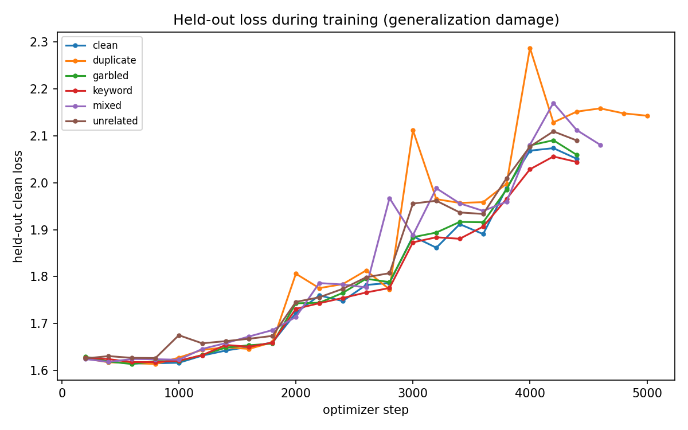
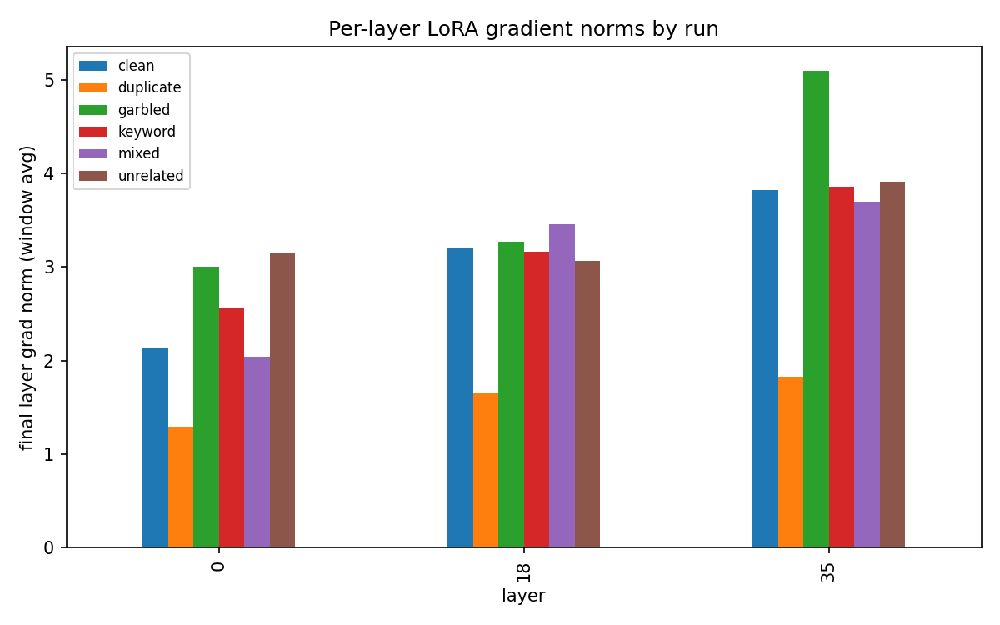
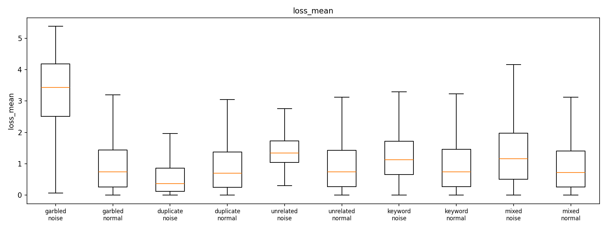
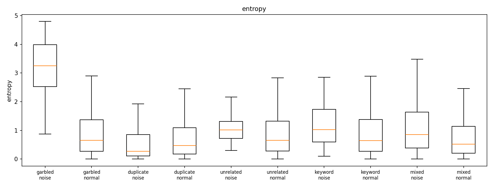
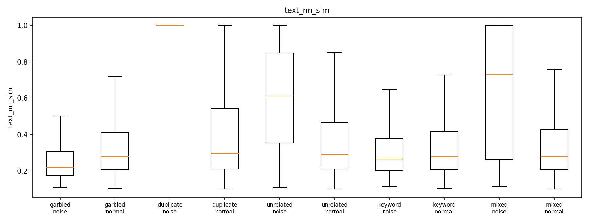
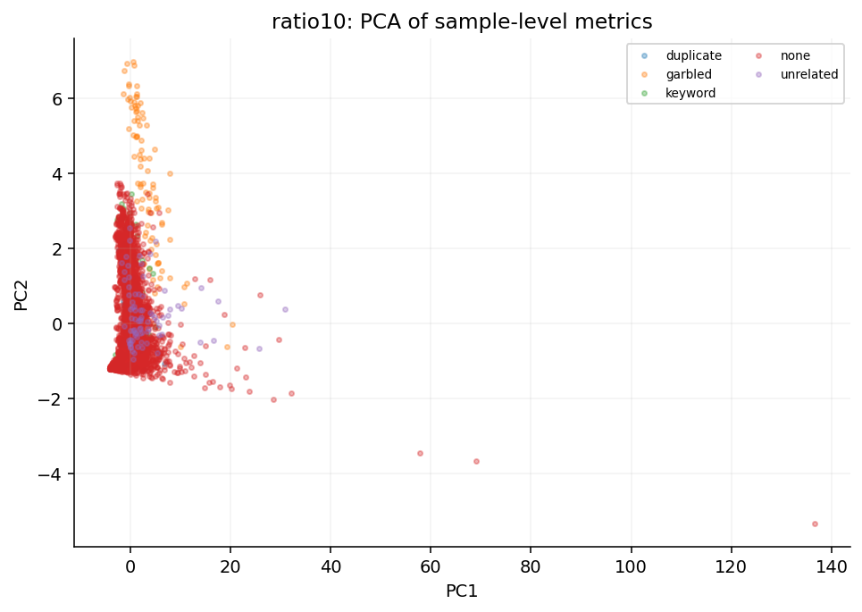
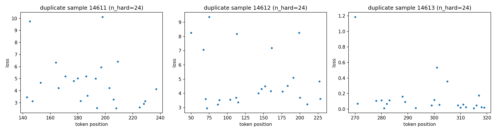

# Impact of Noisy Samples on LLM Fine-tuning: Per-Sample Metric Tracking & Detection Analysis

> Experiment period: 2026-08-12 ~ 2026-08-14
> Base model: Qwen2.5-3B-Instruct (LoRA r=32) · Training data: databricks-dolly-15k
> Noise ratio: 10% · 5 epochs · 14,611 training samples per run

---

## 1. Experimental Setup

### 1.1 Datasets (6, identical sample order, fixed seed)

| Dataset | Noise construction | Rows |
|---|---|---|
| `clean` | original data (baseline) | 14611 |
| `garbled` | 10% samples corrupted with mojibake (Unicode substitution / insertion / char swaps) | 14611 |
| `duplicate` | 10% extra rows that are exact copies | 16072 |
| `unrelated` | 10% samples whose instruction & response come from different categories (response itself is fluent and correct) | 14611 |
| `keyword` | 10% samples with only key entities / numbers / proper nouns replaced, grammar preserved | 14611 |
| `mixed` | the four types above at 2.5% each, 10% total | 14976 |

A shared set of 400 clean held-out samples (`heldout.jsonl`) is used for: computing the pre-training reference gradient direction (LESS-style influence baseline) and the held-out generalization loss during training. Every sample carries `noise_label` / `noise_type` / `category` labels.

### 1.2 Training configuration

- Micro-batch 1 + gradient accumulation 16 → per-sample gradients are exactly captured
- lr 2e-4, cosine decay + 3% warmup, AdamW, bf16 + flash-attention
- 5 epochs per run (4,570~5,025 optimizer steps), single RTX 5090, 3.3~3.9 h per run

### 1.3 Recorded metrics (three levels)

**Sample level (every sample × every epoch, ~73K rows per run):**
`loss`, `grad_norm` (LoRA gradient L2 norm), `cos_sim_ref` (cosine similarity to the clean reference direction), `cos_sim_global` (cosine to the accumulation-window gradient), `update_contrib` (sample gradient relative to Adam-RMS, B matrices), `tokens`

**Diagnostic level (end of each epoch, every 8th sample, ~1,827 rows per run):**
`max_token_loss`, `frac_hard` (fraction of tokens with loss > 4), `user_loss` (mean prompt loss), `entropy` (next-token entropy), `token_loss_skew/kurt`, top-k hardest-token details (position / token id / loss)

**Derived features (analysis time):**
`loss_std`, `loss_slope`, `converge_epoch`, `loss_rank`, `loss_curvature`, `grad_norm_cv`, `cos_ref_trend`, `text_nn_sim` (TF-IDF nearest-neighbor similarity)

**Token level (offline; 60 noise + 60 normal samples per dataset):** for each sample, the top-24 hardest label tokens are individually back-propagated to obtain exact per-token LoRA gradient norms and cosine similarities.

---

## 2. Training Dynamics: How Noise Affects Training

### 2.1 Training loss trajectory (per-epoch mean)

| run | epoch 0 | epoch 1 | epoch 2 | epoch 3 | epoch 4 |
|---|---|---|---|---|---|
| clean | 1.366 | 1.127 | 0.861 | 0.642 | 0.514 |
| garbled | **1.669** | 1.386 | 1.093 | 0.848 | 0.702 |
| unrelated | 1.494 | 1.248 | 0.896 | 0.641 | 0.498 |
| keyword | 1.427 | 1.164 | 0.894 | 0.665 | 0.533 |
| mixed | 1.496 | 1.207 | 0.904 | 0.662 | 0.525 |
| duplicate | 1.349 | 1.077 | 0.794 | 0.557 | **0.425** |

**Findings:**
1. **garbled keeps the highest loss throughout** (epoch 0: +22% over clean; epoch 4: still +37%) — corrupted samples can never be "learned" and continuously inflate the loss;
2. **duplicate converges to the lowest loss** (0.425, 17% below clean) — copies are memorized quickly, *lowering* the training loss (a memorization signal);
3. unrelated / keyword / mixed track clean closely — these noise types disguise themselves well in terms of mean loss.


### 2.2 Held-out clean loss (generalization damage, evaluated every 200 steps)

| run | initial (step 200) | final | increase |
|---|---|---|---|
| clean | 1.628 | 2.051 | +0.423 |
| keyword | 1.627 | **2.044** | **+0.417 (smallest)** |
| garbled | 1.629 | 2.059 | +0.430 |
| mixed | 1.624 | 2.081 | +0.457 |
| unrelated | 1.626 | 2.090 | +0.465 |
| duplicate | 1.626 | **2.143** | **+0.517 (largest)** |

**Findings:** held-out loss rises in *every* run, including clean — 5-epoch LoRA fine-tuning on dolly-15k is itself overfitting. **duplicate overfits the most** (memorization hurts generalization), while **keyword is the mildest**; consistent with the benchmark results in §5.



### 2.3 Per-layer gradient norms (final training window)



---

## 3. Sample-Level Noise Detection

### 3.1 Univariate AUC (noise vs normal samples in the same run)

| Noise type | Best metric | AUC | Runners-up |
|---|---|---|---|
| garbled | loss_curvature | **0.985** | user_loss 0.979 / entropy 0.971 |
| duplicate | text_nn_sim | **0.939** | cos_global_mean 0.610 |
| unrelated | loss_curvature | **0.830** | loss_std 0.827 / grad_norm_mean 0.764 |
| mixed | text_nn_sim | **0.716** | loss_std 0.695 / loss_curvature 0.691 |
| keyword | loss_curvature | **0.669** | loss_std 0.649 / grad_norm_mean 0.639 |

### 3.2 Multivariate classifiers (LR / Random Forest, 19 features, 70/30 split)

| Noise type | LR AUC | RF AUC | Accuracy | Verdict |
|---|---|---|---|---|
| garbled | **0.9996** | 0.9996 | 99.3% | near-perfect separation |
| duplicate | 0.974 | 0.973 | 95.3% | strong |
| unrelated | 0.923 | 0.887 | 94.1% | strong |
| mixed | 0.850 | 0.827 | 92.1% | moderate |
| keyword | **0.531** | 0.551 | (all-normal) | **not separable** |


### 3.3 Noise vs normal distributions of key metrics

<center>

| Loss & gradient | Input-side features |
|---|---|
|  |  |
|  |  |
|  |  |

</center>

> All 19 per-metric distribution figures are in `results/charts/metric_dist_*_ratio10.png`. Each figure is a box-plot of 5 noise types × (noise / normal).

### 3.4 PCA projection of sample features



### 3.5 Metric "fingerprints" per noise type

- **garbled**: both prompt and response are corrupted → `user_loss` and `entropy` spike, loss-trajectory curvature is anomalous (never learned) → the most detectable;
- **duplicate**: textual repetition is its essence → `text_nn_sim ≈ 1.0` is a one-shot hit; training-side features (low loss, memorized) point the *opposite* way from "hard samples";
- **unrelated**: the whole response mismatches the context → elevated `frac_hard` / `loss_slope` (high loss throughout, disguised as a merely difficult sample);
- **keyword**: only a few entity words are changed; text and semantics remain intact → all training-side metrics stay near-normal; **the blind spot of sample-level detection**;
- **mixed**: features dilute each other, but `text_nn_sim` still catches the duplicate subset.

### 3.6 Transferability across task types (stratified by dolly's 8 categories)

| category | RF AUC |
|---|---|
| closed_qa | 0.987 |
| creative_writing | 0.979 |
| information_extraction | 0.977 |
| brainstorming | 0.977 |
| general_qa | 0.943 |
| summarization | 0.942 |
| open_qa | 0.919 |
| classification | **0.870 (hardest)** |

**Findings:** the detection method works across all 8 task types (AUC 0.87~0.99). **classification is the hardest** — short structured responses weaken token-level signals (entropy / user_loss). Garbled detection approaches 1.0 in every category — the most universal detection target.

---

## 4. Token-Level Detection (exact per-token gradient attribution)

Per dataset, 60 noise + 60 normal samples; for each sample the top-24 hardest label tokens are back-propagated individually (`autograd.grad`), yielding features `hard_loss_mean`, `hard_gradnorm_mean`, `hard_cos_ref_mean`, `pos_std`:

| Feature | garbled | duplicate | unrelated | keyword |
|---|---|---|---|---|
| hard_loss_mean | **0.767** | 0.414 | 0.582 | 0.486 |
| hard_gradnorm_mean | **0.767** | 0.414 | 0.601 | 0.502 |
| hard_cos_ref_mean | 0.624 | 0.588 | 0.553 | 0.478 |
| pos_std | 0.571 | 0.461 | 0.533 | 0.411 |

**Findings:**
1. **garbled remains the most separable at token level** (0.77) — corrupted positions produce tokens with locally extreme losses;
2. **duplicate's token-level AUC is below 0.5** — its tokens are perfectly memorized (low loss), indistinguishable from normal ones; its detectability comes entirely from the **data side** (text similarity), not from training dynamics;
3. Token-level AUCs are generally lower than sample-level ones — a single hard token has limited signal-to-noise; aggregating across tokens and epochs is more robust.

<center>

| garbled | duplicate |
|---|---|
|  |  |
| unrelated | keyword |
|  |  |

</center>

> Each figure shows position-loss scatter plots of the top-k hardest tokens for 3 noise samples of the corresponding type (hardest tokens only, not the full sequence).

**Known limitation:** the garbled-localization check (`loc_mismatch_frac`) returned 0 — position-based comparison breaks when character-level corruption shifts tokenization boundaries; a sequence-alignment approach (e.g., edit-distance alignment) is needed to correctly locate corrupted tokens. Left as future work.

---

## 5. Impact on Final Model Capability (7 models × 7 benchmarks)

### 5.1 Overall comparison

| Model | MMLU | GSM8K | HellaSwag | ARC | BBH | TruthfulQA | Winogrande |
|---|---|---|---|---|---|---|---|
| clean | 0.6295 | 0.5413 | 0.2715 | 0.7995 | 0.0741 | 0.1922 | 0.5383 |
| garbled | 0.6354 | 0.5269 | 0.2664 | 0.8080 | 0.0944 | 0.1873 | 0.5359 |
| duplicate | 0.6309 | 0.5125 | 0.2732 | 0.7918 | 0.0778 | 0.1983 | 0.5525 |
| unrelated | 0.6241 | 0.4981 | 0.2705 | 0.7901 | 0.0833 | 0.1824 | 0.5335 |
| keyword | 0.6333 | 0.5231 | 0.2750 | 0.7986 | 0.0759 | 0.1848 | 0.5241 |
| mixed | 0.6315 | **0.5732** | 0.2673 | 0.7952 | 0.0907 | 0.1836 | 0.5375 |
| **base (no SFT)** | **0.6637** | **0.7460** | 0.2745 | **0.8311** | 0.0611 | **0.1934** | **0.5856** |

### 5.2 Key findings

1. **Noise damage is far smaller than the damage of fine-tuning itself**: all six fine-tuned models cluster closely (MMLU 0.624~0.635), while the **base model beats every fine-tuned model on 4/7 benchmarks** (most notably GSM8K: 0.746 vs ~0.52; ARC: 0.831 vs ~0.79). SFT on dolly-15k hurts general ability, and this effect swamps the 10% noise differences;
2. **unrelated is the worst on average** (MMLU −0.005, GSM8K −0.043, ARC −0.009 vs clean) — fluent but context-mismatched responses mislead the model the most;
3. **duplicate is slightly *better* on Winogrande / TruthfulQA** — memorization yields a small positive effect on a few tasks;
4. **BBH is the exception**: fine-tuned models beat the base (0.074~0.094 vs 0.061) — dolly's instruction style helps;
5. **garbled barely harms MMLU** (0.635 > clean 0.630) — 10% corrupted samples are nearly harmless, in sharp contrast to being the *easiest* to detect: **the easiest-to-detect noise is the least harmful**.

### 5.3 MMLU 57-subject breakdown

- Base's strongest subjects: marketing (0.88), high_school_world_history (0.87), high_school_government_and_politics (0.87); weakest: college_mathematics (0.35), global_facts (0.36);
- **Subject-level difference of noise runs vs clean averages only ±0.005** — no significant subject-specific damage (largest single-subject deviation: mixed on anatomy, −0.082);
- Curiously, every noisy run scores *higher* than clean on college_mathematics (+0.05~+0.11) — possibly a mild regularizing effect of noise against overfitting.

### 5.4 Confidence & generation behavior (per-question raw records)

- **MC confidence (margin between best and second-best nll)**: base 3.143 highest; among fine-tuned: unrelated 3.071 > keyword 2.947 > mixed 2.938 > garbled 2.759 > duplicate 2.629 > clean 2.474 — the clean model is the most "hesitant";
- **Generation length**: base averages 109 tokens/question vs ~54 for fine-tuned models — **dolly SFT makes answers markedly more concise** (dolly responses are inherently short).

---

## 6. Conclusions & Discussion

### 6.1 Conclusions

1. **Sample-level detectability ranking**: garbled (0.9996) > duplicate (0.974) > unrelated (0.923) > mixed (0.850) > **keyword (0.531, infeasible)**;
2. **Most effective feature families**: training-dynamics features (loss curvature/variance, user_loss, entropy, gradient variability) capture garbled/unrelated; **data-side features (nearest-neighbor text similarity) are the only effective tool for duplicate**; keyword requires stronger signals (entity-level comparison, counterfactual perturbation);
3. **Detectability is anti-correlated with harm**: the easiest-to-detect garbled noise is nearly harmless to model capability, while the hardest-to-detect semantic noise (keyword / unrelated) is potentially the most damaging — real-world data cleaning should prioritize the *hard-to-detect* semantic noise;
4. **The absolute impact of 10% data pollution is small** (negligible relative to the harm of SFT itself), but duplicate's overfitting effect (held-out +0.517) is the clearest negative signal;
5. The method is robust across task types (8 categories, AUC 0.87~0.99).

### 6.2 Limitations & future work

1. **keyword detection blind spot** — entity-aware detection needed;
2. **garbled localization** — position-based comparison fails; needs sequence alignment;
3. **Noise-ratio extrapolation** — 10% results may not hold at 5%/20% (5% data is ready: `run_experiment.sh --ratio 0.05 --tag ratio05 --reuse-clean`, which reuses the clean run and saves ~3 h);
4. **Single dataset / model** — conclusions are based on dolly-15k + Qwen2.5-3B; a classification-style dataset or larger models require re-validation (category-stratified analysis already gives preliminary transferability evidence);
5. **Eval protocol** — absolute HellaSwag / TruthfulQA scores are low (5-shot / 0-shot interacting with the chat template); between-model comparisons remain valid, but absolute values should be cited cautiously.

### 6.3 Reproduction

```bash
# data + training + evaluation + analysis (10% is the default tag)
python scripts/make_noise.py
bash run_all.sh
bash run_all_eval.sh
python scripts/analyze_detection.py
python scripts/analyze_token_level.py
# other ratios: bash run_experiment.sh --ratio 0.05 --tag ratio05 --reuse-clean
```

---

*This report is compiled from artifacts produced by the experiment pipeline; all raw data lives in `results/` (eval details & per-question records) and `<data_root>/runs/ratio10/` (per-sample metrics).*
