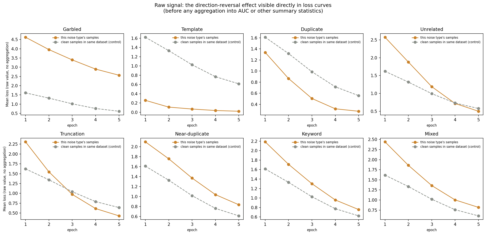
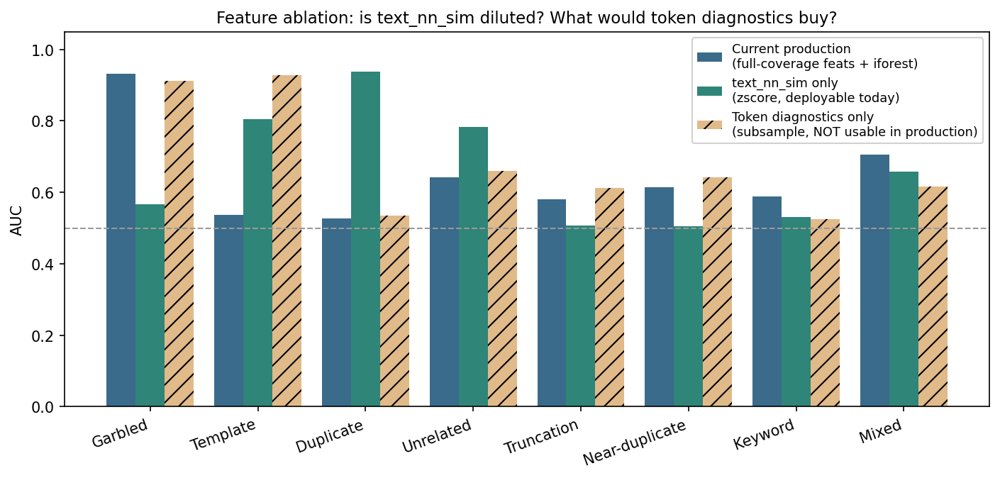
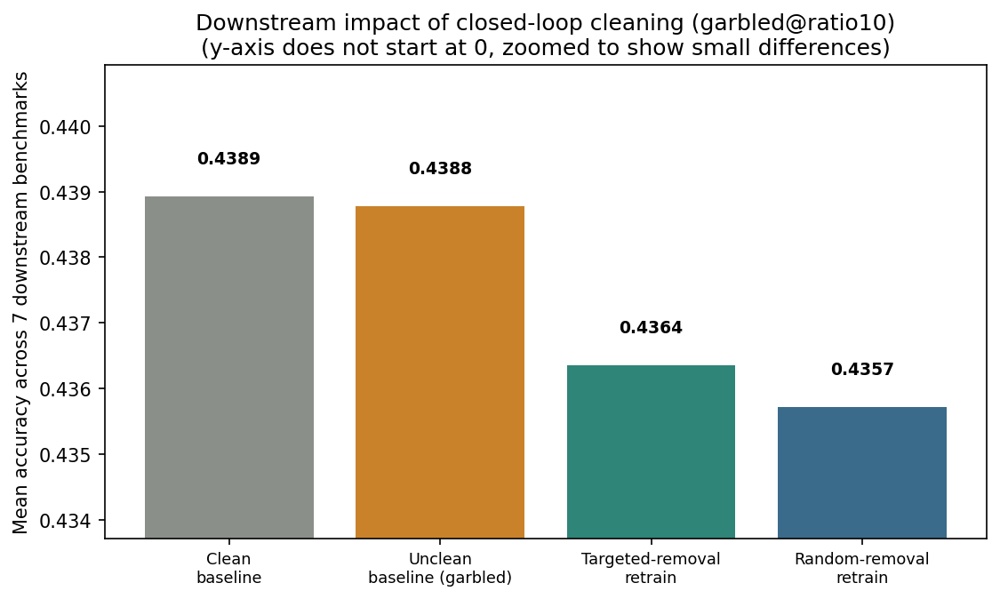

# Noise-Detection Experiment Analysis Report

**Date**: 2026-09-14
**Scope**: `ratio10` (10% noise, 9 datasets, fully complete), `ratio5` (5% noise, cross-validation, downstream eval 7/9 datasets complete)
**Charts**: `results/charts/en/*.png` (generated by `scripts/make_report_charts.py`; the script itself is gitignored, the resulting PNGs are tracked)

---

## 1. Experiment Overview

This project investigates a core question: **without ever using noise labels, can training dynamics captured during LoRA fine-tuning (loss trajectories, gradient norms, cosine similarity, etc.) reveal which training samples were injected as low-quality/anomalous?**

### 1.1 Data and Noise Types

Starting from dolly-15k as the base dataset, 7 noise types are injected, plus `clean` (uncontaminated baseline) and `mixed` (all 7 types combined) — 9 datasets total:

| Noise type | Description |
|---|---|
| `garbled` | Random character substitution/shuffling in the text |
| `template` | Response replaced with a highly repetitive templated sentence |
| `duplicate` | Exact copy of an existing sample |
| `unrelated` | Response mismatched with the question |
| `truncation` | Response cut short, information incomplete |
| `near_duplicate` | Existing sample with a light paraphrase |
| `keyword` | Key entities/terms in the sentence swapped out |

Two experiment tags correspond to two noise ratios:

- **`ratio10`**: 10% noise ratio. All 9 datasets fully trained, analyzed, and evaluated (training completed 2026-09-13 00:48, downstream evaluation completed 2026-09-14 02:20).
- **`ratio5`**: 5% noise ratio, used for cross-validation. Training on all 9 datasets completed 2026-09-14 07:46, the 5 analysis tables completed at 09:35. Downstream benchmark evaluation (tmux session `ratio5_eval`) finished the same day, fully complete (9/9 datasets).

### 1.2 Training Configuration

- Model: Qwen2.5-3B-Instruct, LoRA (r=32) fine-tuning, 5 epochs, per-sample gradient/loss tracking.
- GPU: NVIDIA RTX PRO 6000 Blackwell Server Edition (~98GB), single GPU — all training/evaluation jobs are queued and run sequentially.
- After each dataset finishes training, `runs/{tag}/{dataset}/metrics/per_sample.jsonl` is written with per-sample, per-epoch loss/gradient-norm/cosine-similarity metrics; all downstream analysis is recomputed from these files without ever retraining.

### 1.3 Analysis Methods Overview

Around the "can training dynamics detect noise" question, 10 independent analyses were designed. The report proceeds in three stages:

- **Sections 2-9 — methodological findings**. Each facet of detection capability, examined in turn: within-domain detection difficulty, cross-type transfer, cross-ratio transfer, cleaning-precision lift, the direction-reversal trap, early detection, feature attribution, and actual downstream impact.
- **Sections 10-11 — synthesis and validation**. The scattered findings above are consolidated into "which method to use for which noise type, and what raw data it depends on" (Section 10), then a feature-ablation experiment upgrades the "is all that data actually necessary" judgment from qualitative attribution to quantitative evidence (Section 11).
- **Section 12 — production application**. The validated methods are put to work in label-free closed-loop cleaning, advancing from "can score and rank" to "actually remove and retrain" — the only experiment in the report that produces a real downstream comparison.

Section 13 summarizes conclusions and limitations; Section 14 is the appendix (precise definitions, coverage, and collection timing for every metric).

### 1.4 Noise Sample Examples (Raw Text Comparison)

Every later section discusses abstract statistical conclusions about "detection difficulty" and "feature attribution" — here is the underlying raw data first, so the reader can see exactly what each of the 7 noise types does to the actual text. Except where noted, all examples below come from the same real record, `sample_id=20`, across `data/ratio10/{type}/train.jsonl` (original question: "Why do home power outages occur?"; the clean answer is 1055 characters, opening with "Power outages can occur for a number of reasons. First, some perceived \"outages\" may actually be caused by overloading a circuit breaker in a home..."). Keyword substitution uses `sample_id=74` instead, because sample 20's own keyword perturbation happened to fall outside the excerpt shown here.

| Noise type | Construction (as observed) | Noisy text (excerpt) |
|---|---|---|
| Garbled | Individual characters in both prompt and response are randomly substituted / mixed with full-width and symbol characters; the text becomes essentially unreadable but stays close to the original character count | user: `２ウ０ do homｆ pＭwer outages occuѫ?`　assistant: `oP＊eＣ¥ oＱtages Ｍan cocur for a number of 关eＤosns. Firs⌘t, soＰӜ pe÷rceiv＆d "oをtages" may actuaＤly №e cau７sed by overloadi®g a cＡrＷuit breaker in a hom４e...` |
| Template | The entire response is replaced by a fixed, generic sentence unrelated to the question's content; length drops from 1055 characters to 35 | assistant: `The answer to this question is 42.` |
| Duplicate | The original sample is not modified; instead the entire record is copied and appended as a new row, with `_dup0` appended to the `sample_id` (e.g. `20_dup0`); the text is character-for-character identical to the original | `sample_id=20_dup0`'s user/assistant content is byte-identical to `sample_id=20` (no diff whatsoever) |
| Unrelated | The response is entirely replaced with a different, topically unrelated answer from elsewhere in the dataset; the user question is left unchanged | user: `Why do home power outages occur?` (unchanged)　assistant: `Bernoulli's principle can be derived directly from Isaac Newton's second Law of Motion. If a small volume of fluid is flowing horizontally from a region of high pressure to a region of low pressure...` |
| Truncation | The response is hard-cut at an arbitrary character offset, with no regard for word/sentence boundaries; this example goes from 1055 to 527 characters, cutting off mid-sentence at "This might be due to m" (which was about to continue "maintenance activities") | assistant: `...If you are experiencing a power outage, it may been caused by a few different reasons: - Power safety shutoff: in some situations, a power provider will de-electrify an area to prevent issues. This might be due to m` (527 characters, stops there) |
| Near-duplicate | Meaning is preserved, but words are swapped for synonyms (perceived→perceive, still on→stillness on, power→powerfulness, and reverse substitutions like care→maintenance) and sentences/bullet points are reordered — a "same meaning, different wording and structure" rewrite | assistant: `First, some perceive outage may really be caused by overloading a circuit breaker in a home. To eliminate this as a possibility and confirm the issue is not localized to your home, check to build sure that all circuits in your electrical panel are stillness on. powerfulness outage can occur for a number of reasons...` (the original's two bullet points are also reordered) |
| Keyword (`sample_id=74`) | Only entity nouns (names/places) in the sentence are swapped; sentence structure, grammar, and punctuation are completely unchanged — the second sentence, "Hilda was a sculptor...", even keeps the original names "Hilda"/"Richard" untouched — the smallest perturbation of all 7 types | user: `Given a reference text about ~~Audrey Babette Blackman~~→Riverdale, tell me her parents names and occupations.`　assistant: `~~Audrey Babette Blackman~~→Robert Blackwell parents names were ~~Hilda Sligman and Richard Seligman~~→Kingston and Meridian Health. Hilda was a sculptor and author and Richard was a chemical engineer.` |

This table directly explains the detection-difficulty ranking in Section 2: garbled, template, and truncation make massive edits at the text level (character substitution, full replacement, hard truncation), so it's unsurprising that training dynamics leave a strong trace; near-duplicate and keyword only apply local synonym or entity swaps, leaving sentence structure and most wording untouched — the intuitive reason they have the lowest within-domain AUC of all 7 types (0.674 and 0.577) — and it's the text-level root cause behind Section 8's finding that no stable dominant feature exists for keyword substitution.

---

## 2. Detection Difficulty Landscape: Which Noise Types Are "Visible"

### 2.1 What "Within-Domain Detection AUC" Actually Means: Method and Sample Construction

"Within-domain detection AUC" answers a very specific binary-classification question: **for one particular noise type T, can training-dynamics features alone separate "samples injected with T-type noise" from "genuinely clean samples"?** It does not measure "can all 7 noise types be identified at once" — it is 7 independent binary-classification tasks, each reporting its own AUC.

The exact construction (matching `analyze.py`'s `auc()`/`summarize()`):

- **Positive samples**: rows in dataset T (e.g. `garbled`) with `noise_type == 'garbled'`; **negative samples**: rows in the *same* dataset T with `noise_type == 'none'` (the uncontaminated portion of that same training run). Both come from the same training run / same `tag` — never mixed across datasets.
- **Features**: all 37 numeric columns in `per_sample_metrics.csv` (the training-trajectory / token-diagnostic / text-similarity features defined in Appendix 12.1-12.3), with `dropna(subset=features)` — a row is only included if **all 37 features are non-null**.
- **Classifier and validation**: after `StandardScaler` normalization, `StratifiedKFold(n_splits=5, shuffle=True, random_state=0)` 5-fold stratified cross-validation, training one `RandomForestClassifier(n_estimators=200)` per fold; the final AUC pools each sample's out-of-fold predicted probability (from whichever fold it fell into as test data) across all 5 folds and computes a single AUC over the whole set — not an average of 5 separate AUCs.

**An easily-overlooked but important detail — the effective sample size is far smaller than the dataset's total size**: 13 of the 37 features are the token-level diagnostic features from Section 14.2 (`max_token_loss`, `frac_hard`, `hard_loss_mean`, etc.), which are only produced during the forward-only diagnostic pass at `diag_subsample=8` (every 8th sample), giving roughly 12.5% coverage. Requiring all 37 features to be non-null effectively keeps only the small subset of samples that happened to land in the diagnostic subsample *and* showed at least one "hard token" in at least one epoch. In practice, the number of samples that actually enter the computation for this section, Section 3, Section 8, and the `iforest`/`zscore` columns of Section 6's table is:

| Dataset | Total n | Of which noise (n_noise) |
|---|---|---|
| duplicate | 995 | 89 |
| garbled | 904 | 85 |
| keyword | 906 | 87 |
| near_duplicate | 906 | 87 |
| template | 906 | 87 |
| truncation | 905 | 86 |
| unrelated | 904 | 85 |

Each dataset effectively uses only about 900-1000 samples (vs. roughly 14,611-16,072 in the full dataset, i.e. about 6-7% coverage), and the positive/negative ratio is reshuffled by the subsampling process (the noise fraction stays close to 9-10% throughout, suggesting the subsampling itself is not systematically biased toward or against noise samples — but the absolute sample size is genuinely much smaller). Section 6's `memo_signed` column, by contrast, uses only 6 features with 100% coverage (no token-diagnostic features) and is computed on the *full* sample — **the two columns in that same comparison table do not share the same sample size**, which matters when reading that table.

### 2.2 Raw Data Example: One Noisy Sample vs. One Clean Sample, Real Feature Values

Taking `garbled@ratio10` as an example, here is a real noisy sample (`sample_id=10136`, which happens to fall in the diagnostic subsample) compared against a real clean sample (`sample_id=0`) on their actual values in `per_sample_metrics.csv`:

| Feature | Noisy sample (garbled, `sample_id=10136`) | Clean sample (`sample_id=0`) | Note |
|---|---|---|---|
| `loss_mean` | 2.60 | 1.62 | The garbled sample's average loss across 5 epochs is noticeably higher — the text itself is unpredictable |
| `loss_curvature` | 5.52 | 6.32 | The two are close in magnitude — this one feature alone would not separate them well |
| `user_loss` | 4.94 | 4.08 | Even the prompt segment becomes harder to predict under garbled noise, raising `user_loss` — this is the concrete numeric evidence behind Section 8's finding that the garbled detector relies most heavily on `user_loss` |
| `entropy` | 2.63 | 0.45 | Nearly a 6x gap — the model is far more uncertain about what to generate for garbled text |
| `frac_hard` | 0.20 | 0.00 | 20% of tokens in the noisy sample exceed the hard-token loss threshold of 4.0; the clean sample has none |
| `max_token_loss` | 6.04 | 0.64 | Almost a 10x gap on the single hardest token — the most visually obvious separation of any feature here |

These real numbers show that the random forest's 0.998 AUC on garbled is not an abstract statistical coincidence — `entropy`/`max_token_loss`/`user_loss` genuinely differ by several-fold between noisy and clean samples.

Using a random-forest classifier on training-dynamics features with 5-fold cross-validation gives a "within-domain detection AUC" for each noise type:

| Noise type | ratio10 AUC | ratio5 AUC |
|---|---|---|
| Template | 0.999 | 1.000 |
| Garbled | 0.998 | 0.993 |
| Duplicate | 0.986 | 0.985 |
| Unrelated | 0.925 | 0.967 |
| Truncation | 0.763 | 0.764 |
| Near-duplicate | 0.674 | 0.759 |
| Keyword | 0.577 | 0.634 |

**Conclusions**:

- Template, garbled, and duplicate are nearly "perfectly detectable" (AUC > 0.98), meaning these noise types leave a very strong signature in training dynamics.
- Keyword substitution and near-duplicate are the two clear hard cases — AUC is only modestly above the random baseline (0.5), meaning these "light perturbation" noise types leave almost no trace at the training-dynamics level.
- The ranking is identical across both noise ratios (10% vs 5%), and for the three harder types (unrelated/truncation/near_duplicate/keyword), ratio5's AUC is actually slightly *higher* than ratio10's — early evidence that this ranking is stable rather than a coincidence of one specific noise ratio. Section 4's cross-ratio transfer analysis confirms this further.

---

## 3. Cross-Type Transfer: Can a Detector Generalize Across Noise Types?

The figure above is the 7×7 transfer matrix under `ratio10`: each row is the noise type the detector was trained on, each column is the noise type it was tested on, and the diagonal reproduces the within-domain AUC from Section 2.

**Method**: for each off-diagonal cell `(source type → target type)`, the code (`analyze.py::fit_transfer`) trains both a `LogisticRegression(max_iter=2000)` and a `RandomForestClassifier(n_estimators=200)` on the **source** type's dataset (the `StandardScaler` is fit only on the source data and merely applied via `transform` on the target — never refit — so what's being measured is the detector's actual transfer ability, not the convenience of re-normalizing on the target), evaluates both on the target type's dataset, and keeps whichever gives the higher AUC as that cell's value. The matrix's **diagonal is not a fresh "train and test on the same data" run — it directly reuses the within-domain AUC from Section 2's 5-fold cross-validation**, so the diagonal and off-diagonal cells are on the same footing (otherwise the diagonal would be inflated by training and testing on the same data).

A few representative off-diagonal cells (from `results/ratio10/cross_type.csv`): `template→garbled` is only 0.403 (well below the 0.5 random baseline — a directional reversal); `unrelated→template` is only 0.321 (also reversed, and even more extreme than `template→garbled`); yet `template→duplicate` reaches 0.896 — showing a detector trained on template is not uniformly bad on every target: it transfers positively to the structurally similar duplicate type, while completely failing (or reversing) on the structurally very different garbled type.

**Key findings**:

- **Diagonal mean AUC 0.846 vs. off-diagonal mean 0.675** — cross-type transfer loses about 17-20 points on average, meaning a substantial part of the discriminative signal in training-dynamics features is **type-specific**; there is no single "universal detector" that can be applied unchanged to an unseen noise type.
- **Template is the most isolated type**: a detector trained on template transfers to the other 6 types with AUC typically 0.40-0.59 (some even below the random baseline — e.g. transferring to garbled only reaches 0.40). Conversely, detectors trained on other types generally perform poorly when tested on template (e.g. unrelated→template is only 0.32, clearly below the 0.5 random baseline — a **directional reversal**, meaning the detector's judgment on template samples is systematically inverted). This is the same mechanism as the "direction-reversal trap" discussed in Section 6, showing up in the cross-type setting.
- **Garbled transfers the most easily**: detectors trained on most other types still reach 0.93-0.98 AUC when tested on garbled, showing that garbled's training-dynamics anomaly (e.g. persistently elevated loss) is generic enough not to depend on a type-specific feature pattern.
- **Keyword is weak in both directions**: not only is its within-domain CV only 0.577, but AUC transferring both into and out of keyword is generally low as well — consistent with the conclusion that keyword substitution is the hardest type to detect.

**Practical implication**: a production label-free detector cannot be trained on one known noise type and be expected to generalize to unknown types; it either needs separate calibration per plausible noise pattern, or should lean on the feature-attribution results in Section 8 to design more generic rules.

---

## 4. Cross-Ratio Transfer: Almost Lossless

In contrast to the cross-type transfer in Section 3, this section fixes the noise type and tests whether a detector trained at a 10% noise ratio transfers to 5% (and vice versa).

**Method**: uses the same `fit_transfer` function as Section 3's cross-type transfer (`analyze.py::cross_ratio_transfer`); the only difference is how "source/target" are paired — here source and target are the **same noise type at two different noise ratios** (e.g. `ratio10→ratio5` means fitting on `ratio10/garbled` and evaluating on the corresponding `ratio5/garbled`), rather than being paired by noise type as in Section 3. Both directions (`ratio10→ratio5`, `ratio5→ratio10`) are trained independently, and the diagonal (not shown in this table, i.e. "within-tag within-domain AUC") likewise reuses Section 2's already-computed within-domain CV result rather than being recomputed.

| Noise type | ratio10→ratio5 AUC | ratio5→ratio10 AUC |
|---|---|---|
| Template | 1.000 | 1.000 |
| Garbled | 0.996 | 0.997 |
| Duplicate | 0.990 | 0.986 |
| Unrelated | 0.985 | 0.948 |
| Truncation | 0.966 | 0.880 |
| Near-duplicate | 0.895 | 0.790 |
| Keyword | 0.898 | 0.751 |

**Key finding: cross-ratio transfer AUC is ≥0.75 across the board, mostly ≥0.88, and retention (transferred AUC / within-domain AUC) is mostly ≥1.0 — transfer loses almost nothing, and in some cases actually improves.** For example, keyword ratio10→ratio5 reaches 0.898, well above ratio5's own within-domain CV of 0.634; near-duplicate ratio10→ratio5 reaches 0.895, well above its own within-domain CV of 0.759. This suggests that pooling training-dynamics data across the two noise ratios actually produces a more robust decision boundary, rather than overfitting to one specific noise density.

**Conclusion when compared with Section 3**: the discriminative signal that training-dynamics features carry for "noise type" is stable across noise ratios (and can even transfer positively) — a detector does not need to be retrained for every noise ratio. **The real transfer bottleneck is cross-noise-type, not cross-noise-ratio.** This is practically significant: if the production noise ratio fluctuates over time, the detector does not need to be retrained because of that alone.

---

## 5. Cleaning-Precision Lift: High AUC Doesn't Mean Useful Under a Cleaning Budget

AUC measures overall ranking ability, but in practice cleaning can only remove a small slice of samples (e.g. the top 10%). In that regime, the metric that actually matters is **P@10% lift** — the hit rate of true noise samples in the removed top 10%, relative to random removal.

**Exact computation** (`analyze.py::precision_at_k`/`precision_lift_table`): for a dataset of size n, `k = round(0.10 * n)`; sort all samples by anomaly score descending and take the top k; `p_at_10` = the fraction of those k samples that are true noise; `random_p` = the overall true-noise fraction of that dataset (the expected hit rate of "blindly removing at random"); `lift = p_at_10 / random_p`. Three candidate label-free scorers:

- `zscore_max` / `zscore_mean`: a robust z-score per feature, `(x - median) / (1.4826 * MAD)` (MAD = median absolute deviation), then either the **max** or the **mean** of the absolute values across features as the sample's anomaly score.
- `iforest`: after `StandardScaler` normalization, an `IsolationForest(n_estimators=300)` is fit **independently per dataset** (never pooled across datasets), using the negative `score_samples` (higher = more anomalous) as the score.

The table below is the complete raw result for every dataset × all 3 methods under `ratio10` (the main summary table in this section only shows, per dataset, the single row with the highest lift — which can hide the fact that switching methods on the same dataset can flip the conclusion entirely):

| Dataset | Method | n | n_noise | AUC | P@10% | random_p | lift |
|---|---|---|---|---|---|---|---|
| garbled | iforest | 904 | 85 | 0.936 | 0.556 | 0.094 | **5.91** |
| garbled | zscore_mean | 904 | 85 | 0.873 | 0.311 | 0.094 | 3.31 |
| garbled | zscore_max | 904 | 85 | 0.664 | 0.089 | 0.094 | 0.95 |
| mixed | iforest | 919 | 92 | 0.662 | 0.228 | 0.100 | **2.28** |
| mixed | zscore_mean | 919 | 92 | 0.633 | 0.174 | 0.100 | 1.74 |
| mixed | zscore_max | 919 | 92 | 0.604 | 0.054 | 0.100 | 0.54 |
| unrelated | iforest | 904 | 85 | 0.703 | 0.189 | 0.094 | **2.01** |
| unrelated | zscore_mean | 904 | 85 | 0.596 | 0.167 | 0.094 | 1.77 |
| unrelated | zscore_max | 904 | 85 | 0.604 | 0.111 | 0.094 | 1.18 |
| truncation | zscore_max | 905 | 86 | 0.657 | 0.178 | 0.095 | **1.87** |
| truncation | zscore_mean | 905 | 86 | 0.610 | 0.144 | 0.095 | 1.52 |
| truncation | iforest | 905 | 86 | 0.598 | 0.156 | 0.095 | 1.64 |
| template | zscore_mean | 906 | 87 | 0.803 | 0.165 | 0.096 | **1.72** |
| template | iforest | 906 | 87 | 0.522 | 0.066 | 0.096 | 0.69 |
| template | zscore_max | 906 | 87 | 0.878 | 0.022 | 0.096 | 0.23 |
| near_duplicate | iforest | 906 | 87 | 0.599 | 0.132 | 0.096 | **1.37** |
| near_duplicate | zscore_max | 906 | 87 | 0.507 | 0.121 | 0.096 | 1.26 |
| near_duplicate | zscore_mean | 906 | 87 | 0.549 | 0.110 | 0.096 | 1.14 |
| keyword | zscore_max | 906 | 87 | 0.520 | 0.110 | 0.096 | **1.14** |
| keyword | zscore_mean | 906 | 87 | 0.525 | 0.110 | 0.096 | 1.14 |
| keyword | iforest | 906 | 87 | 0.552 | 0.099 | 0.096 | 1.03 |
| duplicate | zscore_mean | 995 | 89 | 0.542 | 0.050 | 0.089 | **0.56** |
| duplicate | iforest | 995 | 89 | 0.612 | 0.050 | 0.089 | 0.56 |
| duplicate | zscore_max | 995 | 89 | 0.604 | 0.040 | 0.089 | 0.45 |

(Bold = the "best method" shown in this section's main summary table; `n`/`n_noise` match Section 2, since unsupervised scoring is likewise computed only on the diagnostic-subsample rows where all 37 features are non-null.) This full table reveals two details the summary table hides: **the spread across methods for garbled is huge** (iforest 5.91x vs. zscore_max 0.95x — the same dataset flips from "highly useful" to "worse than random" depending on the scoring method); **template's zscore_max method (0.23x) is one of the worst combinations in the entire table**, even though the same dataset reaches 1.72x under zscore_mean — showing that "choosing the right method" matters as much as "choosing the right dataset."

| Noise type | ratio10 best-method lift | ratio5 best-method lift |
|---|---|---|
| Garbled | 5.91 (iforest) | 7.40 (iforest) |
| Mixed | 2.28 (iforest) | 2.96 (iforest) |
| Unrelated | 2.01 (iforest) | 2.49 (iforest) |
| Truncation | 1.87 (zscore_max) | 2.32 (zscore_max) |
| Template | 1.72 (zscore_mean) | 1.74 (zscore_mean) |
| Near-duplicate | 1.37 (iforest) | 1.99 (zscore_mean) |
| Keyword | 1.14 (zscore_max) | 1.99 (zscore_max) |
| **Duplicate** | **0.56 (zscore_mean)** | **0.89 (zscore_max)** |

**Key warning**: for **duplicate** noise, despite a within-domain AUC as high as 0.986 (Section 2), the P@10% lift is below 1 (only 0.56x at ratio10, 0.89x at ratio5) — meaning that removing the top-10%-scored samples according to this detector actually hits *fewer* true noise samples than removing a random 10%. This happens because the duplicate score distribution can be tightly clustered outside the "useful" region for a strict top-k cut; AUC, being a global ranking metric, masks this local failure under a budget constraint.

**Methodological implication**: ranking cleaning methods by AUC and by P@10% lift produces different "best method" conclusions — choosing a cleaning strategy by AUC alone is biased. Any detection method claimed to be usable for automated cleaning should report precision under a realistic cleaning budget, not just AUC.

---

## 6. The Direction-Reversal Trap: Memorized Noise Needs a Signed Rule

This is one of the project's most important methodological findings. Standard unsupervised outlier detection (IsolationForest, etc.) assumes "noise = anomaly = outlier." But for samples that are **perfectly memorized and hyper-typical** (template, duplicate), training dynamics actually become **more regular, less outlier-like** (loss converges quickly to far below normal, gradient norm shrinks fast) — the exact opposite of the "outlier" intuition.

**Exact construction** (`analyze.py::memorization_score`, `MEMO_FEATS`): `memo_signed` uses only 6 fully-covered trajectory features — `loss_mean, loss_last, loss_std, loss_curvature, converge_epoch, grad_norm_mean` — and, unlike iforest's "data-driven, algorithm learns its own direction" approach, **fixes the sign coefficient of all 6 features to -1 a priori** (no fitting involved at all): each feature gets a robust z-score, multiplied by -1, and the results are averaged. In other words, this rule explicitly encodes the prior assumption "lower loss, faster convergence (smaller `converge_epoch`), smaller gradients = more likely to be perfectly-memorized hyper-typical noise" — rather than letting the model discover the outlier direction on its own. This is exactly why it reverses iforest's failure on template: iforest is a direction-agnostic generic anomaly detector, while `memo_signed` is a rule with a built-in directional prior.

**A note on sample size**: because `memo_signed`/`low_loss_only` (the "signed memorization rule" column below, from `results/ratio10/memorization.csv`) depends only on these 6 fully-covered features, it is computed on the **full sample** (roughly 14,611-16,072 rows, slightly more for duplicate since that noise process adds new rows). The left column below, "generic unsupervised iforest AUC" (from `results/ratio10/unsupervised.csv`), follows the same 37-feature, all-non-null constraint described in Section 2.1, and is only computed on the ~900-1000-row diagnostic subsample. **The two columns in this same table differ in sample size by roughly 15x — they are two different sample populations, not the same samples scored two different ways.** This is another place in the report, besides Section 2.1, where the sample-size basis needs to be flagged explicitly.

| Noise type | Generic unsupervised iforest AUC | Signed memorization rule (memo_signed) AUC |
|---|---|---|
| Garbled | 0.936 | 0.017 |
| Unrelated | 0.703 | 0.274 |
| Duplicate | 0.612 | 0.654 |
| Mixed | 0.662 | 0.380 |
| Keyword | 0.552 | 0.330 |
| Truncation | 0.598 | 0.352 |
| Near-duplicate | 0.599 | 0.346 |
| **Template** | **0.522 (near random)** | **0.925 (near-perfect)** |

**Template is the clearest example**: the generic unsupervised method only achieves AUC 0.522 — essentially a coin flip. But switching to a signed rule whose **direction is fixed a priori by the memorization hypothesis** (rather than being fitted per dataset) — i.e., pre-assuming "lower loss, faster convergence, smaller gradients = more likely to be memorized hyper-typical noise" instead of letting the algorithm discover the outlier direction itself — immediately lifts AUC to 0.925.

Conversely, garbled — a genuinely "high-loss, model-can't-learn-it" type of noise — completely fails under the signed memorization rule (AUC only 0.017, i.e. **almost exactly inverted**), because its nature is that the model can't learn it, not that the model has memorized it.

**Practical implication**: there is no single unsupervised anomaly-detection approach that covers every kind of "training anomaly." At minimum, two categories need to be distinguished — "unlearnable" noise (e.g. garbled, use standard outlier detection) and "memorized/hyper-typical" noise (template, duplicate, needs a signed prior rule) — and treated accordingly.

### 6.1 Raw Signal: The Direction-Reversal Effect Directly Visible in Loss Curves

The sections above rely heavily on AUC as the primary framing, because comparing across 7 noise types × multiple methods × multiple epochs requires a common scale that raw feature values don't have (garbled's anomaly is "loss too high," template's anomaly is "loss too low" — putting both in one raw-value table doesn't work). But AUC is ultimately a statistic aggregated from raw data, so here we plot the raw signal that drives it directly: for all 8 non-clean `ratio10` datasets, we split each dataset into "this noise type's samples" and "`noise_type=='none'` clean samples" (the within-dataset control), then take the plain arithmetic mean of the raw per-sample loss from `runs/ratio10/{type}/metrics/per_sample.jsonl` at each epoch — no z-scoring, no curvature fitting, no feature engineering of any kind, just the raw numbers.

- **Garbled**: the noisy group's loss drops from 4.62 at epoch 1 to 2.56 at epoch 5, but stays **far above** the within-dataset clean control the entire time (1.61→0.61) — the two lines never come close. This is the raw numerical basis for the 0.998 within-domain AUC in Section 2 and the 0.936 iforest AUC in Section 6: the model genuinely cannot learn this garbled text.
- **Template**: the most extreme case of "direction reversal" — the noisy group's loss is already only 0.257 at epoch 1 and collapses to 0.021 by epoch 5, ending up **far below** the clean control (1.62→0.61). It's not "looking normal" — it's more "normal" than normal samples: the model has essentially memorized these highly templated samples from the very first epoch. This is what the raw curve behind Section 6's memo_signed AUC of 0.925 (versus iforest's mere 0.522, which assumes "outlier = noise" and gets the direction wrong) actually looks like.
- **Duplicate**: the same reversal shows up (noisy group 1.33→0.27, consistently below the clean control's 1.61→0.56), but the gap is nowhere near as extreme as template's — matching Section 6's finding that both iforest (0.612) and memo_signed (0.654) AUC for this type are middling, i.e. the reversal here is only partial.
- **Unrelated, truncation, near-duplicate, keyword, and mixed**: for these five types the noisy group's loss stays **above** the clean control throughout (the opposite of template/duplicate's reversal), but the two lines gradually converge as training proceeds — for unrelated they nearly touch by epoch 4-5. This says these noise types are harder for the model to memorize than template, but not as unlearnable as garbled — they sit in the middle ground between the two extremes. This lines up with their middling 0.55-0.70 iforest AUC and their generally low memo_signed AUC (memo_signed's prior assumes "lower loss = more likely noise," but these types' loss is actually elevated, so the prior direction is simply wrong for them).

**This chart directly answers the question of why the report shows raw loss data relatively sparingly**: it isn't that the raw data was unimportant or overlooked — AUC itself is a cross-dataset-comparable quantification of exactly how far apart these two groups' curves are. Garbled and template, where the two lines are visibly far apart at a glance, correspond to their high AUC; unrelated, truncation, near-duplicate, and keyword, where the two lines gradually converge over epochs, correspond directly to the limited or declining AUC-over-epoch trend for these types discussed in Section 7. In other words, AUC is the normalization the report is **forced to use** whenever it compares across noise types — but every place AUC appears can be traced back to a concrete pair of raw loss curves like these; this subsection makes that correspondence explicit.

---

## 7. Early Detection: Usable Signal Before Training Even Finishes

All analyses above use trajectory features from the full 5-epoch training run. Here we test: if the trajectory is truncated to the first k epochs and detection metrics are recomputed, how early can usable signal be obtained?

**Method** (`analyze.py::early_detection_sweep`): this is not "actually stopping training after 1 epoch" — it is a **post-hoc truncation simulation** run on logs from a completed 5-epoch training run. `max_epoch` is restricted in turn to 0, 1, 2, 3, 4 (i.e. keeping only the first 1/2/3/4/5 epochs of records), `build_table` is recomputed on the truncated data, and `unsupervised_metrics`/`memorization_score` are rerun from scratch at each cutoff. To keep the cutoffs comparable, only a "core" feature subset with full coverage at every cutoff point is used (excluding token-diagnostic features that need at least 2 epochs to compute a slope/trend). So the curves below show "what detection performance would look like, recomputed with the same feasible feature set, if training had actually stopped this early" — not a genuine early-stopped-training experiment. Whether real early-stopped training (where the optimization trajectory itself would differ) gives the same results was not tested here.

Both panels now plot all 8 datasets (the 7 noise types plus mixed), so the same noise type's trend under the two scoring methods can be compared directly instead of each panel showing only a curated subset.

**Left panel (generic unsupervised iforest, all 8 datasets)**:

- **Garbled**: AUC is already 0.901 after epoch 1, reaching 0.929 by epoch 5 — strong from the very first epoch, with training contributing only a small marginal gain.
- A **counter-intuitive phenomenon**: template (0.713→0.564), duplicate (0.616→0.520), unrelated (0.715→0.632), and truncation (0.601→0.569) all see AUC **decrease** to varying degrees as training progresses under the generic iforest rule, with template showing the largest drop — this is the same mechanism as the "direction reversal" in Section 6, playing out along the training timeline: the longer these "hyper-typical/memorized" samples are trained, the less they look like outliers.
- Keyword (0.555→0.579) and near-duplicate (0.592→0.602) stay roughly flat with minor fluctuation; mixed (0.750→0.702, itself a composite signal from all 7 injected noise types) sits between the "declining" and "flat" groups.

**Right panel (signed memorization rule memo_signed, all 8 datasets)**:

- **Template**: AUC is already 0.91 at epoch 1, almost as good as the fully-trained value (0.925) — again nearly saturated from the first epoch.
- Duplicate: rises from 0.59 at epoch 1 (with a dip) to 0.65 at epoch 5, a modest gain from continued training.
- Unrelated (0.24-0.27), garbled (only 0.02-0.03 throughout, i.e. almost fully reversed), keyword (0.32-0.33), and near-duplicate (0.34-0.35) all stay well below what the left panel's iforest achieves for these same types — confirming that this direction-fixed prior rule only works for "memorized" noise (template, duplicate), and is unsuitable for both the "unlearnable" type (garbled) and the lightly-rewritten types (keyword, near-duplicate, unrelated).
- Truncation (0.271→0.352) and mixed (0.354→0.380) rise modestly with training but remain clearly below their own iforest performance in the left panel (around 0.6), indicating that early detection for these two types should rely on the generic iforest rather than memo_signed.

**Practical implication**: garbled and template can be scored and removed right after epoch 1, saving the compute of 4 further epochs spent on clearly-noisy samples. The other types (especially keyword, near-duplicate, truncation) have no "early-stopping" shortcut and still require full training or at least several epochs of accumulated signal.

---

## 8. Feature Attribution: What Is the Detector Actually Looking At?

Every analysis so far answers "can it be detected." This section uses permutation importance (rather than RF's biased built-in impurity-based importance) to answer "which feature is the detector actually using."

**Exact computation** (`analyze.py::feature_attribution`): reuses the exact same 5-fold cross-validation RF setup as Section 2.1 (the same ~900-1000-row diagnostic subsample, the same `RandomForestClassifier(n_estimators=200)`), but instead of reading RF's built-in `feature_importances_` (impurity-based, with a known systematic bias toward high-cardinality/continuous features), each fold calls `sklearn.inspection.permutation_importance(n_repeats=20, scoring='roc_auc')` — shuffling one feature column's values in the test fold 20 times and measuring how much AUC drops relative to the unshuffled baseline each time; the mean across 20 shuffles is that feature's importance for that fold (and the standard deviation reflects how much the 20 shuffles disagreed), then this is averaged again across the 5 folds. The direct meaning of "importance" here is therefore "how much does shuffling this feature hurt AUC" rather than "how often this feature was used to split a tree" — closer to a causal notion of contribution.

Taking keyword substitution (the single hardest-to-detect type of the 7) as an example, here is the complete top-8 feature-attribution ranking (`results/ratio10/feature_attribution.csv`):

| Rank | Feature | Importance | Importance std |
|---|---|---|---|
| 1 | `loss_slope` | 0.0204 | 0.0121 |
| 2 | `hard_loss_max` | 0.0087 | 0.0058 |
| 3 | `max_token_loss` | 0.0080 | 0.0074 |
| 4 | `cos_ref_trend` | 0.0059 | 0.0089 |
| 5 | `grad_norm_last` | 0.0053 | 0.0179 |
| 6 | `loss_curvature` | 0.0036 | 0.0051 |
| 7 | `entropy` | 0.0034 | 0.0091 |
| 8 | `loss_std` | 0.0026 | 0.0164 |

This table makes concrete exactly why keyword substitution is hard to detect: the top feature `loss_slope` only reaches an importance of 0.02 (compare duplicate's top feature `text_nn_sim` at 0.148 — over 7x higher), and starting from rank 5 (`grad_norm_last`), the `importance_std` (0.018) already **exceeds the importance itself** (0.005) — meaning that across the 5 cross-validation folds, these features' relative importance is highly unstable: one fold might show a feature as important, another might show it as nearly useless. This isn't a case of one feature "hiding deep" — keyword substitution, which only swaps 1-2 entity words while leaving sentence structure entirely intact, simply doesn't leave a stable, reproducible trace in either training dynamics or text statistics (consistent with the raw text examples in Section 1.4).

**The most important finding — for two noise types, the detection signal comes almost entirely from something other than training dynamics**:

| Noise type | Top feature | Importance | 2nd feature | Importance | Gap |
|---|---|---|---|---|---|
| Duplicate | `text_nn_sim` (text similarity, a data-level feature) | 0.148 | `cos_global_last` | 0.0093 | 16x |
| Unrelated | `text_nn_sim` | 0.083 | `token_loss_skew` | 0.0123 | 7x |

`text_nn_sim` is TF-IDF nearest-neighbor cosine similarity, computed from the **raw text itself**, unrelated to training dynamics. This means the high AUC reported for duplicate and unrelated in Sections 2-3 is, in substance, **not a contribution of the training-dynamics detection methodology** — it's closer to "using an off-the-shelf text-similarity feature to detect noise, with model training essentially along for the ride." This is an exception that must be honestly flagged under this project's core narrative of "label-free detection via training dynamics."

**For the other 5 types, the top features are genuine training-dynamics quantities**:

- Garbled is dominated by `user_loss` (0.016) — garbled text causes the response segment's loss to be uniformly elevated.
- Keyword is dominated by `loss_slope` (0.020), but the overall importance values are small and often have a standard deviation larger than the mean — consistent with keyword being the hardest-to-detect type: no single feature contributes stable signal.
- Truncation is dominated by `loss_slope`/`loss_std` (0.027/0.021).
- Near-duplicate and template are dominated by the `hard_*` family of token-level hard-example features.
- **Template** is another notable case: its own-AUC is near-perfect (0.999), yet every feature's permutation importance is tiny (the top one, `hard_id_uniq`, is only 0.0015) — when a type is "too easy to detect," redundant/correlated features dilute each other's marginal contribution. This does not indicate unreliable detection; it is the normal behavior of permutation importance on a near-saturated task.

---

## 9. Actual Downstream Impact: Does Noise Really Hurt Model Performance?

Everything above answers "can noise be detected." This section addresses a more fundamental question: **does injecting noise actually degrade the model's downstream task performance?** (Mean accuracy across 7 benchmarks: MMLU / GSM8K / HellaSwag / ARC / BBH / TruthfulQA / Winogrande.)

**Raw data: broken down per benchmark, not just the mean.** The table below shows `clean` / `template` / `near_duplicate` (ratio10) accuracy on each of the 7 benchmarks individually (from `results/eval/eval_ratio10_{dataset}.json`):

| Benchmark | n | clean | template | near_duplicate | template - clean |
|---|---|---|---|---|---|
| GSM8K | 1319 | 0.5497 | **0.4602** | 0.5679 | **-0.0895** |
| BBH | 540 | 0.0926 | 0.0500 | 0.0889 | -0.0426 |
| TruthfulQA | 817 | 0.1787 | 0.1873 | 0.1971 | +0.0086 |
| Winogrande | 1267 | 0.5367 | 0.5478 | 0.5359 | +0.0111 |
| MMLU | 14042 | 0.6332 | 0.6434 | 0.6286 | +0.0102 |
| ARC | 1172 | 0.8046 | 0.8157 | 0.8072 | +0.0111 |
| HellaSwag | 10042 | 0.2770 | 0.2776 | 0.2750 | +0.0006 |
| **Mean of 7** | — | **0.439** | **0.426** | 0.443 | -0.013 |

This table reveals a real effect the "mean of 7" number masks: **on GSM8K, template actually drops 8.95 points relative to clean (0.5497→0.4602)** — the only benchmark where the drop reaches a near-double-digit percentage-point magnitude. But because the other 6 benchmarks show template performing roughly flat or even slightly *better* than clean (MMLU/ARC/Winogrande all tick up modestly), the average nets out to only a 1.3-point drop (0.439→0.426). Looking only at the mean makes it easy to mistake this for "small fluctuations across the board," when the real structure is "one benchmark genuinely damaged, six essentially unaffected or showing a spurious small uptick." GSM8K is a numeric-reasoning task that places the highest demand on precise, coherent generated output, consistent with the hypothesis that template noise teaches the model to produce templated/perfunctory responses. BBH, with only n=540 (the smallest sample of all 7 benchmarks), should have its -4.26-point drop interpreted more cautiously, since that gap could plausibly include a larger share of statistical noise.

| Dataset | ratio10 mean accuracy | ratio5 mean accuracy |
|---|---|---|
| Clean (baseline) | 0.439 | 0.437 |
| Garbled | 0.439 | 0.439 |
| Duplicate | 0.438 | 0.440 |
| Unrelated | 0.431 | 0.442 |
| Keyword | 0.438 | 0.433 |
| **Template** | **0.426** | 0.433 |
| Truncation | 0.433 | 0.435 |
| Near-duplicate | 0.443 | 0.445 |
| Mixed | 0.439 | **0.430** |

**Observations**:

- The spread across datasets is very small (all fall in the 0.42-0.44 range), suggesting that at the current noise ratios (5%/10%) and training scale, LoRA fine-tuning has an inherently limited effect on these 7 general-capability benchmarks — these benchmarks mostly probe pretrained knowledge rather than SFT-stage behavior, so the "damage" from noise injection is more likely to show up in instruction-following quality or generation style, dimensions this report does not cover, rather than in multiple-choice/numeric benchmarks like these.
- Within that limited spread, **template's ratio10 downstream accuracy (0.426) is the lowest of all datasets** — even lower than the clean baseline (0.439) — echoing the Section 2/6/8 conclusion that "template is the easiest to detect and the most deeply memorized": the model's overfit memorization of template noise does leave an observable negative trace downstream, making it the only type in this evaluation where "easy to detect" and "actually harmful" corroborate each other.
- **ratio5's downstream evaluation is now fully complete (9/9 datasets)**, and the results don't fully match ratio10: the lowest ratio5 score turns out to be **mixed noise (0.430)**, not template (0.433, tied mid-pack with truncation/keyword) — meaning the conclusion "template causes the most downstream harm" is **not stable across noise ratios**: at the 5% noise ratio, the compound effect of mixing all 7 noise types together drags down downstream performance more visibly. This suggests template's downstream harm may involve a threshold effect (only showing up clearly once the noise ratio is high enough), while mixed noise's downstream harm may be the result of several mild effects stacking together — worth verifying separately in future work whether mixed noise exhibits a synergistic amplification effect.

---

## 10. Best Screening Method per Noise Type, at a Glance

Sections 2-9 separately covered each noise type's detection difficulty, feature attribution, and the direction-reversal issue, but never assembled "which method should be used for which type, what raw data it relies on, and whether that data is actually necessary" in one place. This section summarizes the current state; Section 11 upgrades the "is it necessary" judgment from qualitative attribution ranking to quantitative ablation evidence.

One framing caveat first: the AUC numbers reported in Sections 2-9 (`unsupervised.csv`/`memorization.csv`/`feature_attribution.csv`) are all computed on the **diagnostic subsample table** (roughly 900-1,200 rows per dataset, a 12.5% sample), where every feature is available, including token-level diagnostics and `cos_global_*`. The `cleaning_loop.py` used by label-free closed-loop cleaning (Section 12), however, must score and remove from the **full training set** (14,611+ rows), where token diagnostics and `cos_global_*` are not 100% covered, so it is restricted to the 20 full-coverage features (Sections 14.1/14.3). The two don't always agree — for garbled/template the full-coverage features happen to be enough on their own, so the reported AUC and production precision roughly match; but for near_duplicate/keyword a large share of the usable signal lives in the token diagnostics, so the reported AUC looks better than what production can actually achieve.

| Noise type | Best label-free method (AUC, full-training-set basis) | Supervised ceiling (RF within-type AUC, reference only) | Main raw data category relied on | Necessity verdict |
|---|---|---|---|---|
| garbled | iforest + full-coverage features, 0.932 | 0.998 | Full-coverage trajectory features (`loss_curvature`/`loss_rank`, etc.) | Trajectory features are already sufficient; neither `text_nn_sim` nor token diagnostics are necessary (Section 11 ablation: adding/removing either barely moves the number) |
| template | **Must use memo_signed**, 0.925 (iforest is only 0.537, near-chance) | 0.999 | memo_signed's 6 signed trajectory features; but Section 11's ablation shows `text_nn_sim` alone also reaches 0.805 | The signed trajectory features are the necessary and sufficient production-viable option; `text_nn_sim` is an independent second signal — not necessary, but useful for cross-checking |
| duplicate | iforest + full-coverage features, 0.528 (**weak, and diluted**) | 0.986 | In theory, `text_nn_sim` alone would suffice | **The current production choice is not optimal** — Section 11's ablation shows `text_nn_sim` alone (zscore) reaches 0.938, 0.41 higher than the current 20-feature mixed iforest; the other features are essentially dilutive |
| unrelated | iforest + full-coverage features, 0.641 | 0.925 | Mostly `text_nn_sim`, with a real contribution from trajectory features too | Partially redundant — `text_nn_sim` alone reaches 0.783 (Section 11), already beating the current mixed approach, but trajectory features still add something, so it can't be simplified to a single feature the way duplicate can |
| truncation | zscore_max/iforest + full-coverage features, ~0.58 | 0.763 (the ceiling itself is not high) | Full-coverage trajectory features and token diagnostics each contribute a bit, with no single dominant feature | Nothing to trim — every available category is already in use and the result is still modest; this is weak detectability, not a feature-selection problem |
| near_duplicate | iforest + full-coverage features, 0.614 (weak) | 0.674 (also on the low side) | Token-level diagnostics carry the strongest signal (0.641) but are unavailable in production; `text_nn_sim` contributes almost nothing among the full-coverage features | **Genuine raw-data coverage gap** — the signal that actually works lives in diagnostics that only cover 12.5% of samples; the current full-scale data is already near its ceiling for this type |
| keyword | iforest/zscore + full-coverage features, 0.55-0.59 (near-chance) | 0.577 (the ceiling itself is low) | Every category contributes weakly (Section 11: `text_nn_sim`, full-coverage trajectory, and token diagnostics all sit between 0.50 and 0.59) | **Not a wrong method choice — every existing raw data category is insufficient.** A 1-2 word substitution barely perturbs a TF-IDF vector or a training trajectory; a genuinely new word-substitution-detection feature is needed |
| mixed | iforest + full-coverage features, 0.706 (the best label-free combination) | No attribution/within-type analysis available (`feature_attribution.csv`/`cross_type.csv` both lack a mixed row) | Unknown — attribution analysis gap | Cannot be assessed; a dedicated supervised attribution pass on mixed is needed to answer this |

---

## 11. Feature Ablation: Is `text_nn_sim` Being Diluted? What Would Token Diagnostics Actually Buy?

### 11.1 Motivation and Design

Two of the "necessity verdicts" in Section 10 are currently backed only by attribution-importance rankings (Section 8), not quantitative evidence: is the duplicate/unrelated detection signal really being "diluted" by irrelevant features? And how much would adding (production-unavailable) token-level diagnostics actually improve near_duplicate/keyword, and is it worth reworking the collection pipeline to get full coverage for them?

Both questions can be answered **without retraining anything**: the diagnostic subsample table (`results/ratio10/per_sample_metrics.csv`) already contains all three raw data categories — full-coverage trajectory features, `text_nn_sim`, and token-level diagnostics — for the same underlying 900-1,200-row subsample population per dataset (coverage differs by category, but the row population overlaps). All that's needed is rerunning `analyze.py::unsupervised_metrics()` with different `features=` subsets, which finishes in seconds on CPU across all datasets. See `scripts/feature_ablation.py`, output at `results/ratio10/feature_ablation.csv`.

Five ablation conditions:

| Condition | Feature scope | Usable by `cleaning_loop.py` today? |
|---|---|---|
| `full_diag` | All numeric columns (including token diagnostics, `cos_global_*`) | No — this is exactly the `unsupervised.csv` result cited in Sections 2-9 |
| `full_coverage` | The 20 full-coverage features (Sections 14.1/14.3; what `cleaning_loop.py` actually uses in production) | **Yes — current production choice** |
| `no_text` | `full_coverage` minus `text_nn_sim` (19 features) | Yes |
| `text_only` | `text_nn_sim` alone | Yes |
| `token_only` | Token-level diagnostics alone (13 features, only 12.5%-subsample coverage) | **No** — unavailable in production; included only to quantify what it would be worth if it were available |

### 11.2 Results

(Values are the best AUC among zscore_max/zscore_mean/iforest scoring for each condition. `full_coverage` is the current production choice; `text_only`/`token_only` are the two comparison conditions, with the latter hatched to emphasize "not usable in production, reference only.")

Three quantitative findings:

1. **duplicate and unrelated's current production approach really is diluted.** For duplicate, `text_nn_sim` alone (zscore) reaches AUC 0.938 — 0.41 higher than the current 20-feature mixed iforest (0.528). For unrelated, `text_nn_sim` alone reaches 0.783, 0.14 higher than the current approach (0.641). This isn't an inference from an attribution ranking — it's a direct head-to-head comparison: mixing the other 19 weak features into the same unsupervised scorer actively hurts a signal that was already strong on its own. The `no_text` condition (duplicate 0.564, unrelated 0.571) confirms this further: what's left after removing `text_nn_sim` is itself weak, so the "dilution" really is the problem, not some hidden value in the trajectory features.
2. **Template's high detectability comes from two independent signals stacked together, not memorization alone.** `text_nn_sim` alone reaches AUC 0.805 on template — templated noise reuses a small set of fixed templates, which naturally produces high textual similarity, an entirely separate clue from the "memorized / anomalously fast convergence" signal that memo_signed captures. The current memo_signed approach (0.925) is already good enough on its own; this finding mainly explains *why* template is so detectable, rather than suggesting a new improvement.
3. **near_duplicate and keyword are a genuine methodological blind spot, not a wrong choice of scoring method.** For near_duplicate, even adding the production-unavailable token diagnostics only gets AUC to 0.641. For keyword, all three conditions land between 0.50 and 0.59 — `text_nn_sim` (0.531) and token diagnostics (0.514) perform similarly and both weakly. This means none of the currently collected raw data categories are sufficient for these two "light, local perturbation" noise types; no recombination of existing signals fixes this — it needs a purpose-built feature (e.g., per-token local-substitution detection, rather than whole-text or whole-trajectory statistics).

### 11.3 Recommendations

- **High priority, low cost**: add a third `method` option to `cleaning_loop.py` (e.g. `text_sim`) that scores duplicate/unrelated directly with `text_nn_sim`'s zscore — expected to meaningfully improve removal precision, and `text_nn_sim` is already a full-coverage feature, so no new data collection is needed.
- **Not worth investing in right now**: improving near_duplicate/keyword requires new features rather than a new scoring method, which is a substantially larger scope of work — for now this is recorded as a known limitation (folded into Section 13.2), to be revisited only once there's clear downstream-benefit evidence (analogous to Section 9's verification for template).

---

## 12. Label-Free Closed-Loop Cleaning: From "Can Detect" to "Cleaning Actually Works"

**This is currently the only experiment in the project that advances from "score and rank" to an actual cleaning action, and it differs in kind from Sections 2-11**: every prior analysis only verified "can noise samples be told apart" (AUC/lift numbers), never whether "retraining after cleaning actually improves things."

Using `garbled@ratio10` (14,611 training samples total, true noise fraction 9.999%) as the test case, a purely unsupervised IsolationForest (no noise labels used, 20-dimensional base trajectory features plus `text_nn_sim`, fit independently on the full dataset) scores and removes a 10% budget of samples:

**Method and feature list** (`cleaning_loop.py::build`): unlike Section 2.1's "within-domain detection AUC," which uses 37 features and only the ~900-1000-row diagnostic subsample, this step scores and removes across the **entire training set** (otherwise most true noise samples wouldn't even be candidates for removal, defeating the purpose). It therefore switches to "features that are fully non-null on this dataset" — excluding all token-level diagnostic features (subsampled, heavily missing) and `cos_global_*` (compared within the same optimizer-step window against other samples, not structurally convenient to reuse for single-sample scoring) — keeping only 20 features with 100% coverage:

`text_nn_sim, loss_mean, loss_last, loss_std, loss_slope, loss_min, converge_epoch, loss_curvature, loss_rank, grad_norm_mean, grad_norm_last, grad_norm_std, grad_norm_slope, cos_ref_mean, cos_ref_last, cos_ref_std, cos_ref_slope, grad_norm_cv, cos_ref_trend, update_contrib_mean`

The pipeline: `StandardScaler` normalizes these 20 features, an `IsolationForest(n_estimators=300, random_state=42)` is fit on the full dataset, and the negative `score_samples` is used as the anomaly score (no noise labels involved — purely score-based ranking). With a 10% budget, `n_drop = round(0.10 * n)`; the `n_drop` highest-scoring samples form the "targeted removal" set, while an equal-size set drawn independently at random (same seed) forms the "random removal" control; the fraction of each set with true `noise_type != 'none'` gives the "targeted-removal precision" and "random-removal precision" reported below.

- **Targeted-removal precision: 52.1%** (of the 1,461 removed samples, 761 were indeed genuine injected garbled noise)
- **Random-removal precision: 9.2%** (closely matches the true noise fraction of 10.0%, as expected)
- **Lift: ~5.7x**

**Downstream benchmark comparison (retrain + evaluate now fully complete)**: `train_targeted` (after targeted removal) and `train_random` (random-removal control) were each retrained from scratch, giving a four-way comparison against the uncleaned baseline (`eval_ratio10_garbled.json`) and the clean baseline (`eval_ratio10_clean.json`):

| Variant | Mean accuracy across 7 downstream benchmarks |
|---|---|
| Clean baseline | 0.4389 |
| Unclean baseline (garbled) | 0.4388 |
| Targeted-removal retrain | 0.4364 |
| Random-removal retrain | 0.4357 |

**Key finding — the 5.7x precision advantage did not translate into any observable downstream gain; both retrained versions actually scored slightly below the uncleaned baseline**: targeted removal (0.4364) did edge out random removal (0.4357) as expected (more precisely targeting real noise should beat blind removal), but neither beat the uncleaned baseline (0.4388), let alone the clean baseline (0.4389). This gap (0.0007-0.0032) also falls within the noise band already observed in Section 9 (the 7-benchmark average spread itself sits in a narrow 0.42-0.44 range), so it should not be over-interpreted as a statistically meaningful regression.

The real explanation was already foreshadowed in Section 9: **`garbled` noise itself causes essentially zero real downstream harm** (uncleaned baseline 0.4388 vs. clean baseline 0.4389 — a difference of only 0.0001). It was chosen for this closed-loop demonstration because it is the easiest type to detect (AUC > 0.98), not because it does the most downstream damage. When a noise type is "easy to detect" but "not actually harmful downstream to begin with," removing it naturally yields no downstream benefit; meanwhile, dropping 10% of the training samples (however accurately targeted at real noise) also shrinks the effective training set by 10%, and if this "data-loss" side effect slightly outweighs the "denoising" benefit, cleaning can end up scoring a touch lower than not cleaning at all — which is exactly the 0.4388 → 0.4364/0.4357 pattern observed here.

This result overturns the closed-loop cleaning experiment's original implicit assumption ("higher detection/removal precision → downstream performance must improve"), and is itself a valuable negative result: **whether cleaning yields a downstream benefit depends on whether that noise type is actually harmful downstream in the first place, not just on how high the detection/removal precision is**. Section 9 already identified template as the one type that satisfies both "easy to detect" and "actually harmful downstream" (an 8.95-point drop on GSM8K vs. clean) — the real next target for verifying "does cleaning actually help downstream" should be template, not garbled (see Section 13.3).

---

## 13. Conclusions and Limitations

### 13.1 Summary of Core Conclusions

1. **Detection difficulty varies by noise type, and the ranking is stable**: garbled/template/duplicate are easiest to detect (AUC > 0.98), keyword/near-duplicate are hardest (AUC 0.57-0.76); this ranking holds across both the 10% and 5% noise ratios.
2. **Cross-type transfer loses substantial ground (~17-20 points), cross-ratio transfer is nearly lossless**: a detector needs separate calibration per noise type, but not per noise ratio.
3. **AUC overstates cleaning usefulness**: duplicate has AUC as high as 0.986 but P@10% lift < 1 — choosing a cleaning method requires looking at precision under a realistic budget, not just AUC.
4. **The direction-reversal trap is a real methodological pitfall**: "hyper-typical/memorized" noise like template needs a signed prior rule (not generic outlier detection) to be caught, and this same pitfall reappears along the early-detection time axis.
5. **Two types' high AUC is not what it appears**: over 90% of the detection signal for duplicate and unrelated comes from a static text-similarity feature, not training dynamics — these two types cannot be cited as evidence that the "training-dynamics detection" methodology works.
6. **Real downstream harm is limited but present**: the spread across the 7 general benchmarks is small, but template at ratio10 is genuinely the worst-performing dataset downstream — the only type where "easy to detect" and "actually harmful" both hold.
7. **Label-free closed-loop cleaning was verified end-to-end, yielding a valuable negative result**: for garbled noise, targeted removal achieves 5.7x the precision of random removal, but downstream performance after retraining did not improve — both cleaned variants actually scored slightly below the uncleaned baseline. The root cause is that garbled itself is nearly harmless downstream, showing that a cleaning method's downstream payoff depends on whether the noise type is actually harmful, not just on detection precision.

### 13.2 Limitations

- The overall spread in downstream benchmark impact is small (0.42-0.44 range), which could mean the current evaluation suite isn't sensitive enough, or that at this LoRA fine-tuning scale/epoch count, noise's downstream impact is genuinely limited; larger-scale or longer training could plausibly amplify these differences.
- The closed-loop cleaning experiment has so far only been validated on a single noise type/ratio (`garbled@ratio10`), and has not yet been extended to other noise types (especially the harder-to-detect keyword and near-duplicate, or template, which Section 9 confirms is actually harmful downstream) or mixed-noise scenarios; in hindsight, choosing garbled as the first target was itself a flawed experimental design — it is the easiest type to detect but is nearly harmless downstream, so no cleaning benefit could ever have been observed.
- The finding that `text_nn_sim` dominates duplicate/unrelated detection means the core "training-dynamics detection" methodology currently has substantive support only for types like garbled, template, truncation, and keyword — this should be stated carefully to avoid over-generalizing the claim.
- The ablation in Sections 10/11 confirms that `cleaning_loop.py`'s current "20-feature mixed iforest" approach for duplicate/unrelated is being diluted by weak features other than `text_nn_sim` — scoring on `text_nn_sim` alone is more precise. near_duplicate/keyword, by contrast, are a genuine methodological blind spot with the current raw data categories, not a case of picking the wrong scoring method.

### 13.3 Next Steps

- Re-run the closed-loop cleaning experiment on template noise instead — it is the only type in this report that satisfies both "easy to detect" and "actually harmful downstream," so it is the real test of whether cleaning can produce a downstream gain.
- Extend closed-loop cleaning to the remaining noise types, in particular checking whether cleaning the duplicate type (whose P@10% lift is < 1) is actually harmful rather than helpful.
- Add a `text_sim` scoring option to `cleaning_loop.py` for duplicate/unrelated (Section 11.3) — expected to be more precise than the current mixed-feature iforest, and needs no new data collection since `text_nn_sim` is already a full-coverage feature.
- Explore dedicated features for "light perturbation" noise types like keyword and near-duplicate, for which the current combination of training-dynamics and text-similarity features carries very weak signal (Section 11 confirms this holds even after adding production-unavailable token diagnostics).

---

## 14. Appendix: Metric Definitions and Collection Timing

This section catalogs the exact computation (with code references) of every diagnostic metric produced by the pipeline, its coverage and collection method, and measured per-stage timing for the diagnostic step, to inform future feature-engineering decisions. Code references point to `model.py`/`analyze.py`/`textsim.py` in the project root.

### 14.1 Training-trajectory metrics (full coverage, from `per_sample.jsonl`)

These are computed directly inside the training loop, and **every training sample produces one record per epoch, with no subsampling — 100% coverage** (`flush_window`, `model.py:246-257`). Because `micro_batch=1` while `grad_accum=16` (`config.yaml`), the code runs forward+backward on one sample at a time to isolate that sample's own gradient contribution, and only calls `opt.step()` once 16 samples have accumulated — this design exists specifically so that, despite gradient accumulation being a throughput optimization, the code can still attribute "how much did this specific sample contribute to this update, and in what direction," which would otherwise be lost once 16 samples' gradients are summed together.

| Metric | Exact computation | Intuition |
|---|---|---|
| `loss_mean` / `loss_last` / `loss_std` / `loss_slope` | Across the sample's 5 epoch loss values: mean / value at epoch 4 / standard deviation / `loss[epoch4]-loss[epoch0]` | Average difficulty over training / final convergence level / volatility / whether it got better or worse over training |
| `loss_min` | The minimum loss across the 5 epochs | The best fit the model ever achieved on this sample |
| `converge_epoch` | The first epoch at which loss drops below 2.0; if never reached, recorded as 5 (`analyze.py:52-53`: `(m<2.0).idxmax(axis=1)`, with rows that never converge set to `len(ep_cols)`) | How long it took the model to "learn" this sample — anomalous samples often take longer, or conversely converge suspiciously fast (see the link to memorized noise in Section 6) |
| `loss_curvature` / `loss_rank` | A least-squares quadratic fit of the 5-epoch loss curve (`analyze.py:54-55`: design matrix `[1, epoch, epoch^2]`), taking the quadratic coefficient `coeffs[:,0]`; `loss_rank` is the sample's loss percentile rank within its batch, averaged over the 5 epochs | Curvature captures whether the convergence shape is unusual (e.g. rebounding after converging); rank captures whether the sample is persistently "harder" or "easier" than its peers |
| `grad_norm_mean` / `_last` / `_std` / `_slope` / `_cv` | The L2 norm of the gradient delta contributed by this sample alone within each epoch (`delta_buf`, the LoRA parameter gradient vector produced by this single sample's backward pass; `model.py:274`: `g_norm=torch.linalg.vector_norm(delta_buf)`), then aggregated across the 5 epochs into mean/last/std/slope; `_cv=grad_norm_std/grad_norm_mean` | The magnitude of parameter movement this sample alone drives — anomalous samples often show abnormally large or abnormally small gradients |
| `cos_ref_mean` / `_last` / `_std` / `_slope` / `_trend` | Cosine similarity between this sample's gradient vector and a **fixed-before-training** reference direction `ref_buf` (`model.py:275`: `cos_ref=dot(delta_buf,ref_buf)/g_norm`). `ref_buf` is computed once, before training starts, from 200 held-out clean samples never used in training — one forward+backward pass over their averaged loss, then normalized (`_compute_reference_direction`, `model.py:57-75`) — and stays frozen for the rest of training | How far this sample's gradient direction deviates from "what a clean, normal sample's gradient should look like." Because the reference is fixed and frozen before training, this metric provides one consistent yardstick comparable across all epochs |
| `cos_global_mean` / `_last` / `_std` / `_slope` | Cosine similarity between this sample's gradient delta and the sum of all gradient deltas within the **same gradient-accumulation window** (the same 16-sample optimizer step) (`model.py:236-245`: `dot_globs`/`bsqs` compare this sample's `delta_b` against the rest of the window) | Whether this sample's update this step agrees with its "peers" — if 15 samples in a window point one way and this one points the opposite way, it may be fighting the update rather than reinforcing it |
| `update_contrib_mean` | Restricted to the LoRA `B` matrices (`b_offsets`): the norm of this sample's parameter-delta contribution `delta_b`, divided by the norm of the square root of the Adam optimizer's second-moment estimate `v_buf` (i.e. `exp_avg_sq`, read from `opt.state`) for that same parameter group (`model.py:280`: `upd=‖delta_b‖/(‖sqrt(v_buf)‖+1e-8)`), averaged over the 5 epochs | Closer than a raw gradient norm to "how much Adam will actually move these parameters" — Adam rescales updates per-parameter using the second moment, so a large raw gradient doesn't necessarily mean a large effective step |

### 14.2 Token-level diagnostic metrics (subsampled coverage, from `diag_epoch*.jsonl` / `token_diag_epoch*.jsonl`)

After each epoch's training finishes, the code runs one extra **strided-subsample, forward-only** inference pass (`train_data[::diag_step]`, `diag_step=train.diag_subsample`, default 8 — i.e. every 8th sample) (`_diagnostic_pass`, `model.py:120-168`, decorated `@torch.no_grad()`, no backpropagation, no parameter updates), batch size 8. Out of 14,611 training samples, only 1,827 (12.5%) get these metrics computed each epoch; the remaining 87.5% have these columns left null, and `analyze.py` fills them with the column median (`_load_run_metrics` performs no special handling for these columns — the leftover nulls are filled downstream by functions like `unsupervised_metrics` via `fillna(median)`).

| Metric | Exact computation | Intuition |
|---|---|---|
| `max_token_loss` | The maximum per-token cross-entropy loss among all response-segment tokens in the sample (`model.py:153`: `toks.max()`) | How extreme the single most "surprising" token in this sample is |
| `frac_hard` | Fraction of response tokens whose loss exceeds `hard_threshold` (default 4.0) (`model.py:154`: `(toks>thresh).float().mean()`) | The density of "hard tokens" across the whole sample, rather than just the single hardest one |
| `user_loss` | Mean cross-entropy loss over the prompt (user question) tokens (`model.py:157`). Note: during training, prompt-token labels are set to `-100` (`user_mask`) and never contribute to the gradient — this metric is purely a diagnostic side-measurement | Noise types like garbled text can make the prompt itself hard to predict; this catches problems on the input side, not just the output side |
| `entropy` | Shannon entropy of the model's next-token prediction distribution at each response position, averaged over all label tokens (`model.py:143-147`: `-(exp(log_softmax)*log_softmax).sum(-1)`) | How uncertain the model is about what should come next; high entropy means the model itself is unsure |
| `token_loss_skew` / `token_loss_kurt` | Skewness (scipy `skew`) and excess kurtosis (scipy `kurtosis`, Fisher convention, 0 for a normal distribution) of the sample's full per-token loss distribution (`model.py:161-163`, computed only when there are more than 3 tokens) | Skewness captures a one-sided heavy tail (a few tokens far harder than the rest); kurtosis captures whether the distribution is more sharply peaked/heavy-tailed than normal (isolated extreme tokens) |
| `hard_loss_mean` / `hard_loss_max` | Each epoch, the sample's `top_k=32` highest-loss tokens are selected (`model.py:164`: `toks.topk(min(32,len(toks)))`), recording each as a `[position, token_id, loss]` triple; `analyze.py:87-90` then averages / takes the max of these 32 values, and averages again across epochs | `hard_loss_mean` reflects how hard the "hardest batch of tokens" is overall; `hard_loss_max` reflects the single most extreme one |
| `hard_pos_peak` / `hard_pos_std_mean` | Mean / standard deviation of the sequence positions (token index) of the top-32 hard tokens, computed within each epoch and then averaged across epochs (`model.py:91-92`) | Whether hard tokens cluster in one local region of the sentence, or scatter throughout |
| `hard_id_uniq` | The count of distinct hard-token ids observed across all 5 epochs, after taking the union across epochs (`model.py:93-94`: union of each epoch's top-32 token ids, then counted) | How stable the hard-token set itself is — a small count means the same tokens are hard every time; a large count means the hard spots drift |
| `hard_pos_jaccard` | Jaccard similarity (intersection over union) between the hard-token position sets of each pair of consecutive epochs, averaged across all such pairs (`model.py:95-98`: `len(pa&pb)/max(1,len(pa\|pb))`) | Whether the "hard spots" stay pinned to the same tokens over time (high Jaccard, more like a structural anomaly) or fluctuate randomly (low Jaccard, more like noise) |

**Key finding from this exploration**: for template and near-duplicate, `hard_loss_max` computed only on the 12.5% of samples with real token-level data reaches AUC 0.920 / 0.632, while the full column (87.5% median-imputed) only reaches AUC 0.564 / 0.515 — showing the current 1/8 subsample **significantly dilutes** signal for these two types. For keyword replacement, even the real (non-imputed) data only reaches AUC 0.555, showing its bottleneck is weak underlying signal, not the sampling rate (see the retraining-cost estimate in Section 14.5).

### 14.3 Text-level metric (static, training-independent)

| Metric | Exact computation | Intuition |
|---|---|---|
| `text_nn_sim` | A TF-IDF vector is built over the concatenated `prompt+response` text of every sample in the dataset (`textsim.py:10`: `TfidfVectorizer(ngram_range=(1,2), min_df=min(10,N), sublinear_tf=True, max_features=200_000)` — 1-gram and 2-gram terms, log-scaled term frequency, vocabulary capped at 200k), then `NearestNeighbors(k=2, metric='cosine')` finds each sample's nearest neighbor (`k=2` because the 1st nearest neighbor is always the sample itself — the 2nd is the actual "most similar other sample"); similarity = `1 - that distance` | Whether this sample's wording (vocabulary + local phrasing) has a near-identical "twin" elsewhere in the training set — very sensitive to duplicate/near-duplicate ("copy/lightly rewrite") noise, but almost insensitive to keyword replacement, where the overall structure is unchanged and only 1-2 words differ (the TF-IDF vector barely moves) |

Measured: computing full-dataset `text_nn_sim` for `keyword@ratio10` (14,611 samples) takes about 7.3 seconds (including TF-IDF construction and nearest-neighbor search) — the cheapest of all metrics to compute, and requires no GPU at all.

### 14.4 Diagnostics produced but never consumed by the detection pipeline

| Metric | Exact computation | Status |
|---|---|---|
| `layer_norms.jsonl` / TensorBoard `lora_layer_gradnorm/layer{li}` | Computed once per optimizer step (i.e. once per completed 16-sample gradient-accumulation window): the gradients accumulated in that step are grouped by the transformer layer index they belong to, summed, and L2-normed (`_window_layer_grad_norms`, `model.py:80-86`: group by layer id, `sqrt(sum(grad**2))`). Only three layers are monitored: `target_ids={0, n_layers//2, n_layers-1}` — for the current Qwen2.5-3B-Instruct (36 layers), that's layers 0, 18, and 35 (`model.py:227`). Each full training run (5 epochs × 914 optimizer steps) produces ≈4,570 lines | This is a **step-level, global aggregate**, not a per-sample quantity — the 16 samples in a step have already had their gradient contributions summed together, so there is no way to recover "what was sample X's gradient in layer Y" from this data. Even wanting to merge it into `per_sample_metrics.csv` is not achievable with the current data shape; it would require restructuring this exactly like `cos_global`/`grad_norm` — recomputing per-layer norms per sample inside `flush_window` — which means changing the training code and retraining, not something a post-hoc script can fix. No code anywhere in the project currently reads or merges this data; it exists solely for manually inspecting per-layer gradient magnitude curves in TensorBoard |

### 14.5 Measured collection timing (`keyword@ratio10`, single NVIDIA RTX PRO 6000 Blackwell Server Edition GPU)

Timing figures come from the on-disk write timestamps (mtimes) of files like `runs/ratio10/keyword/metrics/diag_epoch*.jsonl`, cross-checked against the start/end timestamps for this dataset recorded in `logs/full_run.log` (2026-09-12 09:26:36 → 12:33:55, a measured total of 187.3 minutes) — the two sources agree.

**What happens inside one epoch** (derived from the current `config.yaml`):

- 14,611 training samples, `micro_batch=1`, `grad_accum=16` → `⌈14611/16⌉=914` optimizer steps per epoch; 4,570 steps total across 5 epochs.
- Within each optimizer step: 16 single-sample forward+backward passes (one sample at a time, not batched), followed by one `opt.step()`, one line appended to `layer_norms.jsonl`, and 16 lines appended to `per_sample.jsonl`.
- Every `eval_steps=200` optimizer steps, a held-out validation pass fires (`_eval_heldout`, `model.py:106-117`, forward-only, 200 samples, batch size 8, 25 batches) — roughly 4-5 times per epoch (at steps 200/400/600/800).
- Every `log_every=25` optimizer steps, a batch of TensorBoard scalars is written (loss/grad_norm/cos_ref/cos_global/update_contrib/lr/tokens_per_sec/gpu_mem, etc.) — negligible cost.
- Only after the training portion of the epoch finishes does the one-off token-level diagnostic forward pass run (Section 14.2: 1,827 subsampled rows, batch size 8, 229 batches, forward-only, no backward).

**Measured per-epoch timing** (derived from file mtime differences, epochs in order):

| Epoch | Total epoch time (training + diagnostic inference) | Notes |
|---|---|---|
| 0 | ~38 minutes | Includes one-time setup cost: model/LoRA/tokenizer loading and the reference-direction computation over 200 held-out reference samples (`_compute_reference_direction`) |
| 1 | ~38 minutes | |
| 2 | ~37 minutes | |
| 3 | ~37 minutes | |
| 4 (final) | training phase ~36 minutes + diagnostic-inference phase **measured separately at 34 seconds** | The only epoch where training and diagnostic inference could be split and measured independently, because the final write of `per_sample.jsonl`/`layer_norms.jsonl` marks the exact end of the training phase |
| **Total (5 epochs)** | **~187 minutes (~3.1 hours)** | Matches the 187.3-minute span recorded in `full_run.log` |

**Inference**: 229 diagnostic batches take 34 seconds, i.e. roughly 0.15 seconds per batch. If `diag_subsample` were changed from 8 to 1 (full diagnostics over all 14,611 samples, batch size 8, `⌈14611/8⌉=1,827` batches), the diagnostic phase is projected to grow to roughly **270 seconds (4.5 minutes)**, and total time for one dataset over 5 epochs is projected to grow from 187 minutes to roughly **209 minutes (3.5 hours)** — about a **12% increase** (the diagnostic pass involves no backward pass or optimizer step, so it should scale close to linearly with batch count; this is a linear extrapolation).

**Extrapolated cost across datasets / the full project**: retraining only `near_duplicate` (Section 14.2's conclusion) with full diagnostics, for both the `ratio10` and `ratio5` tags, is projected to add roughly **44 minutes total** (~22 minutes per tag). Switching all 9 noise types × 2 ratios (18 runs) to full diagnostics is projected to add roughly **6.6 hours total** (~22 minutes per run × 18). These figures come from a single measurement on one dataset and one machine; other datasets (different text lengths, sample counts) and GPU contention will shift them somewhat — treat them as order-of-magnitude estimates, not a firm scheduling commitment.
