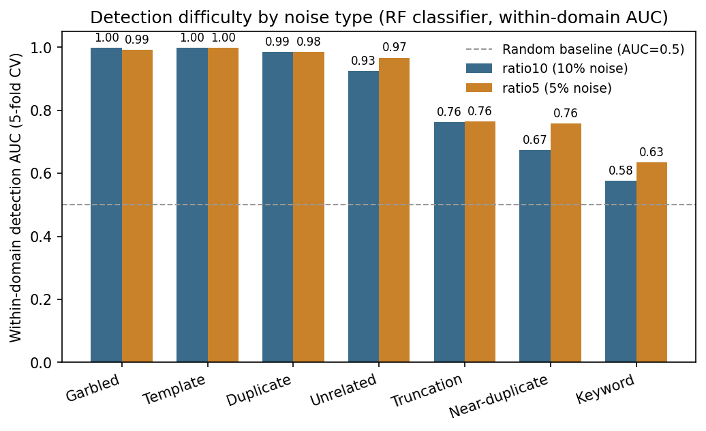
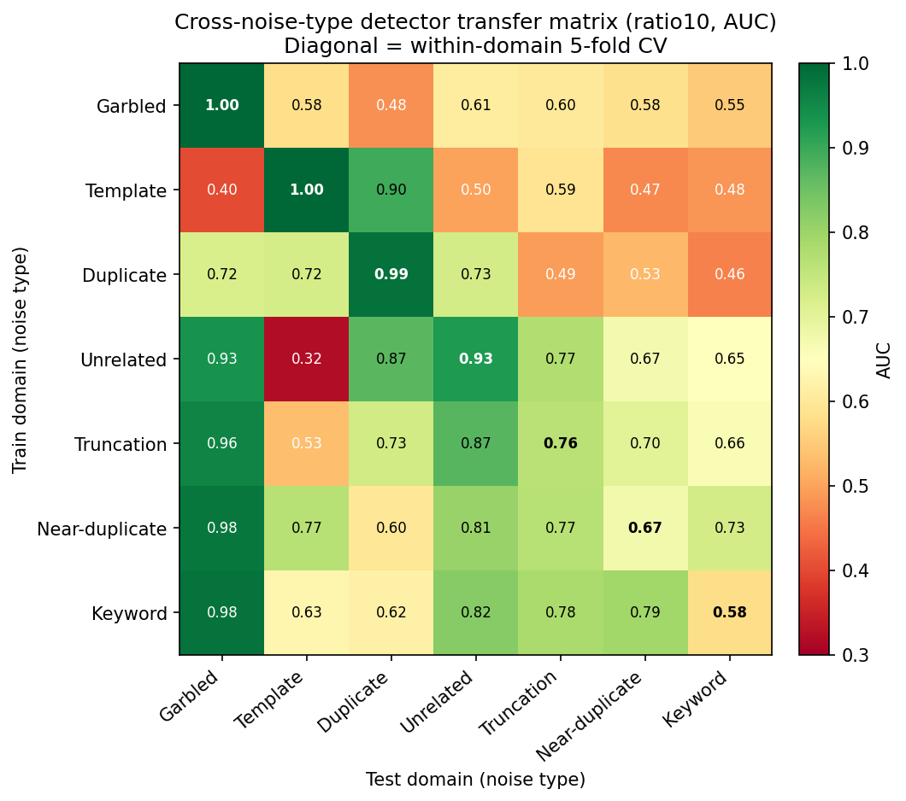
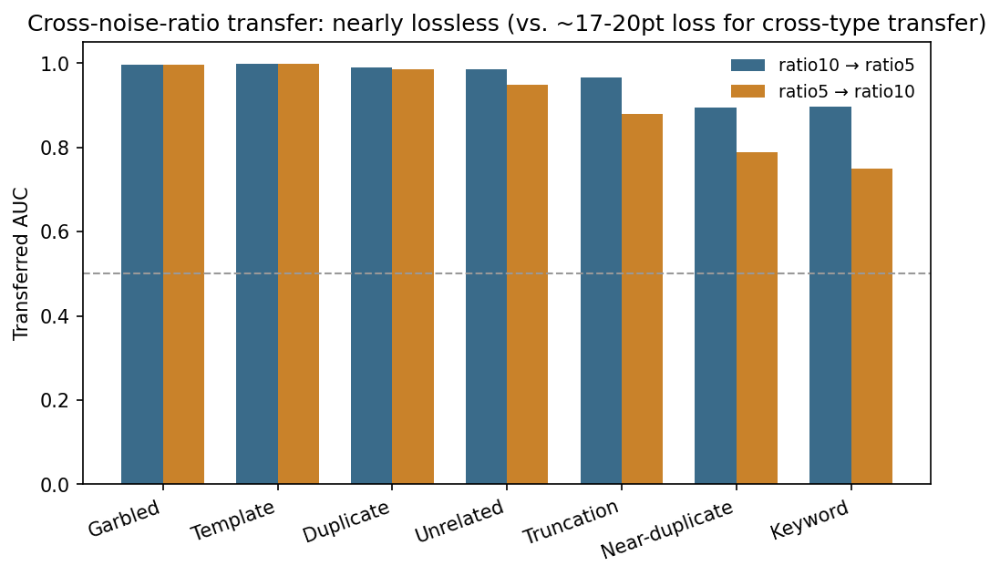
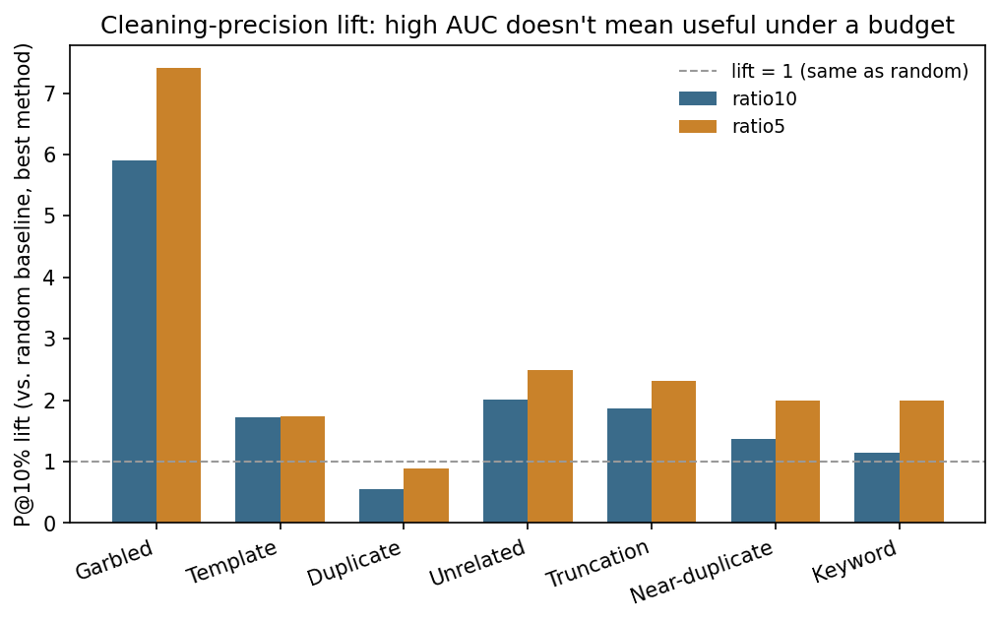
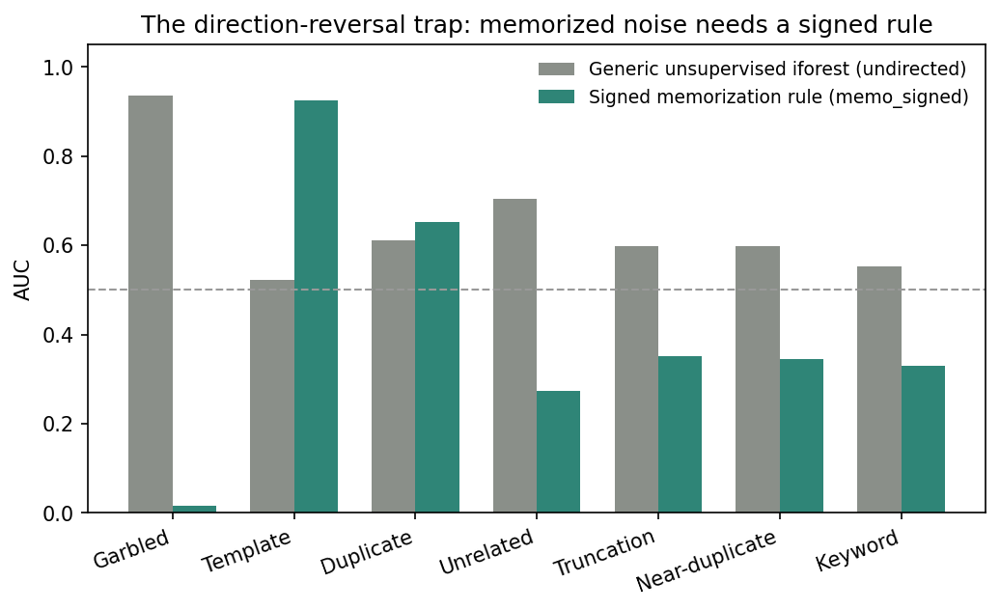
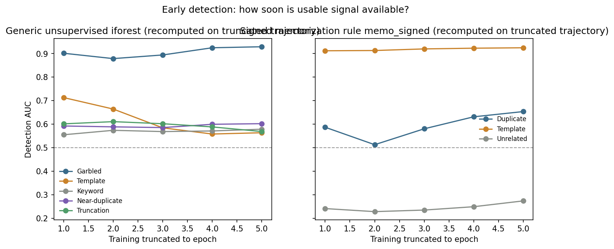
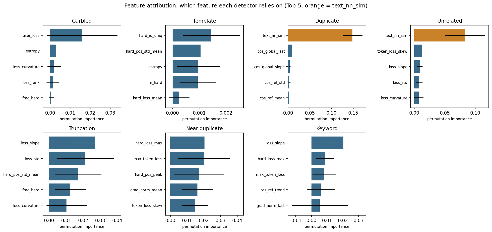
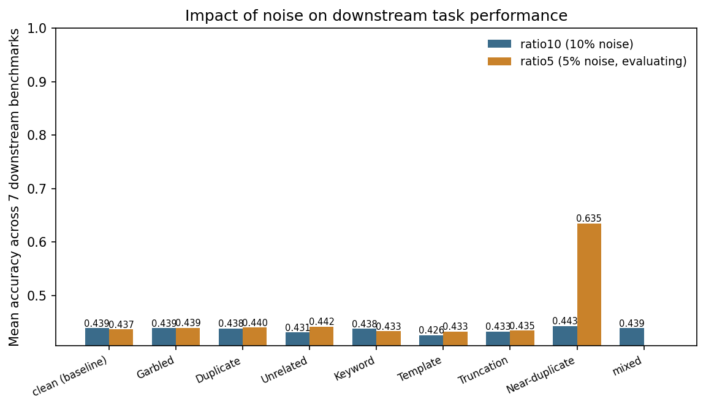
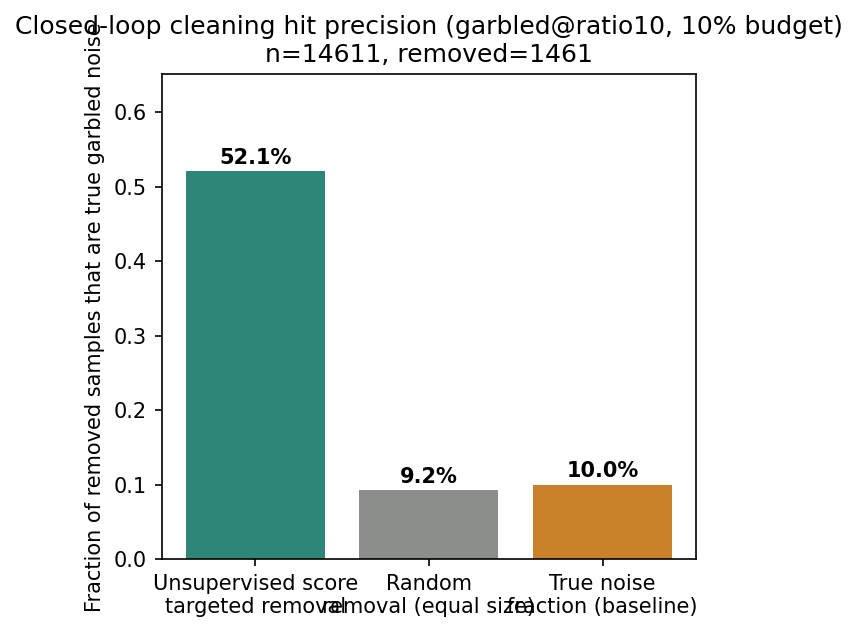

# Noise-Detection Experiment Analysis Report

**Date**: 2026-09-14
**Scope**: `ratio10` (10% noise, 9 datasets, fully complete), `ratio5` (5% noise, cross-validation, downstream eval 7/9 datasets complete)
**Charts**: `results/charts/en/*.png` (generated by `scripts/make_report_charts.py`; the script itself is gitignored, the resulting PNGs are tracked)

---

## 1. Experiment Overview

This project investigates a core question: **without ever using noise labels, can training dynamics captured during LoRA fine-tuning (loss trajectories, gradient norms, cosine similarity, etc.) reveal which training samples were injected as low-quality/anomalous?**

### 1.1 Data and Noise Types

Starting from dolly-15k as the base dataset, 7 noise types are injected, plus `clean` (uncontaminated baseline) and `mixed` (all 7 types combined) — 9 datasets total:

| Noise type | Description |
|---|---|
| `garbled` | Random character substitution/shuffling in the text |
| `template` | Response replaced with a highly repetitive templated sentence |
| `duplicate` | Exact copy of an existing sample |
| `unrelated` | Response mismatched with the question |
| `truncation` | Response cut short, information incomplete |
| `near_duplicate` | Existing sample with a light paraphrase |
| `keyword` | Key entities/terms in the sentence swapped out |

Two experiment tags correspond to two noise ratios:

- **`ratio10`**: 10% noise ratio. All 9 datasets fully trained, analyzed, and evaluated (training completed 2026-09-13 00:48, downstream evaluation completed 2026-09-14 02:20).
- **`ratio5`**: 5% noise ratio, used for cross-validation. Training on all 9 datasets completed 2026-09-14 07:46, the 5 analysis tables completed at 09:35. Downstream benchmark evaluation is still in progress (tmux session `ratio5_eval`): 7/9 datasets done (clean/garbled/duplicate/unrelated/keyword/template/truncation), `near_duplicate` currently running, `mixed` queued after it.

### 1.2 Training Configuration

- Model: Qwen2.5-3B-Instruct, LoRA (r=32) fine-tuning, 5 epochs, per-sample gradient/loss tracking.
- GPU: NVIDIA RTX PRO 6000 Blackwell Server Edition (~98GB), single GPU — all training/evaluation jobs are queued and run sequentially.
- After each dataset finishes training, `runs/{tag}/{dataset}/metrics/per_sample.jsonl` is written with per-sample, per-epoch loss/gradient-norm/cosine-similarity metrics; all downstream analysis is recomputed from these files without ever retraining.

### 1.3 Analysis Methods Overview

Around the "can training dynamics detect noise" question, 9 independent analyses were designed. This report presents them in order: within-domain detection difficulty, cross-type transfer, cross-ratio transfer, cleaning-precision lift, the direction-reversal trap, early detection, feature attribution, actual downstream impact, and label-free closed-loop cleaning.

---

## 2. Detection Difficulty Landscape: Which Noise Types Are "Visible"

Using a random-forest classifier on training-dynamics features with 5-fold cross-validation gives a "within-domain detection AUC" for each noise type (the classifier knows the noise labels here — this only answers "does the feature set contain discriminative signal at all"):

| Noise type | ratio10 AUC | ratio5 AUC |
|---|---|---|
| Template | 0.999 | 1.000 |
| Garbled | 0.998 | 0.993 |
| Duplicate | 0.986 | 0.985 |
| Unrelated | 0.925 | 0.967 |
| Truncation | 0.763 | 0.764 |
| Near-duplicate | 0.674 | 0.759 |
| Keyword | 0.577 | 0.634 |

**Conclusions**:

- Template, garbled, and duplicate are nearly "perfectly detectable" (AUC > 0.98), meaning these noise types leave a very strong signature in training dynamics.
- Keyword substitution and near-duplicate are the two clear hard cases — AUC is only modestly above the random baseline (0.5), meaning these "light perturbation" noise types leave almost no trace at the training-dynamics level.
- The ranking is identical across both noise ratios (10% vs 5%), and for the three harder types (unrelated/truncation/near_duplicate/keyword), ratio5's AUC is actually slightly *higher* than ratio10's — early evidence that this ranking is stable rather than a coincidence of one specific noise ratio. Section 4's cross-ratio transfer analysis confirms this further.

---

## 3. Cross-Type Transfer: Can a Detector Generalize Across Noise Types?

The figure above is the 7×7 transfer matrix under `ratio10`: each row is the noise type the detector was trained on, each column is the noise type it was tested on, and the diagonal reproduces the within-domain AUC from Section 2.

**Key findings**:

- **Diagonal mean AUC 0.846 vs. off-diagonal mean 0.675** — cross-type transfer loses about 17-20 points on average, meaning a substantial part of the discriminative signal in training-dynamics features is **type-specific**; there is no single "universal detector" that can be applied unchanged to an unseen noise type.
- **Template is the most isolated type**: a detector trained on template transfers to the other 6 types with AUC typically 0.40-0.59 (some even below the random baseline — e.g. transferring to garbled only reaches 0.40). Conversely, detectors trained on other types generally perform poorly when tested on template (e.g. unrelated→template is only 0.32, clearly below the 0.5 random baseline — a **directional reversal**, meaning the detector's judgment on template samples is systematically inverted). This is the same mechanism as the "direction-reversal trap" discussed in Section 6, showing up in the cross-type setting.
- **Garbled transfers the most easily**: detectors trained on most other types still reach 0.93-0.98 AUC when tested on garbled, showing that garbled's training-dynamics anomaly (e.g. persistently elevated loss) is generic enough not to depend on a type-specific feature pattern.
- **Keyword is weak in both directions**: not only is its within-domain CV only 0.577, but AUC transferring both into and out of keyword is generally low as well — consistent with the conclusion that keyword substitution is the hardest type to detect.

**Practical implication**: a production label-free detector cannot be trained on one known noise type and be expected to generalize to unknown types; it either needs separate calibration per plausible noise pattern, or should lean on the feature-attribution results in Section 8 to design more generic rules.

---

## 4. Cross-Ratio Transfer: Almost Lossless

In contrast to the cross-type transfer in Section 3, this section fixes the noise type and tests whether a detector trained at a 10% noise ratio transfers to 5% (and vice versa).

| Noise type | ratio10→ratio5 AUC | ratio5→ratio10 AUC |
|---|---|---|
| Template | 1.000 | 1.000 |
| Garbled | 0.996 | 0.997 |
| Duplicate | 0.990 | 0.986 |
| Unrelated | 0.985 | 0.948 |
| Truncation | 0.966 | 0.880 |
| Near-duplicate | 0.895 | 0.790 |
| Keyword | 0.898 | 0.751 |

**Key finding: cross-ratio transfer AUC is ≥0.75 across the board, mostly ≥0.88, and retention (transferred AUC / within-domain AUC) is mostly ≥1.0 — transfer loses almost nothing, and in some cases actually improves.** For example, keyword ratio10→ratio5 reaches 0.898, well above ratio5's own within-domain CV of 0.634; near-duplicate ratio10→ratio5 reaches 0.895, well above its own within-domain CV of 0.759. This suggests that pooling training-dynamics data across the two noise ratios actually produces a more robust decision boundary, rather than overfitting to one specific noise density.

**Conclusion when compared with Section 3**: the discriminative signal that training-dynamics features carry for "noise type" is stable across noise ratios (and can even transfer positively) — a detector does not need to be retrained for every noise ratio. **The real transfer bottleneck is cross-noise-type, not cross-noise-ratio.** This is practically significant: if the production noise ratio fluctuates over time, the detector does not need to be retrained because of that alone.

---

## 5. Cleaning-Precision Lift: High AUC Doesn't Mean Useful Under a Cleaning Budget

AUC measures overall ranking ability, but in practice cleaning can only remove a small slice of samples (e.g. the top 10%). In that regime, the metric that actually matters is **P@10% lift** — the hit rate of true noise samples in the removed top 10%, relative to random removal.

| Noise type | ratio10 best-method lift | ratio5 best-method lift |
|---|---|---|
| Garbled | 5.91 (iforest) | 7.40 (iforest) |
| Mixed | 2.28 (iforest) | 2.96 (iforest) |
| Unrelated | 2.01 (iforest) | 2.49 (iforest) |
| Truncation | 1.87 (zscore_max) | 2.32 (zscore_max) |
| Template | 1.72 (zscore_mean) | 1.74 (zscore_mean) |
| Near-duplicate | 1.37 (iforest) | 1.99 (zscore_mean) |
| Keyword | 1.14 (zscore_max) | 1.99 (zscore_max) |
| **Duplicate** | **0.56 (zscore_mean)** | **0.89 (zscore_max)** |

**Key warning**: for **duplicate** noise, despite a within-domain AUC as high as 0.986 (Section 2), the P@10% lift is below 1 (only 0.56x at ratio10, 0.89x at ratio5) — meaning that removing the top-10%-scored samples according to this detector actually hits *fewer* true noise samples than removing a random 10%. This happens because the duplicate score distribution can be tightly clustered outside the "useful" region for a strict top-k cut; AUC, being a global ranking metric, masks this local failure under a budget constraint.

**Methodological implication**: ranking cleaning methods by AUC and by P@10% lift produces different "best method" conclusions — choosing a cleaning strategy by AUC alone is biased. Any detection method claimed to be usable for automated cleaning should report precision under a realistic cleaning budget, not just AUC.

---

## 6. The Direction-Reversal Trap: Memorized Noise Needs a Signed Rule

This is one of the project's most important methodological findings. Standard unsupervised outlier detection (IsolationForest, etc.) assumes "noise = anomaly = outlier." But for samples that are **perfectly memorized and hyper-typical** (template, duplicate), training dynamics actually become **more regular, less outlier-like** (loss converges quickly to far below normal, gradient norm shrinks fast) — the exact opposite of the "outlier" intuition.

| Noise type | Generic unsupervised iforest AUC | Signed memorization rule (memo_signed) AUC |
|---|---|---|
| Garbled | 0.936 | 0.017 |
| Unrelated | 0.703 | 0.274 |
| Duplicate | 0.612 | 0.654 |
| Mixed | 0.662 | 0.380 |
| Keyword | 0.552 | 0.330 |
| Truncation | 0.598 | 0.352 |
| Near-duplicate | 0.599 | 0.346 |
| **Template** | **0.522 (near random)** | **0.925 (near-perfect)** |

**Template is the clearest example**: the generic unsupervised method only achieves AUC 0.522 — essentially a coin flip. But switching to a signed rule whose **direction is fixed a priori by the memorization hypothesis** (rather than being fitted per dataset) — i.e., pre-assuming "lower loss, faster convergence, smaller gradients = more likely to be memorized hyper-typical noise" instead of letting the algorithm discover the outlier direction itself — immediately lifts AUC to 0.925.

Conversely, garbled — a genuinely "high-loss, model-can't-learn-it" type of noise — completely fails under the signed memorization rule (AUC only 0.017, i.e. **almost exactly inverted**), because its nature is that the model can't learn it, not that the model has memorized it.

**Practical implication**: there is no single unsupervised anomaly-detection approach that covers every kind of "training anomaly." At minimum, two categories need to be distinguished — "unlearnable" noise (e.g. garbled, use standard outlier detection) and "memorized/hyper-typical" noise (template, duplicate, needs a signed prior rule) — and treated accordingly.

---

## 7. Early Detection: Usable Signal Before Training Even Finishes

All analyses above use trajectory features from the full 5-epoch training run. Here we test: if the trajectory is truncated to the first k epochs and detection metrics are recomputed, how early can usable signal be obtained?

**Left panel (generic unsupervised iforest)**:

- **Garbled**: AUC is already 0.901 after epoch 1, reaching 0.929 by epoch 5 — strong from the very first epoch, with training contributing only a small marginal gain.
- A **counter-intuitive phenomenon**: template, keyword, near-duplicate, and truncation actually see AUC **decrease** slightly as training progresses under the generic iforest rule (e.g. template drops from 0.71 at epoch 1 to 0.56 at epoch 5) — this is the same mechanism as the "direction reversal" in Section 6, playing out along the training timeline: the longer these "hyper-typical" noise types are trained, the less they look like outliers.

**Right panel (signed memorization rule memo_signed)**:

- **Template**: AUC is already 0.91 at epoch 1, almost as good as the fully-trained value (0.925) — again nearly saturated from the first epoch.
- Duplicate: rises from 0.59 at epoch 1 (with a dip) to 0.65 at epoch 5, a modest gain from continued training.
- Unrelated: stays around 0.23-0.27 throughout, showing the memo_signed rule simply doesn't apply to this type (it isn't a memorized-noise type).

**Practical implication**: garbled and template can be scored and removed right after epoch 1, saving the compute of 4 further epochs spent on clearly-noisy samples. The other types (especially keyword, near-duplicate, truncation) have no "early-stopping" shortcut and still require full training or at least several epochs of accumulated signal.

---

## 8. Feature Attribution: What Is the Detector Actually Looking At?

Every analysis so far answers "can it be detected." This section uses permutation importance (rather than RF's biased built-in impurity-based importance) to answer "which feature is the detector actually using."

**The most important finding — for two noise types, the detection signal comes almost entirely from something other than training dynamics**:

| Noise type | Top feature | Importance | 2nd feature | Importance | Gap |
|---|---|---|---|---|---|
| Duplicate | `text_nn_sim` (text similarity, a data-level feature) | 0.148 | `cos_global_last` | 0.0093 | 16x |
| Unrelated | `text_nn_sim` | 0.083 | `token_loss_skew` | 0.0123 | 7x |

`text_nn_sim` is TF-IDF nearest-neighbor cosine similarity, computed from the **raw text itself**, unrelated to training dynamics. This means the high AUC reported for duplicate and unrelated in Sections 2-3 is, in substance, **not a contribution of the training-dynamics detection methodology** — it's closer to "using an off-the-shelf text-similarity feature to detect noise, with model training essentially along for the ride." This is an exception that must be honestly flagged under this project's core narrative of "label-free detection via training dynamics."

**For the other 5 types, the top features are genuine training-dynamics quantities**:

- Garbled is dominated by `user_loss` (0.016) — garbled text causes the response segment's loss to be uniformly elevated.
- Keyword is dominated by `loss_slope` (0.020), but the overall importance values are small and often have a standard deviation larger than the mean — consistent with keyword being the hardest-to-detect type: no single feature contributes stable signal.
- Truncation is dominated by `loss_slope`/`loss_std` (0.027/0.021).
- Near-duplicate and template are dominated by the `hard_*` family of token-level hard-example features.
- **Template** is another notable case: its own-AUC is near-perfect (0.999), yet every feature's permutation importance is tiny (the top one, `hard_id_uniq`, is only 0.0015) — when a type is "too easy to detect," redundant/correlated features dilute each other's marginal contribution. This does not indicate unreliable detection; it is the normal behavior of permutation importance on a near-saturated task.

---

## 9. Actual Downstream Impact: Does Noise Really Hurt Model Performance?

Everything above answers "can noise be detected." This section addresses a more fundamental question: **does injecting noise actually degrade the model's downstream task performance?** (Mean accuracy across 7 benchmarks: MMLU / GSM8K / HellaSwag / ARC / BBH / TruthfulQA / Winogrande.)

| Dataset | ratio10 mean accuracy | ratio5 mean accuracy |
|---|---|---|
| Clean (baseline) | 0.439 | 0.437 |
| Garbled | 0.439 | 0.439 |
| Duplicate | 0.438 | 0.440 |
| Unrelated | 0.431 | 0.442 |
| Keyword | 0.438 | 0.433 |
| **Template** | **0.426** | 0.433 |
| Truncation | 0.433 | 0.435 |
| Near-duplicate | 0.443 | evaluating |
| Mixed | 0.439 | evaluating |

**Observations**:

- The spread across datasets is very small (all fall in the 0.42-0.44 range), suggesting that at the current noise ratios (5%/10%) and training scale, LoRA fine-tuning has an inherently limited effect on these 7 general-capability benchmarks — these benchmarks mostly probe pretrained knowledge rather than SFT-stage behavior, so the "damage" from noise injection is more likely to show up in instruction-following quality or generation style, dimensions this report does not cover, rather than in multiple-choice/numeric benchmarks like these.
- Within that limited spread, **template's ratio10 downstream accuracy (0.426) is the lowest of all datasets** — even lower than the clean baseline (0.439) — echoing the Section 2/6/8 conclusion that "template is the easiest to detect and the most deeply memorized": the model's overfit memorization of template noise does leave an observable negative trace downstream, making it the only type in this evaluation where "easy to detect" and "actually harmful" corroborate each other.
- ratio5's downstream evaluation still has 2 datasets (near-duplicate, mixed) queued; once complete, it will be possible to confirm whether template remains the most harmful type at the 5% noise ratio.

---

## 10. Label-Free Closed-Loop Cleaning: From "Can Detect" to "Cleaning Actually Works" (In Progress)

**This is currently the only experiment in the project that advances from "score and rank" to an actual cleaning action, and it differs in kind from the previous 9 sections**: every prior analysis only verified "can noise samples be told apart" (AUC/lift numbers), never whether "retraining after cleaning actually improves things."

Using `garbled@ratio10` (14,611 training samples total, true noise fraction 9.999%) as the test case, a purely unsupervised IsolationForest (no noise labels used, 20-dimensional base trajectory features plus `text_nn_sim`, fit independently on the full dataset) scores and removes a 10% budget of samples:

- **Targeted-removal precision: 52.1%** (of the 1,461 removed samples, 761 were indeed genuine injected garbled noise)
- **Random-removal precision: 9.2%** (closely matches the true noise fraction of 10.0%, as expected)
- **Lift: ~5.7x**

**Current status — not yet complete, only the cleaning-precision step has results**: two training sets have been produced, `train_targeted` (after targeted removal) and `train_random` (random-removal control), queued for GPU availability to retrain and evaluate on downstream benchmarks, for a three-way comparison against the uncleaned baseline (`eval_ratio10_garbled.json`) and the clean baseline (`eval_ratio10_clean.json`). This step is the key closed-loop check on whether the detected precision actually translates into a downstream improvement — **so far only scoring and removal are complete; the retrain-and-evaluate comparison is still queued** (tmux session `cleaning_loop_garbled`, set to auto-start once `ratio5_eval` frees the GPU).

---

## 11. Conclusions and Limitations

### 11.1 Summary of Core Conclusions

1. **Detection difficulty varies by noise type, and the ranking is stable**: garbled/template/duplicate are easiest to detect (AUC > 0.98), keyword/near-duplicate are hardest (AUC 0.57-0.76); this ranking holds across both the 10% and 5% noise ratios.
2. **Cross-type transfer loses substantial ground (~17-20 points), cross-ratio transfer is nearly lossless**: a detector needs separate calibration per noise type, but not per noise ratio.
3. **AUC overstates cleaning usefulness**: duplicate has AUC as high as 0.986 but P@10% lift < 1 — choosing a cleaning method requires looking at precision under a realistic budget, not just AUC.
4. **The direction-reversal trap is a real methodological pitfall**: "hyper-typical/memorized" noise like template needs a signed prior rule (not generic outlier detection) to be caught, and this same pitfall reappears along the early-detection time axis.
5. **Two types' high AUC is not what it appears**: over 90% of the detection signal for duplicate and unrelated comes from a static text-similarity feature, not training dynamics — these two types cannot be cited as evidence that the "training-dynamics detection" methodology works.
6. **Real downstream harm is limited but present**: the spread across the 7 general benchmarks is small, but template at ratio10 is genuinely the worst-performing dataset downstream — the only type where "easy to detect" and "actually harmful" both hold.
7. **Label-free closed-loop cleaning shows early positive evidence**: for garbled noise, targeted removal achieves 5.7x the precision of random removal, but the final verification step — whether retraining after cleaning actually improves downstream performance — is still in progress.

### 11.2 Limitations

- The overall spread in downstream benchmark impact is small (0.42-0.44 range), which could mean the current evaluation suite isn't sensitive enough, or that at this LoRA fine-tuning scale/epoch count, noise's downstream impact is genuinely limited; larger-scale or longer training could plausibly amplify these differences.
- The closed-loop cleaning experiment has so far only been validated on a single noise type/ratio (`garbled@ratio10`), and has not yet been extended to other noise types (especially the harder-to-detect keyword and near-duplicate) or mixed-noise scenarios.
- The finding that `text_nn_sim` dominates duplicate/unrelated detection means the core "training-dynamics detection" methodology currently has substantive support only for types like garbled, template, truncation, and keyword — this should be stated carefully to avoid over-generalizing the claim.

### 11.3 Next Steps

- Wait for `ratio5_eval` (near-duplicate and mixed datasets) and `cleaning_loop_garbled` (retrain + evaluate) to finish, to complete the sections of this report currently marked "in progress."
- Extend closed-loop cleaning to the remaining noise types, in particular checking whether cleaning the duplicate type (whose P@10% lift is < 1) is actually harmful rather than helpful.
- Explore dedicated features for "light perturbation" noise types like keyword and near-duplicate, for which the current combination of training-dynamics and text-similarity features carries very weak signal.
