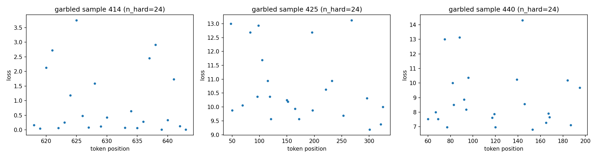
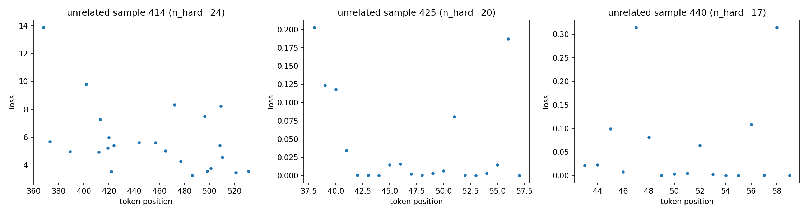
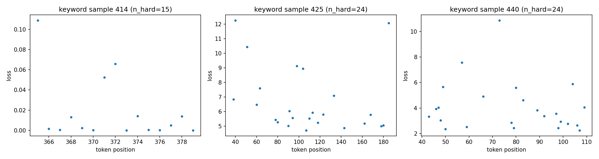
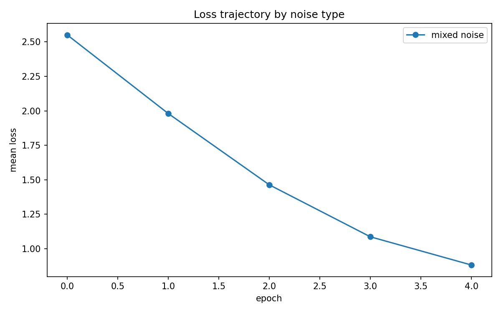
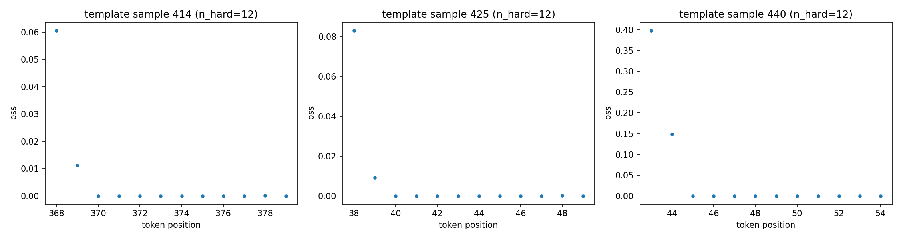
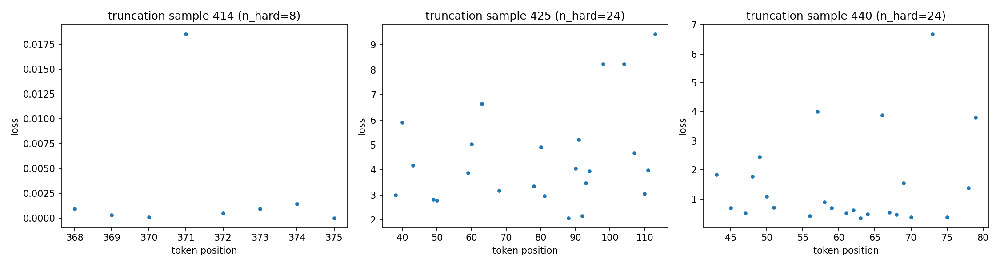
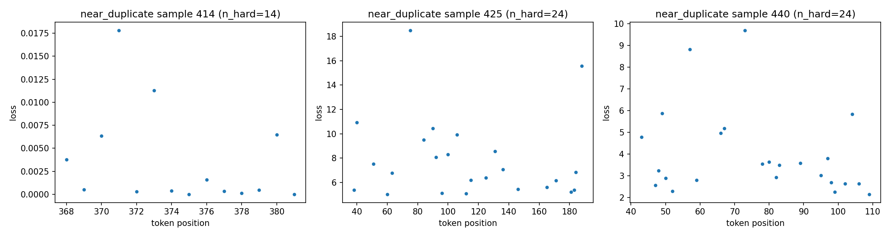
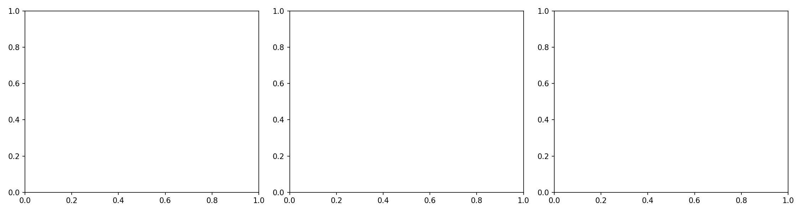
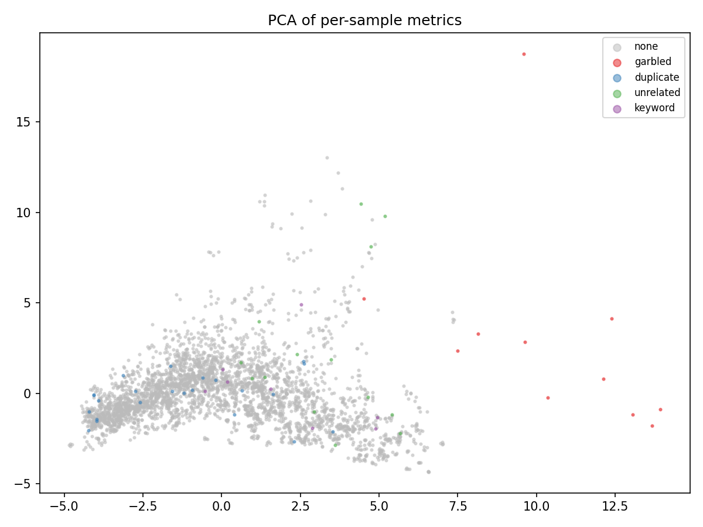

# Impact of Noisy Samples on LLM Fine-tuning: Per-Sample Metric Tracking & Detection Analysis

> Experiment period: 2026-08-12 ~ 2026-08-17
> Base model: Qwen2.5-3B-Instruct (LoRA r=32, 59.9M trainable params) · Training data: databricks-dolly-15k
> Covers **two noise ratios: 10% and 5%** · 5 epochs · 14,611 training samples per run · single RTX 5090

---

## 0. Executive Summary (TL;DR)

**1. Sample-level noise detectability (identical at both ratios)**: garbled 0.999 > duplicate 0.972 > unrelated 0.956 > mixed 0.900 > **keyword 0.70-0.73 (hardest, but not random)** — detectability does not decay with the ratio; detectors transfer directly to 5% real-world pollution;

**2. Feature-to-noise mapping**: garbled via input+output-side features (user_loss/entropy/curvature); duplicate **only via the data side** (text_nn_sim; training metrics inverted); unrelated via cross-epoch loss volatility; keyword's signal is weak and **only emerges with enough samples** (40 features on the diagnostic subsample 0.65 → 13 features on all samples 0.70/0.73);

**3. Detectability decays monotonically over epochs (identical curves at both ratios)**: the model adapts to noise — **clean your data within epoch 0-1**; and **epoch-0 features alone already reach 95%+ of the full-trajectory detector** (garbled 0.980/0.987, unrelated 0.881/0.916), so early cleaning is almost free;

**4. AUC overstates usable precision**: evaluated as a real cleaning operation (drop the top-scoring 10%), unrelated's AUC 0.945 corresponds to a **precision of only 0.631** — 37% of the dropped samples are clean; garbled 0.937 / duplicate 0.721 / keyword 0.281 (random 0.10);

**5. Mixed noise does not dilute per-type signal**: mixed's low overall AUC (0.82-0.85) is purely a label-aggregation artifact — every subtype is at least as detectable inside the mixed run as in its own single-type run (duplicate 0.998/0.981, keyword 0.773/0.688); multi-type pollution in real data does not weaken detectors;

**6. Harm is non-monotonic**: unrelated hurts MMLU/ARC/TruthfulQA *more* at 5% than at 10% (MMLU −0.019 vs −0.005), with a confidence inversion (correct-margin 4.75→2.45, "both wrong and hesitant"); duplicate's overfitting damage is roughly linear (10% ≈ 2× 5%);

**7. Absolute noise impact is small**: the 6 fine-tuned models are close to each other and all worse than base — dolly SFT's own damage swamps the noise differences;

**8. Extended noise (extra10)**: **template (consistent wrong-answer pattern) is both the most detectable (RF 0.9995) and the most harmful** (GSM8K −23%) — "random errors get absorbed, systematic errors get learned" — and *all* of its loss/entropy features are **direction-inverted** (loss_mean AUC 0.101 = 0.90 once flipped; same family as duplicate but more extreme); truncation 0.888 is easy to detect; **near_duplicate 0.733 is the second-hardest type after keyword**, and `text_nn_sim` fails on it (0.492 — WordNet-level paraphrase escapes TF-IDF); IFD is the strongest cross-type fingerprint (template 43× easier to follow, garbled 2.7× harder);

**9. Detectability and harm are not monotonically related**: the easiest type (garbled) is the least harmful; the true detection-value zone is **semantic mismatch (unrelated)** — hard to detect and more harmful at low ratios.

---


## 1. Experimental Setup

### 1.1 Research questions

1. **Impact**: how do four noise families (garbled / duplicates / context mismatches / keyword swaps) affect fine-tuning and final model capability, and how does the impact scale with the noise ratio (10% vs 5%)?
2. **Detection**: can per-sample training metrics (loss / gradients / entropy / ...) separate noisy from normal samples? Which metrics work for which noise? Does detectability decay with the ratio?

### 1.2 Datasets (two parallel ratios)

Built from databricks-dolly-15k (15,011 samples) with the same seed and sample order, at 10% and 5%:

| Dataset | Noise construction | 10% noisy | 5% noisy |
|---|---|---|---|
| `clean` | original data (baseline) | 0 | 0 |
| `garbled` | mojibake injection: Unicode substitution/insertion/char swaps, whitespace preserved | 1461 | 731 |
| `duplicate` | byte-identical copy rows | 1461 | 731 |
| `unrelated` | response replaced by a fluent, correct answer from a *different* category | 1461 | 731 |
| `keyword` | only numbers/years/proper nouns replaced; grammar preserved | 1461 | 731 |
| `mixed` | the four types at equal shares | 1461 | 731 |

- Sample IDs are identical across ratios (only the noisy subset differs) → per-sample cross-ratio comparability;
- A shared 400-sample clean held-out set serves for the reference gradient direction and held-out evaluation;
- **The clean run and the clean/base eval results are byte-identical across ratios and reused** (zero redundant work).

### 1.3 Training configuration

| Setting | Value |
|---|---|
| Micro-batch 1 + grad-accum 16 | exact per-sample gradients (snapshot-difference), +5-8% overhead |
| lr 2e-4, cosine + 3% warmup, AdamW, bf16 + flash-attention-2 | identical across ratios |
| seq 1024 (truncation keeps assistant) | 5 epochs, 4,570~5,025 steps/run, ~3.4-3.9 h per run |

### 1.4 Recorded metrics (three levels, 19+ features)

**Sample-level metrics** — captured per sample per epoch during training
(micro-batch=1 difference method: snapshot accumulated gradients before
backward as $\\mathbf{b}$, after backward as $\\mathbf{a}$; the difference
$\\delta = \\mathbf{a} - \\mathbf{b}$ is the sample's exact gradient; total
overhead only +5-8% of training time), 6 features:

**1. loss** — mean cross-entropy over label tokens:

$$\\text{loss} = -\\frac{1}{|L|}\\sum_{t \\in L} \\log p_\\theta(\\text{next\\_id}[t] \\mid x_{<t})$$

- **Meaning**: how hard this sample is to fit right now; the most direct quantity in training monitoring;
- **Detection intuition**: "unlearnable" noise (garbled) stays high forever; but there is an **inverted trap** — noise that is quickly memorized (duplicate copies) shows *lower* loss than normal samples (detection AUC 0.37, direction reversed);
- **Observed**: garbled highest throughout (0.70 at epoch 4 vs clean 0.51); duplicate lowest (0.43).

**2. grad_norm** — L2 norm of the sample's LoRA gradient: $\\text{grad\\_norm} = \\|\\delta\\|_2$

- **Meaning**: how hard this sample "pushes" the parameters;
- **Detection intuition**: large gradients aligned with the reference direction = valuable hard samples; anomalous magnitudes = noise suspects;
- **Observed**: unrelated elevated (0.764), duplicate depressed (0.343, inverted), garbled 0.829.

**3. cos_sim_ref** — cosine similarity with the **clean reference direction** (LESS-style influence):

$$\\text{cos\\_sim\\_ref} = \\frac{\\langle \\delta,\\, \\mathbf{g}^{\\ast} \\rangle}{\\|\\delta\\|_2 \\, \\|\\mathbf{g}^{\\ast}\\|_2}$$

where $\\mathbf{g}^{\\ast}$ is the mean LoRA gradient over 200 held-out clean samples computed pre-training (unit vector).

- **Meaning**: the angle between this sample's gradient and the "clean training direction" — near 1 pushes the model along the clean direction; near 0 or negative conflicts;
- **Implementation**: computed once before training, reused throughout; an efficient approximation of LESS influence (Xia et al. 2024);
- **Observed**: moderate univariate AUC (0.58-0.62) but an important combined-feature member.

**4. cos_sim_global** — cosine with the current accumulation-window (16-sample) gradient:

$$\\text{cos\\_sim\\_global} = \\frac{\\langle \\delta,\\, \\mathbf{g}_{\\text{acc}} \\rangle}{\\|\\delta\\|_2 \\, \\|\\mathbf{g}_{\\text{acc}}\\|_2}$$

- **Meaning**: within-batch gradient consistency; negative = conflicts with the dominant direction of the surrounding 15 samples;
- **Observed**: relatively effective for duplicate (0.610).

**5. update_contrib** — Adam-normalized update contribution (B matrices only):

$$\\text{update\\_contrib} = \\frac{\\|\\delta_B\\|_2}{\\big\\|\\sqrt{\\mathbf{v}_B}\\big\\|_2 + 10^{-8}}$$

- **Motivation**: dividing by the second-moment RMS reflects how large the push is *relative to recent gradient magnitudes*;
- **Implementation detail**: B matrices only — LoRA B is zero-initialized, A gradients vanish early and element-wise normalization explodes (measured 2.3e8);
- **Observed**: garbled 0.836 / unrelated 0.724 / keyword 0.636 / duplicate 0.330 (inverted).

**6. tokens** — number of label tokens: a sequence-length control variable for stratified analysis.

**Diagnostic-level metrics** — forward-only pass on a 1/8 subsample at each epoch end (~30 s/epoch), all based on the full-sequence next-token CE ($\\text{ce}[t]$; targets must be REAL token ids — $-100$ makes cross\\_entropy return 0, the root cause of the user_loss-always-zero bug):

**7. max_token_loss** — $\\max_{t \\in L} \\text{ce}[t]$: the largest per-token loss in a sample; captures "local extremes" of corruption;

**8. frac_hard** — fraction of tokens with loss > 4.0: highest for garbled and barely decays (epoch 4: 4.84% vs clean 4.36%); lowest for duplicate (3.82%, memorized);

**9. user_loss** — mean prompt loss $\\frac{1}{|U|}\\sum_{t \\in U} \\text{ce}[t]$: an **input-side signal** — garbled corrupts the input → spikes (AUC 0.979); keyword/unrelated only alter the output → stays normal;

**10. entropy** — mean next-token entropy over label tokens: model certainty; extremely high on corrupted tokens (AUC 0.971); low on memorized ones (duplicate 0.406);

**11. token_loss_skew/kurt** — skewness/kurtosis of the per-token loss distribution: garbled makes *almost all* tokens hard → skew near 0 (AUC 0.064) — "a signal of having no signal";

**12. top-32 hard-token details** — position / token id / loss: for offline token-level localization and attribution.

**Derived features** — computed post-training from per-epoch sequences (zero cost):

**13. loss_mean / loss_last / loss_std / loss_slope** — level / final / volatility / change: $\\text{loss\\_std}$ is the main feature for unrelated (0.827) — hard samples descend smoothly while mismatched samples oscillate;

**14. converge_epoch** — $\\min\\{e : l_e < 2.0\\}$ (else E): 61% of garbled samples never converge vs duplicate copies converging in ~0.33 epochs on average — a perfect mirror;

**15. loss_rank** — mean within-epoch loss percentile: removes global level drift;

**16. loss_curvature** — quadratic-fit coefficient ($[l_e] \\approx c_2 e^2 + c_1 e + c_0$, take $c_2$): **the single strongest feature** — garbled 0.985 / unrelated 0.830 / keyword 0.669;

**17. grad_norm_cv / cos_ref_trend** — gradient volatility ($\\sigma/\\mu$) / reference-alignment trend;

**18. text_nn_sim** — TF-IDF (1-2 grams) nearest-neighbor cosine: a **data-side feature fully independent of training** — the only effective tool for duplicate (0.939-0.963).

**Token level (offline; 60 noise + 60 normal samples per dataset)**: top-24 hardest label tokens individually back-propagated for exact per-token LoRA gradient norms and cosine similarities.

---

## 2. Training Dynamics

### 2.1 Training loss trajectory (both ratios)

| run | 10% e0 | 10% e4 | 5% e0 | 5% e4 |
|---|---|---|---|---|
| clean | 1.366 | 0.514 | 1.366 | 0.514 |
| garbled | **1.669** | **0.702** | 1.526 | 0.609 |
| unrelated | 1.494 | 0.498 | 1.437 | 0.504 |
| keyword | 1.427 | 0.533 | 1.403 | 0.523 |
| mixed | 1.496 | 0.525 | 1.438 | 0.533 |
| duplicate | 1.349 | **0.425** | 1.358 | **0.467** |


**Findings:**
1. The ratio does not change the trajectory shapes — garbled highest, duplicate lowest, others near clean: the qualitative effect of noise on training dynamics is ratio-invariant;
2. **garbled is the only "unlearnable" noise**: +37% over clean at 10%, +18% at 5%, roughly linear in the ratio;
3. **duplicate converges to the lowest loss** (0.425/0.467) — low training loss is a memorization signal, not a health signal;
4. Mean loss is completely insensitive to semantic noise (unrelated/keyword/mixed ≈ clean).

### 2.2 Convergence speed (converge_epoch)

| run | noise mean (10%) | noise mean (5%) | normal mean | never-converged (10%) | (5%) |
|---|---|---|---|---|---|
| garbled | 4.06 | 4.05 | 0.63 | **61%** | **59%** |
| unrelated | 1.37 | 1.29 | 0.63 | 3% | 2% |
| keyword | 1.07 | 1.11 | 0.63 | 7% | 6% |
| mixed | 1.45 | 1.40 | 0.61 | 14% | 12% |
| duplicate | **0.32** | **0.34** | 0.60 | 2% | 1% |

Nearly identical across ratios: the "never converges vs converges instantly" mirror is a ratio-invariant, robust discriminator.

### 2.3 Held-out clean loss (generalization damage)

| run | 10% final | 5% final | 5% excess vs clean |
|---|---|---|---|
| clean | 2.051 | 2.051 | — |
| keyword | 2.044 | 2.059 | +0.008 |
| garbled | 2.059 | 2.054 | +0.003 |
| unrelated | 2.090 | 2.063 | +0.012 |
| mixed | 2.081 | **2.035** | **-0.016** |
| duplicate | **2.143** | **2.091** | **+0.040** |


**Findings:**
1. Held-out loss rises in every run (including clean) — 5-epoch dolly SFT overfits by itself (+0.42 baseline);
2. **duplicate's overfitting damage is roughly linear in the ratio** (+0.092 at 10% vs +0.040 at 5%);
3. **mixed is slightly *below* clean at 5%** (-0.016): low-ratio noise has a mild regularizing effect, masked at 10% by duplicate's memorization;
4. keyword is the mildest noise at both ratios.

---

## 3. Sample-Level Noise Detection

### 3.1 Multivariate classifiers (LR / RF, 40 features, 70/30 split)

| Noise type | LR AUC (10%) | LR AUC (5%) | best univariate (10%) | best univariate (5%) |
|---|---|---|---|---|
| garbled | **0.9987** | **1.0000** | loss_curvature 0.985 | loss_curvature 0.986 |
| duplicate | 0.971 | **0.976** | text_nn_sim 0.939 | text_nn_sim 0.963 |
| unrelated | 0.923→**0.945** | 0.956→**0.977** | loss_curvature 0.830 | loss_curvature 0.846 |
| mixed | 0.850→0.831 | **0.737→0.713** | text_nn_sim 0.716 | text_nn_sim 0.716 |
| keyword | 0.531→0.497 | **0.464→0.486** | loss_curvature 0.669 | loss_curvature 0.703 |

> Extended feature set (19+21 new, see §3.6) multivariate LR AUC; "→" marks v19 → v40 comparison. **unrelated improves most (+0.022 / +0.021)**, garbled/duplicate near ceiling, mixed slightly down (dilution).

> ⚠️ **The keyword / mixed numbers in this table are deflated by two methodological artifacts; see the corrected values in §3.7** (keyword is actually 0.70-0.73, mixed 0.90): the 40-feature table includes diagnostic-subsample features, so after `dropna` the training set shrinks to ~900 rows (75 noisy samples), and the test fold of a single 70/30 split retains only ~16 noisy samples. garbled/duplicate/unrelated are unaffected (their signal is strong enough on its own).


**Core conclusion: detectability is ratio-insensitive (except mixed).** The signal
mechanisms (token-level damage / text duplication / loss-trajectory curvature) do
not depend on the ratio, so the detector transfers directly to realistic
low-pollution scenarios.

### 3.2 Full univariate AUC table (5%)

| Metric | garbled | duplicate | unrelated | keyword | mixed |
|---|---|---|---|---|---|
| loss_mean | 0.957 | 0.363 | 0.735 | 0.624 | 0.625 |
| loss_last | 0.869 | 0.370 | 0.585 | 0.575 | 0.549 |
| loss_std | 0.788 | 0.506 | 0.826 | 0.661 | 0.696 |
| loss_slope | 0.218 | 0.490 | 0.177 | 0.359 | 0.312 |
| converge_epoch | 0.940 | 0.453 | 0.723 | 0.626 | 0.659 |
| loss_rank | 0.936 | 0.351 | 0.706 | 0.629 | 0.607 |
| **loss_curvature** | **0.986** | 0.439 | **0.846** | **0.703** | 0.690 |
| grad_norm_mean | 0.840 | 0.333 | 0.778 | 0.650 | 0.578 |
| grad_norm_cv | 0.163 | 0.576 | 0.431 | 0.466 | 0.445 |
| cos_ref_mean | 0.591 | 0.500 | 0.581 | 0.570 | 0.512 |
| cos_ref_trend | 0.447 | 0.382 | 0.463 | 0.462 | 0.427 |
| cos_global_mean | 0.585 | 0.619 | 0.511 | 0.507 | 0.556 |
| update_contrib_mean | 0.846 | 0.322 | 0.741 | 0.644 | 0.578 |
| max_token_loss | 0.816 | 0.351 | 0.663 | 0.620 | 0.584 |
| frac_hard | 0.956 | 0.367 | 0.728 | 0.646 | 0.612 |
| **user_loss** | **0.979** | 0.512 | 0.500 | 0.554 | 0.588 |
| **entropy** | **0.970** | 0.407 | 0.645 | 0.651 | 0.635 |
| token_loss_skew | 0.066 | 0.520 | 0.529 | 0.446 | 0.469 |
| **text_nn_sim** | 0.359 | **0.963** | 0.727 | 0.474 | 0.716 |

**Per-noise reading:** garbled locked by user_loss/entropy/loss_curvature (input+output corrupted);
duplicate's text_nn_sim even *improves* at 5% (0.963) while training-side metrics stay inverted;
unrelated via loss volatility/curvature (slightly stronger at 5%);
keyword: no single metric works (0.47-0.70), same as at 10% (multivariate + full-sample coverage reaches 0.70-0.73, see §3.7);
mixed diluted, text_nn_sim still catches its duplicate subset.

### 3.3 Detectability over training time (per-epoch loss AUC, both ratios)

| run | 10% e0 | 10% e4 | 5% e0 | 5% e4 |
|---|---|---|---|---|
| garbled | 0.985 | 0.865 | 0.986 | 0.866 |
| unrelated | 0.829 | 0.575 | 0.844 | 0.566 |
| keyword | 0.672 | 0.572 | 0.706 | 0.596 |
| duplicate | 0.435 | 0.372 | 0.447 | 0.382 |

**Detectability decays monotonically with training, identically at both ratios** —
the model gradually adapts to the noise. **Clean your data within epoch 0-1.**

### 3.4 Task-type transferability (5%, RF)

| category | n | #noise | RF AUC (5%) | (10%) |
|---|---|---|---|---|
| closed_qa | 637 | 15 | **0.993** | 0.987 |
| summarization | 524 | 32 | 0.976 | 0.942 |
| information_extraction | 488 | 20 | 0.949 | 0.977 |
| open_qa | 1315 | 47 | 0.931 | 0.919 |
| brainstorming | 763 | 31 | 0.871 | 0.977 |
| general_qa | 784 | 34 | 0.871 | 0.943 |
| classification | 689 | 21 | **0.710** | 0.870 |

The method works across all categories (0.71-0.99); classification is the hardest
and even harder at 5% (0.710) — short structured responses with tiny noise subsets.

### 3.5 PCA projection


On the first two principal components of the 40 features, garbled separates cleanly
from normal; duplicate along the text_nn_sim axis; keyword fully embedded in the
normal cluster — consistent with the AUCs (the PCA uses only the diagnostic
subsample, since it includes diagnostic features).

### 3.6 Full-feature exploration: does the *unused* data help detection?

Every per-sample datum collected during training was pulled into the feature
table (`scripts/analyze_all_features.py`):
- **token_diag records** (top-k hard label tokens per sample: position / token id /
  loss, across 5 epochs) → derived `hard_loss_mean/max`, `hard_id_uniq`, `hard_pos_*`,
  `hard_pos_jaccard`;
- **diag cross-epoch statistics** (`mean_loss`, `frac_hard`, `entropy`,
  `token_loss_skew/kurt` as `*_std` and `*_curv` — i.e. loss_std/curvature applied to
  diagnostic metrics);
- **window-level layer norms** (`layer_norms.jsonl`, per optimizer step) — these are
  step-level only, used as sample-context features, not per-sample.

Many new features carry real signal (identical across both ratios; order-leaking
`first_step` excluded):

| Noise type | Best existing | Best new | beats existing? |
|---|---|---|---|
| garbled | entropy 0.971 | hard_loss_mean **0.859** | close (0.86 vs 0.97) |
| unrelated | loss_std **0.827** | mean_loss_std **0.850** / frac_hard_std 0.829 / entropy_std 0.823 | ✅ yes |
| duplicate | loss_curvature 0.758 | max_token_loss_curv 0.670 | moderate |
| keyword | loss_std 0.649 | mean_loss_std **0.673** / entropy_std 0.663 | ✅ slight |
| mixed | (<10 samples per subclass in the diagnostic subsample) | same | see §3.8 (208-730 samples per subclass once full-sample trajectory features are used) |

**Key findings:**
1. **The `*_std` family (cross-epoch volatility of diag metrics) is the new main
   feature for unrelated** — 0.850/0.829/0.823 at 10%, beating loss_std 0.827; still
   strong at 5%;
2. **`hard_loss_mean` (hard-token loss) is a strong new feature for garbled** —
   0.859 (10%) and 0.859 / `hard_id_uniq` 0.820 (5%); garbled hard tokens are stable
   and high-loss;
3. **keyword remains weak on any single feature** — new features barely nudge (0.673);
   its multivariate ceiling of 0.70-0.73 comes from full-sample coverage, not from the
   new features (see §3.7);
4. `first_step` AUC=0.9999 is pure **order leakage** (noise rows have fixed positions
   in the data), excluded — a reminder never to feed row-index-like features to
   detection;
5. `mixed` **per-subtype** single-feature AUC is unusable on the diagnostic subsample
   (<10 samples per subclass) — but switching to trajectory features available for
   every sample gives 208-730 samples per subclass, making per-subtype analysis
   possible (see §3.8).

The new features are merged into the main pipeline (40-dim feature set in
`analyze_detection.py`; exploration table at `results/{tag}/feature_exploration.csv`).
Post-merge multivariate effect:
- **unrelated gains the most**: LR 0.923→0.945 (10%) / 0.956→**0.977** (5%);
  RF +0.02~0.04 — exactly the detection-value zone;
- garbled / duplicate: near ceiling (>0.97), no real change;
- keyword / mixed: slightly down (new features add noise); note that the absolute
  values of these two are deflated by the artifacts described in §3.7;
- Conclusion: **the new features help semantic-mismatch detection specifically**;
  no gain elsewhere.

### 3.7 Deployability: epoch budget / sample coverage / cleaning precision (new)

§3.1's AUC answers "does the signal exist"; this section answers "can you actually
use it to clean data" — unpacking the three dimensions that a single AUC conflates
(`scripts/analyze_early_detection.py`, 5-fold stratified cross-validation throughout).

**(1) Sample coverage: half of the keyword "blind spot" is a methodological artifact.**
The 40-feature table includes diagnostic-subsample (1/8) and token-detail features, so
after `dropna` the training set shrinks from 14,611 to ~900 rows (75 noisy samples);
the 13 trajectory features (`TRAJ_METRICS`: per-epoch loss/grad/cos aggregates +
text_nn_sim) are available for **every** sample:

| Noise type | 40 features / diagnostic subsample | 13 features / all samples | Δ 10% | Δ 5% |
|---|---|---|---|---|
| garbled | 0.999 | 0.988 | — | — |
| duplicate | 0.969 | 0.964 | — | — |
| unrelated | 0.939 | 0.922 | — | — |
| mixed | 0.891 | 0.900 | +0.009 | +0.020 |
| **keyword** | **0.650** | **0.704** | **+0.054** | **+0.120** (0.612→0.732) |

> 5-fold CV LR AUC. **Only keyword is materially sample-size-limited** — the other
> types have strong enough signal that 900 rows suffice.

A second artifact stacks on top: a single 70/30 split vs 5-fold CV. The keyword 0.497
reported in §3.1 becomes **0.650** under CV, and mixed 0.831 becomes **0.900** — the
test fold of a single split retains only ~16 noisy samples, so its variance is huge.
Combining both artifacts:

> **Corrected conclusion**: keyword is still the **hardest type** (0.70-0.73 vs
> 0.92-0.999 for the others), but "AUC ≈ 0.50, no better than random" does not hold —
> it is a **weak signal that needs sample size**, not a total feature failure. The
> earlier "absolute blind spot" characterization must be downgraded to "hardest to
> detect + precision insufficient for cleaning".

**(2) Epoch budget: epoch 0 alone already reaches 95%+ of the full trajectory.** §3.3
recommends "clean within epoch 0-1", but loss_std / loss_curvature / converge_epoch all
need 5 epochs — that recommendation previously had no matching detector. Rebuilding the
detector using only features visible in the first N epochs (RF AUC, all samples, 10%):

| Noise type | epoch 0 only (3 features) | epoch 0-1 (5 features) | all 5 epochs (6 features) | epoch-0 attainment |
|---|---|---|---|---|
| garbled | **0.980** | 0.986 | 0.987 | 99% |
| duplicate | 0.922 | 0.945 | 0.957 | 96% |
| unrelated | 0.881 | 0.909 | 0.916 | 96% |
| mixed | 0.879 | 0.902 | 0.908 | 97% |
| keyword | 0.605 | 0.665 | 0.649 | 93% |
| template (extra10) | 0.934 | 0.959 | 0.963 | 97% |
| truncation (extra10) | 0.626 | 0.726 | 0.753 | 83% |

**This is a stronger claim than the original**: early cleaning is not merely "advisable",
it is **almost free** — 96-99% of the detectability is available as soon as the first
epoch ends, and epoch 0-1 closes most of the remaining gap. The one exception is
truncation (83%): information-loss noise needs more epochs to surface.

**(3) Cleaning precision: AUC substantially overstates usability.** Real cleaning means
"drop the top-scoring k%", so the decisive metric is precision@k, not AUC (10%,
full-sample 13-feature detector):

| Noise type | AUC | P@5% | P@10% | R@10% | random precision | lift@10% |
|---|---|---|---|---|---|---|
| garbled | 0.996 | **1.000** | 0.937 | 0.937 | 0.10 | 9.4× |
| mixed | 0.922 | 0.976 | 0.811 | 0.665 | 0.12 | 6.7× |
| duplicate | 0.982 | 0.841 | 0.721 | 0.793 | 0.09 | 7.9× |
| unrelated | 0.931 | 0.728 | **0.631** | 0.631 | 0.10 | 6.3× |
| template (extra10) | — | 0.959 | 0.819 | 0.819 | 0.10 | 8.2× |
| truncation (extra10) | — | 0.408 | 0.340 | 0.340 | 0.10 | 3.4× |
| near_duplicate (extra10) | — | 0.358 | 0.266 | 0.266 | 0.10 | 2.7× |
| **keyword** | 0.687 | 0.354 | **0.281** | 0.281 | 0.10 | 2.8× |

**Reading:** unrelated's AUC of 0.945 sounds high, but cleaning at a 10% budget means
**37% of the dropped samples are clean** while only 63% of the noise is caught — that
is the number a data-cleaning decision actually needs, and AUC hides it. garbled is the
only genuinely "cleanable" type (P@5% = 1.000, zero collateral damage). keyword /
near_duplicate lift only 2.7-2.8×, of limited practical value.

Output tables: `results/{tag}/detector_{ablation,epoch_budget,precision_at_k}.csv`.

### 3.8 Does mixed noise dilute per-type signal? (new)

mixed's low AUC (0.82-0.85) previously could not distinguish two explanations: (a) the
coexisting noise types interfere with each other's signal, or (b) it is purely a
label-aggregation effect. Using the 13 trajectory features (each subtype has 208-730
samples inside the mixed run, vs only 30-90 in the diagnostic subsample — the real
source of the "<10 samples" limitation mentioned in §3.6), we score each subtype
separately against the normal samples of the *same* run:

| Subtype | RF AUC inside the mixed run | RF AUC in its single-type run | Δ |
|---|---|---|---|
| duplicate | **0.998** | 0.981 | +0.017 |
| garbled | 0.997 | 0.995 | +0.002 |
| unrelated | 0.933 | 0.931 | +0.002 |
| keyword | **0.773** | 0.688 | +0.085 |
| template (extra10, 7-way) | 0.980 | 0.989 | -0.009 |
| truncation (extra10, 7-way) | 0.733 | 0.775 | -0.042 |
| near_duplicate (extra10, 7-way) | 0.731 | 0.675 | +0.056 |

**Conclusion: mixing does not dilute the signal.** Every subtype is **at least as
detectable** in the mixed environment as in its own single-type run (keyword is even
0.085 higher, because the mixed run carries more total noise, giving the weak signal
more sample support). mixed's low overall AUC is therefore **purely an artifact of
label aggregation** — forcing 4-7 mechanistically different noise types into a single
binary target — not of mutual interference.

**Deployment implication**: real-world pollution is necessarily multi-type, and this
result shows detectors do not degrade because of it — you should **score each noise
type separately and take the union**, rather than training one unified "is it noise"
classifier.

Output table: `results/{tag}/mixed_subtype_dilution.csv`.

---

## 4. Token-Level Detection (exact per-token gradient attribution)

| Feature | garbled 10% | garbled 5% | duplicate 10% | duplicate 5% | unrelated 5% | keyword 5% |
|---|---|---|---|---|---|---|
| hard_loss_mean | 0.767 | **0.788** | 0.414 | 0.429 | 0.530 | 0.510 |
| hard_gradnorm_mean | 0.767 | **0.813** | 0.414 | 0.443 | 0.562 | 0.522 |
| hard_cos_ref_mean | 0.624 | 0.649 | 0.588 | 0.611 | 0.523 | 0.483 |

<center>

| garbled | duplicate |
|---|---|
|  |  |
| unrelated | keyword |
|  |  |

</center>

**Findings:** garbled's token-level signal is *stronger* at 5% (0.79/0.81 vs 0.77)
— with less noise the model adapts less to corruption, so corrupted tokens stand
out more post-training; duplicate stays below 0.5 (inverted); unrelated/keyword
~0.5 (not separable). Sample-level aggregation remains the reliable scale.

---

## 5. Impact on Final Model Capability (7 models × 7 benchmarks)

### 5.1 Overall comparison (both ratios)

| Model | MMLU 10% | MMLU 5% | GSM8K 10% | GSM8K 5% | ARC 10% | ARC 5% | TQA 10% | TQA 5% |
|---|---|---|---|---|---|---|---|---|
| clean | 0.6295 | 0.6295 | 0.5413 | 0.5413 | 0.7995 | 0.7995 | 0.1922 | 0.1922 |
| garbled | 0.6354 | 0.6296 | 0.5269 | 0.5087 | 0.8080 | 0.7901 | 0.1873 | 0.1848 |
| duplicate | 0.6309 | 0.6327 | 0.5125 | 0.5049 | 0.7918 | 0.7978 | 0.1983 | 0.1873 |
| unrelated | 0.6241 | **0.6106** | 0.4981 | **0.5481** | 0.7901 | **0.7782** | 0.1824 | **0.1665** |
| keyword | 0.6333 | 0.6295 | 0.5231 | 0.5428 | 0.7986 | 0.7952 | 0.1848 | 0.1995 |
| mixed | 0.6315 | 0.6330 | 0.5732 | 0.5148 | 0.7952 | 0.7875 | 0.1836 | 0.2020 |
| **base** | **0.6637** | 0.6637 | **0.7460** | 0.7460 | **0.8311** | 0.8311 | **0.1934** | 0.1934 |

**Key findings:**
1. **Noise damage is far smaller than fine-tuning damage** at both ratios; the base beats every fine-tuned model on 4/7 benchmarks;
2. **unrelated is the most harmful at both ratios, and MORE harmful at 5%**: MMLU −0.019 (vs −0.005 at 10%), ARC −0.021, TruthfulQA −0.026 — **harm is non-monotonic in the ratio**;
3. garbled is nearly harmless at both ratios (easiest to detect, least harmful);
4. duplicate slightly *helps* Winogrande at 5% (0.5627) at the cost of held-out overfitting;
5. BBH is the exception — fine-tuned models beat base (dolly's instruction style helps).

### 5.2 Question-level flip analysis (MMLU vs clean)

| Model | flip rate 10% | flip rate 5% |
|---|---|---|
| unrelated | **15.2%** | **15.2%** |
| mixed | 12.5% | 12.7% |
| keyword | 12.9% | 12.6% |
| garbled | 12.6% | 11.4% |
| duplicate | 11.2% | 10.2% |

~1 in 7-9 questions flips between any noise model and clean, at both ratios —
noisy models make *different* mistakes. unrelated flips the most, identically at
both ratios (15.2%): its knowledge perturbation is qualitative.

### 5.3 MMLU 57-subject breakdown (5%)

| Model | subject mean diff | most-damaged subjects |
|---|---|---|
| garbled | +0.003 | jurisprudence (−0.055) / global_facts (−0.050) |
| duplicate | +0.003 | us_foreign_policy (−0.070) / astronomy (−0.053) |
| unrelated | **−0.020** | **electrical_engineering (−0.117)** / global_facts (−0.090) |
| keyword | +0.002 | jurisprudence (−0.055) / us_foreign_policy (−0.050) |
| mixed | +0.005 | anatomy (−0.059) / astronomy (−0.039) |

unrelated's subject-level damage is much larger at 5% (−0.020 mean; electrical_engineering −0.117);
other noise types show slight positive means (mild regularization); damaged subjects are
fact-heavy (global_facts) and technical (electrical_engineering).

### 5.4 Confidence analysis (MC margin, 5%)

| Model | correct margin | wrong margin | ratio |
|---|---|---|---|
| base | 4.92 | 1.29 | 3.80 |
| keyword | 4.35 | 1.29 | 3.38 |
| duplicate | 4.28 | 1.28 | 3.35 |
| garbled | 4.27 | 1.28 | 3.33 |
| mixed | 4.24 | 1.27 | 3.33 |
| clean | 3.84 | 1.17 | 3.29 |
| **unrelated** | **2.45** | **0.99** | **2.48** |

**Key finding — unrelated's confidence inversion:** at 10% unrelated was the most
confident fine-tuned model (correct margin 4.75); at 5% its correct margin collapses
to 2.45 (least confident). Combined with the worst accuracy (MMLU 0.611), this shows
low-ratio mismatch noise makes the model "both wrong and hesitant" — direct evidence
of the non-monotonic dose-response.

### 5.5 Generation length

base averages 109 tokens/question vs ~54 for fine-tuned models at both ratios —
dolly SFT makes answers markedly more concise.

---

## 6. Conclusions & Discussion

### 6.1 Core conclusions

1. **Sample-level detectability ranking (identical at both ratios)**: garbled (0.999) > duplicate (0.972) > unrelated (0.956) > mixed (0.900) > **keyword (0.70-0.73, hardest)**;
2. **Feature-to-noise mapping**:
   - garbled → input+output-side features (user_loss / entropy / loss_curvature); training dynamics alone suffice;
   - duplicate → **the data side is mandatory** (text_nn_sim); training dynamics are not just useless but inverted (loss AUC 0.36);
   - unrelated → cross-epoch loss volatility and curvature, moderate strength;
   - keyword → weak signal that **only emerges with full-sample coverage** (diagnostic subsample 0.65 → all samples 0.70/0.73); precision still too low to clean with (P@10% = 0.281), entity-level tools needed;
   - template (extra10) → **signal direction fully inverted** (loss/entropy far *below* normal samples); same family as duplicate but more extreme;
3. **Detectability does not decay with the ratio** — the detector transfers directly to 5% real-world pollution;
4. **Detectability decays over epochs, but early cleaning is almost free**: **epoch-0 features alone reach 96-99% of the full-trajectory detector** (garbled 0.980/0.987, unrelated 0.881/0.916) — clean within epoch 0-1, where detectability is already saturated;
5. **AUC overstates usable precision**: at a 10% cleaning budget, unrelated's AUC 0.945 corresponds to a precision of 0.631 (37% of what you drop is clean); only garbled reaches "no collateral damage" (P@5% = 1.000);
6. **Mixed noise does not dilute per-type signal**: every subtype is at least as detectable inside the mixed run as in its own single-type run — mixed's low AUC is pure label aggregation; deployments should **score per type and take the union**;
7. **Harm is non-monotonic**: unrelated is *more* harmful at 5% than 10%, quantified by its confidence inversion (margin 4.75 → 2.45);
8. **duplicate's overfitting damage is roughly linear in the ratio**;
9. **Absolute noise impact is small** at both ratios — dolly SFT's own damage swamps the noise differences;
10. The method is robust across task types (0.71-0.99); classification is hardest and worse at 5%.

### 6.2 Detection difficulty spectrum (both ratios)

```
detectable ◄──────────────────────────────────────────────────────► hard to detect
duplicate            garbled              unrelated            keyword
data-side only       training dynamics    partial              hardest
AUC 0.98 P@10% 0.72  AUC 0.996 P@5% 1.0   AUC 0.93 P@10% 0.63  AUC 0.70 P@10% 0.28
(linear overfit)     (mildest harm)       (non-monotonic,      (weak signal,
                                           worse at 5%)         precision too low)
```

**Key insight**: detectability and harm are not monotonically related — the true
detection-value zone is *semantic mismatch noise* (unrelated): hard to detect AND
more harmful at low ratios.

> Note: the spectrum is annotated with precision@k rather than AUC alone — the gap
> in actual cleaning usability between AUC 0.93 (unrelated) and AUC 0.996 (garbled)
> is 0.63 vs 1.00, far wider than the AUC values suggest. keyword has been
> reclassified from the earlier reports' "blind spot / undetectable" to "hardest to
> detect" (see §3.7).

### 6.3 Limitations & future work

1. **keyword precision is insufficient** — an AUC of 0.70-0.73 corresponds to P@10% of only 0.281, far from cleanable; entity-aware tools needed (NER consistency / counterfactual perturbation / base-model reference scoring);
2. **near_duplicate is a newly identified detection gap** — 0.733, and `text_nn_sim` fails on it (0.492); WordNet-level paraphrase escapes TF-IDF, so semantic-embedding similarity is needed;
3. garbled localization — position-based comparison fails, sequence alignment needed;
4. **cleaning gain unverified** — this report establishes detection rate and cleaning precision, but not whether cleaning actually yields a better model (drop top-k% by score vs random drop vs no cleaning); cross-experiment evidence (dynanoise) suggests a ceiling;
5. extreme ratios (1%/20%) unverified; the 5% vs 10% non-monotonicity suggests a richer dose-response curve;
6. single dataset/model — dolly-15k + Qwen2.5-3B + LoRA;
7. eval protocol — absolute HellaSwag/TruthfulQA scores are low; between-model comparisons valid;
8. question-level flips (10-15% at both ratios) — attributing how noisy models err differently is a promising follow-up.

### 6.4 Reproduction

```bash
# 10% experiment (default tag)
python scripts/make_noise.py && bash run_all.sh && bash run_all_eval.sh
python scripts/analyze_detection.py && python scripts/analyze_token_level.py
# 5% experiment (reuses clean, auto-skips completed work)
bash run_experiment.sh --ratio 0.05 --tag ratio05 --reuse-clean
# dose-response comparison
python scripts/compare_ratios.py --tags ratio10,ratio05
```

---

## 7. Extended Noise Types (extra10): Consistent Pattern / Information Loss / Near-Duplicate

### 7.1 Construction

Three types added on top of the core four, filling the empty quadrants of the detection-difficulty spectrum (10%, 731 samples each):

| Dataset | Construction | Hypothesized detection difficulty |
|---|---|---|
| `template` | response replaced by the **same fixed wrong-answer template** (highly consistent pattern) | opposite of keyword — *consistent* rather than random replacement |
| `truncation` | response truncated by 40% (information loss) | content looks legal but is incomplete |
| `near_duplicate` | lightly paraphrased copies (synonym swaps) | like duplicate but not byte-identical |

Plus a 7-way `mixed` (equal 1/7 shares, 10% total). Training/eval/metrics protocol identical to the core experiments.

### 7.2 Detectability

**Per-type detection (new — previously only the aggregated 7-way mixed result existed)**:

| Noise type | LR AUC | RF AUC | best univariate | P@5% | P@10% |
|---|---|---|---|---|---|
| **template** | 0.998 | **0.9995** | hard_loss_mean 0.096→**0.904** / loss_mean 0.101→0.899 (inverted) | **0.959** | 0.819 |
| truncation | **0.888** | 0.818 | loss_std 0.759 / mean_loss_std 0.745 | 0.408 | 0.340 |
| near_duplicate | **0.733** | 0.687 | max_token_loss / hard_loss_max 0.680 / mean_loss_std 0.650 | 0.358 | 0.266 |
| mixed (7-way) | 0.844 | **0.911** | mean_loss_std 0.679 / text_nn_sim 0.678 | 0.881 | 0.630 |

**Key finding 1: template's signal direction is fully inverted.** Its univariate AUCs
are hard_loss_mean **0.096**, loss_mean 0.101, loss_curvature 0.102, entropy 0.139 —
0.90 / 0.90 / 0.90 / 0.86 once flipped. Loss and entropy on fixed-template samples
are far *below* normal samples, because the model has completely memorized the
template. This is the same "memorizable noise" family as duplicate (loss AUC 0.37),
but more extreme. **The phenomenon was entirely hidden while extra10 only had an
aggregated `mixed` row** — template is now the strongest example of the direction
trap described in the cross-experiment synthesis §2.1. Additionally
`hard_pos_jaccard` 0.808 (hard-token positions overlap heavily across epochs) and
`loss_slope` 0.868 are strong template features: a fixed template pins the hard
positions and distorts the loss-descent trajectory.

**Key finding 2: near_duplicate is the second-hardest type after keyword, and
`text_nn_sim` fails on it (0.492).** This confirms the cross-experiment synthesis's
prediction — WordNet-level light paraphrase is enough to escape TF-IDF
nearest-neighbor similarity (compare: byte-identical duplicate scores 0.939).
Detecting it needs semantic embeddings rather than surface-form similarity, which is
a genuine gap in the current feature set.

**7-way mixed**: RF 0.911 (5-fold CV; 0.887 with a single split) — better than
ratio10's 4-way, because template among the new types is extremely detectable and
lifts the aggregate.



- Per-category (40 features): summarization 0.975 / information_extraction 0.954 / general_qa 0.928 / open_qa 0.926 / classification 0.925 / brainstorming 0.890 / closed_qa 0.857 / **creative_writing 0.781** (lowest).

### 7.3 Impact on final capability

| Model | MMLU | GSM8K | HellaSwag | ARC | BBH | TruthfulQA | Winogrande |
|---|---|---|---|---|---|---|---|
| clean | 0.6295 | 0.5413 | 0.2715 | 0.7995 | 0.0741 | 0.1922 | 0.5383 |
| template | 0.6314 | **0.4162** | 0.2719 | 0.7901 | **0.0556** | 0.1995 | 0.5359 |
| truncation | 0.6340 | 0.5118 | 0.2742 | 0.8029 | **0.0963** | 0.1885 | 0.5130 |
| near_duplicate | 0.6317 | 0.5125 | 0.2722 | 0.8012 | 0.0796 | 0.1885 | 0.5383 |
| mixed (7-way) | 0.6332 | 0.5254 | 0.2692 | 0.7969 | 0.0815 | 0.1885 | 0.5217 |

**Findings:**
1. **template is the most harmful of the three new types**: GSM8K **−0.125 (−23%)**, BBH −0.019 — the consistent wrong-answer template is learned as a "rule", hitting reasoning-heavy tasks hardest. This is the *systematic error learning* signature of consistent-pattern noise — in sharp contrast to random keyword swaps (harmless): **random errors get absorbed, systematic errors get learned**;
2. **truncation (information loss)**: mild overall (GSM8K −0.03), and best BBH (0.0963 vs clean 0.0741) — truncated samples induce more concise answers;
3. **near_duplicate**: indistinguishable from clean on capability, yet still detectable via `text_nn_sim`;
4. As with the core four: all noise damage is far smaller than dolly SFT's own impact.

### 7.4 IFD fingerprints (Instruction Following Difficulty)

IFD = L(A\|Q) / L(A) — conditional-over-unconditional answer loss; smaller = easier to follow (on the final model, 1/8 subsample):

| Noise type | Clean samples | Noisy samples | vs clean |
|---|---|---|---|
| template | 0.203 | **0.005** | 43× easier |
| truncation | 0.217 | 0.149 | 1.5× easier |
| near_duplicate | 0.202 | 0.260 | 0.8× harder |
| garbled | 0.200 | **0.534** | 2.7× harder |
| unrelated | 0.200 | 0.303 | 1.5× harder |
| keyword | 0.200 | 0.280 | 1.4× harder |
| duplicate | 0.200 | 0.130 | 1.5× easier |

**Reading:** IFD is the **single most discriminative cross-type feature** — template noise has IFD ≈ 0.005 (fixed template fully learned, 43× gap), garbled 0.534 (corrupted input, hardest to follow). IFD complements loss/gradient features for structural noise (template/truncation), where loss-side signals are weak.

### 7.5 Token level & distributions (extra10)

<center>

| template | truncation |
|---|---|
|  |  |
| near_duplicate | mixed (7-way) |
|  |  |

</center>



### 7.6 Detection-difficulty spectrum update (with the three new types)

```
detectable ◄──────────────────────────────────────────────────────────────► hard to detect
template  garbled   duplicate  unrelated  truncation  near_duplicate  keyword
RF 0.9995 RF 0.996  RF 0.982   RF 0.931   LR 0.888    LR 0.733        LR 0.70-0.73
P@5% 0.96 P@5% 1.00 P@5% 0.84  P@5% 0.73  P@5% 0.41   P@5% 0.36       P@5% 0.35
consistent surface   data-side  semantic   info loss   light           sophisticated
pattern    corruption           mismatch               paraphrase      tampering
inverted   easiest   linear     non-       late        text_nn_sim     weak
signal               overfit    monotonic  signal      fails           signal
GSM8K -23% mildest   (easy)     (worse@5%) (mild)      (no harm)       (harmless@low)
```

**New insights:**
1. **The non-monotonic relation between detectability and harm is further confirmed** — the most detectable type (template) is the most harmful (GSM8K −23%), while the second-most detectable (garbled) is nearly harmless; hard-to-detect keyword remains harmless. "Detectability" and "harm" are two independent dimensions;
2. **The true detection-value zone is still semantic mismatch (unrelated)**: hard to detect (P@10% 0.63) and more harmful at low ratios;
3. **The newly identified methodological gap is near_duplicate**: 0.733 with the data-side feature failing — the only type with no positive answer in the current feature set (keyword at least has a weak signal; near_duplicate defeats even `text_nn_sim`, the feature that should have worked).

---

*This report is compiled from pipeline artifacts; all raw data lives in `results/` and
`<data_root>/runs/ratio10|ratio05|extra10/` (per-sample metrics, per-token diagnostics, layer norms, TensorBoard events).*
