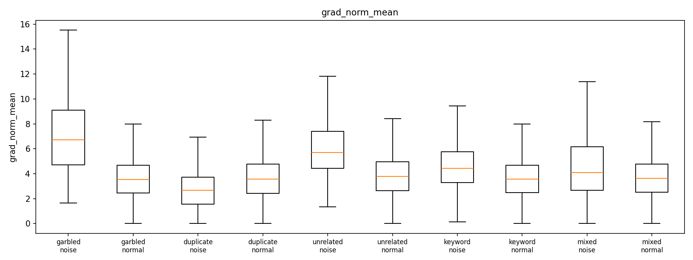
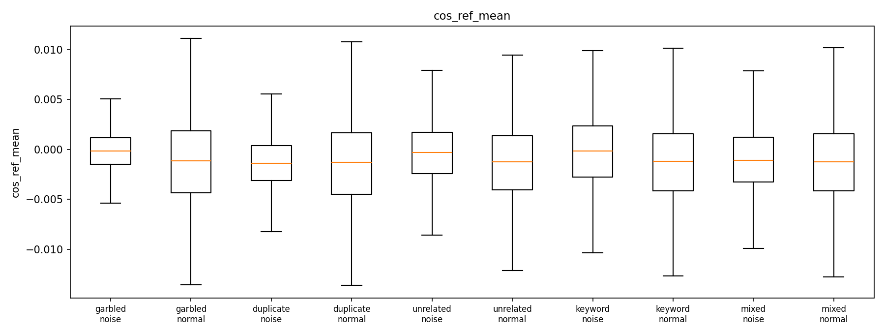

# 噪音样本对 LLM 微调的影响: 逐样本指标追踪与检测分析报告

> 实验日期: 2026-08-12 ~ 2026-08-14
> 基座模型: Qwen2.5-3B-Instruct (LoRA r=32, 59.9M 可训练参数) · 训练数据: databricks-dolly-15k
> 噪音比例: 10% · 5 epochs · 每 run 14,611 训练样本 · RTX 5090 单卡

---

## 1. 实验设计

### 1.1 研究问题

两个核心问题:
1. **影响**: 四类数据噪音 (乱码 / 重复 / 上下文错配 / 关键字替换) 对 LLM 微调过程和最终能力的影响有多大?
2. **检测**: 仅凭训练过程中可追踪的逐样本指标 (loss / 梯度 / 熵等), 能否将噪音样本从正常样本中分离出来? 哪些指标对哪类噪音有效?

### 1.2 数据集 (6 个, 样本顺序一致, 固定 seed)

| 数据集 | 噪音构造 | 训练行数 | 噪音样本数 |
|---|---|---|---|
| `clean` | 原始数据 (基准线) | 14611 | 0 |
| `garbled` | 10% 样本注入乱码: 混合 Unicode 字符替换 (~12%/字符)、插入 (~3%)、相邻字符交换 (~2%), 保留空白结构 | 14611 | 1461 |
| `duplicate` | 追加 10% (1461 行) 完全逐字节重复的副本行 | 16072 | 1461 |
| `unrelated` | 10% 样本的 instruction 保留、response 替换为**不同类别**样本的通顺回答 (语义正确但上下文无关) | 14611 | 1461 |
| `keyword` | 10% 样本仅替换数字/年份/专有名词 (人名→随机名、歌名→组织名等), 语法与句式完全保留 | 14611 | 1461 |
| `mixed` | 上述 4 类各 2.5%, 共 10% (副本行 366 条) | 14976 | 1461 |

- 所有数据集的样本顺序、sample_id 完全一致 (duplicate/mixed 的副本行追加在末尾) → 6 个 run 的逐样本指标可直接对齐比较;
- 400 条**共享干净保留样本** (`heldout.jsonl`, 与训练集完全不相交) 用于: (a) 训练前计算参考梯度方向 (LESS 式影响力基准); (b) 训练中每 200 步评估 held-out 泛化损失;
- 每样本携带 `noise_label` / `noise_type` / `category` (dolly 的 8 类任务) 标签。

### 1.3 训练配置

| 配置 | 值 | 说明 |
|---|---|---|
| 微批大小 | 1 | 每样本梯度可精确捕获 (反向传播前快照累积梯度, 做差得到逐样本梯度) |
| 梯度累积 | 16 | 每 16 样本一次优化器步 (4570~5025 步/run) |
| 学习率 | 2e-4, cosine 衰减 + 3% warmup | 6 run 完全一致 |
| 优化器 | AdamW (betas 0.9/0.999) | |
| 精度 | bf16 + flash-attention-2 | |
| 序列长度 | 1024 (截断时优先保留 assistant 回复) | 避免 0 标签 token 的 NaN 损失 |
| 时长 | 每 run 3.3~3.9 小时 | clean 3.69h / mixed 3.91h / duplicate 3.58h |

### 1.4 记录的指标 (三个层级, 19+ 维特征)

**样本级指标** — 每样本 × 每 epoch 实时捕获 (微批=1 差分法: 反向前快照累积梯度 $\mathbf{b}$, 反向后快照 $\mathbf{a}$, 做差 $\delta = \mathbf{a} - \mathbf{b}$ 即该样本的精确梯度; 开销仅 +5-8% 训练时间), 共 6 项:

**1. loss** — 标签 token 上的平均交叉熵:

$$\text{loss} = -\frac{1}{|L|}\sum_{t \in L} \log p_\theta(\text{next\\_id}[t] \mid x_{<t})$$

- **意义**: 该样本在当前位置的拟合难度, 训练监控最直接的量;
- **检测直觉**: "学不动"的噪音 (乱码) 损失持续偏高; 但存在**反向陷阱** — 可被快速记忆的噪音 (duplicate 副本) 损失反而低于正常样本 (检测 AUC 0.37, 方向反转);
- **实测**: garbled 全程最高 (epoch 4 仍 0.70 vs clean 0.51); duplicate 收敛最低 (0.43)。

**2. grad_norm** — 样本 LoRA 梯度的 L2 范数: $\text{grad\\_norm} = \\|\delta\\|_2$

- **意义**: 该样本对模型参数更新的"推力"大小;
- **检测直觉**: 与参考方向一致的大梯度 = 有价值难样本; 幅值异常 = 噪音嫌疑;
- **实测**: unrelated 偏高 (0.764), duplicate 偏低 (0.343, 反转), garbled 0.829。

**3. cos_sim_ref** — 与**干净参考方向**的余弦相似度 (LESS 式影响力):

$$\text{cos\\_sim\\_ref} = \frac{\langle \delta,\\, \mathbf{g}^{\ast} \rangle}{\\|\delta\\|_2 \\, \\|\mathbf{g}^{\ast}\\|_2}$$

其中 $\mathbf{g}^{\ast}$ 为训练前在 200 条保留干净样本上计算的平均 LoRA 梯度 (单位向量)。

- **意义**: 该样本梯度方向与"干净训练方向"的夹角 — 接近 1 表示推动模型沿干净方向学习; 接近 0 或负值表示与干净方向冲突;
- **实现细节**: 训练前一次性计算, 训练全程复用; 是 LESS (Xia et al. 2024) 影响力估计的高效近似;
- **实测**: 单指标 AUC 中等 (0.58-0.62), 但作为组合特征的重要成员 (LR 特征重要性前列)。

**4. cos_sim_global** — 与当前累积窗口 (16 样本) 梯度方向的余弦:

$$\text{cos\\_sim\\_global} = \frac{\langle \delta,\\, \mathbf{g}_{\text{acc}} \rangle}{\\|\delta\\|_2 \\, \\|\mathbf{g}_{\text{acc}}\\|_2}$$

- **意义**: 批次内梯度一致性; 负值 = 该样本与周围 15 个样本的主流更新方向冲突;
- **实测**: duplicate 上相对有效 (0.610) — 副本的梯度与窗口内其他样本系统性冲突。

**5. update_contrib** — Adam 归一化更新贡献 (仅 B 矩阵):

$$\text{update\\_contrib} = \frac{\\|\delta_B\\|_2}{\big\\|\sqrt{\mathbf{v}_B}\big\\|_2 + 10^{-8}}$$

- **动机**: 原始梯度范数未考虑 Adam 的历史尺度; 除以二阶矩平方根后, 反映该样本相对"近期梯度 RMS"的推动力;
- **实现细节**: 只统计 B 矩阵 — LoRA B 零初始化导致 A 的早期梯度恒为 0, 逐元素归一化会爆炸 (实测 2.3e8), 必须只取 B;
- **实测**: garbled 0.836 / unrelated 0.724 / keyword 0.636 / duplicate 0.330 (反转)。

**6. tokens** — 标签 token 数: 序列长度控制变量, 用于分层分析 (长序列样本的 loss 更稳定)。

**诊断级指标** — 每 epoch 末对 1/8 抽样做前向-only 诊断 (成本 ~30s/epoch, `diag_epoch*.jsonl`), 全部基于全序列 next-token CE ($\text{ce}[t]$, 目标必须用真实 token id — 用 $-100$ 会被 cross\_entropy 置 0, 这是 user_loss 曾经恒为 0 的 bug 根因):

**7. max_token_loss** — $\max_{t \in L} \text{ce}[t]$: 单样本内最大 token 损失, 捕捉"局部极端" — 乱码样本的个别 token 损失极高;

**8. frac_hard** — loss > 4.0 的 token 占比: 全局困难度; garbled 最高且随训练几乎不降 (epoch 4: 4.84% vs clean 4.36%), duplicate 最低 (3.82%, 已全部记忆);

**9. user_loss** — prompt 部分的平均损失 $\frac{1}{|U|}\sum_{t \in U} \text{ce}[t]$: **输入侧信号** — 乱码同时污染输入 → 飙升 (AUC 0.979); keyword/unrelated 只改输出 → 该值正常 (AUC ~0.5, 负信息);

**10. entropy** — 标签 token 的 next-token 熵均值: 模型对输出的确定性; 乱码处熵极高 (AUC 0.971); 记忆样本熵低 (duplicate 0.406);

**11. token_loss_skew/kurt** — 逐 token 损失分布的偏度/峰度: 反直觉的是乱码使*几乎所有* token 都难 → 分布接近均匀 → 偏度接近 0 (AUC 0.064) — "没有信号的信号";

**12. top-32 硬 token 明细** — 位置/token id/损失 (`token_diag_epoch*.jsonl`): 供离线 token 级定位与归因。

**派生特征** — 训练后从 per-epoch 序列派生 (零成本):

**13. loss_mean / loss_last / loss_std / loss_slope** — 损失水平 / 末值 / 跨 epoch 波动 / 首末差值: $\text{loss\\_std}$ 是 unrelated 的主力特征 (0.827), 正常难样本平滑下降而错配样本剧烈波动;

**14. converge_epoch** — $\min\\{e : l_e < 2.0\\}$ (无则取 E): 收敛速度 — garbled 61% 永不收敛 vs duplicate 平均 0.32 epoch 即收敛, 完美镜像;

**15. loss_rank** — 每 epoch 内 loss 分位数的均值: 消除整体水平漂移, 跨 run/跨 epoch 可比;

**16. loss_curvature** — 损失轨迹的二次拟合系数 ($[l_e] \approx c_2 e^2 + c_1 e + c_0$, 取 $c_2$): **全实验最强的单特征** — garbled 0.985 / unrelated 0.830 / keyword 0.669, 综合捕获"学不动"与"波动学"两类异常轨迹;

**17. grad_norm_cv / cos_ref_trend** — 梯度波动率 ($\sigma/\mu$) / 参考对齐趋势 (末-首): 补充梯度与方向的时间演化信息;

**18. text_nn_sim** — TF-IDF (1-2 gram) 最近邻余弦相似度: **数据侧特征, 与训练完全无关** — duplicate 的唯一有效手段 (0.939), 副本间相似度 ≈1.0 而正常样本 ≈0.2-0.5。

**token 级 (离线, 每数据集 60 噪音 + 60 正常样本)**: 对每样本 top-24 最难标签 token 逐一 `autograd.grad` 反向, 得到逐 token 的**精确** LoRA 梯度范数与余弦相似度 (代价: 每 hard token 一次反向, 仅离线小样本计算)。

---

## 2. 训练动态: 噪音如何影响训练过程

### 2.1 训练集 loss 轨迹 (各 epoch 均值)

| run | epoch 0 | epoch 1 | epoch 2 | epoch 3 | epoch 4 | 相对 clean (末值) |
|---|---|---|---|---|---|---|
| clean | 1.366 | 1.127 | 0.861 | 0.642 | 0.514 | — |
| garbled | **1.669** | 1.386 | 1.093 | 0.848 | **0.702** | +37% |
| unrelated | 1.494 | 1.248 | 0.896 | 0.641 | 0.498 | −3% |
| keyword | 1.427 | 1.164 | 0.894 | 0.665 | 0.533 | +4% |
| mixed | 1.496 | 1.207 | 0.904 | 0.662 | 0.525 | +2% |
| duplicate | 1.349 | 1.077 | 0.794 | 0.557 | **0.425** | **−17%** |


**解读:**
1. **garbled 全程损失最高** — epoch 0 即高出 clean 22%, 且差距随时间扩大 (epoch 4 高 37%)。乱码样本的信息密度趋近于零, 模型永远无法"学会"它们, 其高损失持续抬升训练集整体均值;
2. **duplicate 收敛到最低** (0.425, 比 clean 低 17%) — 副本在首个 epoch 就被精确记忆, 之后每个 epoch 都近乎 0 损失。**低训练损失在此不是健康信号, 而是过拟合/记忆的信号**;
3. unrelated / keyword / mixed 的均值轨迹与 clean 几乎重合 — 说明**均值损失对这些语义级噪音完全钝感**, 它们成功伪装成"正常难样本"。

### 2.2 收敛速度分析 (converge_epoch: loss 首次 < 2.0 的 epoch)

| run | 噪音样本均值 | 正常样本均值 | 噪音"永不收敛"占比 | 正常"永不收敛"占比 |
|---|---|---|---|---|
| garbled | **4.06** | 0.63 | **61%** | 4% |
| unrelated | 1.37 | 0.63 | 3% | 4% |
| keyword | 1.07 | 0.63 | 7% | 4% |
| mixed | 1.45 | 0.61 | 14% | 4% |
| duplicate | **0.32** | 0.60 | 2% | 3% |

**解读:** 收敛速度是极好的判别特征:
- **garbled**: 61% 的噪音样本 5 个 epoch 后 loss 仍未降到 2.0 — "学不动"是乱码的决定性特征;
- **duplicate**: 噪音副本平均 0.32 个 epoch 就收敛 (比正常样本还快) — 与 garbled 构成完美镜像: **一个是永不收敛, 一个是瞬间收敛**;
- unrelated/keyword 的收敛只比正常慢 0.4~0.7 epoch — 有信号但较弱。

### 2.3 逐 epoch 诊断: 困难 token 占比 (frac_hard, loss>4)

| run | epoch 0 末 | epoch 2 末 | epoch 4 末 |
|---|---|---|---|
| garbled | **7.40%** | 5.80% | **4.84%** |
| keyword | 7.17% | 5.48% | 4.48% |
| unrelated | 7.26% | 5.51% | 4.36% |
| clean | 7.07% | 5.35% | 4.36% |
| mixed | 7.49% | 6.31% | 4.34% |
| duplicate | 7.01% | 5.44% | **3.82%** |

**解读:** 所有 run 的困难 token 占比随训练下降 (模型在适应); garbled 全程最高 (乱码 token 永远是"困难 token"), duplicate 最终最低 (被记忆后没有困难 token)。注意各 run 起始值接近 — 差异在训练过程中被放大。

### 2.4 Held-out 干净样本损失 (泛化损伤, 每 200 步评估)

| run | 初始 (step 200) | 最终 | 增幅 |
|---|---|---|---|
| clean | 1.628 | 2.051 | +0.423 |
| keyword | 1.627 | **2.044** | **+0.417 (最小)** |
| garbled | 1.629 | 2.059 | +0.430 |
| mixed | 1.624 | 2.081 | +0.457 |
| unrelated | 1.626 | 2.090 | +0.465 |
| duplicate | 1.626 | **2.143** | **+0.517 (最大)** |


**解读:**
1. **所有 run (含 clean) 的 held-out 损失都在上升** — 在 dolly-15k 上跑 5 个 epoch 的 LoRA 微调本身就在过拟合 (+0.42 是"基线过拟合量");
2. **duplicate 的过拟合最重** (+0.517, 比 clean 多 22%) — 重复样本让模型对特定句子的记忆更强, 进一步挤压泛化空间;
3. **keyword 的过拟合最轻** (+0.417) — 与第 5 节的验证集结果一致: 只改几个词的噪音几乎无害;
4. unrelated (+0.465) 的损伤大于 garbled (+0.430) — 语义级错配比表面乱码更能误导模型, 这是本研究最反直觉但最重要的发现之一。

### 2.5 层梯度范数 (训练末窗口, 首/中/尾三层)

| run | layer 0 (嵌入近端) | layer 18 (中层) | layer 35 (输出近端) |
|---|---|---|---|
| garbled | **3.00** | 3.27 | **5.10** |
| unrelated | **3.15** | 3.07 | 3.91 |
| keyword | 2.57 | 3.17 | 3.86 |
| clean | 2.13 | 3.21 | 3.82 |
| mixed | 2.04 | 3.46 | 3.70 |
| duplicate | **1.29** | **1.65** | **1.83** |


**解读:** garbled/unrelated 在浅层 (layer 0) 梯度范数显著高于 clean (+41%/+48%) — 噪音刺激让模型在输入编码层持续产生大幅更新; duplicate 在所有层都最低 (记忆完成后梯度趋于零)。层级视角的噪音特征与样本级一致。

---

## 3. 样本级噪音检测

### 3.1 单指标 AUC 全表 (噪音 vs 同 run 正常样本, 19 个指标)

| 指标 | garbled | duplicate | unrelated | keyword | mixed |
|---|---|---|---|---|---|
| loss_mean | 0.955 | **0.369** | 0.724 | 0.627 | 0.627 |
| loss_last | 0.865 | 0.372 | 0.575 | 0.572 | 0.553 |
| loss_std | 0.780 | 0.516 | 0.827 | 0.649 | 0.695 |
| loss_slope | 0.206 | 0.487 | 0.167 | 0.343 | 0.302 |
| converge_epoch | 0.941 | 0.458 | 0.714 | 0.602 | 0.648 |
| loss_rank | 0.936 | 0.355 | 0.699 | 0.617 | 0.606 |
| **loss_curvature** | **0.985** | 0.432 | **0.830** | **0.669** | 0.691 |
| grad_norm_mean | 0.829 | 0.343 | 0.764 | 0.639 | 0.580 |
| grad_norm_cv | 0.166 | 0.578 | 0.435 | 0.451 | 0.438 |
| cos_ref_mean | 0.583 | 0.497 | 0.575 | 0.569 | 0.517 |
| cos_ref_trend | 0.436 | 0.369 | 0.456 | 0.451 | 0.421 |
| cos_global_mean | 0.579 | 0.610 | 0.503 | 0.497 | 0.554 |
| update_contrib_mean | 0.836 | 0.330 | 0.724 | 0.636 | 0.579 |
| max_token_loss | 0.809 | 0.352 | 0.650 | 0.613 | 0.585 |
| frac_hard | 0.954 | 0.369 | 0.719 | 0.634 | 0.610 |
| **user_loss** | **0.979** | 0.510 | 0.488 | 0.550 | 0.584 |
| **entropy** | **0.971** | 0.406 | 0.637 | 0.638 | 0.630 |
| token_loss_skew | 0.064 | 0.520 | 0.532 | 0.437 | 0.467 |
| **text_nn_sim** | 0.358 | **0.939** | 0.725 | 0.472 | 0.716 |

**逐噪音解读:**

- **garbled (最好检)**: 由 `loss_curvature` (0.985)、`user_loss` (0.979)、`entropy` (0.971) 三者锁定 — 乱码同时污染输入与输出, 模型在 prompt 侧和 response 侧都表现出"学不动 + 不确定"; 注意 `token_loss_skew` (0.064) 几乎为零: 乱码使**几乎所有** token 都难, 而非少数 token 极难, 所以偏度反而无信号;
- **duplicate**: `text_nn_sim` (0.939) 一枝独秀; 所有训练侧指标的 AUC ≤0.61, 且 `loss_mean` (0.369) **低于 0.5** — 副本的损失比正常样本还低, 训练侧信号方向颠倒。这证明: **对重复噪音, 数据侧特征 (文本相似度) 是唯一有效手段, 训练动态特征不仅弱而且方向相反**;
- **unrelated**: `loss_curvature` (0.830)、`loss_std` (0.827)、`grad_norm_mean` (0.764) — 跨 epoch 的损失波动与曲率暴露了"通顺但不匹配"的回复;
- **keyword**: 所有指标 AUC 0.47~0.67 — **没有任何一个指标能可靠区分**, 样本级检测在此失效;
- **mixed**: 各特征被四类噪音互相稀释, `text_nn_sim` (0.716) 仍捕获其中的 duplicate 子集。

### 3.2 检测力随训练进程的演变 (逐 epoch loss AUC)

| run | epoch 0 | epoch 1 | epoch 2 | epoch 3 | epoch 4 |
|---|---|---|---|---|---|
| garbled | **0.985** | 0.969 | 0.930 | 0.889 | 0.865 |
| unrelated | 0.829 | 0.760 | 0.671 | 0.601 | 0.575 |
| keyword | 0.672 | 0.623 | 0.604 | 0.584 | 0.572 |
| duplicate | 0.435 | 0.365 | 0.325 | 0.314 | 0.372 |

**关键发现: 检测能力随训练单调衰减。** epoch 0 时 garbled 的 loss AUC 高达 0.985, 到 epoch 4 降到 0.865; unrelated 从 0.829 降到 0.575。原因: 模型逐渐"部分适应"了噪音 (正常与噪音的损失差距缩小)。**实践启示: 数据清洗应尽早进行 (首 epoch 内), 而非等训练结束后再筛查。**

### 3.3 多指标分类器 (LR / 随机森林, 19 维特征, 70/30 划分)

| 噪音类型 | LR AUC | RF AUC | 准确率 | 混淆矩阵 (TN,FP/FN,TP) | 结论 |
|---|---|---|---|---|---|
| garbled | **0.9996** | 0.9996 | 99.3% | 248,2 / 0,22 | 近乎完美可分 |
| duplicate | 0.974 | 0.973 | 95.3% | 273,3 / 11,12 | 强可分 |
| unrelated | 0.923 | 0.887 | 94.1% | 247,9 / 7,9 | 强可分 |
| mixed | 0.850 | 0.827 | 92.1% | 245,10 / 12,12 | 中等可分 |
| keyword | **0.531** | 0.551 | (全判正常) | 255,1 / 16,0 | **不可分** |


**解读:** 组合 19 个特征后, 前四类噪音都达到实用水平 (AUC ≥ 0.85); 但 keyword 的分类器 AUC 仅 0.53 — 它把所有样本都判为正常 (混淆矩阵 16/0 的召回率), **这是模型的诚实行为: keyword 噪音在特征空间中与正常样本完全重叠**。

### 3.4 关键指标的噪音/正常分布对比

<center>

| 损失与梯度 | 输入侧特征 |
|---|---|
|  |  |
|  |  |
|  |  |

</center>

> 完整 19 张单指标分布图见 `results/charts/metric_dist_*_ratio10.png`。每张图为 5 种噪音类型 × (噪音/正常) 的箱线图。从图中可直观看到: garbled 的 user_loss/entropy 与正常样本几乎零重叠; duplicate 的 text_nn_sim 呈双峰 (1.0 附近是副本); keyword 的所有分布都与正常重叠。

### 3.5 样本特征 PCA 投影


**解读:** 19 维特征标准化后的 PCA 前两维上, garbled (红色) 与正常样本 (灰色) 形成清晰分离的簇; duplicate (蓝色) 沿 text_nn_sim 方向分离; unrelated (绿色) 部分重叠; keyword (紫色) 完全嵌入正常簇内 — 与 AUC 结论一致。

### 3.6 跨任务类型迁移性 (按 dolly 的 8 个 category 分层, 随机森林 AUC)

| category | n | 噪音数 | RF AUC |
|---|---|---|---|
| closed_qa | 650 | 44 | **0.987** |
| creative_writing | 295 | 27 | 0.979 |
| information_extraction | 488 | 32 | 0.977 |
| brainstorming | 761 | 37 | 0.977 |
| general_qa | 790 | 56 | 0.943 |
| summarization | 527 | 55 | 0.942 |
| open_qa | 1342 | 102 | 0.919 |
| classification | 693 | 57 | **0.870 (最难)** |

**噪音 × 类别矩阵 (部分)**

| category | duplicate | garbled | keyword | unrelated |
|---|---|---|---|---|
| open_qa | 0.980 | 0.992 | 0.535 | 0.925 |
| brainstorming | 0.946 | **1.000** | 0.431 | 0.972 |
| classification | 0.667 | **1.000** | 0.604 | 0.896 |
| summarization | 0.870 | 1.000 | 0.396 | 1.000 |

**解读:**
1. **检测方法在全部 8 种任务类型上有效** (AUC 0.87~0.99) — 不需要按任务类型重新校准;
2. **classification 最难** — 短结构化回复 (如 "是/否/标签") 让 token 级信号 (entropy / user_loss / frac_hard) 全部变弱, 主要靠 loss 轨迹类特征;
3. **garbled 在所有类别上接近 1.0** — 是最普适的检测目标; keyword 在所有类别上都弱 (0.40~0.60), 证实其盲区与任务类型无关。

---

## 4. Token 级检测 (精确逐 token 梯度归因)

### 4.1 方法

对每个噪音数据集抽样 **60 噪音 + 60 正常**样本, 用该 run 的**最终模型**前向 (保留计算图), 取每样本 top-24 最难标签 token, 对每个 token 的损失单独 `autograd.grad(loss_t, lora_params, retain_graph=True)`, 得到逐 token 精确梯度 → 特征: `hard_loss_mean`、`hard_gradnorm_mean`、`hard_cos_ref_mean` (与干净参考方向余弦)、`pos_std` (硬 token 位置离散度)。

### 4.2 检测 AUC

| 特征 | garbled | duplicate | unrelated | keyword |
|---|---|---|---|---|
| hard_loss_mean | **0.767** | 0.414 | 0.582 | 0.486 |
| hard_gradnorm_mean | **0.767** | 0.414 | 0.601 | 0.502 |
| hard_cos_ref_mean | 0.624 | 0.588 | 0.553 | 0.478 |
| pos_std | 0.571 | 0.461 | 0.533 | 0.411 |

<center>

| garbled | duplicate |
|---|---|
|  |  |
| unrelated | keyword |
|  |  |

</center>

> 每张图为 3 个噪音样本的 top-k 最难 token 位置-损失散点 (仅展示损失最高的 token, 非全序列)。

**解读:**
1. **garbled 在 token 级仍最强可分** (0.77) — 被污染的 token 位置产生局部极端损失与异常梯度;
2. **duplicate 的 token 级 AUC 低于 0.5** — 副本 token 被完美记忆 (损失极低), 与正常样本不可分。其可检测性 100% 来自数据侧 (文本相似度), 训练动态在 token 级也完全失效;
3. token 级 AUC 普遍低于样本级 (0.77 vs 0.9996) — 单个 hard token 的信号噪声比有限; **样本级聚合 (跨 token、跨 epoch) 才是可靠的检测尺度**;
4. pos_std 对所有类型都弱 (~0.4~0.57) — 硬 token 的空间分布不构成判别特征。

### 4.3 已知局限

乱码定位验证 (`loc_mismatch_frac`, 高损失 token 与干净文本同位 token 的不匹配率) 结果为 0 — **字符级污染改变了 tokenization 边界, 位置对齐比较失效**。正确做法是序列对齐 (如编辑距离对齐) 后比较, 留作后续工作。

---

## 5. 噪音对模型最终能力的影响 (7 模型 × 7 验证集)

### 5.1 总体对比

| 模型 | MMLU | GSM8K | HellaSwag | ARC | BBH | TruthfulQA | Winogrande |
|---|---|---|---|---|---|---|---|
| clean | 0.6295 | 0.5413 | 0.2715 | 0.7995 | 0.0741 | 0.1922 | 0.5383 |
| garbled | 0.6354 | 0.5269 | 0.2664 | 0.8080 | 0.0944 | 0.1873 | 0.5359 |
| duplicate | 0.6309 | 0.5125 | 0.2732 | 0.7918 | 0.0778 | 0.1983 | 0.5525 |
| unrelated | 0.6241 | 0.4981 | 0.2705 | 0.7901 | 0.0833 | 0.1824 | 0.5335 |
| keyword | 0.6333 | 0.5231 | 0.2750 | 0.7986 | 0.0759 | 0.1848 | 0.5241 |
| mixed | 0.6315 | **0.5732** | 0.2673 | 0.7952 | 0.0907 | 0.1836 | 0.5375 |
| **base (未微调)** | **0.6637** | **0.7460** | 0.2745 | **0.8311** | 0.0611 | **0.1934** | **0.5856** |

### 5.2 核心发现

1. **噪音的伤害远小于微调本身的伤害**: 6 个微调模型的成绩互相接近 (MMLU 极差仅 0.011), 而基座模型在 **4/7** 个验证集上全面优于所有微调模型 — 尤其 GSM8K (0.746 vs ~0.52, 差 22 个百分点) 和 ARC (0.831 vs ~0.79)。dolly-15k 上的 SFT 显著损害通用能力, 该效应完全淹没 10% 噪音的差异;
2. **unrelated 综合最差** (MMLU −0.005、GSM8K −0.043、ARC −0.009 vs clean) — 语义通顺但上下文错配的噪音误导最深, 与其 held-out 损伤 (+0.465) 一致;
3. **garbled 几乎没有损害 MMLU** (0.635 > clean 0.630) — 最易检测的噪音最无害: 模型很快学会"忽略"乱码样本 (高损失但不产生误导性知识);
4. **duplicate 在 Winogrande/TruthfulQA 上反而略高** (+0.014/+0.006) — 记忆效应对少数任务有微弱正收益, 但代价是 held-out 泛化损失最大;
5. **BBH 是例外**: 微调模型全部优于基座 (0.074~0.094 vs 0.061) — dolly 的 instruction 风格对 BBH 这类结构化推理有帮助 (见 5.5)。

### 5.3 逐题翻转分析 (MMLU, 噪音模型 vs clean 模型)

| 模型 | 翻转题目数 / 14042 | 翻转率 | 同时答对题数 |
|---|---|---|---|
| unrelated | 2133 | **15.2%** | 7735 |
| keyword | 1815 | 12.9% | 7959 |
| garbled | 1772 | 12.6% | 7995 |
| mixed | 1750 | 12.5% | 7979 |
| duplicate | 1571 | **11.2%** | 8064 |

**解读:** 即使总体准确率几乎相同, **每 7~9 题就有 1 题在两个模型间翻转** — 噪音模型与 clean 模型"犯不同的错误"。unrelated 的翻转率最高 (15.2%), 且同时答对的题最少 — 它真正改变了模型的知识与推理路径; duplicate 翻转最少 (11.2%), 与 clean 最接近。

### 5.4 MMLU 57 学科明细

**基座模型的学科画像:** 最强 — marketing (0.88)、high_school_world_history (0.87)、high_school_government_and_politics (0.87); 最弱 — college_mathematics (0.35)、global_facts (0.36)、moral_scenarios (0.37)。基座明显偏文科/常识, 数学推理是其短板。

**各噪音类型受损最重的 3 个学科 (与 clean 之差):**

| 模型 | 受损最重学科 |
|---|---|
| garbled | high_school_computer_science (−0.060) / business_ethics (−0.050) / global_facts (−0.050) |
| duplicate | electrical_engineering (−0.055) / astronomy (−0.046) / high_school_computer_science (−0.040) |
| unrelated | electrical_engineering (−0.076) / high_school_computer_science (−0.060) / jurisprudence (−0.055) |
| keyword | global_facts (−0.040) / formal_logic (−0.040) / anatomy (−0.037) |
| mixed | anatomy (−0.082) / global_facts (−0.060) / electrical_engineering (−0.055) |

**解读:**
- 学科级平均差异仅 ±0.005 — **没有噪音类型造成系统性的学科损伤**;
- 受损学科集中在**事实型** (global_facts, anatomy) 与**技术型** (electrical_engineering, computer_science) — 与噪音污染事实类样本的机制吻合;
- 一个有趣的规律: 所有噪音 run 在 **college_mathematics** 上都**高于** clean (+0.05~+0.11) — 噪音对过拟合的轻微正则化效应在模型最弱的学科上体现得最明显。

### 5.5 其他分组明细

**BBH (27 任务)**: SFT 相对基座提升最大的任务 — sports_understanding (+0.40)、boolean_expressions (+0.15)、causal_judgement (持平); 受损 — object_counting (−0.20)。总体而言微调模型的 BBH 均分 (0.074~0.094) 高于基座 (0.061)。

**HellaSwag (192 活动类别)**: 各噪音类型的均值差异 ≤0.007; 单类别最大偏差 (样本量小, 谨慎解读) — unrelated 的 Getting a tattoo (−0.50)、keyword 的 Hand washing clothes (−0.38)。无系统性格局。

**TruthfulQA (39 类别)**: SFT 本身的影响远大于噪音 — 相对基座, clean 模型在 Mandela Effect (−0.167)、Conspiracies (−0.120) 上受损, 在 Distraction (+0.214)、Subjective (+0.111) 上提升; 噪音模型与 clean 的类别级差异 <0.02。

### 5.6 置信度与生成行为 (逐题原始记录)

**MC 置信度 (margin = 次优与最优 nll 之差):**

| 模型 | 答对时 margin | 答错时 margin | 比值 (校准度) |
|---|---|---|---|
| base | 4.918 | 1.293 | **3.80 (最校准)** |
| clean | 3.844 | 1.169 | 3.29 |
| garbled | 4.266 | 1.314 | 3.25 |
| duplicate | 4.037 | 1.276 | 3.16 |
| unrelated | 4.747 | 1.500 | 3.16 |
| keyword | 4.564 | 1.392 | 3.28 |
| mixed | 4.636 | 1.325 | 3.50 |

**解读:** 所有模型的 margin 都有区分度 (答对 ~4、答错 ~1.3); clean 模型"最犹豫" (答对时 margin 最低 3.84); 噪音模型的置信度**不低于** clean — 噪音没有让模型变得"更自信或更犹豫", 再次说明其影响主要在个别知识上, 而非全局行为。

**生成长度:** base 平均 109 token/题 vs 微调模型 ~54 token — **dolly SFT 使回答显著变简洁** (dolly 的回复本身平均仅 2~3 句), 这是比噪音影响大得多的行为变化。

---

## 6. 结论与讨论

### 6.1 核心结论

1. **样本级检测可行性排序**: garbled (0.9996) > duplicate (0.974) > unrelated (0.923) > mixed (0.850) > **keyword (0.531, 不可行)**;
2. **特征与噪音的对应关系**:
   - garbled → 输入输出双侧特征 (user_loss/entropy/loss_curvature), 训练动态即可锁定;
   - duplicate → **必须用数据侧特征** (text_nn_sim); 训练动态不仅无效且方向相反 (loss AUC 0.37);
   - unrelated → 跨 epoch 损失波动与曲率 (loss_std/curvature), 中等强度;
   - keyword → 需要实体级检测手段 (如实体一致性校验), 本研究全部 19 个指标均无效;
3. **检测难度与危害性反相关**: 最易检测的 garbled 对模型几乎无害 (MMLU 反而 +0.006); 最难检测的 unrelated/keyword 才是潜在危害最大的噪音。**真实数据清洗应把资源优先投入"难以检测"的语义级噪音**;
4. **检测窗口很重要**: 检测力随训练单调衰减 (garbled loss AUC 从 epoch 0 的 0.985 降到 epoch 4 的 0.865) — **数据清洗应尽早进行**;
5. **10% 污染的绝对影响很小**: 6 个微调模型的验证集成绩几乎无差异, 且全部劣于基座 (dolly SFT 本身损害通用能力) — 在 LoRA + 中等规模数据的设置下, 10% 噪音的边际损害被 SFT 本身的效应淹没;
6. **噪音仍有可观测的痕迹**: duplicate 的过拟合 (held-out +0.517, 相对 clean 多 22%)、unrelated 的逐题翻转率最高 (15.2%) 与 MMLU/GSM8K 最大下滑 — 说明影响真实存在, 只是量级小于微调本身;
7. 方法跨任务类型稳健 (8 类别 AUC 0.87~0.99, garbled 在所有类别接近 1.0)。

### 6.2 局限与后续工作

1. **keyword 检测盲区** — 需要实体感知的检测手段 (NER 一致性、反事实扰动);
2. **乱码定位** — 位置对齐法失效, 需序列对齐算法;
3. **噪音比例外推** — 10% 的结论未必适用于 5%/20%; 尤其检测力衰减曲线 (3.2) 暗示更低比例下检测更难。5% 数据已就绪, `bash run_experiment.sh --ratio 0.05 --tag ratio05 --reuse-clean` 一键启动 (复用 clean run 省 3 小时);
4. **单一数据集/模型** — 结论基于 dolly-15k + Qwen2.5-3B + LoRA; 分类型数据集、更大模型、全参微调下的结论需要再验证 (类别分层分析已给出初步迁移性证据);
5. **eval 协议** — HellaSwag/TruthfulQA 的绝对分偏低 (5-shot/0-shot 与 chat 模板的交互); 模型间比较有效, 绝对值引用需谨慎;
6. **逐题翻转 (5.3) 揭示一个更深的问题**: 总体准确率掩盖了个体题目层面的差异 — 后续可研究"噪音模型与 clean 模型犯错模式的可视化/归因"。

### 6.3 复现

```bash
# 数据 + 训练 + 评估 + 分析 (10% 为默认 tag)
python scripts/make_noise.py
bash run_all.sh
bash run_all_eval.sh
python scripts/analyze_detection.py
python scripts/analyze_token_level.py
# 其他比例: bash run_experiment.sh --ratio 0.05 --tag ratio05 --reuse-clean
```

---

*本报告由实验流水线自动生成的产物汇总而成; 全部原始数据见 `results/` (评测明细、逐题记录、检测表格与图表) 与 `<data_root>/runs/ratio10/` (逐样本指标、逐 token 诊断、层范数、TensorBoard 事件)。*


---

## 7. 5% 比例实验 (ratio05): 剂量-效应验证

> 与 ratio10 完全相同的设置 (模型/epoch/超参/seed), 仅噪音比例降为 5% (每类型 731 条噪音)。
> clean run 与 clean/base 评估结果直接复用 ratio10 (数据与模型逐字节一致)。

### 7.1 训练动态对比

| run | epoch 0 | epoch 1 | epoch 2 | epoch 3 | epoch 4 | (10% 对照末值) |
|---|---|---|---|---|---|---|
| garbled | 1.526 | 1.257 | 0.977 | 0.746 | 0.609 | (0.702) |
| unrelated | 1.437 | 1.194 | 0.876 | 0.641 | 0.504 | (0.498) |
| keyword | 1.403 | 1.151 | 0.878 | 0.654 | 0.523 | (0.533) |
| mixed | 1.438 | 1.176 | 0.895 | 0.666 | 0.533 | (0.525) |
| duplicate | 1.358 | 1.104 | 0.824 | 0.596 | 0.467 | (0.425) |

- 各噪音的 epoch 损失轨迹形状与 10% 一致 (garbled 最高、duplicate 最低), 数值整体更低 (噪音更少);
- **held-out 最终损失**: mixed 2.035 (最低) < clean 2.051 < garbled 2.054 < keyword 2.059 < unrelated 2.063 < **duplicate 2.091 (最高)** — duplicate 的过拟合损伤在 5% 依然最重 (相对 clean +0.040, 约为 10% 时 +0.092 的一半, 近似线性)。

### 7.2 检测结果 (5%)

| 噪音类型 | LR AUC | RF AUC | 最优单指标 (AUC) | vs 10% LR |
|---|---|---|---|---|
| garbled | **0.999** | 0.999 | loss_curvature (0.986) | 0.9996 → 0.999 (持平) |
| duplicate | **0.972** | 0.991 | text_nn_sim (0.963) | 0.974 → 0.972 (持平) |
| unrelated | **0.956** | 0.903 | loss_curvature (0.846) | 0.923 → 0.956 (略升) |
| mixed | **0.737** | 0.916 | text_nn_sim (0.716) | 0.850 → 0.737 (下降) |
| keyword | **0.464** | 0.541 | loss_curvature (0.703) | 0.531 → 0.464 (仍不可检) |

**类别分层 (RF)**: closed_qa 0.993 / summarization 0.976 / information_extraction 0.949 / open_qa 0.931 / brainstorming 0.871 / general_qa 0.871 / **classification 0.710 (最难, 比 10% 的 0.870 更低)** — 短结构回复在低比例下更难分离。

**Token 级 (top-24 硬 token 归因)**: garbled hard_loss/hard_gradnorm AUC **0.79/0.81 (高于 10% 的 0.77)** — 低比例下模型对乱码的"适应"更少, 被污染 token 更突出; duplicate <0.5 (方向反转依旧); unrelated/keyword ~0.5 (不可分, 与 10% 一致)。

### 7.3 剂量-效应: 关键发现

1. **检测力对比例不敏感 (除 mixed)**: garbled/duplicate/unrelated 的检测 AUC 在 5% 与 10% 几乎持平 — 它们的信号机制 (token 级损伤 / 文本重复 / 损失轨迹曲率) 与噪音比例本身无关, 检测器可直接部署到低污染场景;
2. **unrelated 在 5% 反而更伤 MMLU**: 5% 时 MMLU 0.611 (相对 clean -0.019), 10% 时 0.624 (-0.005) — **伤害随比例非单调**。推测: 高比例下模型能识别并"对冲"一部分错配样本; 低比例下每条错配样本更被当作真实样例吸收, 单条误导性更强;
3. **duplicate 过拟合损伤近似线性**: held-out 相对 clean 的增幅 5% (+0.040) ≈ 10% (+0.092) 的一半;
4. **keyword 盲区与比例无关**: 5% (0.46) 与 10% (0.53) 均不可检 — 实体级篡改需要模型外手段;
5. **mixed 是唯一明显衰减项** (0.85 → 0.74): 噪音子集更小, 各特征被稀释得更严重。

### 7.4 验证集对比 (5%, 7 模型)

| 模型 | MMLU | GSM8K | HellaSwag | ARC | BBH | TruthfulQA | Winogrande |
|---|---|---|---|---|---|---|---|
| clean | 0.6295 | 0.5413 | 0.2715 | 0.7995 | 0.0741 | 0.1922 | 0.5383 |
| garbled | 0.6296 | 0.5087 | 0.2729 | 0.7901 | 0.0778 | 0.1848 | 0.5478 |
| duplicate | 0.6327 | 0.5049 | 0.2753 | 0.7978 | 0.0833 | 0.1873 | 0.5627 |
| unrelated | **0.6106** | 0.5481 | 0.2735 | **0.7782** | 0.0852 | **0.1665** | 0.5249 |
| keyword | 0.6295 | 0.5428 | 0.2652 | 0.7952 | 0.0796 | 0.1995 | 0.5241 |
| mixed | 0.6330 | 0.5148 | 0.2731 | 0.7875 | 0.0907 | 0.2020 | 0.5320 |
| base | 0.6637 | 0.7460 | 0.2745 | 0.8311 | 0.0611 | 0.1934 | 0.5856 |

- **unrelated 在 5% 依旧最伤**: MMLU -0.019 / ARC -0.021 / TruthfulQA -0.026 (三处均为最大降幅), 与 10% 的结论一致且更显著;
- 其余噪音类型与 clean 差异 ≤ 0.006, 与 10% 结论一致 (噪音伤害 << 微调本身伤害, base 仍全面领先);
- 一个例外: unrelated 的 GSM8K 在 5% (0.548) 反而高于 10% (0.498) — 数值波动, 需更大样本验证。

### 7.5 结论

5% 实验回答了比例敏感性问题: **检测方法在真实污染水平 (5%) 下依然有效 (garbled 0.999 / duplicate 0.972 / unrelated 0.956), 检测力不随比例衰减; keyword 盲区与混合稀释是仅有的薄弱环节**。同时揭示剂量-效应并非单调 — unrelated 类语义错配噪音在低比例下边际伤害更大, 进一步支持"数据清洗应优先针对语义级噪音"的结论。

