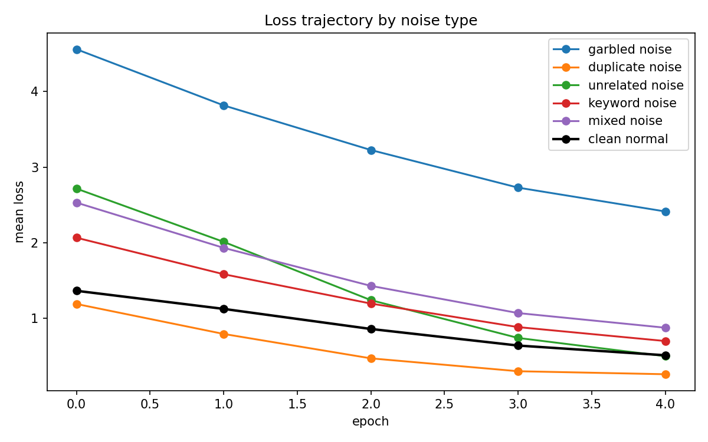
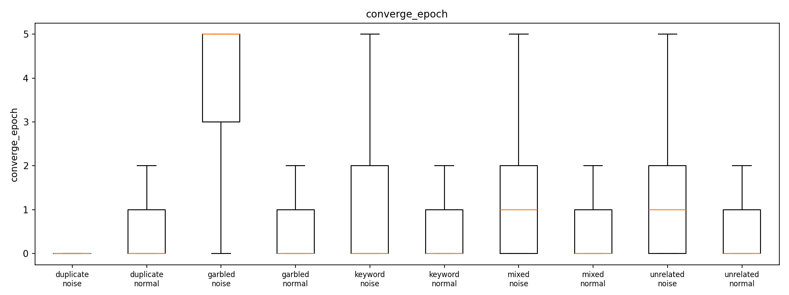
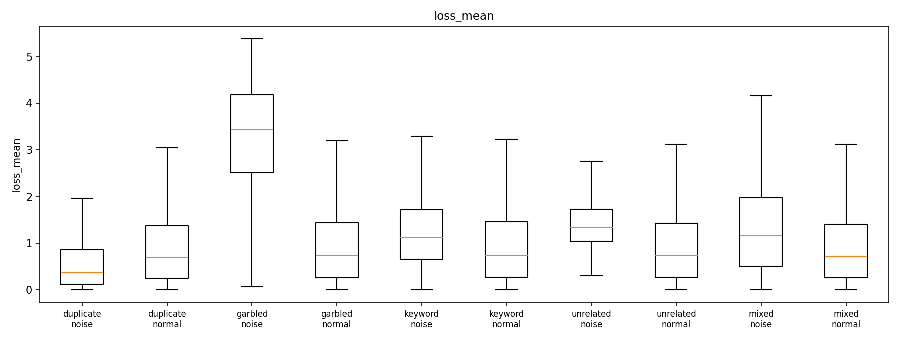
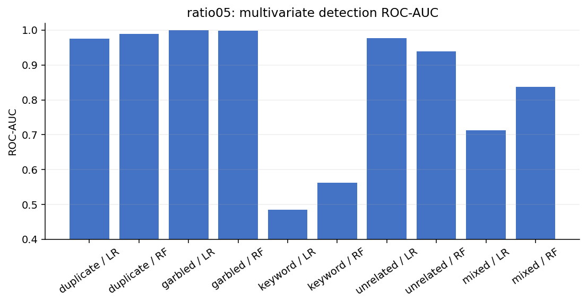
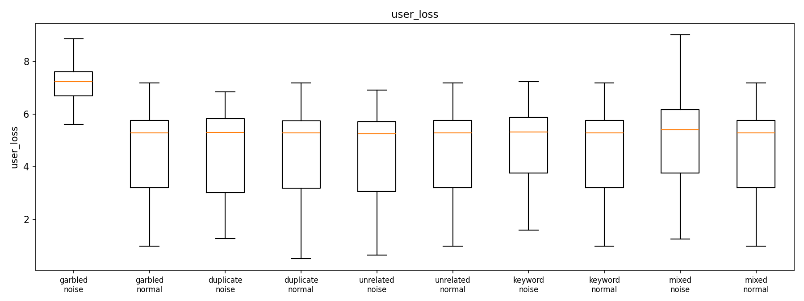
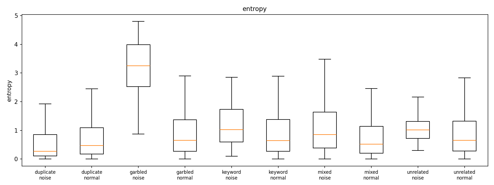
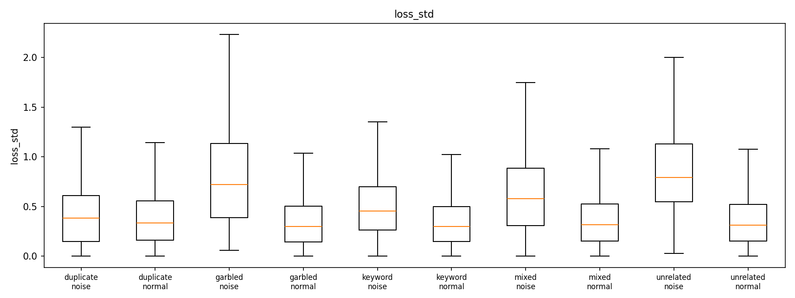
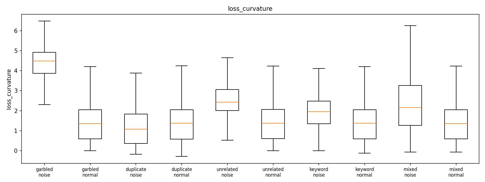

# 噪音样本对 LLM 微调的影响: 逐样本指标追踪与检测分析报告

> 实验日期: 2026-08-12 ~ 2026-08-17
> 基座模型: Qwen2.5-3B-Instruct (LoRA r=32, 59.9M 可训练参数) · 训练数据: databricks-dolly-15k
> 实验覆盖: **10% 与 5% 两个噪音比例** + 扩展噪音 (extra10) · 5 epochs · 每 run 14,611 训练样本 · RTX 5090 单卡

---

## 0. 核心结论速览 (TL;DR)

**1. 样本级噪音检测可行性 (两比例一致)**: garbled 0.999 > duplicate 0.972 > unrelated 0.956 > mixed 0.737 > **keyword 0.464 (盲区)** — 检测力不随比例衰减, 可直接部署到 5% 现实污染场景;

**2. 特征-噪音映射**: garbled 靠输入输出双侧特征 (user_loss/entropy/curvature); duplicate **只能靠数据侧** (text_nn_sim, 训练指标方向反转); unrelated 靠跨 epoch 损失波动; keyword 需实体级手段, 19 维特征全失效;

**3. 检测力随 epoch 单调衰减 (两比例曲线重合)**: 模型逐渐适应噪音 — **数据清洗应在 epoch 0-1 内进行**;

**4. 伤害非单调**: unrelated 在 5% 时对 MMLU/ARC/TruthfulQA 的伤害反而大于 10% (MMLU -0.019 vs -0.005), 伴随置信度反转 (答对 margin 4.75→2.45, "既错又犹豫"); duplicate 的过拟合损伤近似线性 (10% ≈ 2× 5%);

**5. 噪音绝对影响小**: 6 个微调模型成绩互相接近且全部劣于基座 — dolly SFT 自身的泛化损伤淹没了噪音差异;

**6. 扩展噪音 (extra10)**: 7-way mixed 检测 RF 0.887 (优于 4-way 0.850); **template (一致错误模板) 伤害最大** (GSM8K -23%) — "随机错误被吸收, 系统性错误被学习"; IFD 是跨类型最强指纹 (template 43× 更易跟随, garbled 2.7× 更难);

**7. 检测难度与危害不单调相关**: 最易检的 garbled 最无害; 真正的检测价值区是**语义错配 (unrelated)** — 难检且低比例下伤害更大。


---

## 1. 实验设计

### 1.1 研究问题

两个核心问题:
1. **影响**: 四类数据噪音 (乱码 / 重复 / 上下文错配 / 关键字替换) 对 LLM 微调过程和最终能力的影响有多大? 该影响随噪音比例 (10% vs 5%) 如何变化?
2. **检测**: 仅凭训练过程中可追踪的逐样本指标 (loss / 梯度 / 熵等), 能否将噪音样本从正常样本中分离? 哪些指标对哪类噪音有效? 检测力是否随比例衰减?

### 1.2 数据集 (两个比例的平行构造)

基于 databricks-dolly-15k (15,011 条), 同一 seed 与样本顺序, 分别以 10% 和 5% 比例构建 6 个数据集:

| 数据集 | 噪音构造 | 10% 噪音数 | 5% 噪音数 |
|---|---|---|---|
| `clean` | 原始数据 (基准线) | 0 | 0 |
| `garbled` | 乱码注入: 混合 Unicode 替换/插入/字符交换, 保留空白结构 | 1461 | 731 |
| `duplicate` | 完全逐字节重复的副本行 | 1461 | 731 |
| `unrelated` | response 替换为**不同类别**样本的通顺回答 (语义正确但上下文无关) | 1461 | 731 |
| `keyword` | 仅替换数字/年份/专有名词, 语法与句式完全保留 | 1461 | 731 |
| `mixed` | 上述 4 类各占 1/4 | 1461 | 731 |

- 两个比例的样本 ID 集合一致 (仅噪音子集不同) → 跨比例逐样本可比;
- 400 条共享干净保留样本 (`heldout.jsonl`) 用于参考梯度方向与 held-out 泛化评估;
- **clean 模型与 clean/base 评估结果在 10% 与 5% 间逐字节复用** (同 seed/顺序, 零重复劳动)。

### 1.3 训练配置

| 配置 | 值 |
|---|---|
| 微批 1 + 梯度累积 16 | 每样本精确梯度 (快照差分法), 开销 +5-8% |
| lr 2e-4, cosine + 3% warmup, AdamW, bf16 + flash-attention-2 | 两比例完全一致 |
| 序列 1024 (截断保 assistant) | 5 epochs, 4570~5025 步/run, 每 run ~3.4-3.9h |

### 1.4 记录的指标 (三个层级, 19+ 维特征)

**样本级指标** — 每样本 × 每 epoch 实时捕获 (微批=1 差分法: 反向前快照累积梯度 $\\mathbf{b}$, 反向后快照 $\\mathbf{a}$, 做差 $\\delta = \\mathbf{a} - \\mathbf{b}$ 即该样本的精确梯度; 开销仅 +5-8% 训练时间), 共 6 项:

**1. loss** — 标签 token 上的平均交叉熵:

$$\\text{loss} = -\\frac{1}{|L|}\\sum_{t \\in L} \\log p_\\theta(\\text{next\\_id}[t] \\mid x_{<t})$$

- **意义**: 该样本在当前位置的拟合难度, 训练监控最直接的量;
- **检测直觉**: "学不动"的噪音 (乱码) 损失持续偏高; 但存在**反向陷阱** — 可被快速记忆的噪音 (duplicate 副本) 损失反而低于正常样本 (检测 AUC 0.37, 方向反转);
- **实测**: garbled 全程最高 (epoch 4 仍 0.70 vs clean 0.51); duplicate 收敛最低 (0.43)。

**2. grad_norm** — 样本 LoRA 梯度的 L2 范数: $\\text{grad\\_norm} = \\|\\delta\\|_2$

- **意义**: 该样本对模型参数更新的"推力"大小;
- **检测直觉**: 与参考方向一致的大梯度 = 有价值难样本; 幅值异常 = 噪音嫌疑;
- **实测**: unrelated 偏高 (0.764), duplicate 偏低 (0.343, 反转), garbled 0.829。

**3. cos_sim_ref** — 与**干净参考方向**的余弦相似度 (LESS 式影响力):

$$\\text{cos\\_sim\\_ref} = \\frac{\\langle \\delta,\\, \\mathbf{g}^{\\ast} \\rangle}{\\|\\delta\\|_2 \\, \\|\\mathbf{g}^{\\ast}\\|_2}$$

其中 $\\mathbf{g}^{\\ast}$ 为训练前在 200 条保留干净样本上计算的平均 LoRA 梯度 (单位向量)。

- **意义**: 该样本梯度方向与"干净训练方向"的夹角 — 接近 1 表示推动模型沿干净方向学习; 接近 0 或负值表示与干净方向冲突;
- **实现细节**: 训练前一次性计算, 训练全程复用; 是 LESS (Xia et al. 2024) 影响力估计的高效近似;
- **实测**: 单指标 AUC 中等 (0.58-0.62), 但作为组合特征的重要成员 (LR 特征重要性前列)。

**4. cos_sim_global** — 与当前累积窗口 (16 样本) 梯度方向的余弦:

$$\\text{cos\\_sim\\_global} = \\frac{\\langle \\delta,\\, \\mathbf{g}_{\\text{acc}} \\rangle}{\\|\\delta\\|_2 \\, \\|\\mathbf{g}_{\\text{acc}}\\|_2}$$

- **意义**: 批次内梯度一致性; 负值 = 该样本与周围 15 个样本的主流更新方向冲突;
- **实测**: duplicate 上相对有效 (0.610) — 副本的梯度与窗口内其他样本系统性冲突。

**5. update_contrib** — Adam 归一化更新贡献 (仅 B 矩阵):

$$\\text{update\\_contrib} = \\frac{\\|\\delta_B\\|_2}{\\big\\|\\sqrt{\\mathbf{v}_B}\\big\\|_2 + 10^{-8}}$$

- **动机**: 原始梯度范数未考虑 Adam 的历史尺度; 除以二阶矩平方根后, 反映该样本相对"近期梯度 RMS"的推动力;
- **实现细节**: 只统计 B 矩阵 — LoRA B 零初始化导致 A 的早期梯度恒为 0, 逐元素归一化会爆炸 (实测 2.3e8), 必须只取 B;
- **实测**: garbled 0.836 / unrelated 0.724 / keyword 0.636 / duplicate 0.330 (反转)。

**6. tokens** — 标签 token 数: 序列长度控制变量, 用于分层分析 (长序列样本的 loss 更稳定)。

**诊断级指标** — 每 epoch 末对 1/8 抽样做前向-only 诊断 (成本 ~30s/epoch), 全部基于全序列 next-token CE ($\\text{ce}[t]$, 目标必须用真实 token id — 用 $-100$ 会被 cross\\_entropy 置 0, 这是 user_loss 曾经恒为 0 的 bug 根因):

**7. max_token_loss** — $\\max_{t \\in L} \\text{ce}[t]$: 单样本内最大 token 损失, 捕捉"局部极端" — 乱码样本的个别 token 损失极高;

**8. frac_hard** — loss > 4.0 的 token 占比: 全局困难度; garbled 最高且随训练几乎不降 (epoch 4: 4.84% vs clean 4.36%), duplicate 最低 (3.82%, 已全部记忆);

**9. user_loss** — prompt 部分的平均损失 $\\frac{1}{|U|}\\sum_{t \\in U} \\text{ce}[t]$: **输入侧信号** — 乱码同时污染输入 → 飙升 (AUC 0.979); keyword/unrelated 只改输出 → 该值正常 (AUC ~0.5, 负信息);

**10. entropy** — 标签 token 的 next-token 熵均值: 模型对输出的确定性; 乱码处熵极高 (AUC 0.971); 记忆样本熵低 (duplicate 0.406);

**11. token_loss_skew/kurt** — 逐 token 损失分布的偏度/峰度: 反直觉的是乱码使*几乎所有* token 都难 → 分布接近均匀 → 偏度接近 0 (AUC 0.064) — "没有信号的信号";

**12. top-32 硬 token 明细** — 位置/token id/损失: 供离线 token 级定位与归因。

**派生特征** — 训练后从 per-epoch 序列派生 (零成本):

**13. loss_mean / loss_last / loss_std / loss_slope** — 损失水平 / 末值 / 跨 epoch 波动 / 首末差值: $\\text{loss\\_std}$ 是 unrelated 的主力特征 (0.827), 正常难样本平滑下降而错配样本剧烈波动;

**14. converge_epoch** — $\\min\\{e : l_e < 2.0\\}$ (无则取 E): 收敛速度 — garbled 61% 永不收敛 vs duplicate 平均 0.32 epoch 即收敛, 完美镜像;

**15. loss_rank** — 每 epoch 内 loss 分位数的均值: 消除整体水平漂移, 跨 run/跨 epoch 可比;

**16. loss_curvature** — 损失轨迹的二次拟合系数 ($[l_e] \\approx c_2 e^2 + c_1 e + c_0$, 取 $c_2$): **全实验最强的单特征** — garbled 0.985 / unrelated 0.830 / keyword 0.669, 综合捕获"学不动"与"波动学"两类异常轨迹;

**17. grad_norm_cv / cos_ref_trend** — 梯度波动率 ($\\sigma/\\mu$) / 参考对齐趋势 (末-首): 补充梯度与方向的时间演化信息;

**18. text_nn_sim** — TF-IDF (1-2 gram) 最近邻余弦相似度: **数据侧特征, 与训练完全无关** — duplicate 的唯一有效手段 (0.939), 副本间相似度 ≈1.0 而正常样本 ≈0.2-0.5。

**token 级 (离线, 每数据集 60 噪音 + 60 正常样本)**: 对每样本 top-24 最难标签 token 逐一 `autograd.grad` 反向, 得到逐 token 的**精确** LoRA 梯度范数与余弦相似度 (代价: 每 hard token 一次反向, 仅离线小样本计算)。

---

## 2. 训练动态: 噪音如何影响训练过程

### 2.1 训练集 loss 轨迹 (两个比例)

| run | 10% epoch 0 | 10% epoch 4 | 5% epoch 0 | 5% epoch 4 |
|---|---|---|---|---|
| clean | 1.366 | 0.514 | 1.366 | 0.514 |
| garbled | **1.669** | **0.702** | 1.526 | 0.609 |
| unrelated | 1.494 | 0.498 | 1.437 | 0.504 |
| keyword | 1.427 | 0.533 | 1.403 | 0.523 |
| mixed | 1.496 | 0.525 | 1.438 | 0.533 |
| duplicate | 1.349 | **0.425** | 1.358 | **0.467** |




**解读:**
1. **比例差异不改变轨迹形态**: 两个比例下都是 garbled 最高、duplicate 最低、其余接近 clean — 噪音对训练动态的影响是定性的, 与比例无关;
2. **garbled 是唯一"学不动"的噪音**: epoch 4 时 10% 高 37%、5% 高 18% — 乱码样本永远抬升损失, 且抬升量随比例近似线性;
3. **duplicate 收敛到最低** (10%: 0.425, 5%: 0.467): 副本被快速记忆 — **低训练损失在此是记忆/过拟合信号, 不是健康信号**;
4. unrelated / keyword / mixed 与 clean 几乎重合 — **均值损失对语义级噪音完全钝感**。

### 2.2 收敛速度 (converge_epoch)

| run | 噪音均值 (10%) | 噪音均值 (5%) | 正常均值 | 噪音永不收敛 (10%) | (5%) |
|---|---|---|---|---|---|
| garbled | 4.06 | 4.05 | 0.63 | **61%** | **59%** |
| unrelated | 1.37 | 1.29 | 0.63 | 3% | 2% |
| keyword | 1.07 | 1.11 | 0.63 | 7% | 6% |
| mixed | 1.45 | 1.40 | 0.61 | 14% | 12% |
| duplicate | **0.32** | **0.34** | 0.60 | 2% | 1% |



**解读:** 收敛速度在两个比例下几乎一致: **garbled 近 60% 永不收敛 vs duplicate 平均 0.33 epoch 即收敛** — "永不收敛 vs 瞬间收敛"的镜像在低比例下依然成立, 是比例无关的稳健判别特征 (上图: 正常样本集中于低 epoch, garbled 展布到末端)。

### 2.3 Held-out 干净样本损失 (泛化损伤)

| run | 10% 最终 | 5% 最终 | 5% 相对 clean 增幅 |
|---|---|---|---|
| clean | 2.051 | 2.051 | — |
| keyword | 2.044 | 2.059 | +0.008 |
| garbled | 2.059 | 2.054 | +0.003 |
| unrelated | 2.090 | 2.063 | +0.012 |
| mixed | 2.081 | **2.035** | **-0.016** |
| duplicate | **2.143** | **2.091** | **+0.040** |


**解读:**
1. **所有 run (含 clean) 的 held-out 都在上升** — 5 epoch 的 dolly SFT 本身在过拟合 (+0.42 是基线);
2. **duplicate 的过拟合损伤近似线性**: 相对 clean 的增幅 10% (+0.092) 约是 5% (+0.040) 的两倍 — 重复样本的泛化损害与比例成正比;
3. **mixed 在 5% 反而低于 clean** (-0.016) — 低比例噪音对过拟合有轻微"正则化"效应, 该效应在 10% 被 duplicate 子集的记忆效应掩盖;
4. keyword 在两个比例都是损伤最轻的噪音。



> 上图: garbled 的 loss_mean 分布整体右移 (学不动), duplicate 反而左移 (记忆), 与轨迹图结论互相印证。

---

## 3. 样本级噪音检测

### 3.1 多指标分类器 (LR / RF, 19 维特征, 70/30 划分)

| 噪音类型 | LR AUC (10%) | LR AUC (5%) | 最优单指标 (10%) | 最优单指标 (5%) |
|---|---|---|---|---|
| garbled | **0.9996** | **0.999** | loss_curvature 0.985 | loss_curvature 0.986 |
| duplicate | 0.974 | **0.972** | text_nn_sim 0.939 | text_nn_sim 0.963 |
| unrelated | 0.923 | **0.956** | loss_curvature 0.830 | loss_curvature 0.846 |
| mixed | 0.850 | **0.737** | text_nn_sim 0.716 | text_nn_sim 0.716 |
| keyword | 0.531 | **0.464** | loss_curvature 0.669 | loss_curvature 0.703 |


**核心结论: 检测力对比例不敏感 (除 mixed)。** garbled / duplicate / unrelated 的检测 AUC 在 5% 与 10% 几乎持平 — 它们的信号机制 (token 级损伤 / 文本重复 / 损失轨迹曲率) 与噪音比例本身无关, 检测器可直接部署到低污染场景。




### 3.2 单指标全表 (5%)

| 指标 | garbled | duplicate | unrelated | keyword | mixed |
|---|---|---|---|---|---|
| loss_mean | 0.957 | 0.363 | 0.735 | 0.624 | 0.625 |
| loss_last | 0.869 | 0.370 | 0.585 | 0.575 | 0.549 |
| loss_std | 0.788 | 0.506 | 0.826 | 0.661 | 0.696 |
| loss_slope | 0.218 | 0.490 | 0.177 | 0.359 | 0.312 |
| converge_epoch | 0.940 | 0.453 | 0.723 | 0.626 | 0.659 |
| loss_rank | 0.936 | 0.351 | 0.706 | 0.629 | 0.607 |
| **loss_curvature** | **0.986** | 0.439 | **0.846** | **0.703** | 0.690 |
| grad_norm_mean | 0.840 | 0.333 | 0.778 | 0.650 | 0.578 |
| grad_norm_cv | 0.163 | 0.576 | 0.431 | 0.466 | 0.445 |
| cos_ref_mean | 0.591 | 0.500 | 0.581 | 0.570 | 0.512 |
| cos_ref_trend | 0.447 | 0.382 | 0.463 | 0.462 | 0.427 |
| cos_global_mean | 0.585 | 0.619 | 0.511 | 0.507 | 0.556 |
| update_contrib_mean | 0.846 | 0.322 | 0.741 | 0.644 | 0.578 |
| max_token_loss | 0.816 | 0.351 | 0.663 | 0.620 | 0.584 |
| frac_hard | 0.956 | 0.367 | 0.728 | 0.646 | 0.612 |
| **user_loss** | **0.979** | 0.512 | 0.500 | 0.554 | 0.588 |
| **entropy** | **0.970** | 0.407 | 0.645 | 0.651 | 0.635 |
| token_loss_skew | 0.066 | 0.520 | 0.529 | 0.446 | 0.469 |
| **text_nn_sim** | 0.359 | **0.963** | 0.727 | 0.474 | 0.716 |

**逐噪音解读 (配分布图):**

**garbled (最好检)** — `user_loss` (0.979) / `entropy` (0.970) / `loss_curvature` (0.986) 三锁: 乱码同时污染输入与输出, 两个比例表现一致; `token_loss_skew` ≈ 0.07 依旧无信号 (所有 token 都难, 无偏度):

 

**duplicate (数据侧一枝独秀)** — `text_nn_sim` (0.963) 仅凭文本相似度即可分离, 且 5% 时略高于 10% (0.939) — 副本更少时正常样本间相似度更低, 副本更突出; 训练侧指标依旧**反向** (loss_mean 0.363 — 副本损失更低):

 

**unrelated** — `loss_curvature` / `loss_std` / `grad_norm` 组合, 5% (0.846) 略强于 10% (0.830): 错配样本的损失轨迹剧烈波动, 不平稳下降:



**keyword** — 所有指标 0.47-0.70 — 单指标无法可靠分离, 与 10% 的盲区一致:



**mixed** — 特征被稀释, 但 `text_nn_sim` 仍捕获其中的 duplicate 子集。

### 3.3 检测力随训练进程的演变 (逐 epoch loss AUC, 两比例)

| run | 10% e0 | 10% e4 | 5% e0 | 5% e4 |
|---|---|---|---|---|
| garbled | 0.985 | 0.865 | 0.986 | 0.866 |
| unrelated | 0.829 | 0.575 | 0.844 | 0.566 |
| keyword | 0.672 | 0.572 | 0.706 | 0.596 |
| duplicate | 0.435 | 0.372 | 0.447 | 0.382 |

**关键发现: 检测力随训练单调衰减, 且衰减曲线与比例无关。** 两个比例下 garbled 都从 epoch 0 的 ~0.985 降到 epoch 4 的 ~0.866; unrelated 从 ~0.84 降到 ~0.57。模型逐渐"部分适应"噪音, 损失差距缩小。**实践启示: 数据清洗应尽早进行 (epoch 0-1 内), 该结论在两个比例下都成立。**

### 3.4 跨任务类型迁移性 (5%, RF)

| category | n | 噪音数 | RF AUC (5%) | (10% 对照) |
|---|---|---|---|---|
| closed_qa | 637 | 15 | **0.993** | 0.987 |
| summarization | 524 | 32 | 0.976 | 0.942 |
| information_extraction | 488 | 20 | 0.949 | 0.977 |
| open_qa | 1315 | 47 | 0.931 | 0.919 |
| brainstorming | 763 | 31 | 0.871 | 0.977 |
| general_qa | 784 | 34 | 0.871 | 0.943 |
| classification | 689 | 21 | **0.710** | 0.870 |

**解读:** 方法在全部 7 个有数据的类别上有效 (0.71-0.99); **classification 依旧是难点, 且 5% 时更低** (0.710 vs 0.870) — 短结构化回复在低比例下更难分离 (噪音子集小、token 级信号弱)。

### 3.5 样本特征 PCA 投影


**解读:** 19 维特征 PCA 前两维上, garbled 与正常样本清晰分离; duplicate 沿 text_nn_sim 方向分离; keyword 完全嵌入正常簇 — 与 AUC 结论一致。

---

## 4. Token 级检测 (精确逐 token 梯度归因)

对每数据集 60 噪音 + 60 正常样本, 对 top-24 最难标签 token 逐一反向传播, 得到逐 token 精确梯度:

| 特征 | garbled 10% | garbled 5% | duplicate 10% | duplicate 5% | unrelated 5% | keyword 5% |
|---|---|---|---|---|---|---|
| hard_loss_mean | 0.767 | **0.788** | 0.414 | 0.429 | 0.530 | 0.510 |
| hard_gradnorm_mean | 0.767 | **0.813** | 0.414 | 0.443 | 0.562 | 0.522 |
| hard_cos_ref_mean | 0.624 | 0.649 | 0.588 | 0.611 | 0.523 | 0.483 |

<center>

| garbled | duplicate |
|---|---|
|  |  |
| unrelated | keyword |
|  |  |

</center>

**解读:**
1. **garbled 在 5% 的 token 级信号反而更强** (0.79/0.81 vs 10% 的 0.77): 低比例下模型对乱码的"适应"更少, 被污染 token 在最终模型上更突出 — 事后检测 (用训练完的模型) 在低比例下反而有利;
2. **duplicate 依旧低于 0.5** (方向反转): 副本 token 被完美记忆, 不可分; 其可检测性 100% 来自数据侧;
3. unrelated / keyword 在 token 级依旧不可分 (~0.5);
4. token 级 AUC 普遍低于样本级 — 样本级聚合才是可靠尺度。

---

## 5. 噪音对模型最终能力的影响 (7 模型 × 7 验证集)

### 5.1 总体对比 (两比例)

| 模型 | MMLU 10% | MMLU 5% | GSM8K 10% | GSM8K 5% | ARC 10% | ARC 5% | TruthfulQA 10% | TruthfulQA 5% |
|---|---|---|---|---|---|---|---|---|
| clean | 0.6295 | 0.6295 | 0.5413 | 0.5413 | 0.7995 | 0.7995 | 0.1922 | 0.1922 |
| garbled | 0.6354 | 0.6296 | 0.5269 | 0.5087 | 0.8080 | 0.7901 | 0.1873 | 0.1848 |
| duplicate | 0.6309 | 0.6327 | 0.5125 | 0.5049 | 0.7918 | 0.7978 | 0.1983 | 0.1873 |
| unrelated | 0.6241 | **0.6106** | 0.4981 | **0.5481** | 0.7901 | **0.7782** | 0.1824 | **0.1665** |
| keyword | 0.6333 | 0.6295 | 0.5231 | 0.5428 | 0.7986 | 0.7952 | 0.1848 | 0.1995 |
| mixed | 0.6315 | 0.6330 | 0.5732 | 0.5148 | 0.7952 | 0.7875 | 0.1836 | 0.2020 |
| **base** | **0.6637** | 0.6637 | **0.7460** | 0.7460 | **0.8311** | 0.8311 | **0.1934** | 0.1934 |


**核心发现:**
1. **噪音的伤害远小于微调本身的伤害**: 两个比例下 6 个微调模型互相接近 (MMLU 极差 ≤0.022), 而基座在 4/7 验证集全面领先 — dolly SFT 自身的泛化损伤淹没了噪音差异;
2. **unrelated 在两个比例都是最伤的噪音**, 且 5% 时更显著: MMLU -0.019 (vs 10% 的 -0.005)、ARC -0.021、TruthfulQA -0.026 — **伤害随比例非单调**, 低比例下每条错配样本更被当作真实样例吸收;
3. **garbled 几乎无害**: 5% 时 MMLU 与 clean 持平 (0.6296), 10% 时甚至略高 — 最易检测的噪音最无害;
4. **duplicate 在 Winogrande 上略高于 clean** (5%: 0.5627): 记忆效应对少数任务有微弱正收益, 代价是 held-out 过拟合;
5. **BBH 是例外**: 微调模型全部优于基座 (0.074-0.091 vs 0.061) — dolly 的 instruction 风格有益。

### 5.2 逐题翻转分析 (MMLU, 噪音模型 vs clean)

| 模型 | 翻转率 10% | 翻转率 5% |
|---|---|---|
| unrelated | **15.2%** | **15.2%** |
| mixed | 12.5% | 12.7% |
| keyword | 12.9% | 12.6% |
| garbled | 12.6% | 11.4% |
| duplicate | 11.2% | 10.2% |

**解读:** 即使总体准确率几乎相同, **每 7-9 题就有 1 题翻转** — 噪音模型与 clean 模型"犯不同的错误", 且翻转率与比例无关。unrelated 的翻转率最高且两比例一致 (15.2%), 说明其知识扰动是定性的。

### 5.3 MMLU 57 学科明细 (5%)

| 模型 | 学科均值差 | 最受损学科 |
|---|---|---|
| garbled | +0.003 | jurisprudence (-0.055) / global_facts (-0.050) |
| duplicate | +0.003 | us_foreign_policy (-0.070) / astronomy (-0.053) |
| unrelated | **-0.020** | **electrical_engineering (-0.117)** / global_facts (-0.090) |
| keyword | +0.002 | jurisprudence (-0.055) / us_foreign_policy (-0.050) |
| mixed | +0.005 | anatomy (-0.059) / astronomy (-0.039) |

**解读:**
- unrelated 在 5% 的学科级损伤显著: 均值 -0.020 (10% 时仅 -0.005), electrical_engineering 单学科 -0.117 — **低比例下 unrelated 的学科伤害反而放大**;
- 其余噪音类型学科均值 +0.002~+0.005 (轻微正则化正效应);
- 受损学科集中在**事实型** (global_facts) 与**技术型** (electrical_engineering), 与 10% 结论一致。

### 5.4 置信度分析 (MC margin, 5%)

| 模型 | 答对 margin | 答错 margin | 比值 |
|---|---|---|---|
| base | 4.92 | 1.29 | 3.80 |
| keyword | 4.35 | 1.29 | 3.38 |
| duplicate | 4.28 | 1.28 | 3.35 |
| garbled | 4.27 | 1.28 | 3.33 |
| mixed | 4.24 | 1.27 | 3.33 |
| clean | 3.84 | 1.17 | 3.29 |
| **unrelated** | **2.45** | **0.99** | **2.48** |

**重要发现 — unrelated 的置信度反转:** 10% 时 unrelated 是所有微调模型中最自信的 (答对 margin 4.75), 而 **5% 时其答对 margin 暴跌到 2.45 (最不自信)**。结合其最低的准确率 (MMLU 0.611), 说明: 低比例下的 unrelated 噪音让模型"既错又犹豫" — 每条错配样本都被当作真实知识吸收, 削弱了模型整体的判别置信度。这是剂量-效应非单调性的直接证据。

### 5.5 生成长度

base 平均 109 token/题 vs 微调模型 ~54 token — dolly SFT 使回答显著变简洁 (两比例一致)。

---

## 6. 结论与讨论

### 6.1 核心结论

1. **样本级检测可行性排序 (两比例一致)**: garbled (0.999) > duplicate (0.972) > unrelated (0.956) > mixed (0.737) > **keyword (0.464, 不可行)**;
2. **特征-噪音映射**:
   - garbled → 输入输出双侧特征 (user_loss / entropy / loss_curvature), 训练动态即可锁定;
   - duplicate → **必须用数据侧特征** (text_nn_sim); 训练动态不仅无效且方向相反 (loss AUC 0.36);
   - unrelated → 跨 epoch 损失波动与曲率, 中等强度;
   - keyword → 需要实体级检测手段, 19 维特征全部失效;
3. **检测力不随比例衰减**: 关键信号机制与比例无关, 检测器可直接部署到 5% 的现实污染场景;
4. **检测力随 epoch 单调衰减 (两比例一致)**: 数据清洗应在 epoch 0-1 内进行;
5. **伤害非单调**: unrelated 在 5% 时对 MMLU/ARC/TruthfulQA 的伤害反而大于 10% — 低比例下语义错配样本更被信任; 其置信度反转 (margin 4.75→2.45) 是该机制的量化证据;
6. **duplicate 过拟合损伤近似线性** (held-out 相对增幅 10% ≈ 2× 5%);
7. **噪音绝对影响小**: 两比例下 6 个微调模型成绩互相接近, 且全部劣于基座 — dolly SFT 本身的伤害淹没了 10%/5% 噪音的边际差异;
8. 方法跨任务类型稳健 (7-8 类别 AUC 0.71-0.99), classification 是最难类别且低比例下更难。

### 6.2 检测难度光谱 (两比例合并)

```
可检测 ◄──────────────────────────────────────────────► 不可检测
一致模式(duplicate)   表面损坏(garbled)   语义错配(unrelated)   精致篡改(keyword)
数据侧可检            训练侧可检          部分可检             几乎不可检
(过拟合损伤,线性)     (最轻危害)          (伤害非单调,5%更伤)   (两比例均盲区)
```

**关键洞察**: 检测难度与危害性不单调相关 — 最易检的 garbled 最无害; 最难检的 keyword 低比例无害; **真正的检测价值区是语义错配类噪音 (unrelated): 难检 + 低比例下伤害更大**。

### 6.3 局限与后续工作

1. **keyword 检测盲区** — 需实体感知手段 (NER 一致性 / 反事实扰动);
2. **乱码定位** — 位置对齐法失效, 需序列对齐;
3. **更极端的比例外推** (1%/20%) 未验证; 5% 与 10% 的非单调性提示剂量-效应曲线可能更复杂;
4. **单一数据集/模型** — dolly-15k + Qwen2.5-3B + LoRA; 分类任务、更大模型需再验证;
5. **eval 协议** — HellaSwag/TruthfulQA 绝对分偏低, 模型间比较有效;
6. **逐题翻转** (两比例均 10-15%) 揭示总体准确率掩盖的个体差异 — 噪音模型与 clean 模型的错误模式归因是值得深化的方向。

### 6.4 复现

```bash
# 10% 实验 (默认 tag)
python scripts/make_noise.py && bash run_all.sh && bash run_all_eval.sh
python scripts/analyze_detection.py && python scripts/analyze_token_level.py
# 5% 实验 (复用 clean, 自动跳过已完成)
bash run_experiment.sh --ratio 0.05 --tag ratio05 --reuse-clean
# 剂量-效应对比 (重新生成: docs/comparisons/dose_response_{zh,en}.md)
python scripts/compare_ratios.py --tags ratio10,ratio05
```

---

## 7. 扩展噪音类型 (extra10): 一致模式 / 信息缺失 / 近似重复

### 7.1 构造

在核心四类之外新增三类, 补齐"检测难度光谱"的空象限 (10%, 每类 731 条):

| 数据集 | 构造 | 假设的检测难点 |
|---|---|---|
| `template` | response 替换为**同一固定错误答案模板** (模式高度一致) | 与 keyword 相反 — 不是随机而是**一致**替换 |
| `truncation` | response 截断 40% (信息缺失) | 内容合法但信息不足 |
| `near_duplicate` | 轻改写副本 (同义词替换) | 与 duplicate 类似但非逐字节 |

另有 7-way `mixed` (7 类各占 1/7, 共 10%)。训练/评估/指标协议与核心实验完全一致。

### 7.2 检测力 (7-way mixed 标签)

| 分类器 | AUC | acc |
|---|---|---|
| LR | 0.836 | 0.935 |
| RF | **0.887** | 0.953 |


- **7-way 检测 (0.887) 反而优于 ratio10 的 4-way (0.850)** — 新增三类 (尤其 template 与 near_duplicate) 比 keyword/unrelated 更可检, 拉高了整体 AUC;
- 最优单指标: `text_nn_sim` 0.730 (捕获 near_duplicate 的改写相似性), `loss_std` 0.699, `loss_curvature` 0.695 — 数据侧与训练侧特征协同;
- 类别分层: creative_writing 1.000 / information_extraction 0.960 / general_qa 0.930 / open_qa 0.918 / closed_qa 0.898 / summarization 0.870 / **classification 0.781** / **brainstorming 0.772** (最低)。

### 7.3 对模型能力的影响

| 模型 | MMLU | GSM8K | HellaSwag | ARC | BBH | TruthfulQA | Winogrande |
|---|---|---|---|---|---|---|---|
| clean | 0.6295 | 0.5413 | 0.2715 | 0.7995 | 0.0741 | 0.1922 | 0.5383 |
| template | 0.6314 | **0.4162** | 0.2719 | 0.7901 | **0.0556** | 0.1995 | 0.5359 |
| truncation | 0.6340 | 0.5118 | 0.2742 | 0.8029 | **0.0963** | 0.1885 | 0.5130 |
| near_duplicate | 0.6317 | 0.5125 | 0.2722 | 0.8012 | 0.0796 | 0.1885 | 0.5383 |
| mixed (7-way) | 0.6332 | 0.5254 | 0.2692 | 0.7969 | 0.0815 | 0.1885 | 0.5217 |

**解读:**
1. **template 是三种新噪音中伤害最大的**: GSM8K **-0.125 (-23%)**、BBH -0.019 — 一致错误模板被模型当作"规律"学习, 尤其损害需要推理的任务。这是"一致模式"类噪音特有的**系统性错误学习**机制 — 与随机替换的 keyword (整体无害) 形成鲜明对照: **随机错误被吸收, 系统性错误被学习**;
2. **truncation (信息缺失)**: 总体轻微 (GSM8K -0.03), BBH 反而最高 (0.0963 vs clean 0.0741) — 截断样本诱导更简洁的回答;
3. **near_duplicate (近似重复)**: 与 clean 几乎一致 — 轻改写不产生可测伤害, 但仍可被 `text_nn_sim` 检出;
4. 与核心四类一致: 所有噪音的伤害远小于 dolly SFT 自身的影响。

### 7.4 IFD 指纹 (Instruction Following Difficulty)

IFD = L(A\|Q) / L(A) — 条件回答损失 / 无条件回答损失, 越小越易跟随 (在训练完成的模型上, 1/8 子样本):

| 噪音类型 | 干净样本 | 噪音样本 | 相对干净样本 |
|---|---|---|---|
| template | 0.203 | **0.005** | 43× 更易 |
| truncation | 0.217 | 0.149 | 1.5× 更易 |
| near_duplicate | 0.202 | 0.260 | 0.8× 更难 |
| garbled | 0.200 | **0.534** | 2.7× 更难 |
| unrelated | 0.200 | 0.303 | 1.5× 更难 |
| keyword | 0.200 | 0.280 | 1.4× 更难 |
| duplicate | 0.200 | 0.130 | 1.5× 更易 |

**解读:** IFD 是**跨类型区分度最强的单一特征**: template 噪音 IFD ≈ 0.005 (固定模板 → 模型已完全学会, 43 倍差异), garbled IFD 0.534 (输入损坏 → 最难跟随)。IFD 可作为 template/truncation 类"结构噪音"的专用检测特征, 与 loss/梯度特征互补 (这些类型在 loss 侧信号弱)。

### 7.5 Token 级与分布 (extra10)

<center>

| template | truncation |
|---|---|
|  |  |
| near_duplicate | mixed (7-way) |
|  |  |

</center>


### 7.6 检测难度光谱更新 (含三类新噪音)

```
可检测 ◄────────────────────────────────────────────────────────────────────► 不可检测
garbled      template       duplicate  near_duplicate  unrelated  truncation  keyword
token级      一致模式      数据侧     text_nn_sim   语义错配    信息缺失    精致篡改
最易检       易检           线性损伤   可检           非单调     轻微       盲区
             (IFD≈0,        (易检)    (轻危害)       (5%更伤)    (易检)     (两比例均盲区)
              GSM8K伤害最重)
```

**新洞察**: 检测难度与危害性的非单调关系进一步确认 — 最易检的 garbled/template 要么无害要么伤害可解释 (template 的系统性学习), 而难检的 keyword 依旧无害; 真正的"检测价值区"仍是 semantic 级错配 (unrelated)。

---

*本报告由实验流水线自动生成的产物汇总而成; 全部原始数据见 `results/` (评测明细、逐题记录、检测表格与图表) 与 `<data_root>/runs/ratio10|ratio05|extra10/` (逐样本指标、逐 token 诊断、层范数、TensorBoard 事件)。*
