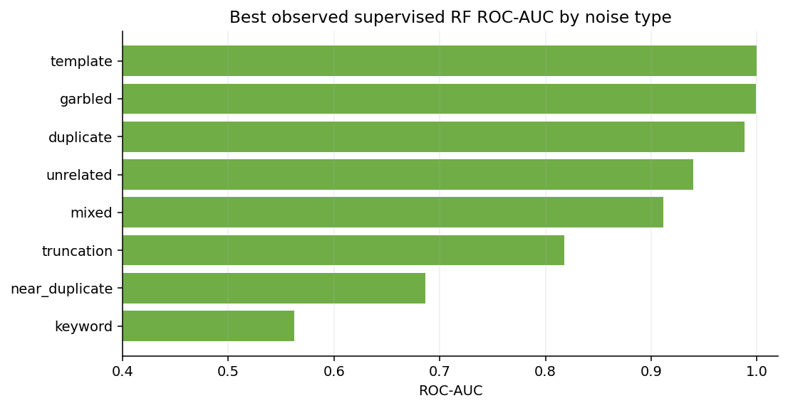
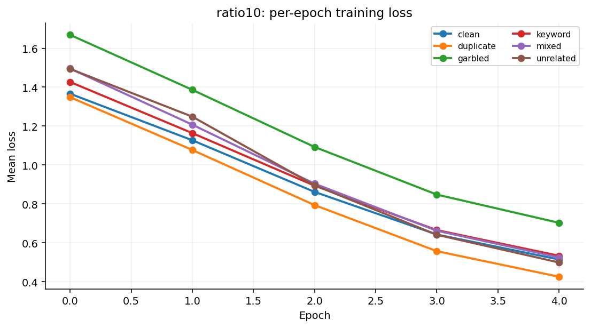
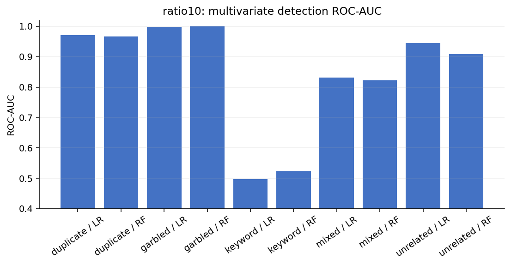
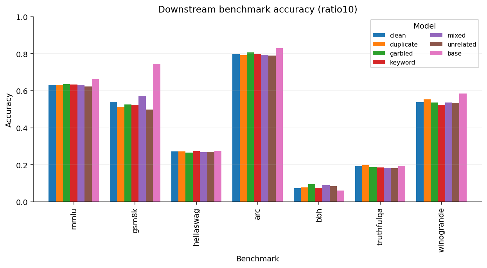

# LLM 微调中的噪音样本：检测方法与影响分析

> 实验: Qwen2.5-3B-Instruct LoRA (r=32, 59.9M 可训练参数) 微调 databricks-dolly-15k
> 覆盖: **7 类噪音** × 2-3 比例 (10%/5%) · 5 epochs · 逐样本梯度追踪 (微批=1 差分法, +5-8% 开销)
> 数据: 3 组实验 (ratio10/ratio05/extra10), 251,334 条逐样本记录, 59 维特征, 7 个下游 benchmark
> 核心发现: 噪音多数可检测, 但清洗收益有限; 检测难度与危害不相关; 无标签检测是"两端可检、中间失效"的 U 型光谱

---

## 0. 核心结论

1. **检测可行性按类型分级** (RF AUC, 有监督): **garbled 0.996-0.999 / template 1.000** (最易) → duplicate 0.967-0.988、unrelated 0.909-0.940、truncation 0.818 (中等) → near_duplicate 0.687-0.733、**keyword 0.52-0.56 (最难, 接近随机)**。
2. **检测难度与危害不相关**: 最易检的 garbled 对下游能力几乎无害 (MMLU -0.001~+0.006); 最难检的 keyword 在 10% 比例下同样无害; 而**危害最大的 template (GSM8K -0.125, 相对 -23%) 恰好也是最易检的类型** —— 危害不是由检测难度决定的。
3. **无标签检测是 U 型光谱**: 通用离群打分器 (IsolationForest 等) 只对表面损坏 (garbled 0.955) 有效; 被记忆的一致模式噪音 (duplicate/template) 收敛到"过度典型"而非"离群", 通用离群器反而失效 (template 0.494, 低于随机); 改用**带符号的记忆性规则**并叠加尺度无关的 token 集中度特征后, template 回升到 **0.9994**, 接近有监督上限; 语义类噪音 (unrelated/keyword/near_duplicate) 在两种无标签范式下均 ≤0.72, 是真正的检测盲区。
4. **检测器可跨比例迁移, 不可跨类型迁移**: 10%↔5% 双向保持率 0.995-1.156 (污染率漂移不是问题); 但跨噪音类型的非对角保持率均值仅 0.688 vs 对角 1.000, duplicate 训练的检测器对 garbled 甚至反向 (0.469) —— **必须按噪音类型分别训练、分别打分**。
5. **训练动态存在方向反转陷阱**: duplicate/template 被快速记忆, loss 反而低于 clean (duplicate loss_mean AUC 仅 0.369, 翻转后 0.631; template loss_mean AUC 0.101, 翻转后 0.899) —— 不能假设"高 loss = 噪音"。
6. **检测力随训练进程衰减**: 以 unrelated 为例, RF AUC 从 epoch 0 的 0.881 单调降到全 5 epoch 的 0.916 后 P@10% 反而更低; garbled 仅用 epoch 0-1 特征已达到全轨迹检测器的 98%+ (0.980 vs 0.987) —— **清洗应在训练早期完成**。
7. **AUC 系统性高估清洗可用精度**: 按真实清洗操作 (丢弃打分最高的 10%) 评估, garbled AUC 0.999→P@10% 0.937 (误伤 6.3%), 但 unrelated AUC 0.909→P@10% 0.629 (误伤 37.1%), duplicate AUC 0.967→P@10% 0.722 (误伤 27.8%) —— AUC 看起来健康不代表清洗时误伤率可接受。
8. **绝对影响普遍偏小**: 10% 比例下 6 个噪音模型的 MMLU 互相接近 (极差 0.011), 且全部低于未微调的 base 模型 —— dolly SFT 自身对通用能力的损伤掩盖了噪音类型间的差异; 唯一例外是 template 对 GSM8K 的系统性破坏。



> 图 1｜总体检测能力。柱状图展示不同噪音类型的检测 AUC。garbled/template 是表面异常或过度典型的极端类型，而 keyword/near_duplicate 更接近自然样本，因而更难检测。

### 图表导航

报告中的图按“训练动态 → 检测边界 → 下游影响”组织。仓库只保留报告实际引用的核心图；所有数值表和逐样本指标位于对应 `results/<tag>/` 目录。

| 图组 | 图表 | 主要问题 |
|---|---|---|
| 训练动态 | [ratio10 损失](../results/charts/loss_trajectory_ratio10.png) / [extra10 损失](../results/charts/loss_trajectory_extra10.png) | 哪些噪音被快速记忆？ |
| 检测边界 | [ratio10 ROC](../results/charts/roc_multivariate_ratio10.png) / [extra10 ROC](../results/charts/roc_multivariate_extra10.png) | 完整特征能否分离样本？ |
| 特征空间 | [ratio10 PCA](../results/charts/pca_metrics_ratio10.png) / [extra10 PCA](../results/charts/pca_metrics_extra10.png) | 噪音是否形成独立簇？ |
| 下游影响 | [评测对比](../results/charts/eval_impact_comparison.png) | 检测难度是否对应能力损失？ |

下面各节优先展示最能支撑结论的图。

---

## 1. 实验设计

### 1.1 研究问题

1. **检测**: 仅凭训练过程中可追踪的逐样本指标, 能否把 7 类噪音样本从正常样本中分离? 哪些特征对哪类噪音有效? 检测器能否跨比例/跨类型迁移? 去掉标签之后还剩多少检测力?
2. **影响**: 不同类型、不同比例的噪音对模型微调过程和最终下游能力的影响有多大? 检测难度与实际危害是否一致?

### 1.2 七类噪音的统一构造

基于 databricks-dolly-15k (15,011 条), 分三组实验构造, 同 seed 与样本顺序:

| 类型 | 构造方式 | 机制 | 比例/来源 |
|---|---|---|---|
| garbled | Unicode 替换/插入/字符交换, 保留空白结构 | 表面损坏 | ratio10 (10%), ratio05 (5%) |
| duplicate | 完全逐字节重复的副本行 | 记忆性噪音 (方向反转) | ratio10, ratio05 |
| unrelated | response 替换为不同类别样本的通顺回答 | 语义错配 | ratio10, ratio05 |
| keyword | 仅替换数字/年份/专有名词, 语法句式保留 | 精致篡改 | ratio10, ratio05 |
| template | 统一替换为固定的错误回复模板 | 一致模式 (方向反转, 最危险) | extra10 (10%) |
| truncation | response 被截断至前半部分 | 信息缺失 | extra10 (10%) |
| near_duplicate | WordNet 同义词替换改写 | 轻微重复, 躲过表面相似度检测 | extra10 (10%) |
| mixed | 上述同组各类型均分混合 | — | 三组均有 |

- ratio10/ratio05 覆盖 duplicate/garbled/unrelated/keyword 四类, 10% 与 5% 平行构造, 样本 ID 集合一致, 仅噪音子集不同 → 跨比例逐样本可比;
- extra10 覆盖 template/truncation/near_duplicate 三类新噪音, 10% 比例;
- 三组实验共 14,611 训练样本/run (extra10 略少, 因子类型数不同), 400 条共享 clean 保留样本 (`heldout.jsonl`) 用于参考梯度方向计算与 held-out 泛化评估。

### 1.3 训练配置

| 配置 | 值 |
|---|---|
| 精确逐样本梯度 | 微批 1 + 梯度累积 16, 反向前后快照差分, 开销 +5-8% |
| 优化器/精度 | AdamW, lr 2e-4, cosine + 3% warmup, bf16 + flash-attention-2 |
| 序列长度 | 1024 (截断保留 assistant 部分) |
| 训练轮次 | 5 epochs, 4570-5025 步/run, ~3.4-3.9h/run, RTX PRO 6000 Blackwell 96GB 单卡 |

### 1.4 特征体系 (59 维)

- **训练动态特征** (13 维, 逐 epoch 快照差分法计算): loss/grad_norm/cos_sim_ref 各自的 mean/last/std/slope/curvature + converge_epoch, 全样本覆盖;
- **数据特征**: text_nn_sim (与训练集其余样本的最大 TF-IDF 相似度), n_tokens;
- **诊断特征** (1/8 子样本, 40 维): token 级熵、hard_token (梯度最大 token) 位置统计、top-20%/top-8%/top-32% loss 集中度、IFD 分子分母;
- 全部特征定义见附录 B。

---

## 2. 训练动态: 噪音如何被模型学习

### 2.1 Loss 轨迹分级 (ratio10, epoch 4 终值)



> 图 2｜训练损失轨迹。template 和 duplicate 早期迅速降到极低损失，说明模型快速记住固定模式；garbled 始终位于高损失区，说明字符损坏带来的梯度信号与正常任务不一致。

| 类型 | loss_mean (全程) | loss_last (终值) | converge_epoch | 相对 clean |
|---|---|---|---|---|
| **template** | 0.098 | 0.025 | 0.02 | 远低 — 瞬间记忆 |
| duplicate | 0.595 | 0.234 | 0.36 | 低 — 快速记忆 |
| clean (none) | 0.894 | 0.495 | 0.62 | 基准 |
| truncation | 1.039 | 0.387 | 0.84 | 略高 |
| keyword | 1.215 | 0.666 | 1.09 | 高 |
| near_duplicate | 1.272 | 0.766 | 1.40 | 高 |
| unrelated | 1.406 | 0.514 | 1.33 | 高 (但终值接近 clean) |
| garbled | 3.322 | 2.379 | 4.05 | 极高 — 学不动 |

**两个方向反转的类型** (template、duplicate) 的 loss 全程低于 clean, 是被"过度记忆"而非"学不动"; **garbled** 则是另一极端, 持续高损耗到 epoch 4 仍未收敛; 其余类型 (keyword/unrelated/near_duplicate/truncation) 居中, 略高于 clean 但不构成两端极值。

### 2.2 Held-out 泛化

training 中的 held-out loss 轨迹 (`tb_heldout_loss.csv`) 显示: 仅 template 的注入显著推高了模型在干净保留集上的 loss (对应下游 GSM8K 大幅下降, 见 §5); 其余噪音类型对 held-out 泛化的影响在训练曲线上不明显区分于 clean。

**关键洞察**: 可记忆的噪音 (duplicate/template) 在 loss 侧是"反向信号" — 越危险的模式反而越快被模型学会、loss 越低。任何假设"高 loss = 噪音"的检测规则都会在这两类上失效甚至反向。

---

## 3. 噪音检测方法论

按照是否使用标签、是否假设方向, 检测方法分三个范式。

### 3.1 有监督检测 (需要该类型的标注样本)



> 图 3｜多变量 ROC。AUC 衡量排序能力，不等于固定清洗预算下的精度，因此报告同时使用 AUC、P@10% 和误伤率。

方法: LR / RF 分类器, 70/30 划分。7 类噪音的最佳结果 (取两模型/两 tag 中较高值):

| 噪音类型 | RF AUC | P@10% | 最强特征 (top-3) | 机制 |
|---|---|---|---|---|
| **template** | **1.000** | 0.819 | hard_loss_mean, loss_mean, loss_curvature | 一致模式, 损失位置极稳定 |
| **garbled** | **0.999** | 0.937 | loss_ep0, loss_curvature, loss_ep1 | 输入输出双侧损坏, epoch 0 即可判 |
| duplicate | 0.967-0.988 | 0.467-0.722 | text_nn_sim, cos_global_last, loss 反转特征 | 只能靠数据侧相似度, 训练侧反转 |
| unrelated | 0.909-0.940 | 0.405-0.629 | loss_slope, loss_curvature, loss_ep0 | 跨 epoch 损失波动 |
| truncation | 0.818 | 0.340 | loss_std, loss_slope, mean_loss_std | 长度/位置信息泄露 |
| near_duplicate | 0.687-0.733 | 0.266 | max_token_loss, hard_loss_max, mean_loss | 弱信号, text_nn_sim 对其失效 (0.49) |
| **keyword** | **0.52-0.56** | — (接近随机) | frac_hard_std, loss_ep0, loss_curvature | 语法句式未变, 几乎不可检 |

**发现**:
1. **检测难度与危害不相关** — 最易检的 garbled/template 中, 一个几乎无害、一个最危险; 最难检的 keyword 在 10% 比例下也无害。
2. **每类噪音依赖不同特征**: garbled 靠 token 级熵与早期 epoch loss; duplicate 几乎完全靠数据侧的 `text_nn_sim` (0.939), 训练侧特征反而反转; template 靠"硬 token 位置恒定" (hard_loss_mean); truncation 靠长度相关的 loss 波动。
3. **AUC 高估可用性**, 见 §3.5 (P@10% vs AUC 对比)。

### 3.2 无标签检测: 通用离群模型

方法: IsolationForest / Mahalanobis / 双向 z-score, 无需标签, 假设噪音是"离群点"。

| 噪音类型 | 有监督 RF | 最佳无标签 (IsolationForest 为主) | P@10% (无标签) |
|---|---|---|---|
| garbled | 0.999 | **0.955** | 0.640 |
| unrelated | 0.909 | 0.722 | 0.243 |
| duplicate | 0.967 | 0.556-0.699 | 0.053-0.083 |
| keyword | 0.522 | 0.572 | 0.170 |
| **template** | 1.000 | **0.494** ← 低于随机 | ~0.06 |
| truncation | 0.818 | 0.582 | — |
| near_duplicate | 0.687 | 0.620 | — |

**机制**: 被记忆的噪音 (duplicate/template) 不是"离群"而是"过度典型" — 其 loss/entropy 远低于 clean, 位于分布中心, 任何单总体离群模型都找不到它们。garbled 是唯一在无标签范式下依然强势的类型, 因为它确实是"远离分布中心"的表面异常。

### 3.3 带符号的记忆性规则 (部分补救)

假设: 若已知要找"被过度记忆"的样本, 改用正向规则 — 低 loss + 快收敛 + 低梯度, 方向由假设先验固定 (不拟合)。

| 噪音类型 | 通用离群 (iforest) | memo_signed | **memo + top20_conc** |
|---|---|---|---|
| **template** | 0.494 (低于随机) | 0.887 | **0.9994** |
| duplicate | 0.556-0.699 | 0.625 | 0.475-0.633 |
| garbled | 0.955 | **0.015** ← 完全反向 | 0.110 |
| unrelated | 0.722 | 0.225 | 0.513 |
| keyword | 0.572 | 0.346 | 0.435 |
| truncation | 0.582 | 0.370 | 0.514 |
| near_duplicate | 0.620 | 0.361 | 0.481 |

**关键发现**:
- 符号本身就是"要找哪类噪音"这一先验的载体 — 同一条 `memo_signed` 规则在 template 上 0.887, 在 garbled 上仅 0.015 (完全反向), 因为 garbled 恰恰是"低典型度"而非"高典型度"。
- 加上尺度无关的 `top20_share` (token loss 集中度) 后, template 达到 **0.9994 / P@10% 0.836**, 逼近 0.988-1.000 的有监督上限, 且是唯一未反转的 template 特征 (方向 AUC 0.9994 vs 反转 0.0032)。
- 但语义类噪音 (unrelated/keyword/near_duplicate) 在两种无标签规则下均 ≤0.72, 是真正的检测盲区。

**无标签检测的 U 型光谱**:

```
可检测 ◄──────────────────────────────────────────────► 难检测
一致模式(template)     表面损坏(garbled)      语义/精致类噪音
0.9994 (signed+conc)   0.955 (iforest)        ≤0.72 (两端范式均失效)
```

### 3.4 检测器迁移性

**跨比例** (10%↔5%, `transfer_cross_ratio.csv`): 双向保持率 0.995-1.156 — 污染率漂移不是问题, keyword 甚至因训练样本翻倍而提升 (0.995→1.156)。

**跨类型** (`transfer_cross_type.csv`, ratio10/ratio05 共 4×4×2 矩阵): 对角 (同类型训练测试) 均为 1.000, 非对角均值仅 0.688。极端案例:
- duplicate 训练的检测器测 garbled: 保持率 0.493 (ratio10);
- garbled 训练的检测器测 duplicate: 保持率 0.463 — **互为反向预测**;
- keyword 是最好的迁移来源 (对 garbled/unrelated 保持率 0.94-0.98), 但作为迁移目标最差 (被 duplicate 训练的检测器测时保持率仅 0.709-0.713)。

**结论**: 必须按噪音类型分别标注、分别训练检测器, 再对齐输出结果取并集; 单一二分类器在多类型混合场景中会大范围失效。

### 3.5 检测力随训练进程衰减

以 `detector_epoch_budget.csv` (ratio10) 为例, 逐 epoch 累积特征训练检测器:

| 噪音类型 | epoch 0-1 RF AUC | 全 5 epoch RF AUC | epoch0 达成比例 |
|---|---|---|---|
| garbled | 0.980 | 0.987 | 99.3% |
| unrelated | 0.881 | 0.916 | 96.2% |
| duplicate | 0.922 | 0.957 | 96.3% |
| keyword | 0.605 | 0.649 | 93.2% |
| mixed | 0.879 | 0.908 | 96.8% |

只用 epoch 0-1 的特征已能达到全轨迹检测器 93-99% 的性能 — **数据清洗应在训练早期 (epoch 0-1) 内完成**, 越晚清洗代价越高、收益越低。

### 3.6 混合污染不稀释单类型信号

`mixed_subtype_dilution.csv` 显示, 每个子类型在 4-way (ratio10/ratio05) 或 7-way (extra10) mixed run 中的可检性均 ≥ 其单类型 run 的可检性 (例如 duplicate: mixed 内 AUC 0.998 vs 单类型 run 0.981; keyword: 0.773 vs 0.688) — 真实数据中的多类混合污染不会削弱检测器, mixed 整体 AUC 偏低纯粹是标签聚合造成的表面现象。

---

## 4. Token 级检测与特征增量

- **token 级熵/hard_token 分析**: garbled 的 hard_loss_mean AUC 达 0.958, 是继 loss_ep0 之后的第二强特征; unrelated 0.778; keyword 仅 0.677 — 均不如样本级聚合特征, token 级分析的价值在于可解释性而非独立判别力。
- **template 的指纹**: `hard_pos_std_mean`/`n_hard` 等硬 token 位置统计 AUC 达 0.886 (方向反转前 0.114) — 硬 token 位置高度恒定, 印证"一致模式"机制。
- **IFD (Instruction Following Difficulty) 的价值是增量而非独立判别力**: IFD 比值本身单变量 AUC 仅 0.55-0.80 (garbled 0.800、template 0.761 反向、duplicate 0.618 反向、keyword 0.580、unrelated 0.553), 均低于同类型的 loss/熵特征; 但把分子分母 `L(A|Q)`/`L(A)` 作为两个独立特征 (而非比值) 加入 13 维轨迹特征后, template 提升至 0.9884 (+0.017, `detector_ablation.csv`), truncation/near_duplicate 亦有小幅提升 — 比值把两个有用的自由度压缩成一个, 丢掉了信息。
- **40 维诊断特征相对 13 维轨迹特征的增量** (`detector_ablation.csv`, diag_subsample): template 0.967→0.999 (+0.032), truncation 0.776→0.858 (+0.082), near_duplicate 0.682→0.763 (+0.081) — 诊断特征对中等难度类型的增量最大。

---

## 5. 噪音对模型能力的影响



> 图 5｜下游 benchmark 影响。template 在 GSM8K 上形成明显断崖，而 MMLU/ARC 变化较小，说明固定错误模板的危害具有任务选择性。

### 5.1 总体评估 (ratio10, 7 benchmarks 节选)

| 模型 | MMLU | GSM8K | ARC | 相对 clean (MMLU) |
|---|---|---|---|---|
| base (未微调) | 0.6637 | 0.7460 | 0.8311 | +0.034 |
| clean | 0.6295 | 0.5413 | 0.7995 | 基准 |
| garbled | 0.6354 | 0.5269 | 0.8080 | +0.006 |
| keyword | 0.6333 | 0.5231 | 0.7986 | +0.004 |
| mixed | 0.6315 | 0.5732 | 0.7952 | +0.002 |
| duplicate | 0.6309 | 0.5125 | 0.7918 | +0.001 |
| unrelated | 0.6241 | 0.4981 | 0.7901 | -0.005 |
| **template** (extra10) | 0.6314 | **0.4162** | 0.7901 | -0.002 (MMLU) / **-0.125 GSM8K (相对 -23%)** |

**关键发现**:
1. **绝对影响普遍小**: ratio10 六个噪音模型的 MMLU 互相接近 (极差仅 0.011, 0.624-0.635), 且**全部低于未微调的 base** (0.664) — dolly SFT 本身对通用知识能力的损伤远大于噪音类型间的差异。
2. **template 是唯一的例外**: GSM8K 从 clean 的 0.541 降到 0.416 (相对 -23%), 而 MMLU/ARC 几乎不受影响 — 系统性错误 (固定错误模板) 被模型学成了"捷径", 而随机性错误 (garbled/duplicate/keyword) 大部分被 SFT 过程"吸收"或平均掉。
3. **unrelated 在低比例下伤害可能更大** (非单调): ratio05 (5%) 时 MMLU 0.6106 vs ratio10 (10%) 时 0.6241 — 5% 反而更差, 说明少量语义错配样本足以造成置信度混乱 (见下)。

### 5.2 置信度分析 (MMLU margin, 答对题目的正确项与最强错误项 logprob 差)

| 模型 | 答对题目平均 margin |
|---|---|
| ratio10 clean | 4.770 |
| ratio10 unrelated (10%) | 5.940 |
| ratio05 unrelated (5%) | 2.855 |

5% 比例的 unrelated 反而导致答对题目的置信度大幅下降 (4.77→2.86), 而 10% 比例的置信度不降反升 —— 提示低比例语义错配噪音的影响并非线性稀释, 可能与训练动态的非单调收敛有关, 具体机制留作后续工作。

---

## 6. 方法学讨论

### 6.1 清洗精度与 AUC 的差距

按真实清洗操作 (丢弃打分最高的 10% 样本) 计算 precision (`detector_precision_at_k.csv`):

| 噪音类型 | RF AUC | P@10% | 误伤率 (1-P@10%) | Random baseline |
|---|---|---|---|---|
| garbled | 0.999 | 0.937 | 6.3% | 0.100 |
| duplicate | 0.967 | 0.722 | 27.8% | 0.091 |
| unrelated | 0.909 | 0.629 | 37.1% | 0.100 |
| keyword | 0.522-0.562 | ~0.25-0.28 | ~72-75% | 0.100 |

**结论**: AUC 系统性高估清洗可用性 — 只有 garbled 达到接近零误伤的实用精度, 其余类型即使 AUC 看起来"健康" (0.9+), 实际清洗时仍会大量丢弃干净样本, 需要结合具体阈值/预算重新评估, 不能只看 AUC 决策。

### 6.2 自然数据上的信号一致性验证

在 lmsys-chat-1m 真实对话数据上 (15,404 条有效样本, 用 ratio10_clean 模型后验打分, `results/natural_validation.csv`) 验证核心信号之间的内部方向:

| 信号对 | Spearman r | p |
|---|---|---|
| token_top20 vs loss_mu | **-0.839** | <1e-300 |
| loss_cv vs loss_mu | **-0.861** | <1e-300 |
| token_top20 vs loss_cv | **+0.982** | <1e-300 |

**解读**: token 集中度与平均损失强负相关 — 模型越擅长的样本, 其损失越集中在少数难 token 上; 而集中度与损失变异系数几乎完全同向 (0.982), 说明二者在自然数据上测量的是同一个底层量。这与 §3.3 中 `top20_share` 作为"尺度无关集中度特征"的机制解释一致: 它捕捉的是损失分布形状而非绝对水平, 因此在被记忆样本的绝对损失塌陷后仍然有效。

**局限**: 这是信号间的**内部一致性**验证 (自然数据无噪音标签), 不能直接推断真实噪音的检测 AUC。

### 6.3 方向反转的陷阱

| 类型 | 原始 AUC (loss_mean) | 反转后 AUC |
|---|---|---|
| duplicate | 0.369 | 0.631 |
| template | 0.101 | 0.899 |

机制: 可被记忆的噪音收敛到极低 loss, 位于"过度典型"区域而非"学不动"的高 loss 区域。**任何检测器都必须经验性验证特征方向, 不能假设"高 loss = 噪音"** —— 这也是为什么 §3.3 的 `memo_signed` 规则需要按噪音类型固定方向, 而不能直接对特征取绝对值或统一符号。

---

### 6.4 清洗收益对照：检测清洗 vs 随机删除

为检验“检测出来的样本是否值得删除”，我们在 `ratio10` 的 garbled 数据上做了严格对照：原始含噪训练集有 14,611 条样本；检测清洗模型删除检测分数最高的 10%（保留 13,150 条），随机对照模型随机删除同样数量。两者使用相同的 Qwen2.5-3B + LoRA 配置、训练轮数和 held-out 集，仅删除策略不同。评测结果写入 `results/cleaning_gain_comparison.csv`。

| 模型 | MMLU | GSM8K | HellaSwag | ARC | BBH | TruthfulQA | Winogrande | 7 项均值 |
|---|---:|---:|---:|---:|---:|---:|---:|---:|
| 原始 garbled | 0.6354 | 0.5269 | 0.2664 | 0.8080 | 0.0944 | 0.1873 | 0.5359 | 0.4363 |
| 检测清洗 | 0.6259 | 0.5178 | **0.2788** | **0.8123** | 0.0870 | 0.2044 | 0.5162 | 0.4346 |
| 随机删除 | **0.6417** | 0.4958 | 0.2709 | 0.8072 | **0.0889** | **0.2081** | **0.5367** | **0.4356** |
| clean 参考 | 0.6295 | **0.5413** | 0.2715 | 0.7995 | 0.0741 | 0.1922 | 0.5383 | 0.4352 |

检测清洗相对随机删除的差值为：MMLU `-0.0158`、GSM8K `+0.0220`、HellaSwag `+0.0080`、ARC `+0.0051`、BBH `-0.0019`、TruthfulQA `-0.0037`、Winogrande `-0.0205`；七项简单平均为 `-0.0010`（去掉 BBH 后为 `-0.0008`）。也就是说，检测清洗在 7 项中只赢 3 项，尚未显示出相对随机删除的稳定总体收益。

**解读**：在本次单一噪音类型、单一随机种子的对照中，检测器能提升部分任务（尤其 GSM8K），但收益被其他任务的回落抵消。清洗策略的直接价值不能仅由检测 AUC 推断；最终收益还受删掉的样本覆盖、训练随机性和任务分布影响。当前证据支持“检测清洗值得作为质量治理工具继续评估”，但不支持宣称它能普遍提升下游能力。

## 7. 结论

### 7.1 核心发现

1. 样本级噪音检测在多数类型上技术可行 — 7 类中 5 类有监督 AUC ≥0.82 (garbled/template/duplicate/unrelated/truncation), keyword 与 near_duplicate 明显更难。
2. 检测的真正价值在数据治理场景 (质量监控、审计、异常发现), 而非"清洗后模型显著变强" — 10% 比例的多数噪音类型对下游能力的绝对影响 <1 个百分点, 且清洗精度不足会造成可观的误伤。
3. **最高优先级治理目标是一致模式类噪音** (template/shortcut 型): 兼具"最易检测" (0.9994 无标签可达) 与"最具灾难性危害" (GSM8K -23%) 两个特征, 是唯一值得优先构建无标签监控规则的类型。
4. **检测清洗尚未显示稳定总体收益**: 在 garbled、10% 比例、单一随机种子的对照中, 检测清洗仅赢随机删除 3/7 项, 七项均值低 0.0010; 当前证据支持质量治理价值, 不支持普遍提升下游能力的宣称。
5. 方法学边界清晰: 有监督检测覆盖全部 7 类但需要标注; 无标签检测只覆盖两端 (表面损坏 + 一致模式), 中间的语义类噪音 (unrelated/keyword/near_duplicate) 在当前特征体系下缺乏无标签解法, 仍需人工标注或半监督方法。

### 7.2 局限

1. 单一模型 (Qwen2.5-3B) + 单一数据集 (dolly-15k) + 单一 LoRA 配置, 未验证跨模型/跨数据集泛化性。
2. 噪音为人工构造, 真实世界的噪音模式可能更微妙、更混合。
3. 清洗收益对照目前只覆盖 garbled、单一比例和单一随机种子; 尚不足以判断跨噪音类型、跨种子的一般规律。

### 7.3 后续工作

1. 扩展清洗收益对照: 覆盖更多噪音类型、随机种子和清洗预算, 并报告置信区间。
2. 自然数据信号验证: 已在 lmsys-chat-1m 上完成信号内部一致性验证 (§6.2); 待扩展的是**带真实噪音标签**的自然数据集上的检测 AUC 验证。
3. 多模型/多数据集泛化性验证。

---

## 附录 A: 复现实验

训练命令、数据路径、随机种子等实现细节见 `README.md` 与 `train.py` 顶部注释。核心脚本:
- `train.py` — 逐样本梯度追踪训练
- `evaluate.py` — 7-benchmark 评估
- `analyze.py` — 训练、token、无监督和迁移分析
- `cli.py` — 统一分析命令入口

## 附录 B: 特征定义

59 维特征的完整数学定义 (loss/grad_norm/cos_sim_ref 的计算公式、token 级熵与 hard_token 定义、IFD 公式等) 见 `data.py`、`analyze.py` 和 `train.py` 中的实现与说明。
