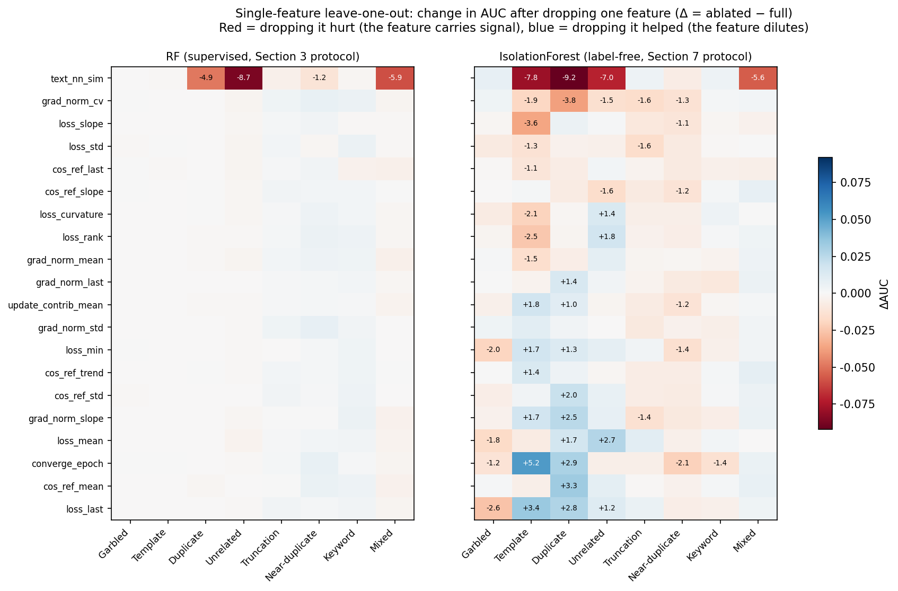
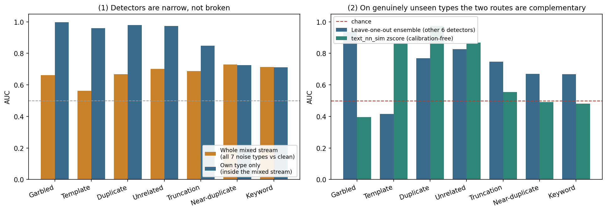
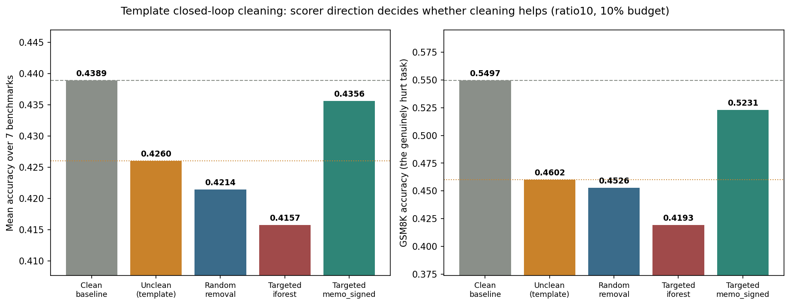

## 6. Experimental Process and Results

This chapter is the body of the report, in the order "measure capability, then measure boundaries, then measure real benefit" — 12 experiment groups. Each is self-contained, with its own setup, raw data, analysis, and result.

Three framing reminders run through the whole chapter (details in Section 3.5):

- **Supervised vs. label-free**: Sections 6.2 and 6.3 use a random forest with true labels and measure the **signal ceiling**; every other section's `iforest` / `memo_signed` / `pooled` uses no labels and measures **what production can reach**. The gap between the two can be enormous for the same noise type (template: 0.999 vs. 0.522), and that gap is itself the subject of Section 6.6.
- **Full coverage vs. diagnostic subsample**: most AUCs are computed on the ~900-1200-row diagnostic subsample (37 features), while closed-loop cleaning operates on all 14,611+ rows (20 features). The former is optimistic, especially for near_duplicate.
- **Ranking quality vs. downstream benefit**: Sections 6.2-6.12 all measure whether noise can be ranked to the top; only Section 6.13 actually removes samples and retrains. The two can decouple, which is the central finding of this chapter's last section.

Section by section:

| Section | Question | Nature |
|---|---|---|
| 6.2 | How hard is each of the seven types to detect? | In-domain capability, supervised ceiling |
| 6.3 | Do detectors transfer across noise types? | Generalization boundary |
| 6.4 | Do detectors transfer across noise ratios? | Generalization boundary |
| 6.5 | Does high AUC mean cleaning is usable? | Metric framing |
| 6.6 | Why does memorized noise defeat outlier detection? | Mechanism (the report's most important methodological finding) |
| 6.7 | How many epochs are needed before the signal appears? | Cost |
| 6.8 | Which features is the detector actually using? | Attribution |
| 6.9 | Does noise really hurt downstream tasks? | Harm quantification |
| 6.10 | What is currently the best method per type? | Synthesis |
| 6.11 | Which data is necessary, and which metric is irreplaceable? | Ablation |
| 6.12 | What happens on mixed streams and genuinely unseen types? | Boundary (dismantles the "type is known" premise) |
| 6.13 | Does cleaning on this basis actually improve downstream? | Real benefit (the only experiment that touches training data) |

### 6.1 Setup and Output Files

Section 6.3 already covers the pipeline and its commands; this subsection collects only the three things worth having at hand while reading results.

**Data scale.** 14,611 training samples per dataset (`duplicate` has 16,072, since it appends copies), plus a 400-sample held-out set (200 for the reference gradient, 200 for monitoring held-out loss, shared across all 9 datasets). Noise ratios are `ratio10` = 10% and `ratio5` = 5%, with all 9 datasets complete at both ratios.

**Which file each section draws on.**

| Output file | Produced by | Cited in |
|---|---|---|
| `results/{tag}/per_sample_metrics.csv` | `analyze --kind features` | Input to every later analysis |
| `results/{tag}/cross_type.csv` | `analyze --kind cross_type` | 6.2 (diagonal), 6.3 (off-diagonal) |
| `results/{tag}/unsupervised.csv` | `analyze --kind unsupervised` | 6.5, 6.6 |
| `results/{tag}/precision_lift.csv` | `analyze --kind precision_lift` | 6.5 |
| `results/{tag}/memorization.csv` | `analyze --kind memorization` | 6.6 |
| `results/{tag}/early_*.csv` | `analyze --kind early_*` | 6.7 |
| `results/{tag}/feature_attribution.csv` | `analyze --kind feature_attribution` | 6.8 |
| `results/eval/eval_{tag}_{dataset}.json` | `evaluate` | 6.9, 6.13 |
| `results/{tag}/feature_ablation.csv` | `scripts/feature_ablation.py` | 6.11.1-6.11.2 |
| `results/{tag}/single_feature_ablation.csv` | `scripts/single_feature_ablation.py` | 6.11.3 |
| `results/{tag}/transfer_to_mixed.csv` | `scripts/transfer_to_mixed.py` | 6.12 |
| `results/{tag}/pooled_scorer_compare.csv` | `scripts/pooled_scorer_compare.py` | 6.12.5 |
| `data/{tag}/cleaning_loop/{name}/metadata.json` | `clean` | 6.13 |

**Downstream evaluation protocol.** Seven benchmarks: MMLU (n=14042), GSM8K (1319), HellaSwag (10042), ARC (1172), BBH (540), TruthfulQA (817), WinoGrande (1267). The "7-benchmark mean" throughout the report is the **unweighted arithmetic mean** of those seven accuracies, not weighted by sample count — so BBH at n=540 carries the same weight as MMLU at n=14042, which amplifies single-benchmark fluctuation. Sections 6.9 and 6.13 therefore both give the per-benchmark breakdown rather than the mean alone.

Apart from Section 6.13, every analysis in this chapter is recomputed from existing trajectories with no retraining; Section 6.13 is the only experiment that actually alters training data and retrains.

### 6.2 Detection Difficulty Landscape: Which Noise Types Are "Visible"

#### 6.2.1 What "Within-Domain Detection AUC" Actually Means: Method and Sample Construction

"Within-domain detection AUC" answers a very specific binary-classification question: **for one particular noise type T, can training-dynamics features alone separate "samples injected with T-type noise" from "genuinely clean samples"?** It does not measure "can all 7 noise types be identified at once" — it is 7 independent binary-classification tasks, each reporting its own AUC.

The exact construction (matching `cv_auc()` inside `analyze.py::cross_type_transfer`, which produces the diagonal of `cross_type.csv`):

- **Positive samples**: rows in dataset T (e.g. `garbled`) with `noise_type == 'garbled'`; **negative samples**: rows in the *same* dataset T with `noise_type == 'none'` (the uncontaminated portion of that same training run). Both come from the same training run / same `tag` — never mixed across datasets.
- **Features**: all 37 numeric columns in `per_sample_metrics.csv` (the training-trajectory / token-diagnostic / text-similarity features defined in Appendix 8.1-8.3), with `dropna(subset=features)` — a row is only included if **all 37 features are non-null**.
- **Classifier and validation**: after `StandardScaler` normalization, `StratifiedKFold(n_splits=5, shuffle=True, random_state=0)` 5-fold stratified cross-validation, training one `RandomForestClassifier(n_estimators=200)` per fold; the final AUC pools each sample's out-of-fold predicted probability (from whichever fold it fell into as test data) across all 5 folds and computes a single AUC over the whole set — not an average of 5 separate AUCs.
- **This is the supervised view; it measures the signal ceiling.** The RF sees the true noise labels during training, so the AUC here answers "how much separable signal is in the training dynamics at all" — **not** "how much is reachable label-free". That second question belongs to the `iforest`/`zscore` family in Section 6.6 (`analyze.py::unsupervised_metrics` → `unsupervised.csv`), which uses no labels. The gap can be enormous: template is 0.999 here and only 0.522 under `iforest` in Section 6.6 — same samples, same features, the only difference being whether labels pointed the direction. That is exactly where Section 6.6's direction-reversal trap comes from, so keep track of which view a number belongs to.

**An easily-overlooked but important detail — the effective sample size is far smaller than the dataset's total size**: 13 of the 37 features are the token-level diagnostic features from Section 8.2 (`max_token_loss`, `frac_hard`, `hard_loss_mean`, etc.), which are only produced during the forward-only diagnostic pass at `diag_subsample=8` (every 8th sample), giving roughly 12.5% coverage. Requiring all 37 features to be non-null effectively keeps only the small subset of samples that happened to land in the diagnostic subsample *and* showed at least one "hard token" in at least one epoch. In practice, the number of samples that actually enter the computation for this section, Section 6.3, Section 6.8, and the `iforest`/`zscore` columns of Section 6.6's table is:

| Dataset | Total n | Of which noise (n_noise) |
|---|---|---|
| duplicate | 995 | 89 |
| garbled | 904 | 85 |
| keyword | 906 | 87 |
| near_duplicate | 906 | 87 |
| template | 906 | 87 |
| truncation | 905 | 86 |
| unrelated | 904 | 85 |

Each dataset effectively uses only about 900-1000 samples (vs. roughly 14,611-16,072 in the full dataset, i.e. about 6-7% coverage), and the positive/negative ratio is reshuffled by the subsampling process (the noise fraction stays close to 9-10% throughout, suggesting the subsampling itself is not systematically biased toward or against noise samples — but the absolute sample size is genuinely much smaller). Section 6.6's `memo_signed` column, by contrast, uses only 6 features with 100% coverage (no token-diagnostic features) and is computed on the *full* sample — **the two columns in that same comparison table do not share the same sample size**, which matters when reading that table.

### 6.3 Cross-Type Transfer: Can a Detector Generalize Across Noise Types?

The figure above is the 7×7 transfer matrix under `ratio10`: each row is the noise type the detector was trained on, each column is the noise type it was tested on, and the diagonal reproduces the within-domain AUC from Section 2.

**Method**: for each off-diagonal cell `(source type → target type)`, the code (`analyze.py::fit_transfer`) trains both a `LogisticRegression(max_iter=2000)` and a `RandomForestClassifier(n_estimators=200)` on the **source** type's dataset (the `StandardScaler` is fit only on the source data and merely applied via `transform` on the target — never refit — so what's being measured is the detector's actual transfer ability, not the convenience of re-normalizing on the target), evaluates both on the target type's dataset, and keeps whichever gives the higher AUC as that cell's value. The matrix's **diagonal is not a fresh "train and test on the same data" run — it directly reuses the within-domain AUC from Section 6.2's 5-fold cross-validation**, so the diagonal and off-diagonal cells are on the same footing (otherwise the diagonal would be inflated by training and testing on the same data).

A few representative off-diagonal cells (from `results/ratio10/cross_type.csv`): `template→garbled` is only 0.403 (well below the 0.5 random baseline — a directional reversal); `unrelated→template` is only 0.321 (also reversed, and even more extreme than `template→garbled`); yet `template→duplicate` reaches 0.896 — showing a detector trained on template is not uniformly bad on every target: it transfers positively to the structurally similar duplicate type, while completely failing (or reversing) on the structurally very different garbled type.

**Key findings**:

- **Diagonal mean AUC 0.846 vs. off-diagonal mean 0.675** — cross-type transfer loses about 17-20 points on average, meaning a substantial part of the discriminative signal in training-dynamics features is **type-specific**; there is no single "universal detector" that can be applied unchanged to an unseen noise type.
- **Template is the most isolated type**: a detector trained on template transfers to the other 6 types with AUC typically 0.40-0.59 (some even below the random baseline — e.g. transferring to garbled only reaches 0.40). Conversely, detectors trained on other types generally perform poorly when tested on template (e.g. unrelated→template is only 0.32, clearly below the 0.5 random baseline — a **directional reversal**, meaning the detector's judgment on template samples is systematically inverted). This is the same mechanism as the "direction-reversal trap" discussed in Section 6.6, showing up in the cross-type setting.
- **Garbled transfers the most easily**: detectors trained on most other types still reach 0.93-0.98 AUC when tested on garbled, showing that garbled's training-dynamics anomaly (e.g. persistently elevated loss) is generic enough not to depend on a type-specific feature pattern.
- **Keyword is weak in both directions**: not only is its within-domain CV only 0.577, but AUC transferring both into and out of keyword is generally low as well — consistent with the conclusion that keyword substitution is the hardest type to detect.

**Practical implication**: a production label-free detector cannot be trained on one known noise type and be expected to generalize to unknown types; it either needs separate calibration per plausible noise pattern, or should lean on the feature-attribution results in Section 6.8 to design more generic rules.

---

### 6.4 Cross-Ratio Transfer: Almost Lossless

In contrast to the cross-type transfer in Section 6.3, this section fixes the noise type and tests whether a detector trained at a 10% noise ratio transfers to 5% (and vice versa).

**Method**: uses the same `fit_transfer` function as Section 6.3's cross-type transfer (`analyze.py::cross_ratio_transfer`); the only difference is how "source/target" are paired — here source and target are the **same noise type at two different noise ratios** (e.g. `ratio10→ratio5` means fitting on `ratio10/garbled` and evaluating on the corresponding `ratio5/garbled`), rather than being paired by noise type as in Section 3. Both directions (`ratio10→ratio5`, `ratio5→ratio10`) are trained independently, and the diagonal (not shown in this table, i.e. "within-tag within-domain AUC") likewise reuses Section 6.2's already-computed within-domain CV result rather than being recomputed.

| Noise type | ratio10→ratio5 AUC | ratio5→ratio10 AUC |
|---|---|---|
| Template | 1.000 | 1.000 |
| Garbled | 0.996 | 0.997 |
| Duplicate | 0.990 | 0.986 |
| Unrelated | 0.985 | 0.948 |
| Truncation | 0.966 | 0.880 |
| Near-duplicate | 0.895 | 0.790 |
| Keyword | 0.898 | 0.751 |

**Key finding: cross-ratio transfer AUC is ≥0.75 across the board, mostly ≥0.88, and retention (transferred AUC / within-domain AUC) is mostly ≥1.0 — transfer loses almost nothing, and in some cases actually improves.** For example, keyword ratio10→ratio5 reaches 0.898, well above ratio5's own within-domain CV of 0.634; near-duplicate ratio10→ratio5 reaches 0.895, well above its own within-domain CV of 0.759. This suggests that pooling training-dynamics data across the two noise ratios actually produces a more robust decision boundary, rather than overfitting to one specific noise density.

**Conclusion when compared with Section 6.3**: the discriminative signal that training-dynamics features carry for "noise type" is stable across noise ratios (and can even transfer positively) — a detector does not need to be retrained for every noise ratio. **The real transfer bottleneck is cross-noise-type, not cross-noise-ratio.** This is practically significant: if the production noise ratio fluctuates over time, the detector does not need to be retrained because of that alone.

---

### 6.5 Cleaning-Precision Lift: High AUC Doesn't Mean Useful Under a Cleaning Budget

AUC measures overall ranking ability, but in practice cleaning can only remove a small slice of samples (e.g. the top 10%). In that regime, the metric that actually matters is **P@10% lift** — the hit rate of true noise samples in the removed top 10%, relative to random removal.

**Exact computation** (`analyze.py::precision_at_k`/`precision_lift_table`): for a dataset of size n, `k = round(0.10 * n)`; sort all samples by anomaly score descending and take the top k; `p_at_10` = the fraction of those k samples that are true noise; `random_p` = the overall true-noise fraction of that dataset (the expected hit rate of "blindly removing at random"); `lift = p_at_10 / random_p`. Three candidate label-free scorers:

- `zscore_max` / `zscore_mean`: a robust z-score per feature, `(x - median) / (1.4826 * MAD)` (MAD = median absolute deviation), then either the **max** or the **mean** of the absolute values across features as the sample's anomaly score.
- `iforest`: after `StandardScaler` normalization, an `IsolationForest(n_estimators=300)` is fit **independently per dataset** (never pooled across datasets), using the negative `score_samples` (higher = more anomalous) as the score.

The table below is the complete raw result for every dataset × all 3 methods under `ratio10` (the main summary table in this section only shows, per dataset, the single row with the highest lift — which can hide the fact that switching methods on the same dataset can flip the conclusion entirely):

| Dataset | Method | n | n_noise | AUC | P@10% | random_p | lift |
|---|---|---|---|---|---|---|---|
| garbled | iforest | 904 | 85 | 0.936 | 0.556 | 0.094 | **5.91** |
| garbled | zscore_mean | 904 | 85 | 0.873 | 0.311 | 0.094 | 3.31 |
| garbled | zscore_max | 904 | 85 | 0.664 | 0.089 | 0.094 | 0.95 |
| mixed | iforest | 919 | 92 | 0.662 | 0.228 | 0.100 | **2.28** |
| mixed | zscore_mean | 919 | 92 | 0.633 | 0.174 | 0.100 | 1.74 |
| mixed | zscore_max | 919 | 92 | 0.604 | 0.054 | 0.100 | 0.54 |
| unrelated | iforest | 904 | 85 | 0.703 | 0.189 | 0.094 | **2.01** |
| unrelated | zscore_mean | 904 | 85 | 0.596 | 0.167 | 0.094 | 1.77 |
| unrelated | zscore_max | 904 | 85 | 0.604 | 0.111 | 0.094 | 1.18 |
| truncation | zscore_max | 905 | 86 | 0.657 | 0.178 | 0.095 | **1.87** |
| truncation | zscore_mean | 905 | 86 | 0.610 | 0.144 | 0.095 | 1.52 |
| truncation | iforest | 905 | 86 | 0.598 | 0.156 | 0.095 | 1.64 |
| template | zscore_mean | 906 | 87 | 0.803 | 0.165 | 0.096 | **1.72** |
| template | iforest | 906 | 87 | 0.522 | 0.066 | 0.096 | 0.69 |
| template | zscore_max | 906 | 87 | 0.878 | 0.022 | 0.096 | 0.23 |
| near_duplicate | iforest | 906 | 87 | 0.599 | 0.132 | 0.096 | **1.37** |
| near_duplicate | zscore_max | 906 | 87 | 0.507 | 0.121 | 0.096 | 1.26 |
| near_duplicate | zscore_mean | 906 | 87 | 0.549 | 0.110 | 0.096 | 1.14 |
| keyword | zscore_max | 906 | 87 | 0.520 | 0.110 | 0.096 | **1.14** |
| keyword | zscore_mean | 906 | 87 | 0.525 | 0.110 | 0.096 | 1.14 |
| keyword | iforest | 906 | 87 | 0.552 | 0.099 | 0.096 | 1.03 |
| duplicate | zscore_mean | 995 | 89 | 0.542 | 0.050 | 0.089 | **0.56** |
| duplicate | iforest | 995 | 89 | 0.612 | 0.050 | 0.089 | 0.56 |
| duplicate | zscore_max | 995 | 89 | 0.604 | 0.040 | 0.089 | 0.45 |

(Bold = the "best method" shown in this section's main summary table; `n`/`n_noise` match Section 6.2, since unsupervised scoring is likewise computed only on the diagnostic-subsample rows where all 37 features are non-null.) This full table reveals two details the summary table hides: **the spread across methods for garbled is huge** (iforest 5.91x vs. zscore_max 0.95x — the same dataset flips from "highly useful" to "worse than random" depending on the scoring method); **template's zscore_max method (0.23x) is one of the worst combinations in the entire table**, even though the same dataset reaches 1.72x under zscore_mean — showing that "choosing the right method" matters as much as "choosing the right dataset."

| Noise type | ratio10 best-method lift | ratio5 best-method lift |
|---|---|---|
| Garbled | 5.91 (iforest) | 7.40 (iforest) |
| Mixed | 2.28 (iforest) | 2.96 (iforest) |
| Unrelated | 2.01 (iforest) | 2.49 (iforest) |
| Truncation | 1.87 (zscore_max) | 2.32 (zscore_max) |
| Template | 1.72 (zscore_mean) | 1.74 (zscore_mean) |
| Near-duplicate | 1.37 (iforest) | 1.99 (zscore_mean) |
| Keyword | 1.14 (zscore_max) | 1.99 (zscore_max) |
| **Duplicate** | **0.56 (zscore_mean)** | **0.89 (zscore_max)** |

**Key warning**: for **duplicate** noise, despite a within-domain AUC as high as 0.986 (Section 6.2), the P@10% lift is below 1 (only 0.56x at ratio10, 0.89x at ratio5) — meaning that removing the top-10%-scored samples according to this detector actually hits *fewer* true noise samples than removing a random 10%. This happens because the duplicate score distribution can be tightly clustered outside the "useful" region for a strict top-k cut; AUC, being a global ranking metric, masks this local failure under a budget constraint.

**Methodological implication**: ranking cleaning methods by AUC and by P@10% lift produces different "best method" conclusions — choosing a cleaning strategy by AUC alone is biased. Any detection method claimed to be usable for automated cleaning should report precision under a realistic cleaning budget, not just AUC.

---

### 6.6 The Direction-Reversal Trap: Memorized Noise Needs a Signed Rule

This is one of the project's most important methodological findings. Standard unsupervised outlier detection (IsolationForest, etc.) assumes "noise = anomaly = outlier." But for samples that are **perfectly memorized and hyper-typical** (template, duplicate), training dynamics actually become **more regular, less outlier-like** (loss converges quickly to far below normal, gradient norm shrinks fast) — the exact opposite of the "outlier" intuition.

**Exact construction** (`analyze.py::memorization_score`, `MEMO_FEATS`): `memo_signed` uses only 6 fully-covered trajectory features — `loss_mean, loss_last, loss_std, loss_curvature, converge_epoch, grad_norm_mean` — and, unlike iforest's "data-driven, algorithm learns its own direction" approach, **fixes the sign coefficient of all 6 features to -1 a priori** (no fitting involved at all): each feature gets a robust z-score, multiplied by -1, and the results are averaged. In other words, this rule explicitly encodes the prior assumption "lower loss, faster convergence (smaller `converge_epoch`), smaller gradients = more likely to be perfectly-memorized hyper-typical noise" — rather than letting the model discover the outlier direction on its own. This is exactly why it reverses iforest's failure on template: iforest is a direction-agnostic generic anomaly detector, while `memo_signed` is a rule with a built-in directional prior.

**A note on sample size**: because `memo_signed`/`low_loss_only` (the "signed memorization rule" column below, from `results/ratio10/memorization.csv`) depends only on these 6 fully-covered features, it is computed on the **full sample** (roughly 14,611-16,072 rows, slightly more for duplicate since that noise process adds new rows). The left column below, "generic unsupervised iforest AUC" (from `results/ratio10/unsupervised.csv`), follows the same 37-feature, all-non-null constraint described in Section 6.2.1, and is only computed on the ~900-1000-row diagnostic subsample. **The two columns in this same table differ in sample size by roughly 15x — they are two different sample populations, not the same samples scored two different ways.** This is another place in the report, besides Section 6.2.1, where the sample-size basis needs to be flagged explicitly.

| Noise type | Generic unsupervised iforest AUC | Signed memorization rule (memo_signed) AUC |
|---|---|---|
| Garbled | 0.936 | 0.017 |
| Unrelated | 0.703 | 0.274 |
| Duplicate | 0.612 | 0.654 |
| Mixed | 0.662 | 0.380 |
| Keyword | 0.552 | 0.330 |
| Truncation | 0.598 | 0.352 |
| Near-duplicate | 0.599 | 0.346 |
| **Template** | **0.522 (near random)** | **0.925 (near-perfect)** |

**Template is the clearest example**: the generic unsupervised method only achieves AUC 0.522 — essentially a coin flip. But switching to a signed rule whose **direction is fixed a priori by the memorization hypothesis** (rather than being fitted per dataset) — i.e., pre-assuming "lower loss, faster convergence, smaller gradients = more likely to be memorized hyper-typical noise" instead of letting the algorithm discover the outlier direction itself — immediately lifts AUC to 0.925.

Conversely, garbled — a genuinely "high-loss, model-can't-learn-it" type of noise — completely fails under the signed memorization rule (AUC only 0.017, i.e. **almost exactly inverted**), because its nature is that the model can't learn it, not that the model has memorized it.

**Practical implication**: there is no single unsupervised anomaly-detection approach that covers every kind of "training anomaly." At minimum, two categories need to be distinguished — "unlearnable" noise (e.g. garbled, use standard outlier detection) and "memorized/hyper-typical" noise (template, duplicate, needs a signed prior rule) — and treated accordingly.

### 6.7 Early Detection: Usable Signal Before Training Even Finishes

All analyses above use trajectory features from the full 5-epoch training run. Here we test: if the trajectory is truncated to the first k epochs and detection metrics are recomputed, how early can usable signal be obtained?

**Method** (`analyze.py::early_detection_sweep`): this is not "actually stopping training after 1 epoch" — it is a **post-hoc truncation simulation** run on logs from a completed 5-epoch training run. `max_epoch` is restricted in turn to 0, 1, 2, 3, 4 (i.e. keeping only the first 1/2/3/4/5 epochs of records), `build_table` is recomputed on the truncated data, and `unsupervised_metrics`/`memorization_score` are rerun from scratch at each cutoff. To keep the cutoffs comparable, only a "core" feature subset with full coverage at every cutoff point is used (excluding token-diagnostic features that need at least 2 epochs to compute a slope/trend). So the curves below show "what detection performance would look like, recomputed with the same feasible feature set, if training had actually stopped this early" — not a genuine early-stopped-training experiment. Whether real early-stopped training (where the optimization trajectory itself would differ) gives the same results was not tested here.

Both panels now plot all 8 datasets (the 7 noise types plus mixed), so the same noise type's trend under the two scoring methods can be compared directly instead of each panel showing only a curated subset.

**Left panel (generic unsupervised iforest, all 8 datasets)**:

- **Garbled**: AUC is already 0.901 after epoch 1, reaching 0.929 by epoch 5 — strong from the very first epoch, with training contributing only a small marginal gain.
- A **counter-intuitive phenomenon**: template (0.713→0.564), duplicate (0.616→0.520), unrelated (0.715→0.632), and truncation (0.601→0.569) all see AUC **decrease** to varying degrees as training progresses under the generic iforest rule, with template showing the largest drop — this is the same mechanism as the "direction reversal" in Section 6.6, playing out along the training timeline: the longer these "hyper-typical/memorized" samples are trained, the less they look like outliers.
- Keyword (0.555→0.579) and near-duplicate (0.592→0.602) stay roughly flat with minor fluctuation; mixed (0.750→0.702, itself a composite signal from all 7 injected noise types) sits between the "declining" and "flat" groups.

**Right panel (signed memorization rule memo_signed, all 8 datasets)**:

- **Template**: AUC is already 0.91 at epoch 1, almost as good as the fully-trained value (0.925) — again nearly saturated from the first epoch.
- Duplicate: rises from 0.59 at epoch 1 (with a dip) to 0.65 at epoch 5, a modest gain from continued training.
- Unrelated (0.24-0.27), garbled (only 0.02-0.03 throughout, i.e. almost fully reversed), keyword (0.32-0.33), and near-duplicate (0.34-0.35) all stay well below what the left panel's iforest achieves for these same types — confirming that this direction-fixed prior rule only works for "memorized" noise (template, duplicate), and is unsuitable for both the "unlearnable" type (garbled) and the lightly-rewritten types (keyword, near-duplicate, unrelated).
- Truncation (0.271→0.352) and mixed (0.354→0.380) rise modestly with training but remain clearly below their own iforest performance in the left panel (around 0.6), indicating that early detection for these two types should rely on the generic iforest rather than memo_signed.

**Practical implication**: garbled and template can be scored and removed right after epoch 1, saving the compute of 4 further epochs spent on clearly-noisy samples. The other types (especially keyword, near-duplicate, truncation) have no "early-stopping" shortcut and still require full training or at least several epochs of accumulated signal.

---

### 6.8 Feature Attribution: What Is the Detector Actually Looking At?

Every analysis so far answers "can it be detected." This section uses permutation importance (rather than RF's biased built-in impurity-based importance) to answer "which feature is the detector actually using."

**Exact computation** (`analyze.py::feature_attribution`): reuses the exact same 5-fold cross-validation RF setup as Section 6.2.1 (the same ~900-1000-row diagnostic subsample, the same `RandomForestClassifier(n_estimators=200)`), but instead of reading RF's built-in `feature_importances_` (impurity-based, with a known systematic bias toward high-cardinality/continuous features), each fold calls `sklearn.inspection.permutation_importance(n_repeats=20, scoring='roc_auc')` — shuffling one feature column's values in the test fold 20 times and measuring how much AUC drops relative to the unshuffled baseline each time; the mean across 20 shuffles is that feature's importance for that fold (and the standard deviation reflects how much the 20 shuffles disagreed), then this is averaged again across the 5 folds. The direct meaning of "importance" here is therefore "how much does shuffling this feature hurt AUC" rather than "how often this feature was used to split a tree" — closer to a causal notion of contribution.

Taking keyword substitution (the single hardest-to-detect type of the 7) as an example, here is the complete top-8 feature-attribution ranking (`results/ratio10/feature_attribution.csv`):

| Rank | Feature | Importance | Importance std |
|---|---|---|---|
| 1 | `loss_slope` | 0.0204 | 0.0121 |
| 2 | `hard_loss_max` | 0.0087 | 0.0058 |
| 3 | `max_token_loss` | 0.0080 | 0.0074 |
| 4 | `cos_ref_trend` | 0.0059 | 0.0089 |
| 5 | `grad_norm_last` | 0.0053 | 0.0179 |
| 6 | `loss_curvature` | 0.0036 | 0.0051 |
| 7 | `entropy` | 0.0034 | 0.0091 |
| 8 | `loss_std` | 0.0026 | 0.0164 |

This table makes concrete exactly why keyword substitution is hard to detect: the top feature `loss_slope` only reaches an importance of 0.02 (compare duplicate's top feature `text_nn_sim` at 0.148 — over 7x higher), and starting from rank 5 (`grad_norm_last`), the `importance_std` (0.018) already **exceeds the importance itself** (0.005) — meaning that across the 5 cross-validation folds, these features' relative importance is highly unstable: one fold might show a feature as important, another might show it as nearly useless. This isn't a case of one feature "hiding deep" — keyword substitution, which only swaps 1-2 entity words while leaving sentence structure entirely intact, simply doesn't leave a stable, reproducible trace in either training dynamics or text statistics (consistent with the raw text examples in Section 8.6).

**The most important finding — for two noise types, the detection signal comes almost entirely from something other than training dynamics**:

| Noise type | Top feature | Importance | 2nd feature | Importance | Gap |
|---|---|---|---|---|---|
| Duplicate | `text_nn_sim` (text similarity, a data-level feature) | 0.148 | `cos_global_last` | 0.0093 | 16x |
| Unrelated | `text_nn_sim` | 0.083 | `token_loss_skew` | 0.0123 | 7x |

`text_nn_sim` is TF-IDF nearest-neighbor cosine similarity, computed from the **raw text itself**, unrelated to training dynamics. This means the high AUC reported for duplicate and unrelated in Sections 4-6.3 is, in substance, **not a contribution of the training-dynamics detection methodology** — it's closer to "using an off-the-shelf text-similarity feature to detect noise, with model training essentially along for the ride." This is an exception that must be honestly flagged under this project's core narrative of "label-free detection via training dynamics."

**For the other 5 types, the top features are genuine training-dynamics quantities**:

- Garbled is dominated by `user_loss` (0.016) — garbled text causes the response segment's loss to be uniformly elevated.
- Keyword is dominated by `loss_slope` (0.020), but the overall importance values are small and often have a standard deviation larger than the mean — consistent with keyword being the hardest-to-detect type: no single feature contributes stable signal.
- Truncation is dominated by `loss_slope`/`loss_std` (0.027/0.021).
- Near-duplicate and template are dominated by the `hard_*` family of token-level hard-example features.
- **Template** is another notable case: its own-AUC is near-perfect (0.999), yet every feature's permutation importance is tiny (the top one, `hard_id_uniq`, is only 0.0015) — when a type is "too easy to detect," redundant/correlated features dilute each other's marginal contribution. This does not indicate unreliable detection; it is the normal behavior of permutation importance on a near-saturated task.

---

### 6.9 Actual Downstream Impact: Does Noise Really Hurt Model Performance?

Everything above answers "can noise be detected." This section addresses a more fundamental question: **does injecting noise actually degrade the model's downstream task performance?** (Mean accuracy across 7 benchmarks: MMLU / GSM8K / HellaSwag / ARC / BBH / TruthfulQA / Winogrande.)

**Raw data: broken down per benchmark, not just the mean.** The table below shows `clean` / `template` / `near_duplicate` (ratio10) accuracy on each of the 7 benchmarks individually (from `results/eval/eval_ratio10_{dataset}.json`):

| Benchmark | n | clean | template | near_duplicate | template - clean |
|---|---|---|---|---|---|
| GSM8K | 1319 | 0.5497 | **0.4602** | 0.5679 | **-0.0895** |
| BBH | 540 | 0.0926 | 0.0500 | 0.0889 | -0.0426 |
| TruthfulQA | 817 | 0.1787 | 0.1873 | 0.1971 | +0.0086 |
| Winogrande | 1267 | 0.5367 | 0.5478 | 0.5359 | +0.0111 |
| MMLU | 14042 | 0.6332 | 0.6434 | 0.6286 | +0.0102 |
| ARC | 1172 | 0.8046 | 0.8157 | 0.8072 | +0.0111 |
| HellaSwag | 10042 | 0.2770 | 0.2776 | 0.2750 | +0.0006 |
| **Mean of 7** | — | **0.439** | **0.426** | 0.443 | -0.013 |

This table reveals a real effect the "mean of 7" number masks: **on GSM8K, template actually drops 8.95 points relative to clean (0.5497→0.4602)** — the only benchmark where the drop reaches a near-double-digit percentage-point magnitude. But because the other 6 benchmarks show template performing roughly flat or even slightly *better* than clean (MMLU/ARC/Winogrande all tick up modestly), the average nets out to only a 1.3-point drop (0.439→0.426). Looking only at the mean makes it easy to mistake this for "small fluctuations across the board," when the real structure is "one benchmark genuinely damaged, six essentially unaffected or showing a spurious small uptick." GSM8K is a numeric-reasoning task that places the highest demand on precise, coherent generated output, consistent with the hypothesis that template noise teaches the model to produce templated/perfunctory responses. BBH, with only n=540 (the smallest sample of all 7 benchmarks), should have its -4.26-point drop interpreted more cautiously, since that gap could plausibly include a larger share of statistical noise.

| Dataset | ratio10 mean accuracy | ratio5 mean accuracy |
|---|---|---|
| Clean (baseline) | 0.439 | 0.437 |
| Garbled | 0.439 | 0.439 |
| Duplicate | 0.438 | 0.440 |
| Unrelated | 0.431 | 0.442 |
| Keyword | 0.438 | 0.433 |
| **Template** | **0.426** | 0.433 |
| Truncation | 0.433 | 0.435 |
| Near-duplicate | 0.443 | 0.445 |
| Mixed | 0.439 | **0.430** |

**Observations**:

- The spread across datasets is very small (all fall in the 0.42-0.44 range), suggesting that at the current noise ratios (5%/10%) and training scale, LoRA fine-tuning has an inherently limited effect on these 7 general-capability benchmarks — these benchmarks mostly probe pretrained knowledge rather than SFT-stage behavior, so the "damage" from noise injection is more likely to show up in instruction-following quality or generation style, dimensions this report does not cover, rather than in multiple-choice/numeric benchmarks like these.
- Within that limited spread, **template's ratio10 downstream accuracy (0.426) is the lowest of all datasets** — even lower than the clean baseline (0.439) — echoing the Section 6.2/6.6/6.8 conclusion that "template is the easiest to detect and the most deeply memorized": the model's overfit memorization of template noise does leave an observable negative trace downstream, making it the only type in this evaluation where "easy to detect" and "actually harmful" corroborate each other.
- **ratio5's downstream evaluation is now fully complete (9/9 datasets)**, and the results don't fully match ratio10: the lowest ratio5 score turns out to be **mixed noise (0.430)**, not template (0.433, tied mid-pack with truncation/keyword) — meaning the conclusion "template causes the most downstream harm" is **not stable across noise ratios**: at the 5% noise ratio, the compound effect of mixing all 7 noise types together drags down downstream performance more visibly. This suggests template's downstream harm may involve a threshold effect (only showing up clearly once the noise ratio is high enough), while mixed noise's downstream harm may be the result of several mild effects stacking together — worth verifying separately in future work whether mixed noise exhibits a synergistic amplification effect.

---

### 6.10 Best Screening Method per Noise Type, at a Glance

Sections 6.2-6.9 separately covered each noise type's detection difficulty, feature attribution, and the direction-reversal issue, but never assembled "which method should be used for which type, what raw data it relies on, and whether that data is actually necessary" in one place. This section summarizes the current state; Section 6.11 upgrades the "is it necessary" judgment from qualitative attribution ranking to quantitative ablation evidence.

**The mixed row differs in kind from the rest**: the other 7 rows assume the noise type is known and the method calibrated for it, while the mixed row is the "composition unknown" case. Section 6.12 is devoted to where the method breaks down in that case, and Section 6.12.5 reports what the three-leg pooled scorer actually costs.

One framing caveat first: the AUC numbers reported in Sections 6.2-6.9 (`unsupervised.csv`/`memorization.csv`/`feature_attribution.csv`) are all computed on the **diagnostic subsample table** (roughly 900-1,200 rows per dataset, a 12.5% sample), where every feature is available, including token-level diagnostics and `cos_global_*`. The `cleaning_loop.py` used by label-free closed-loop cleaning (Section 6.13), however, must score and remove from the **full training set** (14,611+ rows), where token diagnostics and `cos_global_*` are not 100% covered, so it is restricted to the 20 full-coverage features (Sections 8.1 and 8.3). The two don't always agree — for garbled/template the full-coverage features happen to be enough on their own, so the reported AUC and production precision roughly match; but for near_duplicate/keyword a large share of the usable signal lives in the token diagnostics, so the reported AUC looks better than what production can actually achieve.

| Noise type | Best label-free method (AUC, full-training-set basis) | Supervised ceiling (RF within-type AUC, reference only) | Main raw data category relied on | Necessity verdict |
|---|---|---|---|---|
| garbled | iforest + full-coverage features, 0.932 | 0.998 | Full-coverage trajectory features (`loss_curvature`/`loss_rank`, etc.) | Trajectory features are already sufficient; neither `text_nn_sim` nor token diagnostics are necessary (Section 6.11 ablation: adding/removing either barely moves the number) |
| template | **Must use memo_signed**, 0.925 (iforest is only 0.537, near-chance) | 0.999 | memo_signed's 6 signed trajectory features; but Section 6.11's ablation shows `text_nn_sim` alone also reaches 0.805 | The signed trajectory features are the necessary and sufficient production-viable option; `text_nn_sim` is an independent second signal — not necessary, but useful for cross-checking |
| duplicate | iforest + full-coverage features, 0.528 (**weak, and diluted**) | 0.986 | In theory, `text_nn_sim` alone would suffice | **The current production choice is not optimal** — Section 6.11's ablation shows `text_nn_sim` alone (zscore) reaches 0.938, 0.41 higher than the current 20-feature mixed iforest; the other features are essentially dilutive |
| unrelated | iforest + full-coverage features, 0.641 | 0.925 | Mostly `text_nn_sim`, with a real contribution from trajectory features too | Partially redundant — `text_nn_sim` alone reaches 0.783 (Section 6.11), already beating the current mixed approach, but trajectory features still add something, so it can't be simplified to a single feature the way duplicate can |
| truncation | zscore_max/iforest + full-coverage features, ~0.58 | 0.763 (the ceiling itself is not high) | Full-coverage trajectory features and token diagnostics each contribute a bit, with no single dominant feature | Nothing to trim — every available category is already in use and the result is still modest; this is weak detectability, not a feature-selection problem |
| near_duplicate | iforest + full-coverage features, 0.614 (weak) | 0.674 (also on the low side) | Token-level diagnostics carry the strongest signal (0.641) but are unavailable in production; `text_nn_sim` contributes almost nothing among the full-coverage features | **Genuine raw-data coverage gap** — the signal that actually works lives in diagnostics that only cover 12.5% of samples; the current full-scale data is already near its ceiling for this type |
| keyword | iforest/zscore + full-coverage features, 0.55-0.59 (near-chance) | 0.577 (the ceiling itself is low) | Every category contributes weakly (Section 6.11: `text_nn_sim`, full-coverage trajectory, and token diagnostics all sit between 0.50 and 0.59) | **Not a wrong method choice — every existing raw data category is insufficient.** A 1-2 word substitution barely perturbs a TF-IDF vector or a training trajectory; a genuinely new word-substitution-detection feature is needed |
| mixed | **`pooled`, three legs combined, 0.725** (P@10% 0.323; `iforest` alone 0.706/0.268) | No attribution/within-type analysis available (`feature_attribution.csv`/`cross_type.csv` both lack a mixed row) | All three raw-data categories: full-coverage trajectory (outlier side) + signed trajectory (memorization side) + `text_nn_sim` (static text side) | Measured in Section 6.12.5: pooling beats every single method on precision, at the cost of near_duplicate falling to 0.494 (marginally below random) and a removal budget dominated by duplicate/garbled. This is the recommendation for unknown composition, not the precision-optimal choice |

---

### 6.11 Feature Ablation: Which Data Is Necessary, and Which Metric Is Irreplaceable?

#### 6.11.1 Motivation and Design

Two of the "necessity verdicts" in Section 6.10 are currently backed only by attribution-importance rankings (Section 6.8), not quantitative evidence: is the duplicate/unrelated detection signal really being "diluted" by irrelevant features? And how much would adding (production-unavailable) token-level diagnostics actually improve near_duplicate/keyword, and is it worth reworking the collection pipeline to get full coverage for them?

Both questions can be answered **without retraining anything**: the diagnostic subsample table (`results/ratio10/per_sample_metrics.csv`) already contains all three raw data categories — full-coverage trajectory features, `text_nn_sim`, and token-level diagnostics — for the same underlying 900-1,200-row subsample population per dataset (coverage differs by category, but the row population overlaps). All that's needed is rerunning `analyze.py::unsupervised_metrics()` with different `features=` subsets, which finishes in seconds on CPU across all datasets. See `scripts/feature_ablation.py`, output at `results/ratio10/feature_ablation.csv`.

Five ablation conditions:

| Condition | Feature scope | Usable by `cleaning_loop.py` today? |
|---|---|---|
| `full_diag` | All numeric columns (including token diagnostics, `cos_global_*`) | No — this is exactly the `unsupervised.csv` result cited in Sections 6.2-6.9 |
| `full_coverage` | The 20 full-coverage features (Sections 8.1 and 8.3; what `cleaning_loop.py` actually uses in production) | **Yes — current production choice** |
| `no_text` | `full_coverage` minus `text_nn_sim` (19 features) | Yes |
| `text_only` | `text_nn_sim` alone | Yes |
| `token_only` | Token-level diagnostics alone (13 features, only 12.5%-subsample coverage) | **No** — unavailable in production; included only to quantify what it would be worth if it were available |

#### 6.11.2 Results

(Values are the best AUC among zscore_max/zscore_mean/iforest scoring for each condition. `full_coverage` is the current production choice; `text_only`/`token_only` are the two comparison conditions, with the latter hatched to emphasize "not usable in production, reference only.")

Three quantitative findings:

1. **duplicate and unrelated's current production approach really is diluted.** For duplicate, `text_nn_sim` alone (zscore) reaches AUC 0.938 — 0.41 higher than the current 20-feature mixed iforest (0.528). For unrelated, `text_nn_sim` alone reaches 0.783, 0.14 higher than the current approach (0.641). This isn't an inference from an attribution ranking — it's a direct head-to-head comparison: mixing the other 19 weak features into the same unsupervised scorer actively hurts a signal that was already strong on its own. The `no_text` condition (duplicate 0.564, unrelated 0.571) confirms this further: what's left after removing `text_nn_sim` is itself weak, so the "dilution" really is the problem, not some hidden value in the trajectory features.
2. **Template's high detectability comes from two independent signals stacked together, not memorization alone.** `text_nn_sim` alone reaches AUC 0.805 on template — templated noise reuses a small set of fixed templates, which naturally produces high textual similarity, an entirely separate clue from the "memorized / anomalously fast convergence" signal that memo_signed captures. The current memo_signed approach (0.925) is already good enough on its own; this finding mainly explains *why* template is so detectable, rather than suggesting a new improvement.
3. **near_duplicate and keyword are a genuine methodological blind spot, not a wrong choice of scoring method.** For near_duplicate, even adding the production-unavailable token diagnostics only gets AUC to 0.641. For keyword, all three conditions land between 0.50 and 0.59 — `text_nn_sim` (0.531) and token diagnostics (0.514) perform similarly and both weakly. This means none of the currently collected raw data categories are sufficient for these two "light, local perturbation" noise types; no recombination of existing signals fixes this — it needs a purpose-built feature (e.g., per-token local-substitution detection, rather than whole-text or whole-trajectory statistics).

#### 6.11.3 Single-feature leave-one-out: which metric is genuinely irreplaceable?

The ablation in 12.1-12.2 is **category-level** (the whole token-diagnostic group, the whole trajectory group, `text_nn_sim` on its own), which answers "is this class of data worth collecting." It cannot answer a different question: within the 20 full-coverage features, what happens if you **drop them one at a time**? Which ones actually carry signal, and which are just along for the ride?

This has to be asked separately on the two detection routes, because their sensitivity to "one fewer dimension" works by entirely different mechanisms:

- **The RF route** (supervised, Section 6.2's protocol): out-of-fold AUC from `StratifiedKFold(5)` + `RandomForestClassifier(200)` — the same construction that populates the diagonal of `cross_type.csv`.
- **The IF route** (label-free, Section 6.6's protocol): per-dataset `IsolationForest(300)` AUC on standardized features — the `iforest` row of `unsupervised.csv`.

Both routes run over the **same features and the same samples** (the diagnostic-subsample population), so an RF Δ and an IF Δ for the same metric are directly comparable. Script: `scripts/single_feature_ablation.py`, output `results/ratio10/single_feature_ablation.csv` (336 rows = 8 datasets × 21 conditions × 2 routes). Convention: **Δ = ablated AUC − full AUC**; negative means dropping it hurt (the feature was carrying signal), positive means dropping it helped (the feature was diluting the score).

**Finding 1: `text_nn_sim` is the only irreplaceable metric; dropping any of the other 19 individually is inconsequential.**

| Dataset | IF full AUC | IF drop `text_nn_sim` | RF full AUC | RF drop `text_nn_sim` |
|---|---|---|---|---|
| duplicate | 0.528 | **-0.092** | 0.984 | -0.049 |
| template | 0.537 | **-0.078** | 0.995 | -0.001 |
| unrelated | 0.641 | **-0.070** | 0.945 | **-0.087** |
| mixed | 0.706 | **-0.056** | 0.837 | **-0.060** |
| near_duplicate | 0.614 | -0.007 | 0.695 | -0.012 |
| truncation | 0.580 | +0.005 | 0.784 | -0.005 |
| keyword | 0.589 | +0.005 | 0.672 | -0.002 |
| garbled | 0.932 | +0.008 | 0.996 | -0.001 |

It is the only feature that costs 0.05-0.09 on *both* routes, and the loss concentrates on duplicate/unrelated/mixed — exactly the types Section 6.8's attribution analysis found draw over 90% of their signal from static text similarity. Two independent methods agreeing. On garbled, dropping it actually helps slightly (+0.008): garbled's signal lives entirely in the training trajectory, so the text-similarity dimension is pure noise for it.

**Finding 2: on the RF route no single metric is load-bearing — all 152 cells have |Δ| below 0.01.**

Excluding `text_nn_sim`, **not one** of RF's 152 "dataset × dropped metric" cells exceeds |Δ| = 0.01; the mean |Δ| is just 0.0017, with a maximum of 0.0077 (near_duplicate dropping `grad_norm_std`). The reason is that these 20 trajectory features are highly correlated — `loss_mean`/`loss_last`/`loss_min`/`loss_rank` all describe different facets of the same loss curve. With labels to guide it, RF simply learns to substitute a correlated stand-in; the signal routes back in through another dimension. **Practical implication: to cut feature-collection cost for a supervised production detector, any single trajectory feature can be dropped safely — but `text_nn_sim` cannot.**

**Finding 3: on the IF route "more features is better" is false — dropping a metric often raises AUC.**

Across the same 152 cells excluding `text_nn_sim`, **43** have |Δ| > 0.01 (RF has zero), with mean |Δ| = 0.0088 — 5x RF's. The crucial part is that the sign goes **both ways**:

| Dataset | Largest gain from dropping | Δ | Largest loss from dropping | Δ |
|---|---|---|---|---|
| template | `converge_epoch` | **+0.052** | `loss_slope` | -0.036 |
| duplicate | `cos_ref_mean` | **+0.033** | `grad_norm_cv` | -0.038 |
| unrelated | `loss_mean` | **+0.027** | `cos_ref_slope` | -0.016 |
| near_duplicate | (all negative) | -0.002 | `converge_epoch` | -0.021 |

The same `converge_epoch`: dropping it gains 5.2 points on template and 2.9 on duplicate, but loses 2.1 on near_duplicate. IF has no labels, so every dimension enters the outlier-distance computation indiscriminately, meaning **dimensions irrelevant to the current noise type purely dilute the signal**. Which dimensions count as "irrelevant" depends on the noise type — and the noise type is precisely what a label-free setting does not know. That is why one cannot simply "pick a better feature subset for IF."

This finding independently justifies Section 6.12.5's choice of max over mean for the `pooled` scorer: if irrelevant dimensions dilute rather than cancel out, averaging three legs lets two silent legs bury the one that actually fired, and only max preserves the signal.

**A previously unrecorded asymmetry: dropping `text_nn_sim` costs IF 7.8 points on template but costs RF only 0.1.** Template's IF AUC is only 0.537 to begin with (a consequence of direction reversal), and this 7.8-point drop shows that what little label-free signal it has leans heavily on the text-similarity dimension. RF, with labels, extracts 0.995 from the trajectory features alone and does not need `text_nn_sim` at all. This is the micro-level mechanism behind the 0.995 vs. 0.537 chasm between Section 6.2's "supervised = signal ceiling" and Section 6.6's "label-free = production-reachable": the signal genuinely is in the trajectory, but a label-free scorer cannot read its direction and falls back on whatever residual text-level cue remains.

#### 6.11.4 Recommendations

- **High priority, low cost**: add a third `method` option to `cleaning_loop.py` (e.g. `text_sim`) that scores duplicate/unrelated directly with `text_nn_sim`'s zscore (Section 6.11.4) — expected to meaningfully improve removal precision, and `text_nn_sim` is already a full-coverage feature, so no new data collection is needed. (**Partly done**: the `pooled` scorer added in Section 6.12.5 wires `text_nn_sim`'s |z| in as its own leg, reaching per-type AUC 0.946 and 97.4% recall on duplicate within `mixed`. But `pooled` targets the unknown-composition case; a clean `text_nn_sim`-only option is still worth having for calibrated single-type use, where it is more precise.)
- **Not worth investing in right now**: improving near_duplicate/keyword requires new features rather than a new scoring method, which is a substantially larger scope of work — for now this is recorded as a known limitation (folded into Section 7.2), to be revisited only once there's clear downstream-benefit evidence (analogous to Section 6.9's verification for template).

---

### 6.12 Where the method breaks down on unknown noise

Sections 1-6.11 all rest on one premise: the noise types are known, and each has its own injected dataset and a trained detector. Production does not grant that premise. Real dirty data mixes several noise types at once, and most likely contains things outside our 7. This section answers two questions: **what happens when an existing detector meets a mixed stream, and what happens when it meets a noise type it has never seen?**

#### 6.12.1 Why Section 6.3's transfer matrix cannot answer this

The 7×7 cross-type transfer matrix in Section 6.3 explicitly skips the `mixed` dataset in code (`if ds in ('clean', 'mixed'): continue` in `analyze.py`). It answers "does a detector trained on type A find type B?", where every test still faces a **single** noise type against a background that is 90% clean. Production is "one stream carrying 7 noise types at once, 6 of them unseen" — the population itself changed.

A supplementary experiment (`scripts/transfer_to_mixed.py`, output `results/ratio10/transfer_to_mixed.csv`) evaluates all 7 single-type detectors against `mixed`. The protocol matches Section 6.3 exactly (one LR and one RF, `StandardScaler` fit on the source only, higher AUC of the two). `mixed` has 14819 rows — 13419 clean, 1400 noisy — and every row carries a `noise_type` label (near_duplicate 211, template 206, truncation 204, keyword 197, unrelated 197, garbled 194, duplicate 191), which makes per-type slicing inside the mixture possible.

Two views are reported: `full_coverage` (20 full-coverage features, all 14819 rows, i.e. what `cleaning_loop.py` can actually compute in production) and `full_diag` (37 features, ~919 diagnostic-subsample rows, matching the view used elsewhere in this report). The prose below uses `full_coverage`.

#### 6.12.2 Finding 1: the detectors are narrow, not broken

| Detector | Overall AUC on mixed | Overall P@10% | Own type only, AUC | Within-domain AUC (Section 6.2) | Retention |
|---|---|---|---|---|---|
| near_duplicate | 0.730 | 0.297 | 0.726 | 0.674 | 1.08 |
| keyword | 0.713 | 0.310 | 0.711 | 0.577 | 1.23 |
| unrelated | 0.701 | 0.367 | 0.974 | 0.925 | 1.05 |
| truncation | 0.688 | 0.248 | 0.848 | 0.763 | 1.11 |
| duplicate | 0.668 | 0.256 | 0.980 | 0.986 | 0.99 |
| garbled | 0.662 | 0.298 | 0.998 | 0.998 | 1.00 |
| template | 0.563 | 0.187 | 0.960 | 0.999 | 0.96 |

(Random baselines: overall P@10% = 0.094; per-type slice P@10% ≈ 0.015)

The overall view collapses to 0.563-0.730 across the board, which looks like detectors failing on a mixed stream. But restrict the evaluation to "own type vs. clean" and AUC returns to 0.711-0.998, with **retention 0.96-1.23 — not one type shows meaningful degradation**. Together these two columns admit only one reading: the AUC drop is not the population shift breaking the detector, it is 6/7 of the noise in the denominator being something the detector was never trained to find. Each detector still does its own job precisely; that job just covers 14% of the noise in the stream.

One counterintuitive detail: keyword and near_duplicate retain at 1.23 and 1.08, i.e. they score **better** on the mixed stream than on their own dedicated dataset. The reason is that `mixed` has a far larger clean background (13600 rows vs. ~1300 in a single-type dataset), and AUC as a ranking metric is more stable at that size — part of that 0.577 within-domain 5-fold CV score was small-sample variance. This does not change the qualitative conclusion that keyword is the hardest type to detect, but it does mean Section 6.2's absolute numbers are conservative for the two hardest types.

#### 6.12.3 Finding 2: pooling detectors rescues the aggregate, not the unseen type

Z-scoring each of the 7 detector scores and taking the per-sample maximum (`ensemble_all7`):

| Approach | Overall AUC on mixed | P@10% |
|---|---|---|
| 7 detectors pooled by max | **0.837** | **0.467** |
| Best single detector (near_duplicate) | 0.730 | 0.297 |
| `text_nn_sim` zscore (calibration-free) | 0.660 | 0.255 |
| Random | 0.500 | 0.094 |

Pooling lifts P@10% from 0.297 to 0.467 — under a 10% cleaning budget, 47 of every 100 removed rows are genuinely noisy, close to a 5× lift over random. But that number is **not reachable in production**: it assumes every noise type present in the stream has already been identified and has a trained detector. That is precisely the premise production violates, so 0.837 should be read as an upper bound, not a solution.

To ask the real question you need leave-one-out: for each target type, pool only the **other 6** detectors, then evaluate on the "that type vs. clean" slice alone. Now the target type is entirely foreign to every detector in the pool.

| Unseen type | LOO ensemble AUC | LOO ensemble P@10% | `text_nn_sim` AUC | `text_nn_sim` P@10% |
|---|---|---|---|---|
| garbled | **0.935** | 0.112 | 0.396 | 0.002 |
| unrelated | 0.826 | 0.059 | **0.869** | 0.087 |
| duplicate | 0.769 | 0.036 | **0.974** | 0.137 |
| truncation | **0.747** | 0.048 | 0.555 | 0.015 |
| near_duplicate | **0.670** | 0.029 | 0.490 | 0.012 |
| keyword | **0.668** | 0.040 | 0.482 | 0.018 |
| template | 0.416 | 0.008 | **0.866** | 0.049 |

(Random baseline AUC = 0.5, P@10% ≈ 0.015; bold marks the better of the two per row)

Three things stand out.

**First, unseen types are detectable on average, with enormous variance.** The LOO ensemble spans 0.416 to 0.935, median 0.747. The claim that "training dynamics carry a noise signal shared across types" holds up, but "this particular unknown type will be caught by off-the-shelf detectors" is entirely unpredictable.

**Second, template drops to 0.416 under LOO — below random.** This is a direct instance of the direction-reversal trap from Section 6.6, in its most dangerous form: on an unseen type. Template samples are hyper-typical and memorized quickly, so their loss is low and convergence fast; the other 6 detectors all learned "noise = high loss, slow convergence, unstable gradients", and therefore rank template samples at the **cleanest** end. Below-random means cleaning by that score would **preferentially keep** template noise — worse than missing it. `text_nn_sim` scores 0.866 on the same slice, because template samples are textually near-identical to their neighbors and a static metric catches them.

**Third, the two routes are complementary, not interchangeable.** The 4 types where the LOO ensemble wins (garbled 0.935/0.396, truncation 0.747/0.555, near_duplicate 0.670/0.490, keyword 0.668/0.482) are exactly where `text_nn_sim` sits at or below random — garbled text is nothing like natural language at the character level, yet its embedding neighbor similarity is unremarkable, while training dynamics expose it immediately. Conversely the 3 types `text_nn_sim` wins (duplicate 0.974, unrelated 0.869, template 0.866) are all "textually suspicious on their own" types. Taking the better of the two per type gives 0.935/0.866/0.974/0.747/0.869/0.670/0.668 — all above 0.66, none below random.

#### 6.12.4 Practical recommendations

For unknown noise, in increasing order of cost:

1. **Run both legs, pooled rather than chosen between.** Score with the training-dynamics detector pool and `text_nn_sim` zscore at once and take the higher. It is the only combination in the table above with no below-random cell, and it costs almost nothing (`text_nn_sim` is already a full-coverage feature, no new collection required). Section 6.12.5 wires this into `cleaning_loop.py` and reports what it actually costs in the label-free version — precision does improve, but "no below-random cell" does not fully reproduce without labels.
2. **Keep a guard against direction reversal.** The one-directional assumption "noise = high loss" has a documented failure on an unseen type (template 0.416). The `memo_signed` method from Section 6.6 is exactly a two-sided score, treating "abnormally easy to learn" as suspicious too. On unknown noise it should be two-sided by default — better to over-recall and review than to remove by a one-directional ranking.
3. **Do not trust a single detector's overall AUC.** That 0.563-0.730 first column invites the reading "the detector is okay, just not great"; the truth is that it covers 14% of the noise and is near-perfect on that 14%. Evaluating a heterogeneous stream demands per-type slicing, otherwise the coverage gap stays invisible and "narrow" gets misdiagnosed as "broken".
4. **The incremental cost after discovering a new type is low.** Once an unknown noise type is identified by hand, injecting a batch of it and training a dedicated detector moves it from the 0.416/0.670 tier to the 0.96-1.00 tier (the "own type only" column in 12.2). None of that requires retraining the base model, only one LoRA fine-tune with metrics persisted (~1.5 hours, see Section 8.5) — which makes "keep discovering, keep adding detectors" a more realistic path than chasing a single universal detector.

One limitation not yet addressed: the "unseen types" in this section are still among the 7 we injected ourselves, merely unseen by the detector pool. Genuinely wild noise (mis-pasted content, encoding errors, cross-language contamination, machine-translation artifacts) may differ from these 7 in both text distribution and training dynamics, so the 0.416-0.935 range from leave-one-out cannot be extrapolated to it directly. This has been added to the limitations list in Section 7.2.

#### 6.12.5 Wiring the recommendation into production code: the `pooled` scorer

Recommendation 1 from 12.4 now exists in `cleaning_loop.py` as a third `method` option, `pooled`. It standardizes three legs and takes the per-sample maximum:

- `iforest` z-score — the undirected outlier side, 20 full-coverage features;
- `memo_signed` z-score — the fixed-sign "abnormally easy to learn" side, 6 features (a subset of the 20 above);
- **|z|** of `text_nn_sim` — the static text side. This leg is absolute-valued rather than one-directional: high `text_nn_sim` means "near-identical to a neighbor" (duplicate, template), low means "unlike anything else" (garbled, unrelated), and both tails are suspicious. The other two legs are one-directional.

Max rather than mean, because each leg is silent (score near 0) on the types it cannot see, and averaging would let two silent legs dilute the one that actually fired.

**Note the difference in view**: the leave-one-out results in 12.3 use **supervised** detectors (LR/RF trained on other types' noise labels) and measure "what happens when an existing detector meets a new type"; all three legs here are **label-free** and measure "what is achievable with nothing but a pile of unlabeled dirty data". The numbers are not directly comparable, though the conclusions point the same way.

Measured on `mixed` under a 10% budget (`scripts/pooled_scorer_compare.py`, output `results/ratio10/pooled_scorer_compare.csv`):

| Scorer | Overall AUC | Removal precision P@10% | Lift over random | Per-type cells below random |
|---|---|---|---|---|
| `pooled` | **0.725** | **0.323** | **3.83×** | 1 |
| `iforest` | 0.706 | 0.268 | 3.18× | **0** |
| `text_nn_sim` \|z\| alone | 0.636 | 0.255 | 3.03× | 2 |
| `memo_signed` | 0.380 | 0.128 | 1.52× | 5 |
| Random | 0.500 | 0.084 | 1.00× | — |

Per-type AUC (that type vs. clean):

| Type | `iforest` | `memo_signed` | `text_nn_sim` \|z\| | `pooled` |
|---|---|---|---|---|
| duplicate | 0.703 | 0.651 | **0.967** | 0.946 |
| garbled | **0.968** | 0.008 | 0.513 | 0.926 |
| unrelated | 0.734 | 0.230 | 0.809 | **0.842** |
| template | 0.603 | **0.866** | 0.736 | 0.822 |
| keyword | **0.642** | 0.319 | 0.513 | 0.545 |
| truncation | **0.687** | 0.255 | 0.472 | 0.527 |
| near_duplicate | **0.620** | 0.318 | 0.465 | 0.494 |

Three points that need stating honestly.

**First, `pooled` wins on precision, not on "eliminating every below-random cell".** It lifts P@10% from `iforest`'s 0.268 to 0.323 (a 20% relative gain), at the cost of near_duplicate falling to 0.494 — 0.006 below random. `iforest` alone, meanwhile, happens to have no below-random cell on `mixed`. The 12.3 conclusion that "pooling eliminates every below-random cell" does not fully reproduce here, because the label-free `memo_signed` leg is itself below random on 5 of 7 types (garbled at 0.008 — it ranks garbled text at the cleanest end), so it contributes far more noise to the pool than a supervised detector pool would. `pooled` should therefore be read as "trading precision for coverage under unknown noise", not as a free improvement.

**Second, `memo_signed` alone on a mixed stream is catastrophic (AUC 0.380, 0.12 worse than random).** That is not a bug but its design boundary: a fixed-sign rule only works on memorized, hyper-typical noise, and 5 of the 7 types in a mixed stream are ordinary outlier noise that it actively **ranks in reverse**. Section 6.6 already stated the rule must score below 0.5 on non-memorized noise; this is what that costs in a real mixed setting — the 0.531 removal precision on single-type template (vs. `iforest`'s 0.040) does not extrapolate to a mixed stream.

**Third, the removal budget gets eaten by the easiest types.** Look at the composition of the 1482 removed rows: `pooled` catches 186 duplicate rows (97.4% of that type removed) and 141 garbled (72.7%), but only 14 template (6.8%), even though template's per-type AUC is 0.822. The budget is finite and duplicate's scores are simply higher across the board — **a good per-type AUC does not mean the type gets caught under a shared budget**. This is the same phenomenon as Section 6.5's "high AUC doesn't mean useful under a budget", made worse in a mixed stream because types compete for the same budget.

Taken together, the production recommendation is tiered: **use a single method when the noise type is known and calibrated** (`memo_signed` for template, `iforest` for garbled, `text_nn_sim` directly for duplicate/unrelated) — precision is clearly higher; **use `pooled` when the noise composition is unknown or mixed** — it is the only option that avoids severe failure on any of the 7 types, at the price of a precision ceiling around 0.32 and a budget dominated by the most salient types. A full closed-loop retrain on `mixed` (remove, retrain, evaluate downstream) has not been run yet; it is listed as a next step in Section 7.3.
---

### 6.13 Label-Free Closed-Loop Cleaning: From "Can Detect" to "Cleaning Actually Works"

**This is the only group of experiments in the project that advances from "score and rank" to an actual cleaning action, and it differs in kind from Sections 6.2-6.12**: every prior analysis only verified "can noise samples be told apart" (AUC/lift numbers), never whether "retraining after cleaning actually improves things." This section covers two closed loops: 14.1 on garbled (easiest to detect, but near-zero downstream harm) and 14.2 on template (easy to detect *and* genuinely harmful downstream, with an added comparison of what it costs to pick the wrong scorer direction).

#### 6.13.1 First attempt: garbled noise — high precision, zero downstream gain

This subsection's experiment uses `cleaning_loop.py`'s `iforest` scorer. It is now one of three options (the others being `memo_signed` and the `pooled` scorer added in Section 6.12.5); it was chosen here because garbled is textbook outlier-type noise, so `iforest`'s "noise = outlier" assumption actually holds. Sections 6.6 and 6.12.5 show how that assumption fails on memorized noise and on a mixed stream respectively.

Using `garbled@ratio10` (14,611 training samples total, true noise fraction 9.999%) as the test case, a purely unsupervised IsolationForest (no noise labels used, 20-dimensional base trajectory features plus `text_nn_sim`, fit independently on the full dataset) scores and removes a 10% budget of samples:

**Method and feature list** (`cleaning_loop.py::build`): unlike Section 6.2.1's "within-domain detection AUC," which uses 37 features and only the ~900-1000-row diagnostic subsample, this step scores and removes across the **entire training set** (otherwise most true noise samples wouldn't even be candidates for removal, defeating the purpose). It therefore switches to "features that are fully non-null on this dataset" — excluding all token-level diagnostic features (subsampled, heavily missing) and `cos_global_*` (compared within the same optimizer-step window against other samples, not structurally convenient to reuse for single-sample scoring) — keeping only 20 features with 100% coverage:

`text_nn_sim, loss_mean, loss_last, loss_std, loss_slope, loss_min, converge_epoch, loss_curvature, loss_rank, grad_norm_mean, grad_norm_last, grad_norm_std, grad_norm_slope, cos_ref_mean, cos_ref_last, cos_ref_std, cos_ref_slope, grad_norm_cv, cos_ref_trend, update_contrib_mean`

The pipeline: `StandardScaler` normalizes these 20 features, an `IsolationForest(n_estimators=300, random_state=42)` is fit on the full dataset, and the negative `score_samples` is used as the anomaly score (no noise labels involved — purely score-based ranking). With a 10% budget, `n_drop = round(0.10 * n)`; the `n_drop` highest-scoring samples form the "targeted removal" set, while an equal-size set drawn independently at random (same seed) forms the "random removal" control; the fraction of each set with true `noise_type != 'none'` gives the "targeted-removal precision" and "random-removal precision" reported below.

- **Targeted-removal precision: 52.1%** (of the 1,461 removed samples, 761 were indeed genuine injected garbled noise)
- **Random-removal precision: 9.2%** (closely matches the true noise fraction of 10.0%, as expected)
- **Lift: ~5.7x**

**Downstream benchmark comparison (retrain + evaluate now fully complete)**: `train_targeted` (after targeted removal) and `train_random` (random-removal control) were each retrained from scratch, giving a four-way comparison against the uncleaned baseline (`eval_ratio10_garbled.json`) and the clean baseline (`eval_ratio10_clean.json`):

| Variant | Mean accuracy across 7 downstream benchmarks |
|---|---|
| Clean baseline | 0.4389 |
| Unclean baseline (garbled) | 0.4388 |
| Targeted-removal retrain | 0.4364 |
| Random-removal retrain | 0.4357 |

**Key finding — the 5.7x precision advantage did not translate into any observable downstream gain; both retrained versions actually scored slightly below the uncleaned baseline**: targeted removal (0.4364) did edge out random removal (0.4357) as expected (more precisely targeting real noise should beat blind removal), but neither beat the uncleaned baseline (0.4388), let alone the clean baseline (0.4389). This gap (0.0007-0.0032) also falls within the noise band already observed in Section 6.9 (the 7-benchmark average spread itself sits in a narrow 0.42-0.44 range), so it should not be over-interpreted as a statistically meaningful regression.

The real explanation was already foreshadowed in Section 6.9: **`garbled` noise itself causes essentially zero real downstream harm** (uncleaned baseline 0.4388 vs. clean baseline 0.4389 — a difference of only 0.0001). It was chosen for this closed-loop demonstration because it is the easiest type to detect (AUC > 0.98), not because it does the most downstream damage. When a noise type is "easy to detect" but "not actually harmful downstream to begin with," removing it naturally yields no downstream benefit; meanwhile, dropping 10% of the training samples (however accurately targeted at real noise) also shrinks the effective training set by 10%, and if this "data-loss" side effect slightly outweighs the "denoising" benefit, cleaning can end up scoring a touch lower than not cleaning at all — which is exactly the 0.4388 → 0.4364/0.4357 pattern observed here.

This result overturns the closed-loop cleaning experiment's original implicit assumption ("higher detection/removal precision → downstream performance must improve"), and is itself a valuable negative result: **whether cleaning yields a downstream benefit depends on whether that noise type is actually harmful downstream in the first place, not just on how high the detection/removal precision is**. Section 6.9 already identified template as the one type that satisfies both "easy to detect" and "actually harmful downstream" (an 8.95-point drop on GSM8K vs. clean), so the next subsection re-runs the same closed loop on template.

#### 6.13.2 Switching to template noise: cleaning finally produces a positive downstream gain

The garbled negative result admits two readings — either "cleaning doesn't work" or "we picked the wrong noise type." Telling them apart requires re-running on a type that genuinely does harm downstream. Template is the only candidate: Section 6.9 measured it 8.95 points below the clean baseline on GSM8K, while Section 6.2's supervised AUC reaches 0.999, so detection signal is abundant.

Template also offers a control that garbled could not: it is memorized noise, so **the two scorers point in opposite directions on it** (Section 6.6). That makes it possible to compare "the scorer pointing the right way" against "the scorer pointing the wrong way" under identical budget, seed, and training configuration:

| Removal strategy | Scorer | Features | Targeted precision | Random control | vs. random |
|---|---|---|---|---|---|
| Random-removal control | none | — | — | 9.24% | 1.00x |
| Targeted (wrong direction) | `iforest` | 20 | **4.04%** | 9.24% | **0.44x** |
| Targeted (right direction) | `memo_signed` | 6 | **53.11%** | 9.24% | **5.75x** |

`iforest`'s 0.44x on template is not "mediocre performance" — it is **more than twice as bad as removing samples blindly at random**. It ranks by "noise = outlier," but template noise is precisely the lowest-loss, fastest-converging cohort, so the ranking is systematically inverted: the removal action preferentially protects noise and preferentially discards clean samples. This is what Section 6.6's direction-reversal trap costs once it drives a real cleaning action.

`n_total = 14611`, `n_drop = 1461` (10% budget), `n_keep = 13150`, `seed = 42`; all three training sets were trained for 5 epochs under an identical LoRA configuration.

**Five-way downstream benchmark comparison** (clean baseline / uncleaned / random removal / `iforest` targeted / `memo_signed` targeted):

| benchmark | n | Clean | Unclean (template) | Random | Targeted `iforest` | Targeted `memo_signed` | memo − unclean | iforest − unclean |
|---|---|---|---|---|---|---|---|---|
| mmlu | 14042 | 0.6332 | 0.6434 | 0.6349 | 0.6391 | 0.6374 | -0.0061 | -0.0043 |
| **gsm8k** | 1319 | **0.5497** | **0.4602** | 0.4526 | **0.4193** | **0.5231** | **+0.0629** | **-0.0409** |
| hellaswag | 10042 | 0.2770 | 0.2776 | 0.2773 | 0.2758 | 0.2765 | -0.0011 | -0.0018 |
| arc | 1172 | 0.8046 | 0.8157 | 0.8123 | 0.7961 | 0.8123 | -0.0034 | -0.0196 |
| bbh | 540 | 0.0926 | 0.0500 | 0.0611 | 0.0685 | 0.0685 | +0.0185 | +0.0185 |
| truthfulqa | 817 | 0.1787 | 0.1873 | 0.1775 | 0.1787 | 0.1860 | -0.0012 | -0.0086 |
| winogrande | 1267 | 0.5367 | 0.5478 | 0.5343 | 0.5328 | 0.5454 | -0.0024 | -0.0150 |
| **7-benchmark mean** | — | **0.4389** | **0.4260** | 0.4214 | **0.4157** | **0.4356** | **+0.0096** | **-0.0102** |

**Key finding 1: with the correct scorer, cleaning produces a positive downstream gain for the first time — and the gain lands on exactly the task that was genuinely hurt.** After `memo_signed` cleaning, GSM8K recovers from 0.4602 to 0.5231, closing **70.3%** of the 8.95-point "unclean → clean" gap; the 7-benchmark mean recovers from 0.4260 to 0.4356, closing **74.4%** of its gap. This aligns exactly with Section 6.9's diagnosis: template's real harm is almost entirely concentrated on GSM8K, so the cleaning gain shows up almost entirely on GSM8K, with the other six benchmarks moving within ±0.006 (BBH's +0.0185 should not be read on its own, given n = 540). This answers the question the garbled negative result left open: **closed-loop cleaning does work; the absence of a gain on garbled was a wrong choice of noise type, not a failure of the method**.

**Key finding 2: with the wrong scorer direction, cleaning is worse than not cleaning — and worse than random removal.** After `iforest` cleaning the 7-benchmark mean falls to 0.4157 and GSM8K to 0.4193 — 4.09 points *below* the uncleaned baseline (0.4602) and below equal-size random removal (0.4526). Read together, the numbers form a monotone chain: **right direction (0.5231) > no cleaning (0.4602) > random removal (0.4526) > wrong direction (0.4193)**. Cleaning in the wrong direction is not a "discounted benefit" but **active negative work**: it spends the 10% budget preferentially removing clean samples, i.e. layering a biased data loss on top of noise that is still there.

**Key finding 3: removal precision did predict downstream gain here, but only within a single noise type.** Precision 53.11% → downstream +0.0096; 9.24% (random) → -0.0046; 4.04% → -0.0102 — monotone across all three. But this does not overturn Section 6.13.1's garbled conclusion: garbled's 52.1% precision was equally high and yielded no gain. **Precision converts into benefit only given that the noise type is genuinely harmful downstream** — precision decides whether the noise can be singled out, while the noise's own harmfulness decides whether singling it out is worth anything. Both conditions must hold; that is the complete conclusion the two experiment groups give jointly.

**Methodological implication:** the critical decision in label-free cleaning is not "whether to clean" but "whether the scorer points the right way" — and that direction is precisely what unlabeled data cannot reveal (all of Section 6.12 is about this difficulty). On template, `memo_signed` vs. `iforest` is a 0.5231 vs. 0.4193 spread on identical data, budget, and training configuration, decided solely by which scorer was picked. This is the direct motivation for pooling three legs into `pooled` in Section 6.12.5: when the noise composition is unknown, it is better to accept a lower precision ceiling than to risk getting the direction backwards.

---
