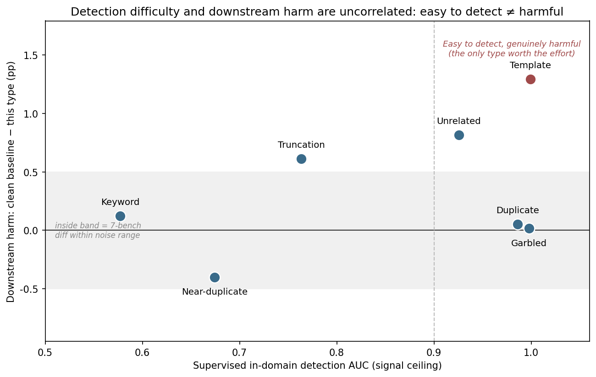

## 7. Conclusions and Future Work

### 7.1 Summary of Core Findings

The 14 findings below are grouped into three sets by research thread (see the [06-results.md](06-results.md) introduction). The cross-thread finding #12 is split into two parts, filed under Thread 2 and Thread 3 respectively; findings 7a and 11a come from the complete results of the wild-noise closed loop (`oasst-wild`).

#### 7.1.1 Thread 1: downstream harm ranking

Downstream harm ranking answers a question that comes before "can it be detected": after noise is injected, did the model's downstream performance actually get worse, and by how much? Looking only at the 7-benchmark average accuracy, the spread between datasets all falls within the narrow 0.42-0.44 range, making it easy to conclude that "the downstream impact is negligible" — but this expectation doesn't hold once the average is broken down into individual benchmarks: the real harm tends to concentrate on a minority of types and tasks, and is simply diluted by the average. The finding below is exactly what emerges from "look at the average first, then break it down by benchmark."

1. **Real downstream harm exists but is limited.** Differences across datasets on 7 general benchmarks are small, but templating is genuinely the worst-performing type under dolly-ratio10, making it the only type that is both easy to detect *and* actually harmful (see [06a](06a-harm-ranking.md) Section 6a.1).

#### 7.1.2 Thread 2: feature signatures of each noise type

Thread 2 asks: if a usable detection signal genuinely exists, is it stable across noise types, and where does it actually come from? The expectation is that detection difficulty should vary monotonically with perturbation strength, and that training-dynamics features should be the main source of signal; the findings below partly confirm and partly overturn that expectation — the ranking is indeed stable (findings 1, 2), but at least two types' high AUC turns out to be an artifact of text similarity rather than evidence that the training-dynamics methodology itself works (finding 5), which is also why the "direction-reversal" methodological pitfall (finding 4) is not an isolated case.

1. **Detection difficulty depends on noise type, and the ranking is stable.** Garbled/templating/exact-duplication are easiest to detect (AUC > 0.98), keyword-substitution/near-duplication are hardest (AUC 0.57-0.76); the ranking holds at both the 10% and 5% noise ratios.
2. **Cross-type transfer loss is substantial (~17-20 points); cross-ratio transfer loss is nearly zero.** Detectors need per-type calibration but not per-ratio calibration.
4. **The direction-reversal trap is a real methodological pitfall.** "Hyper-typical / memorized" noise like templating requires a signed prior rule (rather than generic outlier detection) to be detected, and the same trap reappears along the time axis in early detection.
5. **Two types' high AUC is misleading.** Over 90% of the detection signal for exact duplication and topic mismatch comes from static text similarity, not training dynamics — these two types cannot serve as evidence that "the training-dynamics methodology works." A single-feature leave-one-out ablation confirms this independently: `text_nn_sim` is the only feature that is irreplaceable on both routes (removing it costs duplicate/unrelated/mixed 0.056-0.092), while all other 18 trajectory features individually cost less than 0.01 |Δ| on RF ([06b](06b-feature-signatures.md) Section 6b.8).
7a. **Nearly half of the wild-noise detection signal comes from a response-length confound.** OASST2's human `quality` label itself correlates with response length (correlation -0.20); `pooled_detector`'s raw_auc of 0.700 drops to 0.589 after length-stratified correction, meaning 44.5% of its "better than random" signal comes from length rather than training dynamics; `text_nn_sim` contributes almost nothing on wild noise (raw_auc 0.507), a sharp contrast to its dominant role on injected noise. External baseline comparison likewise shows `el2n_proxy`/`grand_proxy` using only the first epoch (0.760/0.805) beat the full-5-epoch combined score (0.700) — wild noise also does not require running the full training schedule ([06b](06b-feature-signatures.md) Section 6b.9/6b.10).
12a. **Detectors are "narrow," not "broken" (the transferability half).** Applying single-type detectors to a mixed noise stream drops overall AUC to 0.563-0.730, but limiting the comparison to "its own type vs. clean" retains 0.96-1.23 of the original AUC — essentially no decay. This is a coverage gap, not a distribution failure or vanishing signal ([06c](06c-detectability.md) Section 6c.4.2).

#### 7.1.3 Thread 3: can noisy samples be separated label-free

Thread 3 asks whether noisy samples can be picked out and cleaned using only a scorer, with no labels involved. The evidence on this thread forms a causal chain: first, is the ranking the scorer produces even reliable (ranking quality, findings 3, 6); then, even if the ranking is reasonable, does picking the right or wrong direction determine whether cleaning helps or hurts (direction, findings 8, 9, 10); then, even with the right direction, does the budget actually land on the harmful noise type (budget allocation, findings 11, 11a); and finally, back to a question the label-free setting itself can't avoid — what's the fallback when the noise type is unknown (unknown-type strategy, finding 12b). A failure at any link in this chain is enough to break the connection between "detection precision is high" and "cleaning is actually useful."

3. **AUC overstates cleaning usability.** Exact duplication reaches an AUC as high as 0.986 but P@10% lift < 1; choosing a cleaning method must look at budget-constrained precision metrics, not AUC alone.

What AUC obscures is not just a choice-of-precision-metric problem — there is a more fundamental reason underneath it: the features fed to the scorer are themselves diluting ranking quality.

6. **"More features is better" is wrong on the label-free route.** IsolationForest has 46/144 cells where removing one feature actually *raises* AUC (RF has zero such cells); the same `converge_epoch` feature gains 5.2 points when removed on template but loses 2.1 points when removed on near_duplicate. With no labels, every dimension enters the outlier distance indiscriminately, and dimensions unrelated to the current noise type are pure dilution — but "which ones are unrelated" depends on exactly the noise type that is unknown. This is also independent evidence for why `pooled` must take a max rather than a mean ([06b](06b-feature-signatures.md) Section 6b.8).

Feature dilution explains why the ranking gets distorted, but a distorted ranking doesn't by itself mean cleaning is useless — whether cleaning is actually useful still depends on two preconditions holding at once.

8. **Label-free closed-loop cleaning works, but only when two preconditions hold simultaneously: the noise is actually harmful, and the scorer points the right direction.** On garbled, targeted removal reaches 5.7× random precision, yet downstream performance does not improve (garbled is nearly harmless to begin with); switching to templating, which is genuinely harmful, `memo_signed` cleaning recovers 70.3% of the 8.95-point GSM8K gap and 74.4% of the 7-benchmark average gap — the only positive downstream cleaning gain in the whole report.
9. **Picking the wrong scoring direction is worse than not cleaning at all, and worse than random removal.** On templating, `iforest` (wrong direction) achieves only 4.04% targeted precision, less than half the 9.24% random-removal baseline; after retraining, GSM8K drops to 0.4193, 4.09 points below the uncleaned baseline. The full chain reads "correct direction 0.5231 > uncleaned 0.4602 > random drop 0.4526 > wrong direction 0.4193" — cleaning in the wrong direction is actively doing harm ([06c](06c-detectability.md) Section 6c.5.2).

Given how costly a wrong direction is, a natural question follows: can narrowing the feature set lower the chance of getting the direction wrong? The answer is yes.

10. **On the label-free route, 3 features beat all 19, with no exception across 8/8 datasets.** Narrowing IsolationForest's input from 19 features to a greedily chosen 3 raises average AUC by 0.133; template jumps from 0.537 to 0.875 and duplicate from 0.528 to 0.744. The current production scheme is systematically holding itself back — part of "direction reversal" is actually **dimensional dilution**: unrelated dimensions flatten the outlier distance and drown the two or three dimensions that actually carry signal ([06c](06c-detectability.md) Section 6c.3.3). But "which 3" depends on the noise type, and the type being unknown is exactly the label-free setting's premise.
11. **On mixed noise, the scorer with the best ranking quality has a negative downstream gain.** `pooled` achieves the highest lift of any experiment on `mixed` (3.83×), yet its downstream performance is 0.0082 below random removal. The reason: the budget is dominated by harmless types — duplicate and garbled together take about 365/1482 slots while nearly harmless, and templating, which is genuinely harmful, gets only about 34 slots. **A cleaning gain requires three conditions at once: the noise is actually harmful, the scorer points the right direction, and the budget lands on the harmful part of the noise stream** — the third condition is specific to mixed streams and only becomes visible once you go downstream ([06c](06c-detectability.md) Section 6c.5.3).

This budget-misallocation problem is already thorny enough on an injected-noise mixed stream; switch to genuinely wild noise, and the same mechanism shows up wearing a different face.

11a. **On the wild-noise closed loop, targeted removal is actually worse than random removal.** On `oasst-wild`, `pooled`'s targeted removal reaches 26.56% precision (random 9.63%, lift about 3.0×), but after retraining the 7-benchmark average (0.4107) is lower than both random removal (0.4195) and the uncleaned baseline (0.4150) — the only case among the report's four closed loops where random removal beats targeted cleaning, with the negative result coming almost entirely from a single benchmark, MMLU. The mechanism differs from Section 6c.5's "one of two preconditions missing" framework: here the `pooled` scorer itself carries the length confound described in finding 7a, and likely systematically removes a batch of "short but reasonable" responses rather than genuinely low-quality ones ([06c](06c-detectability.md) Section 6c.6).

Whether the noise is injected or wild, every finding above rests on the premise that "the noise type we need to guard against is known"; once the noise type itself is unknown, ranking quality, direction, and budget can no longer be individually calibrated for a specific type, and the only option left is to fall back to a more conservative default strategy.

12b. **Unknown noise needs two legs running in parallel (the unknown-type-handling half).** On genuinely unseen types (leave-one-out), the training-dynamics detector pool's AUC ranges 0.416-0.935 and `text_nn_sim`'s ranges 0.396-0.974; the two are complementary, each with types where it falls below random, and only combining them by taking the better score gets all 7 types above 0.66. This is the design rationale behind the `pooled` scorer in [06c](06c-detectability.md) Section 6c.4.5 (Section 6c.4).

### 7.2 Limitations

- **[Thread 1]** The overall discriminative range for downstream benchmark impact is narrow (0.42-0.44), possibly because the current evaluation set is not sensitive enough, or because noise's downstream impact is genuinely limited at this LoRA fine-tuning scale/epoch count; larger-scale or longer training could plausibly widen these differences.
- **[Thread 1]** Some downstream benchmarks have a small sample size, so individual results should be read cautiously: BBH has only 540 rows (the smallest of all 7 benchmarks), and templating's -4.26-point drop on it may itself contain substantial statistical noise, and should not be cited as evidence of the same strength as the -8.95-point drop on GSM8K.
- **[Thread 1]** All four `triviaqa-ratio10` datasets have now finished training and evaluation. The caveat that previously stood here — "currently covers only the `wrong_answer` mechanism; once the remaining data lands, the finding's strength or even direction could change" — was **half borne out**: Section 6a.3's "under a single homogeneous task, harm is not diluted away by averaging" holds for `wrong_answer` (qa_correctness -36.25 points), but **does not generalise across QA noise mechanisms** — `confusable_wrong` scores 0.35 points *above* the clean baseline on qa_correctness, and `refusal` only 3.70 points below. The "homogeneous task amplifies harm" effect therefore depends on the relationship between the noise content and the task capability, not on task homogeneity alone (see Section 6a.3). Any future claim that "noise is harmful in task domain X" must be tied to a specific noise mechanism, not to the task domain by itself.
- **[Thread 3]** Closed-loop cleaning has covered `garbled`, `template`, `mixed` (`pooled`), and `oasst-wild`, but not yet the harder-to-detect keyword-substitution and near-duplication types. **Every closed-loop conclusion comes from a single training run with a single seed, with no variance estimate**: the +0.0096 on templating, -0.0082 on mixed, and -0.0043 on wild noise all sit within the narrow 0.42-0.44 band of the 7-benchmark average; what is reliable is direction (correct direction > uncleaned > random > wrong direction) and rough magnitude, not the fourth decimal place.
- **[Thread 3]** Section 6c.3.3's minimal feature set is chosen by greedy search **against the very labels being scored**, so the AUC at a given k is optimistic — it measures "how much signal a small feature set can carry at best," not a label-free-usable feature-selection recipe. Section 3.1 explicitly forbids selecting features by label, so "3 features beat all 19" still needs a label-free feature-selection mechanism before it can be realized in production.
- **[Thread 2]** The finding that `text_nn_sim` dominates detection of exact duplication / topic mismatch implies the core "training-dynamics detection" methodology only substantially contributes for types like garbled, templating, truncation, and keyword substitution — the methodology's framing should avoid over-generalizing from this.
- **[Thread 3]** Section 6c.4's "unseen noise types" are still one of the 7 types we ourselves injected, merely unseen by the detector pool; genuinely wild noise (mis-pasted content, encoding errors, cross-language contamination, machine-translation artifacts, etc.) may differ from these 7 in text distribution and training dynamics — the 0.416-0.935 range from leave-one-out cannot be extrapolated directly to wild data.
- **[Thread 3]** The ablations in Sections 6c.2/6c.3 confirm that `cleaning_loop.py`'s current "19-feature mixed iforest" scheme for duplicate/unrelated is diluted by weak features other than `text_nn_sim` — using `text_nn_sim` alone is more precise. For near_duplicate/keyword, none of the currently available raw data categories are sufficient — a genuine methodological blind spot, not a wrong choice of scoring method. [06b](06b-feature-signatures.md) Section 6b.8's single-feature leave-one-out runs on the diagnostic-subsample population (~900-1200 rows per dataset), a fairly small sample; individual-cell Δ values of 0.01-0.02 should not be over-interpreted one at a time — what is reliable is the aggregate contrast that "RF is uniformly below 0.01 while IF has 46 cells above it."
- **[Thread 2]** Token-level diagnostic metrics are currently sampled on only 1/8 of the rows (`diag_subsample=8`), and this sampling rate itself dilutes the signal: computing `hard_loss_max`'s AUC on only the actually-sampled 12.5% of rows gives 0.920/0.632 for templating/near_duplicate, but on the full population (with the remaining 87.5% median-imputed) that drops to only 0.564/0.515 — for these two types, part of the true detection ceiling is being masked by subsampling, not a genuinely weak signal; keyword substitution, by contrast, has an AUC of only 0.555 even on the real sampled data — the signal itself is weak there, and raising the sampling rate would not help. (Raw numbers in [08-appendix.md](08-appendix.md) Section 8.2; retraining-cost estimate in Section 8.5.)

### 7.3 Next Steps

Roughly speaking, the 8 items below follow each thread's own evidence gap: Thread 1 needs to verify whether the currently low harm discriminability is simply because training scale is too small for it to show up yet; Thread 2 needs to re-examine whether the "per-sample gradient" collection premise is worth its cost; Thread 3 needs to generalize the single-point changes already shown to work (`text_sim` scoring, feature narrowing) and add variance estimates; the problem sitting at the intersection of Thread 1 and Thread 3 — "weighting removal by harm" — remains the final unresolved gate.

- **[Thread 3]** Extend closed-loop cleaning to the remaining noise types, especially checking whether cleaning exact duplication — whose P@10% lift is below 1 — is actually harmful.
- **[Thread 3]** Repeat the templating closed loop (Section 6c.5.2) with multiple seeds, to put a variance estimate on the +0.0096 downstream gain and the +0.0629 GSM8K recovery — currently a single-run result.
- **[Thread 3]** Add a `text_sim` scoring mode to `cleaning_loop.py` for duplicate/unrelated (Section 6c.3.3), expected to be more precise than the current mixed-feature iforest with no new data collection needed. Section 6c.4.5's `pooled` already folds `text_nn_sim` in as one leg and validates its effect on duplicate (per-type AUC 0.946); what remains is offering a pure `text_sim` option, with no other leg mixed in, for already-calibrated single-type settings.
- **[Thread 2]** Explore dedicated features for "mildly perturbed" noise like keyword substitution and near-duplication ([06c](06c-detectability.md) Section 6c.3's ablation confirms the current training-dynamics + text-similarity feature combination carries very weak signal for both, and even adding token-level diagnostics unavailable in production does not solve it).
- **[Thread 1][Thread 3]** **Weight removal by harm, not by anomaly score** (the most substantive open problem): Section 6c.5.3 shows `pooled` spends roughly a quarter of its budget on duplicate/garbled, whose downstream harm is near zero, while templating — genuinely harmful — gets only 2.3%. Harm needs to be folded into the score, but harm can only be known from downstream evaluation, which is unavailable under a label-free setting — this loop is the central open difficulty this report leaves behind.
- **[Thread 3]** **Narrow the `iforest` leg from 19 features to 2-3** (Section 6c.3.3): the only change that needs no new data and no new method, just fewer features, for a 0.04-0.34 gain — but "which few" depends on the noise type, requiring label-free feature selection to be solved first.
- **[Thread 3]** **Verify whether removing the length confound and re-scoring/re-cleaning can turn the wild-noise closed loop positive**: on `oasst-wild`, `pooled`'s signal is contaminated by a length confound unrelated to true quality (finding 7a); this report has not yet verified whether re-scoring and re-cleaning after removing that confound would turn Section 6c.6's negative gain positive ([06c](06c-detectability.md) Section 6c.6).
- **[Thread 2]** **Re-examine whether the `micro_batch=1` collection premise is worth its cost.** Section 3.4 lists `micro_batch=1` as a methodological premise rather than a performance choice, because attributing a gradient to a single sample requires that sample to constitute its own forward-backward pass; the cost is that every sample runs separately, so a 138k-row dataset like triviaqa needs about 6 h per epoch. But only 10 of the 19 full-coverage features depend on that premise (`grad_norm_*`/`cos_ref_*`/`update_contrib_mean`); the other 9 (`text_nn_sim` plus the 8 loss-family features) can be collected for free under ordinary batched training — compute the per-row loss inside the batch with `reduction='none'`. Restricting the scorer's input to those 9 features: **supervised AUC drops by only 0.021 on average, and the label-free route actually improves by 0.008 (ratio10) / 0.017 (ratio5)**, consistently across 8 datasets and both noise ratios; conversely, using only the 10 gradient features is markedly worse across the board (unrelated 0.944→0.709, mixed 0.838→0.688). The one exception is template's label-free AUC, but that type already fails on `iforest` because of direction reversal — switching to `memo_signed`, which does work for it, and dropping `grad_norm_mean` (the only gradient feature among its 6) to leave just 5 loss features, raises AUC from 0.9265 to 0.9325. Section 6b.8's single-feature leave-one-out corroborates the same point independently: on the RF route, removing any one gradient/cosine feature costs a mean |Δ| of only 0.001, while `text_nn_sim` is worth 0.027. In other words, **the entire per-sample-gradient feature family contributes almost no detection signal, yet it dictates the collection cost of the whole method.** What remains to be verified is how much wall-clock time ordinary batched training would save (`micro_batch=16, grad_accum=1`, keeping the effective batch size unchanged so results stay comparable with this report) — GPU utilization is currently only 28-35% (measured on the RTX PRO 6000 and not re-measured after the hardware change, see Section 3.3), so the headroom is substantial but this report has not measured it. If the gradient family does need to be kept, both per-sample gradient norms and the inner product with the reference direction can be computed exactly inside a batch via ghost norms (every LoRA layer is linear, and because the reference direction is fixed, `cos_ref`'s numerator can be rewritten as a per-token bilinear form), with no need to materialize each sample's full gradient. One convention detail matters: the current implementation accumulates "the sum of per-sample mean losses," whereas a standard mean reduction is a token-weighted average over the whole window (longer samples carry more weight) — preserving equivalence requires taking the row-wise mean first, then the mean over rows.

---
