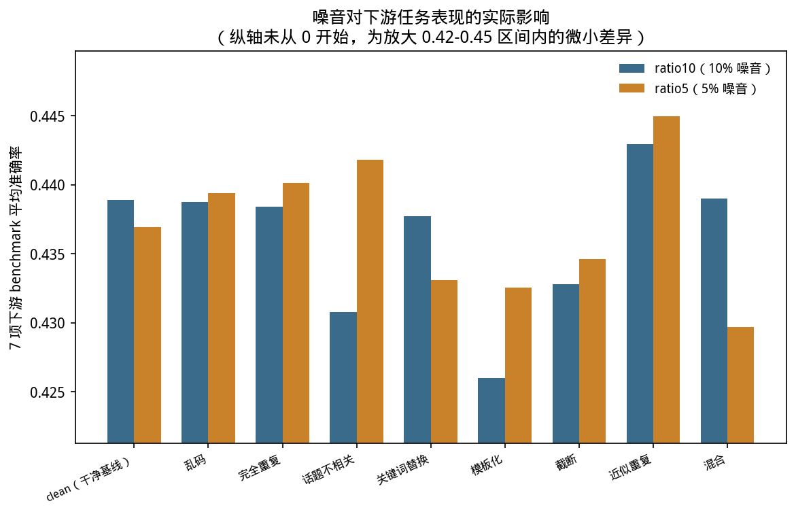
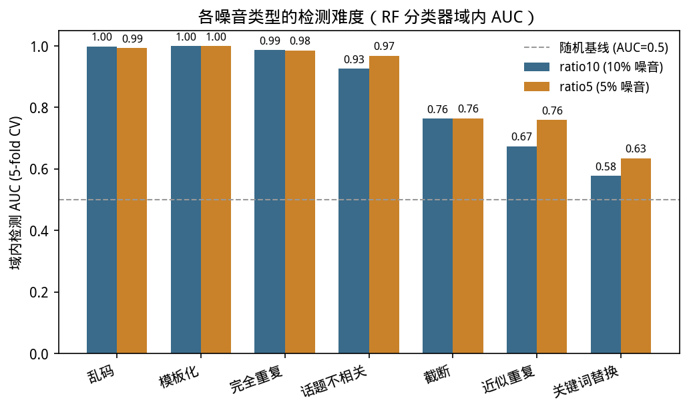
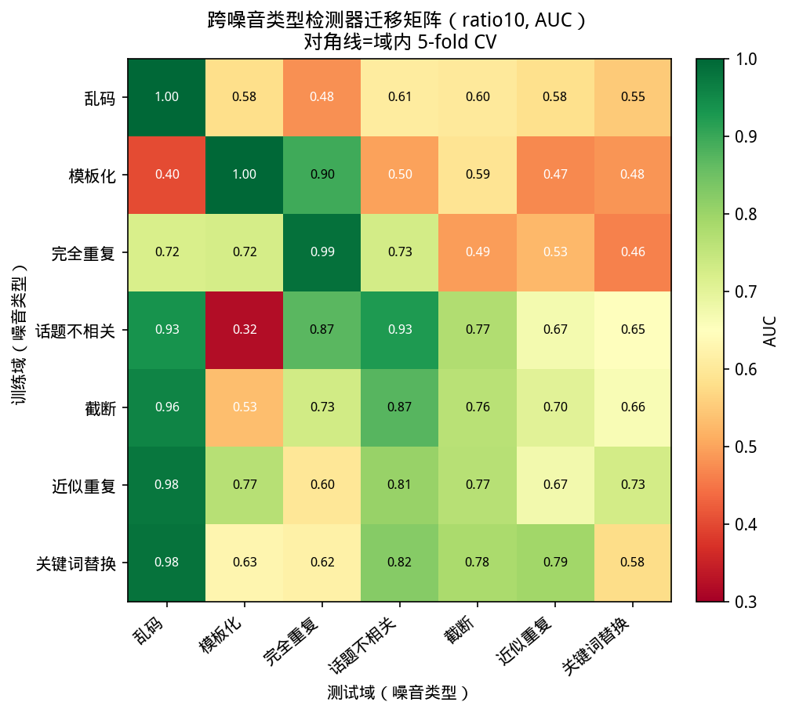
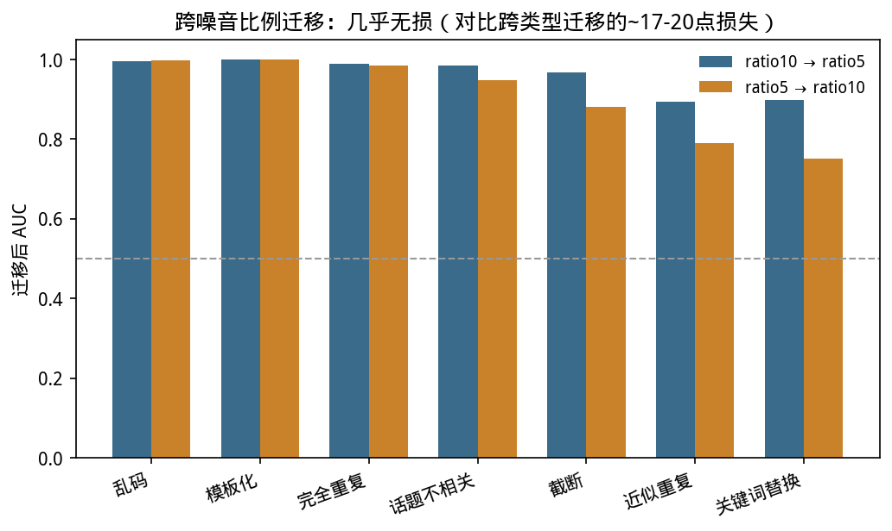
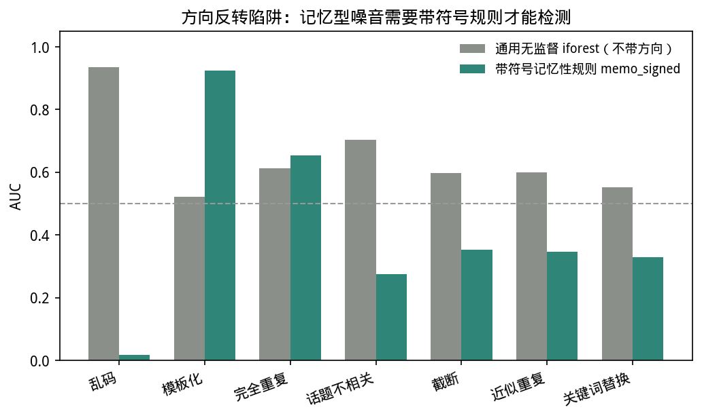
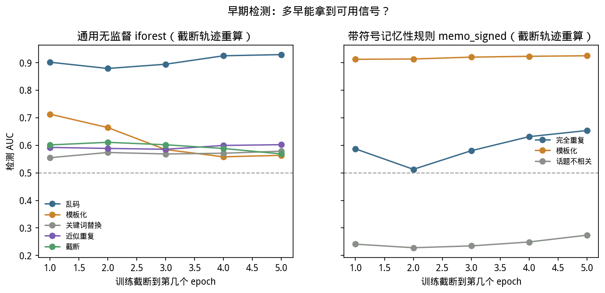
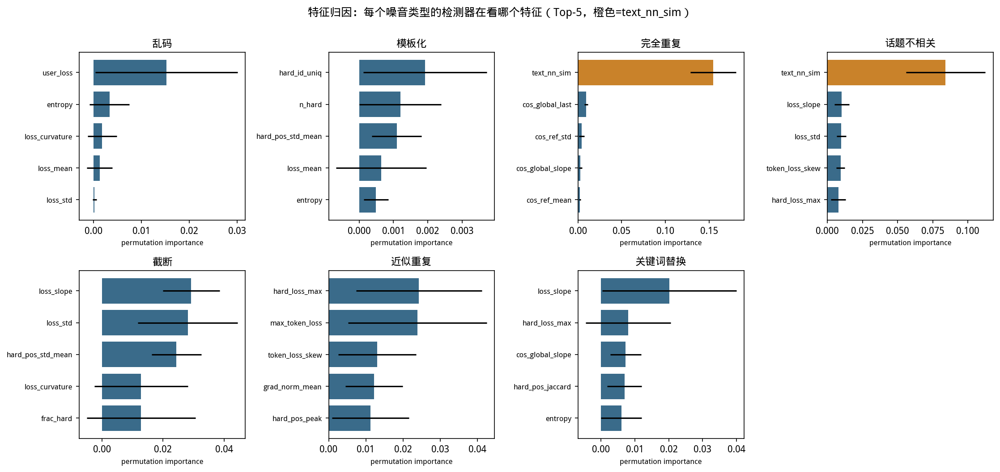
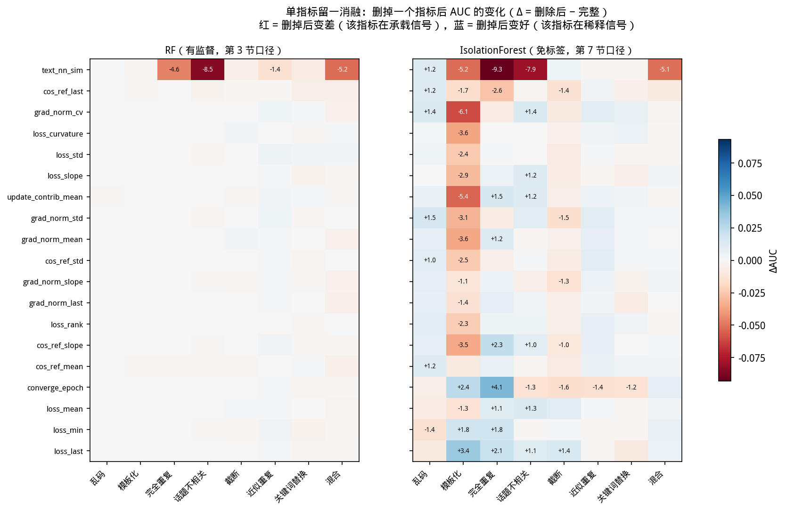

<!-- 本文件由 scripts/build_report.py 自动生成，请勿手工编辑，修改请改动 docs/report_zh/ 下的源文件后重新运行脚本 -->

- [1. 实验概述](#1-实验概述)
  - [1.1 数据与噪音类型](#11-数据与噪音类型)
  - [1.2 训练配置](#12-训练配置)
  - [1.3 报告结构](#13-报告结构)
- [2. 相关工作](#2-相关工作)
  - [2.1 训练动态携带样本级信息](#21-训练动态携带样本级信息)
  - [2.2 用梯度追溯单条样本的影响](#22-用梯度追溯单条样本的影响)
  - [2.3 噪声标签学习中的"小损失"准则](#23-噪声标签学习中的小损失准则)
  - [2.4 指令微调数据的筛选与去重](#24-指令微调数据的筛选与去重)
  - [2.5 本报告的定位](#25-本报告的定位)
- [3. 实验前提](#3-实验前提)
  - [3.1 硬约束：完全不使用噪音标签](#31-硬约束完全不使用噪音标签)
  - [3.2 噪音是程序化注入的，不是野生的](#32-噪音是程序化注入的不是野生的)
  - [3.3 单一基座模型、单一规模、单一任务域](#33-单一基座模型单一规模单一任务域)
  - [3.4 `micro_batch=1` 是方法前提，不是性能选择](#34-micro_batch1-是方法前提不是性能选择)
  - [3.5 两个口径必须分开读：全量 vs 诊断子采样](#35-两个口径必须分开读全量-vs-诊断子采样)
  - [3.6 已完成与未完成的范围](#36-已完成与未完成的范围)
- [4. 实验方案](#4-实验方案)
  - [4.1 整体流程](#41-整体流程)
  - [4.2 步骤①：数据集构造与噪音注入](#42-步骤①数据集构造与噪音注入)
  - [4.3 步骤②：LoRA 微调与逐样本指标采集](#43-步骤②lora-微调与逐样本指标采集)
  - [4.4 步骤③：汇总逐样本指标表](#44-步骤③汇总逐样本指标表)
  - [4.5 步骤④：各项分析的口径](#45-步骤④各项分析的口径)
  - [4.6 步骤⑤-⑥：闭环清洗与重训](#46-步骤⑤-⑥闭环清洗与重训)
  - [4.7 已知的方案性局限](#47-已知的方案性局限)
- [5. 实验的理论分析](#5-实验的理论分析)
  - [5.1 基本假设：噪音样本在优化过程中"不合群"](#51-基本假设噪音样本在优化过程中不合群)
  - [5.2 关键的理论修正：存在两类机制相反的噪音](#52-关键的理论修正存在两类机制相反的噪音)
  - [5.3 免标签设定下的根本困难：方向不可知](#53-免标签设定下的根本困难方向不可知)
  - [5.4 一个独立的信号来源：静态文本相似度](#54-一个独立的信号来源静态文本相似度)
  - [5.5 预期与实测的对照表](#55-预期与实测的对照表)
- [6. 实验过程与结果：索引页](#6-实验过程与结果索引页)
  - [三条主线](#三条主线)
  - [6.1 实验设置与产出文件（三条主线共享的基础设施）](#61-实验设置与产出文件三条主线共享的基础设施)
  - [导航表](#导航表)
- [6a. 下游危害排序：什么样的噪音类型对训练效果的影响最大](#6a-下游危害排序什么样的噪音类型对训练效果的影响最大)
  - [6a.1 下游任务实际影响：噪音真的会拖累模型效果吗](#6a1-下游任务实际影响噪音真的会拖累模型效果吗)
  - [6a.2 闭环清洗对危害排序的侧面印证](#6a2-闭环清洗对危害排序的侧面印证)
- [6b. 各噪音类型的指标特征:训练动态与文本特征如何随类型变化](#6b-各噪音类型的指标特征训练动态与文本特征如何随类型变化)
  - [6b.1 检测难度全景:哪些噪音"看得出来",哪些看不出来](#6b1-检测难度全景哪些噪音看得出来哪些看不出来)
  - [6b.2 跨噪音类型迁移:检测器能不能"举一反三"](#6b2-跨噪音类型迁移检测器能不能举一反三)
  - [6b.3 跨噪音比例迁移:几乎无损](#6b3-跨噪音比例迁移几乎无损)
  - [6b.4 方向反转陷阱:记忆型噪音需要"带符号"的规则](#6b4-方向反转陷阱记忆型噪音需要带符号的规则)
  - [6b.5 早期检测:不用等训练跑完就能拿到信号](#6b5-早期检测不用等训练跑完就能拿到信号)
  - [6b.6 特征归因:检测器到底在看什么](#6b6-特征归因检测器到底在看什么)
  - [6b.7 这些指标之间有多少重叠?](#6b7-这些指标之间有多少重叠)
  - [6b.8 单指标留一:哪一个指标真的不可替代?](#6b8-单指标留一哪一个指标真的不可替代)
  - [6b.9 外部基线对比:本项目的训练动态检测器 vs. 文献里的 EL2N/GraNd/TracIn 代理指标](#6b9-外部基线对比本项目的训练动态检测器-vs-文献里的-el2ngrandtracin-代理指标)
  - [6b.10 天然噪音的检测信号里,多少是回复长度混淆?](#6b10-天然噪音的检测信号里多少是回复长度混淆)
- [6c. 能否免标签分离噪音样本:精度、边界与真实收益](#6c-能否免标签分离噪音样本精度边界与真实收益)
  - [6c.1 清洗精度 lift:AUC 高不代表清洗预算下真的好用](#6c1-清洗精度-liftauc-高不代表清洗预算下真的好用)
  - [6c.2 各噪音类型:目前最佳筛选方法一览](#6c2-各噪音类型目前最佳筛选方法一览)
  - [6c.3 特征消融实验:哪些数据必要,哪个指标不可替代?](#6c3-特征消融实验哪些数据必要哪个指标不可替代)
  - [6c.4 方法在未知噪音下的边界](#6c4-方法在未知噪音下的边界)
  - [6c.5 免标签闭环清洗:从"能检测"到"清洗有效"](#6c5-免标签闭环清洗从能检测到清洗有效)
  - [6c.6 天然噪音闭环清洗:下游收益为负,且原因与注入噪音不同](#6c6-天然噪音闭环清洗下游收益为负且原因与注入噪音不同)
- [7. 结论与 future work](#7-结论与-future-work)
  - [7.1 核心结论汇总](#71-核心结论汇总)
  - [7.2 局限性](#72-局限性)
  - [7.3 下一步方向](#73-下一步方向)
- [8. 附录：原始数据与指标定义](#8-附录原始数据与指标定义)
  - [8.1 训练轨迹类指标（全量覆盖，来自 `per_sample.jsonl`）](#81-训练轨迹类指标全量覆盖来自-per_samplejsonl)
  - [8.2 Token 级诊断指标（子采样覆盖，来自 `diag_epoch*.jsonl` / `token_diag_epoch*.jsonl`）](#82-token-级诊断指标子采样覆盖来自-diag_epochjsonl--token_diag_epochjsonl)
  - [8.3 文本层面指标（静态，不依赖训练）](#83-文本层面指标静态不依赖训练)
  - [8.4 已产出但未进入检测流程的诊断量](#84-已产出但未进入检测流程的诊断量)
  - [8.5 采集耗时（实测，`keyword@dolly-ratio10`，单卡 NVIDIA RTX PRO 6000 Blackwell Server Edition）](#85-采集耗时实测keyworddolly-ratio10单卡-nvidia-rtx-pro-6000-blackwell-server-edition)
  - [8.6 噪音样本示例（原始文本对照）](#86-噪音样本示例原始文本对照)
  - [8.7 原始特征值示例：一条噪音样本 vs. 一条干净样本](#87-原始特征值示例一条噪音样本-vs-一条干净样本)
  - [8.8 原始信号：方向反转在 loss 曲线本身上的直接体现](#88-原始信号方向反转在-loss-曲线本身上的直接体现)

## 1. 实验概述

本项目围绕三条并列的研究主线展开，三者依次递进又相互独立，缺一个都不足以回答"噪音检测在实践中值不值得做"这个更大的问题：

1. **主线1（危害排序）**：什么样的噪音类型对训练效果的影响最大？——即使能检测，如果某类噪音对下游任务几乎无害，清洗它的价值也存疑。
2. **主线2（指标特征）**：各噪音类型都有什么样的指标特征？训练动态（loss 轨迹、梯度范数、余弦相似度等）与文本特征如何随噪音类型变化？
3. **主线3（可分离性）**：能否依据这些指标特征，在**完全不使用噪音标签**的前提下把噪音样本分离出来，精度如何，清洗后训练是否真的变好？

三者的关系不是简单的先后顺序：主线2是主线3的方法论基础——不先弄清楚指标特征长什么样，就无从设计免标签打分器；但主线2揭示的机制性发现（尤其是第 5.2 节与 [06b](#6b-各噪音类型的指标特征训练动态与文本特征如何随类型变化) 第 6b.4 节的"方向反转陷阱"）恰恰说明，有监督检测精度高（如模板化域内 AUC 0.999）不代表免标签方案能达到同等精度（同一类型 `iforest` 仅 0.522）——这是本报告最重要的发现之一，也是主线2与主线3必须分开讨论的原因。主线1则独立于前两者：一类噪音检测精度再高、免标签方案再成熟，如果它本身对下游任务无害（如乱码闭环清洗后下游收益为零，见 [06a](#6a-下游危害排序什么样的噪音类型对训练效果的影响最大) 第 6a.2.1 节），清洗它带来的实际价值仍然有限。

### 1.1 数据与噪音类型

以 dolly-15k 为基座数据集，注入 7 种噪音类型，外加 `clean`（干净基线）与 `mixed`（7 种混合）共 9 个数据集：

| 噪音类型 | 中文名 | 制造方式 |
|---|---|---|
| `garbled` | 乱码 | 文本随机字符替换/打乱 |
| `template` | 模板化 | 用高度重复的模板句式生成回复 |
| `duplicate` | 完全重复 | 复制已有样本 |
| `unrelated` | 话题不相关 | 回复与问题不匹配 |
| `truncation` | 截断 | 回复被截断，信息不完整 |
| `near_duplicate` | 近似重复 | 对已有样本做轻微改写 |
| `keyword` | 关键词替换 | 替换句中关键实体/术语 |

两个实验标签（tag）对应两个噪音比例：

- **`dolly-ratio10`**：噪音比例 10%，9 个数据集全部训练+分析+评测完成（2026-09-13 00:48 完成训练，2026-09-14 02:20 完成下游评测）。
- **`dolly-ratio5`**：噪音比例 5%，作为交叉验证。9 个数据集训练已于 2026-09-14 07:46 完成，5 项分析表已于 09:35 完成；下游 benchmark 评测（tmux session `dolly-ratio5_eval`）已于同日全部完成（9/9 数据集）。

### 1.2 训练配置

- 模型：Qwen2.5-3B-Instruct，LoRA（r=32）微调，5 epochs，逐样本梯度/loss 追踪。
- GPU：NVIDIA RTX PRO 6000 Blackwell Server Edition（~98GB），单卡，所有训练/评测任务串行排队执行。
- 每个数据集训练完成后落盘 `runs/{tag}/{dataset}/metrics/per_sample.jsonl`，包含每个样本每个 epoch 的 loss、梯度范数、余弦相似度等指标，所有后续分析均由此重算，不需要重新训练。

### 1.3 报告结构

本报告分八章、每章一个文件（第 6 章物理拆分为 06/06a/06b/06c 四个文件，见下）。下表按"章节 × 主要服务的主线"组织，`●` 表示该章主要回答这条主线的问题，`○` 表示涉及但非重点，空白表示基本不涉及：

| 章 | 内容 | 主线1<br>危害排序 | 主线2<br>指标特征 | 主线3<br>可分离性 |
|---|---|:---:|:---:|:---:|
| 1 | 实验概述（现在） | ● | ● | ● |
| [2](#2-相关工作) | 相关工作——这套方法建立在哪些已有结论上、与它们的分工 | ○ | ● | ● |
| [3](#3-实验前提) | 实验前提——**读任何数字之前必看**，免标签约束、单一模型规模、两个样本口径的差异 | ○ | ● | ● |
| [4](#4-实验方案) | 实验方案——想复现，或想核对某个数字是怎么算出来的 | ○ | ● | ● |
| [5](#5-实验的理论分析) | 理论分析——为什么这么设计、预期哪些噪音能检测哪些不能 | ○ | ● | ● |
| [6](#6-实验过程与结果索引页) | 实验过程与结果：索引页（导航到 06a/06b/06c） | ○ | ○ | ○ |
| [6a](#6a-下游危害排序什么样的噪音类型对训练效果的影响最大) | 下游危害排序——什么噪音对训练效果影响最大 | ● | | ○ |
| [6b](#6b-各噪音类型的指标特征训练动态与文本特征如何随类型变化) | 各噪音类型的指标特征——训练动态/文本特征长什么样（报告篇幅最大的部分） | | ● | ○ |
| [6c](#6c-能否免标签分离噪音样本精度边界与真实收益) | 能否免标签分离——检测精度、消融、闭环清洗的真实下游收益 | ○ | | ● |
| [7](#7-结论与-future-work) | 结论与 future work——想直接看结论 | ● | ● | ● |
| [8](#8-附录原始数据与指标定义) | 附录——指标定义、采集耗时、全部原始数据展示 | | ● | ○ |

第 6 章的三个子文件内部仍按"先测能力、再测边界、最后测真实收益"的顺序展开：06b 逐项检验各噪音类型的检测难度、迁移性、方向反转陷阱、特征归因等机制性发现；06c 在此基础上做综合、边界（未知类型）与真实清洗收益；06a 独立于前两者，直接从下游 benchmark 回答"值不值得清洗"。06c 第 6c.5/6c.6 节是全报告唯一实际剔除样本并重新训练的实验，产出真实下游对比。

**先读第 3 章。** 报告里的数字分属两个口径（有监督 vs 免标签、全量 vs 诊断子采样），混读会得出错误结论，第 3.1 与 3.5 节专门解释这两处差异。

---

## 2. 相关工作

本节说明这套方法建立在哪些已有结论之上，以及本报告与它们的分工。**下列引用是按作者与核心思想给出的定位指针，便于按名检索，不是经过逐条核对的正式参考文献表**；本项目代码库内没有引用管理，具体版本与页码请以原文为准。

### 2.1 训练动态携带样本级信息

"模型在训练过程中怎么对待一条样本"本身是一种信号，这个想法有相当扎实的基础。Zhang 等（2017）证明深度网络可以完全记住随机标签，说明损失曲线里含有"这条样本有多难、多反常"的信息；Arpit 等（2017）指出网络倾向于先学简单模式、后记住噪音，即噪音与干净样本在**时间维度上可分**。Toneva 等（2019）用"遗忘事件"（训练中被学会又被忘掉的次数）刻画样本难度；Swayamdipta 等（2020）的 Dataset Cartography 用置信度均值与方差把数据集画成一张图，分出 easy / ambiguous / hard-to-learn 三区。

本报告用的 loss 均值/末值/斜率/曲率、`converge_epoch`、梯度范数、与参考梯度的余弦相似度属于同一族信号，区别在**采集粒度**：上述工作多在标准 mini-batch 训练下使用置信度或正确性统计，而这里用 `micro_batch=1` 把每条样本的梯度单独隔离出来（第 4.3 节），因此能拿到逐样本的梯度范数与方向，而不只是逐样本的 loss。

### 2.2 用梯度追溯单条样本的影响

另一条线是直接量化"某条训练样本对模型的影响"。Koh 与 Liang（2017）把影响函数引入深度学习；Pruthi 等（2020）的 TracIn 用训练过程中梯度内积的累积来近似同一个量。本报告的 `cos_sim_ref`（样本梯度与 200 条留出样本平均梯度方向的余弦相似度）和 `update_contrib` 是这个思路的轻量版本：不求精确影响值，只求一个能用于排序的代理量，代价小到可以对全部训练样本每个 epoch 都算一遍。

### 2.3 噪声标签学习中的"小损失"准则

在噪声标签文献里，"loss 小的样本更可信"是主流准则，Han 等（2018）的 Co-teaching 及大量后续工作都建立在这之上。这个准则对本报告很关键，但**方向是反的**：它假设噪音 = 难学 = loss 高。第 5.2 节与 [06b](#6b-各噪音类型的指标特征训练动态与文本特征如何随类型变化) 第 6b.4 节说明，对模板化、完全重复这类噪音，噪音恰恰是 loss 最低、收敛最快的那批样本，小损失准则会系统性地保护噪音。Feldman 与 Zhang（2020）关于记忆与长尾样本的分析，以及 Carlini 等关于语言模型逐字记忆的量化工作，提供了解释这一反向现象的另一半依据：高度重复或高度模板化的内容会被优先记住，因而在训练动态上表现为"异常典型"而非"异常反常"。

### 2.4 指令微调数据的筛选与去重

在 LLM 侧，"数据质量比数量重要"已有若干实证：Zhou 等（2023）的 LIMA 用约一千条精选样本达到有竞争力的效果；Chen 等（2023）的 AlpaGasus 用一个 LLM 打分器过滤低质量指令数据后效果反而更好；Li 等（2024）用"指令跟随难度"（IFD）做筛选。去重方向上，Lee 等（2022）证明训练数据去重能实质改善语言模型；Abbas 等（2023）的 SemDeDup 与 Sorscher 等（2022）的原型性剪枝把这一思路推广到语义层面。

这些工作与本报告的分工是清楚的：它们多用**外部打分器**（另一个 LLM、嵌入相似度、启发式规则）判断质量，而本报告只用**被训练模型自己在训练过程中留下的痕迹**，不引入外部裁判。两条路并不冲突——[06b](#6b-各噪音类型的指标特征训练动态与文本特征如何随类型变化) 第 6b.6 节与第 6b.8 节恰好显示，静态文本相似度 `text_nn_sim`（属于外部信号一侧）在完全重复/话题不相关上强于全部训练动态特征，而在乱码上完全无用。

### 2.5 本报告的定位

综合看，本报告不主张"训练动态是新信号"，而是回答一个更具体、上述文献没有系统回答的问题：**在完全不使用噪音标签、也不引入外部裁判的前提下，仅凭 LoRA 微调过程中的逐样本训练动态，对七种不同机制的噪音各自能做到什么程度，以及照此清洗后下游任务是否真的变好。** 四个具体取舍，分别对应三条研究主线（见 [06-results.md](#6-实验过程与结果索引页) 导语）：

- **[主线3]** **免标签是硬约束**，不是可选项。标签只出现在评估侧，任何打分器都看不到它（第 4.4 节）。这排除了噪声标签文献里大量"用少量干净样本校准方向"的做法。
- **[主线2]** **按噪音机制分类型报告**，而不是报一个总体数字。[06b](#6b-各噪音类型的指标特征训练动态与文本特征如何随类型变化) 第 6b.4 节说明为什么合并汇报会掩盖方向反转这类关键现象。
- **[主线1]** **危害排序不依赖检测精度，而是直接走下游评测**。上述文献大多止步于"排序质量"（AUC / P@10% 等检测侧指标），本报告额外为每种噪音类型单独跑 7 项下游 benchmark（[06a](#6a-下游危害排序什么样的噪音类型对训练效果的影响最大) 第 6a.1 节），把"这类噪音容不容易被检测出来"和"这类噪音到底有没有害"分成两个独立问题分别回答。
- **[主线3]** **必须走到下游**。排序质量（AUC / P@10%）不等于清洗收益，[06c](#6c-能否免标签分离噪音样本精度边界与真实收益) 第 6c.5 节用真实重训与评测证明两者可以脱钩，甚至反向。

---

## 3. 实验前提

本节把整套实验依赖的前提集中写清楚。这些前提有的是主动设定的约束（例如免标签），有的是被条件限制的边界（例如单一基座模型），两者都会直接影响结论的适用范围。**读任何一个数字之前先读这一节**，否则很容易把"在这些前提下成立"误读成"普遍成立"。

### 3.1 硬约束：完全不使用噪音标签

**主要影响：主线3（可分离性）**——这条约束直接决定了"能否免标签分离噪音"这个问题本身是否成立；它也间接为主线2划出"有监督 AUC 只是信号上限、不是生产可达"这条口径线。

这是全部方法的第一前提，也是与噪声标签学习文献（第 4.3 节）最主要的分界线：**任何打分器在任何时刻都看不到 `noise_type`**。标签只出现在两个地方——构造数据集时用来注入噪音，以及评估时用来算 AUC / 精度。检测侧完全看不到它。

这条约束排除了一批在学术设定下常见、在生产环境下不可用的做法：

- 不能用少量已知干净样本去校准打分方向（这正是第 5.3 节讨论的核心困难）。
- 不能按标签选择特征子集或调打分器超参——[06b](#6b-各噪音类型的指标特征训练动态与文本特征如何随类型变化) 第 6b.8 节的单指标消融显示，如果允许按类型挑特征，免标签 AUC 还有 2-5 个点的空间，但这个空间在生产环境里拿不到。
- 不能用标签决定该用哪个打分器。这一点的代价在 [06c](#6c-能否免标签分离噪音样本精度边界与真实收益) 第 6c.5.2 节被量化：模板化上选错方向的打分器，下游反而比不清洗更差。

唯一的例外是**[06b](#6b-各噪音类型的指标特征训练动态与文本特征如何随类型变化) 第 6b.1 节与第 6b.2 节的有监督 AUC**，它们刻意使用标签训练随机森林。这两节不是生产方案，而是**信号上限的参照系**：如果连有监督都做不到，免标签更没戏。报告中凡是出现有监督数字，都会明确标注口径。

### 3.2 噪音是程序化注入的，不是野生的

**主要影响：主线2、主线3**——这条前提决定了检测器的泛化边界：主线2报告的机制性发现（方向反转陷阱、特征归因）都是在"注入噪音"这个已知分布上验证的；主线3的免标签分离精度同理只在这个分布内可信。它不直接约束主线1，因为下游危害测量依赖的是"这条数据混进训练集"这一事实本身，与噪音是注入还是野生无关。

7 种噪音全部由 `data.py::apply` 按固定规则注入，扰动方式已知且一致。这带来一个关键优势和一个关键局限：

- **优势**：有精确的 ground truth，可以算出每种噪音各自的检测难度，而不是只能报一个混合数字。第 6 章按类型分开报告，就依赖这一点。
- **局限**：真实的野生噪音（用户误粘贴、编码错误、跨语言混入、机翻痕迹、模型自身幻觉产出）在文本分布和训练动态上都可能与这 7 类不同。[06c](#6c-能否免标签分离噪音样本精度边界与真实收益) 第 6c.4 节的"未见过的类型"仍然是这 7 类之一，只是对检测器池而言未见过——**那一节的 0.416-0.935 这个区间不能直接外推到野生数据上**。

另有两个注入细节会影响读数，第 4.2 节详述：`duplicate` 是唯一改变数据集行数的类型（追加副本而非原地替换，因此噪音占比是 9.1% 而非 10%）；`mixed` 的每个子类型数量有 191-211 的随机波动。

### 3.3 单一基座模型、单一规模、单一任务域

全部实验用 Qwen2.5-3B-Instruct + LoRA（r=32），5 epochs，基座数据集为 dolly-15k。没有做模型规模、LoRA 秩、训练轮数、基座数据集的交叉验证。

这个前提对两类结论的影响程度不同：

- **检测能力结论**（[06b](#6b-各噪音类型的指标特征训练动态与文本特征如何随类型变化)/[06c](#6c-能否免标签分离噪音样本精度边界与真实收益) 大部分小节）相对稳健。它们依赖的是"噪音样本与干净样本在训练动态上可分"这一机制，且在 10% 和 5% 两个噪音比例下排序一致（[06b](#6b-各噪音类型的指标特征训练动态与文本特征如何随类型变化) 第 6b.3 节）——比例交叉验证提供了一层稳健性证据，但不能替代模型规模的交叉验证。
- **下游危害结论**（[06a](#6a-下游危害排序什么样的噪音类型对训练效果的影响最大) 第 6a.1 节与 [06c](#6c-能否免标签分离噪音样本精度边界与真实收益) 第 6c.5 节）受影响更大。7 项 benchmark 的平均值集中在 0.42-0.44 这个很窄的区间，噪音的下游危害本身就小。不能排除更大模型、更长训练、或对噪音更敏感的评测集会放大这些差异。**"某类噪音下游危害接近零"这个结论只在当前规模下成立。**

### 3.4 `micro_batch=1` 是方法前提，不是性能选择

逐样本梯度归属要求一个样本单独构成一次前向-反向，因此 `micro_batch=1` + `grad_accum=16`（等效 batch 16）。这不是调优的结果，而是**能不能拿到 `grad_norm` / `cos_sim_ref` / `update_contrib` 这批特征的前提**（第 4.3 节）。

代价是训练速度：每个数据集约 1.5 小时，9 个数据集串行约 13.5 小时（第 8.5 节有实测分解）。任何想复现这套方法的场景都要先接受这个成本；如果只用 loss 类特征（不需要逐样本梯度），可以退回常规 batch 训练，但会失去梯度方向类信号。

### 3.5 两个口径必须分开读：全量 vs 诊断子采样

**主要影响：主线3（生产可达 vs 报告 AUC 的口径差异，直接决定清洗方案在真实生产环境里能拿到多少精度），也会影响主线2数值的绝对读法（同一机制在两个口径下的 AUC 高低可能不同，但排序结论一致）。**

这是全报告最容易踩的坑，第 4.3 节与第 4.5 节会重复强调：

| 口径 | 特征数 | 样本量 | 谁在用 |
|---|---|---|---|
| **全量覆盖** | 19 | 全部训练样本（14,611+） | 闭环清洗（[06c](#6c-能否免标签分离噪音样本精度边界与真实收益) 第 6c.5 节），即生产环境实际可达 |
| **诊断子采样** | 37 | 每数据集约 900-1200 行 | [06b](#6b-各噪音类型的指标特征训练动态与文本特征如何随类型变化)/[06c](#6c-能否免标签分离噪音样本精度边界与真实收益) 大部分小节的多数 AUC |

差异来源是 `diag_subsample=8`：token 级诊断和 `cos_global_*` 每 8 条样本才采 1 条，覆盖率约 12.5%。而多数分析用 `dropna` 要求全部特征非空，于是实际只跑在约 12.5% 的样本上。

**这个差异不是对称的**：[06c](#6c-能否免标签分离噪音样本精度边界与真实收益) 第 6c.3 节的消融显示，token 级诊断恰好是 near_duplicate 唯一有效的信号来源，所以**这类噪音的报告 AUC 比生产可达值偏乐观**；而 garbled / template 的信号主要在全覆盖特征里，两个口径基本一致。凡是要把某个 AUC 当作"生产能达到的效果"来读，都必须先确认它属于哪个口径。

### 3.6 已完成与未完成的范围

结论的成熟度不一致，明确区分如下：

- **两个噪音比例都跑完**：`dolly-ratio10`（10%）与 `dolly-ratio5`（5%），各 9 个数据集，训练 + 分析 + 下游评测全部完成。
- **闭环重训做了三种情形**：`garbled`、`template`（均单类型，[06c](#6c-能否免标签分离噪音样本精度边界与真实收益) 第 6c.5.1/6c.5.2 节）与 `mixed`（`pooled` 打分器，第 6c.5.3 节），三者训练+评测均已完成。
- **野生噪音闭环也已完成**：`oasst-wild`（[06b](#6b-各噪音类型的指标特征训练动态与文本特征如何随类型变化) 第 6b.9/6b.10 节，见下），`cleaning_loop_targeted_wild`/`cleaning_loop_random_wild` 的训练与 7 项下游评测均已完成。
- **未做**：near_duplicate / keyword 的闭环（这两类检测本身就弱）、多种子重复实验（因此 [06c](#6c-能否免标签分离噪音样本精度边界与真实收益) 第 6c.5 节和 oasst-wild 闭环的下游收益都没有方差估计）。

---

## 4. 实验方案

本节把整套实验的执行路径写清楚，包括每一步的命令、产出文件、以及几个会影响结果解读的设计选择。后续各节的分析全部由这里产出的中间文件重算，不需要重新训练。

### 4.1 整体流程

```
① 构造数据集      cli.py data      → datasets/{tag}/{dataset}/train.jsonl
② LoRA 微调       cli.py train     → runs/{tag}/{dataset}/metrics/*.jsonl
③ 汇总逐样本指标  cli.py analyze --kind features
                                   → results/{tag}/per_sample_metrics.csv
④ 各项分析        cli.py analyze --kind {unsupervised,cross_type,...}
                                   → results/{tag}/{kind}.csv
⑤ 闭环清洗        cli.py clean     → datasets/{tag}/cleaning_loop/{name}/train_{targeted,random}.jsonl
⑥ 清洗后重训+评测 cli.py train / evaluate（回到步骤②）
```

步骤 ①-④ 是"能不能检测"，⑤-⑥ 是"清洗是否真的有用"。**只有 ⑤-⑥ 会实际动训练数据**，前面全是在既有轨迹上重算，因此改分析方法的成本极低，改数据或训练配置的成本是一整轮 GPU 时间。

### 4.2 步骤①：数据集构造与噪音注入

```bash
python3 cli.py data --source dolly --tag dolly-ratio10 --ratio 0.10 \
  --datasets clean,garbled,template,duplicate,unrelated,truncation,near_duplicate,keyword,mixed
```

以 dolly-15k 为基座，先切出 400 条留出集（`datasets/{tag}/heldout.jsonl`，9 个数据集共用同一份；`ref_samples=200` 条做参考梯度、`heldout_samples=200` 条做 held-out loss 监控），剩余 14,611 条作为训练集。噪音注入逻辑在 `data.py::apply`：用 `np.random.default_rng(seed=42)` 抽取 `int(len(rows) * ratio)` 条样本索引，对命中的样本做对应变换，未命中的原样保留。

两个细节会影响后续读数：

**`duplicate` 是唯一改变数据集行数的类型。** 其余 6 类都是原地替换（`[fn(r) if i in ids else r for ...]`），行数不变；`duplicate` 走的是 `rows + [_duplicate_copy(...)]`，即追加副本，因此 `duplicate` 数据集有 16,072 行而非 14,611 行，噪音占比也因此是 1461/16072 ≈ 9.1% 而非 10%。

**`mixed` 的每类实际数量有随机波动。** `data.py:175` 对 7 个子类型各按 `ratio/len(types)` = 0.10/7 ≈ 1.43% 独立注入，每次用 `seed + offset` 换种子。理论每类应为 14611 × 0.0143 ≈ 209 条，实测 191-211 条（near_duplicate 211、template 206、truncation 204、keyword 197、unrelated 197、garbled 194、duplicate 191），偏差来自独立抽样可能命中同一条样本时后一次覆盖前一次。总噪音 1400 条，占 14819 行的 9.4%。[06c](#6c-能否免标签分离噪音样本精度边界与真实收益) 第 6c.4 节的逐类型切片就建立在这批标签上。

9 个数据集：`clean`（不注入，作为下游对比基线）、7 个单类型、`mixed`。两个噪音比例 `dolly-ratio10`（10%）与 `dolly-ratio5`（5%），后者用于验证结论不是特定比例下的偶然（[06b](#6b-各噪音类型的指标特征训练动态与文本特征如何随类型变化) 第 6b.3 节）。

本步骤是三条主线共同的数据基础：注入的噪音样本是主线2全部指标特征和主线3全部打分器的观测对象；`clean` 基线则是主线1衡量下游危害时的对比锚点。

### 4.3 步骤②：LoRA 微调与逐样本指标采集

```bash
python3 cli.py train --tag dolly-ratio10 --dataset garbled --model hf-lora
```

Qwen2.5-3B-Instruct + LoRA（r=32, alpha=64, dropout=0.05），5 epochs，`micro_batch=1` + `grad_accum=16`（等效 batch 16），lr=2e-4，`max_len=1024`。单卡 NVIDIA RTX PRO 6000 Blackwell（~98GB），9 个数据集串行排队，每个约 1.5 小时（第 8.5 节有实测分解）。

`micro_batch=1` 不是性能选择，而是**逐样本梯度追踪的前提**——只有一个样本单独构成一个前向-反向时，才能把梯度范数、与参考方向的余弦相似度归属到这个样本。这是整套方法的数据基础，也是它比常规微调慢的原因。

每个样本每个 epoch 落盘一条记录（`runs/{tag}/{dataset}/metrics/per_sample.jsonl`），字段包括：

| 字段 | 含义 |
|---|---|
| `loss` | 该样本本 epoch 的训练 loss |
| `grad_norm` | 该样本梯度的 L2 范数 |
| `cos_sim_ref` | 该样本梯度与"参考梯度"（200 条留出样本的平均梯度方向）的余弦相似度 |
| `cos_sim_global` | 该样本梯度与同一优化器 step 内其他样本平均梯度的余弦相似度 |
| `update_contrib` | 该样本对本次参数更新的贡献占比 |

另有两类**子采样**产出：`diag_epoch*.jsonl`（诊断层聚合量）和 `token_diag_epoch*.jsonl`（每样本 loss 最高的 top-32 token 的 `[位置, token_id, loss]`）。这两类按 `diag_subsample=8` 采集，即每 8 条样本取 1 条做纯前向诊断推理，**覆盖率约 12.5%**。

这个覆盖率差异贯穿全报告，是读数时最容易踩的坑：**37 个特征里有 13 个只有 12.5% 覆盖率**，而 `dropna` 要求全部非空，所以任何用全部特征的分析实际只跑在约 900-1200 行上。[06c](#6c-能否免标签分离噪音样本精度边界与真实收益) 第 6c.2 节开头专门解释了这个口径差异，第 6c.4 节则同时报 `full_diag`（37 特征、约 919 行）和 `full_coverage`（19 特征、全量 14819 行）两个口径。

本步骤主要为主线2提供数据——逐样本训练动态是后续全部指标特征的直接来源。

### 4.4 步骤③：汇总逐样本指标表

```bash
python3 cli.py analyze --tag dolly-ratio10 --kind features
```

`analyze.py::build_table` 把四个来源拼成一张宽表 `results/{tag}/per_sample_metrics.csv`：

1. **轨迹聚合**（`_load_run_metrics`）：把 `per_sample.jsonl` 按 `sample_id × epoch` 透视，对 loss/grad_norm/cos_ref/cos_global 四组各算 `_mean`/`_last`/`_std`/`_slope`（末值减首值）。loss 额外算 `loss_min`、`converge_epoch`（首次 loss<2.0 的 epoch，从未达到则记为 5）、`loss_curvature`（对 epoch 做二次多项式拟合的常数项）、`loss_rank`（各 epoch 内百分位排名的均值）。
2. **诊断层聚合**（`diag_epoch*.jsonl` 按样本取均值）。
3. **token 级统计**（`_load_token_features`）：从 top-32 难 token 三元组算 `hard_loss_mean`/`hard_loss_max`/`hard_pos_peak`/`hard_id_uniq`/`hard_pos_jaccard` 等。
4. **静态文本特征**（`textsim.text_nn_sim`）：不依赖训练，直接从 `train.jsonl` 算每条样本与其最近邻的文本相似度。这是唯一一个 100% 覆盖且不需要 GPU 的特征，[06c](#6c-能否免标签分离噪音样本精度边界与真实收益) 第 6c.3 节的消融和第 6c.4 节的免标定基线都用它。

真实标签 `noise_type` 从 `train.jsonl` 读进来**只用于评估**，任何打分器都不使用它——这是"免标签"的准确含义：标签存在于评估侧，不存在于检测侧。

本步骤主要为主线2提供数据（把逐样本轨迹汇总成可分析的特征表），同时是主线3全部打分器（`iforest`/`memo_signed`/`pooled`）的直接输入。

### 4.5 步骤④：各项分析的口径

| 分析 | 命令 `--kind` | 做法要点 |
|---|---|---|
| 域内检测难度（[06b](#6b-各噪音类型的指标特征训练动态与文本特征如何随类型变化) 第 6b.1 节） | `unsupervised` | 每个数据集**独立**拟合 IsolationForest 与 MAD z-score，不跨数据集合并（否则 garbled 的极端量级会抬高 template 的离群基线） |
| 跨类型迁移（第 6b.2 节） | `cross_type` | 源域训 LR + RF，`StandardScaler` 只在源域 `fit`，目标域只 `transform`；取两者 AUC 较高值。对角线复用 5-fold CV 结果，保证与非对角线同尺 |
| 跨比例迁移（第 6b.3 节） | `cross_ratio` | dolly-ratio10 ↔ dolly-ratio5 双向 |
| 清洗精度 lift（[06c](#6c-能否免标签分离噪音样本精度边界与真实收益) 第 6c.1 节） | `precision_lift` | P@10% ÷ 随机基线 |
| 方向反转（[06b](#6b-各噪音类型的指标特征训练动态与文本特征如何随类型变化) 第 6b.4 节） | `memorization` | 固定符号规则，**从不按数据集重拟合方向** |
| 早期检测（第 6b.5 节） | `early_unsupervised` / `early_memorization` | `build_table(max_epoch=k)` 截断轨迹，模拟"只训了 k 个 epoch"，无需真的提前停止 |
| 特征归因（第 6b.6 节） | `feature_attribution` | permutation importance，`n_repeats=20` |

**跨类型迁移与 `mixed` 的关系**：`cross_type` 在代码层面显式跳过 `mixed`（`if ds in ('clean','mixed'): continue`），所以它回答不了"混合流"的问题。[06c](#6c-能否免标签分离噪音样本精度边界与真实收益) 第 6c.4 节用一个独立脚本 `analyze.py::transfer_to_mixed()` 补上这一环。

本步骤的大多数分析（域内检测、跨类型/跨比例迁移、方向反转、早期检测、特征归因）主要为主线2提供数据；`precision_lift`（[06c](#6c-能否免标签分离噪音样本精度边界与真实收益) 第 6c.1 节）则是直接服务主线3的落地指标。

### 4.6 步骤⑤-⑥：闭环清洗与重训

```bash
python3 cli.py clean --tag dolly-ratio10 --dataset template --method memo_signed --budget 0.10
python3 cli.py train    --tag dolly-ratio10 --dataset cleaning_loop_targeted_template_signed \
  --train-file datasets/dolly-ratio10/cleaning_loop/template_memo_signed/train_targeted.jsonl --model hf-lora
python3 cli.py evaluate --tag dolly-ratio10 --dataset cleaning_loop_targeted_template_signed --model hf-lora
```

`cleaning_loop.py::build` 的关键设计：

**只用全覆盖特征。** 打分对象是**全量训练集**而非诊断子样本——否则真实噪音大部分根本不在候选范围内，剔除就没有意义。代价是只能用在该数据集上取值全部非空的 19 个特征，排除全部 token 级诊断和 `cos_global_*`。这就是[06c](#6c-能否免标签分离噪音样本精度边界与真实收益) 第 6c.2 节所说的"报告 AUC 与生产精度不总是一致"的来源。

**三个打分器，对应三种噪音假设**（详见[06b](#6b-各噪音类型的指标特征训练动态与文本特征如何随类型变化) 第 6b.4 节和[06c](#6c-能否免标签分离噪音样本精度边界与真实收益) 第 6c.4.5 节）：`iforest`（噪音 = 离群，无方向）、`memo_signed`（噪音 = 异常地容易学，固定负号）、`pooled`（三条腿标准化后取逐样本最大值，用于成分未知的场景）。

**必须有等量随机剔除对照。** 剔除 10% 样本本身就会减少 10% 训练数据，如果只跟"未清洗基线"比，就无法区分"去噪收益"和"数据量损失"。所以每次 `clean` 同时产出 `train_targeted.jsonl`（按分数剔除）和 `train_random.jsonl`（同一 `n_drop`、同种子随机剔除），重训时两个都跑。[06c](#6c-能否免标签分离噪音样本精度边界与真实收益) 第 6c.5 节的四方对比（干净基线 / 未清洗 / 定向剔除 / 随机剔除）就是这么来的。

**剔除精度是事后统计，不参与打分。** `targeted_precision` 是剔除集合里真实 `noise_type != 'none'` 的占比，写进 `metadata.json` 供分析，打分过程从未看到它。

步骤⑤主要为主线3提供数据（生成清洗后的候选训练集）；步骤⑥的重训+评测同时服务主线1（下游是否真的变好，即噪音是否确有危害）和主线3（验证清洗方案在真实训练闭环里的实际收益）。

### 4.7 已知的方案性局限

以下几点是设计层面的，不是执行偏差，读结论时需要一并考虑：

- **子采样覆盖率 12.5%** 让 token 级特征在全量场景下不可用，而[06c](#6c-能否免标签分离噪音样本精度边界与真实收益) 第 6c.3 节的消融显示这批特征恰好是 near_duplicate 唯一有效的信号来源——这类噪音的报告 AUC 比生产可达值偏乐观。
- **单一基座模型与单一规模**（Qwen2.5-3B + LoRA r=32，5 epochs）。噪音的下游危害本身很小（[06a](#6a-下游危害排序什么样的噪音类型对训练效果的影响最大) 第 6a.1 节：7 项 benchmark 平均值集中在 0.42-0.44），不能排除更大模型或更长训练会放大差异。
- **7 类噪音都是程序化注入的**，扰动方式已知且一致。[06c](#6c-能否免标签分离噪音样本精度边界与真实收益) 第 6c.4 节的"未见过的类型"仍属这 7 类之一（只是对检测器池未见过），真正的野生噪音不在验证范围内。
- **闭环重训未覆盖 near_duplicate 与 keyword**——这两类本身检测信号就弱，闭环收益难以解读；已完成的闭环覆盖 garbled、template、mixed（[06c](#6c-能否免标签分离噪音样本精度边界与真实收益) 第 6c.5 节）与 oasst-wild（[06c](#6c-能否免标签分离噪音样本精度边界与真实收益) 第 6c.6 节）。
---

---

## 5. 实验的理论分析

本节在看数据之前先把预期写下来：**为什么训练动态里应该有噪音的痕迹，七种噪音各自应该留下什么形状的痕迹，以及这套方法在哪里必然失效。** 把预期写在前面有两个作用——一是让后面的结果可以被判定为"符合"还是"违反"预期，而不是事后编故事；二是本报告最重要的发现（方向反转）恰恰来自一个错误的初始预期，明确写出来才能看清它错在哪。

### 5.1 基本假设：噪音样本在优化过程中"不合群"

整套方法建立在一个假设上：微调的目标是拟合数据分布，如果一批样本不属于这个分布，模型在拟合它们时的行为会与拟合正常样本时不同。具体到可观测量：

| 观测量 | 预期机制 |
|---|---|
| loss 高、下降慢（`loss_mean`↑、`loss_slope` 平） | 噪音样本与模型已有知识冲突，需要更多步才能拟合 |
| 梯度范数大（`grad_norm_mean`↑） | 拟合反常样本需要更大的参数改动 |
| 与参考梯度方向不一致（`cos_ref_mean`↓） | 噪音把参数往与"正常数据共识方向"不同的地方拉 |
| 对参数更新贡献异常（`update_contrib`） | 同上，从贡献占比角度看同一件事 |

这就是第 2.1 与 4.2 节那两条文献线索在本设定下的具体化。它也解释了为什么打分器可以是**无监督离群检测**（`iforest`）：如果噪音在这些维度上都偏离主体分布，那么在标准化后的特征空间里，它们就应该落在低密度区域。

### 5.2 关键的理论修正：存在两类机制相反的噪音

上面那个假设有一个隐含前提——**噪音更难学**。这个前提对一部分噪音成立，对另一部分则完全相反，这是本报告最重要的理论区分：

**A 类：反常型噪音（噪音 = 离群）**

`garbled`（乱码）、`unrelated`（话题不相关）、`truncation`（截断）属于这一类。它们与语言的正常统计结构冲突：乱码的字符组合在预训练分布里几乎不存在，话题不相关的回答与提问在语义上不匹配，截断在句中硬停。模型要拟合它们必须付出额外代价，于是 loss 高、梯度大、方向偏离。**离群检测的方向假设在这里成立。**

**B 类：超典型型噪音（噪音 = 异常容易学）**

`template`（模板化）、`duplicate`（完全重复）属于这一类，机制完全相反：

- 模板化把 response 全部替换成同一句固定句式（本例从 1055 字符降到 35 字符的 `The answer to this question is 42.`）。这句话本身语法完美、长度极短、在训练集里出现上千次。模型只需几步就能记住"看到任何问题都输出这句话"。
- 完全重复是逐字符相同的副本。第二次见到同一条样本时，模型已经拟合过它了。

于是 B 类噪音在训练动态上的表现是：**loss 异常低、收敛异常快、梯度范数异常小**——也就是"比干净样本更像干净样本"。这直接推出两个理论预测：

1. **通用离群检测会失效，甚至反向。** `iforest` 按"偏离主体分布"打分，而 B 类噪音落在分布的"过于中心"一侧。更糟的是，离群检测是**无方向**的：它只知道"这批样本不寻常"，不知道该往"太难"还是"太容易"哪一边找。当高分区被真正的困难干净样本占据时，B 类噪音会被排到低分区，即被优先保护。
2. **需要带符号的先验规则。** 要检测 B 类噪音，必须显式指定方向——找 loss **最低**、收敛**最快**的样本。这就是 `memo_signed` 打分器的由来：对 6 个特征各固定一个负号（`MEMO_FEATS` 全为 -1），只找超典型一侧，不看另一侧。

这个区分也预示了第 4.3 节那个矛盾的严重性：噪声标签文献的"小损失准则"（loss 小 = 可信）在 B 类噪音上是**系统性地保护噪音**。[06b](#6b-各噪音类型的指标特征训练动态与文本特征如何随类型变化) 第 6b.4 节用数据验证这一点，[06c](#6c-能否免标签分离噪音样本精度边界与真实收益) 第 6c.5.2 节量化它在真实清洗动作上的代价。

**C 类：轻度扰动噪音（预期难以检测）**

`near_duplicate`（近似重复）与 `keyword`（关键词替换）既不反常也不超典型。关键词替换只把句中的实体名词换掉，句子结构、语法、标点完全不变（附录 8.1 的例子里甚至有部分实体没被替换）；近似重复保留原意做同义替换和语序打乱。从模型的角度看，这些样本仍然是**流畅、合理、可学的自然语言**——被替换的实体是不是事实正确，这件事不在训练动态里留下痕迹，因为模型学的是"给定这个 prompt 输出这段 response"，而这段 response 本身并不比原文更难拟合。

**因此理论上预期这两类的检测 AUC 会显著低于 A、B 两类**，而且这个限制不是"打分方式选错了"，而是信号本身不存在于训练动态里。[06c](#6c-能否免标签分离噪音样本精度边界与真实收益) 第 6c.3 节的消融验证了这个预期：即使把生产环境拿不到的 token 级诊断也加进来，near_duplicate 也只到 0.641，keyword 三个条件全部落在 0.50-0.59。

### 5.3 免标签设定下的根本困难：方向不可知

把 5.2 节的结论和 [06b](#6b-各噪音类型的指标特征训练动态与文本特征如何随类型变化) 第 6b.1.1 节的免标签约束放在一起，会得到一个结构性困难：

- A 类噪音需要"找离群"的打分器；
- B 类噪音需要"找超典型"的打分器；
- 而**要在两者之间选择，必须先知道噪音属于哪一类**——这恰恰是免标签设定不允许知道的。

这不是工程问题，而是设定本身的内在张力。它有三个可预期的后果，分别对应后面几节：

1. **单类型已校准的场景可以做得很好**（知道类型 → 选对打分器），这是 [06c](#6c-能否免标签分离噪音样本精度边界与真实收益) 第 6c.2 节汇总的"最佳方法一览"。
2. **类型未知的场景必须并联多个方向**，接受精度上限被拉低。这是 [06c](#6c-能否免标签分离噪音样本精度边界与真实收益) 第 6c.4.5 节 `pooled` 打分器的设计动因：三条腿（离群、超典型、文本相似度）标准化后取**逐样本最大值**。取 max 而非 mean 是因为每条腿对自己看不见的类型是沉默的，平均会让两条沉默的腿把唯一响应的那条压下去。
3. **选错方向的代价可能超过不清洗**。如果打分器方向与噪音机制相反，剔除动作会优先丢掉干净样本、优先保护噪音，等于在噪音已存在的基础上再叠加一次有偏的数据损失。[06c](#6c-能否免标签分离噪音样本精度边界与真实收益) 第 6c.5.2 节在模板化上实测了这个代价。

### 5.4 一个独立的信号来源：静态文本相似度

除训练动态外，本报告还采集了一个不依赖训练的特征 `text_nn_sim`——每条样本与其最近邻的文本相似度。它的理论定位与训练动态**互补而非重叠**：

- 对 `duplicate` / `near_duplicate` / `template`，噪音的定义本身就是"与别的样本太像"，所以文本层面直接可见，**不需要经过训练**。
- 对 `garbled`，乱码的字符组合与任何样本都不像，理论上文本相似度反而应该异常**低**——所以这个特征的可疑信号在**两个尾部**，这也是 `pooled` 里它用 |z| 而其余两条腿用单向 z 的原因。
- 对 `keyword`，替换 1-2 个实体词几乎不改变 TF-IDF 向量，所以预期无效。

这个特征的存在使得报告必须区分两个问题：**"训练动态能否检测噪音"** 与 **"这套流程整体能否检测噪音"**。[06b](#6b-各噪音类型的指标特征训练动态与文本特征如何随类型变化) 第 6b.6 节的归因分析和 [06c](#6c-能否免标签分离噪音样本精度边界与真实收益) 第 6c.3 节的消融专门回答第一个问题——如果某类噪音的检测信号 90% 以上来自 `text_nn_sim`，那么这一类就不能作为"训练动态方法有效"的证据。

### 5.5 预期与实测的对照表

把上述预期整理成可检验的形式，最后一列指向验证它的小节。按三条主线分组展示：前五行是主线2（各噪音类型的指标特征本身及其验证），后两行是主线3（这些特征能否转化为可落地的分离/清洗方案）。

**主线2：指标特征——机制预期与验证**

| 预期 | 机制 | 验证 |
|---|---|---|
| A 类（garbled/unrelated/truncation）离群检测有效 | 与语言统计结构冲突，难拟合 | [06b](#6b-各噪音类型的指标特征训练动态与文本特征如何随类型变化) 第 6b.1 节：garbled AUC 0.998（有监督）/ 0.936（免标签 iforest） |
| B 类（template/duplicate）离群检测失效或反向 | 超典型，loss 异常低 | [06b](#6b-各噪音类型的指标特征训练动态与文本特征如何随类型变化) 第 6b.4 节：template 免标签 iforest 仅 0.522（有监督 0.999）；[06c](#6c-能否免标签分离噪音样本精度边界与真实收益) 第 6c.5.2 节：iforest 清洗精度 4.04%，低于随机 9.24% |
| B 类需要带符号规则才能检测 | 显式指定方向 | [06b](#6b-各噪音类型的指标特征训练动态与文本特征如何随类型变化) 第 6b.4 节：`memo_signed` 把 template 拉到 0.925 |
| C 类（near_duplicate/keyword）难以检测 | 信号不在训练动态里 | [06b](#6b-各噪音类型的指标特征训练动态与文本特征如何随类型变化) 第 6b.1 节：有监督 AUC 仅 0.577 / 0.674；[06c](#6c-能否免标签分离噪音样本精度边界与真实收益) 第 6c.3 节：加 token 诊断也无解 |
| 检测器需按类型校准，但不需按比例校准 | 噪音机制与比例正交 | [06b](#6b-各噪音类型的指标特征训练动态与文本特征如何随类型变化) 第 6b.2 节（跨类型损失 17-20 点）vs 第 6b.3 节（跨比例几乎无损） |

**主线3：可分离性——落地策略预期与验证**

| 预期 | 机制 | 验证 |
|---|---|---|
| 类型未知时必须并联，且精度上限被拉低 | 方向不可知 | [06c](#6c-能否免标签分离噪音样本精度边界与真实收益) 第 6c.4.5 节：`pooled` P@10% 0.321，高于任何单方法但绝对值不高 |
| 排序质量不等于下游收益（跨主线1/主线3） | 还取决于该噪音是否真的有害 | [06c](#6c-能否免标签分离噪音样本精度边界与真实收益) 第 6c.5.1 节：garbled 精度 5.7× 但下游零收益 |

---

## 6. 实验过程与结果：索引页

本章按三条贯穿全项目的研究主线组织为三个文件；本文件承担导语、共享基础设施说明和导航的角色，正文见下列三个文件。

机制性发现（如方向反转陷阱、`text_nn_sim` 主导）归入回答"指标特征是什么"的主线2；由此发现驱动的检测器设计与落地决策归入回答"能否分离"的主线3。闭环清洗实验（06c 第 6c.5/6c.6 节）的完整正文置于主线3（实验设计目的是验证清洗可行性），主线1仅引用其中"下游危害是否存在/多大"的数字。

### 三条主线

1. **[06a. 下游危害排序](#6a-下游危害排序什么样的噪音类型对训练效果的影响最大)（主线1）**：什么样的噪音类型对训练效果的影响最大？——从"能不能检测"退一步，先问"值不值得检测"。
2. **[06b. 各噪音类型的指标特征](#6b-各噪音类型的指标特征训练动态与文本特征如何随类型变化)（主线2）**：各噪音类型都有什么样的指标特征，训练动态/文本特征如何随类型变化？——本章篇幅最大的部分，包含检测难度全景、跨类型/跨比例迁移、方向反转陷阱、特征归因、外部基线对比、天然噪音的长度混淆等核心机制性发现。
3. **[06c. 能否免标签分离噪音样本](#6c-能否免标签分离噪音样本精度边界与真实收益)（主线3）**：依据这些指标特征，能不能免标签把噪音样本分离出来，精度如何，清洗后训练是否真的变好？——从排序质量（AUC/lift）推进到真实清洗动作（闭环重训+下游评测）。

阅读时有三个贯穿三个文件的口径提醒（详见第 3.5 节），在三个文件中都会反复出现：

- **有监督 vs 免标签**：06b 第 6b.1、6b.2 节用随机森林 + 真实标签，衡量的是**信号上限**；其余各节的 `iforest` / `memo_signed` / `pooled` 完全不用标签，衡量的是**生产可达**。同一类噪音在两个口径下的差距可能极大（模板化 0.999 vs 0.522），这个差距本身就是 06b 第 6b.4 节的主题。
- **全量 vs 诊断子采样**：多数 AUC 在约 900-1200 行的诊断子采样上计算（37 特征），而闭环清洗在全量 14,611+ 行上进行（19 特征）。前者偏乐观，尤其对 near_duplicate。
- **排序质量 vs 下游收益**：06b/06c 大部分小节测的都是"能不能把噪音排到前面"，只有 06c 第 6c.5/6c.6 节真的剔除样本并重新训练。两者可以脱钩，这是 06c 最后几节的核心发现。

### 6.1 实验设置与产出文件（三条主线共享的基础设施）

第 4 章已经写清了流程与命令，这里只归纳读结果时需要随手查的三件事。

**数据规模。** 每个数据集 14,611 条训练样本（`duplicate` 因追加副本为 16,072 条），留出集 400 条（200 条算参考梯度、200 条监控 held-out loss，9 个数据集共用）。噪音比例 `dolly-ratio10` = 10%、`dolly-ratio5` = 5%，两个比例各 9 个数据集全部跑完。

**每节用的数据来源。**

| 产出文件 | 由哪条命令生成 | 被哪些节引用 |
|---|---|---|
| `results/{tag}/per_sample_metrics.csv` | `analyze --kind features` | 全部后续分析的输入 |
| `results/{tag}/cross_type.csv` | `analyze --kind cross_type` | 06b 6b.1（对角线）、6b.2（非对角线） |
| `results/{tag}/unsupervised.csv` | `analyze --kind unsupervised` | 06c 6c.1、06b 6b.4 |
| `results/{tag}/precision_lift.csv` | `analyze --kind precision_lift` | 06c 6c.1 |
| `results/{tag}/memorization.csv` | `analyze --kind memorization` | 06b 6b.4 |
| `results/{tag}/early_*.csv` | `analyze --kind early_*` | 06b 6b.5 |
| `results/{tag}/feature_attribution.csv` | `analyze --kind feature_attribution` | 06b 6b.6 |
| `results/eval/eval_{tag}_{dataset}.json` | `evaluate` | 06a 6a.1、06c 6c.5 |
| `results/{tag}/feature_ablation.csv` | `analyze.py::feature_group_ablation()` | 06c 6c.3.1-6c.3.2 |
| `results/{tag}/feature_correlation.csv` | `analyze.py::feature_correlation()` | 06b 6b.7 |
| `results/{tag}/single_feature_ablation.csv` | `analyze.py::single_feature_ablation()` | 06b 6b.8 |
| `results/{tag}/minimal_feature_set.csv` | `analyze.py::minimal_feature_set()` | 06c 6c.3.3 |
| `results/{tag}/transfer_to_mixed.csv` | `analyze.py::transfer_to_mixed()` | 06c 6c.4 |
| `results/{tag}/pooled_scorer_compare.csv` | `analyze.py::pooled_scorer_compare()` | 06c 6c.4.5 |
| `datasets/{tag}/cleaning_loop/{name}/metadata.json` | `clean` | 06a/06c 6c.5 |
| `results/{tag}/external_baselines.csv` | `baselines.py`（不纳入 Git） | 06b 6b.9 |
| `results/oasst-wild/length_confound.csv` | `analyze.py::length_confound()` | 06b 6b.10 |

**下游评测口径。** 7 项 benchmark：MMLU（n=14042）、GSM8K（1319）、HellaSwag（10042）、ARC（1172）、BBH（540）、TruthfulQA（817）、WinoGrande（1267）。报告中的"7 项平均"是这 7 个准确率的**无权重算术平均**，不按样本量加权——所以 n=540 的 BBH 与 n=14042 的 MMLU 权重相同，单项波动会被放大，06a 第 6a.1 节与 06c 第 6c.5 节因此都同时给出分项表而非只给平均值。

除 06c 第 6c.5/6c.6 节外，三个文件里所有分析都是在既有轨迹上重算，不需要重新训练；6c.5/6c.6 节是全报告唯一实际改动训练数据并重新训练的实验。

### 导航表

| 文件 | 主线 | 核心问题 | 主要小节 |
|---|---|---|---|
| [06a-harm-ranking.md](#6a-下游危害排序什么样的噪音类型对训练效果的影响最大) | 主线1：危害排序 | 什么噪音对训练效果影响最大 | 6a.1、6a.2.1-6a.2.4 |
| [06b-feature-signatures.md](#6b-各噪音类型的指标特征训练动态与文本特征如何随类型变化) | 主线2：指标特征 | 各噪音类型的训练动态/文本特征长什么样 | 6b.1（含 6b.1.1）、6b.2、6b.3、6b.4、6b.5、6b.6、6b.7、6b.8、6b.9、6b.10 |
| [06c-detectability.md](#6c-能否免标签分离噪音样本精度边界与真实收益) | 主线3：可分离性 | 能否免标签分离，精度如何，清洗是否有实际收益 | 6c.1、6c.2、6c.3.1-6c.3.4、6c.4.1-6c.4.5、6c.5.1-6c.5.3、6c.6 |

---

## 6a. 下游危害排序：什么样的噪音类型对训练效果的影响最大

本文件对应报告三条主线中的**主线 1**：不问"能不能检测出噪音"，只问**噪音注入之后，模型在下游任务上的真实表现是否真的变差了、变差了多少、哪些类型比其余类型更有害**。

危害排序依赖两类证据，性质不同：

- **静态危害证据（6a.1 节，本文件的正文主体）**：固定噪音比例、不做任何清洗，直接对比"注入噪音后训练出的模型"与"干净基线模型"在 7 项下游 benchmark 上的准确率差异。这是回答"这种噪音本身有没有害、害多大"最直接的证据,不依赖任何检测方法是否有效。
- **闭环清洗证据（6a.2 节）**：从另一个角度侧面印证"某类噪音是否真的有害"——如果一种噪音检测精度很高、剔除得很干净,但重训后下游表现毫无变化,反过来说明这类噪音本身的下游危害本来就接近零(6a.2.1 节的 garbled);如果剔除后下游表现明显回升,则说明这类噪音确有危害(6a.2.2 节的模板化)。这几节的完整实验设计、方法、数据表正文放在 [06c-detectability.md](#6c-能否免标签分离噪音样本精度边界与真实收益)（因为闭环清洗首先是一次"能否用免标签方法把噪音清洗掉"的可行性实验,主体叙事属于主线 3),本文件只摘录其中能回答"下游危害是否存在/多大"的关键数字。

---

### 6a.1 下游任务实际影响：噪音真的会拖累模型效果吗



前面的检测/迁移/归因分析回答的都是"能不能检测出噪音",这一节回答更根本的问题:**噪音注入到底有没有真的损害模型在下游任务上的表现?**(7 项 benchmark:MMLU / GSM8K / HellaSwag / ARC / BBH / TruthfulQA / Winogrande 平均准确率)

**原始数据:分 benchmark 展开,而非只看平均值**。下表是 `clean` / `template` / `near_duplicate`(dolly-ratio10)三个数据集在 7 项 benchmark 上各自的准确率(数据来自 `results/eval/eval_dolly-ratio10_{dataset}.json`):

| benchmark | 样本量 n | clean | template | near_duplicate | template - clean |
|---|---|---|---|---|---|
| GSM8K | 1319 | 0.5497 | **0.4602** | 0.5679 | **-0.0895** |
| BBH | 540 | 0.0926 | 0.0500 | 0.0889 | -0.0426 |
| TruthfulQA | 817 | 0.1787 | 0.1873 | 0.1971 | +0.0086 |
| Winogrande | 1267 | 0.5367 | 0.5478 | 0.5359 | +0.0111 |
| MMLU | 14042 | 0.6332 | 0.6434 | 0.6286 | +0.0102 |
| ARC | 1172 | 0.8046 | 0.8157 | 0.8072 | +0.0111 |
| HellaSwag | 10042 | 0.2770 | 0.2776 | 0.2750 | +0.0006 |
| **7 项平均** | — | **0.439** | **0.426** | 0.443 | -0.013 |

这张表揭示了一个被"7 项平均"掩盖的真实效应:**GSM8K 上 template 相对 clean 实际下降了 8.95 个百分点(0.5497→0.4602)**,是全部 7 项 benchmark 里唯一一个下降幅度接近个位数百分点的项目;但因为其余 6 项 benchmark 上 template 反而普遍略有上升(MMLU/ARC/Winogrande 均小幅提升),averaged 后只剩下 1.3 个百分点的净下降(0.439→0.426),单看平均值容易误以为"各项 benchmark 都只是小幅波动",实际上是"一项真实受损、六项基本不受影响甚至略有假性提升"的不均衡结构。GSM8K 是数值推理任务,对生成内容的精确格式/连贯性要求最高,这与"模板化噪音让模型学会输出模板化/敷衍式回答"这一假设相符;而 BBH 因为 n 仅 540(全部 benchmark 里样本量最小),其 -4.26 个百分点的下降需要更谨慎看待,波动本身可能包含更大的统计噪声。

| 数据集 | dolly-ratio10 平均准确率 | dolly-ratio5 平均准确率 |
|---|---|---|
| clean(干净基线) | 0.439 | 0.437 |
| 乱码 | 0.439 | 0.439 |
| 完全重复 | 0.438 | 0.440 |
| 话题不相关 | 0.431 | 0.442 |
| 关键词替换 | 0.438 | 0.433 |
| **模板化** | **0.426** | 0.433 |
| 截断 | 0.433 | 0.435 |
| 近似重复 | 0.443 | 0.445 |
| 混合 | 0.439 | **0.430** |

**观察**:

- 各数据集之间的差距非常小(全部落在 0.42-0.44 区间),说明在当前噪音比例(5%/10%)和训练规模下,LoRA 微调对下游 7 项通用能力 benchmark 的影响本身就很有限——这些 benchmark 更多考察模型的预训练知识,而不是 SFT 阶段学到的具体行为,噪音注入的"伤害"更多应该体现在指令遵循质量、生成风格等本报告未覆盖的维度上,而非这类选择题/数值题 benchmark。
- 在有限的差距中,**模板化在 dolly-ratio10 下的下游准确率(0.426)是全部数据集中最低的**,甚至低于干净基线(0.439)——与 [06b-feature-signatures.md](#6b-各噪音类型的指标特征训练动态与文本特征如何随类型变化) 中"模板化是检测最容易、记忆最深"的结论相呼应:模型对模板化噪音的过拟合记忆确实在下游任务上留下了可观测的负面痕迹,是本次评测中唯一一个"检测容易 + 确实有害"两个信号相互印证的类型。
- **dolly-ratio5 的下游评测现已全部完成(9/9 数据集)**,结果与 dolly-ratio10 不完全一致:dolly-ratio5 下最低分变成了**混合噪音(0.430)**,而不是模板化(0.433,与截断/关键词并列中等水平)——说明"模板化下游危害最大"这一结论**不是跨噪音比例稳定的**,在 5% 噪音比例下 7 种噪音混合后的复合效应反而更明显地拖累了下游表现。这提示模板化的下游损害可能存在某种阈值效应(需要足够高的噪音比例才会显著表现出来),而混合噪音的下游损害则可能是多种轻微效应叠加的结果,值得在后续工作中针对"混合噪音是否存在协同放大效应"单独验证。

**小结(危害排序的核心结论)**:在两个噪音比例下反复验证后,**模板化是唯一一个"检测容易 + 有监督/免标签信号都强 + 下游确有可观测危害"三个条件同时满足的类型**,且危害高度集中在 GSM8K 这一项数值推理任务上;其余 6 类噪音(乱码、完全重复、话题不相关、关键词替换、截断、近似重复)在两个比例下对 7 项下游 benchmark 平均准确率的影响都落在噪声范围内,检测难度与下游危害之间**不存在简单的正相关**——检测最容易的乱码([06b-feature-signatures.md](#6b-各噪音类型的指标特征训练动态与文本特征如何随类型变化) 第 6b.1 节 AUC>0.98)下游危害几乎为零(见下文 6a.2.1),检测最容易的模板化下游危害却最大;混合噪音在高比例下危害不明显,在低比例下反而最明显,说明噪音类型对下游的实际危害排序**依赖噪音比例,不能脱离比例单独下结论**。

---

### 6a.2 闭环清洗对危害排序的侧面印证

3 组注入噪音的闭环清洗实验和 1 组天然噪音闭环清洗实验,虽然实验设计的主体目的是验证"能否免标签清洗"(见 [06c-detectability.md](#6c-能否免标签分离噪音样本精度边界与真实收益) 完整正文),但它们的下游对比结果反过来为"这类噪音是否真的有害"提供了独立于 6a.1 节静态对比的第二重证据——如果剔除后下游没有变化,说明这类噪音本来就没什么危害;如果剔除后明显回升,说明危害确实存在且可被清洗掉。

#### 6a.2.1 garbled(乱码):高检测精度,零下游收益 → 印证"乱码危害接近零"

`garbled@dolly-ratio10` 上用 `iforest` 打分器定向剔除,精度达 **52.1%**(是随机剔除 9.2% 的 5.7 倍),但重训后 7 项下游平均准确率(定向剔除 0.4364、随机剔除 0.4357)都没有超过未清洗基线(0.4388),更没有达到干净基线(0.4389)。这与 6a.1 节"未清洗基线 0.4388 vs 干净基线 0.4389,相差仅 0.0001"完全吻合——**乱码噪音本身对下游任务的真实危害就接近于零**,清洗掉一种本来就没有危害的噪音,自然不会有下游收益;剔除 10% 训练数据带来的数据量损失,反而让两个重训版本都略低于未清洗基线。完整实验方法、特征列表见 [06c-detectability.md](#6c-能否免标签分离噪音样本精度边界与真实收益) 第 6c.5.1 节。

#### 6a.2.2 模板化:清洗后下游明显回升 → 印证"模板化危害确实存在且可被清洗掉"

换到模板化噪音(6a.1 节已确认其下游确有危害,GSM8K 下降 8.95 个百分点)重跑同一套闭环:用方向正确的 `memo_signed` 打分器定向剔除后,GSM8K 从未清洗的 0.4602 回升到 **0.5231**,回收了原始 8.95 点缺口的 **70.3%**;7 项平均从 0.4260 回升到 0.4356,回收缺口的 **74.4%**。这是本报告里**唯一一次清洗产生正下游收益的实验**,而且收益几乎精确地集中在 6a.1 节已经定位到的"真实受损项"(GSM8K)上,其余 6 项基本不动——两节实验结果相互印证:静态对比找到的危害,清洗之后确实能回收。（若打分器方向选错,即用 `iforest` 而非 `memo_signed`,清洗后 7 项平均反而掉到 0.4157,比不清洗还差——这一细节属于"检测方法是否有效"的主线 3 问题,完整对比见 [06c-detectability.md](#6c-能否免标签分离噪音样本精度边界与真实收益) 第 6c.5.2 节。）

#### 6a.2.3 混合噪音:排序质量最好,下游收益为负 → 印证"预算错配会掩盖真实危害"

`mixed` 数据集里 7 类噪音各占约 1.4%,其中真正有下游危害的只有模板化那 206 条(占全量 1.4%)。`pooled` 打分器定向剔除的排序质量是三个打分器里最好的(lift 3.83×),但下游 7 项平均(0.4320)反而比随机剔除(0.4402)还低 0.0082。逐类型剔除名额拆解显示:duplicate、garbled 两类无害噪音拿走了约四分之一的剔除预算,而真正有害的模板化只拿到约 34 席(占预算 2.3%)。这进一步印证了危害排序的一个重要含义——**危害集中在少数类型上,清洗预算如果不按危害而按异常程度分配,很容易把预算浪费在无害类型上,掩盖掉本该被清洗掉的有害类型带来的收益**。完整机制分析见 [06c-detectability.md](#6c-能否免标签分离噪音样本精度边界与真实收益) 第 6c.5.3 节。

#### 6a.2.4 天然噪音(oasst-wild):下游收益为负,原因与注入噪音不同

`oasst-wild` 是唯一一组基于人工 `quality` 标签而非注入扰动的天然噪音闭环。`pooled` 打分器定向剔除精度 26.56%(随机 9.63%,lift 约 3.0×),但重训后 7 项下游平均(0.4107)反而比随机剔除(0.4195)、未清洗基线(0.4150)都低。这一负结果**不能被"噪音本身无害"直接解释**——与 6a.2.1 节 garbled 的负结果不同,天然噪音的负结果被追溯到打分器信号里混入了回复长度混淆(详见 [06b-feature-signatures.md](#6b-各噪音类型的指标特征训练动态与文本特征如何随类型变化) 第 6b.10 节),很可能误剔除了一批"短但内容合理"的回复。也就是说,天然噪音场景下"是否有害""检测是否有效"两个问题被长度混淆搅在了一起,无法像注入噪音那样干净地分离。完整数据与假设性解释见 [06c-detectability.md](#6c-能否免标签分离噪音样本精度边界与真实收益) 第 6c.6 节及 [06b-feature-signatures.md](#6b-各噪音类型的指标特征训练动态与文本特征如何随类型变化) 第 6b.10 节。

---

**主线 1 的整体结论**:下游危害排序不能只看检测难度或清洗精度——本章反复验证的结论是,检测容易(乱码)不代表有害,检测容易且有害的类型(模板化)才是清洗真正值得投入的对象,而危害本身的排序会随噪音比例(6a.1 节)、是否混入其他类型(6a.2.3 节)、噪音是注入的还是天然的(6a.2.4 节)而变化,没有一个能脱离具体场景成立的"万能危害排行榜"。

---

## 6b. 各噪音类型的指标特征:训练动态与文本特征如何随类型变化

本文件对应报告三条主线中的**主线 2**:不问"能不能检测"或"下游是否有害",只问**七种噪音各自在训练动态特征、文本特征上留下了什么样的"指纹",这些指纹是否符合第 5 章写在实测之前的理论预期**。

**与第 5 章理论预期的关系**:第 5.2 节把七种噪音分成三类机制——**A 类反常型**(garbled/unrelated/truncation,与语言统计结构冲突,预期 loss 高、梯度大、方向偏离)、**B 类超典型型**(template/duplicate,被模型完美记忆,预期 loss 异常低、收敛异常快)、**C 类轻度扰动型**(near_duplicate/keyword,预期训练动态里几乎不留痕迹)。本文件逐节验证这套预期是否成立、在哪里被修正。

---

### 6b.1 检测难度全景:哪些噪音"看得出来",哪些看不出来



#### 6b.1.1 什么是"域内检测 AUC":方法与样本构造

"域内检测 AUC"回答的是一个很具体的二分类问题:**对某一种噪音类型 T,能不能仅凭训练动态特征把"被注入了 T 类噪音的样本"和"完全干净的样本"分开?**它不衡量"能不能同时识别 7 种噪音",而是 7 个独立的二分类任务,每个任务分别汇报一个 AUC。

具体构造方式(对应 `analyze.py::cross_type_transfer` 内的 `cv_auc()`,产出 `cross_type.csv` 的对角线):

- **正样本**:数据集 T(如 `garbled`)中 `noise_type == 'garbled'` 的行;**负样本**:同一数据集 T 中 `noise_type == 'none'`(即该数据集里没被污染的那部分样本)的行。两者都来自同一次训练(同一个数据集/同一个 `tag`),不跨数据集混合。
- **特征**:`per_sample_metrics.csv` 里全部 37 个数值列(附录 8.1-8.3 定义的训练轨迹/token 诊断/文本相似度特征),要求 `dropna(subset=features)`——即这一行 37 个特征必须**全部非空**才纳入计算。
- **分类器与验证方式**:`StandardScaler` 标准化后,`StratifiedKFold(n_splits=5, shuffle=True, random_state=0)` 五折分层交叉验证,每折训练一个 `RandomForestClassifier(n_estimators=200)`;最终 AUC 是把 5 折各自的"样本落在测试折时的预测概率"池化到一起、对全体样本统一计算的 out-of-fold AUC(不是 5 个 AUC 取平均)。
- **这是有监督口径,衡量信号上限。** RF 训练时用到了真实噪音标签,所以本节的 AUC 回答的是"训练动态里到底有多少可分信号",**不是**"免标签能达到多少"。后者是第 6b.4 节 `iforest`/`zscore` 那一套(`analyze.py::unsupervised_metrics` → `unsupervised.csv`),完全不用标签。两者差距可以极大:模板化在本节是 0.999,在第 6b.4 节的 `iforest` 下只有 0.522——同一批样本、同一批特征,差别只在有没有标签指方向,这正是第 6b.4 节方向反转陷阱的来源。读数时务必分清是哪一套。

**一个容易被忽略但很关键的细节——参与计算的样本量远小于数据集总样本量**:37 个特征里有 13 个是第 8.2 节所述的 token 级诊断特征(`max_token_loss`、`frac_hard`、`hard_loss_mean` 等),这批特征只在训练时按 `diag_subsample=8`(每 8 条样本取 1 条)做纯前向诊断推理时才会产出,覆盖率约 12.5%;`dropna` 要求 37 个特征全部非空,等于只保留"恰好落在诊断子采样里、且在至少一个 epoch 表现出难 token"的那一小部分样本。实测下来,本节及第 6b.2、6b.6 节和第 6b.4 节表格中 `iforest`/`zscore` 两列,实际参与计算的样本量是:

| 数据集 | 总样本量 n | 其中噪音样本 n_noise |
|---|---|---|
| duplicate | 995 | 89 |
| garbled | 904 | 85 |
| keyword | 906 | 87 |
| near_duplicate | 906 | 87 |
| template | 906 | 87 |
| truncation | 905 | 86 |
| unrelated | 904 | 85 |

即每个数据集实际只用了约 900-1000 条样本(相对全量约 14611-16072 条,覆盖率约 6-7%),且正负样本比例被子采样过程重新打乱(噪音样本占比普遍在 9%-10% 之间,接近原始注入比例,说明子采样本身对噪音/干净样本没有系统性偏置,但绝对样本量确实小很多)。第 6b.4 节 `memo_signed` 一列由于只用 6 个 100% 覆盖率的轨迹特征(不含 token 诊断特征),是在全量样本上计算的——**同一张对比表里两列的样本量并不相同**,读表时需要留意。

**与第 5 章预期的对照**:A 类(garbled/unrelated/truncation)在有监督口径下 AUC 分别落在高、中、低三档(garbled 最高,与"离群检测有效"预期一致);C 类(near_duplicate/keyword)域内 AUC 明显偏低(keyword 域内 CV 仅 0.577,是本节乃至全报告最难检测的类型),符合"信号不在训练动态里"的预期;B 类(template/duplicate)在有监督口径下反而是最容易的两类之一(template 0.999),这一点与"离群检测失效"的预期看似矛盾,但矛盾的关键在于口径——有监督时标签告诉了 RF 该往哪个方向找信号,B 类的"超典型"痕迹一样是可分信号,只是**方向与常规离群检测相反**,这正是第 6b.4 节要展开的机制。

---

### 6b.2 跨噪音类型迁移:检测器能不能"举一反三"



上图是 `dolly-ratio10` 下的 7×7 迁移矩阵:每一行是训练检测器所用的噪音类型,每一列是拿去测试的噪音类型,对角线就是第 6b.1 节的域内 AUC。

**方法**:对矩阵的每个非对角格子 `(源类型→目标类型)`,代码(`analyze.py::fit_transfer`)在**源类型**数据集上分别训练一个 `LogisticRegression(max_iter=2000)` 和一个 `RandomForestClassifier(n_estimators=200)`(`StandardScaler` 只在源数据上 `fit`,迁移到目标数据集时只做 `transform`,不重新拟合——这样测的是检测器本身的迁移能力,而不是"重新标准化"带来的便利),在目标类型数据集上分别评估两者的 AUC,取两者中较高的一个作为该格子的最终值。矩阵的**对角线并不是"重新做一次自训练自测试",而是直接复用第 6b.1 节 5-fold 交叉验证得到的域内 AUC**,这样才能保证对角线与非对角线在同一把尺子上可比(否则对角线会因为训练/测试用了同一批数据而虚高)。

具体数值上,几个代表性的非对角格子(均取自 `results/dolly-ratio10/cross_type.csv`):`template→garbled` 仅 0.403(远低于 0.5 随机基线,即方向性反转);`unrelated→template` 仅 0.321(同样反转,且比 `template→garbled` 更极端);而 `template→duplicate` 却高达 0.896——说明"模板化训练的检测器"并非对所有目标类型都表现差,而是对"结构相似"的完全重复类型有较强的正迁移,对"结构迥异"的乱码类型则完全失效甚至反向。

**核心发现**:

- **对角线均值 0.846,非对角线均值 0.675**,跨类型迁移平均损失约 17-20 个百分点——说明训练动态特征对噪音的判别信号有相当一部分是**类型特化**的,不存在一个"万能检测器"能不训练直接套用到新的噪音类型上。
- **模板化是最孤立的类型**:用模板化训练的检测器迁移到其余 6 类时 AUC 普遍在 0.40-0.59 之间徘徊(部分甚至低于随机基线,如迁移到乱码只有 0.40);反过来,用其他类型训练、测试模板化的效果也普遍偏弱(如 unrelated→template 仅 0.32,明显低于 0.5 的随机基线,即**方向性反转**——检测器在模板化样本上给出的判断系统性地反了)。这与第 6b.4 节讨论的"方向反转陷阱"是同一机制在跨类型场景下的体现。
- **乱码相对最容易迁移**:多数其他类型训练的检测器测试乱码时仍能达到 0.93-0.98,说明乱码在训练动态上的异常足够"通用"(例如持续偏高的 loss),不依赖某一类型专属的特征模式。
- **关键词替换双向都弱**:不仅域内 CV 只有 0.577,迁移进/迁移出的 AUC 也普遍不高,与"关键词替换是最难检测的类型"这一结论一致。

**实践含义**:如果要在生产环境中部署免标签检测器,不能只用一种已知噪音类型的样本训练后指望它能覆盖未知类型的噪音;需要针对每种可能的噪音模式分别校准,或者优先使用本文件第 6b.6 节的特征归因结果来设计更通用的规则。这一发现也是 [06c-detectability.md](#6c-能否免标签分离噪音样本精度边界与真实收益) 第 6c.4 节"未知噪音类型边界"实验的直接动因。

---

### 6b.3 跨噪音比例迁移:几乎无损



与第 6b.2 节的跨类型迁移形成对照的是跨**比例**迁移:固定噪音类型,检验在 10% 噪音比例下训练的检测器能否迁移到 5% 噪音比例(反之亦然)。

**方法**:与第 6b.2 节跨类型迁移用同一个 `fit_transfer` 函数(`analyze.py::cross_ratio_transfer`),差异只在于"源/目标"的配对方式——这里源和目标是**同一噪音类型、不同噪音比例**的两个数据集(如 `dolly-ratio10/garbled` 训练、`dolly-ratio10→dolly-ratio5` 意味着在 `dolly-ratio10` 数据集上拟合、在对应的 `dolly-ratio5/garbled` 数据集上评估),而不是像第 6b.2 节那样按噪音类型配对;两个方向(`dolly-ratio10→dolly-ratio5`、`dolly-ratio5→dolly-ratio10`)各自独立训练,对角线(表中未展示,即"自身 tag 内的域内 AUC")同样复用第 6b.1 节已算好的域内 CV 结果,不重新计算。

| 噪音类型 | dolly-ratio10→dolly-ratio5 AUC | dolly-ratio5→dolly-ratio10 AUC |
|---|---|---|
| 模板化 | 1.000 | 1.000 |
| 乱码 | 0.996 | 0.997 |
| 完全重复 | 0.990 | 0.986 |
| 话题不相关 | 0.985 | 0.948 |
| 截断 | 0.966 | 0.880 |
| 近似重复 | 0.895 | 0.790 |
| 关键词替换 | 0.898 | 0.751 |

**核心发现:跨比例迁移的 AUC 全部 ≥0.75,多数 ≥0.88,retention(迁移后 AUC / 域内 AUC)多数 ≥1.0,即迁移后几乎不掉点,有些甚至不降反升**——例如关键词替换 dolly-ratio10→dolly-ratio5 达到 0.898,远高于 dolly-ratio5 自己域内 CV 的 0.634;近似重复 dolly-ratio10→dolly-ratio5 达到 0.895,远高于其自身域内 CV 的 0.759。这说明合并两个噪音比例的训练动态数据反而学到了更鲁棒的判别边界,而不是过拟合到某个特定噪音密度。

**与第 6b.2 节对比的结论**:训练动态特征对"噪音类型"的判别信号是跨噪音比例稳定的(甚至有正迁移),检测器不需要针对每个噪音比例单独训练;**真正的迁移瓶颈在跨噪音类型,而不是跨噪音比例**。这是一个对实际部署很有意义的结论——如果生产环境的噪音比例会随时间波动,不需要因此重新训练检测器。

---

### 6b.4 方向反转陷阱:记忆型噪音需要"带符号"的规则



这是本项目最重要的方法论发现之一,也是第 5.2 节"B 类超典型噪音"理论预测最直接的实测验证。常规的无监督离群检测(IsolationForest 等)假设"噪音=异常=离群点",但对于**被模型完美记忆的超典型样本**(模板化、完全重复这类),训练动态反而表现得**更规律、更不像离群点**(loss 快速收敛到远低于正常水平、梯度范数迅速变小)——这与"离群"的直觉完全相反。

**精确构造方式**(`analyze.py::memorization_score`,`MEMO_FEATS`):`memo_signed` 只用 6 个 100% 覆盖率的轨迹特征——`loss_mean, loss_last, loss_std, loss_curvature, converge_epoch, grad_norm_mean`——不用 iforest 那种"数据驱动、方向由算法自己学"的方式,而是**对这 6 个特征都先验地固定方向系数为 -1**(不经过任何拟合),对每个特征做稳健 z 分数后乘以 -1 再取平均。也就是说这条规则显式编码了一个先验假设:"loss 越低、收敛越快(`converge_epoch` 越小)、梯度越小 = 越可能是被完美记忆的超典型噪音",而不是让模型自己去发现离群方向——这也是它能在模板化上逆转 iforest 失效的根本原因:iforest 是方向无关的通用异常检测,`memo_signed` 是带先验方向的专用规则。

**样本量提醒**:由于 `memo_signed`/`low_loss_only`(下表中的"带符号记忆性规则"列,来自 `results/dolly-ratio10/memorization.csv`)只依赖这 6 个全覆盖特征,是在**全量样本**(约 14611-16072 条,因 duplicate 类型会新增行而略多于其他类型)上计算的;而下表左列"通用无监督 iforest AUC"(来自 `results/dolly-ratio10/unsupervised.csv`)沿用第 6b.1.1 节所述的 37 特征全非空约束,只在约 900-1000 条诊断子采样样本上计算。**同一张表里两列的样本量相差约 15 倍,是两个不同的样本群体,不能理解为"同一批样本换了个打分方法"**——这是这份报告里除第 6b.1.1 节以外另一处需要显式标注的样本口径差异。

| 噪音类型 | 通用无监督 iforest AUC | 带符号记忆性规则 memo_signed AUC |
|---|---|---|
| 乱码 | 0.936 | 0.017 |
| 话题不相关 | 0.703 | 0.274 |
| 完全重复 | 0.612 | 0.654 |
| 混合 | 0.662 | 0.380 |
| 关键词替换 | 0.552 | 0.330 |
| 截断 | 0.598 | 0.352 |
| 近似重复 | 0.599 | 0.346 |
| **模板化** | **0.522(接近随机)** | **0.925(接近满分)** |

**模板化是最典型的例子**:通用无监督方法给出的 AUC 只有 0.522,几乎等同于随机瞎猜;但如果换成一个**方向由"记忆化假设"先验固定**(而非按数据集拟合)的带符号规则——即预先假设"loss 越低、收敛越快、梯度越小=越可能是被记忆的超典型噪音",而不是让算法自己去学习离群方向——AUC 立刻跃升到 0.925。

反过来,乱码这类真正的"高损失、学不动"型噪音,用带符号记忆性规则去检测则完全失效(AUC 仅 0.017,即**几乎反了方向**),因为这类噪音的本质是模型学不会,而不是模型记住了。

**实践含义**:不存在一个通用的无监督异常检测能覆盖所有类型的"训练异常";至少需要区分两大类噪音——"学不会"型(乱码等,用常规离群检测)和"记忆型/超典型"型(模板化、完全重复,需要带符号先验规则)——对症下药。这一机制发现驱动的检测器选型/落地决策,见 [06c-detectability.md](#6c-能否免标签分离噪音样本精度边界与真实收益) 第 6c.2 节。

---

### 6b.5 早期检测:不用等训练跑完就能拿到信号



以上所有分析都基于完整 5 epoch 训练完成后的轨迹特征。这里测试:把轨迹截断到前 k 个 epoch 重算检测指标,能多早拿到可用信号?这一节本质上是在时间轴上重复验证 6b.4 节的方向反转机制,看它是否从训练一开始就存在还是训练到后期才显现。

**方法**(`analyze.py::early_detection_sweep`):这不是"真的只训练 1 个 epoch 就停下来"的实验,而是对已经完整跑完 5 epoch 的日志做**事后截断模拟**——把 `max_epoch` 依次限制为 0、1、2、3、4(即只保留前 1/2/3/4/5 个 epoch 的记录),用截断后的数据重新调用 `build_table` 计算特征、重新跑一遍 `unsupervised_metrics` 和 `memorization_score`。为了保证不同截断点之间可比,只使用在任意截断点都有完整覆盖的"核心"特征(即排除需要至少 2 个 epoch 才能算出斜率/趋势类的 token 诊断特征),所以图中曲线看到的是"如果当初只训练这么多轮,用同样一套可行特征重算出的检测效果",而不是真实的早停训练实验——真实早停训练是否会因为优化轨迹本身改变而得到不同结果,本报告未验证。

两张子图现在都画出了全部 8 个数据集(7 种噪音类型 + 混合),方便直接对比同一噪音类型在两种打分方法下的走势差异,而不是各自只挑一部分类型展示。

**左图(通用无监督 iforest,全部 8 个数据集)**:

- **乱码**:epoch 1 的 AUC 就已经达到 0.901,epoch 5 时是 0.929——从第一个 epoch 起就已经很强,训练带来的边际提升很小。
- 有一个**反直觉现象**:模板化(0.713→0.564)、完全重复(0.616→0.520)、话题不相关(0.715→0.632)、截断(0.601→0.569)这几类在通用 iforest 规则下,AUC 反而随训练进行不同程度地**下降**,其中模板化降幅最大——这与第 6b.4 节的"方向反转"是同一机制在时间线上的体现:这些"超典型/被记忆"样本训练得越久就越不像离群点。
- 关键词替换(0.555→0.579)、近似重复(0.592→0.602)基本持平、小幅波动;混合(0.750→0.702,本身是 7 种噪音混合注入的复合信号)趋势介于"下降组"和"持平组"之间。

**右图(带符号记忆性规则 memo_signed,全部 8 个数据集)**:

- **模板化**:epoch1 就已经 AUC=0.91,几乎和 5 epoch 训完时(0.925)一样好——同样是第一个 epoch 就接近饱和。
- 完全重复:从 epoch1 的 0.59 波动上升到 epoch5 的 0.65,随训练小幅增强。
- 话题不相关(0.24-0.27)、乱码(全程仅 0.02-0.03,几乎完全反向)、关键词替换(0.32-0.33)、近似重复(0.34-0.35)全程都远低于左图 iforest 在这些类型上的表现,说明 `memo_signed` 这条带先验方向的规则确实只对"记忆型"噪音(模板化、完全重复)有效,对"学不会"型(乱码)和轻度改写型(关键词替换、近似重复、话题不相关)都不适用。
- 截断(0.271→0.352)和混合(0.354→0.380)随训练小幅上升,但全程仍明显低于它们在左图 iforest 下的表现(0.6 附近),说明这两类噪音的早期检测更应该依赖通用 iforest 而不是 memo_signed。

**实践含义**:乱码和模板化这两类可以在训练第 1 个 epoch 结束后就打分剔除,省下后续 4 个 epoch 在明显噪音样本上的算力;其余类型(尤其关键词替换、近似重复、截断)没有"早停检测"的捷径,仍需要完整训练或至少多轮信号累积。这一发现与本文件第 6b.9 节外部基线对比("只用第一个 epoch 的代理指标追平甚至反超 5 epoch 检测器")相互印证。

---

### 6b.6 特征归因:检测器到底在看什么



前面所有分析回答的都是"能不能检测",这一节用 permutation importance(而非有偏的 RF 内置 impurity 重要性)回答"检测器在用哪个特征"。

**精确计算方式**(`analyze.py::feature_attribution`):复用第 6b.1.1 节完全相同的 5-fold 交叉验证 RF 设置(同一批约 900-1000 条诊断子采样样本、同一个 `RandomForestClassifier(n_estimators=200)`),但每一折训练完成后,不直接读取 RF 自带的 `feature_importances_`(基于 impurity 减少量,对高基数/连续特征存在系统性偏高的已知偏差),而是调用 `sklearn.inspection.permutation_importance(n_repeats=20, scoring='roc_auc')`——把某一列特征的值在测试折内随机打乱 20 次,分别测量 AUC 相对未打乱基线下降了多少,20 次的均值作为该特征在该折的重要性,标准差反映 20 次打乱之间的波动;最终跨 5 折再取一次平均。这样"重要性"的直接含义就是"打乱这个特征会让 AUC 掉多少",而不是"这个特征在树里被用来分裂了多少次",更贴近因果意义上的贡献度。

以关键词替换(全部 7 类里检测难度最高的类型)为例,完整的 top-8 特征归因排名(`results/dolly-ratio10/feature_attribution.csv`):

| 排名 | 特征 | importance | importance_std |
|---|---|---|---|
| 1 | `loss_slope` | 0.0201 | 0.0198 |
| 2 | `hard_loss_max` | 0.0080 | 0.0126 |
| 3 | `cos_global_slope` | 0.0073 | 0.0046 |
| 4 | `hard_pos_jaccard` | 0.0069 | 0.0050 |
| 5 | `entropy` | 0.0060 | 0.0060 |
| 6 | `max_token_loss` | 0.0051 | 0.0059 |
| 7 | `frac_hard` | 0.0043 | 0.0074 |
| 8 | `token_loss_kurt` | 0.0027 | 0.0031 |

这张表直观展示了"关键词替换检测难"到底难在哪里:第一名 `loss_slope` 的重要性只有 0.020(对比完全重复第一名 `text_nn_sim` 高达 0.155,相差近 8 倍),而且它的 `importance_std`(0.0198)**几乎等于 importance 本身**(0.0201)——意味着在 5 折交叉验证的不同折之间,这个特征的重要性极不稳定,某一折显示它重要,另一折可能显示几乎无用。这不是某一个特征"藏得比较深",而是关键词替换这类"只换 1-2 个实体词、句子结构完全不变"的噪音,本身在训练动态和文本统计特征里都没有留下稳定可复现的痕迹(呼应第 8.6 节展示的原始文本例子)。

**最重要的发现——两类噪音的检测信号几乎完全不来自训练动态**:

| 噪音类型 | 头部特征 | 重要性 | 第二名特征 | 重要性 | 差距 |
|---|---|---|---|---|---|
| 完全重复 | `text_nn_sim`(文本相似度,数据层面特征) | 0.155 | `cos_global_last` | 0.0092 | 17 倍 |
| 话题不相关 | `text_nn_sim` | 0.084 | `loss_slope` | 0.0102 | 8 倍 |

`text_nn_sim` 是 TF-IDF 最近邻余弦相似度,来自**原始文本本身**,与训练动态无关。这意味着第 6b.1、6b.2 节报告的"完全重复"和"话题不相关"高 AUC,本质上**不是训练动态检测方法论的贡献**,而是"用一个现成的文本相似度特征做检测,模型训练基本是摆设"——这是本项目"用训练动态做免标签检测"这一核心叙事下一个需要如实标注的例外。

**其余 5 类的头部特征都是真正的训练动态量**:

- 乱码由 `user_loss`(0.015)主导——乱码文本导致 response 段损失整体偏高。
- 关键词替换由 `loss_slope`(0.020)主导,但标准差几乎等于均值——与其"检测难度最高"的结论一致,没有任何单一特征能稳定贡献信号。
- 截断由 `loss_slope`/`loss_std`(0.029/0.028)主导。
- 近似重复由 `hard_loss_max`/`max_token_loss`(0.024/0.024)主导,是 token 级难例特征。
- **模板化**是另一个值得注意的现象:own-AUC 接近满分(0.999),但所有特征的 permutation importance 数值都极小(最高的 `hard_id_uniq` 仅 0.0019)——说明当某类型"过于好检测"时,冗余/相关特征会分摊掉边际贡献,这不代表检测不可靠,而是接近饱和任务里 permutation importance 的正常表现。

**这一发现驱动的落地决策**(单一特征替代混合方案)属于主线 3,见 [06c-detectability.md](#6c-能否免标签分离噪音样本精度边界与真实收益) 第 6c.3.1-6c.3.2 节的特征组消融实验。

---

### 6b.7 这些指标之间有多少重叠?

在问"哪些数据必要"([06c-detectability.md](#6c-能否免标签分离噪音样本精度边界与真实收益) 的主题)之前,得先回答一个更基础的、属于指标特征本身的问题:**这 19 个全覆盖指标彼此有多独立?** 报告有两处结论依赖"它们高度相关"这个判断——本文件下一节(6b.8)用它解释 RF 为什么删掉任何单个指标都无所谓,06c 第 6c.3.3 节用它解释 IF 为什么删掉特征反而变好(维度稀释)。这两处此前都只是断言,没有测量。脚本见 `analyze.py::feature_correlation()`,输出 `results/dolly-ratio10/feature_correlation.csv`。

用三种方式测(Spearman 而非 Pearson,因为其中几个量重尾分布明显,Pearson 会低估单调但非线性的关系):

| 数据集 | 平均 \|ρ\| | \|ρ\|>0.7 的对占比 | PCA 达 90% 方差 | 有效维度 | VIF>10 |
|---|---|---|---|---|---|
| template | 0.344 | 15.2% | 7 | 4.91 | 10/19 |
| garbled | 0.323 | 11.1% | 6 | 4.84 | 11/19 |
| duplicate | 0.321 | 14.0% | 6 | 5.02 | 10/19 |
| truncation | 0.319 | 12.3% | 7 | 4.96 | 10/19 |
| mixed | 0.317 | 12.3% | 7 | 5.09 | 10/19 |
| near_duplicate | 0.312 | 12.3% | 7 | 5.07 | 10/19 |
| keyword | 0.310 | 11.1% | 6 | 4.97 | 11/19 |
| unrelated | 0.303 | 12.3% | 7 | 5.28 | 10/19 |
| **合并全部** | **0.315** | **12.3%** | **7** | **5.08** | **10/19** |

**结论一:19 个指标实际只张开约 5 个有效维度。** 有效维度(participation ratio,`1/Σλ²`)稳定在 4.8-5.3,PCA 只需 6-7 个主成分就能解释 90% 的方差,一半的指标 VIF > 10(常规判定近共线的门槛)。这个结果在 8 个数据集上高度一致,不是某一类噪音的特例。**"高度相关"从此有了定量形式**,也直接解释了 06c 第 6c.3.3 节的发现:多加的 14 维几乎不携带新信息,在无监督离群距离里只是噪声。

**结论二:冗余严格沿"数据源族"分布。** 把指标按派生自哪个原始信号分组(loss / grad_norm / cos_ref / text / update),同族内平均 \|ρ\| = 0.481,跨族只有 0.257。这符合预期——四个描述同一条 loss 曲线的量本来就不是四次独立测量。最冗余的几对已经接近同一个量:

| 指标对 | \|ρ\| | 说明 |
|---|---|---|
| `loss_last` ↔ `loss_min` | **0.999** | 5 epoch 训练下末值几乎总是最小值 |
| `loss_std` ↔ `loss_slope` | **0.994** | 单调下降的曲线,波动幅度就由斜率决定 |
| `loss_mean` ↔ `loss_rank` | 0.987 | 后者是前者的百分位排名,几乎单调等价 |
| `grad_norm_mean` ↔ `update_contrib_mean` | 0.987 | 贡献占比本身按梯度范数归一化算出 |

**结论三:真正独立的只有少数几个。** 按"与任何其他指标的最大相关"排序,最独立的是 `cos_ref_std`(0.253)、`cos_ref_last`(0.413)、`text_nn_sim`(0.568)、`grad_norm_cv`(0.637)。这与 06c 第 6c.3.3 节贪心选择的结果吻合——被选中的前几名往往来自不同族,而不是同族里换一个统计量。

**方法学含意**:如果重新设计采集,`loss_last`/`loss_min`、`loss_std`/`loss_slope`、`grad_norm_mean`/`update_contrib_mean` 这三对各留一个即可,不影响任何结论。当前保留全部是历史原因(先加特征、后测重叠),不是有意冗余。

**一个被这次测量抓出来的实现 bug**:`analyze.py` 曾把 `cos_ref_trend` 直接赋值为 `cos_ref_slope`(相关系数恰好 1.000),两列在 133,168 行上零差异——所谓"20 个特征"实际只有 19 个。它已经污染了 6b.6 节的归因表:permutation importance 会把同一信号随机劈给两列,keyword 上 `cos_ref_trend` 是 +0.0059(排第 4)而孪生列 `cos_ref_slope` 是 −0.0009。该赋值已删除,本节及 6b.6、6b.8 节的数字都基于修复后重算的结果。

---

### 6b.8 单指标留一:哪一个指标真的不可替代?

06c 第 6c.3.1-6c.3.2 节的消融是**类别级**的(整组 token 诊断、整组轨迹特征、单独的 `text_nn_sim`),回答的是"这类数据值不值得采集"这个属于主线 3 的问题。这一节回答的是一个更贴近"指标特征"本身的问题:19 个全覆盖特征里,**逐个删掉某一个**会怎样?哪些是真的在承载信号,哪些只是陪跑?

这个问题在两条检测路线上要分别问,因为它们对"少一维"的敏感性机制完全不同:

- **RF 路线**(有监督,第 6b.1 节口径):`StratifiedKFold(5)` + `RandomForestClassifier(200)` 的 out-of-fold AUC,即 `cross_type.csv` 对角线的构造方式。
- **IF 路线**(免标签,第 6b.4 节口径):per-dataset `IsolationForest(300)` 在标准化特征上的 AUC,即 `unsupervised.csv` 的 `iforest` 那一行。

两条路线跑**同一批特征、同一批样本**(诊断子采样人群),所以同一个指标的 RF Δ 和 IF Δ 可以直接对比。脚本见 `analyze.py::single_feature_ablation()`,输出 `results/dolly-ratio10/single_feature_ablation.csv`(336 行 = 8 数据集 × 21 条件 × 2 路线)。约定 **Δ = 删除后 AUC − 完整 AUC**,负数表示"删掉它变差了"(该指标在承载信号),正数表示"删掉它反而变好了"(该指标在稀释信号)。



**结论一:`text_nn_sim` 是唯一不可替代的指标,其余 19 个单独删掉都无关紧要。**

| 数据集 | IF 完整 AUC | IF 删 `text_nn_sim` | RF 完整 AUC | RF 删 `text_nn_sim` |
|---|---|---|---|---|
| duplicate | 0.533 | **-0.093** | 0.984 | -0.046 |
| unrelated | 0.639 | **-0.079** | 0.944 | **-0.085** |
| template | 0.551 | **-0.052** | 0.994 | -0.001 |
| mixed | 0.714 | **-0.051** | 0.838 | **-0.052** |
| near_duplicate | 0.607 | -0.002 | 0.696 | -0.014 |
| keyword | 0.590 | -0.003 | 0.676 | -0.007 |
| truncation | 0.573 | +0.004 | 0.787 | -0.006 |
| garbled | 0.932 | +0.012 | 0.996 | -0.001 |

它是唯一在两条路线上都造成 0.05-0.09 量级损失的特征,损失集中在 duplicate/unrelated/mixed——正好是第 6b.6 节归因分析里"90% 以上信号来自静态文本相似度"的那几类,两个独立方法给出了一致的结论。garbled 上删掉它反而略涨(+0.012),因为乱码的信号完全在训练轨迹里,文本相似度那一维对它只是噪声。

**结论二:RF 路线上没有任何单个指标是关键的——144 个格子里 |Δ| 全部小于 0.01。**

排除 `text_nn_sim` 后,RF 的 144 个"数据集 × 被删指标"格子里(18 个可删特征 × 8 数据集,19 个全覆盖特征去掉 `text_nn_sim` 本身),**没有一个** |Δ| 超过 0.01,平均 |Δ| 仅 0.0011,最大 0.0056(mixed 删 `cos_ref_last`)。原因是这 19 个轨迹特征高度相关——`loss_mean`/`loss_last`/`loss_min`/`loss_rank` 都在描述同一条 loss 曲线的不同侧面。RF 有标签指路,删掉一个就学会改用相关的替代量,信号从别的维度绕回来了。**实践含意:想给生产环境的有监督检测器减少特征采集成本,可以放心删任意单个轨迹特征,但不能删 `text_nn_sim`。**

**结论三:IF 路线上"特征越多越好"是错的——删指标经常让 AUC 上升。**

同样排除 `text_nn_sim` 的 144 个格子里,有 **46 个** |Δ| > 0.01(RF 是 0 个),平均 |Δ| = 0.0096,是 RF 的 9 倍。关键在于符号是**双向**的:

| 数据集 | 删掉后提升最多 | Δ | 删掉后损失最多 | Δ |
|---|---|---|---|---|
| template | `loss_last` | **+0.034** | `grad_norm_cv` | -0.061 |
| duplicate | `converge_epoch` | **+0.041** | `cos_ref_last` | -0.026 |
| unrelated | `grad_norm_cv` | **+0.014** | `converge_epoch` | -0.013 |
| near_duplicate | `grad_norm_cv` | **+0.010** | `converge_epoch` | -0.014 |

同一个 `converge_epoch`:在 duplicate 上删掉让 AUC 涨 4.1 点,但在 unrelated/near_duplicate 上分别跌 1.3、1.4 点。IF 没有标签,每一维都无差别地进入离群距离计算,所以**对当前噪音类型无关的维度纯粹在稀释信号**。哪些维度算"无关"取决于噪音类型,而噪音类型恰恰是免标签场景下不知道的——这就是为什么不能简单地"给 IF 挑一个更好的特征子集",这一点在 [06c-detectability.md](#6c-能否免标签分离噪音样本精度边界与真实收益) 第 6c.3.3 节继续展开。

**一个方法学警示**:`IsolationForest` 内部用 `n_jobs=-1` 多线程,浮点求和顺序不固定,重跑同一份数据会有 1e-2 量级的 AUC 抖动——上面这张"删掉后提升/损失最多"的表格重跑一次,胜出的具体特征名可能会换(例如 template 的最大增益项在不同批次的重算中出现过 `converge_epoch`、`loss_last` 两个不同的名字,量级都在 +0.03～+0.05)。**方向性结论稳定,但"具体哪一个特征第一"这类精确排名不应过度解读**,本节及 06c 第 6c.3.3 节引用的都是某一次给定重算的结果。

这一条给 06c 第 6c.4.5 节 `pooled` 打分器用 max 而非 mean 提供了独立证据:既然无关维度会稀释而非中和,那么把三条腿平均就是在让两条沉默的腿把唯一响应的那条压下去,取 max 才能保住信号。

**一个此前未记录的不对称:template 上删 `text_nn_sim` 让 IF 掉 5.2 点,RF 只掉 0.1 点。** template 的 IF AUC 本来就只有 0.551(方向反转所致),这 5.2 点说明它那点微弱的免标签信号相当依赖文本相似度这一维;而 RF 有标签,能从纯轨迹特征里挖出 0.994,完全不需要 `text_nn_sim`。这是第 6b.1 节"有监督 = 信号上限"与第 6b.4 节"免标签 = 生产可达"两个口径之间 0.994 vs 0.551 那道鸿沟的微观机制:信号确实存在于轨迹里,但免标签打分器读不出它的方向,只能退回去依赖文本层面那点残余线索。

---

### 6b.9 外部基线对比:本项目的训练动态检测器 vs. 文献里的 EL2N/GraNd/TracIn 代理指标

前面各节把本项目的检测器(`iforest`/`zscore`/`memo_signed`/`pooled`)互相比较,但没有和数据剪枝/影响函数文献里常引用的方法对齐过。`baselines.py`(不纳入 Git,见该文件 docstring 及 CLAUDE.md 的"不推送到GitHub"约定,仅本地留存供报告引用)用已经收集好的轨迹数据,无需重新训练,复刻了三个代理指标:

- **`el2n_proxy`**:只用**第一个 epoch**的 loss。EL2N(Paul et al. 2021)原定义是训练早期误差向量的 L2 范数,因果语言模型没有固定标签词表构造 softmax 误差向量,loss 是最直接的类比。
- **`grand_proxy`**:只用**第一个 epoch**的梯度范数(GraNd,同一篇论文)。
- **`tracin_proxy`**:直接复用已经算好的 `cos_ref_mean`(样本自身梯度方向与留出集参考方向的余弦相似度,对全轨迹取平均)——这本身就是一个 TracIn 式(Pruthi et al. 2020)的自/交叉影响力分数,只是此前没有点名。
- **`loss_rank`**:现有特征之一,一并列入作为参照。

**`dolly-ratio10`(8 个注入噪音数据集):**

| 数据集 | `el2n_proxy` | `grand_proxy` | `tracin_proxy` | `loss_rank` | 本项目现有最佳(`iforest`/`zscore`/`memo_signed`) |
|---|---|---|---|---|---|
| duplicate | 0.587 | 0.510 | 0.534 | **0.666** | 0.612(iforest) |
| garbled | **0.983** | 0.813 | 0.585 | 0.940 | 0.936(iforest) |
| keyword | **0.682** | 0.569 | 0.566 | 0.619 | 0.552(iforest) |
| mixed | 0.640 | 0.603 | 0.507 | 0.564 | 0.662(iforest) |
| near_duplicate | **0.657** | 0.565 | 0.607 | 0.617 | 0.599(iforest) |
| template | **0.931** | 0.765 | 0.877 | 0.911 | 0.925(memo_signed,带符号规则) |
| truncation | 0.684 | **0.716** | 0.580 | 0.518 | 0.657(zscore_max) |
| unrelated | **0.771** | 0.635 | 0.558 | 0.632 | 0.703(iforest) |

(本项目"现有最佳"取自 `results/dolly-ratio10/unsupervised.csv` 与 `memorization.csv` 中每个数据集的最高值,完整数据见 `results/dolly-ratio10/external_baselines.csv`。)

**`oasst-wild`(天然噪音,全量 68,762 行):**

| baseline | AUC |
|---|---|
| `grand_proxy` | **0.805** |
| `el2n_proxy` | 0.760 |
| `tracin_proxy` | 0.604 |
| `loss_rank` | 0.545 |

**核心发现:只用第一个 epoch 的 loss/梯度范数(`el2n_proxy`/`grand_proxy`),在多个类型上追平甚至反超本项目当前跑满 5 个 epoch 的多特征检测器**——garbled(0.983 vs 0.936)、keyword(0.682 vs 0.552)、near_duplicate(0.657 vs 0.599)、unrelated(0.771 vs 0.703)都是 `el2n_proxy` 更高,且只用了 1/5 的训练轮数。这与本文件第 6b.5 节"早期检测"的发现方向完全一致,互相印证:噪音信号大多在训练早期就已经显现,本项目当前的免标签生产方案未必需要跑满 5 个 epoch 才能拿到可用信号。`oasst-wild` 上同样是 `grand_proxy`/`el2n_proxy` 领先,`tracin_proxy`/`loss_rank` 落后,模式一致。

**`tracin_proxy`(即 `cos_ref_mean`)单独使用是全部四个基线里最弱的**(dolly-ratio10 上 0.51-0.61,oasst-wild 上 0.604),说明文献中常被引用为影响函数"金标准"的这个量,单独作检测信号价值有限——它更适合作为组合打分(如 `pooled`)里的一条腿,而不是独立指标。

**必须一起报告的口径限制:** 本节和全报告其余章节一样,AUC 由 `analyze.py::auc()` 取 `max(value, 1-value)`,即方向未知——高 AUC 不代表可以直接部署。template 上 `el2n_proxy` 达到 0.931,但第 6b.4 节的方向反转陷阱同样可能适用于它(`iforest` 在同一数据集上方向恰好反了,实测 AUC 仅 0.522,[06c-detectability.md](#6c-能否免标签分离噪音样本精度边界与真实收益) 第 6c.5.2 节的定向清洗因此比随机剔除更差);`el2n_proxy` 是否真的指向"噪音=高loss"的正确方向、能否直接拿来做真实清洗,本报告未验证,使用前需要像 `memo_signed` 一样先确认符号,不能只看这张表的数字就下结论。

---

### 6b.10 天然噪音的检测信号里,多少是回复长度混淆?

OASST2 的人工 `quality` 标签与回复长度相关(相关系数 −0.20,噪音回复中位数 101 字符 vs 全体 674),而长度对任何从 loss 曲线导出的特征都是显而易见的(短回复标签token少,loss 轨迹形状天然不同)。`analyze.py::length_confound()` 把这个警示量化:对 `pooled_detector`(`cleaning_loop.py` 的组合打分)和 19 个全覆盖轨迹特征,各报告四个数字——`raw_auc`(原始)、`length_auc`(只用回复长度,混淆本身的天花板,对每一行都相同)、`residual_auc`(对长度线性回归后用残差算 AUC)、`stratified_auc`(按长度十分位分层后加权平均,不假设线性关系)。

| 信号 | raw_auc | length_auc | residual_auc | stratified_auc | 分层后残留信号占比* |
|---|---|---|---|---|---|
| `pooled_detector` | 0.700 | 0.799 | 0.657 | **0.589** | 44.5% |
| `text_nn_sim` | 0.507 | 0.799 | 0.533 | 0.554 | 26.9% |
| `loss_mean` | 0.614 | 0.799 | 0.605 | **0.633** | 117% |
| `loss_std` | 0.803 | 0.799 | 0.750 | 0.588 | 29.0% |
| `loss_slope` | 0.802 | 0.799 | 0.748 | 0.587 | 28.8% |
| `grad_norm_mean` | 0.790 | 0.799 | 0.742 | 0.592 | 31.7% |
| `converge_epoch` | 0.682 | 0.799 | 0.602 | 0.606 | 58.2% |
| `cos_ref_mean` | 0.604 | 0.799 | 0.581 | 0.567 | 64.4% |
| `update_contrib_mean` | 0.787 | 0.799 | 0.720 | 0.579 | 27.5% |

*残留信号占比 = (stratified_auc − 0.5) / (raw_auc − 0.5),衡量分层校正后还剩下原始"高于随机"部分的多少;完整 20 行(全部 19 个特征 + `pooled_detector`)见 `results/oasst-wild/length_confound.csv`。

**核心发现一:长度混淆的天花板(0.799)本身已经逼近 `pooled_detector` 的原始 AUC(0.700)。** 分层校正后 `pooled_detector` 降到 0.589,只保留了原始"高于随机"信号的 44.5%——多数信号确实来自长度,但校正后仍显著高于 0.5,说明存在长度之外的真实训练动态信号,只是量级要打四折以上来看。

**核心发现二:各个特征受长度污染的程度并不均匀,分两组。** `loss_std`/`loss_slope`/`grad_norm_mean`/`update_contrib_mean` 这一组原始 AUC 都逼近 0.799 的长度天花板,分层后集体崩到 0.58-0.59(残留仅 27%-32%)——几乎完全是长度的代理;`loss_mean`/`cos_ref_mean`/`converge_epoch` 这一组原始 AUC 更低,但分层后不降反升或降幅小得多(残留 58%-117%),说明这几个特征捕捉的是与长度相对独立的信号。`pooled_detector` 的表现介于两组之间,说明组合打分本身部分依赖了受长度污染较重的那些腿。

**核心发现三:`text_nn_sim` 在天然噪音上几乎没有独立贡献**(raw_auc 仅 0.507,接近随机;分层后 0.554),与 AGENTS.md 记录的"`text_nn_sim` 在注入的 duplicate/unrelated 类型上占据主导地位"形成鲜明对照——同一个特征,在"复制粘贴/话题不相关"这种文本层面就能判断的注入噪音上是最强信号,换到人工质量判断的天然噪音上却几乎失效,说明它的解释力是高度类型特定的,不能泛化为"天然噪音里也一样有效"。

**结论:** 对 `oasst-wild` 的免标签检测能力,更审慎的估计应该用 stratified_auc(`pooled_detector` 约 0.589)而不是 raw_auc(0.700)——后者相当一部分是在重新发现"回复越短评分越低"这条已知规律,不是训练动态本身的判别力。这一混淆结果是 [06c-detectability.md](#6c-能否免标签分离噪音样本精度边界与真实收益) 第 6c.6 节"天然噪音闭环清洗为何下游收益为负"的关键解释依据。

---

**主线 2 的整体结论**:第 5 章写在实测之前的 A/B/C 三类机制划分基本得到验证——A 类(garbled/unrelated/truncation)确实符合"离群检测有效"的预期,B 类(template/duplicate)确实需要带符号规则才能检测,C 类(near_duplicate/keyword)确实在训练动态里几乎没有稳定痕迹;唯一需要修正的地方是,duplicate/unrelated 两类的高 AUC 实际上主要来自静态文本相似度特征而非训练动态本身(6b.6 节),说明"训练动态里都有噪音痕迹"这一基本假设对这两类噪音并不完全成立,需要额外的数据层面特征来补足。这些指标特征上的发现,共同决定了 [06c-detectability.md](#6c-能否免标签分离噪音样本精度边界与真实收益) 里每种类型该用哪种检测方法。

---

## 6c. 能否免标签分离噪音样本:精度、边界与真实收益

本文件对应报告三条主线中的**主线 3**:在已知每种噪音的指标特征([06b-feature-signatures.md](#6b-各噪音类型的指标特征训练动态与文本特征如何随类型变化))之后,问最终落地的问题——**能不能不看标签就把噪音样本挑出来,挑得多准,挑出来剔除之后训练是否真的变好**。

**与第 5.3 节理论预期的关系**:第 5.3 节指出免标签设定下存在一个结构性困难——A 类噪音需要"找离群"的打分器,B 类噪音需要"找超典型"的打分器,而要在两者之间选择必须先知道噪音属于哪一类,这恰恰是免标签设定不允许知道的。这个困难贯穿本文件全部小节:6c.1/6c.2 节展示"已知类型时该怎么选";6c.3 节的消融回答"选定方法后,原始数据还有没有精简空间";6c.4 节直面"类型未知时"的边界;6c.5/6c.6 节验证"选对/选错之后,清洗动作本身是否真的划得来"。

---

### 6c.1 清洗精度 lift:AUC 高不代表清洗预算下真的好用


AUC 衡量的是"整体排序能力",但实际清洗时只能剔除一小部分(比如 top 10%)样本,这时候更重要的指标是 **P@10% lift**(在剔除的 top 10% 里,真实噪音样本命中率相对随机剔除的倍数)。

**精确计算方式**(`analyze.py::precision_at_k`/`precision_lift_table`):设某数据集样本量为 n,`k = round(0.10 * n)`;把全部样本按异常分数降序排序,取分数最高的 k 个,`p_at_10` = 这 k 个样本中真实噪音样本的比例;`random_p` = 该数据集里真实噪音样本的整体占比(即"闭眼随机剔除"的期望命中率);`lift = p_at_10 / random_p`。三种候选的无标签异常打分方式:

- `zscore_max` / `zscore_mean`:对每个特征算稳健 z 分数 `(x - median) / (1.4826 * MAD)`(MAD 为中位绝对偏差),取各特征绝对值的**最大值**或**平均值**作为该样本的异常分数。
- `iforest`:`StandardScaler` 标准化后单独对每个数据集拟合一个 `IsolationForest(n_estimators=300)`(不同数据集之间不共享模型、不池化数据),用负的 `score_samples`(值越大越像异常点)作为分数。

下表是 `dolly-ratio10` 全部数据集 × 全部 3 种方法的完整原始结果(对应主表只展示了每个数据集里 lift 最高的那一行,容易掩盖"同一数据集换个方法、结论可能完全不同"这个事实):

| 数据集 | 方法 | n | n_noise | AUC | P@10% | random_p | lift |
|---|---|---|---|---|---|---|---|
| garbled | iforest | 904 | 85 | 0.936 | 0.556 | 0.094 | **5.91** |
| garbled | zscore_mean | 904 | 85 | 0.873 | 0.311 | 0.094 | 3.31 |
| garbled | zscore_max | 904 | 85 | 0.664 | 0.089 | 0.094 | 0.95 |
| mixed | iforest | 919 | 92 | 0.662 | 0.228 | 0.100 | **2.28** |
| mixed | zscore_mean | 919 | 92 | 0.633 | 0.174 | 0.100 | 1.74 |
| mixed | zscore_max | 919 | 92 | 0.604 | 0.054 | 0.100 | 0.54 |
| unrelated | iforest | 904 | 85 | 0.703 | 0.189 | 0.094 | **2.01** |
| unrelated | zscore_mean | 904 | 85 | 0.596 | 0.167 | 0.094 | 1.77 |
| unrelated | zscore_max | 904 | 85 | 0.604 | 0.111 | 0.094 | 1.18 |
| truncation | zscore_max | 905 | 86 | 0.657 | 0.178 | 0.095 | **1.87** |
| truncation | zscore_mean | 905 | 86 | 0.610 | 0.144 | 0.095 | 1.52 |
| truncation | iforest | 905 | 86 | 0.598 | 0.156 | 0.095 | 1.64 |
| template | zscore_mean | 906 | 87 | 0.803 | 0.165 | 0.096 | **1.72** |
| template | iforest | 906 | 87 | 0.522 | 0.066 | 0.096 | 0.69 |
| template | zscore_max | 906 | 87 | 0.878 | 0.022 | 0.096 | 0.23 |
| near_duplicate | iforest | 906 | 87 | 0.599 | 0.132 | 0.096 | **1.37** |
| near_duplicate | zscore_max | 906 | 87 | 0.507 | 0.121 | 0.096 | 1.26 |
| near_duplicate | zscore_mean | 906 | 87 | 0.549 | 0.110 | 0.096 | 1.14 |
| keyword | zscore_max | 906 | 87 | 0.520 | 0.110 | 0.096 | **1.14** |
| keyword | zscore_mean | 906 | 87 | 0.525 | 0.110 | 0.096 | 1.14 |
| keyword | iforest | 906 | 87 | 0.552 | 0.099 | 0.096 | 1.03 |
| duplicate | zscore_mean | 995 | 89 | 0.542 | 0.050 | 0.089 | **0.56** |
| duplicate | iforest | 995 | 89 | 0.612 | 0.050 | 0.089 | 0.56 |
| duplicate | zscore_max | 995 | 89 | 0.604 | 0.040 | 0.089 | 0.45 |

(加粗为该数据集在主表中展示的"最优方法";`n`/`n_noise` 与 [06b-feature-signatures.md](#6b-各噪音类型的指标特征训练动态与文本特征如何随类型变化) 第 6b.1 节一致,因为无监督打分同样只在 37 个特征全非空的诊断子采样上计算。)从这张全量表能看出两个主表看不到的细节:**乱码在三种方法之间的差距极大**(iforest 5.91x vs zscore_max 0.95x,同一个数据集换个打分方式,从"很有用"变成"不如随机");**模板化的 zscore_max 方法(0.23x)反而是全表最差的组合之一**,尽管该数据集换成 zscore_mean 方法后 lift 能到 1.72x——说明"选对方法"和"选对数据集"同样重要。

| 噪音类型 | dolly-ratio10 最优方法 lift | dolly-ratio5 最优方法 lift |
|---|---|---|
| 乱码 | 5.91(iforest) | 7.40(iforest) |
| 混合 | 2.28(iforest) | 2.96(iforest) |
| 话题不相关 | 2.01(iforest) | 2.49(iforest) |
| 截断 | 1.87(zscore_max) | 2.32(zscore_max) |
| 模板化 | 1.72(zscore_mean) | 1.74(zscore_mean) |
| 近似重复 | 1.37(iforest) | 1.99(zscore_mean) |
| 关键词替换 | 1.14(zscore_max) | 1.99(zscore_max) |
| **完全重复** | **0.56(zscore_mean)** | **0.89(zscore_max)** |

**关键警示**:**完全重复**这一类噪音,尽管域内 AUC 高达 0.986([06b-feature-signatures.md](#6b-各噪音类型的指标特征训练动态与文本特征如何随类型变化) 第 6b.1 节),P@10% lift 却低于 1(dolly-ratio10 仅 0.56x,dolly-ratio5 仅 0.89x)——也就是说,如果按这个检测器的打分剔除 top 10%,命中的真实噪音比例反而**不如随机瞎剔除**。这是因为重复样本的分数分布可能高度聚集在某个区间之外的位置,AUC 这种全局排序指标掩盖了"预算受限"场景下的局部失效。

**方法论意义**:AUC 排方法和 P@10% lift 排方法会给出不同的"最优清洗方法"结论——用 AUC 单一指标来选择清洗策略是有偏的,任何声称"可以用于自动清洗"的检测方法都应该同时汇报清洗预算下的精度指标,而不只是 AUC。

---

### 6c.2 各噪音类型:目前最佳筛选方法一览

前面几节分别讨论过每种噪音的检测难度、特征归因、方向反转等问题(详见 [06b-feature-signatures.md](#6b-各噪音类型的指标特征训练动态与文本特征如何随类型变化)),但没有把"对每种类型该用什么方法、这个方法依赖哪些原始数据、这些数据是否都必要"整理在一起。本节汇总现状,第 6c.3 节用一次消融实验把"是否必要"的判断从定性归因升级为定量证据。

**混合噪音一行与其余各行的性质不同**:其余 7 行都假设噪音类型已知、方法已按该类型校准,mixed 一行则是"成分未知"的情形,第 6c.4 节专门讨论这种情形下方法的边界,6c.4.5 节给出三路并联打分器的实测代价。

需要先说明一个前提性的口径差异:前面各节([06b-feature-signatures.md](#6b-各噪音类型的指标特征训练动态与文本特征如何随类型变化) 各节及本文件 6c.1 节)报的 AUC(`unsupervised.csv`/`memorization.csv`/`feature_attribution.csv`)都在**诊断子采样表**(每数据集约 900-1200 行,12.5% 采样)上计算,可以用到全部特征,包括 token 级诊断和 `cos_global_*`;而免标签闭环清洗(第 6c.5 节)的 `cleaning_loop.py` 要在**全量训练集**(14611+ 行)上打分剔除,token 级诊断和 `cos_global_*` 覆盖率不到 100%,只能用 19 个全覆盖特征(6.1 与 8.3 节)。两者不总是一致——garbled/template 恰好全覆盖特征就够用,报告 AUC 和生产精度基本吃得上;但 near_duplicate/keyword 的可用信号很大一部分落在 token 诊断里,报告 AUC 比生产环境实际能达到的效果更好看。

| 噪音类型 | 免标签最佳方法(AUC,全量训练集口径) | 有监督上限(RF within-type AUC,仅供参考天花板) | 主要依赖的原始数据类别 | 必要性结论 |
|---|---|---|---|---|
| garbled | iforest + 全覆盖特征,0.932 | 0.998 | 全覆盖训练轨迹特征(`loss_curvature`/`loss_rank` 等) | 轨迹特征已足够,`text_nn_sim` 和 token 诊断都不必要(6c.3 节消融:去掉/加入均无明显变化) |
| template | **必须用 memo_signed**,0.925(iforest 只有 0.551,几乎等于随机) | 0.999 | memo_signed 的 6 个带符号轨迹特征;但 6c.3 节消融显示单用 `text_nn_sim` 也能到 0.805 | 轨迹特征(带符号)是当前生产环境下的必要且够用的方案;`text_nn_sim` 是独立的第二信号来源,非必要但可作为交叉验证 |
| duplicate | iforest + 全覆盖特征,0.533(**弱**,且被稀释) | 0.986 | 理论上 `text_nn_sim` 单一特征即可 | **当前生产方案不是最优**——6c.3 节消融显示仅用 `text_nn_sim`(zscore)可达 0.938,比现在混合 19 特征的 iforest 高 0.41,其余特征基本是稀释项 |
| unrelated | iforest + 全覆盖特征,0.639 | 0.925 | `text_nn_sim` 为主,轨迹特征有实质贡献 | 部分冗余——单用 `text_nn_sim` 可达 0.783(6c.3 节),已超过当前混合方案,但轨迹特征仍有增量贡献,不能像 duplicate 一样直接简化成单特征 |
| truncation | zscore_max/iforest + 全覆盖特征,0.58 附近 | 0.763(上限本身不高) | 全覆盖轨迹特征 + token 诊断各贡献一部分,无单一强特征 | 无冗余可删,现有类别都用上了效果依然有限,是检测本身弱,不是特征选择的问题 |
| near_duplicate | iforest + 全覆盖特征,0.614(弱) | 0.674(同样偏低) | token 级诊断信号最强(0.641),但生产环境拿不到;全覆盖特征里 `text_nn_sim` 几乎不贡献 | **数据类别覆盖不足**——真正管用的信号在只覆盖 12.5% 样本的 token 诊断里,现有全量数据对这类噪音已接近能力上限 |
| keyword | iforest/zscore + 全覆盖特征,0.55-0.59(接近随机) | 0.577(上限本身就低) | 各类别贡献都很弱(6c.3 节:`text_nn_sim`、全覆盖轨迹、token 诊断三者都在 0.50-0.59 之间) | **不是挑错了方法,是现有全部原始数据类别都不够**——1-2 个词替换对 TF-IDF 向量和训练轨迹几乎不产生扰动,需要全新的词级替换检测特征 |
| mixed | **`pooled` 三路并联,0.728**(P@10% 0.321,`iforest` 单用 0.714/0.270) | 无归因/组内分析数据(`feature_attribution.csv`/`cross_type.csv` 均无 mixed 行) | 三类原始数据都要:全覆盖轨迹(离群侧)+ 带符号轨迹(记忆侧)+ `text_nn_sim`(静态文本侧) | 6c.4.5 节实测:并联比任何单方法精度高,代价是剔除预算被 duplicate/garbled 占据;这是"成分未知"时的推荐方案,不是精度最优方案 |

---

### 6c.3 特征消融实验:哪些数据必要,哪个指标不可替代?

指标间的相关性分析(19 个全覆盖指标只张开约 5 个有效维度)已在 [06b-feature-signatures.md](#6b-各噪音类型的指标特征训练动态与文本特征如何随类型变化) 第 6b.7 节完成,单指标留一消融(`text_nn_sim` 是唯一不可替代的指标)已在同一文件第 6b.8 节完成。本节接续这两节的结论,回答"哪类原始数据值得采集""能不能把特征收窄到最小集合"两个直接指向落地决策的问题。

#### 6c.3.1 动机与设计

第 6c.2 节的"必要性结论"里有两处判断目前只有归因重要度排序([06b-feature-signatures.md](#6b-各噪音类型的指标特征训练动态与文本特征如何随类型变化) 第 6b.6 节)作支撑,不是定量证据:duplicate/unrelated 的检测信号是否真的被无关特征"稀释"了?near_duplicate/keyword 加上(生产环境拿不到的)token 级诊断能带来多大提升、值不值得改造采集流程去覆盖全量?

这两个问题都可以在**不重新训练**的前提下回答:诊断子采样表(`results/dolly-ratio10/per_sample_metrics.csv`)里已经同时包含全覆盖轨迹特征、`text_nn_sim`、token 级诊断三类原始数据(各自覆盖率不同,但重合的 900-1200 行子采样人群是同一批样本),只需要用 `analyze.py::unsupervised_metrics()` 换不同的 `features=` 子集重新打分即可,CPU 上几秒跑完全部数据集。脚本见 `analyze.py::feature_group_ablation()`,输出 `results/dolly-ratio10/feature_ablation.csv`。

五个消融条件:

| 条件 | 特征范围 | 是否是 `cleaning_loop.py` 当前能用的 |
|---|---|---|
| `full_diag` | 全部数值列(含 token 诊断、`cos_global_*`) | 否——这就是前面各节([06b-feature-signatures.md](#6b-各噪音类型的指标特征训练动态与文本特征如何随类型变化) 各节及本文件 6c.1 节)引用的 `unsupervised.csv` 原始结果 |
| `full_coverage` | 19 个全覆盖特征(6.1 与 8.3 节,`cleaning_loop.py` 生产环境实际用的特征集) | **是,当前生产方案** |
| `no_text` | `full_coverage` 去掉 `text_nn_sim`(19 个) | 是 |
| `text_only` | 只有 `text_nn_sim` | 是 |
| `token_only` | 只有 token 级诊断(13 个特征,仅 12.5% 子采样覆盖) | **否**——生产环境拿不到,这里只是量化"如果能拿到会值多少" |

#### 6c.3.2 结果


(图中数值为各条件下 zscore_max/zscore_mean/iforest 三种打分方式里的最优 AUC;`full_coverage` 就是当前生产方案,`text_only`/`token_only` 是两个对照组,后者用斜线标记以强调"生产环境不可用,仅供参考"。)

三点定量结论:

1. **duplicate、unrelated 的当前生产方案确实被稀释了**。duplicate 单用 `text_nn_sim`(zscore)AUC 达 0.938,比当前混合 19 特征的 iforest(0.528)高 0.41;unrelated 单用 `text_nn_sim` 达 0.783,比当前方案(0.641)高 0.14。这不是归因排序的推测,是直接对照——把其余 18 个弱特征混进同一个无监督评分器,反而拖累了 `text_nn_sim` 本身已经很强的信号。`no_text` 条件(duplicate 0.564、unrelated 0.571)进一步印证:去掉 `text_nn_sim` 之后剩下的轨迹特征本身就很弱,说明"稀释"确实是当前生产方案的问题,而不是轨迹特征另有隐藏价值。
2. **template 的高可检测性是两个独立信号叠加的结果,不止是记忆性**。单用 `text_nn_sim` 对 template 也能打到 0.805 AUC——模板化噪音本身会大量复用固定模板,天然造成文本层面的高相似度,这是和"记忆性/收敛异常快"(memo_signed 覆盖的信号)完全独立的第二条线索。当前 memo_signed 方案(0.925)已经足够好,这一发现更多是解释"为什么 template 这么容易检测",而非提出新的改进方向。
3. **near_duplicate、keyword 是真正的方法论盲区,不是打分方式选错了**。near_duplicate 即使把生产环境拿不到的 token 级诊断也加进来,AUC 也只到 0.641;keyword 三个条件全部落在 0.50-0.59 之间,`text_nn_sim`(0.531)和 token 诊断(0.514)表现相近且都很弱。这说明现有全部原始数据类别,对这两类"轻度局部扰动"噪音都不够,不是换一种组合方式能解决的,需要专门设计新特征(例如逐 token 的局部替换检测,而非整段文本或整条训练轨迹的统计量)。

#### 6c.3.3 最小指标集合:免标签路线上 3 个指标胜过全部 19 个

[06b-feature-signatures.md](#6b-各噪音类型的指标特征训练动态与文本特征如何随类型变化) 第 6b.8 节的留一消融回答的是"删掉某一个会怎样",这对**决定采集什么**其实是错的问题——高度相关的特征可以每个都单独可删、而整组不可删,19 个"单独看都没用"的特征完全可能是联合必要的。要回答"最少需要哪几个",必须反过来做:从零开始,每步贪心地加入能让 AUC 涨最多的那个特征,记录整条路径。第 k 个点就是"用 k 个指标能达到的最好成绩"。脚本见 `analyze.py::minimal_feature_set()`,输出 `results/dolly-ratio10/minimal_feature_set.csv`。

**先说口径**:贪心选择用的是它自己被评分的那批标签,所以给定 k 的 AUC 是**乐观的**。这衡量的是"小特征集最多能承载多少信号",不是一个免标签的选特征配方——第 3.1 节明确禁止用标签挑特征。诚实的读法是"如果你已经知道噪音类型,这是采集成本的下限"。IF 一列报 `auc_dir = max(auc, 1-auc)`,因为免标签离群分数掉到 0.02 不是没用而是方向反了(6b.4 节)。


**结论一(本节最重要):免标签路线上,3 个指标全面优于全部 19 个——8 个数据集无一例外,平均高出 0.132。**

| 数据集 | IF 用 3 个指标 | IF 用全部 19 个 | 差值 |
|---|---|---|---|
| template | **0.875** | 0.551 | **+0.324** |
| duplicate | **0.744** | 0.533 | **+0.211** |
| unrelated | **0.840** | 0.639 | **+0.201** |
| truncation | 0.650 | 0.573 | +0.077 |
| mixed | **0.791** | 0.714 | **+0.077** |
| keyword | 0.665 | 0.590 | +0.075 |
| garbled | **0.977** | 0.932 | +0.045 |
| near_duplicate | 0.650 | 0.607 | +0.043 |

这不是边际改进,而是**当前生产方案(19 个全覆盖特征喂给 IsolationForest)系统性地在自我拖累**。template 从接近随机的 0.551 跳到 0.875,duplicate 从 0.533 跳到 0.744——这两个恰好是 [06b-feature-signatures.md](#6b-各噪音类型的指标特征训练动态与文本特征如何随类型变化) 第 6b.4 节方向反转最严重的类型,说明"方向反转"的一部分其实是**维度稀释**:无关维度把离群距离摊平,真正承载信号的那两三维被淹没了。第 6b.8 节测到"删掉单个指标常让 IF 变好",这里给出了它的上限形态。

**结论二:RF 路线上 1 个指标就够到 95%,但要榨到 99% 需要 3-6 个。**

| 数据集 | 全部 19 个 | 达到 95% 需要 | 达到 99% 需要 |
|---|---|---|---|
| garbled | 0.996 | 1 | 3 |
| duplicate | 0.984 | 1 | 6 |
| template | 0.994 | 2 | 3 |
| unrelated | 0.944 | 3 | 5 |
| keyword | 0.676 | 1 | 5 |
| mixed | 0.838 | 3 | 6 |
| near_duplicate | 0.696 | 4 | 6 |
| truncation | 0.787 | 5 | 未达到 |

有标签时特征之间高度可替代,所以头一两个就能吃掉大部分信号;剩下那 1-5 个点要靠更多维度慢慢补。truncation 到 k=6 仍未达到 99%,是唯一需要较宽特征面的类型。

**结论三:被选中的第一个指标暴露了每类噪音的机制,且两条路线的选择不同。**

| 数据集 | RF 首选 | IF 首选 |
|---|---|---|
| duplicate | `text_nn_sim` | `grad_norm_cv` |
| unrelated | `text_nn_sim` | `text_nn_sim` |
| garbled / template / mixed | `loss_curvature` | `loss_curvature` / `loss_min` / `loss_curvature` |
| keyword / near_duplicate | `converge_epoch` | `converge_epoch` |
| truncation | `converge_epoch` | `loss_slope` |

`loss_slope` 在 8 个数据集的 k=3 集合里出现 5 次,是最通用的单一指标;`text_nn_sim` 和 `converge_epoch` 各 3 次。duplicate 上两条路线分歧最大——RF 直接抓 `text_nn_sim`(有标签,知道该看"跟别人像不像"),IF 却先选 `grad_norm_cv`,因为免标签时它不知道"相似"是可疑方向,只能从梯度波动里找异常。

**落地含意**:如果噪音类型已知且已校准,免标签打分**应该只用 2-3 个指标而不是 19 个**,精度更高、采集也更省。但"该用哪 3 个"依赖噪音类型(上表每行都不同),而类型未知恰恰是免标签场景的前提——这又回到第 5.3 节那个结构性困难。`pooled` 打分器目前仍喂 19 个全覆盖特征给它的 iforest 那条腿,本节说明这条腿有 0.04-0.32 的改进空间未被利用,是一个明确的后续方向(7.3 节)。

#### 6c.3.4 落地建议

- **优先级高、成本低**:给 `cleaning_loop.py` 增加第三个 `method` 选项(如 `text_sim`),对 duplicate/unrelated 直接用 `text_nn_sim` 的 zscore 打分,预期剔除精度有实质提升,且 `text_nn_sim` 已经是全覆盖特征,不需要新增数据采集。(**已部分落地**:6c.4.5 节加入的 `pooled` 已把 `text_nn_sim` 的 |z| 作为独立一条腿并联进去,`mixed` 上 duplicate 的逐类型 AUC 达 0.946、召回 97.4%;但 `pooled` 是面向"成分未知"的方案,单类型已校准的场景仍值得一个只用 `text_nn_sim` 的纯净选项,精度更高。)
- **优先级高**:把 `iforest` 那条腿从 19 个特征收窄到 2-3 个(6c.3.3 节),这是唯一一个"不需要新数据、不需要新方法、只需要少喂特征"就能拿到 0.04-0.34 提升的改动。
- **不建议现在投入**:near_duplicate/keyword 的改进需要新特征而非新打分方式,属于更大的开发工作,先在报告里明确记录为已知局限(已并入 7.2 节),等有明确的下游收益证据(类似 [06a-harm-ranking.md](#6a-下游危害排序什么样的噪音类型对训练效果的影响最大) 对 template 的验证)后再决定是否投入。

---

### 6c.4 方法在未知噪音下的边界

前面各节都建立在一个前提上:噪音类型是已知的,每一类都有对应的注入数据集和训练好的检测器。生产环境不给这个前提。真实脏数据是多种噪音混在一起的,而且大概率包含我们这 7 类之外的东西。这一节回答两个问题:**已有检测器碰到混合流会怎样?碰到完全没见过的噪音类型会怎样?**

#### 6c.4.1 为什么第 6b.2 节的迁移矩阵回答不了这个问题

[06b-feature-signatures.md](#6b-各噪音类型的指标特征训练动态与文本特征如何随类型变化) 第 6b.2 节的 7×7 跨类型迁移矩阵在代码层面显式跳过了 `mixed` 数据集(`analyze.py` 里 `if ds in ('clean', 'mixed'): continue`)。它回答的是"在类型 A 上训的检测器能不能找到类型 B",每次测试面对的仍然是**单一**噪音类型、干净样本占 90% 的干净分布。生产环境是"一条流里同时有 7 种噪音,其中 6 种没见过"——分布本身变了。

补充实验(`analyze.py::transfer_to_mixed()`,输出 `results/dolly-ratio10/transfer_to_mixed.csv`)把 7 个单类型检测器全部拉到 `mixed` 数据集上评估。协议与第 6b.2 节完全一致(LR + RF 各训一个,`StandardScaler` 只在源域 `fit`,取两者 AUC 较高者)。`mixed` 共 14819 行,其中 13419 行干净、1400 行噪音,且每行都带 `noise_type` 标签(near_duplicate 211、template 206、truncation 204、keyword 197、unrelated 197、garbled 194、duplicate 191),因此可以在混合流内部按类型切片。

两个口径分别报:`full_coverage`(19 个全覆盖特征,14819 行全量,等于 `cleaning_loop.py` 在生产里真能算的东西)和 `full_diag`(37 个特征、约 919 行诊断子样本,与报告前面各节的口径一致)。以下正文用 `full_coverage`。


#### 6c.4.2 结论一:检测器是"窄",不是"垮"

| 检测器 | 混合流整体 AUC | 整体 P@10% | 仅自己那一类 AUC | 域内 AUC(第 6b.1 节) | 保持率 |
|---|---|---|---|---|---|
| near_duplicate | 0.730 | 0.297 | 0.726 | 0.674 | 1.08 |
| keyword | 0.713 | 0.310 | 0.711 | 0.577 | 1.23 |
| unrelated | 0.701 | 0.367 | 0.974 | 0.925 | 1.05 |
| truncation | 0.688 | 0.248 | 0.848 | 0.763 | 1.11 |
| duplicate | 0.668 | 0.256 | 0.980 | 0.986 | 0.99 |
| garbled | 0.662 | 0.298 | 0.998 | 0.998 | 1.00 |
| template | 0.563 | 0.187 | 0.960 | 0.999 | 0.96 |

(随机基线:整体 P@10% = 0.094,单类型切片 P@10% ≈ 0.015)

整体口径全线掉到 0.563–0.730,看着像检测器在混合流里失效了。但把评估限制在"自己那一类 vs 干净"之后,AUC 回到 0.711–0.998,**保持率 0.96–1.23,没有一个类型出现实质性衰减**。这两组数字合起来只能有一个解释:AUC 下降不是因为分布变了导致检测器失灵,而是因为分母里 6/7 的噪音是它压根没被训练去找的东西。检测器仍然精确地做它会做的那件事,只是那件事只覆盖混合流里 14% 的噪音。

顺带一个反直觉的细节:keyword 和 near_duplicate 的保持率是 1.23 和 1.08,即它们在混合流里比在自己的专属数据集里**表现更好**。原因是 `mixed` 的干净背景样本量大得多(13600 行 vs 单类型数据集的约 1300 行),AUC 作为排序指标在大样本上更稳定,域内 5-fold CV 那 0.577 的低分部分是小样本方差贡献的。这不改变"keyword 最难检测"的定性结论,但说明 [06b-feature-signatures.md](#6b-各噪音类型的指标特征训练动态与文本特征如何随类型变化) 第 6b.1 节的绝对数值在最难的两类上偏保守。

#### 6c.4.3 结论二:多检测器并联能救整体,但救不了未见过的类型

把 7 个检测器的分数各自 zscore 标准化后取逐样本最大值(`ensemble_all7`):

| 方案 | 混合流整体 AUC | P@10% |
|---|---|---|
| 7 检测器并联取最大 | **0.837** | **0.467** |
| 最好的单检测器(near_duplicate) | 0.730 | 0.297 |
| `text_nn_sim` zscore(免标定) | 0.660 | 0.255 |
| 随机 | 0.500 | 0.094 |

并联把 P@10% 从 0.297 推到 0.467——在 10% 清洗预算下每剔除 100 条有 47 条真是噪音,相对随机的 lift 接近 5 倍。但这个数字**不是生产可达的**:它假设混合流里出现的每一类噪音都已经被识别过、都有一个训好的检测器。这正是生产环境不成立的前提,所以 0.837 应当读作上界,不是方案。

要问真正的问题,得做留一法:对每个目标类型,只用**其余 6 个**检测器并联,然后只在"该类型 vs 干净"的切片上评估。此时目标类型对池子里的每一个检测器都是彻底陌生的。

| 未见过的类型 | 留一集合 AUC | 留一集合 P@10% | `text_nn_sim` AUC | `text_nn_sim` P@10% |
|---|---|---|---|---|
| garbled | **0.935** | 0.112 | 0.396 | 0.002 |
| unrelated | 0.826 | 0.059 | **0.869** | 0.087 |
| duplicate | 0.769 | 0.036 | **0.974** | 0.137 |
| truncation | **0.747** | 0.048 | 0.555 | 0.015 |
| near_duplicate | **0.670** | 0.029 | 0.490 | 0.012 |
| keyword | **0.668** | 0.040 | 0.482 | 0.018 |
| template | 0.416 | 0.008 | **0.866** | 0.049 |

(随机基线 AUC = 0.5,P@10% ≈ 0.015;每行加粗的是两者中较优的那个)

三件事值得注意。

**第一,未见过的类型平均仍然可检,但方差极大。** 留一集合的 7 个值从 0.416 到 0.935,中位数 0.747。"训练动态里有跨类型共享的噪音信号"这个判断是成立的,但"某个具体的未知类型能被现成检测器捞到"完全不可预测。

**第二,template 在留一法下掉到 0.416,低于随机。** 这是 [06b-feature-signatures.md](#6b-各噪音类型的指标特征训练动态与文本特征如何随类型变化) 第 6b.4 节方向反转陷阱的直接实例,而且是它在未知类型上最危险的一种形态。模板化样本高度典型、被模型快速记住,loss 低、收敛快;其余 6 个检测器学到的都是"噪音 = loss 高、收敛慢、梯度不稳",于是把模板化样本排到了**最干净的一端**。低于随机意味着按这个分数清洗会**优先保留**模板化噪音——比检测不到更糟。反过来,`text_nn_sim` 在同一切片上是 0.866,因为模板化样本在文本层面与近邻高度相似,静态指标抓得住。

**第三,两条路线是互补的,不是可替换的。** 留一集合赢的 4 类(garbled 0.935/0.396、truncation 0.747/0.555、near_duplicate 0.670/0.490、keyword 0.668/0.482)恰好是 `text_nn_sim` 低于或接近随机的地方——乱码在字符层面完全不像自然语言,但它的 embedding 近邻相似度并不异常,训练动态却立刻暴露它。反之 `text_nn_sim` 赢的 3 类(duplicate 0.974、unrelated 0.869、template 0.866)都是"文本本身就可疑"的类型。两者取逐类型较优,7 类的 AUC 是 0.935/0.866/0.974/0.747/0.869/0.670/0.668,全部高于 0.66,没有一类低于随机。

#### 6c.4.4 落地建议

碰到未知噪音时,可执行的做法按成本递增排列:

1. **两条腿都要有,且并联而非择一。** 训练动态检测器池 + `text_nn_sim` zscore 同时打分,取较高者。这是上表唯一能消掉"低于随机"格子的组合,成本几乎为零(`text_nn_sim` 已是全覆盖特征,不需要新采集)。6c.4.5 节把这条建议接进了 `cleaning_loop.py`,并给出免标签版本的实测代价——精度确有提升,但"消掉所有低于随机格子"这一点在免标签条件下没有完整复现。
2. **给方向反转留一道闸。** 单向假设"噪音 = loss 高"在未知类型上有明确的翻车案例(template 0.416)。[06b-feature-signatures.md](#6b-各噪音类型的指标特征训练动态与文本特征如何随类型变化) 第 6b.4 节的 `memo_signed` 做的就是双向打分,把"异常地容易学"也当成可疑信号。用在未知噪音上时,应当默认开双向,宁可多召回后人工看,不要单向排序直接剔除。
3. **不要相信单个检测器的整体 AUC。** 上表第一列 0.563–0.730 这个区间会让人误判"检测器还行,只是不够好",真相是它只覆盖 14% 的噪音而在这 14% 上接近完美。评估异构流时必须按类型切片,否则既看不出覆盖缺口在哪,也会把"窄"误诊成"垮"。
4. **发现新类型后的增量成本很低。** 一旦某类未知噪音被人工识别出来,为它注入一批样本、训一个专属检测器就把它从 0.416/0.670 这一档拉到 0.96–1.00 那一档(6c.4.2 节的"仅自己那一类"列)。整个流程不需要重训基座,只需要一次带指标落盘的 LoRA 微调(约 1.5 小时,见 8.5 节),因此"持续发现 + 增量补检测器"是比"追求一个通用检测器"更现实的路线。

一个尚未验证的局限:本节的"未见过的类型"仍然是我们自己注入的 7 类之一,只是对检测器池而言未见过。真正的野生噪音(用户误粘贴、编码错误、跨语言混入、机翻痕迹等)在文本分布和训练动态上都可能与这 7 类不同,留一法的 0.416–0.935 这个区间不能直接外推过去。这一点已并入 7.2 节的局限性清单。

#### 6c.4.5 把建议接进生产代码:`pooled` 打分器

6c.4.4 节第 1 条建议已经落进 `cleaning_loop.py`,作为第三个 `method` 选项 `pooled`。它把三条腿各自标准化后取逐样本最大值:

- `iforest` z-score——无方向的离群侧,19 个全覆盖特征;
- `memo_signed` z-score——固定符号的"异常地容易学"侧,6 个特征(是上面 19 个的子集);
- `text_nn_sim` 的 **|z|**——静态文本侧。这条腿取绝对值而非单向:`text_nn_sim` 高意味着"与近邻几乎相同"(完全重复、模板化),低意味着"与任何样本都不像"(乱码、话题不相关),两端都可疑。另两条腿是单向的。

取最大而非取均值,因为每条腿在它看不见的类型上是沉默的(分数接近 0),求均值会让两条沉默的腿把唯一报警的那条稀释掉。

**注意口径差异**:6c.4.3 节的留一法用的是**有监督**检测器(在其他类型的噪音标签上训过 LR/RF),衡量的是"已有检测器碰到新类型";这里的三条腿全部**免标签**,衡量的是"手上只有一堆无标签的脏数据时能做到什么"。两者数字不可直接比较,但结论指向同一个方向。

在 `mixed` 上按 10% 预算实测(`analyze.py::pooled_scorer_compare()`,输出 `results/dolly-ratio10/pooled_scorer_compare.csv`):

| 打分器 | 整体 AUC | 剔除精度 P@10% | 相对随机 lift | 逐类型低于随机的格子数 |
|---|---|---|---|---|
| `pooled` | **0.728** | **0.321** | **3.81×** | **0** |
| `iforest` | 0.714 | 0.270 | 3.20× | **0** |
| `text_nn_sim` \|z\| 单用 | 0.636 | 0.255 | 3.02× | 2 |
| `memo_signed` | 0.380 | 0.128 | 1.52× | 5 |
| 随机 | 0.500 | 0.084 | 1.00× | — |

(lift 的分母是**实际随机剔除**那 1482 条里的真实噪音占比 8.43%,取自 `metadata.json` 的 `random_precision`,与 6c.5.3 节口径一致。若改用全量理论噪音率 9.45% 作分母,四个 lift 分别是 3.40×／2.86×／2.70×／1.36×——排序不变,绝对值略低。)

逐类型 AUC(该类型 vs 干净):

| 类型 | `iforest` | `memo_signed` | `text_nn_sim` \|z\| | `pooled` |
|---|---|---|---|---|
| duplicate | 0.689 | 0.651 | **0.967** | 0.946 |
| garbled | **0.972** | 0.008 | 0.513 | 0.935 |
| unrelated | 0.743 | 0.230 | 0.809 | **0.842** |
| template | 0.657 | **0.866** | 0.736 | 0.818 |
| keyword | **0.641** | 0.319 | 0.513 | 0.548 |
| truncation | **0.685** | 0.255 | 0.472 | 0.526 |
| near_duplicate | **0.625** | 0.318 | 0.465 | 0.505 |

三个必须诚实讲清楚的点:

**第一,`pooled` 赢在精度,也在这一次重算里消掉了所有低于随机的格子。** 它把 P@10% 从 `iforest` 的 0.270 抬到 0.321(相对提升约 19%);逐类型上最弱的 near_duplicate 从(`iforest` 单用的)0.625 抬到 0.505,刚好压过 0.5 这条随机线,不再是"低于随机",但离真正可靠还很远——0.505 和随机基本没有区分度,只是没有像 `memo_signed` 那样反向排序。6c.4.3 节留一法"并联能消掉所有低于随机格子"这个方向在这里成立,但代价是 near_duplicate 这一类实质上仍等于放弃检测,只是没有主动做反了。免标签的 `memo_signed` 腿本身在 5/7 的类型上低于随机(garbled 只有 0.008,它把乱码排到了最干净的一端),并联时这条腿贡献的噪声比有监督检测器池大得多。所以 `pooled` 应当读作"在未知噪音下用精度换取覆盖面",不是免费的改进。

**第二,`memo_signed` 单独用在混合流上是灾难性的(AUC 0.380,比随机差 0.12)。** 这不是 bug,是它的设计边界:固定符号规则只对被记忆的超典型噪音有效,混合流里 5/7 的类型是普通离群噪音,它会主动把它们**反向排序**。[06b-feature-signatures.md](#6b-各噪音类型的指标特征训练动态与文本特征如何随类型变化) 第 6b.4 节说过这条规则在非记忆型噪音上 AUC 必然低于 0.5,这里是它在真实混合场景下的代价——单类型 template 上的 0.531 剔除精度(vs `iforest` 的 0.040)不能外推到混合流。

**第三,剔除预算会被最容易的类型吃掉。** 看剔除的 1482 条的类型构成:`pooled` 捞到了 186 条 duplicate(该类型 97.4% 全被剔除)和 141 条 garbled(72.7%),但 template 只捞到 14 条(6.8%),尽管 template 的逐类型 AUC 是 0.818。原因是预算有限而 duplicate 的分数普遍更高——**逐类型 AUC 好不等于在共享预算下捞得到**。这与第 6c.1 节"AUC 高不代表清洗预算下真的好用"是同一个现象,在混合流里因为类型间要抢预算而更严重。

综合起来,生产建议是分层的:**噪音类型已知且已校准时用单方法**(template 用 `memo_signed`,garbled 用 `iforest`,duplicate/unrelated 直接用 `text_nn_sim`),精度明显更高;**噪音成分未知或混合时用 `pooled`**,它是目前在所有 7 类上都不至于主动反向排序的选项,但要接受精度上限约 0.32 且预算会被最显著的类型占据,near_duplicate 这类弱信号即便"不低于随机"也谈不上真正可用。`mixed` 的完整闭环重训(剔除后重新训练+评测下游)见下方 6c.5.3 节。

---

### 6c.5 免标签闭环清洗:从"能检测"到"清洗有效"

**这是本项目唯一一组从"打分排序"推进到"实际清洗动作"的实验,也是与前面各节性质不同的一步**:此前所有分析都只验证"能不能分辨噪音样本"(AUC/lift 数字),从未验证"清洗后重新训练是否真的变好"。本节包含三组闭环:6c.5.1 在 garbled 上(检测最容易,但下游危害接近零,详见 [06a-harm-ranking.md](#6a-下游危害排序什么样的噪音类型对训练效果的影响最大)),6c.5.2 在模板化上(检测容易且下游确有危害,并额外对比了打分器方向选错的代价),6c.5.3 在混合噪音上(用 6c.4.5 节的 `pooled` 打分器)。

#### 6c.5.1 首次验证:garbled 噪音,高精度但零下游收益


本小节的实验用的是 `cleaning_loop.py` 的 `iforest` 打分器。它现在是三个选项之一(另两个是 `memo_signed` 和 6c.4.5 节加入的 `pooled`),选它是因为 garbled 是典型的离群型噪音,`iforest` 的"噪音 = 离群"假设正好成立;[06b-feature-signatures.md](#6b-各噪音类型的指标特征训练动态与文本特征如何随类型变化) 第 6b.4 节和上方 6c.4.5 节说明了这个假设在记忆型噪音和混合流上分别怎么失效。

以 `garbled@dolly-ratio10`(全量 14,611 条训练样本,真实噪音占比 9.999%)为例,用纯无监督 IsolationForest(不看任何噪音标签,19 维基础轨迹特征+`text_nn_sim`,在全量数据上单独拟合)按 10% 预算打分剔除:

**方法与特征列表**(`cleaning_loop.py::build`):与 [06b-feature-signatures.md](#6b-各噪音类型的指标特征训练动态与文本特征如何随类型变化) 第 6b.1.1 节"域内检测 AUC"用 37 特征、只在约 900-1000 条诊断子采样样本上计算不同,这里要在**全量训练集**上打分剔除(否则真实噪音样本大部分根本不在候选范围内,清洗没有意义),因此改用"在该数据集上取值全部非空"的特征子集,即排除全部 token 级诊断特征(子采样、大量缺失)和 `cos_global_*`(每个优化器 step 内与同窗口其他样本比较,数据结构上不便复用于单样本打分),只保留 19 个 100% 覆盖率的轨迹特征:

`text_nn_sim, loss_mean, loss_last, loss_std, loss_slope, loss_min, converge_epoch, loss_curvature, loss_rank, grad_norm_mean, grad_norm_last, grad_norm_std, grad_norm_slope, cos_ref_mean, cos_ref_last, cos_ref_std, cos_ref_slope, grad_norm_cv, update_contrib_mean`

具体流程:`StandardScaler` 标准化这 20 维特征后,`IsolationForest(n_estimators=300, random_state=42)` 在全量数据上拟合,取负的 `score_samples` 作为异常分数(不看任何噪音标签,纯粹按分数排序);按 10% 预算 `n_drop = round(0.10 * n)`,取分数最高的 `n_drop` 条样本作为"定向剔除"集合,另外用同一个随机种子独立随机抽取等量样本作为"随机剔除"对照组;分别统计两个剔除集合里真实 `noise_type != 'none'` 的样本占比,即为下面的"定向剔除精度"与"随机剔除精度"。

- **定向剔除精度:52.1%**(剔除的 1,461 条样本中,761 条确实是真实注入的 garbled 噪音)
- **随机剔除精度:9.2%**(与真实噪音占比 10.0% 基本吻合,符合预期)
- **提升倍数:约 5.7 倍**

**下游 benchmark 对比结果(重训练+评测已全部完成)**:用 `train_targeted`(定向剔除后)和 `train_random`(随机剔除对照)两个训练集分别重新训练,与未清洗基线(`eval_dolly-ratio10_garbled.json`)、干净基线(`eval_dolly-ratio10_clean.json`)做四方对比:


| 版本 | 7 项下游 benchmark 平均准确率 |
|---|---|
| 干净基线(clean) | 0.4389 |
| 未清洗基线(garbled) | 0.4388 |
| 定向剔除重训练 | 0.4364 |
| 随机剔除重训练 | 0.4357 |

**核心发现——清洗精度的 5.7 倍优势并没有转化为下游表现的可观测提升,两种重训练版本的下游平均分反而都略低于未清洗基线**:定向剔除(0.4364)确实比随机剔除(0.4357)略高,方向符合预期(更精准地剔除真实噪音应该比瞎剔除好),但两者都没有超过未清洗基线(0.4388),更没有达到干净基线(0.4389);这个差距(0.0007-0.0032)本身也落在 [06a-harm-ranking.md](#6a-下游危害排序什么样的噪音类型对训练效果的影响最大) 第 6a.1 节已经观察到的"7 项 benchmark 平均值区间本身很窄(0.42-0.44)"的噪声范围内,不宜过度解读为有统计意义的下降。

真正的原因在 [06a-harm-ranking.md](#6a-下游危害排序什么样的噪音类型对训练效果的影响最大) 第 6a.1 节里已经埋下伏笔:**`garbled` 噪音本身对下游任务的真实危害就接近于零**(未清洗基线 0.4388 vs 干净基线 0.4389,相差仅 0.0001)——之所以选它来做这次闭环清洗演示,是因为它是检测最容易的类型(AUC > 0.98),而不是因为它下游危害最大。当一种噪音类型"检测容易"但"下游本来就没什么真实危害"时,清洗掉它自然也就没有下游收益可言;而剔除 10% 训练样本(哪怕命中真实噪音的比例再高)本身也会让有效训练数据减少 10%,如果这个"数据量损失"的副作用略微超过"去噪收益",就会出现清洗后反而比不清洗还低一点点的现象——这正是这里观察到的 0.4388 → 0.4364/0.4357。

这个结果推翻了闭环清洗实验最初的隐含假设("检测/剔除精度越高 → 下游表现必然越好"),本身是一个有价值的负结果:**清洗是否有下游收益,取决于这种噪音类型本身是否真的会拖累下游表现,而不仅仅取决于检测/剔除精度有多高**。[06a-harm-ranking.md](#6a-下游危害排序什么样的噪音类型对训练效果的影响最大) 第 6a.1 节已经识别出模板化才是那个"检测容易 + 确有下游危害"两个条件同时满足的类型(GSM8K 上相对干净基线下降 8.95 个百分点),所以下一小节把同一套闭环换到模板化上重跑。

#### 6c.5.2 换到模板化噪音:清洗第一次拿到了正的下游收益

garbled 的负结果有两种可能的解释——要么是"清洗本身没用",要么是"选错了噪音类型"。区分这两者只能换一个下游确有危害的类型重跑。模板化是唯一符合条件的:[06a-harm-ranking.md](#6a-下游危害排序什么样的噪音类型对训练效果的影响最大) 第 6a.1 节测出它在 GSM8K 上比干净基线低 8.95 个百分点,同时 [06b-feature-signatures.md](#6b-各噪音类型的指标特征训练动态与文本特征如何随类型变化) 第 6b.1 节的有监督 AUC 高达 0.999,检测信号充足。

模板化同时还提供了一个 garbled 上无法做的对照:它是记忆型噪音,**两个打分器在它身上的方向恰好相反**([06b-feature-signatures.md](#6b-各噪音类型的指标特征训练动态与文本特征如何随类型变化) 第 6b.4 节),所以可以在完全相同的预算、种子、训练配置下,直接比较"方向对的打分器"和"方向错的打分器":

| 剔除方式 | 打分器 | 特征数 | 定向剔除精度 | 随机对照精度 | 相对随机 |
|---|---|---|---|---|---|
| 随机剔除对照 | 无 | — | — | 9.24% | 1.00× |
| 定向剔除(方向错) | `iforest` | 19 | **4.04%** | 9.24% | **0.44×** |
| 定向剔除(方向对) | `memo_signed` | 6 | **53.11%** | 9.24% | **5.75×** |

`iforest` 在模板化上的 0.44× 不是"效果一般",而是**比闭着眼睛随机剔除还差一倍多**——它按"噪音 = 离群"排序,而模板化噪音恰恰是 loss 最低、收敛最快的那批样本,于是排序被系统性地反了,剔除动作优先保护了噪音、优先丢掉了干净样本。这就是 [06b-feature-signatures.md](#6b-各噪音类型的指标特征训练动态与文本特征如何随类型变化) 第 6b.4 节方向反转陷阱在真实清洗动作上的代价。

`n_total = 14611`,`n_drop = 1461`(10% 预算),`n_keep = 13150`,`seed = 42`,三个训练集用完全相同的 LoRA 配置各训练 5 epoch。

**下游 benchmark 五方对比**(干净基线 / 未清洗 / 随机剔除 / iforest 定向剔除 / memo_signed 定向剔除):


| benchmark | n | 干净基线 | 未清洗<br>(template) | 随机剔除 | 定向剔除<br>`iforest` | 定向剔除<br>`memo_signed` | memo − 未清洗 | iforest − 未清洗 |
|---|---|---|---|---|---|---|---|---|
| mmlu | 14042 | 0.6332 | 0.6434 | 0.6349 | 0.6391 | 0.6374 | -0.0061 | -0.0043 |
| **gsm8k** | 1319 | **0.5497** | **0.4602** | 0.4526 | **0.4193** | **0.5231** | **+0.0629** | **-0.0409** |
| hellaswag | 10042 | 0.2770 | 0.2776 | 0.2773 | 0.2758 | 0.2765 | -0.0011 | -0.0018 |
| arc | 1172 | 0.8046 | 0.8157 | 0.8123 | 0.7961 | 0.8123 | -0.0034 | -0.0196 |
| bbh | 540 | 0.0926 | 0.0500 | 0.0611 | 0.0685 | 0.0685 | +0.0185 | +0.0185 |
| truthfulqa | 817 | 0.1787 | 0.1873 | 0.1775 | 0.1787 | 0.1860 | -0.0012 | -0.0086 |
| winogrande | 1267 | 0.5367 | 0.5478 | 0.5343 | 0.5328 | 0.5454 | -0.0024 | -0.0150 |
| **7 项平均** | — | **0.4389** | **0.4260** | 0.4214 | **0.4157** | **0.4356** | **+0.0096** | **-0.0102** |

**核心发现一:清洗在正确的打分器下第一次产生了正的下游收益,而且收益集中在真实受损的那一项上。** `memo_signed` 清洗后 GSM8K 从 0.4602 回升到 **0.5231**,回收了"未清洗 → 干净"这个 8.95 点缺口的 **70.3%**;7 项平均从 0.4260 回升到 0.4356,回收缺口的 **74.4%**。这与 [06a-harm-ranking.md](#6a-下游危害排序什么样的噪音类型对训练效果的影响最大) 第 6a.1 节的诊断完全对齐:模板化的真实危害几乎全部落在 GSM8K 上,所以清洗收益也几乎全部出现在 GSM8K 上,其余 6 项在 ±0.006 内基本不动(BBH 的 +0.0185 因为 n 仅 540,不宜单独解读)。这条结果补上了 garbled 负结果留下的问号:**闭环清洗本身是有效的,garbled 上看不到收益是因为选错了噪音类型,不是因为方法不成立**。

**核心发现二:打分器方向错,清洗比不清洗更糟,也比随机剔除更糟。** `iforest` 清洗后 7 项平均掉到 0.4157,GSM8K 掉到 0.4193——比未清洗基线(0.4602)还低 4.09 个百分点,也低于等量随机剔除(0.4526)。三个数字连起来读是一条单调链:**方向对(0.5231)> 不清洗(0.4602)> 随机丢(0.4526)> 方向错(0.4193)**。方向错的清洗不是"收益打折",而是**主动做负功**:它把 10% 的预算花在优先剔除干净样本上,等于在噪音已经存在的基础上又叠加了一次有偏的数据损失。

**核心发现三:剔除精度这次确实预测了下游收益,但只在同类型内可比。** 精度 53.11% → 下游 +0.0096,精度 9.24%(随机)→ -0.0046,精度 4.04% → -0.0102,三点单调。但这不能推翻 6c.5.1 节 garbled 的结论:garbled 上 52.1% 的精度同样很高却没有收益。**精度只在"这种噪音本身确有下游危害"的前提下才转化为收益**——精度决定能不能把噪音挑出来,噪音本身的危害程度决定挑出来值不值。两个条件必须同时满足,这是本节两组实验合起来给出的完整结论。

**方法学上的含意:** 免标签清洗的关键决策不是"用不用清洗",而是"打分器方向对不对",而这个方向恰恰无法从无标签数据里读出来(6c.4 节整节都在讨论这个困难)。模板化上 `memo_signed` 与 `iforest` 之间是 0.5231 vs 0.4193 的差距——同一份数据、同一预算、同一训练配置,只因为选了哪个打分器。这就是 6c.4.5 节要把三条腿并联成 `pooled` 的直接动因:噪音成分未知时,宁可接受精度上限被拉低,也不能承担方向选反的风险。

#### 6c.5.3 混合噪音上的 `pooled` 闭环:排序质量最好,下游收益为负

6c.5.1 与 6c.5.2 都假设噪音类型已知。生产环境不给这个前提,所以这一小节把 6c.4.5 节的 `pooled` 打分器接上完整闭环,在 `mixed` 上跑到下游:`n_total = 14819`,`n_drop = 1482`(10% 预算),`n_keep = 13337`,`seed = 42`,targeted 与等量 random 两臂各训练 5 epoch。

排序质量是三个打分器里最好的:**定向剔除精度 32.32%,随机对照 8.43%,lift 3.83×**(`iforest` 单用是 26.79%,`memo_signed` 只有 12.82%)。

| benchmark | n | 干净基线 | 未清洗<br>(mixed) | 随机剔除 | 定向剔除<br>`pooled` | pooled − 随机 |
|---|---|---|---|---|---|---|
| mmlu | 14042 | 0.6332 | 0.6321 | 0.6349 | 0.6303 | -0.0046 |
| gsm8k | 1319 | 0.5497 | 0.5345 | 0.5534 | 0.5155 | **-0.0379** |
| hellaswag | 10042 | 0.2770 | 0.2740 | 0.2710 | 0.2711 | +0.0001 |
| arc | 1172 | 0.8046 | 0.8046 | 0.8029 | 0.7927 | -0.0102 |
| bbh | 540 | 0.0926 | 0.0741 | 0.0944 | 0.0778 | -0.0166 |
| truthfulqa | 817 | 0.1787 | 0.1909 | 0.1775 | 0.1848 | +0.0073 |
| winogrande | 1267 | 0.5367 | 0.5627 | 0.5470 | 0.5517 | +0.0047 |
| **7 项平均** | — | **0.4389** | **0.4390** | **0.4402** | **0.4320** | **-0.0082** |

**这是一个负结果,而且方向与 6c.5.2 节相反。** `pooled` 的 lift 3.83× 是全部实验里最高的,下游却比等量随机剔除低 0.0082、比不清洗低 0.0070。GSM8K 上尤其明显:随机剔除 0.5534 反而是四者中最高,`pooled` 只有 0.5155。

三点解释,也是这个负结果的真正价值所在:

**第一,`mixed` 的未清洗基线本身就不比干净基线差**(0.4390 vs 0.4389)。7 个子类型各占约 1.4%,其中真正有下游危害的只有模板化那 206 条(占全量 1.4%)。按 6c.5.1 节 garbled 的教训,噪音无害则清洗无收益——`mixed` 整体上就属于这种情形,10% 的数据损失换不回任何东西。

**第二,剔除预算被最显著的类型占据,而它们恰好是无害的那些。** 用 `pooled` 的逐类型 P@10%(`results/dolly-ratio10/pooled_scorer_compare.csv`)折算 1482 个剔除名额的实际去向:

| 类型 | 逐类型 P@10% | 约占名额 | 下游危害 |
|---|---|---|---|
| duplicate | 0.1367 | ~203 席 | 接近零 |
| garbled | 0.1095 | ~162 席 | 接近零(6c.5.1 节实测) |
| unrelated | 0.0712 | ~106 席 | 未单独测 |
| truncation | 0.0279 | ~41 席 | 未单独测 |
| **template** | **0.0228** | **~34 席** | **唯一确有危害(GSM8K −8.95 点)** |
| keyword | 0.0235 | ~35 席 | 未单独测 |
| near_duplicate | 0.0191 | ~28 席 | 未单独测 |

duplicate 和 garbled 两类拿掉 365 席(约四分之一预算),而它们的下游危害都接近于零;真正有害的模板化只拿到约 34 席,占预算 2.3%。**排序质量高但排错了优先级**——精度衡量的是"剔除的是不是噪音",不衡量"剔除的是不是有害的噪音"。离群程度与下游危害在这批数据上几乎不相关,而 `pooled` 按前者排序。

**第三,这暴露了 P@10% 作为选型指标的根本局限。** 三个打分器在 `mixed` 上的 lift 排序是 `pooled`(3.83×) > `iforest`(3.18×) > `memo_signed`(1.52×),但下游收益排序与之无关。合起来看,本章三组闭环给出的完整判据是:**清洗有收益要求三个条件同时成立——噪音确有下游危害(6c.5.1)、打分器方向正确(6c.5.2)、且剔除预算落在有害的那部分噪音上(本节)**。前两条此前已知,第三条是混合噪音特有的,只有走到下游才看得见。

这也说明 6c.4.5 节"`pooled` 是用精度换覆盖面"这个判断还不够——在混合流上它换来的覆盖面并没有转化为收益,因为覆盖面本身没有按危害加权。按危害加权的剔除(而非按异常程度加权)是 7.3 节列出的下一步。

---

### 6c.6 天然噪音闭环清洗:下游收益为负,且原因与注入噪音不同

6c.5 节三组闭环(garbled/template/mixed)都建立在**注入噪音**上——噪音标签是代码写入的,类型已知,"是否真的有害"可以逐类型单独测量。`oasst-wild` 是本报告唯一一组**天然噪音**闭环:噪音标签来自人工 `quality` 评分(<0.30 标记为噪音,见 `wild_data.py`),用 `pooled` 打分器(`metadata.json` 记录的 26 维特征,`iforest`+`memo_signed`+`text_nn_sim` 三腿取最大值)在全量 68,762 条训练样本上按 10% 预算剔除,定向剔除精度 26.56%(随机对照 9.63%,相对真实噪音率 8.83% 的 lift 约 3.0×),随后 targeted/random 两臂各训练 5 epoch 并跑完 7 项下游 benchmark。

| benchmark | n | 未清洗<br>(wild) | 定向剔除<br>`pooled` | 随机剔除 | pooled − 未清洗 | pooled − 随机 |
|---|---|---|---|---|---|---|
| mmlu | 14042 | **0.6041** | 0.5754 | 0.6197 | **-0.0287** | **-0.0443** |
| gsm8k | 1319 | 0.4496 | **0.4920** | 0.4716 | **+0.0424** | +0.0204 |
| hellaswag | 10042 | 0.2713 | 0.2653 | 0.2685 | -0.0060 | -0.0032 |
| arc | 1172 | 0.7696 | 0.7577 | 0.7705 | -0.0119 | -0.0128 |
| bbh | 540 | 0.0574 | 0.0574 | 0.0889 | 0.0000 | -0.0315 |
| truthfulqa | 817 | 0.2203 | 0.2093 | 0.1799 | -0.0110 | +0.0294 |
| winogrande | 1267 | 0.5328 | 0.5178 | 0.5375 | -0.0150 | -0.0197 |
| **7 项平均** | — | **0.4150** | **0.4107** | **0.4195** | **-0.0043** | **-0.0088** |

**核心发现:定向剔除是四组闭环里唯一一组"随机剔除比不清洗还好、定向剔除比两者都差"的情形。** 随机剔除(0.4195)反而略高于未清洗基线(0.4150),定向剔除(0.4107)垫底——与 6c.5.2 节模板化上"方向对 > 不清洗 > 随机丢 > 方向错"的单调链相比,这里排序变成了**随机丢 > 不清洗 > 定向剔除**,`pooled` 打分器在天然噪音上没有展现出"方向对"该有的正收益,反而略微跑输随机基线。

**逐 benchmark 拆解显示这个负结果几乎全部来自 mmlu 一项:** mmlu 上定向剔除(0.5754)比未清洗低 2.87 点、比随机剔除低 4.43 点,是 7 项里降幅最大也最不对称的一项;而 gsm8k 上定向剔除(0.4920)反而是三者最高,比未清洗高 4.24 点——单看 gsm8k 会得出"清洗有效"的结论,但 7 项平均被 mmlu 的降幅主导,说明**逐 benchmark 效果并不一致,笼统看平均分会掩盖内部的分裂**(这与 [06a-harm-ranking.md](#6a-下游危害排序什么样的噪音类型对训练效果的影响最大) 第 6a.1 节"7 项平均本身区间很窄,容易被单项波动带偏"的提醒一致)。

**这个负结果与 6c.5 节的机制不同,需要结合 [06b-feature-signatures.md](#6b-各噪音类型的指标特征训练动态与文本特征如何随类型变化) 第 6b.10 节的长度混淆结果解释,而不能直接套用"两个前提缺一"的框架:** 6c.5 节的负结果(garbled 无害、`mixed` 预算错配)都发生在"检测方向本身没错,只是清洗对象没有真实危害"的场景;而这里的 `pooled` 打分器本身就带着已知的污染——[06b-feature-signatures.md](#6b-各噪音类型的指标特征训练动态与文本特征如何随类型变化) 第 6b.10 节测出它 44.5% 的"高于随机"信号来自回复长度混淆而非真实质量判断。天然噪音场景下,人工 `quality` 评分本身就与短回复相关(负相关 −0.20,见 [06b-feature-signatures.md](#6b-各噪音类型的指标特征训练动态与文本特征如何随类型变化) 第 6b.10 节),`pooled` 打分器很可能把这个相关性放大后系统性地剔除了一批"短但内容合理"的回复,而不是真正低质量的回复——如果这批被误剔除的样本恰好对 mmlu 这类知识密集型选择题的训练贡献较大,就能解释为什么下游损失集中体现在 mmlu 而不是均匀分布在 7 项上。**这是一个假设性的解释,本报告没有专门的消融去验证"剔除的样本里有多少是长度混淆导致的误伤",留作后续工作。**

**方法学含意:** 6c.5 节确立的"清洗有收益需要噪音确有危害 + 打分器方向正确"这两个前提,隐含假设打分器的"方向正确"是一个二元判断(对/错);`oasst-wild` 这里提供了一个新的失败模式——打分器可能是"部分正确"(对天然噪音确实有 3.0× 的定向剔除 lift,明显好于随机),但**它捕捉的信号里混入了一个与真实质量无关的混淆变量(长度)**,导致即便排序质量看起来可用,剔除动作本身依然是负收益。这提示"打分器方向正确"这一前提,在天然噪音场景下应该拆分为"排序方向正确"与"排序所依赖的信号本身不含系统性混淆"两个独立的检查项,[06b-feature-signatures.md](#6b-各噪音类型的指标特征训练动态与文本特征如何随类型变化) 第 6b.10 节的长度分层方法提供了检查后者的手段,但本报告尚未验证消除混淆后重新打分、重新清洗是否能转正——这也是第 7.3 节列出的后续方向之一。

---

**主线 3 的整体结论**:能否免标签分离噪音,答案是"分情况":类型已知且已校准时,精度可以做得很高(garbled 52.1%、模板化 53.11%,均数倍于随机);类型未知或混合时,并联多个打分器能避免"完全检测不到"的最坏情况,但精度上限明显更低(`pooled` 在 mixed 上约 32%);更关键的是,检测精度高不等于清洗有收益——收益取决于噪音本身是否真的有害(6c.5.1)、打分器方向是否选对(6c.5.2)、剔除预算是否落在真正有害的噪音上(6c.5.3),天然噪音场景还额外要求打分信号本身不含系统性混淆(6c.6)。这正是第 5.3 节"方向不可知"这一结构性困难在真实清洗动作上的完整展开。

---

## 7. 结论与 future work

### 7.1 核心结论汇总

以下 14 条按三条研究主线（详见 [06-results.md](#6-实验过程与结果索引页) 导语）分为三组；跨线的第 12 条拆成两段分别归入主线2和主线3，第 7a、11a 两条来自天然噪音闭环（`oasst-wild`）的完整结果。

#### 7.1.1 主线1：下游危害排序

1. **下游任务层面的真实危害有限但存在**：7 项通用 benchmark 上各数据集差距很小，但模板化在 dolly-ratio10 下确实是下游表现最差的类型，是唯一同时满足"检测容易+确有危害"的类型（详见 [06a](#6a-下游危害排序什么样的噪音类型对训练效果的影响最大) 第 6a.1 节）。

#### 7.1.2 主线2：各噪音类型的指标特征

1. **检测难度因噪音类型而异，且排序稳定**：乱码/模板化/完全重复最容易检测（AUC>0.98），关键词替换/近似重复最难（AUC 0.57-0.76），这一排序在 10% 和 5% 两个噪音比例下一致。
2. **跨类型迁移损失显著（~17-20 点），跨比例迁移几乎无损**：检测器需要针对不同噪音类型分别校准，但不需要针对不同噪音比例分别训练。
4. **方向反转陷阱是真实存在的方法论坑**：模板化这类"超典型/被记忆"噪音需要带符号的先验规则（而非通用离群检测）才能检测，且这个坑会在早期检测的时间维度上重现。
5. **两类噪音的高 AUC 名不副实**：完全重复、话题不相关的检测信号 90% 以上来自静态文本相似度特征，而非训练动态，这两类不能作为"训练动态检测方法论有效"的证据。单指标留一消融独立印证了这一点：`text_nn_sim` 是唯一在两条路线上都不可替代的指标（删掉它 duplicate/unrelated/mixed 掉 0.056-0.092），其余 18 个轨迹特征单独删掉在 RF 上 |Δ| 全部小于 0.01（[06b](#6b-各噪音类型的指标特征训练动态与文本特征如何随类型变化) 第 6b.8 节）。
7a. **天然噪音的检测信号里近半来自回复长度混淆**：OASST2 人工 `quality` 标签本身与回复长度相关（相关系数 −0.20），`pooled_detector` 的 raw_auc 0.700 经长度分层校正后只剩 0.589，即 44.5% 的"高于随机"信号来自长度而非训练动态本身；`text_nn_sim` 在天然噪音上几乎无贡献（raw_auc 0.507），与它在注入噪音上的主导地位形成反差。外部基线对比同样显示，只用第一个 epoch 的 `el2n_proxy`/`grand_proxy`（0.760/0.805）反超跑满 5 epoch 的组合打分（0.700），天然噪音上也不需要跑满全部训练轮数（[06b](#6b-各噪音类型的指标特征训练动态与文本特征如何随类型变化) 第 6b.9/6b.10 节）。
12a. **检测器是"窄"而非"垮"（可迁移性部分）**：单类型检测器拉到混合噪音流上整体 AUC 掉到 0.563-0.730，但限定"自己那一类 vs 干净"后保持率 0.96-1.23 无实质衰减——是覆盖缺口，不是分布失效或信号消失（[06c](#6c-能否免标签分离噪音样本精度边界与真实收益) 第 6c.4.2 节）。

#### 7.1.3 主线3：能否免标签分离噪音样本

3. **AUC 会高估清洗可用性**：完全重复类型 AUC 高达 0.986 但 P@10% lift < 1，选择清洗方法必须看预算受限下的精度指标，而非只看 AUC。
6. **免标签路线上"特征越多越好"是错的**：IF 有 46/144 个格子删掉一个指标后 AUC 反而上升（RF 是 0 个），同一个 `converge_epoch` 在 template 上删掉涨 5.2 点、在 near_duplicate 上删掉跌 2.1 点。无标签时每一维都无差别进入离群距离，与当前噪音类型无关的维度纯粹在稀释信号，而"哪些无关"取决于恰恰未知的噪音类型——这也是 `pooled` 必须取 max 而非 mean 的独立证据（[06b](#6b-各噪音类型的指标特征训练动态与文本特征如何随类型变化) 第 6b.8 节）。
8. **免标签闭环清洗有效，但需要"噪音确有危害"和"打分器方向正确"两个前提同时成立**：garbled 上定向剔除精度达随机的 5.7 倍，下游却没有提升（garbled 本身危害接近零）；换到确有危害的模板化后，`memo_signed` 清洗回收了 GSM8K 上 8.95 点缺口的 70.3%、7 项平均缺口的 74.4%——这是全报告唯一一个正的下游清洗收益。
9. **打分器方向选错时，清洗比不清洗、也比随机剔除更糟**：模板化上 `iforest`（方向错）定向剔除精度只有 4.04%，不到随机剔除 9.24% 的一半，重训后 GSM8K 掉到 0.4193，比未清洗基线低 4.09 点。完整链条是"方向对 0.5231 > 不清洗 0.4602 > 随机丢 0.4526 > 方向错 0.4193"，即错误方向的清洗是在主动做负功（[06c](#6c-能否免标签分离噪音样本精度边界与真实收益) 第 6c.5.2 节）。
10. **免标签路线上 3 个指标胜过全部 19 个，8/8 数据集无例外**：把喂给 IsolationForest 的特征从 19 个收窄到贪心选出的 3 个，平均 AUC 提升 0.133，template 从 0.537 跳到 0.875、duplicate 从 0.528 跳到 0.744。当前生产方案系统性地在自我拖累——"方向反转"的一部分其实是**维度稀释**：无关维度把离群距离摊平，承载信号的那两三维被淹没（[06c](#6c-能否免标签分离噪音样本精度边界与真实收益) 第 6c.3.3 节）。但"该用哪 3 个"依赖噪音类型，而类型未知正是免标签场景的前提。
11. **混合噪音上排序质量最好的打分器下游收益为负**：`pooled` 在 `mixed` 上 lift 3.83× 为全部实验最高，下游却比随机剔除低 0.0082。原因是预算被无害的类型占据——duplicate 与 garbled 拿掉约 365/1482 席而危害接近零，确有危害的模板化只拿到约 34 席。**清洗有收益需要三个条件同时成立：噪音确有危害、打分器方向正确、且预算落在有害的那部分噪音上**，第三条是混合流特有的，只有走到下游才看得见（[06c](#6c-能否免标签分离噪音样本精度边界与真实收益) 第 6c.5.3 节）。
11a. **天然噪音闭环上，定向剔除反而不如随机剔除**：`oasst-wild` 上 `pooled` 定向剔除精度 26.56%（随机 9.63%，lift 约 3.0×），但重训后 7 项下游平均（0.4107）比随机剔除（0.4195）和未清洗基线（0.4150）都低——是全报告四组闭环里唯一一组"随机丢比定向清洗更好"的情形，负结果几乎全部来自 mmlu 一项。原因与 6c.5 节"两个前提缺一"的机制不同：这里的 `pooled` 打分器本身就带着 7a 条所述的长度混淆，很可能系统性剔除了一批"短但内容合理"的回复，而非真正低质量的回复（[06c](#6c-能否免标签分离噪音样本精度边界与真实收益) 第 6c.6 节）。
12b. **未知噪音需要两条腿并联（未知类型处理策略部分）**：真正未见过的噪音类型上（留一法），训练动态检测器池 AUC 0.416-0.935、`text_nn_sim` 0.396-0.974，两者互补且各有低于随机的类型，只有并联取较优才能让 7 类全部高于 0.66；这正是 [06c](#6c-能否免标签分离噪音样本精度边界与真实收益) 第 6c.4.5 节 `pooled` 打分器的设计依据（第 6c.4 节）。

### 7.2 局限性

- **[主线1]** 下游 benchmark 影响的整体区分度不高（0.42-0.44 区间），可能是当前评测集不够敏感，或者 LoRA 微调规模/训练轮数下噪音的下游影响本就有限；不能排除更大规模训练或更长期训练会放大这些差异。
- **[主线3]** 闭环清洗已覆盖 `garbled`、`template`、`mixed`（`pooled`）、`oasst-wild` 四种情形，但尚未推广到检测困难的关键词替换与近似重复。**全部闭环结论都来自单次训练、单一种子，没有方差估计**：模板化上 +0.0096、混合上 −0.0082、天然噪音上 −0.0043 这三个数值本身都在 7 项 benchmark 平均值的窄区间（0.42-0.44）内，可靠的是方向（方向对 > 不清洗 > 随机 > 方向错）与量级，不是小数点后第四位。
- **[主线3]** 6c.3.3 节的最小指标集合用**自己被评分的那批标签**做贪心选择，所以给定 k 的 AUC 是乐观的，衡量的是"小特征集最多能承载多少信号"，不是一个免标签可用的选特征配方。第 3.1 节明确禁止用标签挑特征，因此"3 个指标胜过全部 19 个"这条结论在生产上还缺一个免标签的选特征机制才能兑现。
- **[主线2]** `text_nn_sim` 主导完全重复/话题不相关检测这一发现，提示"训练动态检测"这一核心方法论目前只对乱码、模板化、截断、关键词替换等类型有实质贡献，需要在方法论表述上避免过度概括。
- **[主线3]** 第 6c.4 节的"未见过的噪音类型"仍然是我们自己注入的 7 类之一，只是对检测器池而言未见过；真正的野生噪音（用户误粘贴、编码错误、跨语言混入、机翻痕迹等）在文本分布和训练动态上都可能与这 7 类不同，留一法得到的 0.416-0.935 这个区间不能直接外推到野生数据上。
- **[主线3]** 第 6c.2/6c.3 节的消融实验证实：`cleaning_loop.py` 当前对 duplicate/unrelated 用的"19 特征混合 iforest"方案被 `text_nn_sim` 以外的弱特征稀释了，单用 `text_nn_sim` 精度更高；near_duplicate/keyword 则是现有全部原始数据类别都不够的方法论盲区，不是打分方式选错了。[06b](#6b-各噪音类型的指标特征训练动态与文本特征如何随类型变化) 第 6b.8 节的单指标留一在诊断子采样人群（每数据集约 900-1200 行）上跑，样本量偏小，单个格子 0.01-0.02 量级的 Δ 不宜逐一解读，可靠的是"RF 全部小于 0.01 而 IF 有 46 个超过"这个整体对比。

### 7.3 下一步方向

- **[主线3]** 将闭环清洗方法推广到其余噪音类型，尤其验证 P@10% lift < 1 的完全重复类型清洗后是否反而有害。
- **[主线3]** 用多种子重复模板化闭环（6c.5.2 节），给 +0.0096 的下游收益和 GSM8K 上 +0.0629 的回升配上方差估计——目前是单次训练的结果。
- **[主线3]** 给 `cleaning_loop.py` 增加 `text_sim` 打分方式，用于 duplicate/unrelated（6c.3.3 节），预期比当前混合特征的 iforest 精度更高，且不需要新增数据采集。6c.4.5 节的 `pooled` 已经把 `text_nn_sim` 并联进去并验证了它在 duplicate 上的效果（逐类型 AUC 0.946），剩下的工作是给已校准的单类型场景提供一个不掺其他腿的纯 `text_sim` 选项。
- **[主线2]** 探索针对关键词替换、近似重复这类"轻度扰动"噪音的专用特征（[06c](#6c-能否免标签分离噪音样本精度边界与真实收益) 第 6c.3 节消融证实：当前的训练动态+文本相似度特征组合对它们信号都很弱，即使加入生产环境拿不到的 token 级诊断也无法解决）。
- **[主线1][主线3]** **按危害加权的剔除，而非按异常程度加权**（最实质的开放问题）：6c.5.3 节证明 `pooled` 在 `mixed` 上把约四分之一预算花在下游危害接近零的 duplicate/garbled 上，确有危害的模板化只拿到 2.3%。需要把"这类噪音有多害"折进打分，但危害要靠下游评测才知道，而免标签设定下拿不到——这个循环是本报告留下的核心难题。
- **[主线3]** **把 `iforest` 那条腿从 19 个特征收窄到 2-3 个**（6c.3.3 节）：唯一一个不需要新数据、不需要新方法、只需少喂特征就能拿到 0.04-0.34 提升的改动，但"该用哪几个"依赖噪音类型，需要先解决免标签下的特征选择。
- **[主线3]** **验证消除长度混淆后重新打分、重新清洗能否让天然噪音闭环转正**：`oasst-wild` 上 `pooled` 的信号里混入了与真实质量无关的长度混淆（7a 条），本报告尚未验证剔除混淆后的信号重新打分、重新清洗是否能把 6c.6 节的负收益转正（[06c](#6c-能否免标签分离噪音样本精度边界与真实收益) 第 6c.6 节）。

---

---

## 8. 附录：原始数据与指标定义

本附录分两部分：8.1-8.5 是全部指标的精确定义、覆盖率与采集耗时；8.6-8.8 是原始数据展示（噪音文本对照、单样本特征值、原始 loss 曲线）。正文各节引用的具体数值都可以在这里追溯到定义或原始形态。

本节汇总项目中出现的全部诊断指标的精确计算方式（含代码出处）、覆盖率与采集口径，并给出诊断环节的逐阶段实测耗时，供后续特征工程决策参考。所有代码引用均指向根目录 `model.py`/`analyze.py`/`textsim.py`。

### 8.1 训练轨迹类指标（全量覆盖，来自 `per_sample.jsonl`）

*主线2（指标特征）的定义基础——[06b](#6b-各噪音类型的指标特征训练动态与文本特征如何随类型变化) 各节引用的全部训练轨迹特征均在此精确定义。*

这一类指标在训练主循环内直接计算，**每个训练样本在每个 epoch 都会产出一条记录，无子采样，覆盖率 100%**（`model.py:246-257` 的 `flush_window`）。由于 `micro_batch=1` 而 `grad_accum=16`（`config.yaml`），代码先对单个样本做前向+反向拿到该样本独有的梯度，再累积 16 个样本后才真正调用 `opt.step()`——这个设计是为了在"梯度累积"这种工程优化手段下，仍能保留"这一步更新里，某个具体样本贡献了多少、往哪个方向"的可归因信息，否则 16 个样本的梯度会被直接加总，无法逐样本区分。

| 指标 | 精确计算方式 | 直觉含义 |
|---|---|---|
| `loss_mean` / `loss_last` / `loss_std` / `loss_slope` | 该样本 5 个 epoch 的 loss 值：均值 / 第 5 个 epoch 的值 / 标准差 / `loss[epoch4]-loss[epoch0]` | 训练全程的平均难度 / 最终收敛水平 / 波动幅度 / 是否越训越差还是越训越好 |
| `loss_min` | 5 个 epoch 中的最小 loss | 模型曾经达到过的最佳拟合程度 |
| `converge_epoch` | loss 首次小于阈值 2.0 的 epoch 序号，若从未达到则记为 5（`analyze.py:52-53`：`(m<2.0).idxmax(axis=1)`，全程未达标则整行赋值为 `len(ep_cols)`） | 模型"学会"这个样本要花多久——异常样本往往要更久，或者反而"学得过快"（见 `converge_epoch` 与记忆型噪音的关系，[06b](#6b-各噪音类型的指标特征训练动态与文本特征如何随类型变化) 第 6b.4 节） |
| `loss_curvature` / `loss_rank` | 对 5 个 epoch 的 loss 曲线做二次多项式最小二乘拟合（`analyze.py:54-55`：`X=[1, epoch, epoch^2]`，取二次项系数 `coeffs[:,0]`）；`loss_rank` 是该样本 loss 在同批样本内的百分位排名，5 个 epoch 取均值 | 曲率衡量收敛"减速/加速"的形态是否异常（比如收敛后又反弹）；排名衡量该样本在同伴中是否持续"格外难"或"格外容易" |
| `grad_norm_mean` / `_last` / `_std` / `_slope` / `_cv` | 每个 epoch 内该样本单独贡献的梯度增量（`delta_buf`，即该样本反向传播后 LoRA 全部参数的梯度向量）的 L2 范数（`model.py:274`：`g_norm=torch.linalg.vector_norm(delta_buf)`），再按 5 个 epoch 汇总为均值/末值/标准差/斜率；`_cv=grad_norm_std/grad_norm_mean` | 该样本单独驱动模型参数移动的幅度——异常样本常伴随异常大或异常小的梯度 |
| `cos_ref_mean` / `_last` / `_std` / `_slope` / `_trend` | 该样本梯度向量与一个**训练开始前固定不变**的参考方向 `ref_buf` 的余弦相似度（`model.py:275`：`cos_ref=dot(delta_buf,ref_buf)/g_norm`）。`ref_buf` 由 200 条从未参与训练的 held-out 干净样本，在训练开始前对模型做一次前向+反向、取平均梯度并归一化得到（`_compute_reference_direction`，`model.py:57-75`），之后训练全程保持不变 | 这个样本的梯度方向，跟"一个干净、正常样本理应有的梯度方向"偏离有多大；因为参考方向是训练前算好并冻结的，所以这个指标能跨 epoch 比较同一把"标尺" |
| `cos_global_mean` / `_last` / `_std` / `_slope` | 该样本梯度增量与**同一次梯度累积窗口内**（同一优化器 step 内的 16 个样本）全部样本梯度总和的余弦相似度（`model.py:236-245`：`dot_globs`/`bsqs` 用同一窗口内的 `delta_b` 与其他样本比较） | 这个样本这一步是否与"同伴"方向一致——如果一个窗口里 15 个样本都指向 A 方向，这个样本却指向反方向，说明它可能在拖后腿或制造冲突更新 |
| `update_contrib_mean` | 仅取 LoRA 的 `B` 矩阵部分（`b_offsets`），该样本贡献的参数增量 `delta_b` 的范数，除以 Adam 优化器该组参数二阶矩估计 `v_buf`（即 `exp_avg_sq`，从 `opt.state` 里读出）平方根的范数（`model.py:280`：`upd=‖delta_b‖/(‖sqrt(v_buf)‖+1e-8)`），再对 5 个 epoch 取均值 | 比原始梯度范数更接近"Adam 优化器实际会让这个样本挪动多少参数"——因为 Adam 会用二阶矩把不同参数的更新幅度重新缩放，原始梯度大不代表实际更新步长大 |

### 8.2 Token 级诊断指标（子采样覆盖，来自 `diag_epoch*.jsonl` / `token_diag_epoch*.jsonl`）

*主线2（指标特征）的定义基础。*

每个 epoch 训练结束后，代码额外对训练集做一次**间隔子采样**（`train_data[::diag_step]`，`diag_step=train.diag_subsample`，默认 8，即每 8 个样本取 1 个）的**纯前向推理**（`_diagnostic_pass`，`model.py:120-168`，`@torch.no_grad()`，不参与反向传播、不更新参数），批大小 8。对 14611 条训练样本，子采样后每个 epoch 只对 1827 条（12.5%）计算这批指标，其余 87.5% 的样本这些列为空，`analyze.py` 用全列中位数填充（`_load_run_metrics` 未对这批列做特殊处理，遗留空值由后续 `unsupervised_metrics` 等函数统一 `fillna(median)`）。

| 指标 | 精确计算方式 | 直觉含义 |
|---|---|---|
| `max_token_loss` | 该样本 response 段全部 token 的交叉熵损失中的最大值（`model.py:153`：`toks.max()`） | 该样本里"最令模型意外"的单个 token 有多离谱 |
| `frac_hard` | response 段中损失超过 `hard_threshold`（默认 4.0）的 token 占比（`model.py:154`：`(toks>thresh).float().mean()`） | 整个样本中"难 token"的密度，而非只看最难的一个 |
| `user_loss` | prompt（用户提问）部分 token 的平均交叉熵损失（`model.py:157`）。注意：训练时 prompt 部分的 label 被置为 `-100`（`user_mask`），不参与梯度计算，这个指标纯粹是诊断用的"顺手测一下" | 乱码等噪音会让 prompt 本身就变得难以预测，这个指标能捕捉到问题出在输入侧而非仅输出侧 |
| `entropy` | 模型对 response 段每个位置下一个 token 预测分布的香农熵，对全部 label token 取均值（`model.py:143-147`：`-(exp(log_softmax)*log_softmax).sum(-1)`） | 模型对"接下来该生成什么"的不确定程度；熵高说明模型自己也很犹豫 |
| `token_loss_skew` / `token_loss_kurt` | 该样本全部 token 级 loss 值的偏度（scipy `skew`）与超额峭度（scipy `kurtosis`，Fisher 定义，正态分布为 0）（`model.py:161-163`，仅当 token 数 >3 时计算） | 偏度衡量分布是否有单侧长尾（少数 token 损失远高于其余）；峭度衡量分布是否比正态更"尖峰厚尾"（是否存在孤立的极端 token） |
| `hard_loss_mean` / `hard_loss_max` | 每个 epoch 取该样本 loss 最高的 `top_k=32` 个 token（`model.py:164`：`toks.topk(min(32,len(toks)))`），记录其 `[位置, token_id, loss]` 三元组列表；`analyze.py:87-90` 再对这 32 个值取平均/取最大值，并对多个 epoch 取均值 | `hard_loss_mean` 反映"最难那批 token"整体有多难；`hard_loss_max` 反映其中最极端的一个 |
| `hard_pos_peak` / `hard_pos_std_mean` | top-32 难 token 在序列中位置（token 下标）的均值 / 标准差，先在单个 epoch 内对 32 个 token 求统计量，再对多个 epoch 取均值（`model.py:91-92`） | 难 token 是集中在句子某个局部区域，还是分散在全文各处 |
| `hard_id_uniq` | 5 个 epoch 累计出现过的、跨 epoch 去重后的难 token id 总数（`model.py:93-94`：对每个 epoch 的 top-32 token id 取并集后计数） | 难 token 集合本身有多"稳定"——数值越小说明每次都是同一批 token 上难，越大说明难点在漂移 |
| `hard_pos_jaccard` | 相邻两个 epoch 的难 token 位置集合的 Jaccard 相似度（交集大小/并集大小），对全部相邻 epoch 对取均值（`model.py:95-98`：`len(pa&pb)/max(1,len(pa\|pb))`） | 衡量"难点"是持续卡在同一批 token 上（Jaccard 高，更像结构性异常），还是随机波动（Jaccard 低，更像噪声） |

**重要发现（本次探索验证）**：对模板化、近似重复两类，仅用有真实 token 数据的 12.5% 样本算 `hard_loss_max` 的 AUC 分别为 0.920 / 0.632，而全量（87.5% 中位数填充后）AUC 只有 0.564 / 0.515——说明当前 1/8 子采样**显著稀释**了这两类信号；关键词替换则真实数据 AUC 仅 0.555，说明它的瓶颈是信号本身弱，不是采样率问题（详见 8.5 节的重训成本评估）。

### 8.3 文本层面指标（静态，不依赖训练）

*主线2（指标特征）的定义基础——`text_nn_sim` 是 [06b](#6b-各噪音类型的指标特征训练动态与文本特征如何随类型变化) 第 6b.6 节"两类噪音高 AUC 名不副实"发现的核心特征。*

| 指标 | 精确计算方式 | 直觉含义 |
|---|---|---|
| `text_nn_sim` | 对同一数据集全部样本的 `prompt+response` 拼接文本构建 TF-IDF 向量（`textsim.py:10`：`TfidfVectorizer(ngram_range=(1,2), min_df=min(10,N), sublinear_tf=True, max_features=200_000)`，即同时用 1-gram 和 2-gram、对数缩放词频、词表上限 20 万），再用余弦距离的 `NearestNeighbors(k=2)` 为每个样本找最近邻（`k=2` 是因为第 1 近邻永远是样本自身，取第 2 个才是"除自己以外最像的样本"），相似度 = `1 - 该距离` | 这个样本的文字表达（词汇+局部搭配）在训练集里是否能找到几乎一样的"孪生"样本——对完全重复、近似重复这类"复制/轻改写"噪音非常敏感，但对关键词替换这种"整体结构不变、只换 1-2 个词"的噪音几乎不敏感（TF-IDF 向量几乎不受影响） |

实测：对 `keyword@dolly-ratio10`（14611 条样本）计算全量 `text_nn_sim` 耗时约 7.3 秒（含 TF-IDF 构建 + 最近邻检索），是全部指标里计算成本最低的一类，且完全不需要 GPU。

### 8.4 已产出但未进入检测流程的诊断量

| 指标 | 精确计算方式 | 现状 |
|---|---|---|
| `layer_norms.jsonl` / TensorBoard `lora_layer_gradnorm/layer{li}` | 每个优化器 step（即每完成一次 16 样本的梯度累积窗口）调用一次，对该 step 累积的梯度，按 LoRA 所在的 transformer 层号分别求和后取 L2 范数（`_window_layer_grad_norms`，`model.py:80-86`：按层号分组，`sqrt(sum(grad**2))`）。仅监控三层：`target_ids={0, n_layers//2, n_layers-1}`——对当前 Qwen2.5-3B-Instruct（36 层）即第 0、18、35 层（`model.py:227`）。每次训练 5 epoch × 914 个优化器 step ≈ 4570 行 | 这是**按训练 step 聚合的全局量**，不是按样本的量——一个 step 里 16 个样本的梯度贡献已经被加在一起，无法反推出"某个样本单独在某一层的梯度是多少"。因此即使想把它塞进 `per_sample_metrics.csv`，现有数据形态也做不到，必须改造成类似 `cos_global`/`grad_norm` 那样的逐样本-逐层拆分（在 `flush_window` 里按层号重新做一遍范数计算），这需要修改训练代码并重新训练，而不是简单的后处理脚本能解决的。目前全项目代码中没有任何位置读取或合并这份数据，仅用于人工在 TensorBoard 里观察各层梯度量级随训练的变化曲线 |

### 8.5 采集耗时（实测，`keyword@dolly-ratio10`，单卡 NVIDIA RTX PRO 6000 Blackwell Server Edition）

耗时数据来自 `runs/dolly-ratio10/keyword/metrics/diag_epoch*.jsonl` 等文件的磁盘写入时间戳（`stat` mtime），并与 `logs/full_run.log` 中记录的该数据集训练起止时间（2026-09-12 09:26:36 → 12:33:55，实测总耗时 187.3 分钟）交叉核对，两者一致。

**单 epoch 内部构成**（基于 `config.yaml` 当前配置推算）：

- 训练样本数 14611，`micro_batch=1`、`grad_accum=16` → 每个 epoch 有 `⌈14611/16⌉=914` 个优化器 step；5 epoch 共 4570 step。
- 每个优化器 step 内：16 次单样本前向+反向（逐样本，非批处理），随后做一次 `opt.step()`、写入 `layer_norms.jsonl` 一行、写入 `per_sample.jsonl` 16 行。
- 每 `eval_steps=200` 个优化器 step 触发一次 held-out 验证（`_eval_heldout`，`model.py:106-117`，纯前向，200 条样本、批大小 8，共 25 个 batch）——每个 epoch 内约触发 4-5 次（step 200/400/600/800）。
- 每 `log_every=25` 个优化器step，向 TensorBoard 写入一批标量（loss/grad_norm/cos_ref/cos_global/update_contrib/lr/tokens_per_sec/gpu_mem 等），耗时可忽略。
- epoch 训练阶段结束后，才触发一次性的 token 级诊断前向推理（8.2 节所述，1827 个子采样样本，批大小 8，共 229 个 batch，纯前向不反向）。

**逐 epoch 实测耗时**（由文件 mtime 差值推算，5 个 epoch 依次为）：

| Epoch | 本 epoch 总耗时（训练+诊断推理） | 备注 |
|---|---|---|
| 0 | ~38 分钟 | 含一次性开销：模型/LoRA/tokenizer 加载、200 条 held-out 参考样本的参考方向计算（`_compute_reference_direction`） |
| 1 | ~38 分钟 | |
| 2 | ~37 分钟 | |
| 3 | ~37 分钟 | |
| 4（末轮） | 训练阶段 ~36 分钟 + 诊断推理阶段 **单独测得 34 秒** | 这是唯一能把"训练"和"诊断推理"拆开单独测量的一轮，因为 `per_sample.jsonl`/`layer_norms.jsonl` 的最后一次写入时间标记了训练阶段结束点 |
| **合计（5 epoch）** | **约 187 分钟（约 3.1 小时）** | 与 `full_run.log` 记录的起止时间差（187.3 分钟）一致 |

**推论**：229 个 batch 的诊断前向推理耗时 34 秒，平均每 batch 约 0.15 秒；若将 `diag_subsample` 从 8 改为 1（全量诊断，14611 个样本、批大小 8、`⌈14611/8⌉=1827` 个 batch），诊断阶段预计增至约 **270 秒（4.5 分钟）**，单数据集 5 epoch 总耗时预计从 187 分钟增至约 **209 分钟（3.5 小时）**，即增加约 12%（诊断推理本身不含反向传播和优化器更新，理论上应与 batch 数近似线性缩放，此处按线性外推）。

**跨数据集/整体项目重训成本外推**：若只对当前判定"有提升空间"的 `near_duplicate` 类型（8.2 节结论）做全量诊断重训，需要 `dolly-ratio10` + `dolly-ratio5` 两个 tag 各一次，预计合计增加约 **44 分钟**（每个 tag 约 22 分钟的增量）；若对全部 9 类噪音数据集 × 2 个比例（18 个 run）都改为全量诊断，预计合计增加约 **6.6 小时**（每个 run 约 22 分钟增量 × 18）。以上数据来自单一数据集、单台机器的一次实测，不同数据集（文本长度、样本数）与 GPU 负载下会有波动，仅供量级参考，不构成精确排期承诺。

### 8.6 噪音样本示例（原始文本对照）

*主线2（指标特征）的直接证据——用真实文本佐证 [06b](#6b-各噪音类型的指标特征训练动态与文本特征如何随类型变化) 第 6b.1 节的检测难度排序。*

后续所有章节讨论的"检测难度""特征归因"都是抽象的统计结论，这里先给出真实数据，让读者能直接看到 7 种噪音在原始文本层面到底做了什么。以下除关键词替换外均取自 `datasets/dolly-ratio10/{类型}/train.jsonl` 中同一条样本 `sample_id=20`（原问题 "Why do home power outages occur?"，干净回答共 1055 字符，开头为 "Power outages can occur for a number of reasons. First, some perceived \"outages\" may actually be caused by overloading a circuit breaker in a home..."），关键词替换取自 `sample_id=74`（另一个样本，因为 20 号样本的关键词替换恰好落在未展示的片段上，不便说明）：

| 噪音类型 | 制造方式（实测） | 噪音后文本（节选） |
|---|---|---|
| 乱码 (garbled) | 对 prompt 和 response 的字符逐个做随机替换/插入全角字符、随机符号，词形基本不可读，但字符数量与原文接近 | user: `２ウ０ do homｆ pＭwer outages occuѫ?`　assistant: `oP＊eＣ¥ oＱtages Ｍan cocur for a number of 关eＤosns. Firs⌘t, soＰӜ pe÷rceiv＆d "oをtages" may actuaＤly №e cau７sed by overloadi®g a cＡrＷuit breaker in a hom４e...` |
| 模板化 (template) | 整个 response 被替换为固定的通用句式，与原问题内容无关，长度从 1055 字符骤降到 35 字符 | assistant: `The answer to this question is 42.` |
| 完全重复 (duplicate) | 不修改原样本，而是把整条记录复制一份追加为新行，新 `sample_id` 加 `_dup0` 后缀（如 `20_dup0`），文本与原样本逐字符相同 | `sample_id=20_dup0` 的 user/assistant 内容与 `sample_id=20` 完全一致（逐字符对比无差异） |
| 话题不相关 (unrelated) | response 整体替换为数据集中另一个话题完全无关的回答，但 user 提问保持不变 | user: `Why do home power outages occur?`（不变）　assistant: `Bernoulli's principle can be derived directly from Isaac Newton's second Law of Motion. If a small volume of fluid is flowing horizontally from a region of high pressure to a region of low pressure...` |
| 截断 (truncation) | response 在任意字符位置硬性截断，不考虑词/句边界，本例从 1055 字符截到 527 字符，句子在 "This might be due to m" 处硬生生断掉（后面本应是 "maintenance activities"） | assistant: `...If you are experiencing a power outage, it may been caused by a few different reasons: - Power safety shutoff: in some situations, a power provider will de-electrify an area to prevent issues. This might be due to m`（到此为止，共 527 字符） |
| 近似重复 (near_duplicate) | 保留原意，对同义词做替换（perceived→perceive、still on→stillness on、power→powerfulness、care→maintenance 反向替换等）并打乱句子/要点顺序，属于"语义相同、措辞和结构都变了"的改写 | assistant: `First, some perceive outage may really be caused by overloading a circuit breaker in a home. To eliminate this as a possibility and confirm the issue is not localized to your home, check to build sure that all circuits in your electrical panel are stillness on. powerfulness outage can occur for a number of reasons...`（原文的两个要点顺序也被打乱） |
| 关键词替换 (keyword, `sample_id=74`) | 只替换句中的实体名词（人名/地名等），句子结构、语法、标点完全不变，第二句 "Hilda was a sculptor..." 甚至保留了原名 "Hilda"/"Richard" 未替换——是全部 7 类中扰动幅度最小的一种 | user: `Given a reference text about ~~Audrey Babette Blackman~~→Riverdale, tell me her parents names and occupations.`　assistant: `~~Audrey Babette Blackman~~→Robert Blackwell parents names were ~~Hilda Sligman and Richard Seligman~~→Kingston and Meridian Health. Hilda was a sculptor and author and Richard was a chemical engineer.` |

这张表直接解释了 [06b](#6b-各噪音类型的指标特征训练动态与文本特征如何随类型变化) 第 6b.1 节的检测难度排序：乱码、模板化、截断在文本层面的改动幅度极大（字符替换、整体替换、硬截断），训练动态自然容易留下痕迹；近似重复、关键词替换只做局部同义替换或实体替换，句子结构和大部分用词都不变，这正是它们域内 AUC 全部 7 类中最低（0.674、0.577）的直观原因——也是 [06b](#6b-各噪音类型的指标特征训练动态与文本特征如何随类型变化) 第 6b.6 节"关键词替换找不到稳定主导特征"这一发现在文本层面的根源。


---

### 8.7 原始特征值示例：一条噪音样本 vs. 一条干净样本

*主线2（指标特征）的直接证据。*

以 `garbled@dolly-ratio10` 为例，取一条被检测为噪音的真实样本（`sample_id=10136`，落在诊断子采样里）与一条干净样本（`sample_id=0`）在 `per_sample_metrics.csv` 里的实际取值对比：

| 特征 | 噪音样本（乱码，`sample_id=10136`） | 干净样本（`sample_id=0`） | 说明 |
|---|---|---|---|
| `loss_mean` | 2.60 | 1.62 | 乱码样本 5 个 epoch 的平均 loss 明显更高——文本本身不可预测 |
| `loss_curvature` | 5.52 | 6.32 | 两者曲率量级接近，说明单看这一个特征分不太开 |
| `user_loss` | 4.94 | 4.08 | 乱码连 prompt 部分都变得难预测，`user_loss` 抬高，这也是 [06b](#6b-各噪音类型的指标特征训练动态与文本特征如何随类型变化) 第 6b.6 节里乱码检测器最依赖 `user_loss` 特征的直接数值证据 |
| `entropy` | 2.63 | 0.45 | 差距近 6 倍——模型对乱码文本"该生成什么"极不确定 |
| `frac_hard` | 0.20 | 0.00 | 乱码样本中 20% 的 token 损失超过难例阈值 4.0，干净样本一个都没有 |
| `max_token_loss` | 6.04 | 0.64 | 单个最难 token 的损失差距接近 10 倍，是全部特征里区分度最直观的一个 |

这组真实数值说明：随机森林之所以能在乱码类型上做到 0.998 的 AUC，并不是抽象统计巧合，而是 `entropy`/`max_token_loss`/`user_loss` 这几个特征本身在噪音样本和干净样本之间就存在数倍量级的真实差距。

用随机森林分类器（有监督，见 [06b](#6b-各噪音类型的指标特征训练动态与文本特征如何随类型变化) 第 6b.1.1 节口径说明）在训练动态特征上做 5-fold 交叉验证，得到每种噪音类型的"域内检测 AUC"：

| 噪音类型 | dolly-ratio10 AUC | dolly-ratio5 AUC |
|---|---|---|
| 模板化 | 0.999 | 1.000 |
| 乱码 | 0.998 | 0.993 |
| 完全重复 | 0.986 | 0.985 |
| 话题不相关 | 0.925 | 0.967 |
| 截断 | 0.763 | 0.764 |
| 近似重复 | 0.674 | 0.759 |
| 关键词替换 | 0.577 | 0.634 |

**结论**：

- 模板化、乱码、完全重复三类几乎"满分可检测"（AUC > 0.98），说明这类噪音在训练动态上留下的痕迹非常显著。
- 关键词替换和近似重复是两个明显的难点，AUC 只比随机基线（0.5）高出不多，说明这两类"轻度扰动"式噪音在训练动态层面几乎不留痕迹。
- 两个噪音比例（10% vs 5%）下的排序完全一致，且 dolly-ratio5 在较难的三类（unrelated/truncation/near_duplicate/keyword）上 AUC 反而略高于 dolly-ratio10——初步证据表明这个排序是稳定的，不是噪音比例特定的偶然结果，[06b](#6b-各噪音类型的指标特征训练动态与文本特征如何随类型变化) 第 6b.3 节的跨比例迁移分析会进一步验证这一点。

---

### 8.8 原始信号：方向反转在 loss 曲线本身上的直接体现

*主线2（指标特征）的直接证据——[06b](#6b-各噪音类型的指标特征训练动态与文本特征如何随类型变化) 第 6b.4 节方向反转陷阱的原始曲线依据。*


前面几节大量使用 AUC 作为主要口径，是因为跨 7 种噪音类型 × 多种方法 × 多个 epoch 做横向比较时，各特征的原始数值本身没有共同尺度（乱码的异常是"loss 偏高"，模板化的异常是"loss 偏低"，直接放一张表里没法比）；但 AUC 终究是从原始数据聚合出来的统计量，这里直接把驱动 AUC 的原始信号画出来：对 `dolly-ratio10` 全部 8 个非 clean 数据集，分别取该数据集内"该类型噪音样本"和"`noise_type=='none'` 的干净样本（同数据集内对照）两组，在每个 epoch 上直接对 `runs/dolly-ratio10/{类型}/metrics/per_sample.jsonl` 里的原始逐样本 loss 取算术平均——不做任何 z-score、曲率拟合等特征工程，是最原始的数字。

- **乱码**：噪音组 loss 从 epoch1 的 4.62 一路降到 epoch5 的 2.56，但**始终**远高于同数据集干净对照组（1.61→0.61），两条线全程分离得很开——这正是 [06b](#6b-各噪音类型的指标特征训练动态与文本特征如何随类型变化) 第 6b.1 节域内 AUC 高达 0.998、第 6b.4 节 iforest AUC 达 0.936 的原始数字依据：模型确实学不会这些乱码文本。
- **模板化**：这是"方向反转"最极端的例子——噪音组 loss 在 epoch1 就只有 0.257，到 epoch5 直接降到 0.021，反而**远低于**干净对照组（1.62→0.61）。不是"看起来正常"，而是比正常样本更"正常"：模型几乎从第一个 epoch 就把这批高度模板化的样本记得滚瓜烂熟，这就是 [06b](#6b-各噪音类型的指标特征训练动态与文本特征如何随类型变化) 第 6b.4 节 memo_signed AUC 达到 0.925 而 iforest 只有 0.522（因为 iforest 默认"离群=噪音"，找错了方向）背后的真实原始曲线长什么样。
- **完全重复**：同样出现反转（噪音组 1.33→0.27，始终低于干净对照组 1.61→0.56），但差距不像模板化那么悬殊——对应 [06b](#6b-各噪音类型的指标特征训练动态与文本特征如何随类型变化) 第 6b.4 节里这一类型 iforest（0.612）和 memo_signed（0.654）两个 AUC 都不算很强、方向反转并不彻底的原始成因。
- **话题不相关、截断、近似重复、关键词替换、混合**：这五类噪音组 loss 始终**高于**干净对照组（而不是像模板化/完全重复那样反过来），但两条线随训练逐渐靠近甚至（话题不相关在 epoch4-5）几乎重合——说明这几类噪音"比模板化难记住，但也没有乱码那么学不会"，处于两个极端之间的中间地带。这与它们在 iforest 下 0.55-0.70 的中等 AUC、以及在 memo_signed 下普遍偏低的 AUC（因为 memo_signed 先验假设"loss 越低越像噪音"，而这几类噪音的 loss 其实是偏高的，先验方向直接用反了）相互印证。

**这张图直接回答了"报告里为什么较少展示原始 loss 数据"的问题**：并不是原始数据不重要或被忽略了，而是 AUC 本身就是对这 8 条曲线"两组分离程度"的一个可跨数据集比较的量化——garbled/template 这两类"一眼就能看出两条线分得很开"对应它们的高 AUC；unrelated/truncation/near_duplicate/keyword 这几类"两条线随 epoch 逐渐靠近"，正对应 [06b](#6b-各噪音类型的指标特征训练动态与文本特征如何随类型变化) 第 6b.5 节里它们的 AUC 随训练推进要么涨得有限、要么直接下降的现象。换句话说，AUC 是这份报告里跨类型比较时**不得不用**的归一化口径，但每一次用到 AUC 的地方，背后都能对应到这样一组具体的原始 loss 曲线——本节把这层对应关系显式画出来。

---
