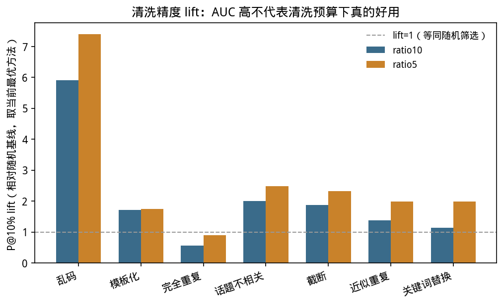
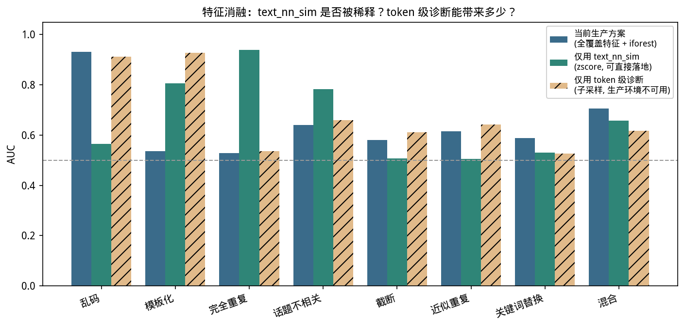
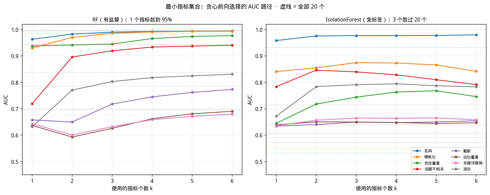
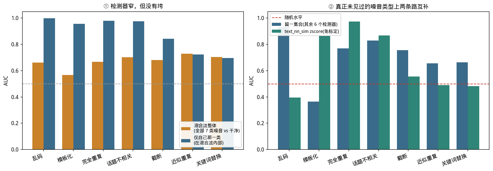
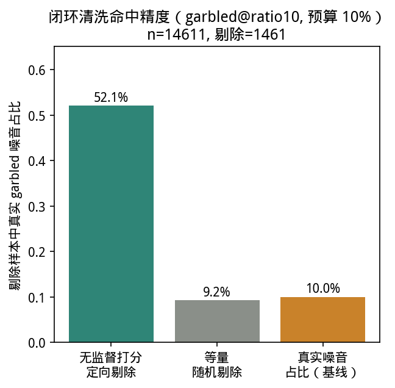
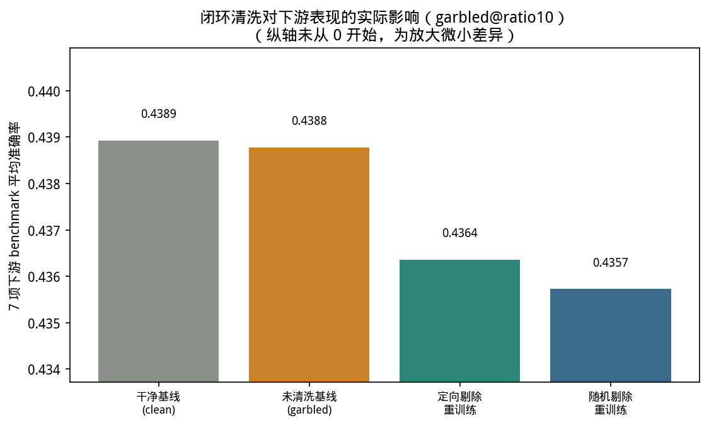
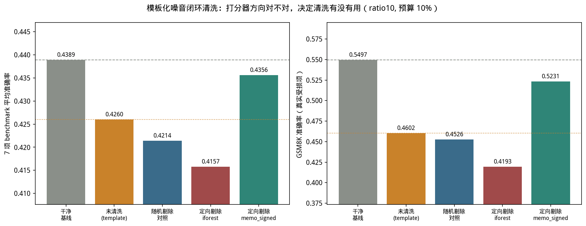

## 6c. 能否免标签分离噪音样本:精度、边界与真实收益

本文件对应报告三条主线中的**主线 3**:在已知每种噪音的指标特征([06b-feature-signatures.md](06b-feature-signatures.md))之后,问最终落地的问题——**能不能不看标签就把噪音样本挑出来,挑得多准,挑出来剔除之后训练是否真的变好**。原编号保持不变(6.5、6.10、6.11.2-6.11.3、6.11.5-6.11.6、6.12.1-6.12.5、6.13.1-6.13.3、6.16),完整小节对照表见 [06-results.md](06-results.md)。

**与第 5.3 节理论预期的关系**:第 5.3 节指出免标签设定下存在一个结构性困难——A 类噪音需要"找离群"的打分器,B 类噪音需要"找超典型"的打分器,而要在两者之间选择必须先知道噪音属于哪一类,这恰恰是免标签设定不允许知道的。这个困难贯穿本文件全部小节:6.5/6.10 节展示"已知类型时该怎么选";6.11 节的消融回答"选定方法后,原始数据还有没有精简空间";6.12 节直面"类型未知时"的边界;6.13/6.16 节验证"选对/选错之后,清洗动作本身是否真的划得来"。

---

### 6.5 清洗精度 lift:AUC 高不代表清洗预算下真的好用

AUC 衡量的是"整体排序能力",但实际清洗时只能剔除一小部分(比如 top 10%)样本,这时候更重要的指标是 **P@10% lift**(在剔除的 top 10% 里,真实噪音样本命中率相对随机剔除的倍数)。

**精确计算方式**(`analyze.py::precision_at_k`/`precision_lift_table`):设某数据集样本量为 n,`k = round(0.10 * n)`;把全部样本按异常分数降序排序,取分数最高的 k 个,`p_at_10` = 这 k 个样本中真实噪音样本的比例;`random_p` = 该数据集里真实噪音样本的整体占比(即"闭眼随机剔除"的期望命中率);`lift = p_at_10 / random_p`。三种候选的无标签异常打分方式:

- `zscore_max` / `zscore_mean`:对每个特征算稳健 z 分数 `(x - median) / (1.4826 * MAD)`(MAD 为中位绝对偏差),取各特征绝对值的**最大值**或**平均值**作为该样本的异常分数。
- `iforest`:`StandardScaler` 标准化后单独对每个数据集拟合一个 `IsolationForest(n_estimators=300)`(不同数据集之间不共享模型、不池化数据),用负的 `score_samples`(值越大越像异常点)作为分数。

下表是 `dolly-ratio10` 全部数据集 × 全部 3 种方法的完整原始结果(对应主表只展示了每个数据集里 lift 最高的那一行,容易掩盖"同一数据集换个方法、结论可能完全不同"这个事实):

| 数据集 | 方法 | n | n_noise | AUC | P@10% | random_p | lift |
|---|---|---|---|---|---|---|---|
| garbled | iforest | 904 | 85 | 0.936 | 0.556 | 0.094 | **5.91** |
| garbled | zscore_mean | 904 | 85 | 0.873 | 0.311 | 0.094 | 3.31 |
| garbled | zscore_max | 904 | 85 | 0.664 | 0.089 | 0.094 | 0.95 |
| mixed | iforest | 919 | 92 | 0.662 | 0.228 | 0.100 | **2.28** |
| mixed | zscore_mean | 919 | 92 | 0.633 | 0.174 | 0.100 | 1.74 |
| mixed | zscore_max | 919 | 92 | 0.604 | 0.054 | 0.100 | 0.54 |
| unrelated | iforest | 904 | 85 | 0.703 | 0.189 | 0.094 | **2.01** |
| unrelated | zscore_mean | 904 | 85 | 0.596 | 0.167 | 0.094 | 1.77 |
| unrelated | zscore_max | 904 | 85 | 0.604 | 0.111 | 0.094 | 1.18 |
| truncation | zscore_max | 905 | 86 | 0.657 | 0.178 | 0.095 | **1.87** |
| truncation | zscore_mean | 905 | 86 | 0.610 | 0.144 | 0.095 | 1.52 |
| truncation | iforest | 905 | 86 | 0.598 | 0.156 | 0.095 | 1.64 |
| template | zscore_mean | 906 | 87 | 0.803 | 0.165 | 0.096 | **1.72** |
| template | iforest | 906 | 87 | 0.522 | 0.066 | 0.096 | 0.69 |
| template | zscore_max | 906 | 87 | 0.878 | 0.022 | 0.096 | 0.23 |
| near_duplicate | iforest | 906 | 87 | 0.599 | 0.132 | 0.096 | **1.37** |
| near_duplicate | zscore_max | 906 | 87 | 0.507 | 0.121 | 0.096 | 1.26 |
| near_duplicate | zscore_mean | 906 | 87 | 0.549 | 0.110 | 0.096 | 1.14 |
| keyword | zscore_max | 906 | 87 | 0.520 | 0.110 | 0.096 | **1.14** |
| keyword | zscore_mean | 906 | 87 | 0.525 | 0.110 | 0.096 | 1.14 |
| keyword | iforest | 906 | 87 | 0.552 | 0.099 | 0.096 | 1.03 |
| duplicate | zscore_mean | 995 | 89 | 0.542 | 0.050 | 0.089 | **0.56** |
| duplicate | iforest | 995 | 89 | 0.612 | 0.050 | 0.089 | 0.56 |
| duplicate | zscore_max | 995 | 89 | 0.604 | 0.040 | 0.089 | 0.45 |

(加粗为该数据集在主表中展示的"最优方法";`n`/`n_noise` 与 [06b-feature-signatures.md](06b-feature-signatures.md) 第 6.2 节一致,因为无监督打分同样只在 37 个特征全非空的诊断子采样上计算。)从这张全量表能看出两个主表看不到的细节:**乱码在三种方法之间的差距极大**(iforest 5.91x vs zscore_max 0.95x,同一个数据集换个打分方式,从"很有用"变成"不如随机");**模板化的 zscore_max 方法(0.23x)反而是全表最差的组合之一**,尽管该数据集换成 zscore_mean 方法后 lift 能到 1.72x——说明"选对方法"和"选对数据集"同样重要。

| 噪音类型 | dolly-ratio10 最优方法 lift | dolly-ratio5 最优方法 lift |
|---|---|---|
| 乱码 | 5.91(iforest) | 7.40(iforest) |
| 混合 | 2.28(iforest) | 2.96(iforest) |
| 话题不相关 | 2.01(iforest) | 2.49(iforest) |
| 截断 | 1.87(zscore_max) | 2.32(zscore_max) |
| 模板化 | 1.72(zscore_mean) | 1.74(zscore_mean) |
| 近似重复 | 1.37(iforest) | 1.99(zscore_mean) |
| 关键词替换 | 1.14(zscore_max) | 1.99(zscore_max) |
| **完全重复** | **0.56(zscore_mean)** | **0.89(zscore_max)** |

**关键警示**:**完全重复**这一类噪音,尽管域内 AUC 高达 0.986([06b-feature-signatures.md](06b-feature-signatures.md) 第 6.2 节),P@10% lift 却低于 1(dolly-ratio10 仅 0.56x,dolly-ratio5 仅 0.89x)——也就是说,如果按这个检测器的打分剔除 top 10%,命中的真实噪音比例反而**不如随机瞎剔除**。这是因为重复样本的分数分布可能高度聚集在某个区间之外的位置,AUC 这种全局排序指标掩盖了"预算受限"场景下的局部失效。

**方法论意义**:AUC 排方法和 P@10% lift 排方法会给出不同的"最优清洗方法"结论——用 AUC 单一指标来选择清洗策略是有偏的,任何声称"可以用于自动清洗"的检测方法都应该同时汇报清洗预算下的精度指标,而不只是 AUC。

---

### 6.10 各噪音类型:目前最佳筛选方法一览

前面几节分别讨论过每种噪音的检测难度、特征归因、方向反转等问题(详见 [06b-feature-signatures.md](06b-feature-signatures.md)),但没有把"对每种类型该用什么方法、这个方法依赖哪些原始数据、这些数据是否都必要"整理在一起。本节汇总现状,第 6.11 节用一次消融实验把"是否必要"的判断从定性归因升级为定量证据。

**混合噪音一行与其余各行的性质不同**:其余 7 行都假设噪音类型已知、方法已按该类型校准,mixed 一行则是"成分未知"的情形,第 6.12 节专门讨论这种情形下方法的边界,6.12.5 节给出三路并联打分器的实测代价。

需要先说明一个前提性的口径差异:第 6.2-6.9 节报的 AUC(`unsupervised.csv`/`memorization.csv`/`feature_attribution.csv`)都在**诊断子采样表**(每数据集约 900-1200 行,12.5% 采样)上计算,可以用到全部特征,包括 token 级诊断和 `cos_global_*`;而免标签闭环清洗(第 6.13 节)的 `cleaning_loop.py` 要在**全量训练集**(14611+ 行)上打分剔除,token 级诊断和 `cos_global_*` 覆盖率不到 100%,只能用 19 个全覆盖特征(16.1 与 8.3 节)。两者不总是一致——garbled/template 恰好全覆盖特征就够用,报告 AUC 和生产精度基本吃得上;但 near_duplicate/keyword 的可用信号很大一部分落在 token 诊断里,报告 AUC 比生产环境实际能达到的效果更好看。

| 噪音类型 | 免标签最佳方法(AUC,全量训练集口径) | 有监督上限(RF within-type AUC,仅供参考天花板) | 主要依赖的原始数据类别 | 必要性结论 |
|---|---|---|---|---|
| garbled | iforest + 全覆盖特征,0.932 | 0.998 | 全覆盖训练轨迹特征(`loss_curvature`/`loss_rank` 等) | 轨迹特征已足够,`text_nn_sim` 和 token 诊断都不必要(6.11 节消融:去掉/加入均无明显变化) |
| template | **必须用 memo_signed**,0.925(iforest 只有 0.551,几乎等于随机) | 0.999 | memo_signed 的 6 个带符号轨迹特征;但 6.11 节消融显示单用 `text_nn_sim` 也能到 0.805 | 轨迹特征(带符号)是当前生产环境下的必要且够用的方案;`text_nn_sim` 是独立的第二信号来源,非必要但可作为交叉验证 |
| duplicate | iforest + 全覆盖特征,0.533(**弱**,且被稀释) | 0.986 | 理论上 `text_nn_sim` 单一特征即可 | **当前生产方案不是最优**——6.11 节消融显示仅用 `text_nn_sim`(zscore)可达 0.938,比现在混合 19 特征的 iforest 高 0.41,其余特征基本是稀释项 |
| unrelated | iforest + 全覆盖特征,0.639 | 0.925 | `text_nn_sim` 为主,轨迹特征有实质贡献 | 部分冗余——单用 `text_nn_sim` 可达 0.783(6.11 节),已超过当前混合方案,但轨迹特征仍有增量贡献,不能像 duplicate 一样直接简化成单特征 |
| truncation | zscore_max/iforest + 全覆盖特征,0.58 附近 | 0.763(上限本身不高) | 全覆盖轨迹特征 + token 诊断各贡献一部分,无单一强特征 | 无冗余可删,现有类别都用上了效果依然有限,是检测本身弱,不是特征选择的问题 |
| near_duplicate | iforest + 全覆盖特征,0.614(弱) | 0.674(同样偏低) | token 级诊断信号最强(0.641),但生产环境拿不到;全覆盖特征里 `text_nn_sim` 几乎不贡献 | **数据类别覆盖不足**——真正管用的信号在只覆盖 12.5% 样本的 token 诊断里,现有全量数据对这类噪音已接近能力上限 |
| keyword | iforest/zscore + 全覆盖特征,0.55-0.59(接近随机) | 0.577(上限本身就低) | 各类别贡献都很弱(6.11 节:`text_nn_sim`、全覆盖轨迹、token 诊断三者都在 0.50-0.59 之间) | **不是挑错了方法,是现有全部原始数据类别都不够**——1-2 个词替换对 TF-IDF 向量和训练轨迹几乎不产生扰动,需要全新的词级替换检测特征 |
| mixed | **`pooled` 三路并联,0.728**(P@10% 0.321,`iforest` 单用 0.714/0.270) | 无归因/组内分析数据(`feature_attribution.csv`/`cross_type.csv` 均无 mixed 行) | 三类原始数据都要:全覆盖轨迹(离群侧)+ 带符号轨迹(记忆侧)+ `text_nn_sim`(静态文本侧) | 6.12.5 节实测:并联比任何单方法精度高,代价是剔除预算被 duplicate/garbled 占据;这是"成分未知"时的推荐方案,不是精度最优方案 |

---

### 6.11 特征消融实验:哪些数据必要,哪个指标不可替代?

指标间的相关性分析(19 个全覆盖指标只张开约 5 个有效维度)已在 [06b-feature-signatures.md](06b-feature-signatures.md) 第 6.11.1 节完成,单指标留一消融(`text_nn_sim` 是唯一不可替代的指标)已在同一文件第 6.11.4 节完成。本节接续这两节的结论,回答"哪类原始数据值得采集""能不能把特征收窄到最小集合"两个直接指向落地决策的问题。

#### 6.11.2 动机与设计

第 6.10 节的"必要性结论"里有两处判断目前只有归因重要度排序([06b-feature-signatures.md](06b-feature-signatures.md) 第 6.8 节)作支撑,不是定量证据:duplicate/unrelated 的检测信号是否真的被无关特征"稀释"了?near_duplicate/keyword 加上(生产环境拿不到的)token 级诊断能带来多大提升、值不值得改造采集流程去覆盖全量?

这两个问题都可以在**不重新训练**的前提下回答:诊断子采样表(`results/dolly-ratio10/per_sample_metrics.csv`)里已经同时包含全覆盖轨迹特征、`text_nn_sim`、token 级诊断三类原始数据(各自覆盖率不同,但重合的 900-1200 行子采样人群是同一批样本),只需要用 `analyze.py::unsupervised_metrics()` 换不同的 `features=` 子集重新打分即可,CPU 上几秒跑完全部数据集。脚本见 `analyze.py::feature_group_ablation()`,输出 `results/dolly-ratio10/feature_ablation.csv`。

五个消融条件:

| 条件 | 特征范围 | 是否是 `cleaning_loop.py` 当前能用的 |
|---|---|---|
| `full_diag` | 全部数值列(含 token 诊断、`cos_global_*`) | 否——这就是第 6.2-6.9 节引用的 `unsupervised.csv` 原始结果 |
| `full_coverage` | 19 个全覆盖特征(16.1 与 8.3 节,`cleaning_loop.py` 生产环境实际用的特征集) | **是,当前生产方案** |
| `no_text` | `full_coverage` 去掉 `text_nn_sim`(19 个) | 是 |
| `text_only` | 只有 `text_nn_sim` | 是 |
| `token_only` | 只有 token 级诊断(13 个特征,仅 12.5% 子采样覆盖) | **否**——生产环境拿不到,这里只是量化"如果能拿到会值多少" |

#### 6.11.3 结果

(图中数值为各条件下 zscore_max/zscore_mean/iforest 三种打分方式里的最优 AUC;`full_coverage` 就是当前生产方案,`text_only`/`token_only` 是两个对照组,后者用斜线标记以强调"生产环境不可用,仅供参考"。)

三点定量结论:

1. **duplicate、unrelated 的当前生产方案确实被稀释了**。duplicate 单用 `text_nn_sim`(zscore)AUC 达 0.938,比当前混合 19 特征的 iforest(0.528)高 0.41;unrelated 单用 `text_nn_sim` 达 0.783,比当前方案(0.641)高 0.14。这不是归因排序的推测,是直接对照——把其余 18 个弱特征混进同一个无监督评分器,反而拖累了 `text_nn_sim` 本身已经很强的信号。`no_text` 条件(duplicate 0.564、unrelated 0.571)进一步印证:去掉 `text_nn_sim` 之后剩下的轨迹特征本身就很弱,说明"稀释"确实是当前生产方案的问题,而不是轨迹特征另有隐藏价值。
2. **template 的高可检测性是两个独立信号叠加的结果,不止是记忆性**。单用 `text_nn_sim` 对 template 也能打到 0.805 AUC——模板化噪音本身会大量复用固定模板,天然造成文本层面的高相似度,这是和"记忆性/收敛异常快"(memo_signed 覆盖的信号)完全独立的第二条线索。当前 memo_signed 方案(0.925)已经足够好,这一发现更多是解释"为什么 template 这么容易检测",而非提出新的改进方向。
3. **near_duplicate、keyword 是真正的方法论盲区,不是打分方式选错了**。near_duplicate 即使把生产环境拿不到的 token 级诊断也加进来,AUC 也只到 0.641;keyword 三个条件全部落在 0.50-0.59 之间,`text_nn_sim`(0.531)和 token 诊断(0.514)表现相近且都很弱。这说明现有全部原始数据类别,对这两类"轻度局部扰动"噪音都不够,不是换一种组合方式能解决的,需要专门设计新特征(例如逐 token 的局部替换检测,而非整段文本或整条训练轨迹的统计量)。

#### 6.11.5 最小指标集合:免标签路线上 3 个指标胜过全部 19 个

[06b-feature-signatures.md](06b-feature-signatures.md) 第 6.11.4 节的留一消融回答的是"删掉某一个会怎样",这对**决定采集什么**其实是错的问题——高度相关的特征可以每个都单独可删、而整组不可删,19 个"单独看都没用"的特征完全可能是联合必要的。要回答"最少需要哪几个",必须反过来做:从零开始,每步贪心地加入能让 AUC 涨最多的那个特征,记录整条路径。第 k 个点就是"用 k 个指标能达到的最好成绩"。脚本见 `analyze.py::minimal_feature_set()`,输出 `results/dolly-ratio10/minimal_feature_set.csv`。

**先说口径**:贪心选择用的是它自己被评分的那批标签,所以给定 k 的 AUC 是**乐观的**。这衡量的是"小特征集最多能承载多少信号",不是一个免标签的选特征配方——第 3.1 节明确禁止用标签挑特征。诚实的读法是"如果你已经知道噪音类型,这是采集成本的下限"。IF 一列报 `auc_dir = max(auc, 1-auc)`,因为免标签离群分数掉到 0.02 不是没用而是方向反了(6.6 节)。

**结论一(本节最重要):免标签路线上,3 个指标全面优于全部 19 个——8 个数据集无一例外,平均高出 0.132。**

| 数据集 | IF 用 3 个指标 | IF 用全部 19 个 | 差值 |
|---|---|---|---|
| template | **0.875** | 0.551 | **+0.324** |
| duplicate | **0.744** | 0.533 | **+0.211** |
| unrelated | **0.840** | 0.639 | **+0.201** |
| truncation | 0.650 | 0.573 | +0.077 |
| mixed | **0.791** | 0.714 | **+0.077** |
| keyword | 0.665 | 0.590 | +0.075 |
| garbled | **0.977** | 0.932 | +0.045 |
| near_duplicate | 0.650 | 0.607 | +0.043 |

这不是边际改进,而是**当前生产方案(19 个全覆盖特征喂给 IsolationForest)系统性地在自我拖累**。template 从接近随机的 0.551 跳到 0.875,duplicate 从 0.533 跳到 0.744——这两个恰好是 [06b-feature-signatures.md](06b-feature-signatures.md) 第 6.6 节方向反转最严重的类型,说明"方向反转"的一部分其实是**维度稀释**:无关维度把离群距离摊平,真正承载信号的那两三维被淹没了。第 6.11.4 节测到"删掉单个指标常让 IF 变好",这里给出了它的上限形态。

**结论二:RF 路线上 1 个指标就够到 95%,但要榨到 99% 需要 3-6 个。**

| 数据集 | 全部 19 个 | 达到 95% 需要 | 达到 99% 需要 |
|---|---|---|---|
| garbled | 0.996 | 1 | 3 |
| duplicate | 0.984 | 1 | 6 |
| template | 0.994 | 2 | 3 |
| unrelated | 0.944 | 3 | 5 |
| keyword | 0.676 | 1 | 5 |
| mixed | 0.838 | 3 | 6 |
| near_duplicate | 0.696 | 4 | 6 |
| truncation | 0.787 | 5 | 未达到 |

有标签时特征之间高度可替代,所以头一两个就能吃掉大部分信号;剩下那 1-5 个点要靠更多维度慢慢补。truncation 到 k=6 仍未达到 99%,是唯一需要较宽特征面的类型。

**结论三:被选中的第一个指标暴露了每类噪音的机制,且两条路线的选择不同。**

| 数据集 | RF 首选 | IF 首选 |
|---|---|---|
| duplicate | `text_nn_sim` | `grad_norm_cv` |
| unrelated | `text_nn_sim` | `text_nn_sim` |
| garbled / template / mixed | `loss_curvature` | `loss_curvature` / `loss_min` / `loss_curvature` |
| keyword / near_duplicate | `converge_epoch` | `converge_epoch` |
| truncation | `converge_epoch` | `loss_slope` |

`loss_slope` 在 8 个数据集的 k=3 集合里出现 5 次,是最通用的单一指标;`text_nn_sim` 和 `converge_epoch` 各 3 次。duplicate 上两条路线分歧最大——RF 直接抓 `text_nn_sim`(有标签,知道该看"跟别人像不像"),IF 却先选 `grad_norm_cv`,因为免标签时它不知道"相似"是可疑方向,只能从梯度波动里找异常。

**落地含意**:如果噪音类型已知且已校准,免标签打分**应该只用 2-3 个指标而不是 19 个**,精度更高、采集也更省。但"该用哪 3 个"依赖噪音类型(上表每行都不同),而类型未知恰恰是免标签场景的前提——这又回到第 5.3 节那个结构性困难。`pooled` 打分器目前仍喂 19 个全覆盖特征给它的 iforest 那条腿,本节说明这条腿有 0.04-0.32 的改进空间未被利用,是一个明确的后续方向(7.3 节)。

#### 6.11.6 落地建议

- **优先级高、成本低**:给 `cleaning_loop.py` 增加第三个 `method` 选项(如 `text_sim`),对 duplicate/unrelated 直接用 `text_nn_sim` 的 zscore 打分,预期剔除精度有实质提升,且 `text_nn_sim` 已经是全覆盖特征,不需要新增数据采集。(**已部分落地**:6.12.5 节加入的 `pooled` 已把 `text_nn_sim` 的 |z| 作为独立一条腿并联进去,`mixed` 上 duplicate 的逐类型 AUC 达 0.946、召回 97.4%;但 `pooled` 是面向"成分未知"的方案,单类型已校准的场景仍值得一个只用 `text_nn_sim` 的纯净选项,精度更高。)
- **优先级高**:把 `iforest` 那条腿从 19 个特征收窄到 2-3 个(6.11.5 节),这是唯一一个"不需要新数据、不需要新方法、只需要少喂特征"就能拿到 0.04-0.34 提升的改动。
- **不建议现在投入**:near_duplicate/keyword 的改进需要新特征而非新打分方式,属于更大的开发工作,先在报告里明确记录为已知局限(已并入 7.2 节),等有明确的下游收益证据(类似 [06a-harm-ranking.md](06a-harm-ranking.md) 对 template 的验证)后再决定是否投入。

---

### 6.12 方法在未知噪音下的边界

前面各节都建立在一个前提上:噪音类型是已知的,每一类都有对应的注入数据集和训练好的检测器。生产环境不给这个前提。真实脏数据是多种噪音混在一起的,而且大概率包含我们这 7 类之外的东西。这一节回答两个问题:**已有检测器碰到混合流会怎样?碰到完全没见过的噪音类型会怎样?**

#### 6.12.1 为什么第 6.3 节的迁移矩阵回答不了这个问题

[06b-feature-signatures.md](06b-feature-signatures.md) 第 6.3 节的 7×7 跨类型迁移矩阵在代码层面显式跳过了 `mixed` 数据集(`analyze.py` 里 `if ds in ('clean', 'mixed'): continue`)。它回答的是"在类型 A 上训的检测器能不能找到类型 B",每次测试面对的仍然是**单一**噪音类型、干净样本占 90% 的干净分布。生产环境是"一条流里同时有 7 种噪音,其中 6 种没见过"——分布本身变了。

补充实验(`analyze.py::transfer_to_mixed()`,输出 `results/dolly-ratio10/transfer_to_mixed.csv`)把 7 个单类型检测器全部拉到 `mixed` 数据集上评估。协议与第 6.3 节完全一致(LR + RF 各训一个,`StandardScaler` 只在源域 `fit`,取两者 AUC 较高者)。`mixed` 共 14819 行,其中 13419 行干净、1400 行噪音,且每行都带 `noise_type` 标签(near_duplicate 211、template 206、truncation 204、keyword 197、unrelated 197、garbled 194、duplicate 191),因此可以在混合流内部按类型切片。

两个口径分别报:`full_coverage`(19 个全覆盖特征,14819 行全量,等于 `cleaning_loop.py` 在生产里真能算的东西)和 `full_diag`(37 个特征、约 919 行诊断子样本,与报告前面各节的口径一致)。以下正文用 `full_coverage`。

#### 6.12.2 结论一:检测器是"窄",不是"垮"

| 检测器 | 混合流整体 AUC | 整体 P@10% | 仅自己那一类 AUC | 域内 AUC(第 6.2 节) | 保持率 |
|---|---|---|---|---|---|
| near_duplicate | 0.730 | 0.297 | 0.726 | 0.674 | 1.08 |
| keyword | 0.713 | 0.310 | 0.711 | 0.577 | 1.23 |
| unrelated | 0.701 | 0.367 | 0.974 | 0.925 | 1.05 |
| truncation | 0.688 | 0.248 | 0.848 | 0.763 | 1.11 |
| duplicate | 0.668 | 0.256 | 0.980 | 0.986 | 0.99 |
| garbled | 0.662 | 0.298 | 0.998 | 0.998 | 1.00 |
| template | 0.563 | 0.187 | 0.960 | 0.999 | 0.96 |

(随机基线:整体 P@10% = 0.094,单类型切片 P@10% ≈ 0.015)

整体口径全线掉到 0.563–0.730,看着像检测器在混合流里失效了。但把评估限制在"自己那一类 vs 干净"之后,AUC 回到 0.711–0.998,**保持率 0.96–1.23,没有一个类型出现实质性衰减**。这两组数字合起来只能有一个解释:AUC 下降不是因为分布变了导致检测器失灵,而是因为分母里 6/7 的噪音是它压根没被训练去找的东西。检测器仍然精确地做它会做的那件事,只是那件事只覆盖混合流里 14% 的噪音。

顺带一个反直觉的细节:keyword 和 near_duplicate 的保持率是 1.23 和 1.08,即它们在混合流里比在自己的专属数据集里**表现更好**。原因是 `mixed` 的干净背景样本量大得多(13600 行 vs 单类型数据集的约 1300 行),AUC 作为排序指标在大样本上更稳定,域内 5-fold CV 那 0.577 的低分部分是小样本方差贡献的。这不改变"keyword 最难检测"的定性结论,但说明 [06b-feature-signatures.md](06b-feature-signatures.md) 第 6.2 节的绝对数值在最难的两类上偏保守。

#### 6.12.3 结论二:多检测器并联能救整体,但救不了未见过的类型

把 7 个检测器的分数各自 zscore 标准化后取逐样本最大值(`ensemble_all7`):

| 方案 | 混合流整体 AUC | P@10% |
|---|---|---|
| 7 检测器并联取最大 | **0.837** | **0.467** |
| 最好的单检测器(near_duplicate) | 0.730 | 0.297 |
| `text_nn_sim` zscore(免标定) | 0.660 | 0.255 |
| 随机 | 0.500 | 0.094 |

并联把 P@10% 从 0.297 推到 0.467——在 10% 清洗预算下每剔除 100 条有 47 条真是噪音,相对随机的 lift 接近 5 倍。但这个数字**不是生产可达的**:它假设混合流里出现的每一类噪音都已经被识别过、都有一个训好的检测器。这正是生产环境不成立的前提,所以 0.837 应当读作上界,不是方案。

要问真正的问题,得做留一法:对每个目标类型,只用**其余 6 个**检测器并联,然后只在"该类型 vs 干净"的切片上评估。此时目标类型对池子里的每一个检测器都是彻底陌生的。

| 未见过的类型 | 留一集合 AUC | 留一集合 P@10% | `text_nn_sim` AUC | `text_nn_sim` P@10% |
|---|---|---|---|---|
| garbled | **0.935** | 0.112 | 0.396 | 0.002 |
| unrelated | 0.826 | 0.059 | **0.869** | 0.087 |
| duplicate | 0.769 | 0.036 | **0.974** | 0.137 |
| truncation | **0.747** | 0.048 | 0.555 | 0.015 |
| near_duplicate | **0.670** | 0.029 | 0.490 | 0.012 |
| keyword | **0.668** | 0.040 | 0.482 | 0.018 |
| template | 0.416 | 0.008 | **0.866** | 0.049 |

(随机基线 AUC = 0.5,P@10% ≈ 0.015;每行加粗的是两者中较优的那个)

三件事值得注意。

**第一,未见过的类型平均仍然可检,但方差极大。** 留一集合的 7 个值从 0.416 到 0.935,中位数 0.747。"训练动态里有跨类型共享的噪音信号"这个判断是成立的,但"某个具体的未知类型能被现成检测器捞到"完全不可预测。

**第二,template 在留一法下掉到 0.416,低于随机。** 这是 [06b-feature-signatures.md](06b-feature-signatures.md) 第 6.6 节方向反转陷阱的直接实例,而且是它在未知类型上最危险的一种形态。模板化样本高度典型、被模型快速记住,loss 低、收敛快;其余 6 个检测器学到的都是"噪音 = loss 高、收敛慢、梯度不稳",于是把模板化样本排到了**最干净的一端**。低于随机意味着按这个分数清洗会**优先保留**模板化噪音——比检测不到更糟。反过来,`text_nn_sim` 在同一切片上是 0.866,因为模板化样本在文本层面与近邻高度相似,静态指标抓得住。

**第三,两条路线是互补的,不是可替换的。** 留一集合赢的 4 类(garbled 0.935/0.396、truncation 0.747/0.555、near_duplicate 0.670/0.490、keyword 0.668/0.482)恰好是 `text_nn_sim` 低于或接近随机的地方——乱码在字符层面完全不像自然语言,但它的 embedding 近邻相似度并不异常,训练动态却立刻暴露它。反之 `text_nn_sim` 赢的 3 类(duplicate 0.974、unrelated 0.869、template 0.866)都是"文本本身就可疑"的类型。两者取逐类型较优,7 类的 AUC 是 0.935/0.866/0.974/0.747/0.869/0.670/0.668,全部高于 0.66,没有一类低于随机。

#### 6.12.4 落地建议

碰到未知噪音时,可执行的做法按成本递增排列:

1. **两条腿都要有,且并联而非择一。** 训练动态检测器池 + `text_nn_sim` zscore 同时打分,取较高者。这是上表唯一能消掉"低于随机"格子的组合,成本几乎为零(`text_nn_sim` 已是全覆盖特征,不需要新采集)。6.12.5 节把这条建议接进了 `cleaning_loop.py`,并给出免标签版本的实测代价——精度确有提升,但"消掉所有低于随机格子"这一点在免标签条件下没有完整复现。
2. **给方向反转留一道闸。** 单向假设"噪音 = loss 高"在未知类型上有明确的翻车案例(template 0.416)。[06b-feature-signatures.md](06b-feature-signatures.md) 第 6.6 节的 `memo_signed` 做的就是双向打分,把"异常地容易学"也当成可疑信号。用在未知噪音上时,应当默认开双向,宁可多召回后人工看,不要单向排序直接剔除。
3. **不要相信单个检测器的整体 AUC。** 上表第一列 0.563–0.730 这个区间会让人误判"检测器还行,只是不够好",真相是它只覆盖 14% 的噪音而在这 14% 上接近完美。评估异构流时必须按类型切片,否则既看不出覆盖缺口在哪,也会把"窄"误诊成"垮"。
4. **发现新类型后的增量成本很低。** 一旦某类未知噪音被人工识别出来,为它注入一批样本、训一个专属检测器就把它从 0.416/0.670 这一档拉到 0.96–1.00 那一档(6.12.2 节的"仅自己那一类"列)。整个流程不需要重训基座,只需要一次带指标落盘的 LoRA 微调(约 1.5 小时,见 8.5 节),因此"持续发现 + 增量补检测器"是比"追求一个通用检测器"更现实的路线。

一个尚未验证的局限:本节的"未见过的类型"仍然是我们自己注入的 7 类之一,只是对检测器池而言未见过。真正的野生噪音(用户误粘贴、编码错误、跨语言混入、机翻痕迹等)在文本分布和训练动态上都可能与这 7 类不同,留一法的 0.416–0.935 这个区间不能直接外推过去。这一点已并入 7.2 节的局限性清单。

#### 6.12.5 把建议接进生产代码:`pooled` 打分器

6.12.4 节第 1 条建议已经落进 `cleaning_loop.py`,作为第三个 `method` 选项 `pooled`。它把三条腿各自标准化后取逐样本最大值:

- `iforest` z-score——无方向的离群侧,19 个全覆盖特征;
- `memo_signed` z-score——固定符号的"异常地容易学"侧,6 个特征(是上面 19 个的子集);
- `text_nn_sim` 的 **|z|**——静态文本侧。这条腿取绝对值而非单向:`text_nn_sim` 高意味着"与近邻几乎相同"(完全重复、模板化),低意味着"与任何样本都不像"(乱码、话题不相关),两端都可疑。另两条腿是单向的。

取最大而非取均值,因为每条腿在它看不见的类型上是沉默的(分数接近 0),求均值会让两条沉默的腿把唯一报警的那条稀释掉。

**注意口径差异**:6.12.3 节的留一法用的是**有监督**检测器(在其他类型的噪音标签上训过 LR/RF),衡量的是"已有检测器碰到新类型";这里的三条腿全部**免标签**,衡量的是"手上只有一堆无标签的脏数据时能做到什么"。两者数字不可直接比较,但结论指向同一个方向。

在 `mixed` 上按 10% 预算实测(`analyze.py::pooled_scorer_compare()`,输出 `results/dolly-ratio10/pooled_scorer_compare.csv`):

| 打分器 | 整体 AUC | 剔除精度 P@10% | 相对随机 lift | 逐类型低于随机的格子数 |
|---|---|---|---|---|
| `pooled` | **0.728** | **0.321** | **3.81×** | **0** |
| `iforest` | 0.714 | 0.270 | 3.20× | **0** |
| `text_nn_sim` \|z\| 单用 | 0.636 | 0.255 | 3.02× | 2 |
| `memo_signed` | 0.380 | 0.128 | 1.52× | 5 |
| 随机 | 0.500 | 0.084 | 1.00× | — |

(lift 的分母是**实际随机剔除**那 1482 条里的真实噪音占比 8.43%,取自 `metadata.json` 的 `random_precision`,与 6.13.3 节口径一致。若改用全量理论噪音率 9.45% 作分母,四个 lift 分别是 3.40×／2.86×／2.70×／1.36×——排序不变,绝对值略低。)

逐类型 AUC(该类型 vs 干净):

| 类型 | `iforest` | `memo_signed` | `text_nn_sim` \|z\| | `pooled` |
|---|---|---|---|---|
| duplicate | 0.689 | 0.651 | **0.967** | 0.946 |
| garbled | **0.972** | 0.008 | 0.513 | 0.935 |
| unrelated | 0.743 | 0.230 | 0.809 | **0.842** |
| template | 0.657 | **0.866** | 0.736 | 0.818 |
| keyword | **0.641** | 0.319 | 0.513 | 0.548 |
| truncation | **0.685** | 0.255 | 0.472 | 0.526 |
| near_duplicate | **0.625** | 0.318 | 0.465 | 0.505 |

三个必须诚实讲清楚的点:

**第一,`pooled` 赢在精度,也在这一次重算里消掉了所有低于随机的格子。** 它把 P@10% 从 `iforest` 的 0.270 抬到 0.321(相对提升约 19%);逐类型上最弱的 near_duplicate 从(`iforest` 单用的)0.625 抬到 0.505,刚好压过 0.5 这条随机线,不再是"低于随机",但离真正可靠还很远——0.505 和随机基本没有区分度,只是没有像 `memo_signed` 那样反向排序。6.12.3 节留一法"并联能消掉所有低于随机格子"这个方向在这里成立,但代价是 near_duplicate 这一类实质上仍等于放弃检测,只是没有主动做反了。免标签的 `memo_signed` 腿本身在 5/7 的类型上低于随机(garbled 只有 0.008,它把乱码排到了最干净的一端),并联时这条腿贡献的噪声比有监督检测器池大得多。所以 `pooled` 应当读作"在未知噪音下用精度换取覆盖面",不是免费的改进。

**第二,`memo_signed` 单独用在混合流上是灾难性的(AUC 0.380,比随机差 0.12)。** 这不是 bug,是它的设计边界:固定符号规则只对被记忆的超典型噪音有效,混合流里 5/7 的类型是普通离群噪音,它会主动把它们**反向排序**。[06b-feature-signatures.md](06b-feature-signatures.md) 第 6.6 节说过这条规则在非记忆型噪音上 AUC 必然低于 0.5,这里是它在真实混合场景下的代价——单类型 template 上的 0.531 剔除精度(vs `iforest` 的 0.040)不能外推到混合流。

**第三,剔除预算会被最容易的类型吃掉。** 看剔除的 1482 条的类型构成:`pooled` 捞到了 186 条 duplicate(该类型 97.4% 全被剔除)和 141 条 garbled(72.7%),但 template 只捞到 14 条(6.8%),尽管 template 的逐类型 AUC 是 0.818。原因是预算有限而 duplicate 的分数普遍更高——**逐类型 AUC 好不等于在共享预算下捞得到**。这与第 6.5 节"AUC 高不代表清洗预算下真的好用"是同一个现象,在混合流里因为类型间要抢预算而更严重。

综合起来,生产建议是分层的:**噪音类型已知且已校准时用单方法**(template 用 `memo_signed`,garbled 用 `iforest`,duplicate/unrelated 直接用 `text_nn_sim`),精度明显更高;**噪音成分未知或混合时用 `pooled`**,它是目前在所有 7 类上都不至于主动反向排序的选项,但要接受精度上限约 0.32 且预算会被最显著的类型占据,near_duplicate 这类弱信号即便"不低于随机"也谈不上真正可用。`mixed` 的完整闭环重训(剔除后重新训练+评测下游)见下方 6.13.3 节。

---

### 6.13 免标签闭环清洗:从"能检测"到"清洗有效"

**这是本项目唯一一组从"打分排序"推进到"实际清洗动作"的实验,也是与前面各节性质不同的一步**:此前所有分析都只验证"能不能分辨噪音样本"(AUC/lift 数字),从未验证"清洗后重新训练是否真的变好"。本节包含三组闭环:6.13.1 在 garbled 上(检测最容易,但下游危害接近零,详见 [06a-harm-ranking.md](06a-harm-ranking.md)),6.13.2 在模板化上(检测容易且下游确有危害,并额外对比了打分器方向选错的代价),6.13.3 在混合噪音上(用 6.12.5 节的 `pooled` 打分器)。

#### 6.13.1 首次验证:garbled 噪音,高精度但零下游收益

本小节的实验用的是 `cleaning_loop.py` 的 `iforest` 打分器。它现在是三个选项之一(另两个是 `memo_signed` 和 6.12.5 节加入的 `pooled`),选它是因为 garbled 是典型的离群型噪音,`iforest` 的"噪音 = 离群"假设正好成立;[06b-feature-signatures.md](06b-feature-signatures.md) 第 6.6 节和上方 6.12.5 节说明了这个假设在记忆型噪音和混合流上分别怎么失效。

以 `garbled@dolly-ratio10`(全量 14,611 条训练样本,真实噪音占比 9.999%)为例,用纯无监督 IsolationForest(不看任何噪音标签,19 维基础轨迹特征+`text_nn_sim`,在全量数据上单独拟合)按 10% 预算打分剔除:

**方法与特征列表**(`cleaning_loop.py::build`):与 [06b-feature-signatures.md](06b-feature-signatures.md) 第 6.2.1 节"域内检测 AUC"用 37 特征、只在约 900-1000 条诊断子采样样本上计算不同,这里要在**全量训练集**上打分剔除(否则真实噪音样本大部分根本不在候选范围内,清洗没有意义),因此改用"在该数据集上取值全部非空"的特征子集,即排除全部 token 级诊断特征(子采样、大量缺失)和 `cos_global_*`(每个优化器 step 内与同窗口其他样本比较,数据结构上不便复用于单样本打分),只保留 19 个 100% 覆盖率的轨迹特征:

`text_nn_sim, loss_mean, loss_last, loss_std, loss_slope, loss_min, converge_epoch, loss_curvature, loss_rank, grad_norm_mean, grad_norm_last, grad_norm_std, grad_norm_slope, cos_ref_mean, cos_ref_last, cos_ref_std, cos_ref_slope, grad_norm_cv, update_contrib_mean`

具体流程:`StandardScaler` 标准化这 20 维特征后,`IsolationForest(n_estimators=300, random_state=42)` 在全量数据上拟合,取负的 `score_samples` 作为异常分数(不看任何噪音标签,纯粹按分数排序);按 10% 预算 `n_drop = round(0.10 * n)`,取分数最高的 `n_drop` 条样本作为"定向剔除"集合,另外用同一个随机种子独立随机抽取等量样本作为"随机剔除"对照组;分别统计两个剔除集合里真实 `noise_type != 'none'` 的样本占比,即为下面的"定向剔除精度"与"随机剔除精度"。

- **定向剔除精度:52.1%**(剔除的 1,461 条样本中,761 条确实是真实注入的 garbled 噪音)
- **随机剔除精度:9.2%**(与真实噪音占比 10.0% 基本吻合,符合预期)
- **提升倍数:约 5.7 倍**

**下游 benchmark 对比结果(重训练+评测已全部完成)**:用 `train_targeted`(定向剔除后)和 `train_random`(随机剔除对照)两个训练集分别重新训练,与未清洗基线(`eval_dolly-ratio10_garbled.json`)、干净基线(`eval_dolly-ratio10_clean.json`)做四方对比:

| 版本 | 7 项下游 benchmark 平均准确率 |
|---|---|
| 干净基线(clean) | 0.4389 |
| 未清洗基线(garbled) | 0.4388 |
| 定向剔除重训练 | 0.4364 |
| 随机剔除重训练 | 0.4357 |

**核心发现——清洗精度的 5.7 倍优势并没有转化为下游表现的可观测提升,两种重训练版本的下游平均分反而都略低于未清洗基线**:定向剔除(0.4364)确实比随机剔除(0.4357)略高,方向符合预期(更精准地剔除真实噪音应该比瞎剔除好),但两者都没有超过未清洗基线(0.4388),更没有达到干净基线(0.4389);这个差距(0.0007-0.0032)本身也落在 [06a-harm-ranking.md](06a-harm-ranking.md) 第 6.9 节已经观察到的"7 项 benchmark 平均值区间本身很窄(0.42-0.44)"的噪声范围内,不宜过度解读为有统计意义的下降。

真正的原因在 [06a-harm-ranking.md](06a-harm-ranking.md) 第 6.9 节里已经埋下伏笔:**`garbled` 噪音本身对下游任务的真实危害就接近于零**(未清洗基线 0.4388 vs 干净基线 0.4389,相差仅 0.0001)——之所以选它来做这次闭环清洗演示,是因为它是检测最容易的类型(AUC > 0.98),而不是因为它下游危害最大。当一种噪音类型"检测容易"但"下游本来就没什么真实危害"时,清洗掉它自然也就没有下游收益可言;而剔除 10% 训练样本(哪怕命中真实噪音的比例再高)本身也会让有效训练数据减少 10%,如果这个"数据量损失"的副作用略微超过"去噪收益",就会出现清洗后反而比不清洗还低一点点的现象——这正是这里观察到的 0.4388 → 0.4364/0.4357。

这个结果推翻了闭环清洗实验最初的隐含假设("检测/剔除精度越高 → 下游表现必然越好"),本身是一个有价值的负结果:**清洗是否有下游收益,取决于这种噪音类型本身是否真的会拖累下游表现,而不仅仅取决于检测/剔除精度有多高**。[06a-harm-ranking.md](06a-harm-ranking.md) 第 6.9 节已经识别出模板化才是那个"检测容易 + 确有下游危害"两个条件同时满足的类型(GSM8K 上相对干净基线下降 8.95 个百分点),所以下一小节把同一套闭环换到模板化上重跑。

#### 6.13.2 换到模板化噪音:清洗第一次拿到了正的下游收益

garbled 的负结果有两种可能的解释——要么是"清洗本身没用",要么是"选错了噪音类型"。区分这两者只能换一个下游确有危害的类型重跑。模板化是唯一符合条件的:[06a-harm-ranking.md](06a-harm-ranking.md) 第 6.9 节测出它在 GSM8K 上比干净基线低 8.95 个百分点,同时 [06b-feature-signatures.md](06b-feature-signatures.md) 第 6.2 节的有监督 AUC 高达 0.999,检测信号充足。

模板化同时还提供了一个 garbled 上无法做的对照:它是记忆型噪音,**两个打分器在它身上的方向恰好相反**([06b-feature-signatures.md](06b-feature-signatures.md) 第 6.6 节),所以可以在完全相同的预算、种子、训练配置下,直接比较"方向对的打分器"和"方向错的打分器":

| 剔除方式 | 打分器 | 特征数 | 定向剔除精度 | 随机对照精度 | 相对随机 |
|---|---|---|---|---|---|
| 随机剔除对照 | 无 | — | — | 9.24% | 1.00× |
| 定向剔除(方向错) | `iforest` | 19 | **4.04%** | 9.24% | **0.44×** |
| 定向剔除(方向对) | `memo_signed` | 6 | **53.11%** | 9.24% | **5.75×** |

`iforest` 在模板化上的 0.44× 不是"效果一般",而是**比闭着眼睛随机剔除还差一倍多**——它按"噪音 = 离群"排序,而模板化噪音恰恰是 loss 最低、收敛最快的那批样本,于是排序被系统性地反了,剔除动作优先保护了噪音、优先丢掉了干净样本。这就是 [06b-feature-signatures.md](06b-feature-signatures.md) 第 6.6 节方向反转陷阱在真实清洗动作上的代价。

`n_total = 14611`,`n_drop = 1461`(10% 预算),`n_keep = 13150`,`seed = 42`,三个训练集用完全相同的 LoRA 配置各训练 5 epoch。

**下游 benchmark 五方对比**(干净基线 / 未清洗 / 随机剔除 / iforest 定向剔除 / memo_signed 定向剔除):

| benchmark | n | 干净基线 | 未清洗 (template) | 随机剔除 | 定向剔除 `iforest` | 定向剔除 `memo_signed` | memo − 未清洗 | iforest − 未清洗 |
|---|---|---|---|---|---|---|---|---|
| mmlu | 14042 | 0.6332 | 0.6434 | 0.6349 | 0.6391 | 0.6374 | -0.0061 | -0.0043 |
| **gsm8k** | 1319 | **0.5497** | **0.4602** | 0.4526 | **0.4193** | **0.5231** | **+0.0629** | **-0.0409** |
| hellaswag | 10042 | 0.2770 | 0.2776 | 0.2773 | 0.2758 | 0.2765 | -0.0011 | -0.0018 |
| arc | 1172 | 0.8046 | 0.8157 | 0.8123 | 0.7961 | 0.8123 | -0.0034 | -0.0196 |
| bbh | 540 | 0.0926 | 0.0500 | 0.0611 | 0.0685 | 0.0685 | +0.0185 | +0.0185 |
| truthfulqa | 817 | 0.1787 | 0.1873 | 0.1775 | 0.1787 | 0.1860 | -0.0012 | -0.0086 |
| winogrande | 1267 | 0.5367 | 0.5478 | 0.5343 | 0.5328 | 0.5454 | -0.0024 | -0.0150 |
| **7 项平均** | — | **0.4389** | **0.4260** | 0.4214 | **0.4157** | **0.4356** | **+0.0096** | **-0.0102** |

**核心发现一:清洗在正确的打分器下第一次产生了正的下游收益,而且收益集中在真实受损的那一项上。** `memo_signed` 清洗后 GSM8K 从 0.4602 回升到 **0.5231**,回收了"未清洗 → 干净"这个 8.95 点缺口的 **70.3%**;7 项平均从 0.4260 回升到 0.4356,回收缺口的 **74.4%**。这与 [06a-harm-ranking.md](06a-harm-ranking.md) 第 6.9 节的诊断完全对齐:模板化的真实危害几乎全部落在 GSM8K 上,所以清洗收益也几乎全部出现在 GSM8K 上,其余 6 项在 ±0.006 内基本不动(BBH 的 +0.0185 因为 n 仅 540,不宜单独解读)。这条结果补上了 garbled 负结果留下的问号:**闭环清洗本身是有效的,garbled 上看不到收益是因为选错了噪音类型,不是因为方法不成立**。

**核心发现二:打分器方向错,清洗比不清洗更糟,也比随机剔除更糟。** `iforest` 清洗后 7 项平均掉到 0.4157,GSM8K 掉到 0.4193——比未清洗基线(0.4602)还低 4.09 个百分点,也低于等量随机剔除(0.4526)。三个数字连起来读是一条单调链:**方向对(0.5231)> 不清洗(0.4602)> 随机丢(0.4526)> 方向错(0.4193)**。方向错的清洗不是"收益打折",而是**主动做负功**:它把 10% 的预算花在优先剔除干净样本上,等于在噪音已经存在的基础上又叠加了一次有偏的数据损失。

**核心发现三:剔除精度这次确实预测了下游收益,但只在同类型内可比。** 精度 53.11% → 下游 +0.0096,精度 9.24%(随机)→ -0.0046,精度 4.04% → -0.0102,三点单调。但这不能推翻 6.13.1 节 garbled 的结论:garbled 上 52.1% 的精度同样很高却没有收益。**精度只在"这种噪音本身确有下游危害"的前提下才转化为收益**——精度决定能不能把噪音挑出来,噪音本身的危害程度决定挑出来值不值。两个条件必须同时满足,这是本节两组实验合起来给出的完整结论。

**方法学上的含意:** 免标签清洗的关键决策不是"用不用清洗",而是"打分器方向对不对",而这个方向恰恰无法从无标签数据里读出来(6.12 节整节都在讨论这个困难)。模板化上 `memo_signed` 与 `iforest` 之间是 0.5231 vs 0.4193 的差距——同一份数据、同一预算、同一训练配置,只因为选了哪个打分器。这就是 6.12.5 节要把三条腿并联成 `pooled` 的直接动因:噪音成分未知时,宁可接受精度上限被拉低,也不能承担方向选反的风险。

#### 6.13.3 混合噪音上的 `pooled` 闭环:排序质量最好,下游收益为负

6.13.1 与 6.13.2 都假设噪音类型已知。生产环境不给这个前提,所以这一小节把 6.12.5 节的 `pooled` 打分器接上完整闭环,在 `mixed` 上跑到下游:`n_total = 14819`,`n_drop = 1482`(10% 预算),`n_keep = 13337`,`seed = 42`,targeted 与等量 random 两臂各训练 5 epoch。

排序质量是三个打分器里最好的:**定向剔除精度 32.32%,随机对照 8.43%,lift 3.83×**(`iforest` 单用是 26.79%,`memo_signed` 只有 12.82%)。

| benchmark | n | 干净基线 | 未清洗 (mixed) | 随机剔除 | 定向剔除 `pooled` | pooled − 随机 |
|---|---|---|---|---|---|---|
| mmlu | 14042 | 0.6332 | 0.6321 | 0.6349 | 0.6303 | -0.0046 |
| gsm8k | 1319 | 0.5497 | 0.5345 | 0.5534 | 0.5155 | **-0.0379** |
| hellaswag | 10042 | 0.2770 | 0.2740 | 0.2710 | 0.2711 | +0.0001 |
| arc | 1172 | 0.8046 | 0.8046 | 0.8029 | 0.7927 | -0.0102 |
| bbh | 540 | 0.0926 | 0.0741 | 0.0944 | 0.0778 | -0.0166 |
| truthfulqa | 817 | 0.1787 | 0.1909 | 0.1775 | 0.1848 | +0.0073 |
| winogrande | 1267 | 0.5367 | 0.5627 | 0.5470 | 0.5517 | +0.0047 |
| **7 项平均** | — | **0.4389** | **0.4390** | **0.4402** | **0.4320** | **-0.0082** |

**这是一个负结果,而且方向与 6.13.2 节相反。** `pooled` 的 lift 3.83× 是全部实验里最高的,下游却比等量随机剔除低 0.0082、比不清洗低 0.0070。GSM8K 上尤其明显:随机剔除 0.5534 反而是四者中最高,`pooled` 只有 0.5155。

三点解释,也是这个负结果的真正价值所在:

**第一,`mixed` 的未清洗基线本身就不比干净基线差**(0.4390 vs 0.4389)。7 个子类型各占约 1.4%,其中真正有下游危害的只有模板化那 206 条(占全量 1.4%)。按 6.13.1 节 garbled 的教训,噪音无害则清洗无收益——`mixed` 整体上就属于这种情形,10% 的数据损失换不回任何东西。

**第二,剔除预算被最显著的类型占据,而它们恰好是无害的那些。** 用 `pooled` 的逐类型 P@10%(`results/dolly-ratio10/pooled_scorer_compare.csv`)折算 1482 个剔除名额的实际去向:

| 类型 | 逐类型 P@10% | 约占名额 | 下游危害 |
|---|---|---|---|
| duplicate | 0.1367 | ~203 席 | 接近零 |
| garbled | 0.1095 | ~162 席 | 接近零(6.13.1 节实测) |
| unrelated | 0.0712 | ~106 席 | 未单独测 |
| truncation | 0.0279 | ~41 席 | 未单独测 |
| **template** | **0.0228** | **~34 席** | **唯一确有危害(GSM8K −8.95 点)** |
| keyword | 0.0235 | ~35 席 | 未单独测 |
| near_duplicate | 0.0191 | ~28 席 | 未单独测 |

duplicate 和 garbled 两类拿掉 365 席(约四分之一预算),而它们的下游危害都接近于零;真正有害的模板化只拿到约 34 席,占预算 2.3%。**排序质量高但排错了优先级**——精度衡量的是"剔除的是不是噪音",不衡量"剔除的是不是有害的噪音"。离群程度与下游危害在这批数据上几乎不相关,而 `pooled` 按前者排序。

**第三,这暴露了 P@10% 作为选型指标的根本局限。** 三个打分器在 `mixed` 上的 lift 排序是 `pooled`(3.83×) > `iforest`(3.18×) > `memo_signed`(1.52×),但下游收益排序与之无关。合起来看,本章三组闭环给出的完整判据是:**清洗有收益要求三个条件同时成立——噪音确有下游危害(6.13.1)、打分器方向正确(6.13.2)、且剔除预算落在有害的那部分噪音上(本节)**。前两条此前已知,第三条是混合噪音特有的,只有走到下游才看得见。

这也说明 6.12.5 节"`pooled` 是用精度换覆盖面"这个判断还不够——在混合流上它换来的覆盖面并没有转化为收益,因为覆盖面本身没有按危害加权。按危害加权的剔除(而非按异常程度加权)是 7.3 节列出的下一步。

---

### 6.16 天然噪音闭环清洗:下游收益为负,且原因与注入噪音不同

6.13 节三组闭环(garbled/template/mixed)都建立在**注入噪音**上——噪音标签是代码写入的,类型已知,"是否真的有害"可以逐类型单独测量。`oasst-wild` 是本报告唯一一组**天然噪音**闭环:噪音标签来自人工 `quality` 评分(<0.30 标记为噪音,见 `wild_data.py`),用 `pooled` 打分器(`metadata.json` 记录的 26 维特征,`iforest`+`memo_signed`+`text_nn_sim` 三腿取最大值)在全量 68,762 条训练样本上按 10% 预算剔除,定向剔除精度 26.56%(随机对照 9.63%,相对真实噪音率 8.83% 的 lift 约 3.0×),随后 targeted/random 两臂各训练 5 epoch 并跑完 7 项下游 benchmark。

| benchmark | n | 未清洗 (wild) | 定向剔除 `pooled` | 随机剔除 | pooled − 未清洗 | pooled − 随机 |
|---|---|---|---|---|---|---|
| mmlu | 14042 | **0.6041** | 0.5754 | 0.6197 | **-0.0287** | **-0.0443** |
| gsm8k | 1319 | 0.4496 | **0.4920** | 0.4716 | **+0.0424** | +0.0204 |
| hellaswag | 10042 | 0.2713 | 0.2653 | 0.2685 | -0.0060 | -0.0032 |
| arc | 1172 | 0.7696 | 0.7577 | 0.7705 | -0.0119 | -0.0128 |
| bbh | 540 | 0.0574 | 0.0574 | 0.0889 | 0.0000 | -0.0315 |
| truthfulqa | 817 | 0.2203 | 0.2093 | 0.1799 | -0.0110 | +0.0294 |
| winogrande | 1267 | 0.5328 | 0.5178 | 0.5375 | -0.0150 | -0.0197 |
| **7 项平均** | — | **0.4150** | **0.4107** | **0.4195** | **-0.0043** | **-0.0088** |

**核心发现:定向剔除是四组闭环里唯一一组"随机剔除比不清洗还好、定向剔除比两者都差"的情形。** 随机剔除(0.4195)反而略高于未清洗基线(0.4150),定向剔除(0.4107)垫底——与 6.13.2 节模板化上"方向对 > 不清洗 > 随机丢 > 方向错"的单调链相比,这里排序变成了**随机丢 > 不清洗 > 定向剔除**,`pooled` 打分器在天然噪音上没有展现出"方向对"该有的正收益,反而略微跑输随机基线。

**逐 benchmark 拆解显示这个负结果几乎全部来自 mmlu 一项:** mmlu 上定向剔除(0.5754)比未清洗低 2.87 点、比随机剔除低 4.43 点,是 7 项里降幅最大也最不对称的一项;而 gsm8k 上定向剔除(0.4920)反而是三者最高,比未清洗高 4.24 点——单看 gsm8k 会得出"清洗有效"的结论,但 7 项平均被 mmlu 的降幅主导,说明**逐 benchmark 效果并不一致,笼统看平均分会掩盖内部的分裂**(这与 [06a-harm-ranking.md](06a-harm-ranking.md) 第 6.9 节"7 项平均本身区间很窄,容易被单项波动带偏"的提醒一致)。

**这个负结果与 6.13 节的机制不同,需要结合 [06b-feature-signatures.md](06b-feature-signatures.md) 第 6.15 节的长度混淆结果解释,而不能直接套用"两个前提缺一"的框架:** 6.13 节的负结果(garbled 无害、`mixed` 预算错配)都发生在"检测方向本身没错,只是清洗对象没有真实危害"的场景;而这里的 `pooled` 打分器本身就带着已知的污染——[06b-feature-signatures.md](06b-feature-signatures.md) 第 6.15 节测出它 44.5% 的"高于随机"信号来自回复长度混淆而非真实质量判断。天然噪音场景下,人工 `quality` 评分本身就与短回复相关(负相关 −0.20,见第 7.3 节),`pooled` 打分器很可能把这个相关性放大后系统性地剔除了一批"短但内容合理"的回复,而不是真正低质量的回复——如果这批被误剔除的样本恰好对 mmlu 这类知识密集型选择题的训练贡献较大,就能解释为什么下游损失集中体现在 mmlu 而不是均匀分布在 7 项上。**这是一个假设性的解释,本报告没有专门的消融去验证"剔除的样本里有多少是长度混淆导致的误伤",留作后续工作。**

**方法学含意:** 6.13 节确立的"清洗有收益需要噪音确有危害 + 打分器方向正确"这两个前提,隐含假设打分器的"方向正确"是一个二元判断(对/错);`oasst-wild` 这里提供了一个新的失败模式——打分器可能是"部分正确"(对天然噪音确实有 3.0× 的定向剔除 lift,明显好于随机),但**它捕捉的信号里混入了一个与真实质量无关的混淆变量(长度)**,导致即便排序质量看起来可用,剔除动作本身依然是负收益。这提示"打分器方向正确"这一前提,在天然噪音场景下应该拆分为"排序方向正确"与"排序所依赖的信号本身不含系统性混淆"两个独立的检查项,[06b-feature-signatures.md](06b-feature-signatures.md) 第 6.15 节的长度分层方法提供了检查后者的手段,但本报告尚未验证消除混淆后重新打分、重新清洗是否能转正——这也是第 7.3 节列出的后续方向之一。

---

**主线 3 的整体结论**:能否免标签分离噪音,答案是"分情况":类型已知且已校准时,精度可以做得很高(garbled 52.1%、模板化 53.11%,均数倍于随机);类型未知或混合时,并联多个打分器能避免"完全检测不到"的最坏情况,但精度上限明显更低(`pooled` 在 mixed 上约 32%);更关键的是,检测精度高不等于清洗有收益——收益取决于噪音本身是否真的有害(6.13.1)、打分器方向是否选对(6.13.2)、剔除预算是否落在真正有害的噪音上(6.13.3),天然噪音场景还额外要求打分信号本身不含系统性混淆(6.16)。这正是第 5.3 节"方向不可知"这一结构性困难在真实清洗动作上的完整展开。
