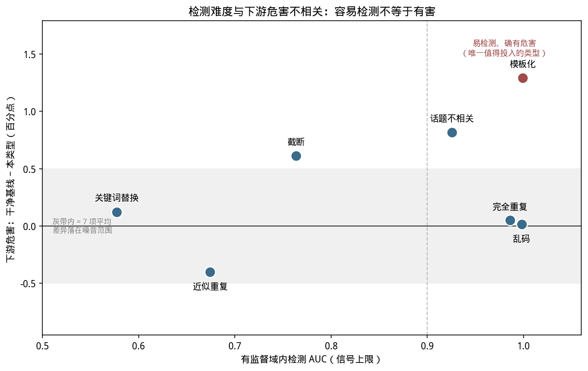
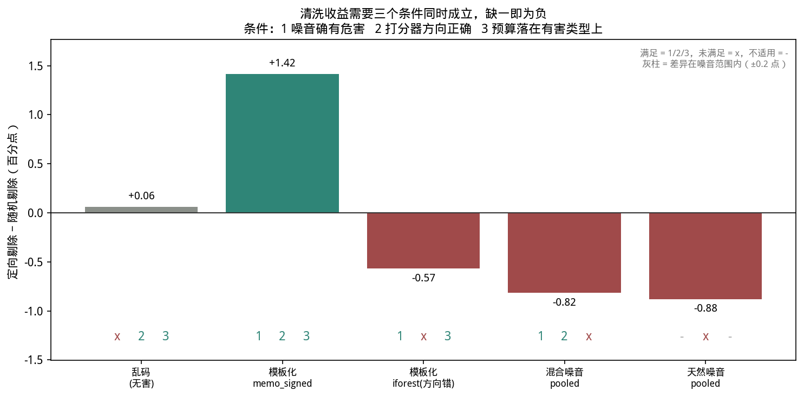

## 7. 结论与 future work

### 7.1 核心结论汇总

以下 14 条按三条研究主线（详见 [06-results.md](06-results.md) 导语）分为三组；跨线的第 12 条拆成两段分别归入主线2和主线3，第 7a、11a 两条来自天然噪音闭环（`oasst-wild`）的完整结果。

#### 7.1.1 主线1：下游危害排序

下游危害排序要回答的是一个先于"能不能检测"的问题：噪音注入之后，模型在下游任务上是否真的变差了、变差了多少。如果只看 7 项 benchmark 的平均准确率，各数据集之间的差距都落在 0.42-0.44 的窄区间内，容易得出"下游影响可以忽略"的结论；但这个预期在拆到单项 benchmark 后并不成立——真实的危害往往集中在少数类型、少数任务上，只是被平均值稀释了。下面这条结论正是在"先看平均、再拆分单项"的顺序下得到的。

1. **下游任务层面的真实危害有限但存在**：7 项通用 benchmark 上各数据集差距很小，但模板化在 dolly-ratio10 下确实是下游表现最差的类型，是唯一同时满足"检测容易+确有危害"的类型（详见 [06a](06a-harm-ranking.md) 第 6a.1 节）。

#### 7.1.2 主线2：各噪音类型的指标特征

主线2 追问的是：如果确实存在可用的检测信号，它在不同噪音类型之间是否稳定，又真正来自哪里。预期是检测难度应当随噪音的扰动强度单调变化，且训练动态特征应当是信号的主要来源；下面的结果部分证实、部分推翻了这个预期——排序确实稳定（条目1、2），但至少两类噪音的高 AUC 其实是文本相似度的假象，而非训练动态方法论生效的证据（条目5），这也解释了为什么"方向反转"这个方法论坑（条目4）不是孤立个案。

1. **检测难度因噪音类型而异，且排序稳定**：乱码/模板化/完全重复最容易检测（AUC>0.98），关键词替换/近似重复最难（AUC 0.57-0.76），这一排序在 10% 和 5% 两个噪音比例下一致。
2. **跨类型迁移损失显著（~17-20 点），跨比例迁移几乎无损**：检测器需要针对不同噪音类型分别校准，但不需要针对不同噪音比例分别训练。
4. **方向反转陷阱是真实存在的方法论坑**：模板化这类"超典型/被记忆"噪音需要带符号的先验规则（而非通用离群检测）才能检测，且这个坑会在早期检测的时间维度上重现。
5. **两类噪音的高 AUC 名不副实**：完全重复、话题不相关的检测信号 90% 以上来自静态文本相似度特征，而非训练动态，这两类不能作为"训练动态检测方法论有效"的证据。单指标留一消融独立印证了这一点：`text_nn_sim` 是唯一在两条路线上都不可替代的指标（删掉它 duplicate/unrelated/mixed 掉 0.056-0.092），其余 18 个轨迹特征单独删掉在 RF 上 |Δ| 全部小于 0.01（[06b](06b-feature-signatures.md) 第 6b.8 节）。
7a. **天然噪音的检测信号里近半来自回复长度混淆**：OASST2 人工 `quality` 标签本身与回复长度相关（相关系数 −0.20），`pooled_detector` 的 raw_auc 0.700 经长度分层校正后只剩 0.589，即 44.5% 的"高于随机"信号来自长度而非训练动态本身；`text_nn_sim` 在天然噪音上几乎无贡献（raw_auc 0.507），与它在注入噪音上的主导地位形成反差。外部基线对比同样显示，只用第一个 epoch 的 `el2n_proxy`/`grand_proxy`（0.760/0.805）反超跑满 5 epoch 的组合打分（0.700），天然噪音上也不需要跑满全部训练轮数（[06b](06b-feature-signatures.md) 第 6b.9/6b.10 节）。
12a. **检测器是"窄"而非"垮"（可迁移性部分）**：单类型检测器拉到混合噪音流上整体 AUC 掉到 0.563-0.730，但限定"自己那一类 vs 干净"后保持率 0.96-1.23 无实质衰减——是覆盖缺口，不是分布失效或信号消失（[06c](06c-detectability.md) 第 6c.4.2 节）。

#### 7.1.3 主线3：能否免标签分离噪音样本

主线3 问的是能否甩开标签、只靠打分器把噪音样本挑出来清洗掉。这条主线上的证据构成一条因果链：先看打分器排出的序是否可靠（排序质量，条目3、6），再看即使排序合理，方向选对还是选错决定清洗是帮忙还是添乱（方向对错，条目8、9、10），然后看即使方向选对，预算是否真的分配到了有害的噪音类型上（预算分配，条目11、11a），最后回到免标签场景本身绕不开的问题——噪音类型未知时该如何兜底（未知类型策略，条目12b）。链条上任何一环出问题，都足以让"检测精度很高"和"清洗真的有用"之间断开。

3. **AUC 会高估清洗可用性**：完全重复类型 AUC 高达 0.986 但 P@10% lift < 1，选择清洗方法必须看预算受限下的精度指标，而非只看 AUC。

AUC 掩盖的不止是精度指标的选择问题，还有一层更底层的原因——喂给打分器的特征本身在稀释排序质量。

6. **免标签路线上"特征越多越好"是错的**：IF 有 46/144 个格子删掉一个指标后 AUC 反而上升（RF 是 0 个），同一个 `converge_epoch` 在 template 上删掉涨 5.2 点、在 near_duplicate 上删掉跌 2.1 点。无标签时每一维都无差别进入离群距离，与当前噪音类型无关的维度纯粹在稀释信号，而"哪些无关"取决于恰恰未知的噪音类型——这也是 `pooled` 必须取 max 而非 mean 的独立证据（[06b](06b-feature-signatures.md) 第 6b.8 节）。

特征稀释解释了排序为什么会失真，但排序失真本身不等于清洗无效——清洗是否真的有用，还要看两个前提是否同时成立。

8. **免标签闭环清洗有效，但需要"噪音确有危害"和"打分器方向正确"两个前提同时成立**：garbled 上定向剔除精度达随机的 5.7 倍，下游却没有提升（garbled 本身危害接近零）；换到确有危害的模板化后，`memo_signed` 清洗回收了 GSM8K 上 8.95 点缺口的 70.3%、7 项平均缺口的 74.4%——这是全报告唯一一个正的下游清洗收益。

两个前提里，"打分器方向正确"不是锦上添花，而是清洗有效与否的分水岭：一旦方向选错，后果比什么都不做还差。

9. **打分器方向选错时，清洗比不清洗、也比随机剔除更糟**：模板化上 `iforest`（方向错）定向剔除精度只有 4.04%，不到随机剔除 9.24% 的一半，重训后 GSM8K 掉到 0.4193，比未清洗基线低 4.09 点。完整链条是"方向对 0.5231 > 不清洗 0.4602 > 随机丢 0.4526 > 方向错 0.4193"，即错误方向的清洗是在主动做负功（[06c](06c-detectability.md) 第 6c.5.2 节）。

既然方向错误的代价这么大，一个自然的问题是：能不能通过收窄特征集合降低方向出错的概率？答案是可以。

10. **免标签路线上 3 个指标胜过全部 19 个，8/8 数据集无例外**：把喂给 IsolationForest 的特征从 19 个收窄到贪心选出的 3 个，平均 AUC 提升 0.133，template 从 0.537 跳到 0.875、duplicate 从 0.528 跳到 0.744。当前生产方案系统性地在自我拖累——"方向反转"的一部分其实是**维度稀释**：无关维度把离群距离摊平，承载信号的那两三维被淹没（[06c](06c-detectability.md) 第 6c.3.3 节）。但"该用哪 3 个"依赖噪音类型，而类型未知正是免标签场景的前提。

但排序质量和方向都校准好之后，清洗能否真正兑现为下游收益，还取决于校准好的排序最终把清洗预算花在了哪里。

11. **混合噪音上排序质量最好的打分器下游收益为负**：`pooled` 在 `mixed` 上 lift 3.83× 为全部实验最高，下游却比随机剔除低 0.0082。原因是预算被无害的类型占据——duplicate 与 garbled 拿掉约 365/1482 席而危害接近零，确有危害的模板化只拿到约 34 席。**清洗有收益需要三个条件同时成立：噪音确有危害、打分器方向正确、且预算落在有害的那部分噪音上**，第三条是混合流特有的，只有走到下游才看得见（[06c](06c-detectability.md) 第 6c.5.3 节）。

这一预算错配问题在注入噪音的混合流上已经足够棘手，换到真实的天然噪音上，同样的机制会以另一种面孔出现。

11a. **天然噪音闭环上，定向剔除反而不如随机剔除**：`oasst-wild` 上 `pooled` 定向剔除精度 26.56%（随机 9.63%，lift 约 3.0×），但重训后 7 项下游平均（0.4107）比随机剔除（0.4195）和未清洗基线（0.4150）都低——是全报告四组闭环里唯一一组"随机丢比定向清洗更好"的情形，负结果几乎全部来自 mmlu 一项。原因与 6c.5 节"两个前提缺一"的机制不同：这里的 `pooled` 打分器本身就带着 7a 条所述的长度混淆，很可能系统性剔除了一批"短但内容合理"的回复，而非真正低质量的回复（[06c](06c-detectability.md) 第 6c.6 节）。

无论注入噪音还是天然噪音，以上结论都建立在"已知要防的噪音类型"这一前提上；当噪音类型本身未知时，排序质量、方向、预算三层判断都无法单独针对某一类型校准，只能退回更保守的兜底策略。

12b. **未知噪音需要两条腿并联（未知类型处理策略部分）**：真正未见过的噪音类型上（留一法），训练动态检测器池 AUC 0.416-0.935、`text_nn_sim` 0.396-0.974，两者互补且各有低于随机的类型，只有并联取较优才能让 7 类全部高于 0.66；这正是 [06c](06c-detectability.md) 第 6c.4.5 节 `pooled` 打分器的设计依据（第 6c.4 节）。

### 7.2 局限性

- **[主线1]** 下游 benchmark 影响的整体区分度不高（0.42-0.44 区间），可能是当前评测集不够敏感，或者 LoRA 微调规模/训练轮数下噪音的下游影响本就有限；不能排除更大规模训练或更长期训练会放大这些差异。
- **[主线1]** 部分下游 benchmark 样本量偏小，单项结果需谨慎解读：BBH 仅 540 条（全部 7 项 benchmark 中最小），模板化在其上 -4.26 个百分点的下降本身可能包含较大的统计噪声，不宜与 GSM8K 上 -8.95 个百分点的下降当作同等强度的证据引用。
- **[主线1]** `triviaqa-ratio10` 目前只有 `clean`/`wrong_answer` 两个数据集完成训练+评测，`refusal`/`confusable_wrong` 仍在训练队列中；6a.3 节"单一同质任务下噪音危害不被多 benchmark 平均稀释"的结论目前只覆盖 wrong_answer 一种噪音机制，不能代表 QA 任务下全部噪音类型的危害排序，后续数据补齐后结论的强度甚至方向都可能变化。
- **[主线3]** 闭环清洗已覆盖 `garbled`、`template`、`mixed`（`pooled`）、`oasst-wild` 四种情形，但尚未推广到检测困难的关键词替换与近似重复。**全部闭环结论都来自单次训练、单一种子，没有方差估计**：模板化上 +0.0096、混合上 −0.0082、天然噪音上 −0.0043 这三个数值本身都在 7 项 benchmark 平均值的窄区间（0.42-0.44）内，可靠的是方向（方向对 > 不清洗 > 随机 > 方向错）与量级，不是小数点后第四位。
- **[主线3]** 6c.3.3 节的最小指标集合用**自己被评分的那批标签**做贪心选择，所以给定 k 的 AUC 是乐观的，衡量的是"小特征集最多能承载多少信号"，不是一个免标签可用的选特征配方。第 3.1 节明确禁止用标签挑特征，因此"3 个指标胜过全部 19 个"这条结论在生产上还缺一个免标签的选特征机制才能兑现。
- **[主线2]** `text_nn_sim` 主导完全重复/话题不相关检测这一发现，提示"训练动态检测"这一核心方法论目前只对乱码、模板化、截断、关键词替换等类型有实质贡献，需要在方法论表述上避免过度概括。
- **[主线3]** 第 6c.4 节的"未见过的噪音类型"仍然是我们自己注入的 7 类之一，只是对检测器池而言未见过；真正的野生噪音（用户误粘贴、编码错误、跨语言混入、机翻痕迹等）在文本分布和训练动态上都可能与这 7 类不同，留一法得到的 0.416-0.935 这个区间不能直接外推到野生数据上。
- **[主线3]** 第 6c.2/6c.3 节的消融实验证实：`cleaning_loop.py` 当前对 duplicate/unrelated 用的"19 特征混合 iforest"方案被 `text_nn_sim` 以外的弱特征稀释了，单用 `text_nn_sim` 精度更高；near_duplicate/keyword 则是现有全部原始数据类别都不够的方法论盲区，不是打分方式选错了。[06b](06b-feature-signatures.md) 第 6b.8 节的单指标留一在诊断子采样人群（每数据集约 900-1200 行）上跑，样本量偏小，单个格子 0.01-0.02 量级的 Δ 不宜逐一解读，可靠的是"RF 全部小于 0.01 而 IF 有 46 个超过"这个整体对比。
- **[主线2]** Token 级诊断指标目前只对 1/8 的样本采样（`diag_subsample=8`），这个采样率本身会稀释信号：仅用真实采到的 12.5% 样本算 `hard_loss_max` 的 AUC，模板化/近似重复分别是 0.920/0.632，而全量（87.5% 中位数填充后）只剩 0.564/0.515——这两类的检测上限被子采样掩盖了一部分，不是信号本身弱；关键词替换则是真实数据 AUC 也只有 0.555，信号本身就弱，提高采样率帮不上忙（原始数字见 [08-appendix.md](08-appendix.md) 第 8.2 节，重训成本评估见第 8.5 节）。

### 7.3 下一步方向

下面 8 条大致沿着三条主线各自的证据缺口展开：主线1 需要验证当前危害区分度不高是否只是训练规模不够、尚未显现；主线2 需要重新评估"逐样本梯度"这一采集前提是否值得它的代价；主线3 需要把已验证有效的单点改动（text_sim 打分、特征收窄）推广并补上方差估计；主线1 与主线3 交叉处的"按危害加权剔除"问题，则是尚未解决的最终关口。

- **[主线3]** 将闭环清洗方法推广到其余噪音类型，尤其验证 P@10% lift < 1 的完全重复类型清洗后是否反而有害。
- **[主线3]** 用多种子重复模板化闭环（6c.5.2 节），给 +0.0096 的下游收益和 GSM8K 上 +0.0629 的回升配上方差估计——目前是单次训练的结果。
- **[主线3]** 给 `cleaning_loop.py` 增加 `text_sim` 打分方式，用于 duplicate/unrelated（6c.3.3 节），预期比当前混合特征的 iforest 精度更高，且不需要新增数据采集。6c.4.5 节的 `pooled` 已经把 `text_nn_sim` 并联进去并验证了它在 duplicate 上的效果（逐类型 AUC 0.946），剩下的工作是给已校准的单类型场景提供一个不掺其他腿的纯 `text_sim` 选项。
- **[主线2]** 探索针对关键词替换、近似重复这类"轻度扰动"噪音的专用特征（[06c](06c-detectability.md) 第 6c.3 节消融证实：当前的训练动态+文本相似度特征组合对它们信号都很弱，即使加入生产环境拿不到的 token 级诊断也无法解决）。
- **[主线1][主线3]** **按危害加权的剔除，而非按异常程度加权**（最实质的开放问题）：6c.5.3 节证明 `pooled` 在 `mixed` 上把约四分之一预算花在下游危害接近零的 duplicate/garbled 上，确有危害的模板化只拿到 2.3%。需要把"这类噪音有多害"折进打分，但危害要靠下游评测才知道，而免标签设定下拿不到——这个循环是本报告留下的核心难题。
- **[主线3]** **把 `iforest` 那条腿从 19 个特征收窄到 2-3 个**（6c.3.3 节）：唯一一个不需要新数据、不需要新方法、只需少喂特征就能拿到 0.04-0.34 提升的改动，但"该用哪几个"依赖噪音类型，需要先解决免标签下的特征选择。
- **[主线3]** **验证消除长度混淆后重新打分、重新清洗能否让天然噪音闭环转正**：`oasst-wild` 上 `pooled` 的信号里混入了与真实质量无关的长度混淆（7a 条），本报告尚未验证剔除混淆后的信号重新打分、重新清洗是否能把 6c.6 节的负收益转正（[06c](06c-detectability.md) 第 6c.6 节）。
- **[主线2]** **重新评估 `micro_batch=1` 这一采集前提是否值得它的代价**：第 3.4 节把 `micro_batch=1` 列为方法前提而非性能选择，因为逐样本梯度归属要求单样本独立前向-反向；代价是每条样本都要单独跑一次，triviaqa 这种 13.8 万行的数据集因此需要约 6 小时/epoch。但 19 个全覆盖特征里只有 10 个（`grad_norm_*`/`cos_ref_*`/`update_contrib_mean`）依赖这个前提，其余 9 个（`text_nn_sim` 与 8 个 loss 族特征）在常规批训练下可以零成本采集——批内用 `reduction='none'` 逐行算 loss 即可。把打分器输入限制到这 9 个特征后：**有监督 AUC 平均只掉 0.021，免标签路线反而平均上升 0.008（ratio10）/0.017（ratio5）**，8 个数据集、两个噪音比例结论一致；反过来只用那 10 个梯度特征则普遍明显更差（unrelated 0.944→0.709、mixed 0.838→0.688）。唯一的反例是 template 的免标签 AUC，但该类型在 `iforest` 上本就因方向反转而失效，换成对它有效的 `memo_signed` 后，去掉其 6 个特征里唯一的梯度特征 `grad_norm_mean`、只留 5 个 loss 特征，AUC 从 0.9265 反而升到 0.9325。第 6b.8 节的单指标留一独立印证了同一点：RF 路线上单独删掉任一梯度/余弦特征的 |Δ| 平均只有 0.001，而 `text_nn_sim` 是 0.027。这意味着**逐样本梯度这一整族特征几乎没有为检测贡献信号，却决定了整套方法的采集成本**。后续需要验证的是：改用常规批训练（`micro_batch=16, grad_accum=1`，等效批大小不变以保证与本报告数据可比）能把训练时间压缩多少——当前 GPU 利用率仅 28-35%，提速空间可观但本报告尚未实测；如果确实需要保留梯度族，单样本梯度范数与与参考方向的内积都可以在批内用 ghost norm 精确计算（LoRA 各层均为线性层，`cos_ref` 的分子因参考方向固定可改写为逐 token 的双线性形式），无需 materialize 每条样本的完整梯度。需要注意的口径细节是：当前实现累积的是「每样本 mean loss 之和」，而标准 mean reduction 是全窗口 token 加权平均（长样本权重更大），保持等价须先按行求均值再对行求均值。

---
