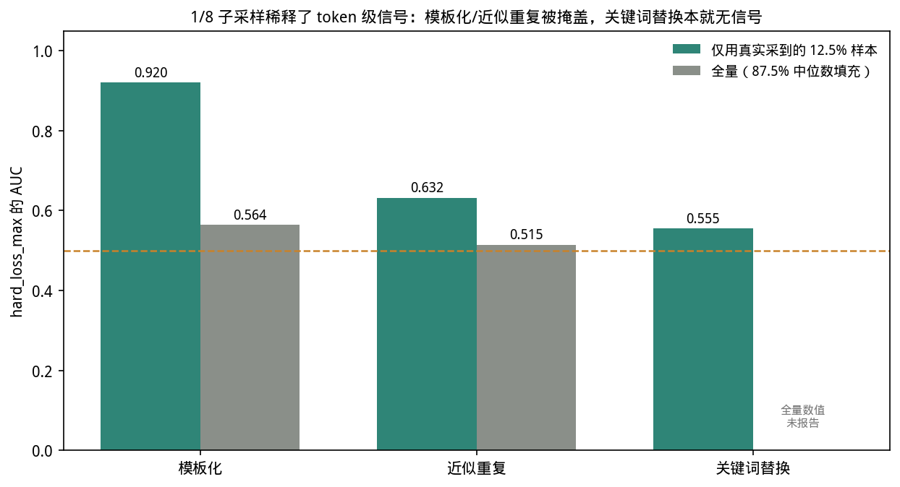
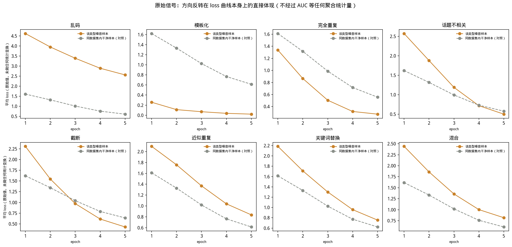

## 8. 附录：原始数据与指标定义

本附录分两部分：8.1-8.5 是全部指标的精确定义、覆盖率与采集耗时；8.6-8.8 是原始数据展示（噪音文本对照、单样本特征值、原始 loss 曲线）。正文各节引用的具体数值都可以在这里追溯到定义或原始形态。

本节汇总项目中出现的全部诊断指标的精确计算方式（含代码出处）、覆盖率与采集口径，并给出诊断环节的逐阶段实测耗时，供后续特征工程决策参考。所有代码引用均指向根目录 `model.py`/`analyze.py`/`textsim.py`。

### 8.1 训练轨迹类指标（全量覆盖，来自 `per_sample.jsonl`）

*主线2（指标特征）的定义基础——[06b](06b-feature-signatures.md) 各节引用的全部训练轨迹特征均在此精确定义。*

这一类指标在训练主循环内直接计算，**每个训练样本在每个 epoch 都会产出一条记录，无子采样，覆盖率 100%**（`model.py:246-257` 的 `flush_window`）。由于 `micro_batch=1` 而 `grad_accum=16`（`config.yaml`），代码先对单个样本做前向+反向拿到该样本独有的梯度，再累积 16 个样本后才真正调用 `opt.step()`——这个设计是为了在"梯度累积"这种工程优化手段下，仍能保留"这一步更新里，某个具体样本贡献了多少、往哪个方向"的可归因信息，否则 16 个样本的梯度会被直接加总，无法逐样本区分。

| 指标 | 精确计算方式 | 直觉含义 |
|---|---|---|
| `loss_mean` / `loss_last` / `loss_std` / `loss_slope` | 该样本 5 个 epoch 的 loss 值：均值 / 第 5 个 epoch 的值 / 标准差 / `loss[epoch4]-loss[epoch0]` | 训练全程的平均难度 / 最终收敛水平 / 波动幅度 / 是否越训越差还是越训越好 |
| `loss_min` | 5 个 epoch 中的最小 loss | 模型曾经达到过的最佳拟合程度 |
| `converge_epoch` | loss 首次小于阈值 2.0 的 epoch 序号，若从未达到则记为 5（`analyze.py:52-53`：`(m<2.0).idxmax(axis=1)`，全程未达标则整行赋值为 `len(ep_cols)`） | 模型"学会"这个样本要花多久——异常样本往往要更久，或者反而"学得过快"（见 `converge_epoch` 与记忆型噪音的关系，[06b](06b-feature-signatures.md) 第 6b.4 节） |
| `loss_curvature` / `loss_rank` | 对 5 个 epoch 的 loss 曲线做二次多项式最小二乘拟合（`analyze.py:54-55`：`X=[1, epoch, epoch^2]`，取二次项系数 `coeffs[:,0]`）；`loss_rank` 是该样本 loss 在同批样本内的百分位排名，5 个 epoch 取均值 | 曲率衡量收敛"减速/加速"的形态是否异常（比如收敛后又反弹）；排名衡量该样本在同伴中是否持续"格外难"或"格外容易" |
| `grad_norm_mean` / `_last` / `_std` / `_slope` / `_cv` | 每个 epoch 内该样本单独贡献的梯度增量（`delta_buf`，即该样本反向传播后 LoRA 全部参数的梯度向量）的 L2 范数（`model.py:274`：`g_norm=torch.linalg.vector_norm(delta_buf)`），再按 5 个 epoch 汇总为均值/末值/标准差/斜率；`_cv=grad_norm_std/grad_norm_mean` | 该样本单独驱动模型参数移动的幅度——异常样本常伴随异常大或异常小的梯度 |
| `cos_ref_mean` / `_last` / `_std` / `_slope` / `_trend` | 该样本梯度向量与一个**训练开始前固定不变**的参考方向 `ref_buf` 的余弦相似度（`model.py:275`：`cos_ref=dot(delta_buf,ref_buf)/g_norm`）。`ref_buf` 由 200 条从未参与训练的 held-out 干净样本，在训练开始前对模型做一次前向+反向、取平均梯度并归一化得到（`_compute_reference_direction`，`model.py:57-75`），之后训练全程保持不变 | 这个样本的梯度方向，跟"一个干净、正常样本理应有的梯度方向"偏离有多大；因为参考方向是训练前算好并冻结的，所以这个指标能跨 epoch 比较同一把"标尺" |
| `cos_global_mean` / `_last` / `_std` / `_slope` | 该样本梯度增量与**同一次梯度累积窗口内**（同一优化器 step 内的 16 个样本）全部样本梯度总和的余弦相似度（`model.py:236-245`：`dot_globs`/`bsqs` 用同一窗口内的 `delta_b` 与其他样本比较） | 这个样本这一步是否与"同伴"方向一致——如果一个窗口里 15 个样本都指向 A 方向，这个样本却指向反方向，说明它可能在拖后腿或制造冲突更新 |
| `update_contrib_mean` | 仅取 LoRA 的 `B` 矩阵部分（`b_offsets`），该样本贡献的参数增量 `delta_b` 的范数，除以 Adam 优化器该组参数二阶矩估计 `v_buf`（即 `exp_avg_sq`，从 `opt.state` 里读出）平方根的范数（`model.py:280`：`upd=‖delta_b‖/(‖sqrt(v_buf)‖+1e-8)`），再对 5 个 epoch 取均值 | 比原始梯度范数更接近"Adam 优化器实际会让这个样本挪动多少参数"——因为 Adam 会用二阶矩把不同参数的更新幅度重新缩放，原始梯度大不代表实际更新步长大 |

### 8.2 Token 级诊断指标（子采样覆盖，来自 `diag_epoch*.jsonl` / `token_diag_epoch*.jsonl`）

*主线2（指标特征）的定义基础。*

每个 epoch 训练结束后，代码额外对训练集做一次**间隔子采样**（`train_data[::diag_step]`，`diag_step=train.diag_subsample`，默认 8，即每 8 个样本取 1 个）的**纯前向推理**（`_diagnostic_pass`，`model.py:120-168`，`@torch.no_grad()`，不参与反向传播、不更新参数），批大小 8。对 14611 条训练样本，子采样后每个 epoch 只对 1827 条（12.5%）计算这批指标，其余 87.5% 的样本这些列为空，`analyze.py` 用全列中位数填充（`_load_run_metrics` 未对这批列做特殊处理，遗留空值由后续 `unsupervised_metrics` 等函数统一 `fillna(median)`）。

| 指标 | 精确计算方式 | 直觉含义 |
|---|---|---|
| `max_token_loss` | 该样本 response 段全部 token 的交叉熵损失中的最大值（`model.py:153`：`toks.max()`） | 该样本里"最令模型意外"的单个 token 有多离谱 |
| `frac_hard` | response 段中损失超过 `hard_threshold`（默认 4.0）的 token 占比（`model.py:154`：`(toks>thresh).float().mean()`） | 整个样本中"难 token"的密度，而非只看最难的一个 |
| `user_loss` | prompt（用户提问）部分 token 的平均交叉熵损失（`model.py:157`）。注意：训练时 prompt 部分的 label 被置为 `-100`（`user_mask`），不参与梯度计算，这个指标纯粹是诊断用的"顺手测一下" | 乱码等噪音会让 prompt 本身就变得难以预测，这个指标能捕捉到问题出在输入侧而非仅输出侧 |
| `entropy` | 模型对 response 段每个位置下一个 token 预测分布的香农熵，对全部 label token 取均值（`model.py:143-147`：`-(exp(log_softmax)*log_softmax).sum(-1)`） | 模型对"接下来该生成什么"的不确定程度；熵高说明模型自己也很犹豫 |
| `token_loss_skew` / `token_loss_kurt` | 该样本全部 token 级 loss 值的偏度（scipy `skew`）与超额峭度（scipy `kurtosis`，Fisher 定义，正态分布为 0）（`model.py:161-163`，仅当 token 数 >3 时计算） | 偏度衡量分布是否有单侧长尾（少数 token 损失远高于其余）；峭度衡量分布是否比正态更"尖峰厚尾"（是否存在孤立的极端 token） |
| `hard_loss_mean` / `hard_loss_max` | 每个 epoch 取该样本 loss 最高的 `top_k=32` 个 token（`model.py:164`：`toks.topk(min(32,len(toks)))`），记录其 `[位置, token_id, loss]` 三元组列表；`analyze.py:87-90` 再对这 32 个值取平均/取最大值，并对多个 epoch 取均值 | `hard_loss_mean` 反映"最难那批 token"整体有多难；`hard_loss_max` 反映其中最极端的一个 |
| `hard_pos_peak` / `hard_pos_std_mean` | top-32 难 token 在序列中位置（token 下标）的均值 / 标准差，先在单个 epoch 内对 32 个 token 求统计量，再对多个 epoch 取均值（`model.py:91-92`） | 难 token 是集中在句子某个局部区域，还是分散在全文各处 |
| `hard_id_uniq` | 5 个 epoch 累计出现过的、跨 epoch 去重后的难 token id 总数（`model.py:93-94`：对每个 epoch 的 top-32 token id 取并集后计数） | 难 token 集合本身有多"稳定"——数值越小说明每次都是同一批 token 上难，越大说明难点在漂移 |
| `hard_pos_jaccard` | 相邻两个 epoch 的难 token 位置集合的 Jaccard 相似度（交集大小/并集大小），对全部相邻 epoch 对取均值（`model.py:95-98`：`len(pa&pb)/max(1,len(pa\|pb))`） | 衡量"难点"是持续卡在同一批 token 上（Jaccard 高，更像结构性异常），还是随机波动（Jaccard 低，更像噪声） |

**重要发现（本次探索验证）**：对模板化、近似重复两类，仅用有真实 token 数据的 12.5% 样本算 `hard_loss_max` 的 AUC 分别为 0.920 / 0.632，而全量（87.5% 中位数填充后）AUC 只有 0.564 / 0.515——说明当前 1/8 子采样**显著稀释**了这两类信号；关键词替换则真实数据 AUC 仅 0.555，说明它的瓶颈是信号本身弱，不是采样率问题（详见 8.5 节的重训成本评估）。这一结论已收入 [07-conclusions.md](07-conclusions.md) 第 7.2 节局限性（主线2）。

### 8.3 文本层面指标（静态，不依赖训练）

*主线2（指标特征）的定义基础——`text_nn_sim` 是 [06b](06b-feature-signatures.md) 第 6b.6 节"两类噪音高 AUC 名不副实"发现的核心特征。*

| 指标 | 精确计算方式 | 直觉含义 |
|---|---|---|
| `text_nn_sim` | 对同一数据集全部样本的 `prompt+response` 拼接文本构建 TF-IDF 向量（`textsim.py:10`：`TfidfVectorizer(ngram_range=(1,2), min_df=min(10,N), sublinear_tf=True, max_features=200_000)`，即同时用 1-gram 和 2-gram、对数缩放词频、词表上限 20 万），再用余弦距离的 `NearestNeighbors(k=2)` 为每个样本找最近邻（`k=2` 是因为第 1 近邻永远是样本自身，取第 2 个才是"除自己以外最像的样本"），相似度 = `1 - 该距离` | 这个样本的文字表达（词汇+局部搭配）在训练集里是否能找到几乎一样的"孪生"样本——对完全重复、近似重复这类"复制/轻改写"噪音非常敏感，但对关键词替换这种"整体结构不变、只换 1-2 个词"的噪音几乎不敏感（TF-IDF 向量几乎不受影响） |

实测：对 `keyword@dolly-ratio10`（14611 条样本）计算全量 `text_nn_sim` 耗时约 7.3 秒（含 TF-IDF 构建 + 最近邻检索），是全部指标里计算成本最低的一类，且完全不需要 GPU。

### 8.4 已产出但未进入检测流程的诊断量

| 指标 | 精确计算方式 | 现状 |
|---|---|---|
| `layer_norms.jsonl` / TensorBoard `lora_layer_gradnorm/layer{li}` | 每个优化器 step（即每完成一次 16 样本的梯度累积窗口）调用一次，对该 step 累积的梯度，按 LoRA 所在的 transformer 层号分别求和后取 L2 范数（`_window_layer_grad_norms`，`model.py:80-86`：按层号分组，`sqrt(sum(grad**2))`）。仅监控三层：`target_ids={0, n_layers//2, n_layers-1}`——对当前 Qwen2.5-3B-Instruct（36 层）即第 0、18、35 层（`model.py:227`）。每次训练 5 epoch × 914 个优化器 step ≈ 4570 行 | 这是**按训练 step 聚合的全局量**，不是按样本的量——一个 step 里 16 个样本的梯度贡献已经被加在一起，无法反推出"某个样本单独在某一层的梯度是多少"。因此即使想把它塞进 `per_sample_metrics.csv`，现有数据形态也做不到，必须改造成类似 `cos_global`/`grad_norm` 那样的逐样本-逐层拆分（在 `flush_window` 里按层号重新做一遍范数计算），这需要修改训练代码并重新训练，而不是简单的后处理脚本能解决的。目前全项目代码中没有任何位置读取或合并这份数据，仅用于人工在 TensorBoard 里观察各层梯度量级随训练的变化曲线 |

### 8.5 采集耗时（实测，`keyword@dolly-ratio10`，单卡 NVIDIA RTX PRO 6000 Blackwell Server Edition）

耗时数据来自 `runs/dolly-ratio10/keyword/metrics/diag_epoch*.jsonl` 等文件的磁盘写入时间戳（`stat` mtime），并与 `logs/full_run.log` 中记录的该数据集训练起止时间（2026-09-12 09:26:36 → 12:33:55，实测总耗时 187.3 分钟）交叉核对，两者一致。

**单 epoch 内部构成**（基于 `config.yaml` 当前配置推算）：

- 训练样本数 14611，`micro_batch=1`、`grad_accum=16` → 每个 epoch 有 `⌈14611/16⌉=914` 个优化器 step；5 epoch 共 4570 step。
- 每个优化器 step 内：16 次单样本前向+反向（逐样本，非批处理），随后做一次 `opt.step()`、写入 `layer_norms.jsonl` 一行、写入 `per_sample.jsonl` 16 行。
- 每 `eval_steps=200` 个优化器 step 触发一次 held-out 验证（`_eval_heldout`，`model.py:106-117`，纯前向，200 条样本、批大小 8，共 25 个 batch）——每个 epoch 内约触发 4-5 次（step 200/400/600/800）。
- 每 `log_every=25` 个优化器step，向 TensorBoard 写入一批标量（loss/grad_norm/cos_ref/cos_global/update_contrib/lr/tokens_per_sec/gpu_mem 等），耗时可忽略。
- epoch 训练阶段结束后，才触发一次性的 token 级诊断前向推理（8.2 节所述，1827 个子采样样本，批大小 8，共 229 个 batch，纯前向不反向）。

**逐 epoch 实测耗时**（由文件 mtime 差值推算，5 个 epoch 依次为）：

| Epoch | 本 epoch 总耗时（训练+诊断推理） | 备注 |
|---|---|---|
| 0 | ~38 分钟 | 含一次性开销：模型/LoRA/tokenizer 加载、200 条 held-out 参考样本的参考方向计算（`_compute_reference_direction`） |
| 1 | ~38 分钟 | |
| 2 | ~37 分钟 | |
| 3 | ~37 分钟 | |
| 4（末轮） | 训练阶段 ~36 分钟 + 诊断推理阶段 **单独测得 34 秒** | 这是唯一能把"训练"和"诊断推理"拆开单独测量的一轮，因为 `per_sample.jsonl`/`layer_norms.jsonl` 的最后一次写入时间标记了训练阶段结束点 |
| **合计（5 epoch）** | **约 187 分钟（约 3.1 小时）** | 与 `full_run.log` 记录的起止时间差（187.3 分钟）一致 |

**推论**：229 个 batch 的诊断前向推理耗时 34 秒，平均每 batch 约 0.15 秒；若将 `diag_subsample` 从 8 改为 1（全量诊断，14611 个样本、批大小 8、`⌈14611/8⌉=1827` 个 batch），诊断阶段预计增至约 **270 秒（4.5 分钟）**，单数据集 5 epoch 总耗时预计从 187 分钟增至约 **209 分钟（3.5 小时）**，即增加约 12%（诊断推理本身不含反向传播和优化器更新，理论上应与 batch 数近似线性缩放，此处按线性外推）。

**跨数据集/整体项目重训成本外推**：若只对当前判定"有提升空间"的 `near_duplicate` 类型（8.2 节结论）做全量诊断重训，需要 `dolly-ratio10` + `dolly-ratio5` 两个 tag 各一次，预计合计增加约 **44 分钟**（每个 tag 约 22 分钟的增量）；若对全部 9 类噪音数据集 × 2 个比例（18 个 run）都改为全量诊断，预计合计增加约 **6.6 小时**（每个 run 约 22 分钟增量 × 18）。以上数据来自单一数据集、单台机器的一次实测，不同数据集（文本长度、样本数）与 GPU 负载下会有波动，仅供量级参考，不构成精确排期承诺。

### 8.6 噪音样本示例（原始文本对照）

*主线2（指标特征）的直接证据——用真实文本佐证 [06b](06b-feature-signatures.md) 第 6b.1 节的检测难度排序。*

后续所有章节讨论的"检测难度""特征归因"都是抽象的统计结论，这里先给出真实数据，让读者能直接看到 7 种噪音在原始文本层面到底做了什么。以下除关键词替换外均取自 `datasets/dolly-ratio10/{类型}/train.jsonl` 中同一条样本 `sample_id=20`（原问题 "Why do home power outages occur?"，干净回答共 1055 字符，开头为 "Power outages can occur for a number of reasons. First, some perceived \"outages\" may actually be caused by overloading a circuit breaker in a home..."），关键词替换取自 `sample_id=74`（另一个样本，因为 20 号样本的关键词替换恰好落在未展示的片段上，不便说明）：

| 噪音类型 | 制造方式（实测） | 噪音后文本（节选） |
|---|---|---|
| 乱码 (garbled) | 对 prompt 和 response 的字符逐个做随机替换/插入全角字符、随机符号，词形基本不可读，但字符数量与原文接近 | user: `２ウ０ do homｆ pＭwer outages occuѫ?`　assistant: `oP＊eＣ¥ oＱtages Ｍan cocur for a number of 关eＤosns. Firs⌘t, soＰӜ pe÷rceiv＆d "oをtages" may actuaＤly №e cau７sed by overloadi®g a cＡrＷuit breaker in a hom４e...` |
| 模板化 (template) | 整个 response 被替换为固定的通用句式，与原问题内容无关，长度从 1055 字符骤降到 35 字符 | assistant: `The answer to this question is 42.` |
| 完全重复 (duplicate) | 不修改原样本，而是把整条记录复制一份追加为新行，新 `sample_id` 加 `_dup0` 后缀（如 `20_dup0`），文本与原样本逐字符相同 | `sample_id=20_dup0` 的 user/assistant 内容与 `sample_id=20` 完全一致（逐字符对比无差异） |
| 话题不相关 (unrelated) | response 整体替换为数据集中另一个话题完全无关的回答，但 user 提问保持不变 | user: `Why do home power outages occur?`（不变）　assistant: `Bernoulli's principle can be derived directly from Isaac Newton's second Law of Motion. If a small volume of fluid is flowing horizontally from a region of high pressure to a region of low pressure...` |
| 截断 (truncation) | response 在任意字符位置硬性截断，不考虑词/句边界，本例从 1055 字符截到 527 字符，句子在 "This might be due to m" 处硬生生断掉（后面本应是 "maintenance activities"） | assistant: `...If you are experiencing a power outage, it may been caused by a few different reasons: - Power safety shutoff: in some situations, a power provider will de-electrify an area to prevent issues. This might be due to m`（到此为止，共 527 字符） |
| 近似重复 (near_duplicate) | 保留原意，对同义词做替换（perceived→perceive、still on→stillness on、power→powerfulness、care→maintenance 反向替换等）并打乱句子/要点顺序，属于"语义相同、措辞和结构都变了"的改写 | assistant: `First, some perceive outage may really be caused by overloading a circuit breaker in a home. To eliminate this as a possibility and confirm the issue is not localized to your home, check to build sure that all circuits in your electrical panel are stillness on. powerfulness outage can occur for a number of reasons...`（原文的两个要点顺序也被打乱） |
| 关键词替换 (keyword, `sample_id=74`) | 只替换句中的实体名词（人名/地名等），句子结构、语法、标点完全不变，第二句 "Hilda was a sculptor..." 甚至保留了原名 "Hilda"/"Richard" 未替换——是全部 7 类中扰动幅度最小的一种 | user: `Given a reference text about ~~Audrey Babette Blackman~~→Riverdale, tell me her parents names and occupations.`　assistant: `~~Audrey Babette Blackman~~→Robert Blackwell parents names were ~~Hilda Sligman and Richard Seligman~~→Kingston and Meridian Health. Hilda was a sculptor and author and Richard was a chemical engineer.` |

这张表直接解释了 [06b](06b-feature-signatures.md) 第 6b.1 节的检测难度排序：乱码、模板化、截断在文本层面的改动幅度极大（字符替换、整体替换、硬截断），训练动态自然容易留下痕迹；近似重复、关键词替换只做局部同义替换或实体替换，句子结构和大部分用词都不变，这正是它们域内 AUC 全部 7 类中最低（0.674、0.577）的直观原因——也是 [06b](06b-feature-signatures.md) 第 6b.6 节"关键词替换找不到稳定主导特征"这一发现在文本层面的根源。

---

### 8.7 原始特征值示例：一条噪音样本 vs. 一条干净样本

*主线2（指标特征）的直接证据。*

以 `garbled@dolly-ratio10` 为例，取一条被检测为噪音的真实样本（`sample_id=10136`，落在诊断子采样里）与一条干净样本（`sample_id=0`）在 `per_sample_metrics.csv` 里的实际取值对比：

| 特征 | 噪音样本（乱码，`sample_id=10136`） | 干净样本（`sample_id=0`） | 说明 |
|---|---|---|---|
| `loss_mean` | 2.60 | 1.62 | 乱码样本 5 个 epoch 的平均 loss 明显更高——文本本身不可预测 |
| `loss_curvature` | 5.52 | 6.32 | 两者曲率量级接近，说明单看这一个特征分不太开 |
| `user_loss` | 4.94 | 4.08 | 乱码连 prompt 部分都变得难预测，`user_loss` 抬高，这也是 [06b](06b-feature-signatures.md) 第 6b.6 节里乱码检测器最依赖 `user_loss` 特征的直接数值证据 |
| `entropy` | 2.63 | 0.45 | 差距近 6 倍——模型对乱码文本"该生成什么"极不确定 |
| `frac_hard` | 0.20 | 0.00 | 乱码样本中 20% 的 token 损失超过难例阈值 4.0，干净样本一个都没有 |
| `max_token_loss` | 6.04 | 0.64 | 单个最难 token 的损失差距接近 10 倍，是全部特征里区分度最直观的一个 |

这组真实数值说明：随机森林之所以能在乱码类型上做到 0.998 的 AUC，并不是抽象统计巧合，而是 `entropy`/`max_token_loss`/`user_loss` 这几个特征本身在噪音样本和干净样本之间就存在数倍量级的真实差距。

用随机森林分类器（有监督，见 [06b](06b-feature-signatures.md) 第 6b.1.1 节口径说明）在训练动态特征上做 5-fold 交叉验证，得到每种噪音类型的"域内检测 AUC"：

| 噪音类型 | dolly-ratio10 AUC | dolly-ratio5 AUC |
|---|---|---|
| 模板化 | 0.999 | 1.000 |
| 乱码 | 0.998 | 0.993 |
| 完全重复 | 0.986 | 0.985 |
| 话题不相关 | 0.925 | 0.967 |
| 截断 | 0.763 | 0.764 |
| 近似重复 | 0.674 | 0.759 |
| 关键词替换 | 0.577 | 0.634 |

**结论**：

- 模板化、乱码、完全重复三类几乎"满分可检测"（AUC > 0.98），说明这类噪音在训练动态上留下的痕迹非常显著。
- 关键词替换和近似重复是两个明显的难点，AUC 只比随机基线（0.5）高出不多，说明这两类"轻度扰动"式噪音在训练动态层面几乎不留痕迹。
- 两个噪音比例（10% vs 5%）下的排序完全一致，且 dolly-ratio5 在较难的三类（unrelated/truncation/near_duplicate/keyword）上 AUC 反而略高于 dolly-ratio10——初步证据表明这个排序是稳定的，不是噪音比例特定的偶然结果，[06b](06b-feature-signatures.md) 第 6b.3 节的跨比例迁移分析会进一步验证这一点。

---

### 8.8 原始信号：方向反转在 loss 曲线本身上的直接体现

*主线2（指标特征）的直接证据——[06b](06b-feature-signatures.md) 第 6b.4 节方向反转陷阱的原始曲线依据。*

前面几节大量使用 AUC 作为主要口径，是因为跨 7 种噪音类型 × 多种方法 × 多个 epoch 做横向比较时，各特征的原始数值本身没有共同尺度（乱码的异常是"loss 偏高"，模板化的异常是"loss 偏低"，直接放一张表里没法比）；但 AUC 终究是从原始数据聚合出来的统计量，这里直接把驱动 AUC 的原始信号画出来：对 `dolly-ratio10` 全部 8 个非 clean 数据集，分别取该数据集内"该类型噪音样本"和"`noise_type=='none'` 的干净样本（同数据集内对照）两组，在每个 epoch 上直接对 `runs/dolly-ratio10/{类型}/metrics/per_sample.jsonl` 里的原始逐样本 loss 取算术平均——不做任何 z-score、曲率拟合等特征工程，是最原始的数字。

- **乱码**：噪音组 loss 从 epoch1 的 4.62 一路降到 epoch5 的 2.56，但**始终**远高于同数据集干净对照组（1.61→0.61），两条线全程分离得很开——这正是 [06b](06b-feature-signatures.md) 第 6b.1 节域内 AUC 高达 0.998、第 6b.4 节 iforest AUC 达 0.936 的原始数字依据：模型确实学不会这些乱码文本。
- **模板化**：这是"方向反转"最极端的例子——噪音组 loss 在 epoch1 就只有 0.257，到 epoch5 直接降到 0.021，反而**远低于**干净对照组（1.62→0.61）。不是"看起来正常"，而是比正常样本更"正常"：模型几乎从第一个 epoch 就把这批高度模板化的样本记得滚瓜烂熟，这就是 [06b](06b-feature-signatures.md) 第 6b.4 节 memo_signed AUC 达到 0.925 而 iforest 只有 0.522（因为 iforest 默认"离群=噪音"，找错了方向）背后的真实原始曲线长什么样。
- **完全重复**：同样出现反转（噪音组 1.33→0.27，始终低于干净对照组 1.61→0.56），但差距不像模板化那么悬殊——对应 [06b](06b-feature-signatures.md) 第 6b.4 节里这一类型 iforest（0.612）和 memo_signed（0.654）两个 AUC 都不算很强、方向反转并不彻底的原始成因。
- **话题不相关、截断、近似重复、关键词替换、混合**：这五类噪音组 loss 始终**高于**干净对照组（而不是像模板化/完全重复那样反过来），但两条线随训练逐渐靠近甚至（话题不相关在 epoch4-5）几乎重合——说明这几类噪音"比模板化难记住，但也没有乱码那么学不会"，处于两个极端之间的中间地带。这与它们在 iforest 下 0.55-0.70 的中等 AUC、以及在 memo_signed 下普遍偏低的 AUC（因为 memo_signed 先验假设"loss 越低越像噪音"，而这几类噪音的 loss 其实是偏高的，先验方向直接用反了）相互印证。

**这张图直接回答了"报告里为什么较少展示原始 loss 数据"的问题**：并不是原始数据不重要或被忽略了，而是 AUC 本身就是对这 8 条曲线"两组分离程度"的一个可跨数据集比较的量化——garbled/template 这两类"一眼就能看出两条线分得很开"对应它们的高 AUC；unrelated/truncation/near_duplicate/keyword 这几类"两条线随 epoch 逐渐靠近"，正对应 [06b](06b-feature-signatures.md) 第 6b.5 节里它们的 AUC 随训练推进要么涨得有限、要么直接下降的现象。换句话说，AUC 是这份报告里跨类型比较时**不得不用**的归一化口径，但每一次用到 AUC 的地方，背后都能对应到这样一组具体的原始 loss 曲线——本节把这层对应关系显式画出来。

---
