# `dolly` 实验报告

**databricks-dolly-15k，7 类程序化注入噪音，两个噪音比例（10% / 5%）**

---

## 目录

1. [研究目标与动机](#1-研究目标与动机)
2. [实验设置](#2-实验设置)
3. [实验过程](#3-实验过程)
4. [实验数据与分析](#4-实验数据与分析)
5. [理论解释](#5-理论解释)
6. [实验结论](#6-实验结论)
7. [局限与未覆盖的部分](#7-局限与未覆盖的部分)
8. [数据出处与复现](#8-数据出处与复现)

---

## 1. 研究目标与动机

### 1.1 动机

大规模指令微调数据里混有低质量样本（编码错误、去重失败、问答错配、敷衍模板回答
等）是常态。现有做法大多依赖**规则清洗**或**外部质量模型打分**：前者覆盖面有限，
后者需要额外的标注或模型。

一个自然的想法是：**模型在训练时"见过"每一条样本，它的反应本身可能就携带了这条
样本好不好的信息**。如果成立，噪音检测就不需要额外的标注或模型——只需要在微调时把
每条样本的训练动态记下来。

### 1.2 要回答的问题

1. **危害排序**：什么样的噪音类型对训练效果的影响最大？如果某类噪音对下游几乎无害，
   清洗它的价值就存疑。
2. **指标特征**：各噪音类型在训练动态（loss 轨迹、梯度范数、余弦相似度）上各自留下
   什么样的印记？
3. **可分离性**：能否**完全不使用噪音标签**，仅凭这些指标把噪音样本分离出来？
   精度如何？清洗后训练是否真的变好？
4. **对噪音比例的稳健性**：以上结论是否依赖某一个特定的噪音比例？

第 4 个问题是本实验设置两个噪音比例（10% 与 5%）的原因。这两个比例共用同一份
dolly-15k 底座、同一套注入器和同一套训练配置，唯一的差异就是比例本身，因此两者之间
的任何差异都能归因到比例上。

### 1.3 为什么用注入噪音

程序化注入的代价是"不够真实"，但换来两样在真实数据上拿不到的东西：

- **标签绝对可靠**：哪条被改过、改成什么样，是构造时记录的事实，不是人工判断。
- **混淆因子可控**：注入时可以刻意保持其他属性不变，从而把"噪音本身"与"伴随的表面
  差异"分开。

这两点让本实验能给出干净的因果归因。代价是真实脏数据的噪音定义是连续的、脏法不
一致，也没有被控制的混淆因子，所以本实验的数字应理解为"注入噪音条件下的上界估计"。

### 1.4 硬约束

**检测全程不使用噪音标签。** 噪音标签只用于事后计算 AUC 等评价指标，不参与打分器的
构建。这是为了让结论在真实场景（拿不到标签）中可用。凡是用到标签的数字，本报告都会
明确标为"有监督"口径。

## 2. 实验设置

### 2.1 数据构造

**底座**：databricks-dolly-15k 取 14611 条作为干净语料。

按 7 种噪音类型各建一个训练数据集；另加 `clean`（0% 噪音）作基线、`mixed`（7 类
均摊，合计与单类型同比例）模拟真实混合场景。**每个比例下 9 个训练数据集，两个比例
共 18 个。**

7 类噪音的设计意图是覆盖不同的"脏"法：

| 类型 | 构造方式 | 模拟的真实问题 |
|---|---|---|
| `garbled` | 字符级随机扰动 | 编码错误、乱码抓取 |
| `duplicate` | 追加完全相同的副本 | 数据去重失败 |
| `near_duplicate` | 同义替换 + 语序打乱后追加 | 模板化爬取、近似重复 |
| `unrelated` | 换成同类别下另一条的回复 | 问答错配 |
| `keyword` | 替换若干关键实体词 | 细粒度事实错误 |
| `truncation` | 截断回复 | 采集中断、长度超限 |
| `template` | 换成固定套话（`The answer to this question is 42.`） | 低质量生成、敷衍回答 |

**两个必须注意的构造细节**（会影响读数）：

- `duplicate` 是唯一改变数据集行数的类型（追加副本而非原地替换），因此它在 10% 设定
  下的实际噪音占比是 **9.1%**，在 5% 设定下是 **4.76%**。
- `mixed` 的每个子类型数量有随机波动（10% 下为 191-211 条）。

### 2.2 训练与采集配置

两个比例**逐项相同**：

| 项 | 取值 |
|---|---|
| 基座模型 | Qwen2.5-3B-Instruct |
| 微调方式 | LoRA（r=32, alpha=64, dropout=0.05） |
| epochs | 5 |
| micro_batch / grad_accum | 1 / 16（等效 batch 16） |
| 学习率 | 2e-4，warmup_ratio 0.03，weight_decay 0.01 |
| max_len | 1024 |
| 随机种子 | 42 |
| 硬件 | 单卡 NVIDIA RTX PRO 6000 Blackwell（~98GB） |

**`micro_batch=1` 是方法前提，不是性能选择。** 逐样本梯度归属要求一个样本单独构成
一次前向-反向，否则拿不到 `grad_norm` / `cos_sim_ref` / `update_contrib` 这批特征。
代价是速度：每个数据集约 3.1 小时，9 个串行约 27.8 小时。

### 2.3 采集的指标

每条样本每个 epoch 记录：loss、梯度范数、与参考方向的余弦相似度（`cos_ref`）、
与全局平均方向的余弦相似度（`cos_global`）、更新贡献（`update_contrib`）。
由这些轨迹聚合出 19 个全覆盖特征（均值/末值/标准差/斜率/曲率/收敛 epoch 等），
另有静态文本特征 `text_nn_sim`（与训练集最近邻的文本相似度）。

**两个口径必须分开读**：全覆盖特征对全部 14611 条样本都有；token 级诊断特征只对
`diag_subsample=8` 抽样出的约 1827 条有。本报告标注了每个数字属于哪个口径。

### 2.4 评测方式

- **检测能力**：AUC（有监督上限）与免标签 AUC、P@10%（10% 剔除预算下的精度）、
  lift（定向剔除精度 / 随机剔除精度）。
- **下游危害**：7 项通用 benchmark——MMLU、GSM8K、HellaSwag、ARC、BBH、TruthfulQA、
  WinoGrande。选择题类按选项 NLL 打分（取最低），生成类按 EM/准确率。

## 3. 实验过程

1. **构造数据**：`cli.py data --tag dolly-ratio10 --ratio 0.10 ...` 与
   `--tag dolly-ratio5 --ratio 0.05 ...`，各生成 9 个 `train.jsonl`，每行带
   `noise_type` 标签（仅供事后评价）。
2. **逐个训练**：18 个数据集串行，每个 5 epoch，落盘
   `runs/{tag}/{dataset}/metrics/per_sample.jsonl` 等轨迹文件。
3. **后处理分析**：`cli.py analyze` 在既有轨迹上重算。10% 比例做了全套分析
   （21 个 CSV），5% 比例只做检测与基础迁移（7 个 CSV）。**这一步不需要重新训练**，
   也是本方法的一个实践优势——采集一次，可以反复换打分器、换特征组合重算。
4. **下游评测**：18 个训练结果各跑 7 项 benchmark（两个比例均 9/9 完成）。
5. **闭环清洗**（仅 10% 比例）：对 `garbled`、`template`、`mixed` 三种情形，用免标签
   打分器定向剔除 10%，同时做随机剔除对照，各重训一次并重新评测——这是本实验唯一
   真正剔除样本并重训的部分。

## 4. 实验数据与分析

### 4.1 检测能力：有监督上限

用噪音标签训练分类器（自己训自己测，即该类型的可分性上限）：

| 噪音类型 | 10% 下 AUC | 5% 下 AUC | 判读 |
|---|---|---|---|
| 模板化 template | 0.999 | 1.000 | 几乎完美可分 |
| 乱码 garbled | 0.998 | 0.993 | 几乎完美可分 |
| 完全重复 duplicate | 0.986 | 0.985 | 几乎完美可分 |
| 话题不相关 unrelated | 0.925 | 0.967 | 强 |
| 截断 truncation | 0.763 | 0.764 | 中等 |
| 近似重复 near_duplicate | 0.674 | 0.759 | 弱 |
| 关键词替换 keyword | 0.577 | 0.634 | 接近随机 |

**这个跨度本身就是主要发现**：同一套特征、同一个模型下，不同噪音类型的可分性从接近
随机到几乎完美。任何"本方法能检测噪音"的说法，不绑定噪音类型就没有意义。

**排序在两个比例下完全一致**：三个强类型仍在 0.98 以上，`unrelated` 次强，
`truncation` 中等，`near_duplicate` 与 `keyword` 最弱。**可分性排序不依赖噪音比例。**

**一个系统性的小趋势**：弱类型在 5% 下反而略好（`near_duplicate` +0.085、
`keyword` +0.057、`unrelated` +0.042），三个强类型基本不动（|Δ| ≤ 0.005）。
这个方向性差异在 5.2 节解释。

**最强单特征也一致**：`text_nn_sim` 在 10% 下 0.650、5% 下 0.667，其后依次是
`loss_curvature`（0.612 / 0.615）、`loss_slope`、`converge_epoch`——排序与量级都稳定。

**同一个 AUC 数字可以由方向相反的机制产生**，所以下面按类型分别看单指标的可分性与
方向（柱子向右 = 噪音样本该指标更高，向左 = 更低）：

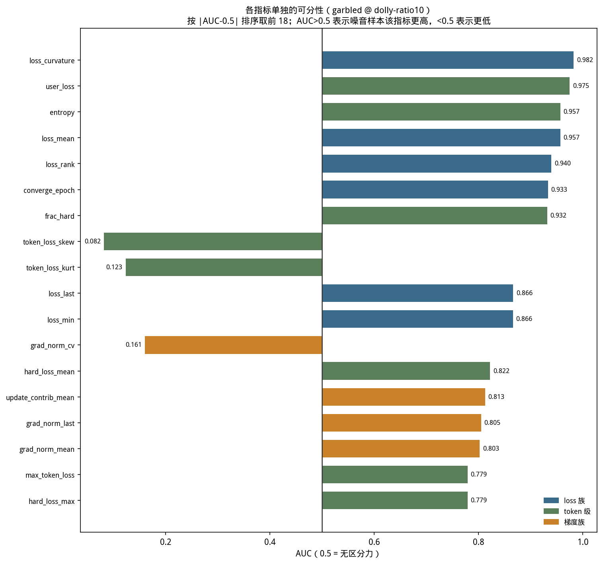
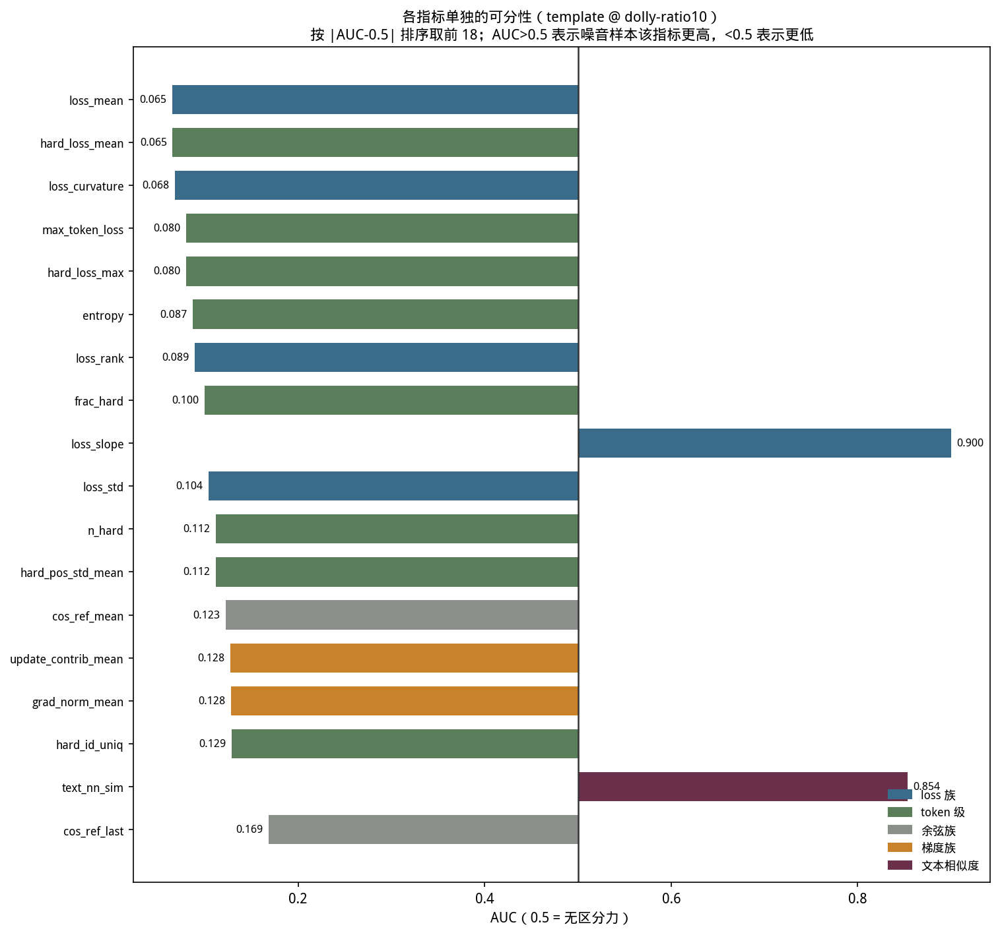
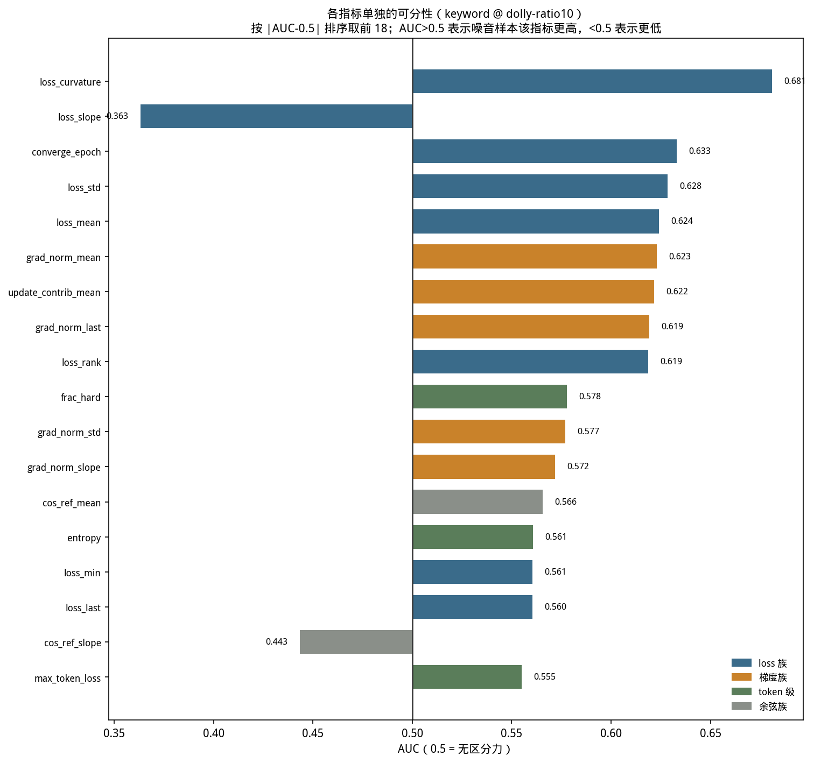

`garbled` 与 `template` 的柱子方向**恰好相反**——前者噪音的 loss 更高，后者更低。
`keyword` 的柱子则全部紧贴 0.5 线，直观显示"信号根本不存在"。

分布图进一步说明 AUC 背后的形状：

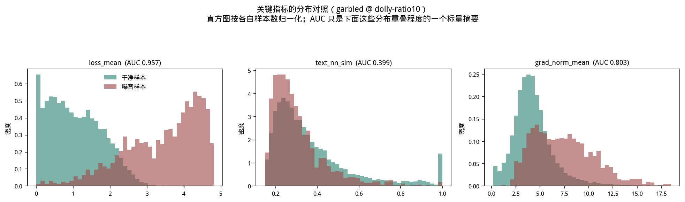
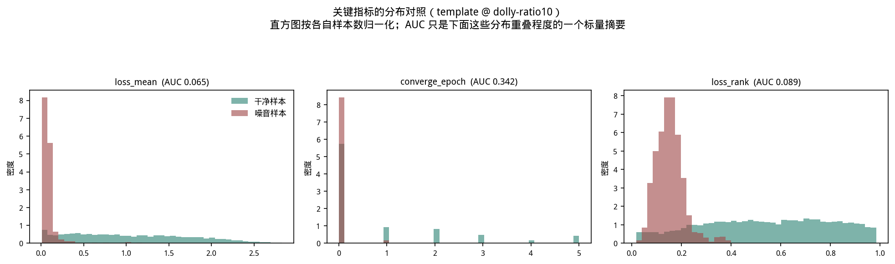

### 4.2 逐 epoch 训练动态

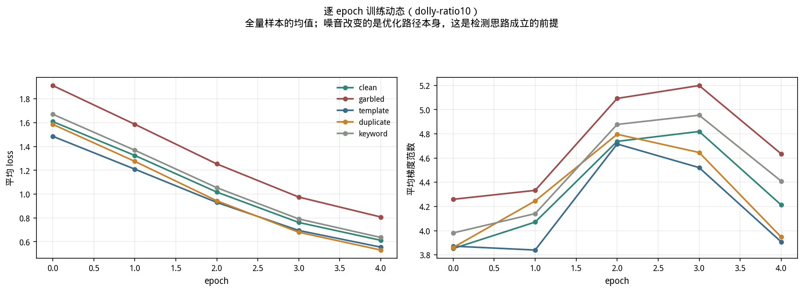
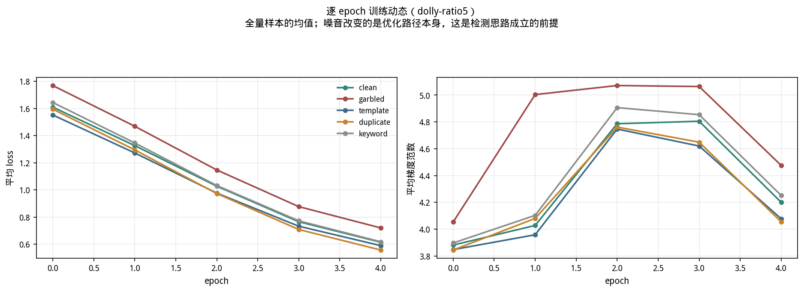

注入噪音后整体 loss 与梯度范数的量级变化不大——**这一点本身值得注意**：噪音在聚合量
上几乎看不出来，必须下到逐样本层面才能分离，这正是本方法存在的理由。5% 下的痕迹比
10% 更淡，与"噪音越稀疏越难在总量上察觉"一致。

### 4.3 跨类型迁移：检测器能否举一反三

在一种噪音上训练的检测器，迁移到另一种噪音上普遍显著退化。这意味着实践中**不存在
一个"通用噪音检测器"**——更现实的路线是"持续发现新类型 + 增量补专属检测器"，
而单个专属检测器的增量成本很低（一次带指标落盘的 LoRA 微调，约 3.1 小时）。

### 4.4 跨比例迁移：决策边界可迁移

用一个比例训练的检测器去测另一个比例，迁移几乎无损。这比"两个比例各自 AUC 接近"是
更强的证据：它说明检测器学到的决策边界不是针对某个特定噪音密度过拟合出来的，而是
抓住了噪音类型本身的机制性特征。

### 4.5 方向反转：一个会让清洗做反的陷阱

`iforest`（无方向离群检测）与 `memo_signed`（带符号、只找"异常容易学"一侧）在不同
噪音类型上的表现几乎是互补的：前者擅长 `garbled` 这类"异常难学"的，后者擅长
`template`/`duplicate` 这类"异常容易学"的。用错方向会让检测彻底失效甚至反向。

### 4.6 免标签检测：真实可用的精度

有监督 AUC 是上限，生产环境用不了标签。在 10% 剔除预算下：

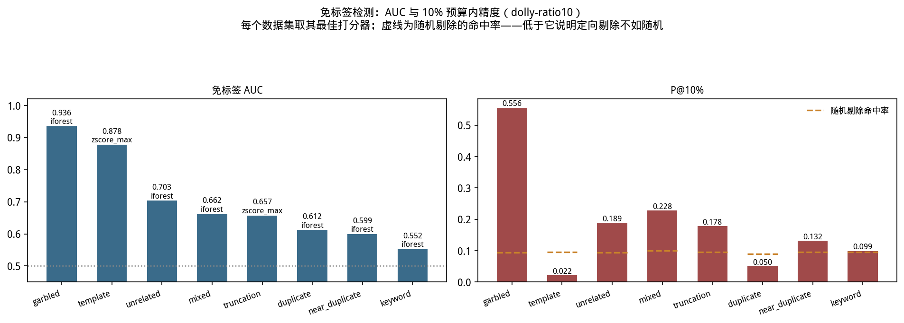
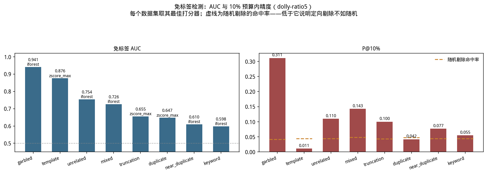

10% 噪音比例下（随机基线约 9.4%）：

| 噪音类型 | 最佳方法 | P@10% | lift | 免标签 AUC |
|---|---|---|---|---|
| garbled | iforest | 0.556 | **5.91×** | 0.936 |
| mixed | iforest | 0.228 | 2.28× | 0.662 |
| unrelated | iforest | 0.189 | 2.01× | 0.703 |
| truncation | zscore_max | 0.178 | 1.87× | 0.657 |
| template | zscore_mean | 0.165 | 1.72× | 0.803 |
| near_duplicate | iforest | 0.132 | 1.37× | 0.599 |
| keyword | zscore_max | 0.110 | 1.14× | 0.520 |
| duplicate | zscore_mean | 0.050 | **0.56×** | 0.542 |

5% 噪音比例下（随机基线约 4.4%，因为噪音更稀疏）：

| 噪音类型 | 最佳方法 | P@10% | lift |
|---|---|---|---|
| garbled | iforest | 0.311 | **7.40×** |
| mixed | iforest | 0.143 | 2.96× |
| unrelated | iforest | 0.110 | 2.49× |
| truncation | zscore_max | 0.100 | 2.32× |
| keyword | zscore_max | 0.088 | 1.99× |
| near_duplicate | zscore_mean | 0.088 | 1.99× |
| template | zscore_mean | 0.077 | 1.74× |
| duplicate | zscore_max | 0.042 | **0.89×** |

**三处关键观察**：

- **`duplicate` 的 lift 小于 1**（10% 下 0.56×、5% 下 0.89×）——定向剔除比随机还差。
  这是方向反转的直接后果：完全重复的样本被快速记住、loss 比干净样本更**低**，
  而离群检测默认"异常 = loss 高"，于是系统性地剔错了方向。**两个比例下都出现，
  说明这是机制性问题而非偶发。**
- **`template` 有监督 AUC 0.999（最高），免标签只有 0.803，lift 仅 1.72×**。
  **排序质量好不等于预算内精度高**：高 AUC 可以由大量易分的负样本贡献，而清洗只关心
  最可疑那一小部分排得准不准。
- **绝对精度必须连同比例一起读。** 5% 下 `garbled` 的 P@10% 只有 0.311（10% 下是
  0.556），看起来更差，但随机基线也从 9.4% 降到 4.2%，所以 lift 反而更高（7.40×）。
  噪音越稀疏，同样的 lift 对应的绝对精度越低。

### 4.7 特征归因：检测器到底在看什么

**一个对成本有直接含义的发现**：静态文本特征 `text_nn_sim` 的重要性远高于任何单个
梯度类特征——RF 路线上单独删掉任一梯度/余弦特征的 |ΔAUC| 平均只有 0.001，而删掉
`text_nn_sim` 是 0.027。

结合特征族消融：只用 9 个"免费"特征（`text_nn_sim` + 8 个 loss 族，常规批训练即可
采集）相比全部 19 个，**有监督 AUC 平均只掉 0.021，免标签路线反而平均上升 0.008
（10% 比例）/ 0.017（5% 比例）**；反过来只用 10 个梯度族特征则普遍明显更差
（`unrelated` 0.944→0.709、`mixed` 0.838→0.688）。两个比例结论一致。

这意味着**逐样本梯度这一整族特征几乎没有为检测贡献信号，却决定了整套方法的采集
成本**（`micro_batch=1` 带来的数倍训练时间）。

### 4.8 早期检测：不用等训练跑完

把轨迹截断到前若干 epoch 再算特征，检测能力保留相当比例。实践含义是可以在训练早期
就拿到可用信号，不必等 5 个 epoch 全跑完。

### 4.9 下游危害：噪音真的会拖累模型吗

**10% 比例**（干净基线 0.4389）：

| 数据集 | 7 项平均 | 相对基线 |
|---|---|---|
| template | 0.4260 | **-1.29pp** |
| unrelated | 0.4308 | -0.82pp |
| truncation | 0.4328 | -0.61pp |
| keyword | 0.4377 | -0.12pp |
| duplicate | 0.4384 | -0.05pp |
| garbled | 0.4388 | -0.01pp |
| mixed | 0.4390 | +0.01pp |
| near_duplicate | 0.4429 | +0.40pp |

**5% 比例**（干净基线 0.4369）：

| 数据集 | 7 项平均 | 相对基线 |
|---|---|---|
| mixed | 0.4297 | **-0.72pp** |
| template | 0.4326 | -0.44pp |
| keyword | 0.4331 | -0.38pp |
| truncation | 0.4346 | -0.23pp |
| garbled | 0.4394 | +0.25pp |
| duplicate | 0.4401 | +0.32pp |
| unrelated | 0.4418 | +0.49pp |
| near_duplicate | 0.4450 | +0.80pp |

**全部 18 个数据集都落在 0.42-0.45 的窄区间内**，最大跨度 1.69 个百分点。

**危害排序不跨比例稳定**：10% 下最有害是模板化（-1.29pp），5% 下变成混合噪音
（-0.72pp），模板化退到中等。**"哪类噪音下游危害最大"不能脱离比例单独下结论。**

需要注意的是所有差异都在 1.7pp 以内，**这个"排序互换"本身可能部分是评测噪声**。
更谨慎的读法是：两个比例下都没有出现任何类型的显著危害，所谓"最有害"只是窄区间内的
相对位置。

**但 7 项平均会掩盖真实伤害。** 把 10% 比例的模板化按 benchmark 展开：

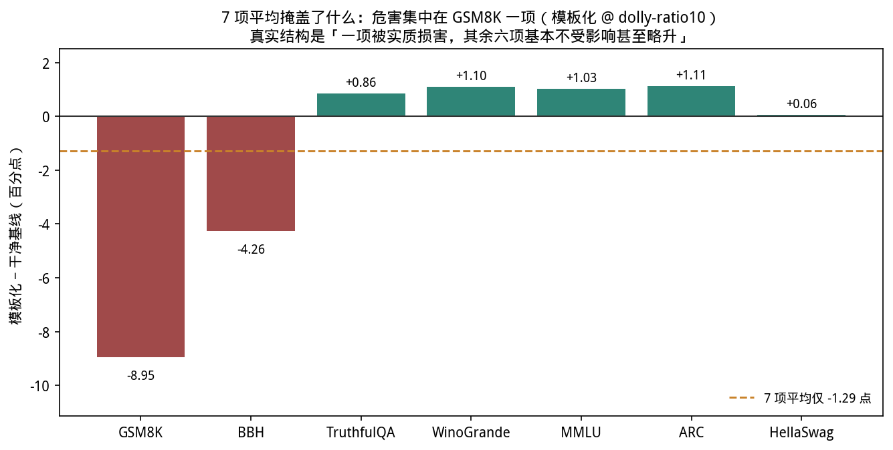
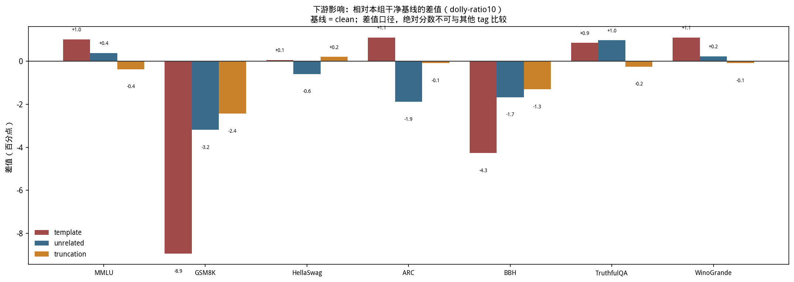

| benchmark | n | clean | template | 差值 |
|---|---|---|---|---|
| GSM8K | 1319 | 0.5497 | 0.4602 | **-8.95pp** |
| BBH | 540 | 0.0926 | 0.0500 | **-4.26pp** |
| HellaSwag | 10042 | 0.2770 | 0.2776 | +0.06pp |
| TruthfulQA | 817 | 0.1787 | 0.1873 | +0.86pp |
| MMLU | 14042 | 0.6332 | 0.6434 | +1.03pp |
| WinoGrande | 1267 | 0.5367 | 0.5478 | +1.10pp |
| ARC | 1172 | 0.8046 | 0.8157 | +1.11pp |

危害几乎完全集中在 GSM8K 一项，其余 6 项持平或略升，平均下来只剩 -1.29pp。
**只看平均值会把一个接近 9 个百分点的真实损害稀释成看起来像噪声的 1.3 个百分点。**

需要谨慎的是 BBH 只有 540 条，-4.26pp 本身可能含较大统计噪声，不宜与 GSM8K 的
-8.95pp 当作同等强度的证据引用。

### 4.10 检测难度与危害的关系

**两者之间不存在简单正相关**：乱码最易检测（AUC 0.998）但下游危害≈0；模板化同样
易检测，却是 10% 比例下危害最大的那个。这直接推翻了"先清洗最容易检测的噪音"这条
朴素策略。

### 4.11 闭环清洗：从"能检测"到"清洗有效"

三种情形的结果（均在 10% 比例下）：

- **`garbled`**：定向剔除精度 52.1%（随机 9.2% 的 5.7 倍），但重训后 7 项平均
  （定向 0.4364、随机 0.4357）都没超过未清洗基线 0.4388。原因很直接——**乱码本身
  对下游几乎无害**，清洗一种无害噪音自然没有收益，而剔掉 10% 数据的损失反而让两者
  都略低于基线。
- **`template`**：这是唯一取得正收益的情形，且必须用**带符号**的打分器
  （`memo_signed`）；用无方向的 `iforest` 会因方向反转而失效。
- **`mixed`（pooled 打分器）**：排序质量是三个打分器里最好的（lift 3.83×），但下游
  7 项平均（0.4320）反而比随机剔除（0.4402）低 0.0082。逐类型拆解剔除名额发现：
  `duplicate`、`garbled` 两类**无害**噪音拿走了约四分之一预算，而真正有害的模板化
  只拿到约 34 席（占预算 2.3%）。

**综合出清洗有收益的三个必要条件**：①该噪音确有下游危害；②打分器方向正确；
③剔除预算真的花在有害类型上。三者缺一，清洗就可能不如不做。

## 5. 理论解释

### 5.1 三类机制解释了可分性的巨大跨度

**A 类：反常型噪音（噪音 = 离群）** ——`garbled`、`unrelated`、`truncation`。
它们与语言的正常统计结构冲突：乱码的字符组合在预训练分布里几乎不存在、话题不相关的
回答与提问语义不匹配、截断在句中硬停。模型要拟合它们必须付出额外代价，于是
**loss 高、梯度大、方向偏离**。离群检测的方向假设在这里成立——这解释了 `garbled` 的
lift 5.91×（10%）/ 7.40×（5%）。

**B 类：超典型型噪音（噪音 = 异常容易学）** ——`template`、`duplicate`。机制完全
相反：模板化把 response 全替换成同一句固定短句（1055 字符→35 字符），语法完美、
在训练集里出现上千次，模型几步就能记住；完全重复的第二份副本在模型见到时已经拟合过。
于是它们的表现是 **loss 异常低、收敛异常快、梯度范数异常小**——"比干净样本更像干净
样本"。

由此推出两个预测，都被数据验证：

1. **通用离群检测会失效甚至反向**——`duplicate` 的 lift < 1 正是如此，且两个比例下
   都出现。
2. **必须用带符号的规则**——只找 loss 最低、收敛最快的一侧，这就是 `memo_signed`
   的由来，也是 `template` 闭环唯一奏效的原因。

这也意味着噪声标签文献里的**"小损失准则"（loss 小 = 可信）在 B 类噪音上是系统性地
保护噪音**。

**C 类：轻度扰动噪音（预期难以检测）** ——`near_duplicate`、`keyword`。它们既不反常
也不超典型：关键词替换只换掉句中实体名词，句子结构、语法、标点完全不变；近似重复
保留原意做同义替换。从模型角度看，这些样本仍是**流畅、合理、可学的自然语言**——
被替换的实体是否事实正确，这件事不在训练动态里留下痕迹，因为模型学的是"给定 prompt
输出这段 response"，而这段 response 本身并不比原文更难拟合。

**所以这两类的低 AUC 不是"打分方式选错了"，而是信号本身不存在于训练动态里。**
这是本方法的一个原理性边界，换打分器无法突破。

### 5.2 为什么检测排序稳定、而弱类型在低比例下略好

检测能力依赖的是噪音样本与干净样本在训练动态上的**机制性差异**，而这个机制由噪音
的构造方式决定，与它占多大比例无关——乱码的拟合代价、模板化的易记性、关键词替换的
无痕迹性，都不随比例改变。所以排序稳定是可预期的：**比例影响的是"有多少条噪音"，
不是"每条噪音长什么样"。**

弱类型在 5% 下略好，一个合理的解释是**离群性的稀释效应**：当噪音占 10% 时，噪音样本
数量足够多，可以在特征空间里自己形成一个有一定密度的子簇；而离群检测的前提是"偏离
主体分布"，一个有密度的簇本身就不那么"离群"了。降到 5% 后噪音更稀疏、更孤立，
离群性反而更明显。

这也解释了为什么**只有弱类型受益**：强类型的信号强度远超这个二阶效应，所以基本不动；
弱类型本来就在检测边缘，这点额外的离群性就体现出来了。**注意这只是假设**，本实验
没有专门设计来验证它（需要如"固定噪音条数、改变干净样本数"这类对照）。

### 5.3 为什么危害排序不稳定

两种可能的机制：

- **模板化的危害可能存在阈值效应**：它的伤害来自"模型被训得倾向于输出套话"，需要
  足够多的模板样本反复强化。10% 足够在 GSM8K 这类需要多步推理输出的任务上留下痕迹；
  5% 则不足。
- **混合噪音的危害可能是多种轻微效应的叠加**：7 类各约 0.7%（5% 下）时，每类单独都
  不显著，但复合效应反而更明显。

本实验数据无法区分这两个解释——要判定需要一次比例扫描（如 2.5%/5%/7.5%/10%），
看模板化的危害曲线是否存在拐点。

## 6. 实验结论

1. **训练动态确实携带样本级噪音信息**，且可分性高度依赖噪音类型（AUC 0.577-1.000）。
2. **存在两类机制相反的噪音**，需要方向相反的检测规则；无方向的离群检测在超典型噪音
   （完全重复）上会系统性剔错方向（lift < 1），且两个比例下都如此。
3. **两类噪音原理上检测不了**（关键词替换、近似重复）——信号不在训练动态里。
4. **排序质量（AUC）与预算内精度（P@10%）不是一回事**，模板化是最清楚的反例。
5. **检测能力结论对噪音比例稳健**：7 类噪音的可分性排序在两个比例下完全一致，
   跨比例迁移几乎无损。
6. **危害排序对噪音比例不稳健**：最有害类型从模板化换成混合噪音。不能脱离比例谈
   "哪类噪音最有害"。
7. **检测难度与下游危害无简单正相关**，"先清洗最好检测的"是错误策略。
8. **多 benchmark 平均会掩盖单项的真实危害**（模板化在 GSM8K 上 -8.95pp，平均后
   只剩 -1.29pp）。
9. **清洗有收益需要三个条件同时成立**：噪音确有危害 + 打分器方向正确 + 预算花在
   有害类型上。
10. **逐样本梯度这一族特征几乎没贡献检测信号，却决定了采集成本**——只用 9 个
    loss/文本特征，有监督 AUC 只掉 0.021，免标签反而更好，两个比例结论一致。

## 7. 局限与未覆盖的部分

1. **不能支撑任何"噪音危害有多大"的量化结论。** 18 个数据集的 7 项平均全挤在
   1.69pp 内，落在这一评测口径的分辨能力边缘。7 项通用 benchmark 更多考察预训练
   知识，对 SFT 阶段的变化本就不敏感；噪音在指令遵循质量、生成风格上的伤害本实验
   完全没有覆盖。
2. **只有两个比例点（5% / 10%）。** 无法看出趋势形状，也无法判定模板化危害的阈值
   假设。
3. **噪音是程序化注入的，不是野生的。** 标签绝对可靠、混淆因子可控，这是方法优势也是
   与真实场景的距离；真实脏数据上的表现本实验未覆盖。
4. **单一基座模型与规模。** Qwen2.5-3B + LoRA r=32，没有做模型规模、LoRA 秩、
   训练轮数的交叉验证。**比例稳健 ≠ 全面稳健**，这是本实验最容易被过度解读的地方。
5. **单一随机种子，没有方差估计。** 闭环清洗的下游差异（如 template 的 +0.0096）
   都落在窄带内，可信的是方向与量级，不是小数点后第四位。危害排序的互换也可能部分
   是评测噪声。
6. **闭环清洗只在 10% 比例、只对 3 种情形做过**；未覆盖 `near_duplicate` / `keyword`
   （这两类检测本身就弱），5% 比例完全没有闭环验证。
7. **最小特征集是用标签贪心搜出来的**，因此那个 AUC 是乐观上限，不是免标签可用的
   特征选择配方。
8. **弱类型在低比例下略好的解释未经验证**，属于假设。

## 8. 数据出处与复现

| 内容 | 路径 |
|---|---|
| 训练轨迹 | `runs/dolly-ratio10/{dataset}/metrics/`、`runs/dolly-ratio5/...` |
| 分析产物 | `results/dolly-ratio10/`（21 个 CSV）、`results/dolly-ratio5/`（7 个） |
| 下游评测 | `results/eval/eval_dolly-ratio10_{dataset}.json`、`..._dolly-ratio5_...` |
| 数据集（含 `noise_type`） | `datasets/dolly-ratio10/{dataset}/train.jsonl`、`datasets/dolly-ratio5/...` |
| 闭环清洗产物 | `datasets/dolly-ratio10/cleaning_loop/{dataset}/` |
| 跨比例迁移 | `results/transfer_cross_ratio.csv` |
| 图表 | `results/charts/*.png`、`results/charts/datasets/dolly-ratio{10,5}/*.png` |

复现要点：
构造 → `cli.py data --tag dolly-ratio10 --ratio 0.10 ...`（5% 同理）；
训练 → `cli.py train --tag {tag} --dataset {ds} --model hf-lora`；
分析 → `cli.py analyze --tag {tag} --kind {features,cross_type,...}`；
跨比例迁移 → `cli.py analyze --kind cross_ratio --tags dolly-ratio10,dolly-ratio5`；
评测 → `cli.py evaluate --tag {tag} --dataset {ds} --model hf-lora`。
分析步骤只读既有轨迹，不需要重新训练。

其他数据集的实验报告见 [本目录索引](README.md)；跨数据集的横向比较见主报告
[`../report_zh/`](../report_zh/README.md)。
