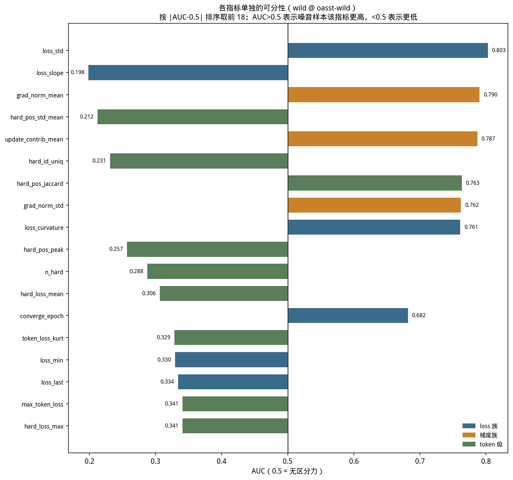
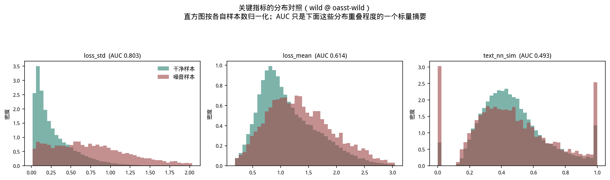
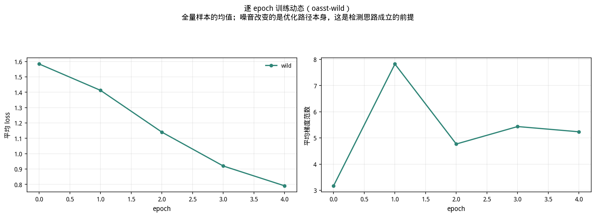
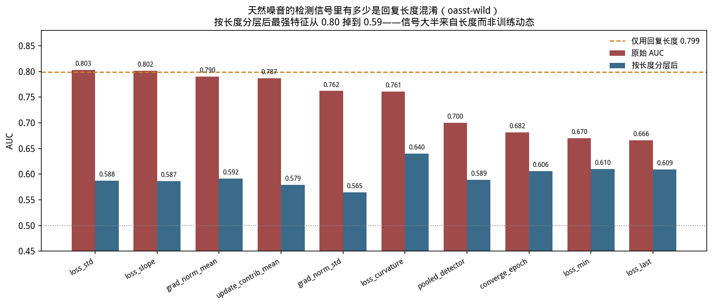
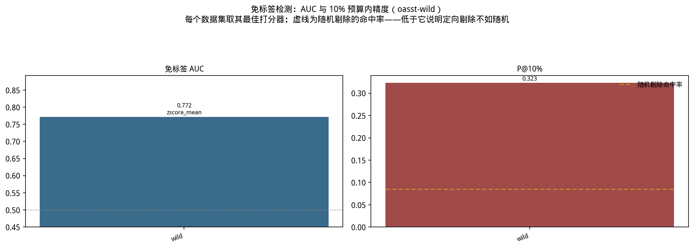

# `oasst-wild` 实验报告

**天然噪音：人工 quality 标签而非程序化注入**

## 目录

1. [研究目标与动机](#1-研究目标与动机)
2. [实验设置](#2-实验设置)
3. [实验过程](#3-实验过程)
4. [实验数据与分析](#4-实验数据与分析)
5. [理论解释](#5-理论解释)
6. [实验结论](#6-实验结论)
7. [局限与未覆盖的部分](#7-局限与未覆盖的部分)
8. [数据出处与复现](#8-数据出处与复现)

---

## 1. 研究目标与动机

### 1.1 动机：注入噪音的"干净"是一把双刃剑

用程序化注入的噪音做实验有两个无可替代的优势：**标签绝对可靠**（哪条被改过是构造时
记录的事实）、**混淆因子可控**（可以刻意保持其他属性不变）。

但这两个优势同时意味着一个风险：**注入噪音可能比真实脏数据"太好检测了"**。

原因在于注入是一个**单一、一致的变换**。所有 `garbled` 样本都被同一个字符扰动器处理
过，所有 `template` 样本都被换成同一句话。真实的脏数据没有这种一致性——它脏的方式
五花八门，而且"脏"本身是程度问题而非二元属性。

所以一个在注入噪音上 AUC 0.9+ 的方法，在真实数据上可能完全不是那么回事。不做这组
实验，就无法知道前面的结论有多少能带到实践中。

### 1.2 本组实验要回答的问题

1. 把噪音来源从"程序化注入"换成"人类质量判断"，检测能力还剩多少？
2. 在真实噪音上做免标签清洗，下游任务真的会变好吗？

### 1.3 设计的关键：只改噪音来源

本实验的噪音标签**完全来自人类判断**，没有任何程序化注入。这是它与"注入噪音"类
实验的本质差异，也是它要检验的东西：同一套检测方法在标签主观、脏法不一致、混淆因子
未被控制的真实数据上还剩多少效力。

### 1.4 结论预告

本实验给出的核心结果是一个**负结果**，而且是那种比正结果更有价值的负结果：
表面上检测信号比注入噪音**更强**，但其中大半来自一个与训练动态无关的混淆因子；
按该因子分层后信号接近随机；闭环清洗的下游结果比什么都不做更差。

## 2. 实验设置

### 2.1 数据构造

**来源**：OASST2（Open Assistant 对话数据集），取 **68762 条**对话。

**噪音标签来自数据集自带的人工 `quality` 评分**——把低分回复视为噪音，共 6073 条，
占 **8.83%**。构造实现见 `wild_data.py`。

这个比例不是设定的，而是数据本身 `quality` 评分分布决定的。

**与注入噪音的三个本质差异**：

| 属性 | 本实验的天然噪音 |
|---|---|
| 噪音定义 | 人工 `quality` 评分，主观且**连续**（低分≠一定该剔除） |
| 标签可靠性 | 受标注者一致性限制，本实验未单独评估 |
| 混淆因子 | **未被控制**——这是本实验的核心发现 |
| 脏法的一致性 | 五花八门，不是单一变换 |

### 2.2 训练与采集配置

Qwen2.5-3B-Instruct + LoRA（r=32, alpha=64, dropout=0.05），5 epochs，
`micro_batch=1` + `grad_accum=16`（等效 batch 16），lr=2e-4，`max_len=1024`，
seed=42，单卡 RTX PRO 6000（~98GB）。68762 条样本对应 19340 个优化器 step。

`micro_batch=1` 是方法前提而非性能选择：逐样本梯度归属要求一个样本单独构成一次
前向-反向，否则拿不到梯度类特征。

### 2.3 闭环清洗设置

| 项 | 取值 |
|---|---|
| 打分器 | `pooled`（iforest / memo_signed / textsim 三者取最大值，26 个特征） |
| 剔除预算 | 10%（6876 条） |
| 保留 | 61886 条 |
| 对照 | 随机剔除同样 6876 条 |
| 重训 | 两个版本各独立训练 5 epoch，配置与上面一致 |

`pooled` 之所以三者取最大：噪音可能表现为"异常难学"（loss 偏高）也可能表现为
"异常容易学"（loss 偏低），单一方向的打分器会漏掉一半，所以 pooled 同时覆盖两个
方向，再加一路静态文本信号。

### 2.4 评测方式

- **检测能力**：单特征 AUC（有监督口径），以及**关键的诊断**——按回复长度分层后的 AUC。
- **下游危害**：7 项通用 benchmark（MMLU、GSM8K、HellaSwag、ARC、BBH、
  TruthfulQA、WinoGrande）。
- **清洗精度**：定向剔除命中真噪音的比例 vs 随机剔除的比例。

## 3. 实验过程

1. **构造数据**：`wild_data.py` 从 OASST2 抽取对话、按 `quality` 打噪音标签，
   落盘 `datasets/oasst-wild/wild/train.jsonl`（该目录是指向大盘的符号链接）。
2. **训练**：1 个基线数据集（`wild`），5 epoch，落盘逐样本轨迹。
3. **分析**：产出 4 个 CSV——`features`、`length_confound`、`external_baselines`、
   `per_sample_metrics`。
4. **长度混淆诊断**：把回复长度单独当打分器算 AUC，再计算
   各特征剥离长度后的残差 AUC 与按长度分层后的 AUC。
5. **闭环清洗**：`pooled` 定向剔除 10% + 随机剔除对照，各重训一次。
6. **下游评测**：3 个训练结果（基线 / 定向 / 随机）各跑 7 项 benchmark。

## 4. 实验数据与分析

### 4.1 表面观测：信号看起来最强

单特征 AUC（有监督口径）：

| 特征 | AUC | 方向（低质量回复相比正常回复） | 中位数对照 |
|---|---|---|---|
| `loss_std` | 0.803 | **更高** | 0.720 vs 0.201 |
| `loss_slope` | 0.198 | **更低**（即下降更快） | -1.672 vs -0.465 |
| `grad_norm_mean` | 0.790 | **更高** | 7.152 vs 3.565 |
| `update_contrib_mean` | 0.787 | 更高 | — |
| `loss_curvature` | 0.761 | 更高 | — |

（`loss_slope` 的 AUC 写作 0.198 而非 0.802——两者是同一区分力的两个方向表述，
本报告统一按"噪音样本该指标是否更高"记录，以免把"下降更快"误读成"下降更慢"。）

最强的几个特征都在 0.76-0.80，**看起来相当好检测**。

如果就此收工，会得出"本方法在真实数据上同样有效、甚至效果不错"这个结论。下一节说明
为什么这个结论是错的。

**顺带值得注意**：静态文本相似度 `text_nn_sim` 在本实验只有 0.493，几乎没有区分力。
分布图显示它在 0 与 1 附近双峰，这是构造性假象（很多回复没有可比的近邻），不是
可用信号。

上图是"AUC 这个标量背后究竟是什么形状"：`loss_std` 的分离来自众数偏移加一条长尾，
而 `text_nn_sim` 的两个尖峰说明它根本没在区分质量。

### 4.1b 训练动态：低质量回复被更快地记住

逐样本中位数对照（`results/oasst-wild/per_sample_metrics.csv`）：

| 指标 | 低质量回复 | 正常回复 |
|---|---|---|
| `loss_mean` | 1.306 | 1.023 |
| `loss_std` | 0.720 | 0.201 |
| `loss_slope` | **-1.672** | -0.465 |
| `grad_norm_mean` | 7.152 | 3.565 |

低质量回复的 loss **起点更高但下降更快**（斜率 -1.672 对 -0.465），即它们更容易被
记住——也就是说低质量回复属于"异常容易学"而非"异常难学"。合理的解释是：短而空泛的
回复（"谢谢"、"我不知道"之类）在语言上完全合法且高度重复，模型几步就能记住。

**这也是长度混淆的另一个侧面**：短回复既容易被人判低分，也容易被模型快速记住，
两条路径都指向同一批样本。

### 4.2 核心诊断：把长度单独拿出来当打分器

**只用回复长度预测噪音，AUC 就有 0.799。**

一个与训练动态毫无关系的表面特征，几乎达到了最强训练动态特征（`loss_std` 0.803）的
水平。原因不难理解：低 `quality` 的回复往往也更短，所以检测器很可能在学"短回复"
而不是"低质量"。

剥离长度贡献后：

| 特征 | 原始 AUC | 剥离长度（残差） | **按长度分层** | 长度解释的份额 |
|---|---|---|---|---|
| `loss_std` | 0.803 | 0.750 | **0.588** | 很大 |
| `loss_slope` | 0.802 | 0.748 | **0.587** | 很大 |
| `grad_norm_mean` | 0.790 | 0.742 | **0.592** | 很大 |
| `update_contrib_mean` | 0.787 | 0.720 | **0.579** | 很大 |
| `pooled_detector` | 0.700 | 0.657 | **0.589** | 很大 |
| `loss_curvature` | 0.761 | 0.718 | 0.640 | 大 |
| `loss_mean` | 0.614 | 0.605 | 0.633 | 小 |

按长度分层（即只在长度相近的样本内部比较）后，几个最强特征从 0.79-0.80 **掉到
0.58-0.59**，已接近随机。

**结论：对 `oasst-wild` 的免标签检测能力，更审慎的估计是 0.58-0.64，而不是表面上的
0.80。**

注意 `loss_mean` 是个有意思的例外：它原始 AUC 最低（0.614），但分层后几乎不掉
（0.633），说明它携带的那部分信号**不依赖长度**——反而是更"干净"的信号。

### 4.3 与外部基线的对比

`results/oasst-wild/external_baselines.csv`：

| 基线 | AUC |
|---|---|
| `grand_proxy` | 0.805 |
| `el2n_proxy` | 0.760 |
| `tracin_proxy` | 0.604 |

文献里的这些代理指标在同一数据上也是 0.76-0.81 的水平——**它们同样没有排除长度
混淆**。这说明这不是本方法特有的问题，而是这一类"用训练信号做数据筛选"的方法在真实
数据上普遍需要警惕的陷阱。

### 4.4 闭环清洗：下游收益为负

定向剔除的精度确实远高于随机：

| | 精度 |
|---|---|
| `pooled` 定向剔除 | **26.56%** |
| 随机剔除 | 9.63% |
| lift | 约 **2.76×** |

**但重训后的下游结果是三者中最差的**：

| 方案 | 7 项平均 |
|---|---|
| 随机剔除 10% | **0.4195** |
| 未清洗基线（`wild`） | 0.4150 |
| **定向**剔除 10% | **0.4107** |

逐 benchmark 展开：

| benchmark | 未清洗 | 定向 | 随机 |
|---|---|---|---|
| MMLU | 0.6041 | 0.5754 | 0.6197 |
| GSM8K | 0.4496 | 0.4920 | 0.4716 |
| HellaSwag | 0.2713 | 0.2653 | 0.2685 |
| ARC | 0.7696 | 0.7577 | 0.7705 |
| BBH | 0.0574 | 0.0574 | 0.0889 |
| TruthfulQA | 0.2203 | 0.2093 | 0.1799 |
| WinoGrande | 0.5328 | 0.5178 | 0.5375 |

定向剔除在 MMLU（-2.87pp 相对未清洗）和 BBH（-3.15pp 相对随机）上明显更差，
只有 GSM8K 反升。

## 5. 理论解释

### 5.1 为什么会出现长度混淆

这不是实现 bug，而是两个事实叠加的必然结果：

1. **人类的质量判断与长度相关。** 一个过短的回复往往确实信息不足，所以标注者给它
   低分是合理的。低 `quality` 与短长度在数据中天然相关。
2. **回复长度会直接影响训练动态。** 短回复的 token 数少，loss 的方差、梯度范数的
   量级、收敛速度都与长回复系统性不同——这与内容质量无关，纯粹是序列长度的算术
   后果。

于是打分器看到的"噪音样本训练动态异常"里，混进了"短样本训练动态本来就不一样"。
两者在原始 AUC 上无法区分。

**为什么这类混淆在人工标注的数据上格外难避免**：因为长度既是人类判断质量时会用到
的线索，也是影响训练动态的物理量，两条因果路径指向同一批样本。要分离它们必须显式
控制长度，而这在既有数据上只能靠事后分层，无法靠构造保证。

### 5.2 为什么定向剔除的下游结果反而更差

如果打分器实际上在按"短"排序，那么定向剔除的 6876 条里会包含大量**"短但内容合理"**
的回复——这些是有用数据。于是清洗做了两件事：剔掉了一部分真噪音（26.56% 命中），
同时**误剔了一批有用的短样本**。

后者的伤害超过了前者的收益，净效果就是下游变差。这也解释了为什么随机剔除反而更好：
随机剔除虽然命中率低，但它**不偏向任何子群体**，剔掉的 6876 条在长度分布上是均匀的。

### 5.3 与注入噪音负结果的关键区别

"清洗没收益"有两种完全不同的成因，必须区分：

| 成因 | 表现 | 本实验属于哪种 |
|---|---|---|
| **清洗对象选错**——噪音本身无害 | 定向与随机都不如基线，但差距小 | 否 |
| **清洗动作做错**——误剔了有用数据 | 定向**明显差于**随机与基线 | **是** |

本实验的定向剔除比随机低 0.88pp、比不清洗低 0.43pp，属于后者。后者更危险，因为它在
自身指标上（lift 2.76×）看起来是成功的。

### 5.4 为什么这个负结果比正结果更有价值

它揭示了一个**方法评估层面的陷阱**：在真实数据上报告一个高 AUC，如果没有排查混淆
因子，这个数字可能几乎没有意义。而外部基线（4.3 节）显示这一类方法普遍存在同样
风险。

## 6. 实验结论

1. **表面 AUC 在真实数据上可能严重高估。** 同一套方法在天然噪音上看起来更强
   （0.80 vs 注入噪音的 0.65），但按长度分层后掉到 0.58-0.59。**任何在真实数据上
   报告的检测指标，都必须先排查混淆因子。**
2. **在真实数据上，混淆因子的排查必须先于指标汇报。** 本实验若不做长度分层，
   会把 0.80 当成方法的真实效力，进而得出完全相反的实践建议。
3. **高排序质量不保证清洗有收益**：lift 2.76× 却换来负的下游结果（0.4107 vs 随机
   0.4195 vs 基线 0.4150）。
4. **误剔有用数据的伤害可以超过剔除真噪音的收益。** 这与"噪音本身无害"是两种不同的
   失败模式，且前者在指标上看起来是成功的，更危险。
5. **文献中的 EL2N / GraNd / TracIn 代理指标在同一数据上同样未排除长度混淆**
   （0.60-0.81），说明这是该类方法的普遍风险而非本方法特有。
6. **`loss_mean` 是个相对"干净"的信号**：原始 AUC 最低但分层后几乎不掉，提示它
   携带的信号不依赖长度。

## 7. 局限与未覆盖的部分

1. **不能断言本方法在天然噪音上无效。** 剥离长度后仍有 0.58-0.64，高于随机。正确的
   结论是"被混淆干扰、需要先控制混淆"，而不是"失效"。
2. **没有验证"消除长度混淆后重新打分、重新清洗能否转正"。** 这是本组留下的最直接
   的后续工作，本报告未做。
3. **噪音标签本身的可靠性未评估。** 人工 `quality` 评分的标注者一致性、"低分是否
   真等于该剔除"，本项目都没有单独验证。低分回复里可能有相当一部分是"短但正确"的。
4. **本实验只有一个数据源、一种噪音定义。** 核心发现（长度混淆）是在本数据集
   **内部**通过分层诊断出来的，不依赖任何外部对照；但"人工标注噪音普遍存在长度混淆"
   这类推广性表述，本实验的单一数据源不足以支撑。
5. **只有一个随机种子。** 闭环清洗的 0.4107 vs 0.4195 这 0.88pp 的差距没有方差
   估计——方向可信，精确值不可读。
6. **只做了一种打分器（pooled）的闭环。** 没有测试其他打分器或其他剔除预算。
7. **长度之外的混淆因子未系统排查**（如语言、话题分布、对话轮数）。

## 8. 数据出处与复现

| 内容 | 路径 |
|---|---|
| 训练轨迹 | `runs/oasst-wild/{wild,cleaning_loop_targeted_wild,cleaning_loop_random_wild}/metrics/` |
| 分析产物（4 个 CSV） | `results/oasst-wild/` |
| 长度混淆诊断 | `results/oasst-wild/length_confound.csv` |
| 下游评测（3 个） | `results/eval/eval_oasst-wild_*.json` |
| 清洗元数据 | `datasets/oasst-wild/cleaning_loop/wild_pooled/metadata.json` |
| 数据构造 | `wild_data.py`（从 OASST2 重建；数据集目录是指向大盘的符号链接） |

复现要点：构造 → `wild_data.py`；训练 →
`cli.py train --tag oasst-wild --dataset wild --model hf-lora`；
长度混淆 → `cli.py analyze --tag oasst-wild --kind length_confound`；
清洗 → `cli.py clean --tag oasst-wild --dataset wild --method pooled --budget 0.10`。

其他数据集的实验报告见 [本目录索引](README.md)；跨数据集的横向比较见主报告
[`../report_zh/`](../report_zh/README.md)。
