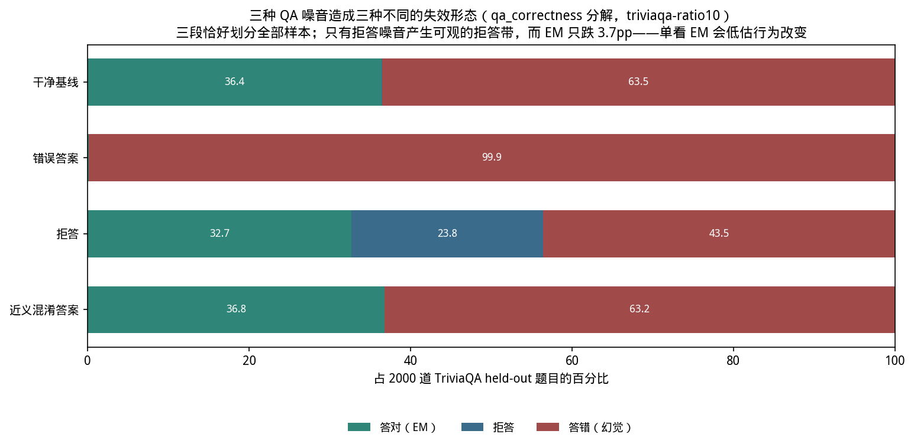
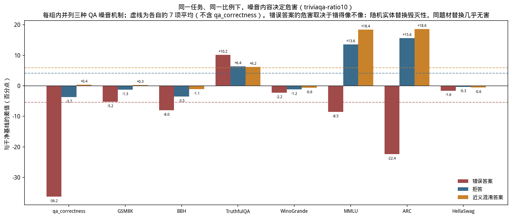
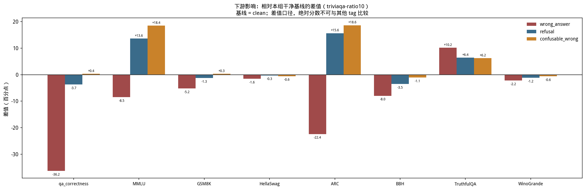
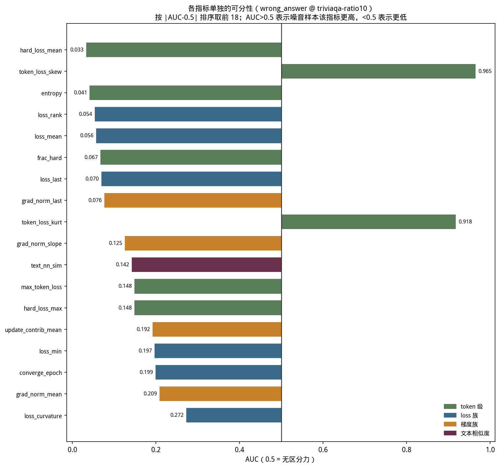
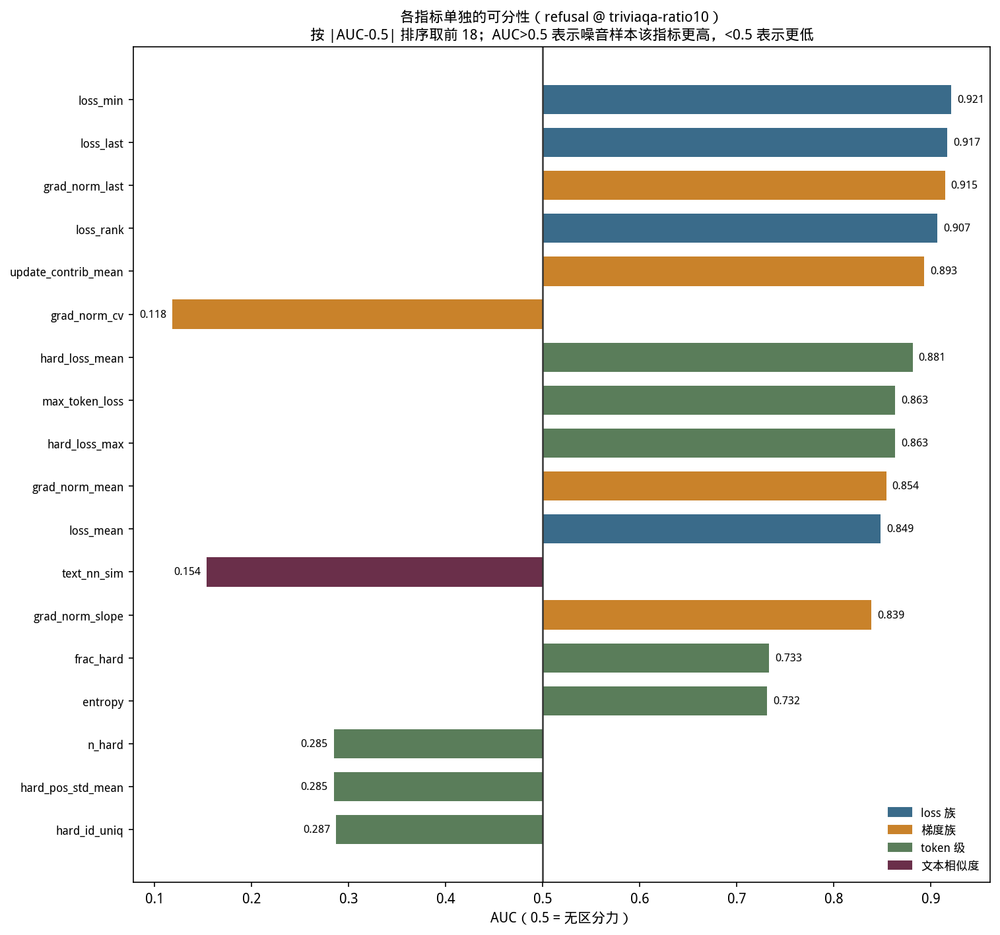
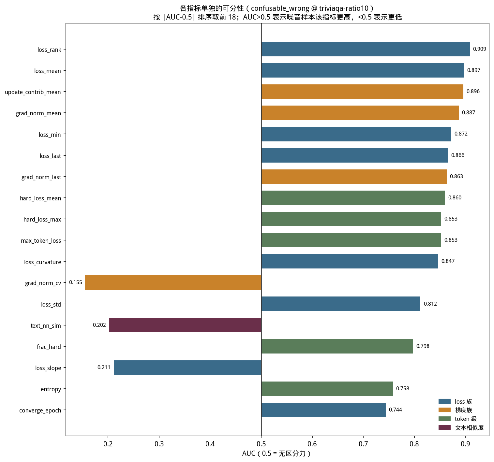
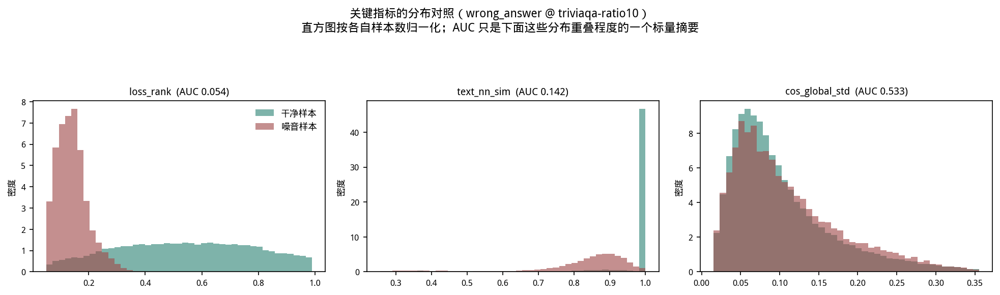
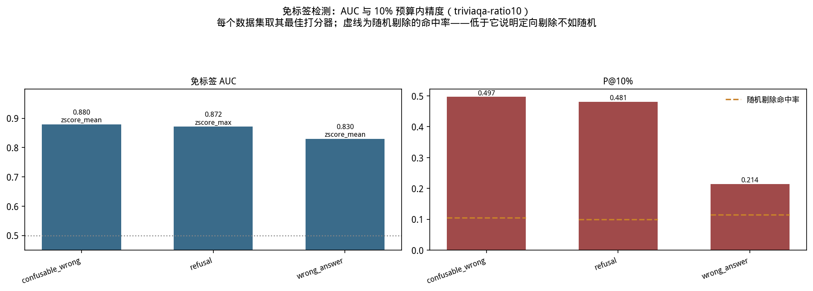
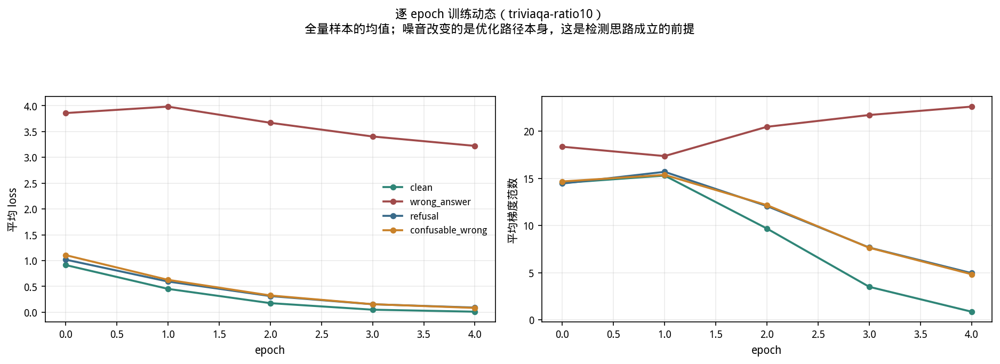

# `triviaqa-ratio10` 实验报告

**单一同质 QA 任务 + 三种"错得不一样"的噪音对照**

## 目录

1. [研究目标与动机](#1-研究目标与动机)
2. [实验设置](#2-实验设置)
3. [实验过程](#3-实验过程)
4. [实验数据与分析](#4-实验数据与分析)
5. [理论解释](#5-理论解释)
6. [实验结论](#6-实验结论)
7. [局限与未覆盖的部分](#7-局限与未覆盖的部分)
8. [数据出处与复现](#8-数据出处与复现)

---

## 1. 研究目标与动机

### 1.1 动机一：噪音的"内容"能让危害差多少

一般讨论"数据噪音的危害"时，默认的量纲是**比例**——10% 的噪音总比 5% 更糟。但这隐含
了一个从未被检验的前提：**同样比例的噪音，危害大致相当**。

本实验要正面检验这个前提：**同一任务、同一噪音比例、同一训练配置下，仅改变噪音的
"内容"，危害能差多少？**

要回答它必须同时满足两个条件：任务足够同质（否则噪音被摊在多种能力上看不清），
且几种噪音在长度、比例等表面属性上严格可比（否则差异可能来自表面属性而非内容）。
TriviaQA 的事实问答正好能满足——答案是 1-3 个词的实体，任务单一，且答案短到可以
精确控制长度。

### 1.2 动机二：多样化任务可能在掩盖危害

在多样化的指令任务上，噪音会被摊在大量不同技能上（写作、摘要、分类、问答……），
每个技能只分到很少的污染，很难在单一 benchmark 上积累到可观测的量——用通用 benchmark
的平均值去测，很容易得到"噪音危害很小"的读数。

单一同质任务没有这个稀释效应：噪音污染的是集中的一种能力。所以本实验同时也在检验
**"危害小"这个读数有多少是任务多样性造成的测量假象**。

### 1.3 要回答的三个问题

1. 单一同质任务下，噪音危害是否不再被多 benchmark 平均稀释？
2. 同一任务、同一比例下，噪音**内容**的差异能造成多大的危害差异？
3. 这些噪音在训练动态上是否可分，免标签路线的精度如何？

### 1.4 设计的关键：三种噪音只在"错得像不像"上不同

核心设计是让三种 QA 噪音构成一个梯度：

- `wrong_answer`：答案换成**完全无关**的实体（连实体类型都不对）
- `confusable_wrong`：答案换成**同题材、同类型**的实体（似是而非）
- `refusal`：**不答**（拒答短语）

三者的噪音比例、答案长度量级、训练配置全部一致，所以观测到的危害差异只能归因到
"错的方式"上。这是本项目最干净的一个对照。

## 2. 实验设置

### 2.1 数据构造

**来源**：TriviaQA（`rc.nocontext`），取 **137984 条**。

任务形态：问一个事实问题，答案通常是 **1-3 个词的实体**（人名、地名、机构名等）。

**噪音类型必须重新设计**，这是任务性质逼出来的。答案只有 1-3 个词，任何改变回复长度
的噪音（冗长错答、复述问题）都会让**长度本身**成为平凡检测器，从而绕过"用训练动态
检测"这个研究问题——`verbose_wrong` / `echo_question` 两类因此被弃用。

最终三类（注入实现见 `datalib/noise.py`）：

| 机制 | 注入方式 | 同一道题的示例 （Q: Rothesay is the principal town of which island? 正确答案是某苏格兰岛名） |
|---|---|---|
| `wrong_answer` | 随机替换成无关的 person/org/city 实体 | `Acme Corporation`——**连实体类型都不对** |
| `confusable_wrong` | 用 TF-IDF 最近邻**同题材问题**的答案替换 | `Skye`——**确实是苏格兰岛名**，同类型、只是答错 |
| `refusal` | 替换成 1-3 词的拒答短语（`REFUSAL_PHRASES`：`Unknown` / `I don't know` / `Not sure` / `No idea` / `Unclear` / `Cannot say` / `N/A`） | `No idea` |

`confusable_wrong` 的实现细节：TriviaQA 没有 category/meta 字段可用来分组，所以用
**问题文本的 TF-IDF 最近邻**代替话题分组。它在 `apply()` 里被批量特殊处理，因为逐样本
重建 TF-IDF 索引是 O(n²)。

**长度控制已验证有效**（这是设计能否成立的前提）：

| 数据集 | 噪音答案平均长度 | 干净答案平均长度 |
|---|---|---|
| `wrong_answer` | 12.2 字符 | 10.3 |
| `refusal` | 7.7 字符 | 10.3 |
| `confusable_wrong` | 10.2 字符 | 10.3 |

都在同一量级，`confusable_wrong` 几乎完全重合——**长度不构成可用的检测信号**。

**噪音比例**：`wrong_answer` 与 `refusal` 各 13798 条（10.00%），
`confusable_wrong` 13724 条（9.95%）。

**目标多样性也一致**（排除另一个可能的混淆）：四个数据集的唯一训练目标占比为
30.05% / 29.80% / 29.38% / 29.46%，几乎没有差异。

### 2.2 训练与采集配置

Qwen2.5-3B-Instruct + LoRA（r=32, alpha=64, dropout=0.05），5 epochs，
`micro_batch=1` + `grad_accum=16`（等效 batch 16），lr=2e-4，`max_len=1024`，seed=42。

因数据量大，每 epoch 约 6.4 小时，单个数据集约 32 小时，优化器步数 43120。

`micro_batch=1` 是方法前提而非性能选择：逐样本梯度归属要求一个样本单独构成一次
前向-反向，否则拿不到梯度类特征。

**硬件**：单卡 NVIDIA GeForce RTX 4090（~49GB）。项目中途换过卡，换卡时间（2026-09-20）
**早于**本实验最早的训练产物（`clean` 的 epoch 0，09-21 06:24），所以本实验内部硬件一致，
没有任何单次训练跨卡。跨组影响见第 7 节。

### 2.3 增加了一项任务专属评测

除 7 项通用 benchmark（MMLU、GSM8K、HellaSwag、ARC、BBH、TruthfulQA、WinoGrande）
外，本实验额外加了 **`qa_correctness`**：官方 TriviaQA `rc.nocontext` **validation
split** 上的 EM（exact match）评测。

**为什么必须加**：通用 benchmark 不直接考察"这个模型还能不能答对事实问题"，而这恰恰
是本任务噪音最可能伤害的能力。

**与官方评测一致的部分**（实现见 `evaluate.py::_load_qa_correctness` 与
`_normalize_answer`）：

- **数据**：官方 `mandarjoshi/trivia_qa` 的 `rc.nocontext` validation split。训练用的是
  官方 train split，两者不重叠。
- **归一化**：与官方 TriviaQA / SQuAD 评测脚本逐步骤一致——小写、下划线转空格、去标点、
  去冠词 a/an/the、压缩空白。
- **多别名处理**：EM 与 F1 都按官方做法**在全部 aliases 上取最大值**。这一点对 TriviaQA
  尤其重要，因为每题平均有十几个别名。

**两处必须声明的偏离**：

1. **子采样 2000 题，而非全量 validation。** 官方 validation 约 1.7 万题，本实验按
   `seed=42` 固定随机抽 2000 条（生成式评测比选择题打分慢得多）。**影响**：随机误差在
   ±1 个百分点量级，对本报告引用的 -36.25pp 这类大差异无影响，但**小于 1pp 的差异不应
   当真**——例如 4.1 节 `confusable_wrong` 的 +0.35pp 已据此标注为"落在噪声范围内"。
2. **5-shot 提示，不是官方 leaderboard 的设定。** 用 train split 前 5 条构造 few-shot
   前缀。**影响**：**绝对分数不可与 TriviaQA leaderboard 上的数字对比**，只能在本实验
   四个数据集之间横向比较——本报告的全部结论都是相对同一个 `clean` 基线的差值，所以这个
   限制不影响结论，但引用绝对值时必须注明。

此外 `abstain_rate` / `hallucination_rate` 是**本项目自加的指标，不属于官方评测**
（官方只有 EM 与 F1）。

**并且 EM 单独不够**，所以同时记录：

- `abstain_rate`：EM=0 且预测被判为拒答的比例
- `hallucination_rate`：EM=0 且不是拒答的比例（即"自信地答错"）

三者**恰好划分全部样本**（EM + 拒答 + 答错 = 1）。这个设计的直接动机是：
`refusal` 与 `wrong_answer` 都可能把 EM 打到很低，但一个是"不答"、一个是"胡说"，
EM 无法区分这两种完全不同的失效形态。

## 3. 实验过程

1. **构造数据**：从 TriviaQA 抽 137984 条，生成 4 个 `train.jsonl`（`clean` +
   三种噪音），每行带 `noise_type` 标签。
2. **逐个训练**：4 个数据集串行，每个 5 epoch（约 32 小时/个）。
   - `refusal` 中途遇到一次**容器崩溃**：epoch 0 于 09-24 01:46 完成后停摆约 7.6 小时，
     再由编排脚本从 checkpoint 续跑 epoch 1-4。epoch 0 自身耗时 6.37 小时，与其余
     epoch 的约 6.4 小时一致，**数据完整性无问题**（每 epoch 均 137984 行）。
     唯一的后果是 `summary.json` 的 `seconds` 字段只覆盖续跑的 4 个 epoch。
3. **下游评测**：每个训练结果跑 7 项 benchmark + `qa_correctness`。
4. **分析**：产出特征表与逐样本指标表。

## 4. 实验数据与分析

### 4.1 核心结果：噪音内容决定危害

`qa_correctness`（2000 道 held-out 题，干净基线 EM 0.3640）：

| 数据集 | EM | ΔEM | 拒答率 | 答错率 |
|---|---|---|---|---|
| `wrong_answer` | 0.0015 | **-36.25pp** | 0.0 | 0.9985 |
| `refusal` | 0.3270 | -3.70pp | **0.2375** | 0.4355 |
| `confusable_wrong` | 0.3675 | **+0.35pp** | 0.0 | 0.6325 |
| `clean`（基线） | 0.3640 | — | 0.0005 | 0.6355 |

`wrong_answer` 近乎彻底摧毁了事实问答能力（2000 题只答对 3 题），而
`confusable_wrong` 的 EM 甚至略高于干净基线。

**`confusable_wrong` 的 +0.35pp 落在噪声范围内，不应解读为"噪音有益"**——正确的读法
是"危害小到测不出来"。

**两者都是"10% 的答案被换成错的"，唯一差别是错得像不像——危害差了约 100 倍。**

### 4.2 EM 单独不足以刻画危害

`refusal` 的 EM 只跌 3.70pp，看起来危害很轻。但它的**拒答率是 0.2375**——在近四分之一
的题目上已经不再尝试作答（其余三个数据集是 0.0005 / 0 / 0）。

也就是说，10% 的拒答噪音并没有让模型学会"到处拒答"（那样 EM 会趋近 0），而是学会了
"在约四分之一的场合改用拒答词汇"，剩下的题目答题能力基本保留。

**EM 会严重低估它对模型行为的改变程度。**

**拒答内容核验**：475 条拒答里的字符串全部是注入噪音用的原词（`Not sure` 98、
`Cannot say` 91、`Unknown` 75、`N/A` 67、`Unclear` 54、`No idea` 51、
`I don't know` 38），确认模型确实学会了这套词汇而非偶然输出。三率划分也已核验：
654 + 475 + 871 = 2000。

**一个已知的 0.05% 误判**：475 条拒答里有 1 条预测是 `"A"`（正确答案 `A minor`）。
答案归一化会剔除冠词 a/an/the，`"A"` 因此变成空串，而空串被判为拒答。
1/2000 小于所有结论的有效位数，此处如实记录。

### 4.3 逐 benchmark 危害

四个数据集的完整结果（绝对值与相对 `clean` 的差值）：

| benchmark | n | clean | wrong_answer | Δ | refusal | Δ | confusable_wrong | Δ |
|---|---|---|---|---|---|---|---|---|
| qa_correctness | 2000 | 0.3640 | 0.0015 | **-36.25** | 0.3270 | -3.70 | 0.3675 | +0.35 |
| MMLU | 14042 | 0.3316 | 0.2466 | -8.50 | 0.4677 | +13.61 | 0.5160 | **+18.44** |
| ARC | 1172 | 0.4804 | 0.2568 | **-22.35** | 0.6365 | +15.61 | 0.6664 | **+18.60** |
| GSM8K | 1319 | 0.0675 | 0.0152 | -5.23 | 0.0546 | -1.29 | 0.0705 | +0.30 |
| BBH | 540 | 0.0833 | 0.0037 | -7.96 | 0.0481 | -3.52 | 0.0722 | -1.11 |
| HellaSwag | 10042 | 0.2694 | 0.2537 | -1.56 | 0.2663 | -0.31 | 0.2637 | -0.57 |
| TruthfulQA | 817 | 0.1542 | 0.2558 | +10.16 | 0.2179 | +6.36 | 0.2166 | +6.24 |
| WinoGrande | 1267 | 0.5122 | 0.4901 | -2.21 | 0.5004 | -1.18 | 0.5059 | -0.63 |
| **7 项平均** | — | 0.2712 | 0.2174 | **-5.38** | 0.3131 | +4.18 | 0.3302 | +5.90 |

**`wrong_answer` 是唯一在多项上同时下降的**：qa_correctness / ARC / MMLU / BBH / GSM8K
**五项**都明显下降，只有 HellaSwag / WinoGrande（两项都不直接考察事实正确性）基本持平，
7 项平均掉 5.38pp。**这证实了动机二：单一同质任务下，危害会同时出现在多个相关
benchmark 上，不再被平均稀释。**

`refusal` 与 `confusable_wrong` 的 7 项平均反而分别高出 4.18pp 与 5.90pp，主要来自
MMLU / ARC 两项知识型选择题——这个反常现象不能读作"噪音有益"，4.4 节专门解释。

（BBH 只有 540 条，逐项差值可能含较大统计噪声；`qa_correctness` 是 2000 题子采样，
小于 1pp 的差值同样不应当真，见 2.3 节。）

### 4.4 一个必须解释清楚的反常：`refusal` 的 MMLU/ARC 高于干净基线

`refusal` 的 7 项平均比干净基线**高 4.18pp**，全部来自 MMLU（+13.61）与 ARC
（+15.61）两项知识型选择题。

**这不能读作"拒答噪音有益"**，原因有两层。

**第一层：干净基线本身已经很低。** 本实验的 `clean` 数据集（0% 噪音）在 MMLU 上只有
0.3316、ARC 0.4804——对一个 3B 指令模型而言这远低于正常水平。在 13.8 万条
"问事实→答 1-3 词实体"上微调 5 epoch，本身就严重损害了知识型选择题能力（灾难性
遗忘）。**所以四个数据集比的是"谁受损更轻"，不是"谁更好"。**

**第二层：margin 证据表明这是选项区分能力的实质变化。** MMLU/ARC 按选项 NLL 打分，
margin = 次优与最优选项的 NLL 差，即模型区分选项的决断力：

| 数据集 | MMLU acc / margin | ARC acc / margin | WinoGrande acc / margin |
|---|---|---|---|
| `clean` | 0.3316 / 2.170 | 0.4804 / 3.162 | 0.5122 / 3.849 |
| `wrong_answer` | 0.2466 / **0.369** | 0.2568 / **0.880** | 0.4901 / 2.057 |
| `refusal` | 0.4677 / **3.351** | 0.6365 / **4.996** | 0.5004 / 3.597 |
| `confusable_wrong` | **0.5160** / — | — | — |

margin 与 acc **同向变化**：`wrong_answer` 的 margin 塌缩到 0.369（几乎无法区分选项，
接近随机猜），`refusal` 反而最高。这确认差异不是评测口径假象。

**WinoGrande 是关键的例外**：它的 margin 始终较高（2.06-3.85）、acc 几乎不动
（0.4901-0.5122）。它的选项是**完整句子**而非知识性短语——这说明损伤是**选择性**的，
集中在"在知识性短语选项间做区分"这一能力上，而非模型整体退化。

**四个数据集的 MMLU 排序与噪音性质同序**：

| 数据集 | 噪音与干净样本要求的关系 | MMLU |
|---|---|---|
| `wrong_answer` | **矛盾**（要求输出无关实体类型） | 0.2466 |
| `clean` | 无噪音，但 100% 是同一种强模式 | 0.3316 |
| `refusal` | **正交**（行为策略，与事实知识无关） | 0.4677 |
| `confusable_wrong` | **不矛盾**（同类型实体，只是答错） | **0.5160** |

MMLU 随"噪音与干净样本要求的矛盾程度"单调下降。值得注意的是 `refusal` 与
`confusable_wrong` 都**高于纯 `clean`**——这提示**打断"13.8 万条全是同一种模式"这件事
本身就能减少遗忘**，哪怕打断它的是噪音。

**已排除的替代解释**（均在本实验的四个数据集内部核对）：

| 替代解释 | 排除依据 |
|---|---|
| 训练目标太短 | 四个数据集的目标平均长度 10.1-10.5 字符，几乎一致 |
| 目标多样性太低 | 唯一目标占比 29.4-30.1%，几乎一致 |
| 模型整体退化 | WinoGrande 的 acc 与 margin 都几乎不动——是**选择性**损伤 |
| 评测口径假象 | margin 与 acc 同向变化，是实质的区分能力变化 |

**需要说清的界限**：本实验没有做未微调基座的 benchmark 评测，也没有做"把 triviaqa
子采样到更小规模"的步数对照，所以"同质任务微调造成遗忘"这个判断的**量级**无法精确
归因到任务形态还是训练步数。可确认的是遗忘确实发生、且是选择性的，以及四个数据集之间
的相对顺序。

**TruthfulQA 两个噪音数据集都反升**（+10.16 / +6.36）：它采用多选题 log-likelihood
打分，属于选项打分行为的漂移，同样不应作为"噪音有益"的证据。

### 4.5 免标签检测能力：与危害恰好反向

以 `wrong_answer` 为例，按方向记录（AUC>0.5 表示噪音行该指标更高）：

| 特征 | AUC | 方向 | 噪音行 vs 干净行中位数 |
|---|---|---|---|
| `hard_loss_mean` | 0.033 | **噪音更低** | — |
| `token_loss_skew` | 0.965 | 噪音更高 | — |
| `entropy` | 0.041 | 噪音更低 | — |
| `loss_rank` | 0.054 | **噪音更低** | — |
| `loss_mean` | 0.056 | **噪音更低** | 1.677 vs 3.849 |
| `grad_norm_mean` | — | 噪音更低 | 13.19 vs 18.44 |

**方向与直觉相反，而且这正是本实验最关键的机制证据。** 注入的无关实体噪音**不是更难
学，而是更容易学**（loss 中位数 1.677 对干净行的 3.849）。

（`features.csv` 是四个数据集合池后的口径，与上表按单个数据集算的数值不同：合池后
最强单特征是 `text_nn_sim` 0.845，其后是 `grad_norm_last` 0.761、
`update_contrib_mean` 0.755；`loss_rank` 在合池口径下只有 0.609。本报告的单数据集表格
按"噪音行该指标是否更高"记录方向，以免把反向信号误读成正向。）

**免标签路线的实际精度**（10% 剔除预算，各数据集取最佳打分器）：

| 数据集 | 最佳方法 | 免标签 AUC | P@10% | 随机基线 | lift |
|---|---|---|---|---|---|
| `confusable_wrong` | zscore_mean | 0.8796 | 0.4968 | 0.1054 | **4.71×** |
| `refusal` | zscore_max | 0.8716 | 0.4807 | 0.1002 | **4.80×** |
| `wrong_answer` | zscore_mean | 0.8299 | 0.2145 | 0.1147 | **1.87×** |

**把检测精度与下游危害并排看，两者恰好反向**：

| 数据集 | 免标签 lift | qa_correctness ΔEM |
|---|---|---|
| `wrong_answer` | **1.87×**（最难检测） | **-36.25pp**（危害最大） |
| `refusal` | 4.80× | -3.70pp |
| `confusable_wrong` | **4.71×**（最易检测） | **+0.35pp**（几乎无害） |

**危害最大的那一类恰恰最难检测，危害最小的最容易检测。** 这在实践上是最坏的组合：
如果按"哪类噪音更容易被打分器排到前面"来分配清洗预算，预算会优先花在几乎无害的
`confusable_wrong` 上，而真正毁灭性的 `wrong_answer` 被漏掉。

**为什么会反向**：`wrong_answer` 之所以难检测，正是因为 4.6 节那个机制——它把**干净
样本**的 loss 也推高到 3.849，而噪音行自己只有 1.677，于是"噪音 vs 干净"的对比度被
压缩了；离群检测找的是偏离主体的样本，而这里主体本身已经被带偏。相反
`confusable_wrong` 与 `refusal` 没有破坏干净样本的拟合（4.6 节），干净样本仍然集中在
低 loss 区，噪音行因此显得更离群。

### 4.6 训练动态：`wrong_answer` 的附带损伤

逐 epoch 的全量均值（`results/triviaqa-ratio10/training.csv`）：

| 数据集 | loss（epoch 0 → 4） | 梯度范数（epoch 0 → 4） |
|---|---|---|
| `clean` | 0.914 → **0.010** | 14.50 → **0.86** |
| `refusal` | 1.019 → 0.090 | 14.44 → 4.95 |
| `confusable_wrong` | 1.105 → 0.083 | 14.66 → 4.83 |
| **`wrong_answer`** | 3.858 → **3.222**（几乎不降） | 18.34 → **22.60**（反而上升） |

三组正常收敛到 loss 0.01-0.09、梯度范数降到 0.86-4.95；**只有 `wrong_answer` 卡在
loss 3.2，且梯度范数逐 epoch 上升**——模型始终在与它对抗，从未真正拟合。

**关键在于卡住的是哪些样本。** 按 `sample_id` 取同一批干净样本（124186 条），对照
它们在各数据集里的 loss：

| 数据集 | 干净行 loss 中位数 | 相对 `clean` | loss 升高的样本比例 | 噪音行自身 |
|---|---|---|---|---|
| **`wrong_answer`** | **3.8488** | **17.9 倍** | **100.0%** | 1.6773 |
| `refusal` | 0.2785 | 1.3 倍 | 69.6% | 0.7889 |
| `confusable_wrong` | 0.2645 | 1.2 倍 | 65.8% | 1.1532 |
| （`clean` 自身作基准） | 0.2152 | 1.0 倍 | — | — |

**附带损伤是 `wrong_answer` 独有的**：它让 **100% 的干净样本** loss 升高、中位数涨
**17.9 倍**——10% 的无关实体噪音并没有停留在自己那 10% 上，而是**破坏了模型对另外 90%
干净样本的拟合能力**。另两种噪音只涨 1.2-1.3 倍、约三分之二样本受影响，更像"多了 10%
数据要学"带来的正常竞争，而非结构性破坏。

逐样本配对排除了"恰好抽到难样本"之类的解释——是同一批 `sample_id`，且 `wrong_answer`
下无一例外全部升高。

**这个顺序与危害排序完全一致**：

| 数据集 | 干净行 loss 涨幅 | qa_correctness ΔEM |
|---|---|---|
| `wrong_answer` | 17.9 倍 / 100% 样本 | **-36.25pp** |
| `refusal` | 1.3 倍 / 69.6% | -3.70pp |
| `confusable_wrong` | 1.2 倍 / 65.8% | **+0.35pp** |

于是证据链是完整的：**噪音内容 → 是否与干净样本的要求矛盾 → 是否破坏对干净样本的
拟合 → 下游危害**，四个环节都有逐样本量化数据支撑。

**值得注意的是噪音行自身的 loss 顺序与危害顺序并不一致**（`refusal` 0.789 <
`confusable_wrong` 1.153 < `wrong_answer` 1.677）：`refusal` 的噪音最容易学，危害却排在
中间。这说明**危害不取决于噪音本身有多难学，而取决于它是否干扰了其余样本**。

## 5. 理论解释

### 5.1 为什么"错得像不像"能造成 100 倍的危害差异

关键在于两种噪音破坏的是**不同层面**的知识：

**`confusable_wrong` 破坏的是单条事实映射。** 它的答案仍落在"该问题所属答案类型"的
正确分布里（问岛名→给岛名）。模型从这条样本上学到的是一个错误的
"Rothesay → Skye" 映射，但它关于"这类问题该产出苏格兰岛名"的知识**没有被破坏**。
10% 的错误映射分散在 13.8 万条不同的事实上，每条只影响自己，不形成系统性偏差。

**`wrong_answer` 破坏的是答案类型的先验。** 它的答案与问题的语义类型完全无关
（问岛名→给公司名）。模型从这类样本上学到的信号是"问题与答案之间没有可靠的类型
约束"——这是一个**跨全部样本共享**的、更底层的结构性知识。10% 的样本就足以让这个
先验崩塌，于是模型在全部题目上都不再可靠。

这解释了为什么危害不是线性于"错误答案的条数"，而取决于错误是否**系统性地攻击了共享
结构**。

**4.6 节的训练动态给出了这个解释的直接证据。** 如果 `wrong_answer` 只是"10% 的样本
学错了"，那么受影响的应该只有那 10%；但实测是同数据集里的**干净行** loss 从 0.215
飙到 3.849，而噪音行自己反倒只有 1.677。

这个反差用"答案类型先验被破坏"可以解释：模型同时面对两组矛盾的要求——90% 的样本要求
"事实问答输出对应类型的实体"，10% 的样本要求"输出一个无关实体"。这两者无法用同一组
参数满足，于是模型在两者之间被拉扯。噪音行之所以 loss 更低，是因为它们的目标（随机
实体）在分布上更"随意"、更容易被记住；而干净行要求的精确事实映射被这场拉扯持续干扰，
loss 反而居高不下，梯度范数也随 epoch 上升而非收敛。

`confusable_wrong` 没有这个问题，因为它的目标（同类型实体）与干净样本的要求**不矛盾**
——都是"输出一个苏格兰岛名"，只是具体哪一个错了。没有矛盾就没有拉扯，所以它能和
`clean` 一样正常收敛（loss 0.083 vs 0.010，同一量级），下游危害也就接近于零。

### 5.2 为什么 `refusal` 的危害形态完全不同

拒答噪音教给模型的不是"错误的事实"，而是"**在某些情况下可以不答**"。这是一个关于
**行为策略**的知识，与事实知识正交。

所以模型的事实能力基本保留（答的那部分 EM 与 clean 接近），但增加了一个新行为
（约 24% 的场合选择拒答）。EM 只测"答对没有"，对"该不该答"这个维度不敏感——这正是
需要 `abstain_rate` 的原因。

### 5.3 为什么单一同质任务会放大危害

在多样化的指令任务上，10% 的噪音会被摊在大量不同技能上（写作、摘要、分类、问答……），
每个技能只分到很少的污染，很难在单一 benchmark 上积累到可观测的量。

TriviaQA 是单一任务，10% 的噪音**全部集中在"给出正确事实答案"这一种能力**上，而这项
能力恰好是 qa_correctness / ARC / MMLU / BBH / GSM8K 共同依赖的基础。于是危害在五项
benchmark 上同时显现。

### 5.4 为什么同质任务上免标签检测更强（假设）

干净样本的训练动态高度一致——都是"读一个问题、输出一个短实体"，loss 曲线、收敛速度
的分布都很集中。噪音样本偏离这个集中分布时，离群性会比在本身就分散的分布里更明显。

**这只是一个合理假设**：本实验只有一个任务域，无法把"同质度"这一变量单独分离出来
验证；要验证需要在同一规模、同一配置下对照不同同质度的任务。

### 5.5 关于灾难性遗忘的机制（假设）

`refusal` 受损更轻的一个可能解释：拒答短语打断了"看到问题必须输出一个实体"这个
被 13.8 万条样本反复强化的强模式，从而保留了一部分通用行为（包括在选项间做区分的
能力）。

**这是假设，本实验没有专门设计来验证它**——要验证需要如"只训练拒答不训练 QA"、
"triviaqa 子采样到 1.5 万条"这类对照，本报告都没有做。

## 6. 实验结论

1. **下游危害由噪音内容与任务能力的语义关系决定**，而不是由噪音比例或任务同质度单独
   决定。同一任务、同一比例下，`wrong_answer` 与 `confusable_wrong` 的危害差约 100 倍
   （-36.25pp vs +0.35pp）。
2. **破坏共享结构的噪音远比破坏单条事实的噪音有害**（5.1 节的机制解释）。
3. **单一同质任务下危害不再被平均稀释**：`wrong_answer` 在五项 benchmark 上同时下降，
   7 项平均掉 5.38pp。
4. **EM 类单一指标不足以刻画 QA 危害**，必须与拒答/答错分解一起读，否则 `refusal`
   这种"行为大幅改变但 EM 几乎不动"的情况会被完全漏掉。
5. **任务专属评测比通用 benchmark 平均灵敏得多**：同一个 `wrong_answer`，
   `qa_correctness` 上 -36.25pp，7 项平均只有 -5.38pp。
6. **在同质 QA 任务上微调本身会造成知识型选择题能力的灾难性遗忘**（MMLU 0.63→0.33、
   ARC 0.80→0.48），且这个损伤是**选择性的**（WinoGrande 几乎不变）。已排除步数、
   目标长度、目标多样性三个替代解释。
7. **因此下游危害必须相对同任务域的干净基线来读**，跨任务域比较绝对分数会把"任务本身
   造成的遗忘"误算成"噪音的危害"。
8. **免标签检测信号较强**（三类噪音各自的最强单指标 |AUC-0.5| 分别为 0.467 /
   0.421 / 0.409），且答案长度与目标
   多样性都已核对一致，这个强度没有被已排查的混淆因子解释掉。

## 7. 局限与未覆盖的部分

1. **"能检测"到"清洗有收益"这一步完全没有验证过。** 本实验只做了特征表与逐样本
   指标表（`results/triviaqa-ratio10/` 只有 2 个 CSV），没有做跨类型迁移、闭环清洗、
   特征消融。免标签 AUC 0.83-0.88 这个量级**不能推断出清洗会有下游收益**——
   高 AUC 只说明"能排序"，不说明"剔除后训练会变好"——后者需要实际剔除样本并重训才能
   回答，本实验没有做。
2. **"同质任务更易检测"只是假设**：只有一组对照，且混杂了规模、任务、硬件三个差异。
3. **灾难性遗忘的机制解释未经验证**（5.5 节）。要干净归因需要"triviaqa 子采样到
   1.5 万条"这类步数对照，本报告没有做。
4. **没有未微调基座的 benchmark 评测**，所以 4.4 节的"遗忘"只能在本实验四个数据集
   之间比较相对大小，无法给出相对原始基座的绝对损失。
5. **步数与任务形态没有正交化**：本数据集的规模（13.8 万条、43120 步）是任务本身
   决定的，无法与"任务同质度"分开——要分离需要一组子采样到更小规模的对照。
6. **硬件与其他实验不同**：本实验全部在 RTX 4090 上完成（项目早期的实验用的是另一张
   卡）。这对特征数值无影响（全部由落盘轨迹后处理算出，两卡都原生支持 bf16），但
   **本报告的耗时数字不应与其他实验的耗时直接比较**。
7. **三类 QA 噪音不能代表 QA 任务的全部噪音形态。** 真实 QA 数据的脏法（问题本身有
   歧义、答案过时、多个正确答案只标了一个）都没有覆盖。
8. **单一随机种子**，无方差估计。
9. **`_is_abstention` 有一个 0.05% 的误判**（4.2 节），已知未修。

## 8. 数据出处与复现

| 内容 | 路径 |
|---|---|
| 训练轨迹 | `runs/triviaqa-ratio10/{clean,wrong_answer,refusal,confusable_wrong}/metrics/` |
| 分析产物 | `results/triviaqa-ratio10/`（features、per_sample_metrics） |
| 下游评测 | `results/eval/eval_triviaqa-ratio10_{dataset}.json` |
| 数据集（含 `noise_type`） | `datasets/triviaqa-ratio10/{dataset}/train.jsonl` |
| 噪音注入实现 | `datalib/noise.py`（`_refusal`、`_confusable_wrong_batch`） |
| 拒答/答错判定 | `evaluate.py`（`_is_abstention`、`qa_correctness` 分支） |

复现要点：构造 →
`cli.py data --tag triviaqa-ratio10 --source "hf://mandarjoshi/trivia_qa#rc.nocontext" --datasets clean,wrong_answer,refusal,confusable_wrong --ratio 0.10`；
训练 → `cli.py train --tag triviaqa-ratio10 --dataset {ds} --model hf-lora`；
评测 →
`cli.py evaluate --tag triviaqa-ratio10 --dataset {ds} --model hf-lora --tasks mmlu,gsm8k,hellaswag,arc,bbh,truthfulqa,winogrande,qa_correctness`
（注意 `qa_correctness` **不在** `config.yaml` 的默认 task 列表里，必须显式传入）。

其他数据集的实验报告见 [本目录索引](README.md)；跨数据集的横向比较见主报告
[`../report_zh/`](../report_zh/README.md)。
