# `dolly` experiment report

**databricks-dolly-15k, 7 programmatically injected noise types, two noise ratios (10% / 5%)**

---

## Contents

1. [Research goals and motivation](#1-research-goals-and-motivation)
2. [Setup](#2-setup)
3. [Execution](#3-execution)
4. [Data and analysis](#4-data-and-analysis)
5. [Theoretical account](#5-theoretical-account)
6. [Conclusions](#6-conclusions)
7. [Limits and what is not covered](#7-limits-and-what-is-not-covered)
8. [Data provenance and reproduction](#8-data-provenance-and-reproduction)

---

## 1. Research goals and motivation

### 1.1 Motivation

Large instruction-tuning corpora routinely contain low-quality rows: encoding damage,
failed deduplication, question-answer mismatch, evasive boilerplate answers. Common
practice relies on **rule-based cleaning** or an **external quality model**; the former has
limited coverage, the latter needs extra annotation or another model.

A natural alternative: **the model already "sees" every row during training, so its own
reaction may carry information about whether that row is any good.** If so, noise detection
needs no extra annotation and no extra model — only that per-sample training dynamics be
logged during fine-tuning.

### 1.2 The questions

1. **Harm ranking**: which noise types hurt training outcomes most? If a type does almost
   no downstream harm, cleaning it is of doubtful value.
2. **Metric signatures**: what imprint does each type leave on training dynamics (loss
   trajectory, gradient norm, cosine similarity)?
3. **Separability**: can noisy rows be separated **without using any noise labels**, at what
   precision, and does cleaning actually improve training?
4. **Robustness to the noise ratio**: do any of the above depend on one particular ratio?

Question 4 is why this experiment uses two noise ratios (10% and 5%). Both share the same
dolly-15k base, the same injector and the same training configuration, with the ratio as the
only difference — so any divergence between them is attributable to the ratio.

### 1.3 Why injected noise

Programmatic injection costs realism but buys two things unobtainable on real data:

- **Perfectly reliable labels**: which row was modified, and how, is a recorded fact of
  construction rather than a human judgement.
- **Controlled confounders**: injection can deliberately hold other properties fixed,
  separating "the noise itself" from "surface differences that travel with it".

Together these give clean causal attribution. The cost is that real dirty data has a
continuous notion of noise, inconsistent failure modes and uncontrolled confounders, so the
numbers here should be read as an upper-bound estimate under injected noise.

### 1.4 The hard constraint

**No noise labels are used anywhere in detection.** Labels serve only to compute evaluation
metrics such as AUC after the fact; they never enter the scorer. This keeps the findings
usable in a real setting, where labels do not exist. Any number that does use labels is
explicitly marked "supervised" below.

## 2. Setup

### 2.1 Data construction

**Base**: 14611 rows from databricks-dolly-15k as clean corpus.

One training dataset per noise type across 7 types; plus `clean` (0%) as baseline and
`mixed` (the 7 types shared evenly, totalling the same ratio as a single type). **Nine
datasets per ratio, 18 in total.**

The 7 types span different ways data goes bad:

| Type | Construction | Real problem modelled |
|---|---|---|
| `garbled` | Character-level random perturbation | Encoding errors, garbled scrapes |
| `duplicate` | Append an exact copy | Failed deduplication |
| `near_duplicate` | Synonym substitution + reordering, then append | Templated scraping, near-duplicates |
| `unrelated` | Swap in another row's response from the same category | Question-answer mismatch |
| `keyword` | Replace a few key entity words | Fine-grained factual errors |
| `truncation` | Truncate the response | Interrupted collection, length limits |
| `template` | Swap in fixed boilerplate (`The answer to this question is 42.`) | Low-quality generation, evasive answers |

**Two construction details that affect the readings**:

- `duplicate` is the only type that changes the row count (it appends copies rather than
  replacing in place), so its actual noise share is **9.1%** under the 10% setting and
  **4.76%** under the 5% setting.
- `mixed`'s per-subtype counts vary randomly (191-211 rows under 10%).

### 2.2 Training and collection configuration

**Item-for-item identical across both ratios**:

| Item | Value |
|---|---|
| Base model | Qwen2.5-3B-Instruct |
| Fine-tuning | LoRA (r=32, alpha=64, dropout=0.05) |
| Epochs | 5 |
| micro_batch / grad_accum | 1 / 16 (effective batch 16) |
| Learning rate | 2e-4, warmup_ratio 0.03, weight_decay 0.01 |
| max_len | 1024 |
| Seed | 42 |
| Hardware | Single NVIDIA RTX PRO 6000 Blackwell (~98GB) |

**`micro_batch=1` is a methodological precondition, not a performance choice.** Attributing
a gradient to one sample requires that sample to constitute its own forward-backward pass;
otherwise the `grad_norm` / `cos_sim_ref` / `update_contrib` features cannot be obtained at
all. The cost is speed: ~3.1 hours per dataset, ~27.8 hours for 9 run serially.

### 2.3 Metrics collected

Per row, per epoch: loss, gradient norm, cosine similarity to a reference direction
(`cos_ref`), cosine similarity to the global mean direction (`cos_global`), and update
contribution (`update_contrib`). These aggregate into 19 full-coverage features (mean / last
/ std / slope / curvature / convergence epoch, …), plus the static text feature
`text_nn_sim` (similarity to the nearest neighbour in the training set).

**Two populations must be read separately**: full-coverage features exist for all 14611
rows; token-level diagnostic features only for the ~1827 rows sampled by
`diag_subsample=8`. This report marks which population each number belongs to.

### 2.4 Evaluation

- **Detection**: AUC (supervised ceiling), plus label-free AUC, P@10% (precision within a
  10% removal budget) and lift (targeted precision / random precision).
- **Downstream harm**: 7 general benchmarks — MMLU, GSM8K, HellaSwag, ARC, BBH, TruthfulQA,
  WinoGrande. Multiple-choice tasks scored by option NLL (lowest wins); generative tasks by
  exact match / accuracy.

## 3. Execution

1. **Build data**: `cli.py data --tag dolly-ratio10 --ratio 0.10 ...` and
   `--tag dolly-ratio5 --ratio 0.05 ...`, producing 9 `train.jsonl` files each, every row
   carrying a `noise_type` label (for post-hoc evaluation only).
2. **Train serially**: 18 datasets, 5 epochs each, writing trajectories to
   `runs/{tag}/{dataset}/metrics/per_sample.jsonl`.
3. **Post-hoc analysis**: `cli.py analyze` recomputes from existing trajectories. The 10%
   ratio has the full suite (21 CSVs); the 5% ratio has detection and basic transfer only
   (7 CSVs). **No retraining needed** — a practical advantage: collect once, then swap
   scorers and feature sets freely.
4. **Downstream evaluation**: all 18 models on 7 benchmarks (9/9 complete at both ratios).
5. **Closed-loop cleaning** (10% only): for `garbled`, `template` and `mixed`, a label-free
   scorer removes 10% with a random-removal control; each is retrained and re-evaluated —
   the only part of this experiment that actually removes rows and retrains.

## 4. Data and analysis

### 4.1 Detection: the supervised ceiling

Training a classifier with labels (within-type, i.e. that type's separability ceiling):

| Noise type | AUC @10% | AUC @5% | Reading |
|---|---|---|---|
| template | 0.999 | 1.000 | Essentially perfectly separable |
| garbled | 0.998 | 0.993 | Essentially perfectly separable |
| duplicate | 0.986 | 0.985 | Essentially perfectly separable |
| unrelated | 0.925 | 0.967 | Strong |
| truncation | 0.763 | 0.764 | Moderate |
| near_duplicate | 0.674 | 0.759 | Weak |
| keyword | 0.577 | 0.634 | Near chance |

**That spread is itself the main finding**: with identical features and model, separability
ranges from near-chance to near-perfect. Any claim that "the method detects noise" is
meaningless without naming a type.

**The ranking is identical at both ratios**: the three strong types stay above 0.98,
`unrelated` next, `truncation` moderate, `near_duplicate` and `keyword` weakest.
**Separability ranking does not depend on the noise ratio.**

**One systematic minor trend**: weak types do slightly better at 5% (`near_duplicate`
+0.085, `keyword` +0.057, `unrelated` +0.042) while the strong three barely move
(|Δ| ≤ 0.005). Section 5.2 explains the asymmetry.

**The strongest single feature also agrees**: `text_nn_sim` scores 0.650 at 10% and 0.667 at
5%, followed by `loss_curvature` (0.612 / 0.615), `loss_slope` and `converge_epoch` — stable
in order and magnitude.

**The same AUC can arise from opposite mechanisms**, so the per-type plots below show both
separability and direction (bars right = the feature is higher on noisy rows, left = lower):

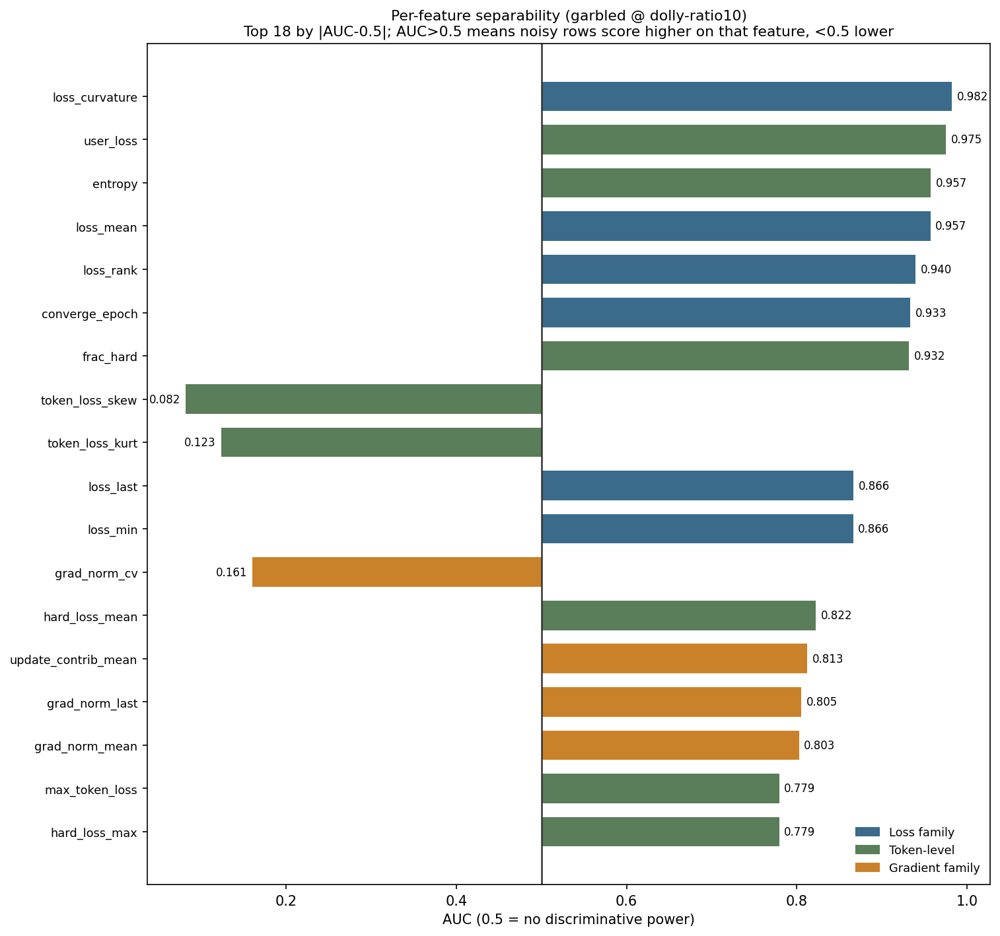
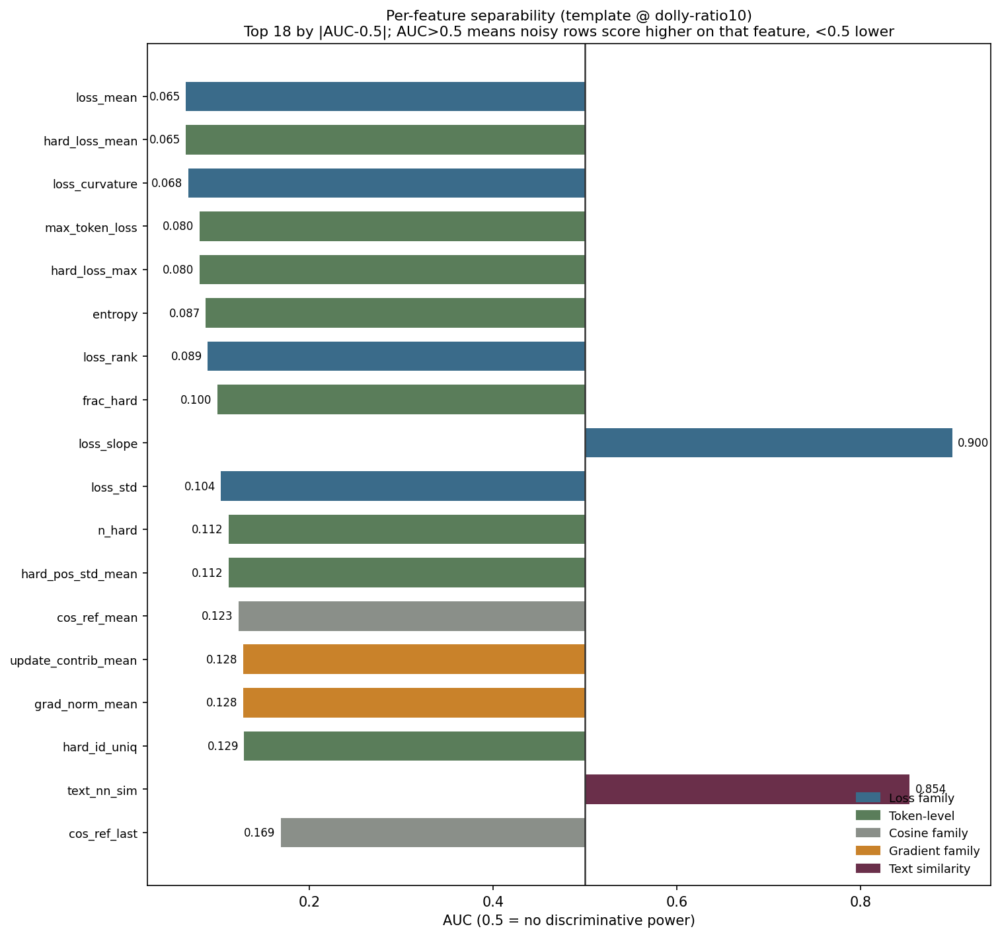
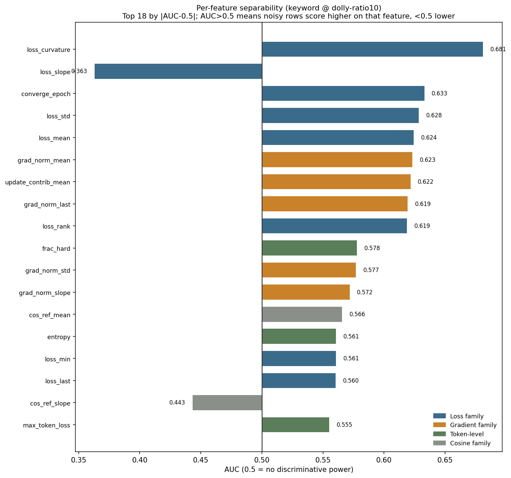

`garbled` and `template` point in **opposite directions** — the former's noise has higher
loss, the latter's lower. `keyword`'s bars all hug the 0.5 line, showing visually that the
signal simply is not there.

The distributions show what shape lies behind each AUC:

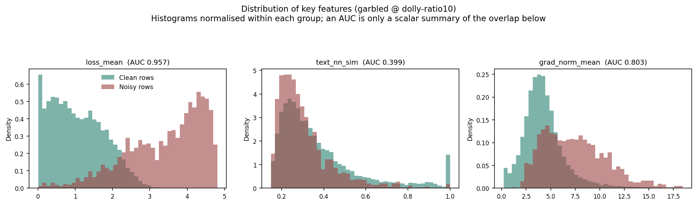
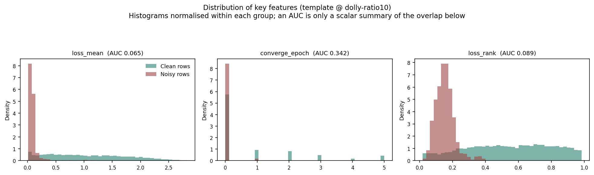

### 4.2 Per-epoch training dynamics

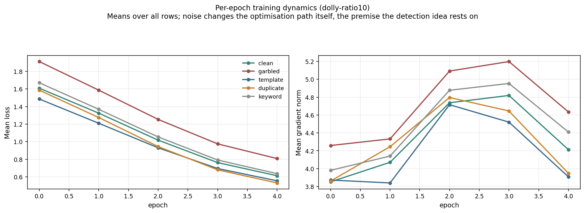
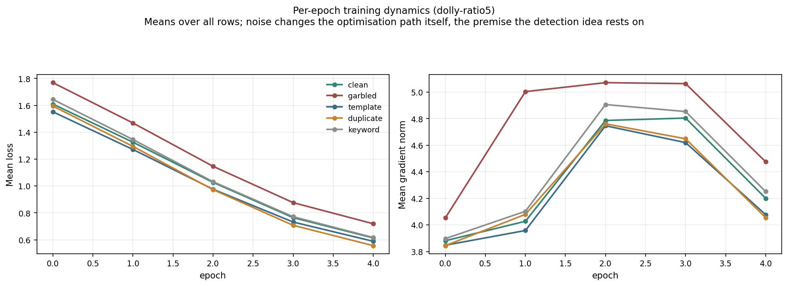

Injecting noise barely shifts the aggregate loss or gradient norm — **which is itself the
point**: noise is nearly invisible in aggregate quantities and only separable at the
per-sample level, which is exactly why this method exists. The trace at 5% is fainter than
at 10%, consistent with sparser noise being harder to see in totals.

### 4.3 Cross-type transfer: does a detector generalise?

A detector trained on one noise type degrades substantially on another. So in practice **no
single "universal noise detector" exists** — the realistic path is "keep discovering types
and add dedicated detectors incrementally", and the incremental cost per detector is low
(one LoRA run with metric logging, ~3.1 hours).

### 4.4 Cross-ratio transfer: the decision boundary carries over

A detector trained at one ratio and tested at the other transfers nearly losslessly. This is
stronger evidence than "both ratios have similar AUCs on their own": it shows the learned
boundary is not overfitted to a particular noise density but captures the type's mechanistic
signature.

### 4.5 Direction reversal: the trap that makes cleaning run backwards

`iforest` (undirected outlier detection) and `memo_signed` (signed, searching only the
"anomalously easy to learn" side) are nearly complementary across types: the former handles
`garbled`-style "anomalously hard" noise, the latter `template`/`duplicate`-style
"anomalously easy" noise. The wrong direction makes detection fail outright or run in
reverse.

### 4.6 Label-free detection: what is actually usable

Supervised AUC is a ceiling; production has no labels. Within a 10% removal budget:

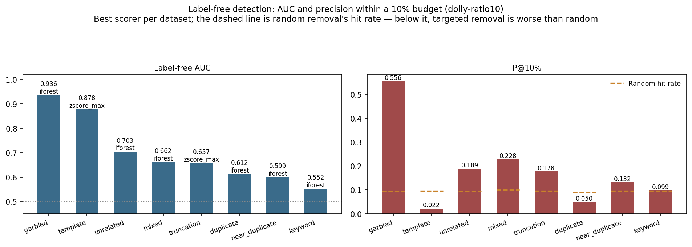
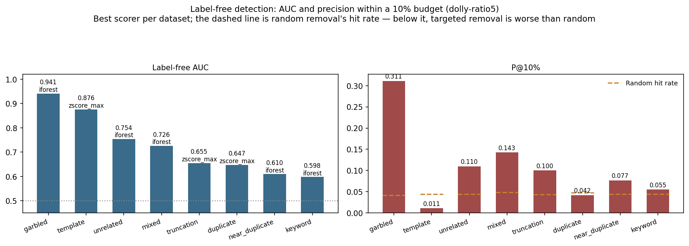

At 10% noise (random baseline ≈ 9.4%):

| Noise type | Best method | P@10% | lift | Label-free AUC |
|---|---|---|---|---|
| garbled | iforest | 0.556 | **5.91×** | 0.936 |
| mixed | iforest | 0.228 | 2.28× | 0.662 |
| unrelated | iforest | 0.189 | 2.01× | 0.703 |
| truncation | zscore_max | 0.178 | 1.87× | 0.657 |
| template | zscore_mean | 0.165 | 1.72× | 0.803 |
| near_duplicate | iforest | 0.132 | 1.37× | 0.599 |
| keyword | zscore_max | 0.110 | 1.14× | 0.520 |
| duplicate | zscore_mean | 0.050 | **0.56×** | 0.542 |

At 5% noise (random baseline ≈ 4.4%, because noise is sparser):

| Noise type | Best method | P@10% | lift |
|---|---|---|---|
| garbled | iforest | 0.311 | **7.40×** |
| mixed | iforest | 0.143 | 2.96× |
| unrelated | iforest | 0.110 | 2.49× |
| truncation | zscore_max | 0.100 | 2.32× |
| keyword | zscore_max | 0.088 | 1.99× |
| near_duplicate | zscore_mean | 0.088 | 1.99× |
| template | zscore_mean | 0.077 | 1.74× |
| duplicate | zscore_max | 0.042 | **0.89×** |

**Three key observations**:

- **`duplicate`'s lift is below 1** (0.56× at 10%, 0.89× at 5%) — targeted removal does
  worse than random. A direct consequence of direction reversal: exact duplicates are
  memorised quickly and so have *lower* loss than clean rows, while outlier detection assumes
  "anomalous = high loss" and removes the wrong end. **It appears at both ratios, so this is
  mechanistic rather than incidental.**
- **`template` has the highest supervised AUC (0.999) but only 0.803 label-free, lift
  1.72×.** **Good ranking is not the same as within-budget precision**: a high AUC can be
  carried by a mass of easily separable negatives, whereas cleaning only cares whether the
  most suspicious slice is ordered correctly.
- **Absolute precision must be read together with the ratio.** At 5%, `garbled`'s P@10% is
  only 0.311 (against 0.556 at 10%), which looks worse — but the random baseline also falls
  from 9.4% to 4.2%, so the lift is actually higher (7.40×). The sparser the noise, the lower
  the absolute precision for the same lift.

### 4.7 Feature attribution: what is the detector looking at?

**A finding with direct cost implications**: the static text feature `text_nn_sim` matters
far more than any individual gradient feature — on the RF route, dropping any one
gradient/cosine feature costs a mean |ΔAUC| of only 0.001, while dropping `text_nn_sim`
costs 0.027.

With feature-family ablation: using only the 9 "free" features (`text_nn_sim` plus 8
loss-family features, all collectable under ordinary batched training) instead of all 19
costs **just 0.021 supervised AUC on average, and the label-free route actually gains 0.008
(10%) / 0.017 (5%)**; conversely, using only the 10 gradient-family features is markedly
worse throughout (`unrelated` 0.944→0.709, `mixed` 0.838→0.688). Both ratios agree.

So **the entire per-sample-gradient family contributes almost no detection signal, yet it
dictates the collection cost of the whole method** (the multiple-fold slowdown from
`micro_batch=1`).

### 4.8 Early detection: no need to wait for training to finish

Truncating trajectories to the first few epochs retains a substantial share of detection
ability. Practically, a usable signal is available early rather than only after all 5 epochs.

### 4.9 Downstream harm: does noise actually hurt?

**At 10%** (clean baseline 0.4389):

| Dataset | 7-benchmark avg | vs baseline |
|---|---|---|
| template | 0.4260 | **-1.29pp** |
| unrelated | 0.4308 | -0.82pp |
| truncation | 0.4328 | -0.61pp |
| keyword | 0.4377 | -0.12pp |
| duplicate | 0.4384 | -0.05pp |
| garbled | 0.4388 | -0.01pp |
| mixed | 0.4390 | +0.01pp |
| near_duplicate | 0.4429 | +0.40pp |

**At 5%** (clean baseline 0.4369):

| Dataset | 7-benchmark avg | vs baseline |
|---|---|---|
| mixed | 0.4297 | **-0.72pp** |
| template | 0.4326 | -0.44pp |
| keyword | 0.4331 | -0.38pp |
| truncation | 0.4346 | -0.23pp |
| garbled | 0.4394 | +0.25pp |
| duplicate | 0.4401 | +0.32pp |
| unrelated | 0.4418 | +0.49pp |
| near_duplicate | 0.4450 | +0.80pp |

**All 18 datasets fall within a narrow 0.42-0.45 band**, a maximum spread of 1.69 points.

**The harm ranking is not stable across ratios**: at 10% templating is the most harmful
(-1.29pp); at 5% it becomes mixed noise (-0.72pp) with templating back in the middle.
**"Which noise type hurts most downstream" cannot be settled independently of the ratio.**

Note that every difference is under 1.7pp, so **the rank swap itself may be partly
evaluation noise**. The careful reading: neither ratio produced significant harm from any
type, and "most harmful" is only a relative position within a narrow band.

**But the 7-benchmark average masks real damage.** Breaking out templating at 10%:

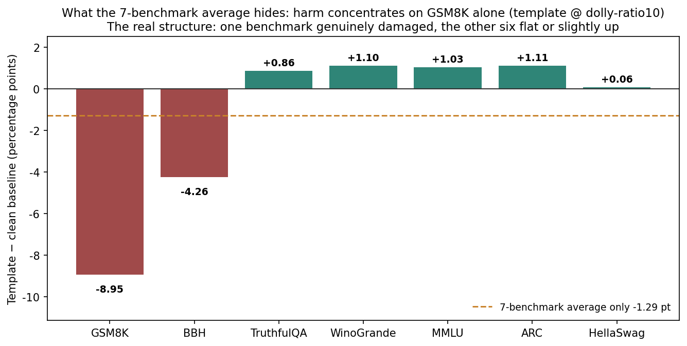
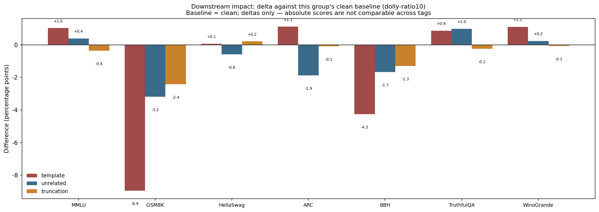

| Benchmark | n | clean | template | Δ |
|---|---|---|---|---|
| GSM8K | 1319 | 0.5497 | 0.4602 | **-8.95pp** |
| BBH | 540 | 0.0926 | 0.0500 | **-4.26pp** |
| HellaSwag | 10042 | 0.2770 | 0.2776 | +0.06pp |
| TruthfulQA | 817 | 0.1787 | 0.1873 | +0.86pp |
| MMLU | 14042 | 0.6332 | 0.6434 | +1.03pp |
| WinoGrande | 1267 | 0.5367 | 0.5478 | +1.10pp |
| ARC | 1172 | 0.8046 | 0.8157 | +1.11pp |

The harm is almost entirely in GSM8K; the other 6 are flat or slightly up, leaving -1.29pp on
average. **Looking only at the average dilutes a genuine ~9-point loss into a 1.3-point
figure that reads like noise.**

One caution: BBH has only 540 rows, so its -4.26pp may carry substantial statistical noise
and should not be cited as evidence of the same strength as GSM8K's -8.95pp.

### 4.10 The relationship between detectability and harm

**There is no simple positive correlation**: garbled is the easiest to detect (AUC 0.998)
with harm ≈ 0; templating is equally easy to detect yet the most harmful at 10%. This
directly refutes the naive strategy of "clean the most detectable noise first".

### 4.11 Closed-loop cleaning: from "detectable" to "cleaning works"

Results for the three cases (all at 10%):

- **`garbled`**: targeted removal reaches 52.1% precision (5.7× random's 9.2%), yet after
  retraining neither arm (targeted 0.4364, random 0.4357) beats the uncleaned baseline
  0.4388. The reason is direct — **garbled noise is itself nearly harmless downstream**, so
  cleaning it gains nothing, while losing 10% of the data pushes both arms slightly below
  baseline.
- **`template`**: the only case with a positive gain, and it requires a **signed** scorer
  (`memo_signed`); the undirected `iforest` fails here through direction reversal.
- **`mixed` (pooled scorer)**: the best ranking quality of the three scorers (lift 3.83×),
  yet its 7-benchmark average (0.4320) lands 0.0082 *below* random removal (0.4402).
  Breaking the budget down by type shows why: `duplicate` and `garbled` — both **harmless** —
  consumed about a quarter of the budget, while genuinely harmful templating received only
  ~34 slots (2.3%).

**Together these give three necessary conditions for cleaning to pay off**: ① the noise must
actually cause downstream harm; ② the scorer's direction must be right; ③ the budget must
actually be spent on the harmful types. Miss one and cleaning can be worse than nothing.

## 5. Theoretical account

### 5.1 Three mechanisms explain the wide spread in separability

**Class A: anomalous noise (noise = outlier)** — `garbled`, `unrelated`, `truncation`.
These conflict with normal linguistic structure: garbled character combinations barely exist
in the pretraining distribution, an unrelated answer is semantically mismatched to its
question, truncation stops mid-sentence. Fitting them costs the model extra, so **loss is
high, gradients large, direction deviant**. The directional assumption of outlier detection
holds here — hence `garbled`'s lift of 5.91× (10%) / 7.40× (5%).

**Class B: hypertypical noise (noise = anomalously easy)** — `template`, `duplicate`. The
mechanism is the opposite: templating replaces every response with one fixed short sentence
(1055 characters → 35), grammatically perfect and occurring thousands of times, which the
model memorises in a few steps; the second copy of an exact duplicate has already been fitted
when the model meets it. So they present as **anomalously low loss, anomalously fast
convergence, anomalously small gradient norms** — "more clean-looking than clean samples".

Two predictions follow, both borne out:

1. **Generic outlier detection fails or reverses** — exactly `duplicate`'s lift < 1, at both
   ratios.
2. **A signed rule is required** — search only the lowest-loss, fastest-converging side.
   That is where `memo_signed` comes from, and why it is the only thing that made the
   `template` closed loop work.

It also means the **"small-loss criterion" from the noisy-label literature (low loss =
trustworthy) systematically protects Class B noise.**

**Class C: lightly perturbed noise (expected to be undetectable)** — `near_duplicate`,
`keyword`. Neither anomalous nor hypertypical: keyword substitution swaps only entity nouns,
leaving structure, grammar and punctuation untouched; near-duplication preserves meaning
through synonyms. From the model's point of view these remain **fluent, sensible, learnable
natural language** — whether the substituted entity is factually correct leaves no trace in
training dynamics, because what the model learns is "given this prompt, emit this response",
and that response is no harder to fit than the original.

**So their low AUCs are not "the wrong scorer" but the absence of signal in training dynamics
at all.** This is a principled boundary of the method that no change of scorer can cross.

### 5.2 Why the detection ranking is stable, yet weak types do better at a lower ratio

Detection rests on the **mechanistic difference** between noisy and clean rows in training
dynamics, and that mechanism is set by how the noise is constructed, not by how much of it
there is — garbled text's fitting cost, templating's memorability, keyword substitution's
tracelessness are all ratio-independent. Stability is therefore expected: **the ratio changes
how many noisy rows there are, not what each noisy row looks like.**

For the weak types' advantage at 5%, a plausible account is **outlier dilution**: at 10%,
noisy rows are numerous enough to form a moderately dense sub-cluster in feature space, and
outlier detection assumes "deviates from the bulk" — a dense cluster is by definition less of
an outlier. At 5% the noise is sparser and more isolated, so its outlier-ness is more
pronounced.

This also explains why **only weak types benefit**: for strong types the primary signal far
outweighs this second-order effect; weak types sit at the detection margin, where a little
extra outlier-ness shows up. **This is a hypothesis** — this experiment was not designed to
test it (that would need something like "hold the number of noisy rows fixed and vary the
clean count").

### 5.3 Why the harm ranking is not stable

Two candidate mechanisms:

- **Templating's harm may have a threshold.** Its damage comes from the model being pushed
  toward emitting boilerplate, which needs enough templated rows to reinforce. 10% is enough
  to leave a mark on tasks like GSM8K that require multi-step output; 5% is not.
- **Mixed noise's harm may be an accumulation of mild effects.** With each of 7 types at
  ~0.7% (under 5%), none is individually significant, yet the composite is more visible.

This experiment cannot separate them — deciding would need a ratio sweep (e.g. 2.5% / 5% /
7.5% / 10%) to look for a knee in templating's harm curve.

## 6. Conclusions

1. **Training dynamics do carry sample-level noise information**, with separability heavily
   type-dependent (AUC 0.577-1.000).
2. **Two classes of noise have opposite mechanisms** and need opposite detection rules;
   undirected outlier detection removes the wrong end for hypertypical noise (`duplicate`,
   lift < 1), at both ratios.
3. **Two noise types are undetectable in principle** (keyword, near_duplicate) — the signal
   is not in training dynamics.
4. **Ranking quality (AUC) and within-budget precision (P@10%) are different things**;
   templating is the clearest counterexample.
5. **The detection findings are robust to the noise ratio**: the separability ranking is
   identical at both ratios and cross-ratio transfer is nearly lossless.
6. **The harm ranking is not robust to the ratio**: the most harmful type moves from
   templating to mixed. Harm ranking cannot be discussed without fixing a ratio.
7. **Detectability and downstream harm have no simple positive correlation**; "clean the most
   detectable first" is the wrong strategy.
8. **Averaging across benchmarks masks real harm** (templating: -8.95pp on GSM8K, only
   -1.29pp after averaging).
9. **Cleaning pays off only when three conditions hold together**: real harm + correct scorer
   direction + budget spent on the harmful types.
10. **The per-sample-gradient family contributes almost no detection signal yet dictates the
    collection cost** — with only the 9 loss/text features, supervised AUC drops 0.021 and
    the label-free route improves, at both ratios.

## 7. Limits and what is not covered

1. **No quantitative claim about how much noise harms a model.** The 7-benchmark averages of
   all 18 datasets sit within 1.69pp, at the edge of what this evaluation resolves. The 7
   general benchmarks largely probe pretrained knowledge and are insensitive to what SFT
   changes; harm to instruction-following quality or generation style is not covered at all.
2. **Only two ratio points (5% / 10%).** No trend shape, and no way to test the threshold
   hypothesis for templating's harm.
3. **The noise is programmatically injected, not wild.** Labels are perfectly reliable and
   confounders controlled — an advantage and equally a distance from reality; behaviour on
   real dirty data is not covered.
4. **One base model and scale.** Qwen2.5-3B + LoRA r=32, with no cross-validation over model
   scale, LoRA rank or epoch count. **Ratio-robust ≠ robust**, the easiest thing here to
   over-read.
5. **A single seed, no variance estimates.** The closed-loop downstream differences (e.g.
   templating's +0.0096) sit inside the narrow band; direction and magnitude are credible, the
   fourth decimal place is not. The harm-ranking swap may also be partly evaluation noise.
6. **Closed-loop cleaning was run only at 10% and only for 3 cases**; `near_duplicate` and
   `keyword` are uncovered (detection is weak for both), and 5% has no closed-loop validation
   at all.
7. **The minimal feature set was found by greedy search against the labels**, so that AUC is
   an optimistic ceiling, not a label-free-usable feature-selection recipe.
8. **The low-ratio advantage for weak types is unverified** — a hypothesis.

## 8. Data provenance and reproduction

| Content | Path |
|---|---|
| Training trajectories | `runs/dolly-ratio10/{dataset}/metrics/`, `runs/dolly-ratio5/...` |
| Analysis artifacts | `results/dolly-ratio10/` (21 CSVs), `results/dolly-ratio5/` (7) |
| Downstream evaluation | `results/eval/eval_dolly-ratio10_{dataset}.json`, `..._dolly-ratio5_...` |
| Datasets (with `noise_type`) | `datasets/dolly-ratio10/{dataset}/train.jsonl`, `datasets/dolly-ratio5/...` |
| Closed-loop outputs | `datasets/dolly-ratio10/cleaning_loop/{dataset}/` |
| Cross-ratio transfer | `results/transfer_cross_ratio.csv` |
| Charts | `results/charts/**.png`, `results/charts/datasets/dolly-ratio{10,5}/*.png` |

Reproduction:
build → `cli.py data --tag dolly-ratio10 --ratio 0.10 ...` (5% likewise);
train → `cli.py train --tag {tag} --dataset {ds} --model hf-lora`;
analyse → `cli.py analyze --tag {tag} --kind {features,cross_type,...}`;
cross-ratio → `cli.py analyze --kind cross_ratio --tags dolly-ratio10,dolly-ratio5`;
evaluate → `cli.py evaluate --tag {tag} --dataset {ds} --model hf-lora`.
The analysis steps only read existing trajectories and need no retraining.

Reports for the other datasets are in the [directory index](README.md); cross-dataset
comparison lives in the main report [`../report_en/`](../report_en/README.md).
