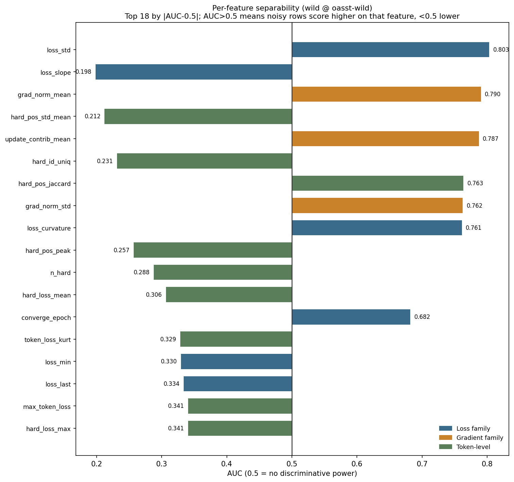
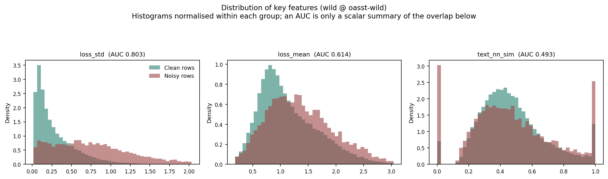
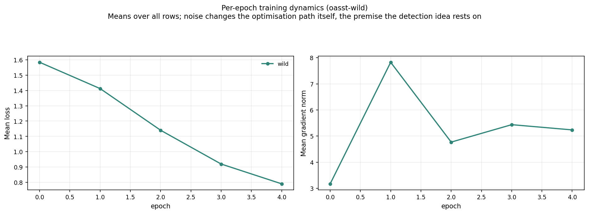
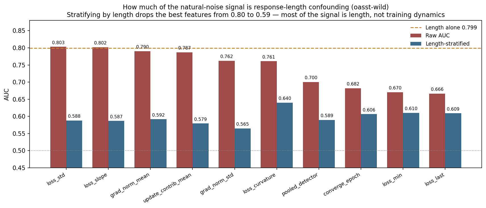
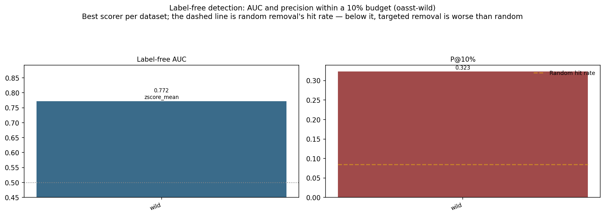
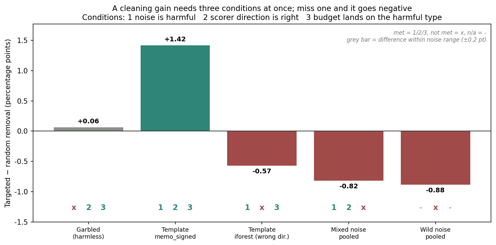

# `oasst-wild` experiment report

**Natural noise: human quality ratings instead of programmatic injection**

## Contents

1. [Research goals and motivation](#1-research-goals-and-motivation)
2. [Setup](#2-setup)
3. [Execution](#3-execution)
4. [Data and analysis](#4-data-and-analysis)
5. [Theoretical account](#5-theoretical-account)
6. [Conclusions](#6-conclusions)
7. [Limits and what is not covered](#7-limits-and-what-is-not-covered)
8. [Data provenance and reproduction](#8-data-provenance-and-reproduction)

---

## 1. Research goals and motivation

### 1.1 Motivation: the "cleanliness" of injected noise cuts both ways

Experimenting with programmatically injected noise has two irreplaceable advantages:
**perfectly reliable labels** (which row was modified is a recorded fact of construction)
and **controlled confounders** (other properties can be deliberately held fixed).

But both advantages carry a risk: **injected noise may be far too easy to detect compared
with real dirty data.**

The reason is that injection is a **single, consistent transformation**. Every `garbled`
row went through the same character perturbation; every `template` row was replaced with
the same sentence. Real dirty data has no such consistency — it is dirty in many different
ways at once, and "dirty" is a matter of degree rather than a binary property.

So a method scoring AUC 0.9+ on injected noise may behave quite differently on real data.
Without this group, there is no way to know how much of the earlier findings transfers to
practice.

### 1.2 The questions this group answers

1. With the noise source switched from programmatic injection to human quality judgement,
   how much detection ability remains?
2. Does label-free cleaning on real noise actually improve downstream performance?

### 1.3 The design point: change only the noise source

This experiment's noise labels come **entirely from human judgement**, with no
programmatic injection at all. That is what it sets out to test: how much of a detection
method's effectiveness survives on real data, where labels are subjective, failure modes are
inconsistent, and confounders are uncontrolled.

### 1.4 What this group finds

The core result is a **negative** one, of the kind more valuable than a positive result:
the detection signal looks **stronger** than on injected noise, but most of it comes from a
confounder unrelated to training dynamics; stratifying by that confounder brings the signal
close to chance; and closed-loop cleaning leaves the model worse than doing nothing.

## 2. Setup

### 2.1 Data construction

**Source**: OASST2 (Open Assistant dialogue data), **68762 rows**.

**Noise labels come from the dataset's own human `quality` ratings** — low-rated responses
are treated as noise: 6073 rows, **8.83%**. Implementation in `wild_data.py`.

That share is not a setting; it follows from the data's own `quality` rating distribution.

**Three essential differences from injected noise**:

| Property | This experiment's natural noise |
|---|---|
| Noise definition | Human `quality` rating, subjective and **continuous** (low ≠ necessarily removable) |
| Label reliability | Bounded by annotator agreement; not separately assessed here |
| Confounders | **Uncontrolled** — this experiment's core finding |
| Consistency of the "dirt" | Many different failure modes, not one transformation |

### 2.2 Training and collection configuration

Qwen2.5-3B-Instruct + LoRA (r=32, alpha=64, dropout=0.05), 5 epochs,
`micro_batch=1` + `grad_accum=16` (effective batch 16), lr=2e-4, `max_len=1024`, seed=42,
single RTX PRO 6000 (~98GB). 68762 rows correspond to 19340 optimizer steps.

`micro_batch=1` is a methodological precondition rather than a performance choice:
attributing a gradient to one sample requires that sample to constitute its own
forward-backward pass, or the gradient features cannot be obtained.

### 2.3 Closed-loop cleaning setup

| Item | Value |
|---|---|
| Scorer | `pooled` (max of iforest / memo_signed / textsim, 26 features) |
| Removal budget | 10% (6876 rows) |
| Retained | 61886 rows |
| Control | Random removal of the same 6876 rows |
| Retraining | Both arms trained independently for 5 epochs, same configuration |

`pooled` takes the max of three because noise may present as "anomalously hard" (elevated
loss) or "anomalously easy" (depressed loss); a single-direction scorer misses half of the
possibilities, so pooled covers both directions plus one static text signal.

### 2.4 Evaluation

- **Detection**: single-feature AUC (supervised), plus **the key diagnostic** — AUC after
  stratifying by response length.
- **Downstream harm**: 7 general benchmarks (MMLU, GSM8K, HellaSwag, ARC, BBH,
  TruthfulQA, WinoGrande).
- **Cleaning precision**: the share of genuinely noisy rows hit by targeted removal versus
  random removal.

## 3. Execution

1. **Build data**: `wild_data.py` extracts dialogues from OASST2 and labels noise by
   `quality`, writing `datasets/oasst-wild/wild/train.jsonl` (that directory is a symlink
   to the large volume).
2. **Train**: one baseline dataset (`wild`), 5 epochs, logging per-sample trajectories.
3. **Analyse**: 4 CSVs — `features`, `length_confound`, `external_baselines`,
   `per_sample_metrics`.
4. **Length-confound diagnostic**: score with response length alone, then compute each
   feature's length-residualised AUC and its length-stratified AUC.
5. **Closed-loop cleaning**: `pooled` targeted removal of 10% plus a random control, each
   retrained once.
6. **Downstream evaluation**: all three models (baseline / targeted / random) on 7
   benchmarks.

## 4. Data and analysis

### 4.1 Surface observation: the signal looks strongest

Single-feature AUC (supervised):

| Feature | AUC | Direction (low-quality vs normal) | Medians |
|---|---|---|---|
| `loss_std` | 0.803 | **higher** | 0.720 vs 0.201 |
| `loss_slope` | 0.198 | **lower** (i.e. falls faster) | -1.672 vs -0.465 |
| `grad_norm_mean` | 0.790 | **higher** | 7.152 vs 3.565 |
| `update_contrib_mean` | 0.787 | higher | — |
| `loss_curvature` | 0.761 | higher | — |

(`loss_slope` is reported as 0.198 rather than 0.802 — the two are the same
discriminative power stated in opposite directions. This report consistently records
"is the feature higher on noisy rows", so that "falls faster" is not misread as
"falls more slowly".)

The strongest features all land at 0.76-0.80, which **looks quite detectable**.

Stopping here would yield the conclusion that the method works well on real data. The next
section explains why that conclusion is wrong.

**Worth noting in passing**: the static text-similarity feature `text_nn_sim` scores only
0.493 here — essentially no discriminative power. The distribution plot shows it spiking near
0 and 1, a construction artifact (many responses have no comparable neighbour) rather than a
usable signal.

That plot is what the scalar AUC actually looks like: `loss_std`'s separation comes from a
shifted mode plus a long tail, while `text_nn_sim`'s two spikes show it is not separating
quality at all.

### 4.1b Training dynamics: low-quality responses are memorised faster

Per-sample medians (`results/oasst-wild/per_sample_metrics.csv`):

| Feature | Low-quality | Normal |
|---|---|---|
| `loss_mean` | 1.306 | 1.023 |
| `loss_std` | 0.720 | 0.201 |
| `loss_slope` | **-1.672** | -0.465 |
| `grad_norm_mean` | 7.152 | 3.565 |

Low-quality responses start at a higher loss but **fall faster** (slope -1.672 vs -0.465),
i.e. they are memorised more readily — they are "anomalously easy to learn" rather than
"anomalously hard". The plausible reading: short, vacuous replies ("thanks", "I don't know")
are perfectly well-formed language and highly repetitive, so the model memorises them within
a few steps.

**This is another face of the length confound**: short replies are both easy for a human to
rate low and easy for the model to memorise quickly — both paths point at the same rows.

### 4.2 The core diagnostic: score with length alone

**Predicting noise from response length alone gives AUC 0.799.**

A surface feature with nothing to do with training dynamics nearly matches the best
dynamics feature (`loss_std` 0.803). The reason is not hard to see: low-`quality`
responses also tend to be shorter, so the detector may be learning "short response" rather
than "low quality".

After stripping length's contribution:

| Feature | Raw AUC | Length-residualised | **Length-stratified** | Share explained by length |
|---|---|---|---|---|
| `loss_std` | 0.803 | 0.750 | **0.588** | Very large |
| `loss_slope` | 0.802 | 0.748 | **0.587** | Very large |
| `grad_norm_mean` | 0.790 | 0.742 | **0.592** | Very large |
| `update_contrib_mean` | 0.787 | 0.720 | **0.579** | Very large |
| `pooled_detector` | 0.700 | 0.657 | **0.589** | Very large |
| `loss_curvature` | 0.761 | 0.718 | 0.640 | Large |
| `loss_mean` | 0.614 | 0.605 | 0.633 | Small |

Stratified by length — comparing only within similar-length rows — the strongest features
fall from 0.79-0.80 to **0.58-0.59**, close to chance.

**Conclusion: a careful estimate of label-free detection on `oasst-wild` is 0.58-0.64, not
the surface 0.80.**

Note `loss_mean` as an interesting exception: it has the lowest raw AUC (0.614) yet barely
drops when stratified (0.633), meaning the signal it carries **does not depend on length**
— arguably the cleaner signal.

### 4.3 Comparison with external baselines

From `results/oasst-wild/external_baselines.csv`:

| Baseline | AUC |
|---|---|
| `grand_proxy` | 0.805 |
| `el2n_proxy` | 0.760 |
| `tracin_proxy` | 0.604 |

The proxy metrics from the literature land at 0.76-0.81 on the same data — **they have not
excluded the length confound either**. So this is not specific to the present method but a
trap that this whole family of "use training signals to filter data" approaches must watch
for on real data.

### 4.4 Closed-loop cleaning: negative downstream result

Targeted removal really is far more precise than random:

| | Precision |
|---|---|
| `pooled` targeted removal | **26.56%** |
| Random removal | 9.63% |
| lift | ≈ **2.76×** |

**Yet after retraining it is the worst of the three arms**:

| Arm | 7-benchmark average |
|---|---|
| Random removal of 10% | **0.4195** |
| Uncleaned baseline (`wild`) | 0.4150 |
| **Targeted** removal of 10% | **0.4107** |

Per benchmark:

| Benchmark | Uncleaned | Targeted | Random |
|---|---|---|---|
| MMLU | 0.6041 | 0.5754 | 0.6197 |
| GSM8K | 0.4496 | 0.4920 | 0.4716 |
| HellaSwag | 0.2713 | 0.2653 | 0.2685 |
| ARC | 0.7696 | 0.7577 | 0.7705 |
| BBH | 0.0574 | 0.0574 | 0.0889 |
| TruthfulQA | 0.2203 | 0.2093 | 0.1799 |
| WinoGrande | 0.5328 | 0.5178 | 0.5375 |

Targeted removal is clearly worse on MMLU (-2.87pp vs uncleaned) and BBH (-3.15pp vs
random); only GSM8K improves.

## 5. Theoretical account

### 5.1 Why length confounding arises

This is not an implementation bug but the necessary consequence of two facts:

1. **Human quality judgement correlates with length.** An overly short response often
   genuinely lacks information, so a low rating is reasonable. Low `quality` and short
   length are naturally correlated in the data.
2. **Response length directly affects training dynamics.** Short responses have fewer
   tokens, so loss variance, gradient-norm magnitude and convergence speed all differ
   systematically from long ones — nothing to do with content quality, purely an
   arithmetic consequence of sequence length.

So what the scorer sees as "noisy rows have anomalous dynamics" is contaminated by "short
rows have different dynamics anyway". Raw AUC cannot tell the two apart.

**Why this confound is so hard to avoid on human-annotated data**: length is both a cue a
human uses when judging quality and a physical quantity that shapes training dynamics — two
causal paths pointing at the same rows. Separating them requires controlling for length
explicitly, which on pre-existing data can only be done by post-hoc stratification rather
than guaranteed by construction.

### 5.2 Why targeted removal makes downstream performance worse

If the scorer is effectively ranking by "short", then the 6876 rows it removes include many
**"short but perfectly reasonable"** responses — useful data. Cleaning then does two
things: it removes some real noise (26.56% hit rate) and **mistakenly removes a batch of
useful short rows**.

The second outweighs the first, and the net effect is degradation. This also explains why
random removal does better: it has a lower hit rate but **favours no subgroup**, so its
6876 rows are uniform across the length distribution.

### 5.3 The key difference from the injected-noise negative result

"Cleaning gained nothing" has two quite different causes, and they must be distinguished:

| Cause | Signature | Which applies here |
|---|---|---|
| **Wrong cleaning target** — the noise is harmless | Both targeted and random fall short of baseline, by a small margin | No |
| **Wrong cleaning action** — useful data was removed | Targeted is **clearly worse** than random and baseline | **Yes** |

Here targeted removal is 0.88pp below random and 0.43pp below doing nothing, which is the
second case. It is the more dangerous one, because by its own metric (lift 2.76×) it looks
like a success.

### 5.4 Why this negative result is worth more than a positive one

It exposes a trap at the level of **method evaluation**: a high AUC reported on real data
may be nearly meaningless if confounders were not checked. And the external baselines
(4.3) show this family of methods shares the risk.

## 6. Conclusions

1. **Surface AUC can badly overstate detection on real data.** The same method looks
   stronger on natural noise (0.80 vs injected noise's 0.65) yet falls to 0.58-0.59 once
   stratified by length. **Any detection metric reported on real data must first rule out
   confounders.**
2. **On real data, confounder screening must precede metric reporting.** Without the
   length stratification, this experiment would have taken 0.80 as the method's true
   effectiveness and drawn the opposite practical recommendation.
3. **High ranking quality does not guarantee cleaning gains**: lift 2.76× bought a negative
   downstream result (0.4107 vs random 0.4195 vs baseline 0.4150).
4. **The harm of removing useful data can exceed the gain from removing real noise.** This
   is a different failure mode from "the noise is harmless", and the more dangerous one,
   since by its own metric it looks successful.
5. **The literature's EL2N / GraNd / TracIn proxies have not excluded the length confound
   on this data either** (0.60-0.81), so this is a general risk for the approach rather
   than specific to this method.
6. **`loss_mean` is a relatively "clean" signal**: lowest raw AUC yet barely affected by
   stratification, suggesting the signal it carries does not depend on length.

## 7. Limits and what is not covered

1. **This does not show the method fails on natural noise.** Residualised performance is
   still 0.58-0.64, above chance. The right conclusion is "confounded — control the
   confounder first", not "ineffective".
2. **It was not tested whether removing the length confound and re-scoring would turn the
   result positive.** That is the most direct follow-up this group leaves, and it was not
   done here.
3. **The reliability of the noise labels was not assessed.** Annotator agreement on human
   `quality`, and whether a low rating really means "should be removed", were never
   validated. A fair share of low-rated responses may be "short but correct".
4. **One data source, one notion of noise.** The core finding (length confounding) was
   diagnosed **within** this dataset by stratification and depends on no external control;
   but a generalisation such as "human-annotated noise is generally length-confounded" is not
   supported by a single data source.
5. **A single random seed.** The 0.88pp gap between 0.4107 and 0.4195 has no variance
   estimate — the direction is credible, the exact value is not.
6. **Only one scorer (pooled) was run in the closed loop**, and only one removal budget.
7. **Confounders beyond length were not systematically checked** (language, topic
   distribution, number of dialogue turns).

## 8. Data provenance and reproduction

| Content | Path |
|---|---|
| Training trajectories | `runs/oasst-wild/{wild,cleaning_loop_targeted_wild,cleaning_loop_random_wild}/metrics/` |
| Analysis artifacts (4 CSVs) | `results/oasst-wild/` |
| Length-confound diagnostic | `results/oasst-wild/length_confound.csv` |
| Downstream evaluation (3) | `results/eval/eval_oasst-wild_*.json` |
| Cleaning metadata | `datasets/oasst-wild/cleaning_loop/wild_pooled/metadata.json` |
| Data construction | `wild_data.py` (rebuilt from OASST2; the dataset directory is a symlink to the large volume) |

Reproduction: build → `wild_data.py`; train →
`cli.py train --tag oasst-wild --dataset wild --model hf-lora`;
length confound → `cli.py analyze --tag oasst-wild --kind length_confound`;
clean → `cli.py clean --tag oasst-wild --dataset wild --method pooled --budget 0.10`.

Reports for the other datasets are in the [directory index](README.md); cross-dataset
comparison lives in the main report [`../report_en/`](../report_en/README.md).
