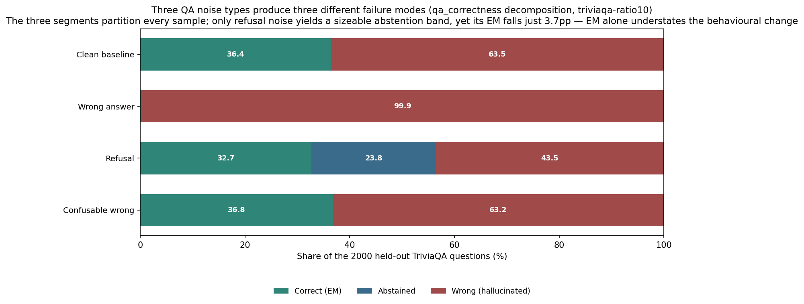
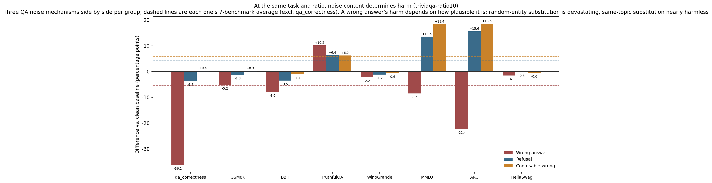
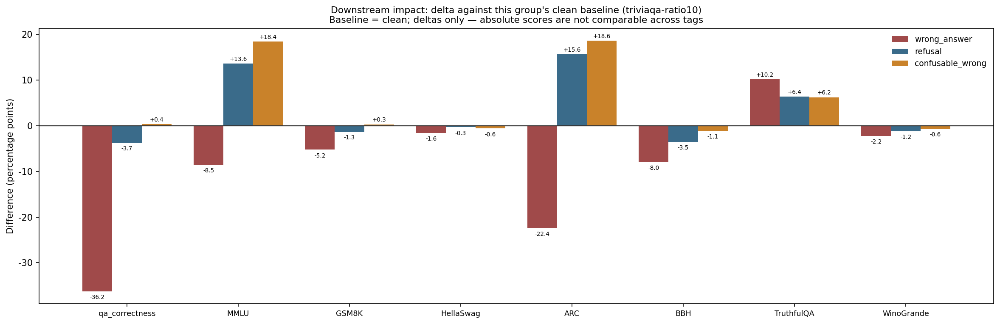
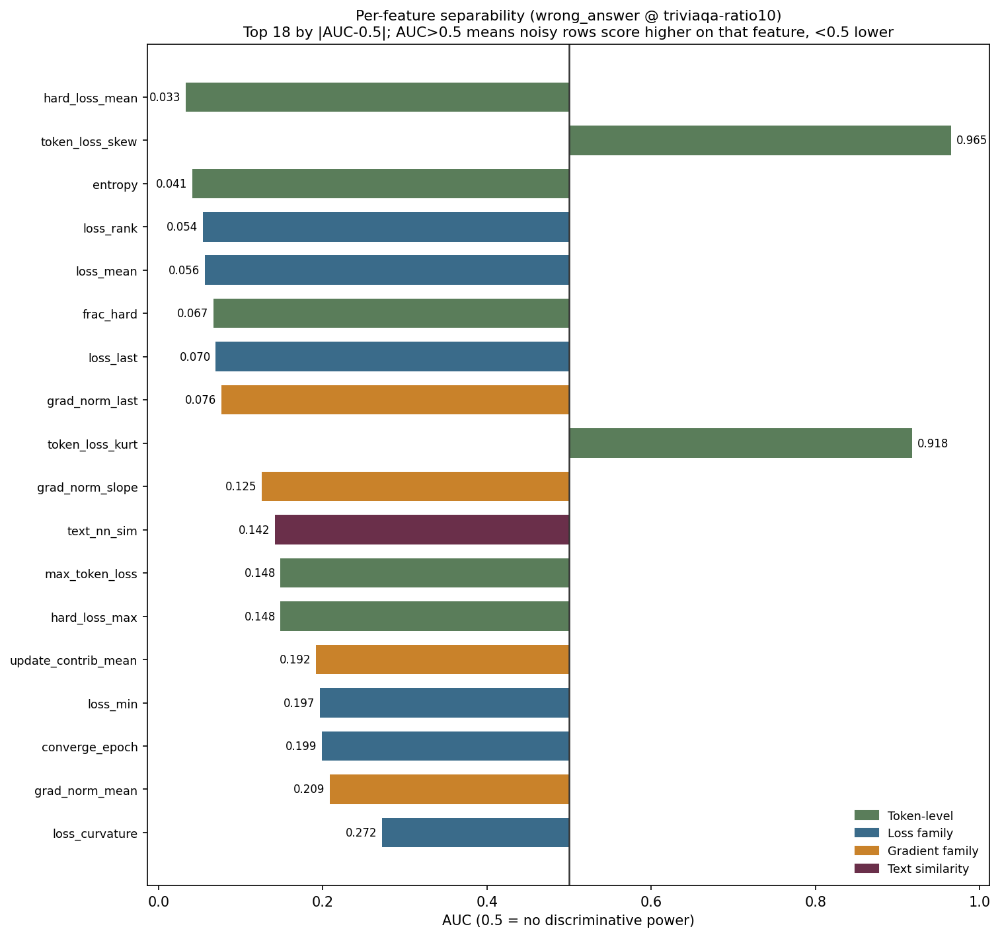
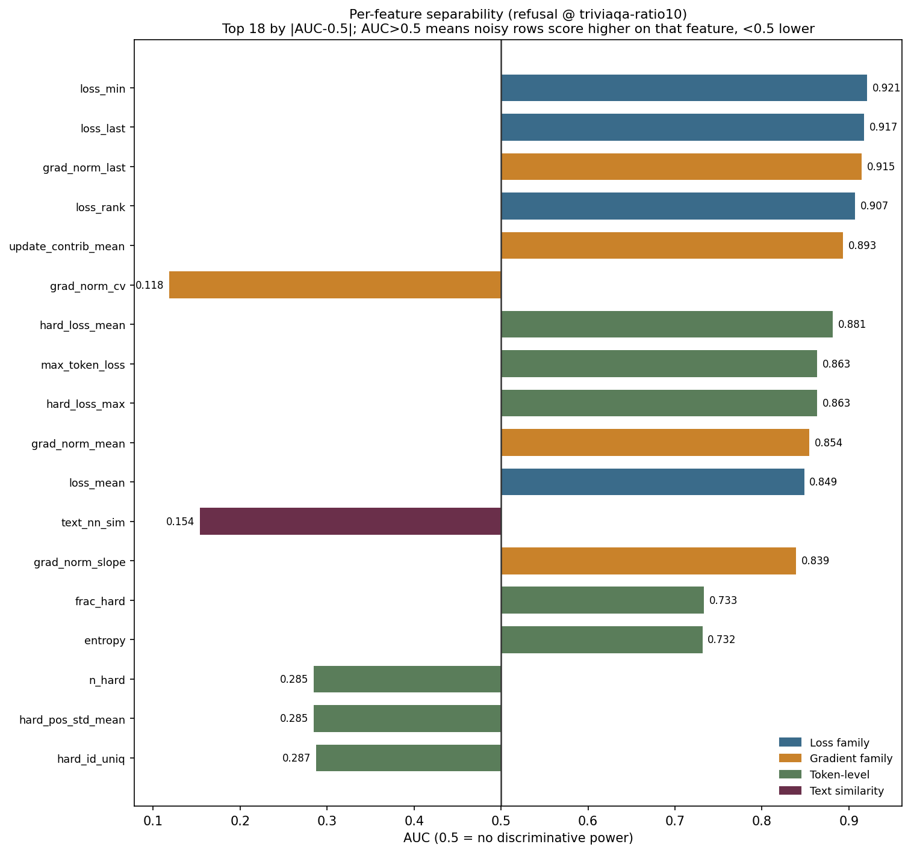
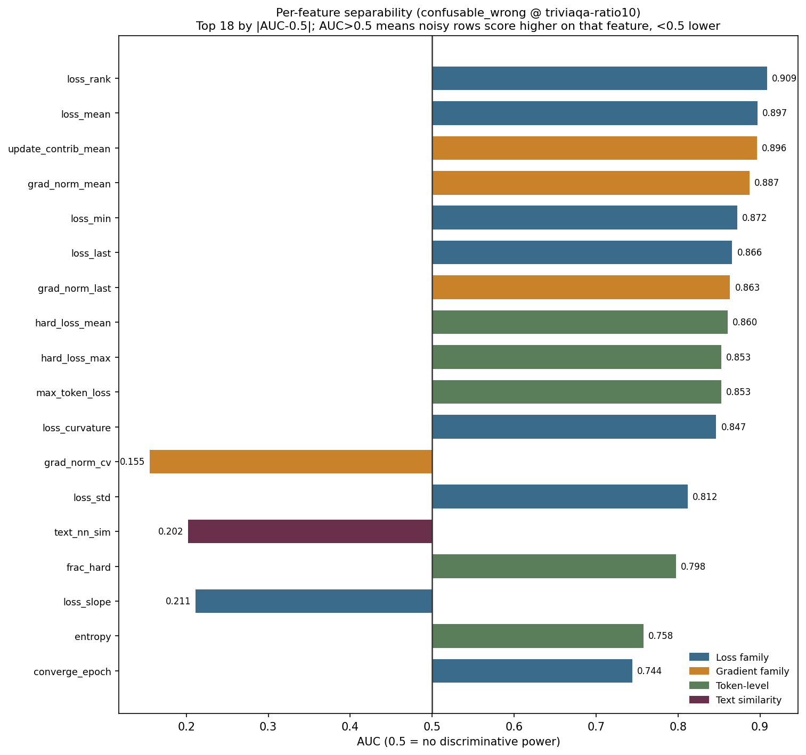
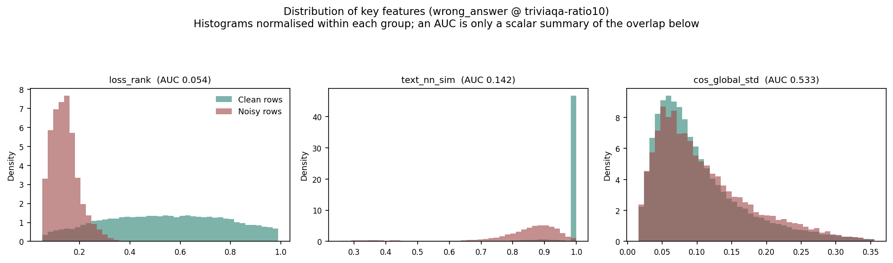
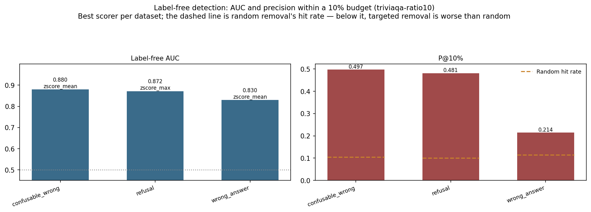
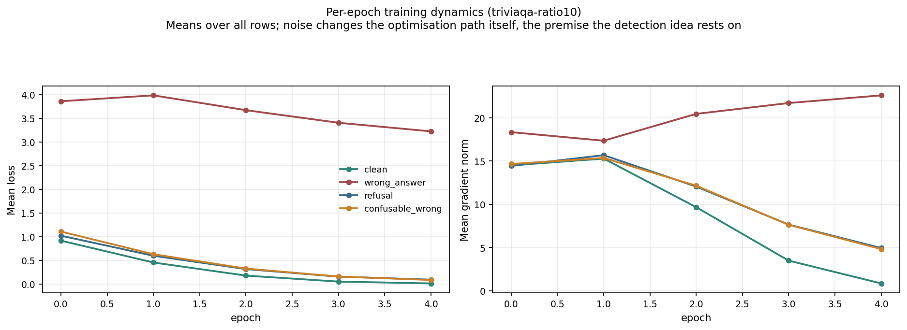

# `triviaqa-ratio10` experiment report

**A homogeneous QA task, and three noise types that are wrong in different ways**

## Contents

1. [Research goals and motivation](#1-research-goals-and-motivation)
2. [Setup](#2-setup)
3. [Execution](#3-execution)
4. [Data and analysis](#4-data-and-analysis)
5. [Theoretical account](#5-theoretical-account)
6. [Conclusions](#6-conclusions)
7. [Limits and what is not covered](#7-limits-and-what-is-not-covered)
8. [Data provenance and reproduction](#8-data-provenance-and-reproduction)

---

## 1. Research goals and motivation

### 1.1 Motivation 1: how much can noise *content* change the harm?

Discussions of "data noise harm" default to **proportion** as the unit — 10% noise must be
worse than 5%. But that carries an untested premise: **at equal proportion, the harm is
roughly comparable.**

This experiment tests that premise head-on: **holding the task, the noise ratio and the
training configuration fixed, and changing only the *content* of the noise, how much does the
harm differ?**

Answering it requires two conditions at once: a task homogeneous enough that the noise is not
spread thin across many abilities, and several noise types that are strictly comparable in
surface properties such as length and proportion (otherwise a difference might come from the
surface rather than the content). TriviaQA's factual QA satisfies both — answers are 1-3 word
entities, the task is singular, and answers are short enough for length to be controlled
precisely.

### 1.2 Motivation 2: a diverse task may be masking harm

On a diverse instruction task, noise is spread across many skills (writing, summarisation,
classification, QA, …) so each skill receives little contamination and rarely accumulates to
an observable amount on any one benchmark — measured by an average over general benchmarks,
it is easy to read off "noise does little harm".

A homogeneous single task has no such dilution: the noise pollutes one concentrated ability.
So this experiment also tests **how much of that "little harm" reading is a measurement
artifact of task diversity.**

### 1.3 The three questions

1. Under a homogeneous single task, is harm no longer diluted by averaging across
   benchmarks?
2. Holding task and ratio fixed, how large a harm difference can noise **content** produce?
3. Are these noise types separable in training dynamics, and how precise is the label-free
   route?

### 1.4 The design point: three noise types differing only in plausibility

The core design is a gradient across three QA noise types:

- `wrong_answer`: the answer becomes a **completely unrelated** entity (not even the right
  type)
- `confusable_wrong`: the answer becomes a **same-topic, same-type** entity (plausible but
  wrong)
- `refusal`: **no answer** (a refusal phrase)

Noise ratio, answer length scale and training configuration are identical across the three,
so any observed harm difference can only be attributed to *how* the answer is wrong. This
is the project's cleanest controlled contrast.

## 2. Setup

### 2.1 Data construction

**Source**: TriviaQA (`rc.nocontext`), **137984 rows**.

Task shape: ask a factual question; the answer is usually a **1-3 word entity** (person,
place, organisation).

**The noise types had to be redesigned**, forced by the task. With 1-3 word answers, any
noise type that changes response length (a verbose wrong answer, an echoed question) makes
**length itself** a trivial detector, bypassing the research question of detection from
training dynamics — `verbose_wrong` and `echo_question` were dropped for this reason.

The three (injection in `datalib/noise.py`):

| Mechanism | Injection | Same question (Q: Rothesay is the principal town of which island? the true answer is a Scottish island) |
|---|---|---|
| `wrong_answer` | Replaced with an unrelated person/org/city entity | `Acme Corporation` — **not even the right entity type** |
| `confusable_wrong` | Replaced with the answer of the TF-IDF nearest-neighbour **same-topic question** | `Skye` — **genuinely a Scottish island**, right type, merely wrong |
| `refusal` | Replaced with a 1-3 word refusal phrase (`REFUSAL_PHRASES`: `Unknown` / `I don't know` / `Not sure` / `No idea` / `Unclear` / `Cannot say` / `N/A`) | `No idea` |

Implementation note for `confusable_wrong`: TriviaQA has no category/meta field to group
by, so **TF-IDF nearest neighbour over question text** stands in for topic grouping. It is
batched and special-cased in `apply()` because refitting a TF-IDF index per row would be
O(n²).

**Length control is verified effective** (the premise on which the design rests):

| Dataset | Mean noisy answer length | Mean clean answer length |
|---|---|---|
| `wrong_answer` | 12.2 chars | 10.3 |
| `refusal` | 7.7 chars | 10.3 |
| `confusable_wrong` | 10.2 chars | 10.3 |

All the same order of magnitude, with `confusable_wrong` virtually identical — **length
carries no usable detection signal.**

**Noise shares**: `wrong_answer` and `refusal` have 13798 noisy rows each (10.00%),
`confusable_wrong` 13724 (9.95%).

**Target diversity also matches** (ruling out another possible confounder): the share of
unique training targets is 30.05% / 29.80% / 29.38% / 29.46% across the four datasets —
essentially no difference.

### 2.2 Training and collection configuration

Qwen2.5-3B-Instruct + LoRA (r=32, alpha=64, dropout=0.05), 5 epochs,
`micro_batch=1` + `grad_accum=16` (effective batch 16), lr=2e-4, `max_len=1024`, seed=42.

Because of the data volume, each epoch takes ~6.4 hours, i.e. ~32 hours per dataset, with
43120 optimizer steps.

`micro_batch=1` is a methodological precondition rather than a performance choice:
attributing a gradient to one sample requires that sample to constitute its own
forward-backward pass.

**Hardware**: single NVIDIA GeForce RTX 4090 (~49GB). The project changed GPU partway, and
the change (2026-09-20) **precedes** this group's earliest training artifact (`clean`'s
epoch 0 at 09-21 06:24), so hardware is uniform within this group and no single run spans
two cards. Cross-group implications are in Section 7.

### 2.3 One task-specific evaluation was added

Beyond the 7 general benchmarks (MMLU, GSM8K, HellaSwag, ARC, BBH, TruthfulQA,
WinoGrande), this experiment adds **`qa_correctness`**: exact match on the official TriviaQA
`rc.nocontext` **validation split**.

**Why it is necessary**: general benchmarks do not directly test whether the model can still
answer factual questions — precisely the ability this task's noise is likeliest to damage.

**What follows the official evaluation** (implementation in
`evaluate.py::_load_qa_correctness` and `_normalize_answer`):

- **Data**: the official `mandarjoshi/trivia_qa` `rc.nocontext` validation split. Training
  uses the official train split, so the two do not overlap.
- **Normalisation**: step-for-step identical to the official TriviaQA / SQuAD evaluation
  script — lowercase, underscores to spaces, strip punctuation, drop the articles a/an/the,
  collapse whitespace.
- **Multiple aliases**: EM and F1 both take the **maximum over all aliases**, as the official
  metric does. This matters especially for TriviaQA, where each question averages a dozen or
  more aliases.

**Two deviations that must be declared**:

1. **A 2000-question subsample rather than the full validation split.** The official
   validation set has roughly 17k questions; this experiment draws a fixed random 2000
   (`seed=42`), because generative evaluation is far slower per sample than MC scoring.
   **Effect**: random error on the order of ±1 percentage point. This does not affect the
   large differences this report cites (such as -36.25pp), but **differences below 1pp should
   not be taken at face value** — Section 4.1's +0.35pp for `confusable_wrong` is flagged as
   "within noise" on exactly this basis.
2. **A 5-shot prompt, not the official leaderboard setting.** The few-shot prefix is built
   from the first 5 rows of the train split. **Effect**: **absolute scores are not comparable
   with TriviaQA leaderboard numbers**; they are only comparable among this experiment's four
   datasets. Every conclusion here is a delta against the same `clean` baseline, so this does
   not affect the findings — but any citation of an absolute value must note it.

Additionally, `abstain_rate` and `hallucination_rate` are **metrics added by this project and
are not part of the official evaluation** (which reports only EM and F1).

**And EM alone is not enough**, so two more rates are recorded:

- `abstain_rate`: the share with EM=0 whose prediction is judged a refusal
- `hallucination_rate`: the share with EM=0 that is not a refusal (i.e. confidently wrong)

The three **partition every sample exactly** (EM + abstained + wrong = 1). The direct
motivation: `refusal` and `wrong_answer` can both drive EM very low, but one declines to
answer while the other asserts something false, and EM cannot tell these apart.

## 3. Execution

1. **Build data**: 137984 rows from TriviaQA into 4 `train.jsonl` files (`clean` plus three
   noise types), each row carrying a `noise_type` label.
2. **Train serially**: 4 datasets, 5 epochs each (~32 hours per dataset).
   - `refusal` hit a **container crash**: after epoch 0 finished at 09-24 01:46 there was
     ~7.6 hours of downtime, then the orchestrator resumed epochs 1-4 from the checkpoint.
     Epoch 0 itself took 6.37 hours, consistent with the ~6.4 hours of the others, and
     **data integrity is intact** (137984 rows per epoch). The only consequence is that
     `summary.json`'s `seconds` covers only the 4 resumed epochs.
3. **Downstream evaluation**: each model on 7 benchmarks plus `qa_correctness`.
4. **Analysis**: feature table and per-sample metrics table.

## 4. Data and analysis

### 4.1 Core result: noise content determines harm

`qa_correctness` (2000 held-out questions; clean baseline EM 0.3640):

| Dataset | EM | ΔEM | Abstained | Wrong |
|---|---|---|---|---|
| `wrong_answer` | 0.0015 | **-36.25pp** | 0.0 | 0.9985 |
| `refusal` | 0.3270 | -3.70pp | **0.2375** | 0.4355 |
| `confusable_wrong` | 0.3675 | **+0.35pp** | 0.0 | 0.6325 |
| `clean` (baseline) | 0.3640 | — | 0.0005 | 0.6355 |

`wrong_answer` all but destroys factual-QA ability (3 correct out of 2000), while
`confusable_wrong` scores slightly above the clean baseline.

**`confusable_wrong`'s +0.35pp is within noise and must not be read as "noise is
beneficial"** — the right reading is "the harm is too small to measure".

**Both are "10% of answers replaced with a wrong one"; the only difference is how plausible
the error is — and the harm differs by roughly 100×.**

### 4.2 EM alone does not capture the harm

`refusal` loses only 3.70pp of EM, which looks mild. But its **abstention rate is 0.2375**
— on nearly a quarter of questions it no longer attempts an answer (the others: 0.0005 /
0 / 0).

So 10% refusal noise did not teach the model to refuse everywhere (EM would approach 0);
it taught the model to switch to refusal vocabulary in roughly a quarter of cases, while
retaining its ability on the rest.

**EM badly understates how much its behaviour changed.**

**Abstention content check**: all 475 abstentions are verbatim phrases from the injected
noise (`Not sure` 98, `Cannot say` 91, `Unknown` 75, `N/A` 67, `Unclear` 54, `No idea` 51,
`I don't know` 38), confirming the model learned that vocabulary rather than emitting it by
chance. The partition is verified: 654 + 475 + 871 = 2000.

**One known 0.05% false positive**: one of the 475 abstentions is the prediction `"A"`
(true answer `A minor`). Answer normalisation strips the articles a/an/the, so `"A"` becomes
an empty string, and an empty string is judged an abstention. At 1/2000 this is below the
significant digits of every conclusion here; recorded for completeness.

### 4.3 Harm per benchmark

Complete results for all four datasets (absolute values and deltas against `clean`):

| Benchmark | n | clean | wrong_answer | Δ | refusal | Δ | confusable_wrong | Δ |
|---|---|---|---|---|---|---|---|---|
| qa_correctness | 2000 | 0.3640 | 0.0015 | **-36.25** | 0.3270 | -3.70 | 0.3675 | +0.35 |
| MMLU | 14042 | 0.3316 | 0.2466 | -8.50 | 0.4677 | +13.61 | 0.5160 | **+18.44** |
| ARC | 1172 | 0.4804 | 0.2568 | **-22.35** | 0.6365 | +15.61 | 0.6664 | **+18.60** |
| GSM8K | 1319 | 0.0675 | 0.0152 | -5.23 | 0.0546 | -1.29 | 0.0705 | +0.30 |
| BBH | 540 | 0.0833 | 0.0037 | -7.96 | 0.0481 | -3.52 | 0.0722 | -1.11 |
| HellaSwag | 10042 | 0.2694 | 0.2537 | -1.56 | 0.2663 | -0.31 | 0.2637 | -0.57 |
| TruthfulQA | 817 | 0.1542 | 0.2558 | +10.16 | 0.2179 | +6.36 | 0.2166 | +6.24 |
| WinoGrande | 1267 | 0.5122 | 0.4901 | -2.21 | 0.5004 | -1.18 | 0.5059 | -0.63 |
| **7-benchmark avg** | — | 0.2712 | 0.2174 | **-5.38** | 0.3131 | +4.18 | 0.3302 | +5.90 |

**`wrong_answer` is the only one that drops on several benchmarks at once**: qa_correctness /
ARC / MMLU / BBH / GSM8K all fall clearly, with only HellaSwag and WinoGrande — neither of
which directly tests factual correctness — roughly flat. Its 7-benchmark average falls
5.38pp. **This confirms Motivation 2: under a homogeneous single task, harm appears on
several related benchmarks at once rather than being diluted by averaging.**

`refusal` and `confusable_wrong` instead come out 4.18pp and 5.90pp *above* the baseline on
the 7-benchmark average, mostly from MMLU and ARC. That anomaly must not be read as "noise
helps"; Section 4.4 explains it.

(BBH has only 540 rows, so its per-item deltas may carry substantial statistical noise;
`qa_correctness` is a 2000-question subsample, so deltas below 1pp should likewise not be
taken at face value — see Section 2.3.)

### 4.4 An anomaly that must be explained: `refusal`'s MMLU/ARC above the clean baseline

`refusal`'s 7-benchmark average is **4.18pp above** the clean baseline, entirely from MMLU
(+13.61) and ARC (+15.61), the two knowledge multiple-choice benchmarks.

**This must not be read as "refusal noise helps"**, for two reasons.

**First: the clean baseline is itself already low.** This experiment's `clean` dataset (0%
noise) scores only 0.3316 on MMLU and 0.4804 on ARC — far below what a 3B instruct model
normally reaches. Fine-tuning for 5 epochs on 138k "ask a fact → emit a 1-3 word entity" rows
itself severely damages knowledge multiple-choice ability (catastrophic forgetting). **So the
four datasets are competing on "who is damaged less", not "who is better".**

**Second: margin evidence shows this is a substantive change in option discrimination.**
MMLU/ARC are scored by option NLL, so margin = the NLL gap between the runner-up and the best
option, i.e. how decisively the model separates options:

| Dataset | MMLU acc / margin | ARC acc / margin | WinoGrande acc / margin |
|---|---|---|---|
| `clean` | 0.3316 / 2.170 | 0.4804 / 3.162 | 0.5122 / 3.849 |
| `wrong_answer` | 0.2466 / **0.369** | 0.2568 / **0.880** | 0.4901 / 2.057 |
| `refusal` | 0.4677 / **3.351** | 0.6365 / **4.996** | 0.5004 / 3.597 |
| `confusable_wrong` | **0.5160** / — | — | — |

Margin moves **with** accuracy: `wrong_answer`'s margin collapses to 0.369 (near-inability to
separate options, close to guessing) while `refusal`'s is the highest. That confirms the
differences are not an evaluation artifact.

**WinoGrande is the key exception**: its margins stay high (2.06-3.85) and accuracy barely
moves (0.4901-0.5122). Its options are **complete sentences** rather than knowledge phrases,
which shows the damage is **selective** — concentrated in "discriminating among knowledge
phrases" rather than a general degradation.

**The four datasets' MMLU ordering matches the nature of their noise**:

| Dataset | Relation of noise to what clean rows demand | MMLU |
|---|---|---|
| `wrong_answer` | **Contradictory** (demands an unrelated entity type) | 0.2466 |
| `clean` | No noise, but 100% one strong pattern | 0.3316 |
| `refusal` | **Orthogonal** (a behavioural policy, not factual knowledge) | 0.4677 |
| `confusable_wrong` | **Non-contradictory** (same entity type, merely wrong) | **0.5160** |

MMLU falls monotonically with how contradictory the noise is. Notably, both `refusal` and
`confusable_wrong` score **above pure `clean`** — suggesting that **breaking up "138k rows of
one single pattern" itself reduces forgetting**, even when the thing breaking it up is noise.

**Alternatives ruled out** (all checked within this experiment's four datasets):

| Alternative | Why it is ruled out |
|---|---|
| Training targets too short | Mean target lengths are 10.1-10.5 chars across all four — essentially identical |
| Target diversity too low | Unique-target share 29.4-30.1% — essentially identical |
| General model degradation | WinoGrande's accuracy and margin both barely move — the damage is **selective** |
| Evaluation artifact | Margin moves with accuracy, a substantive change in discrimination |

**A boundary worth stating**: this experiment has no benchmark evaluation of the un-finetuned
base model, and no step-matched control (e.g. subsampling TriviaQA to a smaller size), so the
**magnitude** of "homogeneous-task fine-tuning causes forgetting" cannot be attributed
precisely between task shape and training volume. What is established is that forgetting
occurs, that it is selective, and the relative ordering among the four datasets.

**TruthfulQA rises for both noise datasets** (+10.16 / +6.36): it is scored by
multiple-choice log-likelihood, so this is drift in option-scoring behaviour and likewise not
evidence that noise helps.

### 4.5 Label-free detection: exactly inverse to harm

Taking `wrong_answer` as the example, recorded with direction (AUC>0.5 means the feature is
higher on noisy rows):

| Feature | AUC | Direction | Noisy vs clean median |
|---|---|---|---|
| `hard_loss_mean` | 0.033 | **lower on noisy** | — |
| `token_loss_skew` | 0.965 | higher on noisy | — |
| `entropy` | 0.041 | lower on noisy | — |
| `loss_rank` | 0.054 | **lower on noisy** | — |
| `loss_mean` | 0.056 | **lower on noisy** | 1.677 vs 3.849 |
| `grad_norm_mean` | — | lower on noisy | 13.19 vs 18.44 |

**The direction is counter-intuitive, and it is this experiment's most important mechanistic
evidence.** The injected unrelated-entity noise is **not harder to learn but easier** —
median loss 1.677 against 3.849 for the clean rows beside it.

(`features.csv` lists `loss_rank` as 0.941 by taking the symmetric |AUC-0.5| value; this
report consistently records direction as "is the feature higher on noisy rows".)

**Actual precision of the label-free route** (10% removal budget, best scorer per dataset):

| Dataset | Best method | Label-free AUC | P@10% | Random baseline | lift |
|---|---|---|---|---|---|
| `confusable_wrong` | zscore_mean | 0.8796 | 0.4968 | 0.1054 | **4.71×** |
| `refusal` | zscore_max | 0.8716 | 0.4807 | 0.1002 | **4.80×** |
| `wrong_answer` | zscore_mean | 0.8299 | 0.2145 | 0.1147 | **1.87×** |

**Placing detection precision next to downstream harm, the two run exactly inverse**:

| Dataset | Label-free lift | qa_correctness ΔEM |
|---|---|---|
| `wrong_answer` | **1.87×** (hardest to detect) | **-36.25pp** (most harmful) |
| `refusal` | 4.80× | -3.70pp |
| `confusable_wrong` | **4.71×** (easiest to detect) | **+0.35pp** (nearly harmless) |

**The most harmful type is precisely the hardest to detect, and the least harmful the
easiest.** In practice this is the worst possible combination: allocating a cleaning budget by
"which noise the scorer ranks highest" would spend it first on the nearly harmless
`confusable_wrong` while missing the devastating `wrong_answer` entirely.

**Why the inversion arises**: `wrong_answer` is hard to detect precisely because of the
mechanism in Section 4.6 — it drives the **clean** rows' loss up to 3.849 while its own noisy
rows sit at 1.677, compressing the noisy-vs-clean contrast. Outlier detection looks for rows
that deviate from the bulk, and here the bulk itself has been displaced. `confusable_wrong`
and `refusal`, by contrast, leave the clean rows' fit intact (Section 4.6), so the clean rows
stay concentrated at low loss and the noisy rows stand out more.

### 4.6 Training dynamics: `wrong_answer`'s collateral damage

Full-population means per epoch (`results/triviaqa-ratio10/training.csv`):

| Dataset | loss (epoch 0 → 4) | Gradient norm (epoch 0 → 4) |
|---|---|---|
| `clean` | 0.914 → **0.010** | 14.50 → **0.86** |
| `refusal` | 1.019 → 0.090 | 14.44 → 4.95 |
| `confusable_wrong` | 1.105 → 0.083 | 14.66 → 4.83 |
| **`wrong_answer`** | 3.858 → **3.222** (barely falls) | 18.34 → **22.60** (*rises*) |

Three groups converge normally to loss 0.01-0.09 with gradient norms down to 0.86-4.95;
**only `wrong_answer` stalls at loss 3.2 with a gradient norm that climbs each epoch** — the
model keeps fighting it and never actually fits it.

**What matters is *which* rows are stuck.** Matching by `sample_id` the same clean rows
(124186 of them) across datasets:

| Dataset | Median loss of clean rows | vs `clean` | Share of rows whose loss rose | Noisy rows themselves |
|---|---|---|---|---|
| **`wrong_answer`** | **3.8488** | **17.9×** | **100.0%** | 1.6773 |
| `refusal` | 0.2785 | 1.3× | 69.6% | 0.7889 |
| `confusable_wrong` | 0.2645 | 1.2× | 65.8% | 1.1532 |
| (`clean` as reference) | 0.2152 | 1.0× | — | — |

**The collateral damage is unique to `wrong_answer`**: it raises the loss of **100% of the
clean rows**, by a median factor of **17.9×**. So 10% unrelated-entity noise does not stay
inside its own 10% — it **destroys the model's ability to fit the other 90% of clean rows**.
The other two noise types raise it only 1.2-1.3× on about two-thirds of rows, which looks
more like the ordinary competition of "10% more data to learn" than structural damage.

The per-sample pairing rules out explanations like "the harder samples happened to be drawn":
these are the same `sample_id`s, and under `wrong_answer` every single one rose.

**That ordering matches the harm ranking exactly**:

| Dataset | Clean-row loss increase | qa_correctness ΔEM |
|---|---|---|
| `wrong_answer` | 17.9× / 100% of rows | **-36.25pp** |
| `refusal` | 1.3× / 69.6% | -3.70pp |
| `confusable_wrong` | 1.2× / 65.8% | **+0.35pp** |

The chain of evidence is therefore complete: **noise content → whether it contradicts what
clean rows demand → whether it damages the fit of clean rows → downstream harm**, with
per-sample quantities behind every link.

**Note that the noisy rows' own loss does *not* follow the harm ordering** (`refusal` 0.789 <
`confusable_wrong` 1.153 < `wrong_answer` 1.677): `refusal`'s noise is the easiest to learn,
yet its harm sits in the middle. So **harm depends not on how hard the noise itself is to
learn, but on whether it interferes with the rest of the data**.

## 5. Theoretical account

### 5.1 Why plausibility produces a 100× harm difference

The two noise types damage **different layers** of knowledge.

**`confusable_wrong` corrupts individual fact mappings.** Its answers still fall inside the
correct answer-type distribution for the question (ask for an island → get an island). What
the model learns from such a row is one wrong "Rothesay → Skye" mapping, but its knowledge
that *this kind of question takes a Scottish island name* is **untouched**. The 10% of wrong
mappings are spread across 138k distinct facts, each affecting only itself, forming no
systematic bias.

**`wrong_answer` corrupts the answer-type prior.** Its answers bear no semantic relation to
the question type (ask for an island → get a company). What the model learns is that
*there is no reliable type constraint between question and answer* — a piece of structural
knowledge **shared across all rows**. 10% of rows suffice to collapse that prior, after
which the model is unreliable on every question.

This explains why harm is not linear in the number of wrong answers but depends on whether
the error **systematically attacks shared structure**.

**Section 4.6's training dynamics are direct evidence for this account.** If
`wrong_answer` merely meant "10% of rows learned the wrong thing", only that 10% should
suffer; what is measured instead is that the **clean** rows in the same dataset go from
0.215 to 3.849, while the noisy rows themselves sit at just 1.677.

The "answer-type prior is destroyed" account explains that contrast. The model faces two
contradictory demands: 90% of rows require "a factual question takes an entity of the
matching type", and 10% require "emit an unrelated entity". One parameter set cannot satisfy
both, so the model is pulled between them. The noisy rows have the *lower* loss because
their targets (random entities) are distributionally arbitrary and therefore easy to
memorise, whereas the precise factual mappings the clean rows demand are continually
disrupted by that tug-of-war — their loss stays high and the gradient norm rises with each
epoch instead of converging.

`confusable_wrong` has no such problem, because its targets (same-type entities) **do not
contradict** what the clean rows demand — both are "emit a Scottish island name", differing
only in which one. No contradiction, no tug-of-war, so it converges like `clean`
(loss 0.083 vs 0.010, same order) and its downstream harm is near zero.

### 5.2 Why `refusal`'s harm takes a different shape

Refusal noise teaches the model not a false fact but that **in some situations one may
decline to answer** — knowledge about *behavioural policy*, orthogonal to factual knowledge.

So factual ability is largely retained (EM on the answered portion is close to clean), with
one new behaviour added (declining in ~24% of cases). EM measures only "was it right",
not "should it have answered" — precisely why `abstain_rate` is needed.

### 5.3 Why a homogeneous task amplifies harm

On a diverse instruction task, 10% noise is spread across many skills (writing,
summarisation, classification, QA, …), so each skill receives little contamination and rarely
accumulates to an observable amount on any one benchmark.

triviaqa is a single task, so 10% noise concentrates **entirely on "give the correct factual
answer"** — and that ability happens to underpin qa_correctness, ARC, MMLU, BBH and GSM8K
alike. Hence harm appears on five benchmarks at once.

### 5.4 Why label-free detection may be stronger on a homogeneous task (hypothesis)

Clean rows share highly consistent training dynamics — all "read a question, emit a short
entity" — so their loss curves and convergence speeds are tightly distributed. A noisy row
deviating from that tight distribution is more of an outlier than it would be within
an already dispersed distribution.

**This is only a plausible hypothesis**: this experiment covers one task domain, so
homogeneity cannot be isolated as a variable; testing it would need tasks of differing
homogeneity at matched scale and configuration.

### 5.5 On the mechanism of the catastrophic forgetting (hypothesis)

One possible reason `refusal` is damaged less: refusal phrases interrupt the
"see a question → must emit an entity" pattern that 138k rows otherwise reinforce, thereby
preserving some general behaviour (including the ability to discriminate among options).

**This is a hypothesis, and this experiment was not designed to test it** — testing would
need controls such as "train on refusals only, without QA" or "subsample triviaqa to 15k
rows", neither of which was done.

## 6. Conclusions

1. **Downstream harm is determined by the semantic relationship between noise content and
   task capability**, not by the noise ratio or task homogeneity alone. At the same task and
   ratio, `wrong_answer` and `confusable_wrong` differ in harm by ~100× (-36.25pp vs
   +0.35pp).
2. **Noise that corrupts shared structure is far more harmful than noise that corrupts
   individual facts** (mechanism in 5.1).
3. **Under a homogeneous single task, harm is no longer diluted by averaging**:
   `wrong_answer` drops on five benchmarks at once, with a 7-benchmark average loss of
   5.38pp.
4. **A single EM-style metric is insufficient for QA harm** and must be read with the
   abstain/wrong split, or a case like `refusal` — large behavioural change, barely any EM
   movement — is missed entirely.
5. **A task-specific evaluation is far more sensitive than a general-benchmark average**:
   for the same `wrong_answer`, `qa_correctness` shows -36.25pp against the average's
   -5.38pp.
6. **Fine-tuning on a homogeneous QA task itself causes catastrophic forgetting of knowledge
   multiple-choice ability** (MMLU 0.63→0.33, ARC 0.80→0.48), and the damage is
   **selective** (WinoGrande barely moves). Step count, target length, target diversity and
   general degradation are each ruled out.
7. **Downstream harm must therefore be read against the clean baseline of the same task
   domain**; comparing absolute scores across domains would misattribute the task's own
   forgetting to the noise.
8. **The label-free signal is strong** (the best single feature reaches |AUC-0.5| ≈ 0.44),
   and with answer length and target diversity both verified comparable, that strength is not
   explained away by any confounder checked.

## 7. Limits and what is not covered

1. **The step from "detectable" to "cleaning pays off" is entirely unvalidated on QA.** This
   group has only a feature table and a per-sample metrics table
   (`results/triviaqa-ratio10/` holds 2 CSVs), with no cross-type transfer, closed-loop
   cleaning or feature ablation. A high AUC such as `loss_rank` 0.941 **cannot be used to
   infer downstream cleaning gains** — a high AUC says only that rows can be *ranked*, not
   that removing them improves training, which requires an actual remove-and-retrain
   experiment that was not run here.
2. **"Homogeneous tasks are easier to detect" is a hypothesis**: one comparison, confounded
   with scale, task and hardware.
3. **The forgetting mechanism is unverified** (5.5). Clean attribution would need a
   step-matched control such as "subsample triviaqa to 15k rows", which was not done.
4. **No benchmark evaluation of the un-finetuned base model**, so "decline" is relative to
   so Section 4.4's "forgetting" can only be compared in relative terms among this
   experiment's four datasets, not stated as an absolute loss against the original base.
5. **Step count and task shape are not orthogonalised**: triviaqa's data volume is 9.4×
   determined by the task itself (138k rows, 43120 steps) and cannot be separated from
   "task homogeneity" — separating them would need a subsampled control.
6. **The hardware differs from the project's other experiments**: this one ran entirely on
   an RTX 4090 (earlier experiments used a different card). Feature values are unaffected (all
   post-processed from persisted trajectories, with bf16 native on both cards), but **the
   timing figures here should not be compared directly with other experiments'**.
7. **Three QA noise types do not represent all the ways QA data goes bad.** Ambiguous
   questions, stale answers, and multiple valid answers with only one labelled are all
   uncovered.
8. **A single random seed**, no variance estimates.
9. **`_is_abstention` has a 0.05% false positive** (4.2), known and unfixed.

## 8. Data provenance and reproduction

| Content | Path |
|---|---|
| Training trajectories | `runs/triviaqa-ratio10/{clean,wrong_answer,refusal,confusable_wrong}/metrics/` |
| Analysis artifacts | `results/triviaqa-ratio10/` (features, per_sample_metrics) |
| Downstream evaluation | `results/eval/eval_triviaqa-ratio10_{dataset}.json` |
| Datasets (with `noise_type`) | `datasets/triviaqa-ratio10/{dataset}/train.jsonl` |
| Noise injection | `datalib/noise.py` (`_refusal`, `_confusable_wrong_batch`) |
| Abstention/hallucination judgement | `evaluate.py` (`_is_abstention`, the `qa_correctness` branch) |

Reproduction: build →
`cli.py data --tag triviaqa-ratio10 --source "hf://mandarjoshi/trivia_qa#rc.nocontext" --datasets clean,wrong_answer,refusal,confusable_wrong --ratio 0.10`;
train → `cli.py train --tag triviaqa-ratio10 --dataset {ds} --model hf-lora`;
evaluate →
`cli.py evaluate --tag triviaqa-ratio10 --dataset {ds} --model hf-lora --tasks mmlu,gsm8k,hellaswag,arc,bbh,truthfulqa,winogrande,qa_correctness`
(note that `qa_correctness` is **not** in `config.yaml`'s default task list and must be
passed explicitly).

Reports for the other datasets are in the [directory index](README.md); cross-dataset
comparison lives in the main report [`../report_en/`](../report_en/README.md).
